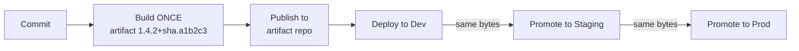
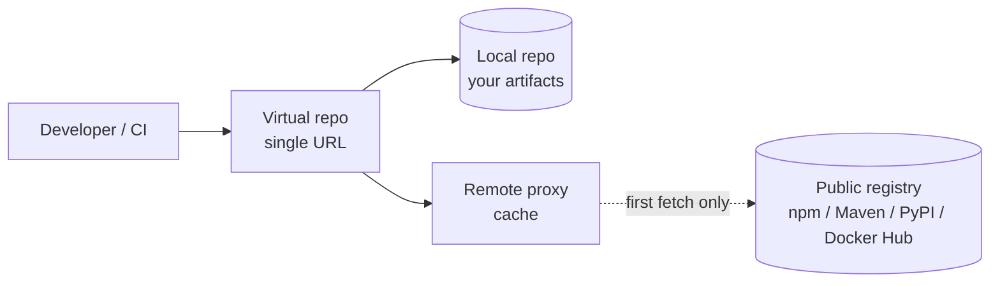

# Artifact & Dependency Management

This topic covers how a delivery pipeline **produces**, **stores**, **versions**, and
**promotes** the binary outputs of a build — the *artifacts* — and how it manages the
**dependencies** those builds consume. The two are deeply linked: an artifact is only as
trustworthy and reproducible as the dependencies that went into it.

The interview-grade throughlines here are: **build once, promote many** (the same bytes
flow through every environment), **immutability** (a published version never changes),
and **reproducibility** (the same source + locked dependencies produce the same artifact).
Get these three right and most of the operational pain — "works in staging, breaks in
prod", mystery dependency drift, un-auditable releases — disappears.

Boundaries: deep **SCA / vulnerability-scanning mechanics** live in
`devops-cicd/devsecops-and-pipeline-security`; **provenance, attestations, SLSA levels,
and signing** are owned by `devops-cicd/software-supply-chain-security`. This topic
references both where they intersect the artifact lifecycle but does not re-teach them.

> [!KEY-TAKEAWAY]
> Build the artifact **once**, give it an **immutable, unique version**, store it in an
> **artifact repository**, and **promote that exact artifact** (by digest/checksum, not by
> rebuilding) through dev → staging → prod. Pin dependencies with a **lockfile** for
> reproducibility, cache them in CI for speed, and proxy them through your own registry so
> a public outage or a deleted package can't break your build.

---

## Build artifacts and artifact repositories

A **build artifact** is the deployable output of a build step: a JAR/WAR, a Python wheel,
an npm tarball, a Go binary, a `.deb`/`.rpm` package, a container image, a Terraform
module, or a zipped Lambda bundle. It is distinct from **source code** (which lives in
Git) and from **dependencies** (inputs your build pulls in).

An **artifact repository** (a.k.a. binary repository or registry) is a purpose-built store
for these outputs. It is *not* Git and *not* an object store you hand-roll — it understands
package formats, versions, metadata, checksums, and retention.

| Tool | Strength / niche |
|---|---|
| **JFrog Artifactory** | Universal — many package types (Maven, npm, PyPI, Docker, Helm, Debian…), promotion, replication |
| **Sonatype Nexus Repository** | Popular OSS/self-hosted; strong Maven/npm/Docker support |
| **GitHub Packages** | Registry tied to GitHub repos/orgs; npm, Maven, NuGet, containers |
| **GitLab Package Registry** | Built into GitLab; per-project/group registries |
| **Container registries** | Docker Hub, Amazon ECR, Google Artifact Registry, GHCR — OCI images |
| **Cloud-native** | AWS CodeArtifact, Google Artifact Registry, Azure Artifacts |

Why a dedicated repository instead of "just Git" or a raw S3 bucket:

- **Format awareness** — it speaks the native protocol (a Maven client, `pip`, `docker
  pull` all just work against it) and exposes correct metadata/indexes.
- **Immutability & checksums** — every artifact has a stored checksum (SHA-256) so you can
  verify integrity and detect tampering.
- **Access control & audit** — who published/downloaded what, when.
- **Retention & cleanup** — policies to delete old snapshots without touching releases.
- **Proxying** — it can cache public registries (see *Package registries and proxies*).

> [!WARNING]
> Committing built binaries into Git is an anti-pattern: repos bloat, history becomes
> un-prunable, and you lose format-native tooling. Git is for source; artifact repos are
> for outputs.

---

## Immutable artifacts and versioning

An **immutable artifact** is one whose bytes never change once published under a given
version. If `my-service:1.4.2` exists, it means *exactly one* set of bytes, forever.
Republishing different content under the same version is forbidden (good repositories
reject it for release versions).

Immutability is the foundation of trust: it lets you reason that what you tested is what
you deploy, enables reliable rollback (redeploy the old version and get the old behavior),
and makes caching safe (a cached `1.4.2` is always correct).

**Semantic Versioning (SemVer)** — `MAJOR.MINOR.PATCH` (e.g. `2.7.1`):

- **MAJOR** — incompatible/breaking API changes.
- **MINOR** — new, backward-compatible functionality.
- **PATCH** — backward-compatible bug fixes.
- Optional **pre-release** (`1.0.0-rc.1`) and **build metadata** (`1.0.0+build.42` or
  `1.0.0+sha.a1b2c3`). Build metadata is ignored for precedence ordering.

**Worked example — ordering these five from lowest to highest:**
`1.0.0`, `1.0.0-rc.1`, `1.0.0+build.42`, `1.0.0-alpha`, `1.0.0-alpha.1`.

Apply the precedence rules step by step:

1. A version *with* a pre-release tag is **lower** than the same version without one, so all
   three `1.0.0-…` sort below the plain `1.0.0`.
2. Among pre-releases, compare the dot-separated identifiers left to right. `alpha` vs
   `alpha.1`: the first field (`alpha`) is equal, but `alpha.1` has an *extra* field, and "a
   larger set of fields wins when all preceding are equal" → `1.0.0-alpha` < `1.0.0-alpha.1`.
3. `alpha.1` vs `rc.1`: first field `alpha` vs `rc` compared as text → `alpha` < `rc`, so
   `1.0.0-alpha.1` < `1.0.0-rc.1`.
4. `1.0.0+build.42`: **build metadata is stripped before comparison**, so it has the *same*
   precedence as plain `1.0.0` (they are "equal" for ordering — the repo just won't let two
   builds actually share the `1.0.0` slot).

Final order:
`1.0.0-alpha` < `1.0.0-alpha.1` < `1.0.0-rc.1` < `1.0.0` **=** `1.0.0+build.42`.
This is exactly why an `rc` never accidentally outranks the real release, and why you can't
encode "which build won" in `+metadata` — it's invisible to the resolver.

For CI-built artifacts, a common scheme is `SemVer + build metadata`, e.g.
`1.4.2+2026.07.20.build.318` or embedding the Git commit SHA. The SHA ties the artifact
back to exact source. Many teams also tag images with the **immutable digest**
(`sha256:…`), which is content-addressed and cannot be moved.

**Mutable vs immutable tags** (containers especially):

- `latest` (or `stable`, or a bare `1`) is **mutable** — it can be re-pointed to different
  content at any time. Deploying `:latest` means you don't actually know what you're
  running, and two nodes pulling at different times can get different images.
- A fully-qualified immutable tag (`1.4.2`) or, best, a **digest** (`@sha256:…`) pins
  exact content.

> [!WARNING]
> Never deploy `:latest` to production. It defeats reproducibility, breaks rollback ("roll
> back to *what*?"), and causes drift between hosts. Pin to an immutable version or digest.

Registries can *enforce* immutability: ECR "tag immutability", Artifactory's block on
overwriting release versions, etc. **SNAPSHOT** versions (Maven) are the deliberate
exception — they are mutable-by-design pre-release builds and must never ship to prod.
Mechanically: each deploy of `1.4.2-SNAPSHOT` uploads a *new timestamped* artifact under the
covers (`1.4.2-20260720.101500-3`, `…-4`, …), and a client that asks for `1.4.2-SNAPSHOT`
resolves to the *newest* one. So two builds an hour apart can pull genuinely different bytes
under the same version string — the reason `-SNAPSHOT` is banned from anything you promote.

---

## Build once, promote many

**Build-once, promote-many** is the principle that an artifact is **built a single time**
and the *same binary* is moved through every environment (dev → QA/staging → prod). You do
**not** rebuild per environment.



Why it matters:

- **What you tested is what you ship.** If you rebuilt for prod, the prod binary was never
  the thing that passed staging tests — dependency versions, base images, or toolchain
  could differ, reintroducing "works on my machine" at the environment level.
- **Reproducibility of behavior**, not just of bytes: no surprise from a re-resolved
  transitive dependency between staging and prod.
- **Speed & cost** — build compute happens once, not N times.
- **Auditability** — one artifact, one provenance record, promoted with a paper trail.

The corollary is **configuration must be externalized** (12-Factor "Config"): the same
artifact behaves differently per environment via injected config/secrets/env vars, *not*
by baking environment values into the build. If you must build per-env, you've broken the
model.

> [!INTERVIEW]
> If asked "why not just build the artifact fresh for each environment?" — the answer is:
> you'd be deploying something you never tested. The staging binary and the prod binary
> would be different builds. Build-once-promote-many guarantees byte-for-byte identity from
> test to prod, which is the whole point of a pipeline.

---

## Artifact promotion across environments

**Promotion** is the act of advancing a *specific* artifact version from a lower
maturity/environment to a higher one, without changing its bytes. Mechanically it is
usually one of:

- **Repository/label promotion** — move or copy the artifact between repos or flip a
  status label: `dev-local` → `staging` → `release`, or Artifactory properties like
  `promotion.status=released`. The bytes and checksum are unchanged.
- **Tagging/immutable pointer** — apply an environment or channel tag/property to the exact
  version (or digest) that was approved.
- **GitOps promotion** — update the image tag/digest in a Git manifest, and the reconciler
  deploys it (see `devops-cicd/gitops`).

Design points interviewers probe:

- **Promote by digest/checksum, never rebuild.** Verify the SHA-256 matches what was
  tested. A promotion that recompiles is not a promotion.
- **Separate "release repositories" from "snapshot/dev repositories"** so only vetted
  artifacts land where prod can pull them.
- **Gates on promotion** — tests, approvals, security scans, and (for mature orgs) error
  budget / DORA signals gate the transition. Failing a gate blocks promotion but does not
  alter the artifact.
- **Quality/maturity labels** travel with the artifact so you always know its highest
  attained environment.

---

## Dependency management, lockfiles, and pinning

**Dependencies** are the external libraries and tools your build consumes. **Dependency
management** is controlling *which* versions you get, *deterministically*.

Two version-declaration styles:

- **Ranges / floating** — `^1.4.0` (npm caret: `>=1.4.0 <2.0.0`), `~=1.4` (Python),
  `1.4.+` (Gradle dynamic). Convenient, but non-deterministic: `install` on two days can
  resolve different patch versions.
- **Pinning** — an exact version (`1.4.2`). Deterministic but requires deliberate updates.

**Transitive dependencies** are the dependencies *of* your dependencies. They dominate the
tree (you might declare 10 and end up with 300). They are where surprises hide: a
transitive bump can change behavior or introduce a vulnerability you never chose directly.

You only *declared* `A`, but the resolver walks the whole graph — each node drags in its own
children, and the tree fans out fast:

```
your app (declares 1 direct dep: A)
└─ A@1.2.0            ← direct, pinned by lockfile
   ├─ B@3.1.0         ← transitive
   │  └─ D@2.0.4      ← transitive (depth 3)
   │     └─ E@1.0.7   ← transitive (depth 4)
   └─ C@0.9.2         ← transitive
      └─ D@2.0.4      ← shared node, resolved once
```

One declared dependency became **five** installed packages. Multiply that realistic
fan-out across 10 direct deps and "10 → 300" stops being hand-wavy. The lockfile pins
*every* node above (A, B, C, D, E) to an exact version+hash — not just the one you typed.

**Worked example — a floating range diverging overnight.** Your `package.json` declares
`"acme-lib": "^1.4.0"` (caret = `>=1.4.0 <2.0.0`). Registry state:

- **Monday build**: newest matching version published is `1.4.2`. `npm install` resolves
  `acme-lib@1.4.2` and writes it into `package-lock.json`.
- Overnight, upstream publishes `1.4.9` (still `<2.0.0`, so still in range).
- **Tuesday build on a teammate's laptop, no lockfile**: `^1.4.0` now resolves to
  `1.4.9` — a *different* artifact, silently, with no code change on your side. "Works on
  mine, breaks on yours."

With the committed lockfile + `npm ci`, both machines install exactly `1.4.2` regardless of
what published overnight; the range is only re-consulted when you deliberately run an update
and regenerate the lock. That is the whole point of pinning: the *range* says what's
*allowed*, the *lockfile* says what you *got*.

A **lockfile** records the *exact resolved version (and checksum)* of **every** dependency,
direct and transitive, so a later install reproduces the identical tree:

| Ecosystem | Manifest (what you want) | Lockfile (what you got) |
|---|---|---|
| npm | `package.json` | `package-lock.json` |
| Yarn | `package.json` | `yarn.lock` |
| pnpm | `package.json` | `pnpm-lock.yaml` |
| Python (pip-tools) | `requirements.in` | `requirements.txt` (pinned + hashes) |
| Python (Poetry) | `pyproject.toml` | `poetry.lock` |
| Ruby | `Gemfile` | `Gemfile.lock` |
| Rust | `Cargo.toml` | `Cargo.lock` |
| Go | `go.mod` | `go.sum` (+ module hashes) |

Rules of thumb interviewers expect:

- **Commit the lockfile** to Git. It is the contract for reproducible installs.
- **Use the CI install mode that honors the lockfile and fails on drift**: `npm ci` (not
  `npm install`), `pip install --require-hashes`, `poetry install` (not `poetry update`),
  `go mod verify`. `npm ci` deletes `node_modules` and installs the *exact* lockfile tree,
  erroring if `package.json` and the lockfile disagree.
- **Pin to at least the resolved version in the lockfile.** For applications, prefer exact
  builds; for *libraries*, declare ranges so consumers can resolve compatibly.
- **Dependency confusion / substitution**: if your private package name can also be
  resolved from a public registry, an attacker can publish a higher version publicly and
  hijack the resolve. Mitigate with scoped names, a proxy/virtual registry, and explicit
  source pinning. (Supply-chain deep dive:
  `devops-cicd/software-supply-chain-security`.)

**Worked example — how the hijack actually happens (and what stops it):**

1. Your internal registry hosts `acme-utils@1.2.0`. Your CI is configured with *two*
   sources — the internal registry **and** public npmjs.org — and simply picks the
   **highest version it can find, regardless of source**.
2. An attacker notices the name `acme-utils` is unclaimed publicly and publishes
   `acme-utils@99.0.0` to npmjs.org.
3. `npm install` compares candidates: internal `1.2.0` vs public `99.0.0`. `99.0.0` wins on
   version, so the *malicious* package is pulled — and its `postinstall` script runs on your
   build agent with your credentials.

Now map each mitigation to the step it breaks:

- **Scoped names** (`@acme/utils`): step 2 fails — an attacker can't publish under your
  registered `@acme` scope, so there's no higher public candidate to find.
- **Virtual repo with internal-first resolution**: step 1 fails — the resolver never even
  *sees* the public `99.0.0` for names that exist internally.
- **Explicit registry pinning** (per-scope registry in `.npmrc`): step 1 fails — `acme-*`
  is bound to the internal registry only, so public versions are out of scope entirely.

> [!TIP]
> `go.sum` and pip `--require-hashes` store cryptographic hashes, not just versions — so
> even if a registry serves tampered bytes for a pinned version, the install fails. Hashes
> upgrade a lockfile from "same version" to "same bytes".

### When dependencies conflict (the diamond problem)

The classic senior probe: your app pulls in `lib` **twice, at different versions**, through
two different paths. `X` needs `lib@1.2`, `Y` needs `lib@2.0`:

```
your app
├─ X@1.0 ─→ lib@1.2
└─ Y@1.0 ─→ lib@2.0
```

There is no universal answer — each ecosystem resolves it differently, and the *failure
mode* differs too:

- **npm/yarn — install both, nested.** `node_modules` can hold multiple copies: `lib@1.2`
  nested under `X`, `lib@2.0` nested under `Y` (npm hoists the most-common one to the top
  and nests the rest). Both callers get the version they asked for. Cost: duplicated code,
  larger installs, and two *different* singletons of the same module (a real bug source for
  things like `instanceof` checks across the two copies).
- **Maven — "nearest wins".** Only **one** version lands on the classpath: the one at the
  *shallowest* depth in the dependency tree (ties broken by declaration order). So if
  `lib@1.2` is one hop away and `lib@2.0` is two hops away, everyone gets `1.2` — including
  `Y`, which wanted `2.0`. It can **silently** ship an incompatible version; the classic
  runtime `NoSuchMethodError`. (`mvn dependency:tree` + `<dependencyManagement>` pins are how
  you take control.)
- **Python/pip — one global version.** A venv allows exactly **one** `lib`. The backtracking
  resolver searches for a single version satisfying *both* constraints; if `1.2` and `2.0`
  are mutually exclusive it **errors out** (`ResolutionImpossible`) rather than guessing.
  Loud, but you can't proceed until you reconcile.
- **Go — Minimal Version Selection (MVS).** Go picks the **highest of the minimum** versions
  required. If `X` needs `≥1.2` and `Y` needs `≥2.0`, MVS selects `2.0` (the highest floor).
  It never jumps to a newer `2.1` just because it exists — you get the lowest version that
  satisfies everyone, deterministically. This is *why* `go.sum` gives reproducible builds
  without a separate lock/update step: resolution is a pure function of the `go.mod`
  requirements, not "whatever was newest the day you ran install."

The takeaway interviewers want: **npm duplicates, Maven silently picks one (dangerous),
pip refuses (safe but blocking), Go computes it deterministically.**

> [!TIP]
> `npm ci` installs strictly from the committed lockfile; `npm install` may *re-resolve and
> rewrite* `package-lock.json` (introducing drift and noisy diffs). That churn is exactly
> why CI must use `npm ci` — and why lockfile **merge conflicts** are resolved by
> regenerating the lockfile (re-run the resolver), never by hand-editing the resolved tree.

---

## Reproducible builds

A **reproducible (deterministic) build** produces bit-for-bit identical output artifacts
from the same source and the same declared inputs, regardless of *when* or *where* it runs.

Why it matters:

- **Verifiability** — anyone can rebuild and confirm the published artifact matches the
  source (a supply-chain trust anchor; see SLSA).
- **Debuggability & rollback confidence** — the artifact behavior is a pure function of
  inputs.
- **Cache correctness** — deterministic inputs → safe to cache.

Sources of non-determinism to eliminate:

- **Unpinned dependencies** — floating ranges re-resolving. Fix with lockfiles + hashes.
- **Timestamps / build dates baked into artifacts** — normalize (e.g. `SOURCE_DATE_EPOCH`).
- **Non-deterministic ordering** — file globbing order, map iteration, archive member
  order. Sort explicitly.
- **Toolchain/base-image drift** — pin compiler, SDK, and base image *by digest*, not
  `:latest`.
- **Embedded absolute paths / hostnames / user IDs.**

> [!WARNING]
> "Reproducible builds" and "build once, promote many" solve *different* problems.
> Build-once means you don't rebuild at all between envs. Reproducibility means *if* you do
> rebuild (audit, disaster recovery, verification), you get identical bytes. You want both.

---

## Dependency caching in CI

CI runners typically start clean, so every job would re-download the entire dependency tree
— slow and a load/availability risk on upstream registries. **Dependency caching** persists
the resolved dependencies (or the package-manager cache) between runs.

Correctness rule: **key the cache on the lockfile hash.** When the lockfile changes,
dependencies changed, so the cache key changes and you fetch fresh; when it's unchanged,
you restore instantly. Keying on a branch name or a floating value causes **stale or
poisoned caches**:

- **Stale** — key = branch name `feature-x`. You bump a dependency in the lockfile, but the
  key is *still* `feature-x`, so CI restores yesterday's resolved `node_modules` and the new
  dependency is never installed. The build silently runs the *old* dependency set — green
  build, wrong bytes.
- **Poisoned** — a cache key shared/writable across untrusted PRs. A malicious PR job writes
  a tampered package into the cache under a key a later trusted job restores from, injecting
  attacker code into a build that never asked for it.

Keying on the **lockfile hash** kills both: a lockfile edit produces a new key (no stale
restore), and a per-lockfile-content key can't be steered by an attacker who didn't change
the lockfile.

GitHub Actions example:

```yaml
steps:
  - uses: actions/checkout@v4
  - uses: actions/setup-node@v4
    with:
      node-version: '20'
      cache: 'npm'            # keys on package-lock.json automatically
  - run: npm ci               # honors the lockfile exactly
```

Explicit cache with a lockfile-hash key:

```yaml
  - uses: actions/cache@v4
    with:
      path: ~/.m2/repository
      key: ${{ runner.os }}-maven-${{ hashFiles('**/pom.xml') }}
      restore-keys: ${{ runner.os }}-maven-
```

GitLab CI:

```yaml
build:
  cache:
    key:
      files:
        - package-lock.json   # cache invalidates when lockfile changes
    paths:
      - .npm/
  script:
    - npm ci --cache .npm --prefer-offline
```

> [!TIP]
> Distinguish **cache** from **artifacts**. A *cache* is a best-effort speed optimization
> (may be missing; the build must still work without it). An *artifact* is a required build
> output passed between stages or published. Never treat a cache as a source of truth.

Caching also improves resilience: combined with `--prefer-offline` or a proxy, a public
registry outage doesn't stop your build.

---

## Package registries and proxies

Beyond hosting *your* artifacts, a repository manager usually fronts *public* registries.
Three repository roles (Artifactory/Nexus terminology):

- **Local / hosted** — repositories that store artifacts *you* publish.
- **Remote / proxy** — a caching mirror of an upstream public registry (npmjs.org,
  Maven Central, PyPI, Docker Hub). First request fetches and caches; later requests serve
  from cache.
- **Virtual / group** — a single URL that aggregates several local + remote repos so
  clients have one endpoint.

Why proxy public registries through your own manager:

- **Availability** — builds survive upstream outages / rate limits (e.g. Docker Hub pull
  limits) once cached.
- **Speed** — local cache is faster and closer.
- **Security & governance** — a single choke point to scan, apply allow/deny policy, and
  block known-bad versions before they reach developers.
- **Immutability of what you consumed** — the cached copy can't be *changed or deleted* out
  from under you (protects against the "left-pad" / package-unpublish problem).
- **Dependency-confusion defense** — resolve private names from local repos first, and
  configure the proxy so public can't shadow internal names.



---

## Vulnerability scanning of dependencies (SCA)

**Software Composition Analysis (SCA)** inventories your dependency tree (often via an
**SBOM**) and flags components with known vulnerabilities (CVEs) or non-compliant licenses.
It is the pipeline's answer to "are we shipping a known-vulnerable library?".

Where it sits in the artifact lifecycle:

- On the **dependency install / build** step — fail or warn on high-severity CVEs.
- On the **artifact/image** after build — scan the assembled image's OS + app packages.
- **Continuously in the registry** — re-scan stored artifacts as *new* CVEs are disclosed
  (a version that was clean yesterday can be flagged tomorrow without any rebuild).

Tools: Trivy, Grype, Snyk, Dependabot / GitHub Advanced Security, `npm audit`,
OWASP Dependency-Check, JFrog Xray. Distinguish **direct** vs **transitive** findings — most
CVEs are transitive, and the fix is often bumping a *direct* dependency whose new version
pulls a patched transitive one.

> [!INTERVIEW]
> Mechanics of SCA/SAST/DAST/IaC-scanning as *pipeline gates* are owned by
> `devops-cicd/devsecops-and-pipeline-security`; SBOM formats (SPDX/CycloneDX), signing,
> and provenance by `devops-cicd/software-supply-chain-security`. For an artifact-management
> answer, emphasize: pin+lock so scans are meaningful, proxy so you can block bad versions
> centrally, and re-scan stored artifacts continuously.

---

## Artifact retention and cleanup

Artifact repositories grow without bound — every CI run can push a snapshot or an image
layer. **Retention/cleanup policies** reclaim storage and reduce noise while never deleting
things you might need to roll back to or audit.

Common strategies:

- **Keep last N** versions per artifact / branch.
- **Age-based** — delete snapshots older than X days.
- **Distinguish releases from snapshots** — aggressively prune SNAPSHOT / PR / dev-tag
  builds; **retain release/promoted artifacts (and anything deployed to prod) long-term** or
  indefinitely.
- **Untagged/dangling image cleanup** — remove image manifests with no tag; be careful with
  shared layers (deleting a layer still referenced by another image is prevented by
  reference counting / GC in a proper registry).
- **Immutable/legal-hold exceptions** — never auto-delete artifacts under compliance hold.

> [!WARNING]
> A naive "delete everything older than 30 days" will happily delete the artifact currently
> running in production if it was built 31 days ago. Retention rules must protect
> *deployed* and *promoted/released* artifacts explicitly, not just go by age.

Registry GC nuance: in OCI registries, deleting a *tag* doesn't free space — the underlying
blobs are only reclaimed when **garbage collection** runs and no manifest references them.

---

## Provenance and attestations (supply-chain link)

**Provenance** is verifiable metadata about *how* an artifact was produced: which source
commit, which builder, which dependencies, which parameters. An **attestation** is a signed
statement binding that provenance (or a scan result, or an SBOM) to a specific artifact
*by its digest*.

In the artifact lifecycle this means: when `1.4.2@sha256:…` is published, the pipeline also
publishes signed provenance so downstream consumers (and promotion gates) can verify the
artifact came from the expected source and builder — not a compromised laptop.

- **SLSA** (Supply-chain Levels for Software Artifacts) defines maturity levels for build
  provenance; higher levels require a hardened, non-falsifiable build service.
- **in-toto attestations**, **Sigstore/cosign** signatures, and **SBOMs** (SPDX,
  CycloneDX) are the common building blocks.

> [!INTERVIEW]
> This is a *pointer* subtopic. The full treatment — SLSA levels, cosign signing,
> keyless/OIDC signing, in-toto, SBOM formats, verifying attestations at admission — lives
> in `devops-cicd/software-supply-chain-security`. Here, just know: immutable digest +
> signed provenance/attestation is what makes "promote by digest" *trustworthy*, closing
> the loop with build-once-promote-many.

---

## Common follow-up questions

- **"Why build once and promote, instead of rebuilding per environment?"** Because a
  rebuild for prod is a *different* binary than the one you tested in staging (re-resolved
  deps, drifted base image/toolchain). Promoting the identical bytes guarantees test-to-prod
  fidelity and reliable rollback.
- **"What's the difference between a mutable and an immutable tag, and why does it matter?"**
  `latest` can be re-pointed; a version/digest can't. Deploying mutable tags destroys
  reproducibility and rollback — you can't say what's actually running.
- **"Should I commit my lockfile? What does it buy me?"** Yes. It records exact resolved
  versions (and often hashes) for the whole transitive tree, so `npm ci`/`poetry
  install`/`go mod verify` reproduce the identical dependency set and can detect tampering.
- **"How do you key a CI dependency cache correctly?"** On the **lockfile hash**, so the
  cache invalidates exactly when dependencies change. Keying on branch or time gives stale
  or poisoned caches.
- **"What is a proxy/remote repository and why front public registries with one?"**
  Availability (survive upstream outages/rate limits), speed, a single governance/scanning
  choke point, and protection against packages being changed or unpublished upstream.
- **"How do you stop a retention policy from deleting something you still need?"** Protect
  released/promoted and currently-deployed artifacts explicitly (labels/status), prune only
  snapshots/PR builds by age or last-N, and honor legal holds.
- **"What is dependency confusion and how do you defend against it?"** An attacker publishes
  a higher-versioned package under your private package's name on a public registry so the
  resolver picks it. Defend with scoped/namespaced names, resolving internal names from your
  local repo first, and not letting the public proxy shadow internal names.
- **"Reproducible builds vs build-once — aren't they the same?"** No. Build-once means you
  never rebuild between envs; reproducibility means a rebuild yields identical bytes. They're
  complementary.

## References

- Semantic Versioning 2.0.0 — <https://semver.org/>
- The Twelve-Factor App (esp. *Build/Release/Run*, *Config*, *Dependencies*) —
  <https://12factor.net/>
- JFrog Artifactory documentation (repositories, promotion, retention) —
  <https://jfrog.com/help/>
- Sonatype Nexus Repository documentation — <https://help.sonatype.com/>
- npm `ci` and `package-lock.json` docs — <https://docs.npmjs.com/>
- Go Modules reference (`go.mod`, `go.sum`, `go mod verify`) —
  <https://go.dev/ref/mod>
- GitHub Actions caching dependencies — <https://docs.github.com/actions>
- GitLab CI/CD caching and package registry — <https://docs.gitlab.com/ee/ci/caching/>
- OCI Distribution Specification (image tags, digests, GC) —
  <https://github.com/opencontainers/distribution-spec>
- SLSA framework (build provenance levels) — <https://slsa.dev/>
- Reproducible Builds project — <https://reproducible-builds.org/>
- OWASP Dependency-Check / SCA guidance — <https://owasp.org/www-project-dependency-check/>
