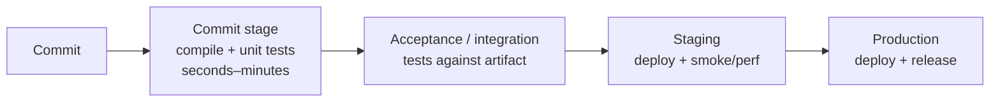
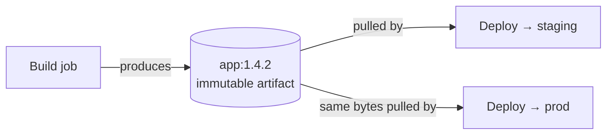
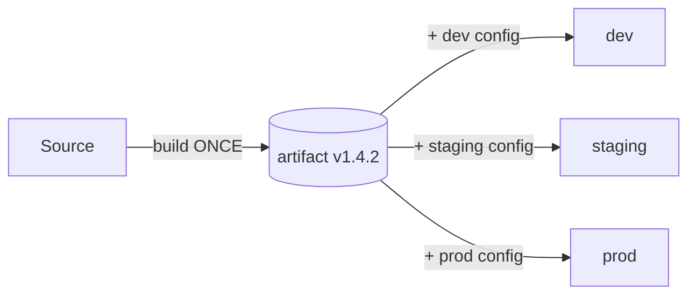
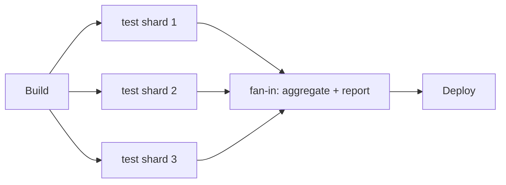

# CI/CD Pipeline Concepts

> A **CI/CD pipeline** is the automated path a code change travels from a developer's commit
> to running in production: build → test → package → scan → deploy, with quality gates in
> between. This topic is the *conceptual backbone* of the DevOps & CI/CD domain — the ideas
> (continuous integration, the deployment pipeline, build-once/deploy-many, promotion,
> gates, fan-out/fan-in, reproducibility) that every concrete tool (GitHub Actions, GitLab
> CI, Jenkins, Argo CD) implements. We stay concept-first and tool-grounded; the deep
> tool-specific syntax lives in `cicd-tooling-actions-gitlab-jenkins`, deployment mechanics
> (blue-green/canary) in `deployment-strategies`, and where tests run in
> `testing-strategy-in-cicd`.

> [!KEY-TAKEAWAY]
> **CI = keep the mainline always integrable and green; CD = keep it always deployable
> (delivery) or always deployed (deployment).** A pipeline turns those disciplines into
> automation: build the artifact **once**, run fast feedback tests early, **promote the
> same immutable artifact** through dev → staging → prod, and gate risky steps. Measure the
> whole thing with the four **DORA** keys.

---

## The deployment pipeline (Humble & Farley)

Picture a **factory assembly line with automated quality-inspection stations**. A part
(your commit) moves from station to station; any station can reject it and pull it off the
line; only a part that clears *every* station reaches the loading dock (prod). The pipeline
is that line for software — and its whole point is to catch the bad part at the *cheapest*
station possible, not after it has been boxed and shipped.

The **deployment pipeline** is the central pattern from Jez Humble and David Farley's book
*Continuous Delivery* (2010). Its definition: **an automated implementation of your
application's build, deploy, test, and release process**, giving *everyone involved*
visibility into the flow of changes from commit to release.

Two founding principles:

1. **Every change triggers the pipeline.** A commit is a *release candidate* until proven
   otherwise. The pipeline's job is to *disprove* the candidate's fitness as cheaply and
   quickly as possible.
2. **Fail fast, cheap first.** Stages are ordered so the *fastest, cheapest* checks
   (compile, unit tests) run first and the *slowest, most expensive* (integration, E2E,
   manual approval, prod deploy) run last. A change that fails early never consumes
   expensive later resources.



The pipeline is a **directed graph of stages**; a candidate that passes every stage is, by
definition, releasable. This is where "**Continuous Delivery**" gets its meaning: the
pipeline *always* has a known-good, deployable artifact at the end.

> [!INTERVIEW]
> If asked "what is a CI/CD pipeline?" don't just list tools. Say: it's the automated
> deployment pipeline — an ordered, gated sequence of stages that takes a commit and either
> promotes it toward production or rejects it, optimized for **fast feedback** (fail cheap,
> fail early) and **visibility**.

## Pipeline stages: build, test, package, scan, deploy

A conventional pipeline is a sequence of **stages**, each a logical phase; a stage contains
one or more **jobs** (units of work run on an agent); a job runs **steps/tasks**.

| Stage | What it does | Typical output |
|---|---|---|
| **Build** | Compile source, resolve dependencies | Compiled binaries / bytecode |
| **Test** | Unit tests, static analysis (lint) — fast feedback | Test reports, coverage |
| **Package** | Bundle into a deployable **artifact** (jar, container image, tarball) | Immutable versioned artifact |
| **Scan** | SAST (Static Application Security Testing — analyzes source without running it), SCA (Software Composition Analysis — checks dependencies for known CVEs / Common Vulnerabilities and Exposures), IaC (Infrastructure-as-Code) misconfig scan, image scan, secret scan | Security findings / gate result |
| **Deploy** | Push artifact to an environment, run migrations, health-check | Running deployment |

The **commit stage** (build + unit tests + lint) is the heart of CI — it must be **fast**
(minutes, ideally under 10) because developers wait on it. Slow acceptance, performance,
and E2E tests run in **later stages** so they don't block the fast feedback loop.

```yaml
# GitHub Actions — stages expressed as dependent jobs
jobs:
  build:
    runs-on: ubuntu-latest
    steps:
      - uses: actions/checkout@v4
      - run: mvn -B package        # compile + unit tests + package
      - uses: actions/upload-artifact@v4
        with: { name: app-jar, path: target/app.jar }
  scan:
    needs: build
    runs-on: ubuntu-latest
    steps:
      - run: trivy fs --exit-code 1 .   # fail on vulnerabilities
  deploy-staging:
    needs: [build, scan]
    runs-on: ubuntu-latest
    steps:
      - uses: actions/download-artifact@v4
        with: { name: app-jar }
      - run: ./deploy.sh staging
```

> [!TIP]
> Security scanning (SAST/DAST/SCA/IaC — DAST is Dynamic Application Security Testing, run
> against a *running* app) is its own topic — `devsecops-and-pipeline-security`
> — but conceptually it's just another gate stage. "Shift left" means moving these scans
> *earlier* so problems are caught before they reach expensive later stages.

## Continuous Integration principles

**Continuous Integration (CI)** is the practice of developers merging their work into a
shared mainline **frequently** (at least daily), with each integration **verified by an
automated build and test**. It predates "pipelines" — the discipline is what matters, the
tooling automates it.

Core principles (Fowler / Humble & Farley):

- **Integrate often.** Small, frequent merges to `main` (trunk) → smaller, easier-to-debug
  merge conflicts and integration failures. This is the essence of **trunk-based
  development**.
- **Maintain a single source repository** with an automated, self-testing build.
- **Keep the build green (fix a red build immediately).** A broken mainline blocks the whole
  team; fixing it is the top priority. Don't build on top of a broken build.
- **Fast feedback.** The commit build must be fast (~minutes). Slow builds discourage
  frequent commits, defeating CI.
- **Fail fast.** Order checks so the likeliest/cheapest failures surface first; abort the
  rest of the run on failure to save time and give a quick signal.
- **Everyone commits to mainline frequently**, and **everyone can see the build state**
  (radiators / status badges).

> [!WARNING]
> Long-lived feature branches with rare merges are **not** CI — even with a CI *server*
> running. If branches live for weeks, you're doing "continuous isolation": you get big,
> painful merges precisely because you deferred integration. CI is a *behavior*, not a tool.

### Flaky tests: the silent killer of the green build

A **flaky test** passes and fails non-deterministically on the *same* code — usually from
timing races, order dependence, shared state, network/time-of-day, or under-provisioned
runners. They are the single most corrosive thing to CI because they attack the *signal
itself*: if `main` is red 20% of the time from flakes, developers learn that **red doesn't
mean broken**, so they stop trusting the build, re-run until green, and start ignoring real
failures. That erodes the entire "keep the build green / fail fast" discipline.

The standard playbook:

- **Detect & measure.** Track a **flake rate** as a first-class metric (a test that fails
  then passes on retry with no code change is flaky). You can't fix what you don't count.
- **Quarantine, don't ignore.** Move a known-flaky test to a separate non-blocking suite
  (skip-and-track with a ticket) so it stops blocking merges — but keep it *visible* so it
  gets fixed, not silently deleted.
- **Retry with intent.** A bounded auto-retry (e.g. rerun a failed test once) can keep the
  pipeline moving, but *log every retry* — silent retries hide a growing flake problem.
- **Deflake.** Fix the root cause: remove `sleep`-based waits, isolate shared state, pin
  clocks/seeds, make tests order-independent.

> [!WARNING]
> Blanket "retry the whole suite until it passes" is an anti-pattern: it masks flakiness,
> can turn a real intermittent bug into "just retry it," and multiplies CI cost. Retry
> *narrowly* and *track* it — a rising flake rate is a bug backlog, not a config knob.

## CI vs Continuous Delivery vs Continuous Deployment

These three are often blurred. The distinction is a common interview trap:

| Term | What's automated | What's manual |
|---|---|---|
| **Continuous Integration** | Build + test on every merge to mainline | Everything after (release) |
| **Continuous Delivery** | Build, test, and **prepare** every change so it's *deployable to prod at any time* | The **decision** to deploy to prod (a button press) |
| **Continuous Deployment** | *Everything*, including the prod deploy — every green change goes to prod automatically | Nothing (no human gate) |

The key line: **Continuous Delivery means every change is deployable; Continuous
Deployment means every change is actually deployed.** Continuous Deployment is a superset —
it's Continuous Delivery with the final manual gate removed. Both are abbreviated "CD," so
always clarify which you mean.

> [!INTERVIEW]
> "Does your team do continuous deployment?" — Most say "CD" but mean *delivery* (there's a
> release approval). True continuous deployment (auto-to-prod on green) requires very high
> test confidence, robust monitoring, and fast rollback — usually paired with
> feature flags and canary releases.

## Artifacts flowing between stages

An **artifact** is the concrete, versioned output of the build — a `.jar`, a container
image, a zipped Lambda bundle, a compiled binary. Later stages **consume** the artifact the
build **produced**; they don't rebuild it.

Two mechanisms move artifacts between stages/jobs:

- **Pipeline artifacts (short-lived):** the CI system passes files between jobs of the same
  run (GitHub Actions `upload/download-artifact`, GitLab CI `artifacts:` + `dependencies:`).
  Good for test reports, coverage, the built binary within one run.
- **Artifact repositories (durable):** the built artifact is published to a registry
  (Nexus, Artifactory, JFrog, a container registry, GitHub/GitLab Package Registry) with an
  **immutable version**. Deploys pull from there. This is how build-once/deploy-many works
  across separate pipeline runs and environments.



> [!WARNING]
> **Don't pass mutable references between stages.** Promoting a *tag* like `latest` or a
> *branch name* means staging and prod can end up running different bytes. Promote an
> **immutable version** or, better, a **content digest** (e.g. `app@sha256:...` for a
> container image).

## Build once, deploy many (artifact promotion)

**Build once, deploy many** (a.k.a. *build once, run anywhere* / artifact promotion) is the
rule that you build a deployable artifact **exactly once**, then **promote that same
immutable artifact** through every environment (dev → staging → prod). You never rebuild
per environment.

Why it matters:

- **What you tested is what you ship.** If you rebuild for prod, the prod binary is *not*
  the one that passed staging — dependency versions, timestamps, or a transient upstream
  change can differ, invalidating all prior testing.
- **Environment-specific behavior comes from configuration, not the artifact** — this is
  **12-Factor App** factor III ("Config in the environment"). The artifact is identical;
  DB URLs, feature flags, and secrets are injected at deploy time.
- **Faster & cheaper** — build compute happens once, not N times.



> [!KEY-TAKEAWAY]
> **Same artifact, different config.** Rebuilding per environment is an anti-pattern: it
> breaks the guarantee that the tested bits equal the shipped bits. Bake nothing
> environment-specific into the artifact; inject config at deploy.

## Environments and promotion (dev → staging → prod)

An **environment** is a named, isolated deployment target with its own config, data, and
access rules — commonly **dev → staging (pre-prod) → prod**, sometimes with QA/UAT/canary
tiers. **Promotion** is advancing the *same artifact* to the next environment after it
passes that environment's checks.

- **dev/integration** — fast, low-fidelity; catches integration issues early.
- **staging/pre-prod** — should mirror prod as closely as possible (topology, data shape,
  config surface) so tests are representative. The closer to prod, the more valuable the
  signal.
- **prod** — real users. Deploy strategy (rolling/blue-green/canary — see
  `deployment-strategies`) controls blast radius.

Promotion is often **gated**: staging → prod requires green acceptance tests *and* an
approval. GitHub Actions models this with **environments** (with protection rules /
required reviewers); GitLab with **environments** + manual jobs; Argo CD with per-env
`Application`s pointing at env overlays.

> [!TIP]
> Staging that diverges from prod ("works in staging, breaks in prod") is a top source of
> deploy incidents. Use the *same* IaC/manifests with env-specific variables so drift is
> minimized. Ephemeral **preview/PR environments** (spun up per pull request, torn down on
> merge) give per-change isolation for higher-fidelity testing.

## Pipeline as code

**Pipeline as code** means the pipeline definition lives in a **version-controlled file in
the repo** (e.g. `.github/workflows/ci.yml`, `.gitlab-ci.yml`, `Jenkinsfile`, Argo
`Workflow`), not clicked together in a server UI.

Benefits:

- **Versioned & reviewed** — pipeline changes go through PR review and history like any code.
- **Reproducible & portable** — the pipeline travels with the repo; branches can have
  different pipeline versions; you can roll back a bad pipeline change.
- **Self-documenting** — the file *is* the process.

Contrast with legacy "click-ops" Jenkins jobs configured in the UI, which are opaque,
un-reviewable, and drift silently. Modern Jenkins uses a `Jenkinsfile` (declarative or
scripted) precisely to become pipeline-as-code.

```groovy
// Jenkinsfile — declarative pipeline as code (lives in the repo)
pipeline {
  agent any
  stages {
    stage('Build') { steps { sh 'mvn -B package' } }
    stage('Test')  { steps { sh 'mvn test' } }
    stage('Deploy'){ when { branch 'main' }
                     steps { sh './deploy.sh' } }
  }
}
```

> [!WARNING]
> Pipeline-as-code is not the same as **Infrastructure as Code**. Pipeline-as-code defines
> the *build/deploy process*; IaC (Terraform/CloudFormation — see
> `infrastructure-as-code-terraform`) defines the *infrastructure* the app runs on. They're
> complementary and both live in version control.

## Pipeline triggers

A **trigger** is the event that starts a pipeline run. Choosing the right trigger per
workflow is a core design decision.

| Trigger | Event | Typical use |
|---|---|---|
| **Push** | Commit pushed to a branch | Run CI on every mainline/feature push |
| **Pull request** | PR opened/updated | Validate a change *before* merge (required checks) |
| **Tag** | A git tag (often `v1.2.3`) pushed | Kick off a **release** build/deploy |
| **Schedule (cron)** | Time-based | Nightly builds, dependency scans, cleanup |
| **Manual (dispatch)** | Human/API triggers it | Prod deploy, one-off ops jobs |
| **Upstream / webhook** | Another pipeline or external event finishes | Chained pipelines, deploy-on-artifact-publish |

```yaml
# GitHub Actions triggers (one `push:` key — branches AND tags live under it)
on:
  push:
    branches: [main]       # run CI on mainline pushes
    tags: ['v*']           # release on tag
  pull_request:            # PR validation
  schedule:
    - cron: '0 2 * * *'    # nightly at 02:00 UTC
  workflow_dispatch:       # manual button/API
```

> [!TIP]
> A common pattern: **PR trigger** runs the fast commit stage + full test suite as a
> **required status check** (merge blocked until green); a **push-to-main** trigger then
> builds+publishes the artifact and auto-deploys to staging; a **tag** or **manual** trigger
> promotes to prod. This separates "validate the change" from "release the change".

## Gates and approvals

A **gate** is a condition that must be satisfied for the pipeline to proceed. Two kinds:

- **Automated gates** — a check whose result decides continuation: tests pass, coverage
  threshold met, security scan clean, canary error-rate under budget, error-budget not
  exhausted. These enforce quality *without* a human.
- **Manual approvals** — a human explicitly authorizes a step (typically prod deploy).
  Provides accountability, change-management/audit compliance (e.g. SOX), and a
  last-look for high-risk releases.

Modern platforms model these as **environment protection rules**: required reviewers,
wait timers, allowed branches, and deployment windows. Approvals should be the *exception*
for high-risk steps, not a gate on every commit — over-gating destroys flow and lowers
deployment frequency (a DORA anti-signal).

```yaml
# GitHub Actions — protected environment requiring approval before prod deploy
jobs:
  deploy-prod:
    environment:
      name: production        # configured with required reviewers in repo settings
      url: https://app.example.com
    runs-on: ubuntu-latest
    steps:
      - run: ./deploy.sh production
```

> [!WARNING]
> Manual approval ≠ quality. If a human rubber-stamps every deploy, the gate adds latency
> without adding safety. Prefer *automated* quality gates (tests, canary analysis, SLO/error
> -budget checks) and reserve human approval for genuine business/risk decisions.

## Parallel vs sequential stages, fan-out/fan-in, matrix builds

Pipeline topology is a DAG, and how you shape it drives both **speed** and **correctness**.

- **Sequential** — stage B waits for stage A. Required when B depends on A's output (deploy
  needs the built artifact) or when order enforces safety (scan before deploy).
- **Parallel** — independent jobs run at the same time to cut wall-clock time (lint +
  unit tests + build docs simultaneously). Bounded by available runners/concurrency limits.
- **Fan-out / fan-in** — one stage **fans out** into many parallel jobs (e.g. shard a huge
  test suite across 10 runners), then a downstream job **fans in** (waits for all shards,
  aggregates results). This is the standard pattern for parallelizing slow test suites.
- **Matrix build** — run the *same* job across a **combination of parameters** (OS ×
  language version × arch). A 3×3 matrix = 9 parallel jobs. Great for cross-platform/
  cross-version verification.

**Worked example — sharding a slow suite (and why it doesn't scale linearly).** A test
suite takes **40 min** on one runner. Fan it out across **10 runners**, evenly split:
40 min ÷ 10 = **4 min** per shard. Add a fan-in job that waits for all shards and
aggregates results — say **~30 s** of overhead. Total wall-clock ≈ 4 min + 0.5 min =
**~4.5 min**, down from 40 — a ~9× speedup for 10× the runners. Now push to **20 runners**:
40 ÷ 20 = 2 min per shard, but each shard still pays fixed per-shard startup (checkout,
restore cache, boot the test framework — say **~1 min** each). So each shard is really
2 + 1 = 3 min, plus fan-in ≈ 0.5 min → **~3.5 min**. You doubled runners (and cost) to
shave ~1 min: **Amdahl's-law diminishing returns** — the fixed per-shard startup and the
serial fan-in become the floor. The sweet spot is where per-shard *test* time still
dominates per-shard *startup* time.



```yaml
# GitHub Actions matrix — 2 OS × 3 Java versions = 6 parallel jobs
jobs:
  test:
    strategy:
      fail-fast: true            # cancel remaining jobs on first failure
      matrix:
        os: [ubuntu-latest, macos-latest]
        java: ['17', '21', '23']
    runs-on: ${{ matrix.os }}
    steps:
      - uses: actions/setup-java@v4
        with: { java-version: '${{ matrix.java }}', distribution: temurin }
      - run: mvn test
```

> [!TIP]
> `fail-fast: true` (the matrix default in GitHub Actions) cancels the other matrix jobs as
> soon as one fails — great for **fast feedback** on flaky-free suites. Set it `false` when
> you *want* the full matrix result (e.g. to see *which* OS/version combos break).

## Caching dependencies and the build cache

**Caching** stores expensive-to-recreate files (downloaded dependencies, compiled outputs)
between runs to speed up builds. It's the single biggest lever on commit-stage speed.

- **Dependency cache** — `~/.m2`, `~/.gradle/caches`, `node_modules`/npm cache, `~/.cargo`.
  Keyed by a hash of the lockfile (`package-lock.json`, `pom.xml`) so a **key change**
  (dependencies changed) produces a cache **miss** and refetch; otherwise a **hit** restores
  instantly.
- **Build cache** — reuse compiled/task outputs (Gradle build cache, Bazel, `ccache`,
  Docker layer cache). Docker layer caching + BuildKit reuse unchanged image layers.

**Worked example — the payoff.** A cold commit build resolves ~300 MB of Maven
dependencies from the registry: at a sustained ~1.5 MB/s effective throughput (network +
unpack), that download alone is 300 ÷ 1.5 = **200 s ≈ 3.3 min**, plus ~40 s to compile —
call it **~4 min** wall-clock. On the next run the `pom.xml` is unchanged, so
`hashFiles('**/pom.xml')` yields the *same* cache key → a **hit**: the ~300 MB is restored
from the cache store in **~15 s** instead of re-downloaded, and only the ~40 s compile
remains → **~55 s** total. That's roughly **4 min → under 1 min**, and the win repeats on
every commit where dependencies don't change — which is why caching is the single biggest
lever on commit-stage speed. When you *do* bump a dependency, the lockfile hash changes →
cache **miss** → you pay the full ~4 min once, then it's warm again.

```yaml
# GitHub Actions — cache Maven deps keyed on the lockfile
- uses: actions/cache@v4
  with:
    path: ~/.m2/repository
    key: ${{ runner.os }}-maven-${{ hashFiles('**/pom.xml') }}
    restore-keys: ${{ runner.os }}-maven-
```

> [!WARNING]
> Caches are a **performance optimization, never a correctness input**. A stale or
> **poisoned** cache can hide problems or leak state between runs — treat the cache as
> untrusted. Cache *keys* must include everything that affects the output (lockfile hash,
> tool version). A cache miss must still produce a **correct** build; if your build only
> works with a warm cache, it isn't reproducible.

## Idempotent and reproducible builds

- **Reproducible (deterministic) build** — the same source + same inputs always produce the
  **bit-for-bit identical** artifact, regardless of *when* or *where* it's built. Enemies of
  reproducibility: embedded timestamps, non-pinned dependency versions ("floating"
  versions), build-path leakage, non-deterministic ordering, network access to mutable
  sources. Fixes: **pin/lock all dependencies**, set `SOURCE_DATE_EPOCH`, sort inputs,
  hermetic/sandboxed builds.
- **Idempotent step** — running it again produces the same result without harmful side
  effects (e.g. re-running a deploy or `terraform apply` converges to the same state rather
  than duplicating resources). Idempotency lets you **safely retry** a flaky pipeline step.

Why interviewers care: reproducibility underpins **supply-chain security** (you can verify
an artifact was built from the claimed source — see `software-supply-chain-security` and
SLSA), reliable **rollback** (rebuild the exact old artifact), and trustworthy caching.

> [!KEY-TAKEAWAY]
> **Reproducible** = same inputs → identical output (a property of the *build*).
> **Idempotent** = running again is safe and converges (a property of a *step/deploy*).
> Both make pipelines trustworthy and retryable. Pinning/locking dependencies is the
> highest-leverage step toward reproducibility.

## Ephemeral build agents and runners

A **runner** (GitHub Actions) / **agent** (Jenkins, Azure DevOps) / **executor** (GitLab)
is the machine that executes a job. **Ephemeral** runners are **created fresh for a single
job and destroyed after** (a clean container/VM per run) versus **persistent/static**
runners reused across jobs.

Why ephemeral is preferred:

- **Clean, reproducible environment** — no state, files, or caches leaking between jobs
  ("works because the last job left something behind").
- **Security isolation** — a compromised job can't persist malware or exfiltrate secrets to
  the next tenant's job; blast radius is one run.
- **Elastic scaling** — spin up N runners on demand (Kubernetes pods, EC2, autoscaling
  groups) and pay only while running.

Trade-off: no warm cache/toolchain, so cold starts are slower — mitigated by explicit
dependency caching (above) and pre-baked runner images.

> [!WARNING]
> **Persistent self-hosted runners are a supply-chain risk**, especially on public repos:
> a malicious PR can run arbitrary code on the runner and poison it for later jobs. Use
> **ephemeral, isolated** runners for untrusted workloads and never expose long-lived
> secrets to fork PRs.

## DORA metrics: measuring the pipeline

The **DORA** (DevOps Research and Assessment) program / *Accelerate* research identified
**four key metrics** that predict software delivery performance. They're the standard way to
answer "is our pipeline actually good?"

**Throughput:**
- **Deployment Frequency (DF)** — how often you deploy to prod.
- **Lead Time for Changes (LT)** — time from code committed to code running in prod.

**Stability:**
- **Change Failure Rate (CFR)** — % of deployments to prod that cause a failure requiring
  remediation (hotfix, rollback, patch).
- **Failed Deployment Recovery Time** (formerly *Mean Time to Restore* / MTTR) — how long to
  recover from a failed deployment / incident.

Rough performance bands (from the *State of DevOps* reports; the reports cluster teams into
**four** groups — Elite / High / Medium / Low — and the exact thresholds shift year to
year, so treat these Elite/Low endpoints as directional, not gospel):

| Metric | Elite | Low |
|---|---|---|
| Deployment Frequency | On-demand (multiple/day) | < once per month |
| Lead Time for Changes | < 1 hour | > 1 month |
| Change Failure Rate | 0–15% | 40–60%+ |
| Failed Deploy Recovery | < 1 hour | > 1 week |

**Worked example — computing the four keys from a month of data.** Say last month a team
had these numbers:

- **200 production deploys** over ~20 working days → **Deployment Frequency** = 200 ÷ 20 =
  **10 deploys/day** (multiple per day → Elite band).
- Of those 200, **18** needed remediation (a hotfix or rollback) → **Change Failure Rate** =
  18 ÷ 200 = **0.09 = 9%** (within 0–15% → Elite band).
- One specific change: commit merged at **09:00**, observed running in prod at **09:47** →
  **Lead Time for Changes** = **47 min** (< 1 hour → Elite band). (In practice you'd take
  the *median* commit→prod time across all changes, not one sample.)
- Say three representative failures recovered in 20, 35, and 50 min; the **median**
  is **35 min** → **Failed Deployment Recovery** = **35 min** (< 1 hour → Elite band).

Note CFR uses *count of failed deploys ÷ count of all deploys*, not error rate; and lead
time is measured commit→prod, not the pipeline's own runtime. Reporting the median (not the
mean) for lead time and recovery keeps a couple of pathological outliers from skewing the
picture.

Key insight from the research: **throughput and stability are not a trade-off** — elite
teams do *both* well. Small, frequent, automated deploys are *both* faster *and* safer
because each change is small and easy to reason about and roll back. A fifth measure,
**reliability** (operational — meeting SLOs), was added later.

> [!INTERVIEW]
> Watch the CFR trap: deploying *less often* to "reduce failures" usually makes things
> **worse** — larger, riskier batches raise CFR and lengthen recovery. The DORA answer to
> "how do we deploy more safely?" is *deploy smaller and more often*, with automated tests,
> canary, and fast rollback. Note MTTR here is deploy-recovery time, distinct from
> incident MTTR in `sre-sla-slo-sli-reliability`.

## Common follow-up questions

- What's the difference between continuous delivery and continuous deployment? Delivery
  automates everything up to a *deployable* state and keeps a manual release gate; deployment
  removes that gate and auto-ships every green change to prod.
- Why build once and deploy many? So the exact bits tested in staging are the bits that
  run in prod; rebuilding per environment breaks that guarantee. Config, not the artifact,
  varies per environment (12-Factor).
- How do you speed up a slow pipeline? Parallelize independent jobs, shard slow test
  suites (fan-out/fan-in), cache dependencies keyed on the lockfile, run the fast commit
  stage first with fail-fast, and move slow acceptance/E2E tests to later stages.
- Reproducible vs idempotent — what's the difference? Reproducible = same inputs yield a
  bit-identical artifact; idempotent = re-running a step is safe and converges. First is
  about the build output; second is about retry safety.
- Where do security scans go? As gate stages, shifted left (early). SAST/SCA/IaC scan in
  the commit/build stage; DAST against a running staging deploy. Details in
  `devsecops-and-pipeline-security`.
- Why ephemeral runners? Clean state, security isolation, elastic scale — at the cost of
  cold-start speed, mitigated by caching.
- Your build is red 20% of the time from flaky tests — what do you do? Measure a flake
  rate, quarantine known-flaky tests into a non-blocking suite (ticketed, not deleted),
  add *bounded, logged* retries to keep flow, and deflake root causes (kill `sleep`-based
  waits, isolate shared state, pin clocks/seeds). Don't blanket-retry the whole suite —
  that masks real intermittent bugs and destroys trust in the green build.
- How do you know your pipeline is good? DORA four keys: deployment frequency, lead time,
  change failure rate, failed-deployment recovery time — throughput and stability together.

## References

- Jez Humble & David Farley, *Continuous Delivery* (Addison-Wesley, 2010) — the deployment
  pipeline pattern, build-once/deploy-many, commit stage.
- Martin Fowler, "Continuous Integration" — martinfowler.com/articles/continuousIntegration.html
- Nicole Forsgren, Jez Humble, Gene Kim, *Accelerate* (2018) and the DORA / Google Cloud
  *State of DevOps* reports — the four key metrics — dora.dev.
- The Twelve-Factor App (12factor.net) — factor III (Config), factor V (Build/release/run).
- Trunk-Based Development — trunkbaseddevelopment.com (Paul Hammant / DORA).
- GitHub Actions docs — workflows, matrix strategy, caching, environments/protection rules.
- GitLab CI/CD docs — stages, `needs:`, artifacts, environments.
- Jenkins docs — Pipeline (declarative/scripted), `Jenkinsfile`.
- SLSA framework (slsa.dev) — provenance and reproducible/hermetic builds.
