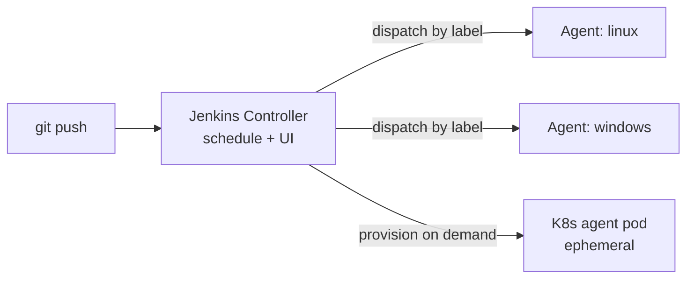

# CI/CD Tooling: GitHub Actions, GitLab CI & Jenkins

CI/CD *concepts* (stages, gates, artifacts, deployment strategies) are covered in the
`cicd-pipeline-concepts` and `deployment-strategies` topics. This topic is about the
**tools** that execute those pipelines: how the three dominant CI/CD systems model work,
where they run it, how you keep pipeline code DRY, and how each handles secrets. The goal
is to be able to read/write a real workflow file in each tool and reason about runner
security, cost, and scale trade-offs in an interview.

> [!INTERVIEW]
> A very common opener is "walk me through a GitHub Actions (or GitLab CI, or Jenkins)
> pipeline you've built." Interviewers listen for the vocabulary (workflow/job/step,
> stage/job, Jenkinsfile/stage) used *correctly*, and for whether you understand runners,
> caching, secrets, and reuse — not just that you can paste YAML.

## GitHub Actions core model

GitHub Actions is the CI/CD system built into GitHub. Its object model is a strict hierarchy:

- **Workflow** — a YAML file in `.github/workflows/`. Triggered by events (`on:`), e.g.
  `push`, `pull_request`, `schedule` (cron), `workflow_dispatch` (manual), or
  `workflow_call` (invoked by another workflow).
- **Job** — a named unit that runs on a single **runner**. Jobs run **in parallel by
  default**; use `needs:` to sequence them. Each job runs in a **fresh VM/container**, so
  jobs do **not** share a filesystem — data passes between jobs via **artifacts** or job
  **outputs**, not the working directory.
- **Step** — an ordered command inside a job. A step is either a shell command (`run:`) or
  a reusable **action** invoked with `uses:`. Steps in a job **do** share the filesystem
  and run sequentially.
- **Action** — a packaged, reusable unit (`actions/checkout@v4`, a Docker action, a
  JavaScript action, or a **composite** action). Referenced by `owner/repo@ref`.

```yaml
# .github/workflows/ci.yml
name: CI
on:
  push:
    branches: [main]
  pull_request:
jobs:
  test:
    runs-on: ubuntu-latest
    steps:
      - uses: actions/checkout@v4
      - uses: actions/setup-node@v4
        with: { node-version: 20 }
      - run: npm ci
      - run: npm test
  build:
    needs: test          # runs only after `test` succeeds
    runs-on: ubuntu-latest
    steps:
      - uses: actions/checkout@v4
      - run: npm run build
      - uses: actions/upload-artifact@v4
        with: { name: dist, path: dist/ }
```

> [!WARNING]
> Pin third-party actions to a **full commit SHA** (`uses: foo/bar@a1b2c3d`), not a
> mutable tag like `@v3`. A compromised tag re-point is a real supply-chain attack vector
> (the `tj-actions/changed-files` incident, 2025). First-party `actions/*` are lower risk
> but SHA-pinning is still the hardened practice.

## GitHub Actions runners hosted vs self-hosted

A **runner** is the machine that executes a job. Two flavours:

- **GitHub-hosted runners** — ephemeral VMs GitHub provisions per job (Ubuntu, Windows,
  macOS), pre-loaded with common toolchains, **fresh and destroyed every run**. You pay per
  minute (macOS/Windows cost multipliers apply); free minutes for public repos.
- **Self-hosted runners** — machines *you* register and manage (on-prem or your cloud).
  Chosen for: access to private networks, custom/large hardware (GPUs), OS/architecture not
  offered hosted, or cost at very high volume.

`runs-on:` selects the runner (`ubuntu-latest`, or labels like `[self-hosted, linux, gpu]`).

> [!WARNING]
> **Never use self-hosted runners on public repositories.** A fork can open a PR whose
> workflow runs arbitrary code on your runner. Because a default self-hosted runner is
> **not** torn down between jobs, one malicious job can poison the environment for the
> next. Use ephemeral (`--ephemeral`) self-hosted runners and isolate them.

## Matrix builds in GitHub Actions

A **matrix** runs the same job across combinations of parameters (versions, OSes) in
parallel, from one job definition — the standard way to test broad compatibility.

```yaml
jobs:
  test:
    strategy:
      fail-fast: false           # don't cancel siblings when one fails
      max-parallel: 4
      matrix:
        os: [ubuntu-latest, macos-latest]
        node: [18, 20, 22]
        exclude:
          - { os: macos-latest, node: 18 }
    runs-on: ${{ matrix.os }}
    steps:
      - uses: actions/checkout@v4
      - uses: actions/setup-node@v4
        with: { node-version: ${{ matrix.node }} }
      - run: npm test
```

This expands to `2×3 − 1 = 5` parallel jobs. Key knobs: `fail-fast: true` (default) cancels
all in-progress matrix jobs the moment one fails — great for fast feedback, bad when you
want the full failure picture; `include`/`exclude` add or remove specific combinations;
`max-parallel` caps concurrency.

## Reusable workflows and composite actions

Two distinct mechanisms for DRY in GitHub Actions — a classic point of confusion:

- **Composite action** — bundles multiple **steps** into one reusable `uses:` step. Lives in
  its own repo or `.github/actions/`. Good for a repeated *step sequence* (setup + cache +
  auth). It runs inside the caller's job.
- **Reusable workflow** — an entire **workflow** with its own jobs, called via
  `workflow_call` and `uses: owner/repo/.github/workflows/wf.yml@ref`. Good for standardizing
  a whole *pipeline* (a shared deploy workflow) across many repos. It runs as its own job(s).

```yaml
# .github/workflows/deploy.yml  (reusable)
on:
  workflow_call:
    inputs:
      environment: { required: true, type: string }
    secrets:
      token: { required: true }
jobs:
  deploy:
    runs-on: ubuntu-latest
    environment: ${{ inputs.environment }}
    steps:
      - run: ./deploy.sh
        env: { TOKEN: ${{ secrets.token }} }
```
```yaml
# caller
jobs:
  call-deploy:
    uses: my-org/ci/.github/workflows/deploy.yml@v1
    with: { environment: production }
    secrets: { token: ${{ secrets.DEPLOY_TOKEN }} }
```

Rule of thumb: **composite action = reuse steps; reusable workflow = reuse jobs/pipeline.**

## Secrets environments and OIDC to cloud

- **Secrets/variables** are stored encrypted at org/repo/environment scope, exposed as
  `${{ secrets.NAME }}`. They are **masked** in logs and **not passed to workflows triggered
  by a fork's `pull_request`** by default.
- **Environments** (e.g. `staging`, `production`) add deployment **protection rules**:
  required reviewers (manual approval gate), wait timers, and branch restrictions, plus
  environment-scoped secrets.
- **OIDC to cloud** is the modern best practice for cloud deploys. Instead of storing
  long-lived cloud keys as secrets, the workflow requests a short-lived **OIDC token** from
  GitHub; the cloud provider (via a trust policy scoped to your repo/branch) exchanges it for
  temporary credentials. **No standing secret to leak or rotate.**

```yaml
jobs:
  deploy:
    permissions:
      id-token: write        # REQUIRED to mint the OIDC token
      contents: read
    runs-on: ubuntu-latest
    steps:
      - uses: aws-actions/configure-aws-credentials@v4
        with:
          role-to-assume: arn:aws:iam::111122223333:role/gha-deploy
          aws-region: us-east-1
      - run: aws s3 sync dist/ s3://my-bucket
```

Deep dive on Vault, sealed-secrets, and rotation is in the `secrets-management` topic.

## GitLab CI core model and pipeline config

GitLab CI is defined in a single **`.gitlab-ci.yml`** at the repo root. Model:

- **Pipeline** — the whole run, made of **stages**.
- **Stage** — an ordered phase (`stages: [build, test, deploy]`). Jobs in the **same stage
  run in parallel**; a stage starts only after the previous stage **fully succeeds** (unless
  overridden with `needs:`).
- **Job** — the unit of work, assigned to a stage via `stage:`, executed by a **runner**.
  A job with `allow_failure: true` won't block the pipeline.

```yaml
stages: [build, test, deploy]

build-job:
  stage: build
  script:
    - make build
  artifacts:
    paths: [bin/]        # pass files to later stages

test-job:
  stage: test
  script: [make test]

deploy-prod:
  stage: deploy
  script: [./deploy.sh]
  environment: production
  rules:
    - if: '$CI_COMMIT_BRANCH == "main"'
      when: manual        # manual gate on prod
```

Reserved config keys `stages`, `variables`, `default`, `workflow`, `include` shape the whole
pipeline. `rules:` (modern) / `only`/`except` (legacy) control *when* a job runs.

## GitLab CI runners and executors

A **GitLab Runner** is the agent that runs jobs; how it runs them is set by its **executor**:

- **Shell** — runs directly on the runner host (least isolated).
- **Docker** — each job runs in a fresh container from a specified `image:` (most common;
  clean, reproducible).
- **Kubernetes** — spins up a pod per job (autoscaling on a cluster).
- **Docker Machine / instance autoscaler** — provisions ephemeral cloud VMs on demand.

Runners are **shared** (GitLab-hosted, or org-wide), **group**, or **project** scoped, and
selected by **tags**. GitLab.com offers hosted runners (SaaS); self-managed GitLab commonly
registers its own.

```yaml
test-job:
  image: node:20        # Docker executor: job runs in this container
  tags: [docker]        # route to a runner advertising this tag
  script: [npm ci, npm test]
```

## GitLab CI needs DAG and includes

- **`needs:`** turns the default stage-by-stage pipeline into a **DAG**: a job starts as soon
  as its named dependencies finish, not waiting for its whole stage. This shortens critical
  path — e.g. a fast lint in `test` can gate a deploy without waiting for slow integration
  tests in the same stage.

```yaml
deploy-docs:
  stage: deploy
  needs: [build-docs]   # starts the instant build-docs finishes
  script: [./publish-docs.sh]
```

- **`include:`** pulls in external YAML for DRY: `local` (same repo), `file`+`project`
  (another repo), `remote` (URL), or `template` (GitLab-provided, e.g. SAST). Combined with
  **`extends:`** and **YAML anchors** (`&`/`*`) / `!reference`, it's how GitLab keeps pipeline
  definitions from being copy-pasted across projects.

```yaml
include:
  - project: 'my-org/ci-templates'
    file: '/jobs/deploy.yml'
    ref: v1

.deploy-base: &deploy_base   # hidden job + anchor
  image: alpine
  before_script: [apk add curl]

deploy-staging:
  <<: *deploy_base
  script: [./deploy.sh staging]
```

## Jenkins architecture and the controller agent model

Jenkins is a self-hosted, plugin-driven automation server — the oldest and most flexible of
the three, and the one you'll most often inherit in a legacy shop.

- **Controller** (historically called the "master") — schedules builds, serves the UI/API,
  stores config. It **should not run build workloads** in production for security/scaling.
- **Agent** (historically "slave"; now **agent/node**) — a worker that executes builds.
  Connected via SSH, JNLP/inbound, or dynamically provisioned (Kubernetes, EC2, Docker
  plugins). An **executor** is a single build slot on a node.
- Jobs are pinned to agents by **labels** (`agent { label 'linux && docker' }`).



> [!TIP]
> Modern Jenkins on Kubernetes provisions a **fresh agent pod per build** and tears it down
> after — Jenkins' equivalent of ephemeral runners, giving clean, isolated, autoscaling
> builds instead of long-lived pet agents.

## Jenkins declarative vs scripted Pipeline

Jenkins pipelines live in a **`Jenkinsfile`** checked into the repo ("pipeline as code").
Two syntaxes, both Groovy-based:

- **Declarative** — structured, opinionated: a top-level `pipeline { }` block with
  `agent`, `stages`, `steps`, `environment`, `post`. Easier to read, validated, supports
  `when`, `parallel`, `matrix`. **Recommended default.**
- **Scripted** — full Groovy program (`node { ... }`). Maximum flexibility (loops,
  arbitrary logic) but no guardrails; harder to maintain. Use only when declarative can't
  express the logic.

```groovy
// Jenkinsfile (Declarative)
pipeline {
  agent { label 'linux' }
  environment { REGISTRY = 'ghcr.io/acme' }
  stages {
    stage('Test')  { steps { sh 'make test' } }
    stage('Build') { steps { sh 'make build' } }
    stage('Deploy') {
      when { branch 'main' }
      steps { sh './deploy.sh' }
    }
  }
  post {
    failure { mail to: 'team@acme.io', subject: "Build ${env.BUILD_NUMBER} failed" }
    always  { cleanWs() }
  }
}
```

## Jenkins plugins and shared libraries

- **Plugins** — Jenkins' core value and its curse: ~1,800+ community plugins add SCM, build
  tools, cloud agents, credentials, notifications. This makes Jenkins do *anything*, but
  plugin sprawl, version conflicts, and **plugins as an unpatched security surface** are the
  classic Jenkins maintenance burden.
- **Shared libraries** — reusable Groovy code (`vars/`, `src/`) hosted in a Git repo and
  loaded with `@Library('my-lib')`. They let many teams share pipeline logic (e.g. a
  `standardBuild()` step), the Jenkins analogue of reusable workflows / GitLab `include`.
- **Credentials** are managed by the Credentials plugin (scoped stores) and injected via
  `withCredentials` or `environment { CRED = credentials('id') }`.

```groovy
@Library('acme-pipeline') _
standardJavaBuild(jdk: '21', deployTo: 'staging')
```

## Choosing between GitHub Actions GitLab CI and Jenkins

| Dimension | GitHub Actions | GitLab CI | Jenkins |
|---|---|---|---|
| Hosting | SaaS (GitHub-hosted) + self-hosted runners | SaaS + self-managed | **Self-hosted only** |
| Config | `.github/workflows/*.yml` | `.gitlab-ci.yml` | `Jenkinsfile` (Groovy) |
| Setup/maint. | Lowest (managed) | Low–medium | **Highest** (you run it + plugins) |
| Ecosystem | Marketplace actions | Built-in templates + fewer 3rd-party | ~1,800 plugins (most extensible) |
| Reuse | Composite actions + reusable workflows | `include` + `extends` + anchors | Shared libraries |
| Best fit | Repo already on GitHub; OSS | GitLab shops; integrated DevSecOps | Legacy/complex/air-gapped, full control |

Interview framing: **GitHub Actions/GitLab CI** win on low-maintenance, integrated,
cloud-native workflows tightly coupled to their SCM. **Jenkins** wins on maximum flexibility,
on-prem/air-gapped or highly customized needs, and where you already have deep plugin
investment — at the cost of you owning the server, upgrades, and plugin security.

## Self-hosted vs cloud runners security cost and scale

The universal runner trade-off across all three tools:

- **Cloud/hosted runners** — zero infra to maintain, always patched, **ephemeral and
  isolated per job**, elastic. Trade-offs: **pay-per-minute** (expensive at high volume), no
  access to private networks by default, limited hardware, potential data-residency concerns.
- **Self-hosted runners** — needed for private-network access, custom/large/GPU hardware,
  special OS/arch, compliance, or cheaper steady-state at very high volume. Trade-offs: **you
  own patching, scaling, and isolation**, and a poorly-isolated self-hosted runner is a
  serious security risk (job persistence, cache poisoning, credential theft).

> [!KEY-TAKEAWAY]
> The dominant security rule for self-hosted runners: make them **ephemeral** (fresh,
> single-use, destroyed after one job) and **never expose them to untrusted forks/PRs**.
> This closes the biggest gap vs. cloud runners: state leaking between builds.

## Ephemeral runners and autoscaling

An **ephemeral runner** executes exactly one job then is destroyed, giving every build a
clean, uncontaminated environment — the same isolation guarantee cloud runners provide.

- **GitHub Actions** — register with `--ephemeral`; scale with **Actions Runner Controller
  (ARC)** on Kubernetes, which creates a runner pod per queued job.
- **GitLab** — Kubernetes executor or the instance/Docker-Machine autoscaler spins up a
  fresh container/VM per job.
- **Jenkins** — the Kubernetes or EC2 plugin provisions a fresh agent pod/instance per build.

Benefits: **isolation** (no cross-build contamination or secret residue), reproducibility,
and cost efficiency (capacity only exists while jobs run). Cost: cold-start latency and the
loss of a warm local cache (mitigated with remote caches / pre-baked images).

## Pipeline reuse and templating

DRY pipelines matter because copy-pasted CI drifts and multiplies maintenance. Each tool's
mechanisms:

| Tool | Reuse mechanisms |
|---|---|
| GitHub Actions | Composite actions (reuse steps), reusable workflows (`workflow_call`, reuse jobs), org-level `.github` defaults |
| GitLab CI | `include` (local/project/remote/template), `extends`, hidden jobs (`.name`), YAML anchors, `!reference` |
| Jenkins | Shared libraries (`@Library`, `vars/`), Job DSL, template plugins |

> [!TIP]
> Centralize shared pipeline logic in **one versioned repo** (a `ci-templates`/shared-library
> repo) and pin consumers to a tag/`ref`. Get the DRY benefit without an unversioned change
> breaking every downstream pipeline at once.

## Secrets handling across CI tools

Every CI tool provides encrypted secret storage injected as environment variables and masked
in logs — but the hardened patterns are the same across all three:

- **Prefer OIDC/short-lived credentials** over stored long-lived cloud keys (GitHub Actions,
  GitLab, and Jenkins all support OIDC to AWS/GCP/Azure).
- **Scope secrets narrowly** (environment/project level) and gate prod with approvals.
- **Never `echo` a secret** or pass it on a command line (visible in process lists); masking
  is best-effort and can be defeated by transformations (e.g. base64).
- Fork PRs must **not** receive secrets by default — a core protection in all three.

| Tool | Secret store | Cloud auth |
|---|---|---|
| GitHub Actions | Repo/org/environment secrets | OIDC → cloud role |
| GitLab CI | CI/CD variables (masked/protected) | OIDC ID tokens |
| Jenkins | Credentials plugin + `withCredentials` | OIDC / cloud credential plugins |

Vault, External Secrets Operator, sealed-secrets, SOPS, and rotation-in-deploy are covered in
the `secrets-management` topic.

## Common pipeline patterns and gotchas

- **Caching** — cache dependency dirs (`~/.m2`, `node_modules`, `~/.gradle`) to cut build
  time. In GitHub Actions use `actions/cache`; GitLab uses `cache:` keyed by lockfile;
  Jenkins uses plugins/workspace reuse. Cache is a *speed* optimization; artifacts are the
  *correctness* mechanism for passing outputs between jobs/stages.
- **Concurrency control** — cancel superseded runs (GitHub `concurrency:`; GitLab
  `interruptible: true`) so a new push aborts an in-flight stale build.
- **Fail-fast vs. full report** — matrix `fail-fast` and stage ordering trade fast feedback
  against seeing every failure.
- **Path/branch filters** — run jobs only when relevant files change (GitHub `paths:`,
  GitLab `rules:changes`) to save minutes on monorepos.
- **Idempotent, self-contained jobs** — a job must not depend on leftover state from a
  previous job on the same runner; on ephemeral runners that state won't exist anyway.

> [!WARNING]
> The classic cross-job data mistake: on GitHub Actions each job gets a **fresh runner**, so
> writing a file in one job and reading it in another without an artifact upload/download (or
> a declared job `output`) silently fails. GitLab needs `artifacts:` to move files between
> stages for the same reason.

## Common follow-up questions

- **"Difference between a composite action and a reusable workflow?"** Composite = reuse a
  sequence of steps inside a job; reusable workflow = reuse whole jobs/a pipeline via
  `workflow_call`.
- **"Why avoid self-hosted runners on public repos?"** Forked PRs can execute arbitrary code
  on your infrastructure and, without ephemerality, poison later jobs.
- **"How do jobs share data in GitHub Actions?"** Artifacts or job outputs — not the
  filesystem, because each job runs on its own runner.
- **"Declarative vs scripted Jenkins pipelines?"** Declarative is structured/validated and
  preferred; scripted is full Groovy for cases declarative can't express.
- **"How do you avoid storing cloud keys in CI?"** OIDC federation: the pipeline mints a
  short-lived token exchanged for temporary cloud credentials via a scoped trust policy.
- **"What makes a runner 'ephemeral' and why care?"** One job then destroyed → clean
  isolation, no secret/state residue between builds.
- **"When would you still pick Jenkins in 2025?"** Air-gapped/on-prem, deep existing plugin
  investment, or highly customized flows needing full control of the server.

## References

- GitHub Actions documentation — https://docs.github.com/en/actions
- GitHub — Security hardening for GitHub Actions (OIDC, self-hosted runners) — https://docs.github.com/en/actions/security-guides
- Actions Runner Controller (ARC) — https://github.com/actions/actions-runner-controller
- GitLab CI/CD documentation — https://docs.gitlab.com/ee/ci/
- GitLab — `.gitlab-ci.yml` keyword reference — https://docs.gitlab.com/ee/ci/yaml/
- GitLab Runner executors — https://docs.gitlab.com/runner/executors/
- Jenkins Pipeline (declarative & scripted) — https://www.jenkins.io/doc/book/pipeline/
- Jenkins — Managing agents / distributed builds — https://www.jenkins.io/doc/book/managing/nodes/
- Jenkins Shared Libraries — https://www.jenkins.io/doc/book/pipeline/shared-libraries/
- DORA / Accelerate (four keys) — https://dora.dev/
