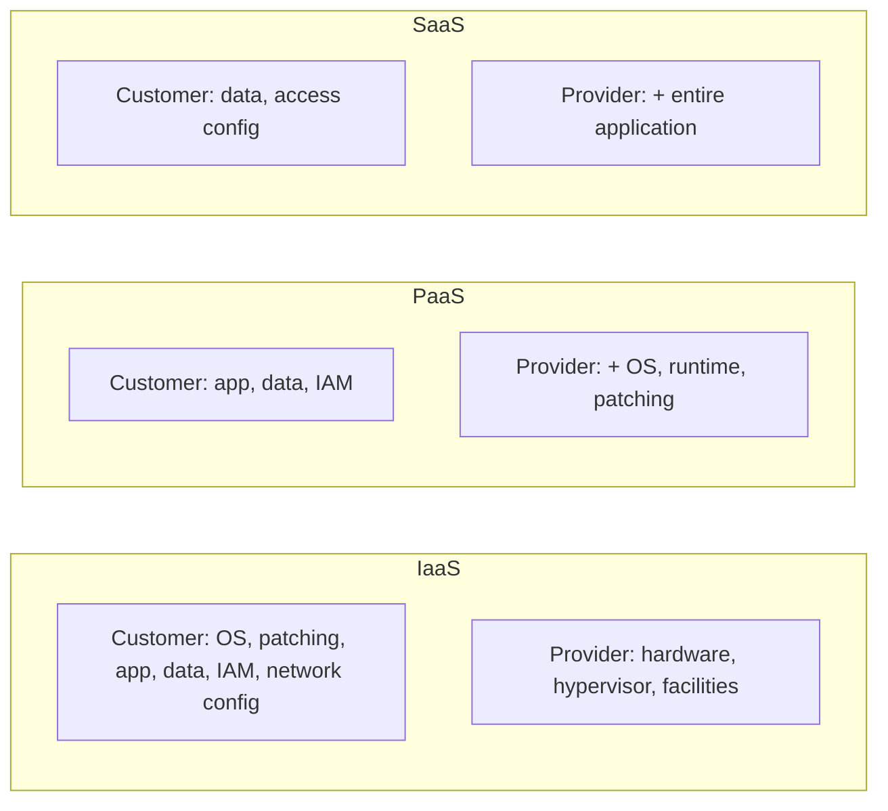
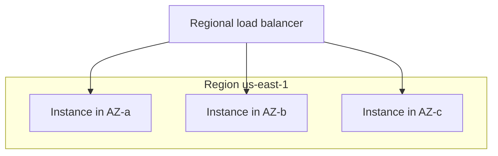

# Cloud Platforms & Managed Services for DevOps

Modern delivery runs on someone else's computers. **Cloud platforms** (AWS, Google Cloud,
Azure and others) rent compute, storage, networking, and higher-level **managed services**
on demand, billed by usage. For a DevOps engineer the important questions are rarely "what
is the cloud" and almost always **trade-offs**: how much of the stack do I want to operate
myself, what do I hand to the provider, how do I stay highly available, how do I avoid
lock-in, and how do I not blow the budget.

This topic is concept-first and provider-neutral, with concrete grounding in the big three.
It deliberately stays at the *platform selection / operating-model* level. For deep AWS
service design (DynamoDB, SQS, Aurora, sharding, capacity math) see the **AWS system-design**
group; for container and orchestration internals see the **Docker** and **Kubernetes**
domains — this topic points at them, it does not re-teach them.

> [!KEY-TAKEAWAY]
> Everything here is a point on a **responsibility / control spectrum**. IaaS→PaaS→SaaS→FaaS
> and self-hosted→managed both trade *operational control* for *reduced operational burden*.
> Interviewers want you to reason about *where on that spectrum a given workload belongs and
> why*, not to recite definitions.

---

## Cloud service models: IaaS, PaaS, SaaS, FaaS

The service models describe **how much of the stack the provider operates for you**. The
classic mental model (from NIST) is IaaS / PaaS / SaaS; **FaaS** (serverless functions) is a
later, finer-grained slice of PaaS.

| Model | You manage | Provider manages | Examples |
|---|---|---|---|
| **On-prem** | Everything (hardware → app) | Nothing | Your own datacenter |
| **IaaS** (Infrastructure) | OS, runtime, app, data, scaling | Virtualization, servers, storage, network | EC2, GCE, Azure VMs |
| **PaaS** (Platform) | App code + config | OS, runtime, patching, scaling | Heroku, App Engine, Elastic Beanstalk, Cloud Run |
| **FaaS** (Functions) | Just function code | Everything else, incl. scale-to-zero & per-request scaling | Lambda, Cloud Functions, Azure Functions |
| **SaaS** (Software) | Only your data/config | The entire application | Gmail, Salesforce, Datadog, GitHub |

**The trade-off, in one line:** moving down the list means **less operational control and
less undifferentiated heavy lifting** (patching, scaling, capacity planning) but **more
constraints and often more per-unit cost / lock-in**.

- **IaaS** gives you raw VMs — maximum control, you own the OS, patching, and scaling.
- **PaaS** takes the OS/runtime off your plate; you `git push` and it builds/runs. Great
  velocity, but you live inside the platform's supported runtimes and limits.
- **FaaS** is event-driven functions with **no server to manage** and **scale-to-zero** —
  you pay per invocation and per GB-second, not for idle capacity. Constraints: execution
  time limits, cold starts, stateless model.
- **SaaS** is a finished product you consume over the network; you manage only your data and
  configuration.

> [!WARNING]
> "Serverless" does **not** mean there are no servers — it means *you* don't provision or
> manage them and you don't pay for idle. Saying "no servers exist" in an interview is a red
> flag.

> [!INTERVIEW]
> A favorite prompt: "You have a spiky, event-driven image-thumbnail job that runs a few
> thousand times a day." → **FaaS** (scale-to-zero, per-invocation billing) beats a
> permanently-running VM. Contrast with a steady, high-throughput, latency-sensitive service
> where a reserved VM/container fleet is cheaper and avoids cold starts.

---

## The shared responsibility model

The **shared responsibility model** defines the security/operational boundary between the
cloud provider and the customer. The canonical framing (AWS) is:

- **Provider is responsible for the security *of* the cloud** — physical datacenters,
  hardware, hypervisor, the managed-service control plane, and the network backbone.
- **Customer is responsible for security *in* the cloud** — their data, IAM configuration,
  OS/patching (for IaaS), network/firewall rules, encryption choices, and application code.

**The boundary *moves* with the service model.** The higher the abstraction, the more the
provider owns:



**Constant across every model:** the customer *always* owns their **data**, their **identity
and access management (IAM)**, and *who can access what*. The provider never configures your
IAM policies or classifies your data for you.

> [!WARNING]
> The vast majority of real cloud breaches are **customer-side misconfiguration** — public
> S3 buckets, over-broad IAM roles, open security groups — not provider failures. "The cloud
> is secure" is not the same as "your use of the cloud is secure." Deep secrets/IAM mechanics
> live in the **Security** domain and this domain's `secrets-management` topic.

---

## Compute options: VMs vs containers vs serverless

Three ways to run code in the cloud, from heaviest to lightest:

| | **VM (IaaS)** | **Container** | **Serverless (FaaS)** |
|---|---|---|---|
| Unit | Full guest OS | Process + isolated userspace, shared kernel | Function invocation |
| Startup | Seconds–minutes | Seconds (or less) | Millis–seconds (+ cold start) |
| Isolation | Strong (hypervisor) | Weaker (namespaces/cgroups) | Provider-managed |
| Scaling | Manual/autoscaling groups, minutes | Fast, orchestrated (K8s/ECS) | Automatic, per-request, to zero |
| Billing | Per running instance-hour | Per instance-hour of the host fleet | Per invocation + GB-second |
| You patch | OS + runtime | Base image (not host kernel) | Nothing |
| Best for | Legacy/stateful, full control, specialized kernels | Portable microservices, most modern apps | Spiky/event-driven, glue, low steady load |

**Reasoning about the choice:**

- **VMs** — pick when you need OS-level control, specialized kernels/drivers, licensed
  software tied to a host, or you're lifting-and-shifting a legacy stateful app.
- **Containers** — the default for new microservices: portable artifact, fast start, dense
  packing, strong ecosystem (Docker/Kubernetes/ECS). Trade-off: you run/patch an orchestrator
  (or pay for a managed one).
- **Serverless** — pick for bursty, event-driven, or low-utilization workloads where paying
  for idle capacity is wasteful. Watch **cold starts**, **execution-time limits**, and
  **per-invocation cost at very high sustained volume** (where it can become *more* expensive
  than a reserved fleet).

**What a "cold start" actually is:** when no warm execution environment is sitting idle to
reuse, the provider must build one from scratch *before your handler's first line runs* —
allocate a fresh micro-VM/container, boot the language runtime, download and load your code +
dependencies, and (if the function lives in a VPC) attach an elastic network interface. That
init is the cold start. A **warm** invocation reuses an already-initialized environment and
skips all of it. Magnitude ranges from **~tens of milliseconds** for a small interpreted
function to **several seconds** for a heavy JVM/.NET package or a VPC-attached function.
Biggest inflators: large dependency bundles, VPC/ENI networking, and slow-to-init runtimes.
Mitigate with **provisioned concurrency** (keep N environments pre-warmed) or slimmer deploy
packages.

> [!TIP]
> A useful crossover heuristic: serverless wins on cost when utilization is **low or spiky**;
> a reserved/committed VM or container fleet wins when utilization is **high and steady**,
> because you amortize the always-on cost. "Always cheaper" is true for neither.

### Worked example: where Lambda crosses over an always-on VM

The heuristic above becomes a real decision the moment an interviewer asks "*at what volume
does Lambda get more expensive than just running an instance?*" Let's actually compute it.
(AWS us-east-1 list prices, standard architecture — illustrative, rates change.)

**The function:** 512 MB memory (`= 0.5 GB`), 200 ms per invocation (`= 0.2 s`).
- Memory-time per invocation: `0.5 GB × 0.2 s = 0.1 GB-second`.
- Lambda duration price: `$0.0000166667` per GB-second. Request price: `$0.20` per 1M requests.

So the all-in cost of **one** invocation is:

```
duration:  0.1 GB-s × $0.0000166667 = $0.00000166667
request:                $0.20 / 1,000,000 = $0.00000020000
per invocation total                   ≈ $0.00000186667
```

Now price two monthly volumes and compare against a `t3.small` running 24/7
(`$0.0208/hr × 730 hr ≈ $15.18/month`):

| Monthly invocations | Lambda duration | Lambda requests | **Lambda total** | t3.small 24/7 |
|---|---|---|---|---|
| 1,000,000 | 100,000 GB-s → $1.67 | $0.20 | **≈ $1.87** | $15.18 |
| 100,000,000 | 10,000,000 GB-s → $166.67 | $20.00 | **≈ $186.67** | $15.18 |

At **1M/month** Lambda costs ~$1.87 vs the VM's $15.18 — serverless wins ~8×, and you paid
nothing for the idle hours. At **100M/month** Lambda is ~$187 vs the VM's $15 — the always-on
instance is now ~12× *cheaper*. The break-even is where `$15.18 / $0.00000186667 ≈ 8.1M
invocations/month`. Below ~8M/month, scale-to-zero Lambda wins; above it, the reserved
instance wins — exactly the "low/spiky vs high/steady" heuristic, now with a number on it.

> [!WARNING]
> Two honest caveats this back-of-envelope skips: the single VM must actually *sustain* the
> throughput (100M/month ≈ 39 req/s average at 200 ms each ≈ ~8 concurrent) and it is **not
> HA** — real production needs ≥2 instances across AZs, roughly doubling the VM side. Both
> push the crossover *higher*, further favoring serverless for modest volumes.

---

## Managed vs self-hosted services

For stateful building blocks — databases, message queues/brokers, caches, Kubernetes,
search — you usually choose between **running it yourself** (on VMs/containers you operate)
and **consuming the provider's managed version** (RDS/Aurora, Cloud SQL, MSK/managed Kafka,
ElastiCache, EKS/GKE/AKS, OpenSearch).

**What "managed" takes off your plate:** provisioning, patching, backups, replication,
failover, minor-version upgrades, monitoring hooks, and often multi-AZ HA — the
**undifferentiated heavy lifting** of operating stateful infrastructure.

| Dimension | Self-hosted | Managed |
|---|---|---|
| Operational burden | High (you page for it) | Low (provider ops it) |
| Control / tuning | Full (any version, any knob, plugins) | Constrained to supported versions/params |
| Cost model | Cheaper compute; expensive **engineer time** | Premium per-unit; cheaper **total** for small teams |
| Time-to-value | Slow | Fast |
| Lock-in | Lower (portable OSS) | Higher (proprietary APIs/features) |

**How to reason about it:** the real cost of self-hosting is **on-call engineering time and
risk**, not the instance bill. Small teams almost always come out ahead on managed services
because they can't afford to staff 24/7 database operations. Reach for self-hosted when you
need a version/feature the managed service doesn't offer, at a scale where the price premium
dwarfs the salary of the people to run it, or for strict data-residency/compliance control.

**Worked example — why the salary term dominates.** Compare a Postgres HA setup two ways
(us-east-1 list prices, illustrative):

- **Self-hosted** on 2× `m5.large` EC2 (primary + standby) for infra:
  `2 × $0.096/hr × 730 hr ≈ $140/month` compute. Now add the human cost the bill *doesn't*
  show — patching, backup verification, replication monitoring, failover drills, the 2am page:
  budget a conservative **8 engineer-hours/month** at a loaded rate of `$100/hr = $800/month`.
  **Total ≈ $940/month**, of which ~85% is salary, not silicon.
- **Managed** `db.m5.large` Multi-AZ RDS (provider runs the standby, backups, failover,
  patching): roughly `$0.356/hr × 730 ≈ $260/month`, and the engineer-hours drop toward zero.

So the "expensive" managed option (~$260) is **cheaper than the "cheap" self-hosted one
(~$940)** the moment you price in even a modest slice of an engineer's time — and that ignores
the risk cost of a botched manual failover. The premium per-instance-hour is real, but it buys
back the dominant line item. The math only flips the other way at large fleets, where the
per-unit premium multiplied across dozens of nodes finally exceeds the salaries needed to run
them yourself.

> [!INTERVIEW]
> "Managed Postgres or run your own on EC2?" Strong answer: default to **managed** (RDS/Cloud
> SQL) — it removes backups, failover, and patching burden and lets a small team ship. Only
> self-host when you need an unsupported extension/version, extreme cost at scale, or specific
> compliance control, *and* you have the ops capacity to own it. Weak answer: "self-host, it's
> cheaper" (ignores engineer time).

---

## The big three: AWS, GCP, Azure and core equivalents

Three hyperscalers dominate: **AWS** (largest, broadest catalog), **Microsoft Azure** (strong
in enterprise/Windows/hybrid, tight AD integration), and **Google Cloud Platform (GCP)**
(strong in data/ML and Kubernetes — GKE, since Google originated Kubernetes). At the
architecture level their **core primitives map onto each other**:

| Capability | AWS | GCP | Azure |
|---|---|---|---|
| VMs / compute | EC2 | Compute Engine | Virtual Machines |
| Managed containers | ECS / EKS | GKE | AKS |
| Serverless functions | Lambda | Cloud Functions | Azure Functions |
| Object storage | S3 | Cloud Storage | Blob Storage |
| Managed relational DB | RDS / Aurora | Cloud SQL / AlloyDB | Azure SQL / DB for PostgreSQL |
| NoSQL | DynamoDB | Firestore / Bigtable | Cosmos DB |
| Virtual network | VPC | VPC | VNet |
| Identity / access | IAM | Cloud IAM | Entra ID (Azure AD) + RBAC |
| Managed Kubernetes | EKS | GKE | AKS |
| Secrets | Secrets Manager | Secret Manager | Key Vault |

**Why this matters for interviews:** you're expected to reason in **primitives** — "object
store", "managed relational DB with read replicas", "L7 load balancer", "IAM role" — and know
that each cloud has an equivalent. Deep AWS specifics (service quotas, DynamoDB partition
keys, Aurora internals) belong to the **AWS system-design** group; here, breadth and mapping
matter more than depth in any one service.

> [!TIP]
> When an interviewer says "use any cloud," answer in **generic primitives** and name a
> concrete service in one cloud as an example ("an object store — say S3"). This shows you
> understand the concept, not just one vendor's brand names.

---

## Regions, availability zones, and high availability

Cloud capacity is organized geographically, and this hierarchy is the foundation of **high
availability (HA)** and **disaster recovery (DR)**.

- **Region** — a geographic area (e.g. `us-east-1`, `europe-west1`). Regions are far apart;
  data and latency are region-scoped. You pick regions for **latency to users**, **data
  residency/compliance**, and **cost** (prices vary by region).
- **Availability Zone (AZ)** — one or more discrete datacenters within a region, with
  **independent power, cooling, and networking**, interconnected by low-latency links. AZs
  in a region are close enough for synchronous replication but isolated so a single
  datacenter failure doesn't take them all down.
- **Edge / PoP locations** — CDN and DNS edges close to users, distinct from regions.

**The core HA pattern: spread across AZs, not just instances.**



- **Multi-AZ** protects against a **datacenter/AZ failure** — the standard bar for production
  HA. A managed DB in "Multi-AZ" mode keeps a synchronous standby in another AZ and fails over
  automatically.
- **Multi-region** protects against a **whole-region outage** and serves users globally, but
  adds cross-region latency, replication complexity, and cost. It's a deliberate step up, not
  a default.

> [!WARNING]
> Running three instances **in the same AZ** is *not* HA — one datacenter failure kills all
> three. HA requires spreading across **AZs**. This is a classic interview trap. (The deep
> reliability math — SLO error budgets, failure domains — is covered in this domain's
> `sre-sla-slo-sli-reliability` topic and the Observability domain's SLO topic.)

---

## Cloud-agnostic vs vendor lock-in

**Vendor lock-in** is the cost/difficulty of switching providers because you depend on
proprietary services and APIs. **Cloud-agnostic** (portable) architecture deliberately favors
open/portable abstractions so you *could* move.

| | Embrace managed/proprietary | Stay cloud-agnostic |
|---|---|---|
| Velocity | High — use the best native service | Lower — build/operate portable layers |
| Ops burden | Provider carries it | You carry more |
| Portability | Low | High |
| Cost | Often lower TCO short-term | Abstraction overhead, possible duplication |

**The honest trade-off:** going all-in on a cloud's managed services (DynamoDB, Lambda,
SQS, Cognito) maximizes velocity and offloads operations but **deepens lock-in**. Staying
portable (containers on Kubernetes, self-hosted Postgres/Kafka, Terraform across clouds)
preserves optionality but **you pay for it continuously** in extra engineering and by
forgoing the best native features.

**Pragmatic middle ground most teams take:**

- Use **portable interfaces** where cheap to do so (containers, Kubernetes, S3-compatible
  APIs, Terraform/OpenTofu for provisioning, standard SQL).
- Accept lock-in where the managed service is *dramatically* better and switching is
  unlikely (e.g. a managed serverless queue).
- Isolate provider-specific code behind your own abstractions so a future migration is
  bounded, not a rewrite.

> [!INTERVIEW]
> Avoid the dogmatic extremes. "Never use anything proprietary" is naive (you throw away the
> cloud's whole value); "lock-in doesn't matter" ignores real negotiating-leverage and exit
> risk. The senior answer weighs **switching cost vs velocity gained** per service and makes
> a deliberate, documented choice.

---

## Multi-cloud and hybrid-cloud reality

- **Multi-cloud** — using more than one public cloud provider.
- **Hybrid cloud** — combining public cloud with **on-prem / private datacenter** (common in
  regulated enterprises or where existing datacenter investment must be used).

**Why teams do multi-cloud (the good reasons):** regulatory/sovereignty requirements,
avoiding a single vendor's negotiating leverage, using a best-of-breed service only one cloud
offers, acquisitions, or resilience against a *provider-wide* outage.

**The reality check (interview gold):** true active-active multi-cloud for a *single*
application is **expensive and rarely worth it**. You pay for it in:

- **Cross-cloud egress** — moving data between clouds is charged and slow.
- **Lowest-common-denominator architecture** — to stay portable you can't use any cloud's
  best native services.
- **Doubled operational surface** — two IAM models, two networking models, two sets of
  quotas, two on-call skill sets.

Most "multi-cloud" in practice is **workload-partitioned** (app runs on cloud A, analytics
on cloud B) or **acquired accidentally**, not one workload spanning two clouds for failover.

> [!WARNING]
> A single **region** or **AZ**-spread deployment on one cloud already gives you strong HA.
> Reaching for multi-cloud "for reliability" usually adds more complexity (and thus more
> failure modes) than the marginal availability it buys. Justify multi-cloud with a concrete
> driver — compliance, leverage, a unique service — not a vague "no single point of failure."

---

## Managed CI/CD and IaC services

Clouds offer first-party delivery tooling so you don't run your own build/deploy
infrastructure:

- **AWS** — CodeCommit (git), CodeBuild (build), CodeDeploy (deploy), CodePipeline
  (orchestration); **CloudFormation** / **CDK** for IaC.
- **GCP** — Cloud Build; **Deployment Manager** / Config Connector for IaC.
- **Azure** — Azure Pipelines (part of Azure DevOps); **ARM templates** / **Bicep** for IaC.

**Managed vs self-hosted CI/CD** is the same spectrum as everything else in this topic:

| | Managed cloud CI/CD (CodePipeline, Cloud Build) | Provider-neutral (GitHub Actions, GitLab CI, Jenkins) |
|---|---|---|
| Ops burden | Low (no runners to patch) | Varies (self-hosted Jenkins = high; hosted Actions = low) |
| Cloud integration | Deepest (native IAM, no cross-account keys) | Good, via OIDC federation |
| Portability | Low (tied to that cloud) | High |

A key modern pattern regardless of tool: **use OIDC federation** so your pipeline assumes a
short-lived cloud role instead of storing long-lived cloud access keys as CI secrets. (Tool
mechanics live in `cicd-tooling-actions-gitlab-jenkins`; OIDC-to-cloud and secret injection
live in this domain's `secrets-management` topic; provider IaC vs Terraform trade-offs live in
`infrastructure-as-code-terraform`.)

> [!TIP]
> **CloudFormation/ARM/Bicep vs Terraform:** provider-native IaC integrates deeply with one
> cloud (drift detection, no state file to host) but locks you in; **Terraform/OpenTofu** is
> cloud-agnostic and multi-provider but you manage remote state and locking. Same
> agnostic-vs-lock-in trade-off, applied to IaC.

---

## Cost management and FinOps basics

Cloud is **OpEx billed by usage**, which is powerful but easy to overspend. **FinOps** is the
practice of bringing engineering, finance, and product together to manage cloud cost as an
ongoing engineering concern (visibility → optimization → governance).

**The core levers a DevOps engineer should know:**

- **Tagging / labeling** — attach `team`, `env`, `cost-center`, `service` tags to every
  resource so spend is **attributable**. Without tags you can't tell who spent what — this is
  the foundation of all cost visibility. Enforce with policy (e.g. deny untagged resources).
- **Rightsizing** — match instance size to actual utilization. Over-provisioned, idle-heavy
  instances are the most common waste. Use utilization metrics to downsize.
- **Purchase options / commitment discounts:**
  - **On-demand** — pay full rate, no commitment; use for spiky/unpredictable load.
  - **Reserved Instances / Savings Plans / Committed Use** — commit to 1–3 years for a large
    (up to ~70%) discount; use for **steady, predictable baseline** load.
  - **Spot / preemptible** — spare capacity at up to ~90% off, but the provider can **reclaim
    it with little notice**; only for **fault-tolerant, interruptible** workloads (batch,
    CI runners, stateless workers) — never a stateful primary.
- **Autoscaling & scale-to-zero** — pay for what you use; shut off non-prod at night.
- **Storage tiering & lifecycle** — move cold data to cheaper tiers/archive automatically.

**The classic hidden trap — egress:** providers typically charge little or nothing for data
*in*, but bill **data transfer out** (to the internet, and often **cross-region** and
**cross-AZ**). Chatty cross-AZ/cross-region traffic and large downloads are a frequent
surprise on the bill. Keep traffic in-AZ where possible and front heavy egress with a CDN.

> [!WARNING]
> **Spot/preemptible for a stateful database primary is a classic wrong answer** — the
> provider can reclaim the node and you lose the workload. Spot is for interruptible,
> fault-tolerant compute only.

> [!INTERVIEW]
> "The cloud bill doubled — how do you investigate?" Structure: (1) **attribute** with tags
> and cost-explorer to find *which service/team* grew; (2) check for **egress** spikes and
> untagged/orphaned resources; (3) **rightsize** and move steady load to **committed-use**
> discounts; (4) put **budgets/alerts** and tagging **policy** in place so it doesn't recur.
> Lead with visibility, not with "turn things off."

---

## Common follow-up questions

- **"Explain IaaS vs PaaS vs SaaS to a non-technical stakeholder."** Pizza-as-a-service
  analogy or the "who patches the OS?" question. The boundary is *who operates which layer*.
- **"What does the customer always own in the shared responsibility model?"** Data, IAM/
  access control, and configuration — regardless of service model.
- **"When would you NOT use serverless?"** High steady throughput (reserved fleet cheaper),
  long-running jobs (execution limits), latency-critical paths sensitive to cold starts,
  or workloads needing specific OS/kernel control.
- **"Managed database vs self-hosted — decide."** Default managed; self-host only for
  unsupported version/feature, extreme-scale cost, or compliance — and only with ops capacity.
- **"Is running three servers highly available?"** Only if they're across **AZs**. Same-AZ
  is not HA.
- **"Justify (or reject) multi-cloud."** Concrete driver (compliance, leverage, unique
  service) yes; vague "reliability" no — it usually adds failure modes and egress cost.
- **"How do you cut a cloud bill?"** Tag → attribute → rightsize → commit steady load →
  spot for interruptible → watch egress → budgets/policy.
- **"Reserved vs Spot vs On-demand — match to workloads."** Steady=reserved/committed,
  interruptible/batch=spot, spiky/unknown=on-demand.

## References

- NIST SP 800-145, *The NIST Definition of Cloud Computing* (IaaS/PaaS/SaaS).
- AWS, *Shared Responsibility Model* — docs.aws.amazon.com/whitepapers.
- AWS *Well-Architected Framework* (Cost Optimization & Reliability pillars); Google *SRE*
  and *Architecture Framework*; Azure *Well-Architected Framework*.
- FinOps Foundation, *FinOps Framework* — finops.org.
- AWS *Regions and Availability Zones*; GCP *Geography and Regions*; Azure *Regions & AZs*.
- Provider service catalogs: AWS, Google Cloud, and Azure product docs (compute, storage,
  identity equivalents).
- Cross-references in this library: `infrastructure-as-code-terraform`, `deployment-strategies`,
  `secrets-management`, `sre-sla-slo-sli-reliability`, the **AWS system-design** group, and the
  **Docker**/**Kubernetes** domains.
