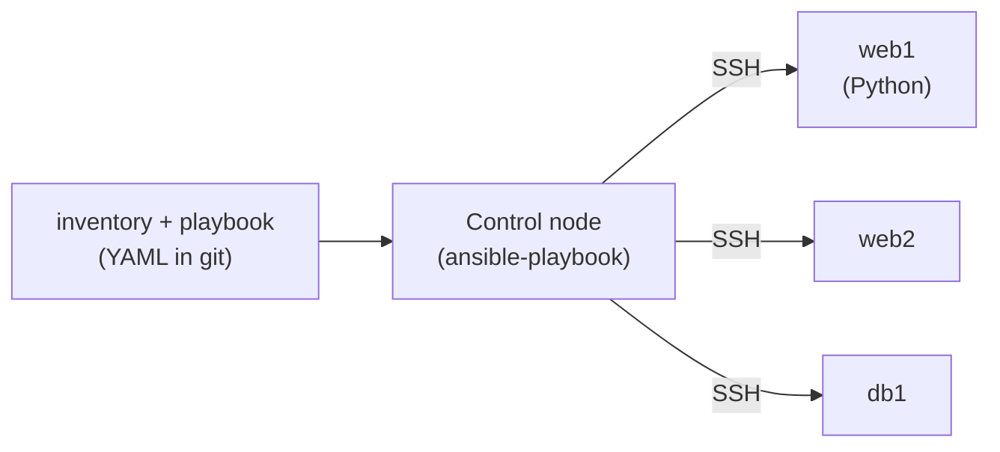
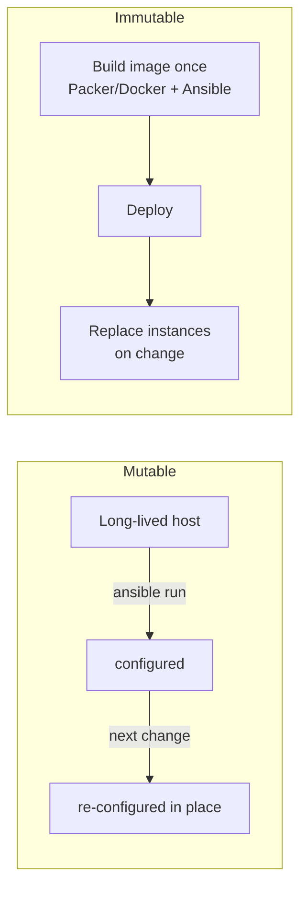

# Configuration Management (Ansible)

**Configuration management (CM)** is the discipline of bringing already-running hosts to a
known, declared state — installing packages, writing config files, managing services and
users — in a **repeatable, versioned, idempotent** way, so that the state of a fleet is
defined in code rather than in someone's memory or a wiki. **Ansible** is the dominant
open-source CM tool today: it is **agentless** (it talks to hosts over plain SSH),
**push-based**, and describes desired state in YAML **playbooks** built from **modules**
that are individually idempotent.

This topic is about the *delivery/operations* angle: how CM fits alongside provisioning
(Terraform) and immutable images in a modern pipeline, what Ansible's execution model
actually is, and the trade-offs interviewers probe (agentless vs agent, push vs pull,
mutable-configure vs immutable-bake, config drift). Secrets *in deploys* are covered more
deeply in `devops-cicd/secrets-management`; provisioning infra is
`devops-cicd/infrastructure-as-code-terraform`; the GitOps pull model is
`devops-cicd/gitops`.

> [!KEY-TAKEAWAY]
> **Terraform provisions infrastructure** (creates the VMs, networks, load balancers);
> **Ansible configures what runs on it** (packages, files, services) — they are
> complementary, not competitors. Ansible is **agentless (SSH), push-based, and
> idempotent**: you declare the desired end state and it is safe to re-run. The big modern
> tension is **mutable configuration (Ansible on long-lived hosts) vs immutable images
> (bake an AMI/container once, replace on change)** — cloud-native shops lean immutable to
> kill **config drift**, but CM still owns image-baking, bare metal, network gear, and
> legacy fleets.

---

## Configuration management vs provisioning

The single most common Ansible interview question is "how is Ansible different from
Terraform?" The crisp answer: they operate at **different layers** and are **complementary**.

| | **Provisioning (Terraform)** | **Configuration management (Ansible)** |
|---|---|---|
| Job | Create/destroy **infrastructure** (VMs, VPCs, subnets, LBs, DNS, IAM) | Configure the **inside** of hosts (packages, files, services, users) |
| Model | Declarative, keeps **state** of what it created | Declarative-ish desired state per task; **stateless** (no central state file) |
| Typical target | Cloud provider APIs | Existing servers over SSH/WinRM |
| Lifecycle verb | "stand up / tear down" | "bring to desired state / converge" |

- **Terraform** knows about a resource graph and a **state file**; it plans the diff
  between declared and actual infra and applies it. It is *not* designed to manage the
  minute-by-minute contents of a running OS.
- **Ansible** assumes the host already exists (Terraform, a cloud console, or bare metal
  made it) and drives it to a configured state. It has **no state file**; the "state" is
  whatever the modules find on the box at run time.
- **The common pairing:** Terraform provisions the fleet and outputs IPs; Ansible then
  configures each host. Ansible *can* call cloud APIs too (it has `amazon.aws`, `azure`
  modules), but for full infra lifecycle Terraform is the better tool because of its state
  and planning model.

> [!INTERVIEW]
> Don't say "Ansible and Terraform do the same thing." Say: **Terraform provisions the
> infrastructure; Ansible configures the software on it.** Terraform keeps state and plans
> a diff; Ansible is stateless and converges each host to declared state. In a pipeline
> they run in sequence: `terraform apply` → `ansible-playbook`.

---

## The Ansible execution model (agentless, push, over SSH)

Ansible's defining architectural choices:

- **Agentless.** There is **no daemon/agent** installed on managed hosts. The control node
  connects over **SSH** (Linux) or **WinRM** (Windows). The only requirement on targets is
  a working SSH login and (usually) **Python**, which most Linux distros ship by default.
  This is a huge operational win: nothing to install, patch, or secure on every node.
- **Push-based.** You run `ansible-playbook` from a **control node** (your laptop, a CI
  runner, or a bastion) and it *pushes* configuration out to the inventory. Contrast with
  Puppet/Chef, where agents on each node *pull* their catalog from a central server on a
  schedule.
- **How a task runs:** for most modules Ansible **copies a small Python module to the
  target, executes it there over the SSH connection, collects JSON results, and deletes
  it.** The logic runs *on the target*, not on the control node.
- **No always-on server.** Ansible is "serverless" in the sense that the open-source CLI
  needs no central server. (**Ansible Automation Platform / AWX** add a web UI, RBAC,
  scheduling, and inventory sync on top, but the core engine is still push-over-SSH.)



> [!WARNING]
> Agentless does not mean "credential-less." The control node needs SSH access (keys) and
> usually `become` (sudo) rights on every managed host. That SSH key / bastion is now a
> high-value target — protect it like any deploy credential.

### Performance and scale (why "push doesn't scale")

The reason push feels slow at scale is concrete: **`forks`** (default **5**) caps how many
hosts Ansible configures in parallel, and **each task is at least one SSH round-trip per
host**, so network latency — not CPU — dominates. A play is executed task-by-task across
the fork batch: task 1 runs on the first 5 hosts, then task 2 on those 5, and so on.

**Worked estimate.** Say 20 tasks, 500 hosts, ~50 ms SSH round-trip per task-host (connect +
push module + run + collect). Wall time is roughly `tasks × ceil(hosts / forks) × RTT`:

- **forks=5:** `20 × ceil(500/5) × 50 ms = 20 × 100 × 50 ms = 100,000 ms ≈ 100 s`.
- **forks=50:** `20 × ceil(500/50) × 50 ms = 20 × 10 × 50 ms = 10,000 ms ≈ 10 s` — a 10×
  win just from widening the batch.

The standard levers:

- **Raise `forks`** (e.g. 50–100) — more hosts in parallel; bounded by control-node CPU/RAM
  and file descriptors.
- **SSH pipelining** (`pipelining=True`) — collapses multiple SSH ops per task into one,
  cutting round-trips.
- **`ControlPersist`/`ControlMaster`** — reuses one SSH connection across tasks instead of
  re-handshaking every task (big win since the per-task RTT above includes the connect).
- **`strategy: free`** — hosts race ahead independently instead of the default `linear`
  (lock-step at each task), so fast hosts don't wait on slow ones.
- **`gather_facts: false`** or a **fact cache** — skips the setup round-trip when you don't
  need facts.
- **mitogen** / **async** tasks for further speedups on very large fleets.

This is the mechanical answer behind "push doesn't self-heal and fans out SSH at scale":
pull-based agents converge locally with no fan-out, which is why 10k+ static fleets often
prefer them.

---

## Inventory: hosts and groups

The **inventory** is the list of hosts Ansible manages, organized into **groups**. It can
be a static file (INI or YAML) or **dynamic** (a script/plugin that queries a cloud
provider for live hosts).

```ini
# inventory.ini
[web]
web1.example.com
web2.example.com

[db]
db1.example.com

[prod:children]   # a group of groups
web
db

[web:vars]
http_port=8080
```

- **Groups** let you target a subset (`--limit web`) and attach **group_vars**. Hosts can
  belong to many groups.
- **Special groups:** `all` (every host) and `ungrouped`.
- **Dynamic inventory** is essential in the cloud: an `aws_ec2` inventory plugin returns
  currently-running instances (optionally grouped by tag), so you never hand-edit IPs. This
  is how CM stays correct in an autoscaling world.
- **Variable precedence** is a classic gotcha: `host_vars` override `group_vars`; more
  specific groups override `all`; command-line `-e` extra-vars beat almost everything. Know
  that `-e` wins.

**Worked example — resolving one variable.** Suppose `http_port` is defined in four places
for a `web` group containing `web1` and `web2`:

| Source | Value | Precedence |
|---|---|---|
| `roles/app/defaults/main.yml` | `80` | lowest |
| `group_vars/web` | `8080` | middle |
| `host_vars/web1` | `9090` | high |
| `-e http_port=443` (extra-vars) | `443` | wins over everything |

Trace it:

- **Run `ansible-playbook site.yml` (no `-e`):** `web1` walks the chain default(80) →
  group(8080) → host(9090) and resolves to **9090** (host_vars is most specific). `web2`
  has no host_vars, so it stops at group(8080) and resolves to **8080**. Neither sees `80` —
  the role default is only a fallback when nothing more specific exists.
- **Run `ansible-playbook site.yml -e http_port=443`:** extra-vars sit at the top of the
  ~20-level precedence list and cannot be overridden by inventory, so **both `web1` and
  `web2` resolve to 443**, silently ignoring the 9090 and 8080 below them. This is exactly
  why a stray `-e` in a CI job is such a confusing debugging trap.

---

## Playbooks, plays, and tasks

A **playbook** is a YAML file — the unit you run with `ansible-playbook`. It contains one
or more **plays**; each play maps a set of **hosts** to an ordered list of **tasks**; each
task calls **one module**.

```yaml
- name: Configure web tier          # a PLAY
  hosts: web
  become: true                      # run tasks with sudo
  vars:
    nginx_port: 8080
  tasks:
    - name: Install nginx           # a TASK -> one module
      ansible.builtin.apt:
        name: nginx
        state: present

    - name: Deploy config from template
      ansible.builtin.template:
        src: nginx.conf.j2
        dest: /etc/nginx/nginx.conf
      notify: Restart nginx         # fire a handler on change

  handlers:
    - name: Restart nginx
      ansible.builtin.service:
        name: nginx
        state: restarted
```

- **Tasks run top-to-bottom, in order** (imperative *ordering*, declarative *per-task*
  state). This differs from Puppet's default where resource order is derived from
  dependencies.
- **By default a play stops on the first failing host** for that host (others continue);
  `any_errors_fatal`, `serial`, and `max_fail_percentage` tune batch behavior (e.g. for
  rolling deploys).
- **`hosts:`** selects from inventory; **`become:`** does privilege escalation (sudo);
  **`vars:`** and included var files parameterize the play.

### Tags — running a subset

Tag tasks (or whole roles) and run only the ones you want with `--tags` / `--skip-tags`:

```yaml
    - name: Install nginx
      ansible.builtin.apt: { name: nginx, state: present }
      tags: [install]

    - name: Deploy app code
      ansible.builtin.copy: { src: app/, dest: /srv/app }
      tags: [deploy]
```

`ansible-playbook site.yml --tags deploy` runs *only* the deploy task and skips install —
handy for "just push new code without re-running the whole provisioning play."
`--skip-tags install` runs everything except install.

### block / rescue / always — try/catch/finally

`block` groups tasks; `rescue` runs if any task in the block fails; `always` runs no matter
what (cleanup). This is Ansible's structured error handling:

```yaml
    - name: Deploy with rollback
      block:
        - ansible.builtin.copy: { src: app-v2/, dest: /srv/app }
        - ansible.builtin.service: { name: app, state: restarted }
      rescue:
        - ansible.builtin.copy: { src: app-v1/, dest: /srv/app }   # roll back
        - ansible.builtin.service: { name: app, state: restarted }
      always:
        - ansible.builtin.command: /usr/local/bin/notify-deploy-status
```

If the restart fails, `rescue` restores the previous version; `always` fires the
notification either way.

### serial — rolling deploys

`serial` batches the play across hosts instead of hitting them all at once — the core of a
rolling deploy. With 8 hosts in the `web` group:

```yaml
- hosts: web
  serial: 2                 # or "25%"
  max_fail_percentage: 25
```

Ansible runs the whole play on hosts 1–2, then 3–4, then 5–6, then 7–8 — **four batches of
2**. If more than 25% of a batch fails it aborts before touching the rest, so a bad release
takes down at most a fraction of the fleet, not all of it. `serial: "25%"` on 8 hosts is the
same 2-at-a-time batching, expressed as a percentage so it scales with fleet size.

---

## Modules and idempotency

A **module** is the unit of work — `apt`, `template`, `service`, `copy`, `user`, `file`,
`git`, `uri`, cloud modules, etc. Ansible ships thousands, grouped into **collections**
(e.g. `ansible.builtin`, `amazon.aws`, `community.general`).

The critical property is **idempotency**: a well-written module **checks current state
first and only makes a change if the target differs from the declared desired state.** Run
the same playbook ten times and, after the first converging run, later runs report
`ok`/`changed=0` and touch nothing.

- Modules report one of: **`ok`** (already correct, no change), **`changed`** (a change was
  made), **`failed`**, or **`skipped`**. `changed` is what triggers **handlers** and what
  you watch in `--check` mode.
- **`state: present` / `absent` / `started`** etc. describe *desired end state*, not
  "run this command." That is the declarative core.
- **`command`/`shell` are the escape hatch and are NOT idempotent by default** — they just
  run a command every time and always report `changed`. Guard them with `creates=`,
  `removes=`, `when:`, or `changed_when:` to restore idempotency. Prefer a real module over
  `shell` whenever one exists.
- **`--check` (dry-run)** plus **`--diff`** predicts what would change without changing it —
  the CM equivalent of `terraform plan`. Modules that don't support check mode will warn.

> [!WARNING]
> `command`/`shell`/`raw` break idempotency. `- shell: systemctl restart nginx` restarts
> nginx on *every* run and always shows `changed`. Use the `service`/`systemd` module
> (idempotent) or add `changed_when`/`creates` guards.

---

## Idempotency and desired-state convergence

Idempotency deserves its own mental model because it is *the* thing interviewers test.

- **Definition:** an operation is idempotent if applying it once or many times yields the
  same result. In CM terms: **re-running the playbook on an already-converged host makes no
  changes.**
- **Why it matters:** you can run the playbook on a schedule or in every deploy to *correct
  drift* safely, without fear of duplicating side effects (e.g. appending a line twice,
  restarting a healthy service, creating a user that exists).
- **Desired-state vs procedural:** you declare *what* should be true (`nginx installed and
  running`), not *the steps*. The module figures out whether work is needed. This is why
  CM is often called "declarative-ish" — plays are ordered like a script, but each task is
  a declared end state.
- **Enforcement / self-healing:** running the same playbook periodically (cron, AWX
  schedule, or a pipeline stage) means any manual change on the box gets reverted back to
  code on the next run. That is how CM fights drift on mutable infrastructure.
- **The failure mode** is using non-idempotent building blocks (`shell`, `lineinfile`
  without anchors, `command` without `creates`) so the "converged" run still shows
  `changed`, breaking your ability to use `changed` as a signal.

**Worked example — reading the `PLAY RECAP` across runs.** Take the 4-task web play
(install nginx, deploy config, create a user, start service) against `web1`. The `PLAY
RECAP` line is Ansible's per-host tally, and watching `changed=` across runs is how you
*demonstrate* idempotency in an interview:

```
# Run 1 — fresh host, everything needs doing
PLAY RECAP
web1 : ok=4  changed=3  unreachable=0  failed=0

# Run 2 — nothing changed on the box, re-run immediately
PLAY RECAP
web1 : ok=4  changed=0  unreachable=0  failed=0
```

Run 1 shows `ok=4` (all four tasks succeeded) with `changed=3` (three of them actually did
work; the fourth — say the user already existed from the base image — was `ok` with no
change). Run 2 shows `changed=0`: every module checked actual vs declared state, found the
box already converged, and touched nothing. That `changed=0` **is** idempotency.

Now break it manually and re-run to see self-healing:

```
$ systemctl stop nginx     # a human "fixes" something by hand
$ ansible-playbook site.yml
PLAY RECAP
web1 : ok=4  changed=1  unreachable=0  failed=0
```

Only the `service: state=started` task reports `changed=1` — it detected nginx was stopped
and restarted it, reverting the drift. The other three stayed `ok`.

Contrast a task built on the escape hatch:

```yaml
- name: Restart nginx the wrong way
  ansible.builtin.shell: systemctl restart nginx   # no state check
```

This reports `changed=1` on **every** run — run 1, run 2, run 10 — because `shell` just
executes and can't tell "already correct" from "needed fixing." Now `changed` is noise: you
can no longer trust the recap to tell you whether the fleet actually drifted.

> [!INTERVIEW]
> A clean definition scores points: "Idempotent means re-running the playbook on a host
> already in the desired state produces **no changes** — Ansible checks actual vs declared
> state per task and only acts on a diff. That lets me run it repeatedly to correct drift
> safely." Then name the trap: `command`/`shell` are not idempotent unless guarded.

---

## Handlers and notify

A **handler** is a task that runs **only when notified** by another task that reported
`changed`, and it runs **once, at the end of the play** (after all tasks), even if
notified many times.

```yaml
tasks:
  - name: Write nginx config
    ansible.builtin.template:
      src: nginx.conf.j2
      dest: /etc/nginx/nginx.conf
    notify: Restart nginx

handlers:
  - name: Restart nginx
    ansible.builtin.service:
      name: nginx
      state: restarted
```

- The point is **efficiency + idempotency**: only restart nginx *if the config actually
  changed*. If the template task reports `ok` (no change), the handler never fires — so a
  converged run doesn't needlessly bounce the service.
- **Handlers run at the end of the play by default** (batched), and **only once** no matter
  how many tasks notified them. Use `meta: flush_handlers` to force them to run mid-play.
- **Gotcha:** if a later task in the same play fails *before* handlers flush, the notified
  handler may not run — the config changed but the service wasn't restarted, leaving the
  host in a half-applied state on the next run. (`--force-handlers` mitigates this.)

**Worked example — the half-applied trace.** Play order: (1) template writes a new
`nginx.conf` → reports `changed`, so `Restart nginx` is **queued** (not run yet — handlers
flush at play end); (2) a later `deploy app` task **fails**. Because the play aborts on that
host before the end, the queued handler **never flushes**. Result: the new config sits on
disk but nginx is still running the *old* config in memory — a silent split-brain. Worse,
on the **next run** the template task now reports `ok` (disk already matches), so it does
*not* re-notify — nginx never picks up the config unless you restart it by hand. Fixes:
`ansible-playbook --force-handlers` (flush queued handlers even after a failure), or insert
`- meta: flush_handlers` right after the template task to restart immediately rather than
deferring to play end.

---

## Facts and gathering

**Facts** are variables Ansible auto-discovers about each host at the start of a play (the
`setup` module): OS family, IP addresses, CPU/memory, mounted disks, distribution version,
etc. They live under `ansible_facts` (e.g. `ansible_facts['os_family']`).

```yaml
- name: Install the right package manager's package
  ansible.builtin.package:
    name: httpd
  when: ansible_facts['os_family'] == "RedHat"
```

- **Why they matter:** facts make playbooks portable/conditional — install `apt` packages
  on Debian, `yum` on RedHat, size a config to the host's RAM, template the host's own IP.
- **Cost:** fact-gathering adds an SSH round-trip and Python run per host at play start. For
  large fleets you can set `gather_facts: false` when you don't need them, or use the
  **fact cache** to reuse facts across runs.
- **Custom facts:** drop scripts in `/etc/ansible/facts.d/` (`*.fact`) to expose local
  facts; `set_fact` creates facts at runtime.

---

## Templates and Jinja2

Ansible uses the **Jinja2** templating engine to generate files (and to evaluate variables
and conditionals). The **`template` module** renders a `.j2` file with the play's variables
and facts and writes it to the target — the workhorse for config files.

```jinja
# nginx.conf.j2
worker_processes {{ ansible_facts['processor_vcpus'] }};
upstream app {

  server {{ backend }};

}
server {
  listen {{ nginx_port }};
  server_name {{ inventory_hostname }};
  location / { proxy_pass http://app; }
}
```

- **`template` vs `copy`:** `copy` ships a file verbatim; `template` renders Jinja2 first.
  Both are idempotent (they only write if the resulting content differs).
- Jinja2 supports variables `{{ }}`, logic ``, **filters** (`{{ x | default('y') }}`,
  `| to_json`, `| b64encode`), and tests. Filters are the idiomatic way to transform data.
- **Gotcha:** a change in a template's *rendered output* is what marks the task `changed`
  and fires a `notify` handler — so parameterizing configs via templates is what makes
  "change config → restart service" reliable and idempotent.

---

## Roles and Ansible Galaxy

A **role** is the standard unit of **reuse and organization** — a directory with a fixed
layout that bundles tasks, handlers, templates, files, variables, and defaults so a
capability (e.g. "nginx", "postgres") can be dropped into any playbook.

```
roles/nginx/
├── tasks/main.yml        # what to do
├── handlers/main.yml     # e.g. restart nginx
├── templates/            # *.j2 config files
├── files/                # static files to copy
├── vars/main.yml         # high-precedence vars
├── defaults/main.yml     # low-precedence, overridable defaults
└── meta/main.yml         # role deps, Galaxy metadata
```

```yaml
- hosts: web
  roles:
    - nginx
    - { role: app, app_version: "1.4.2" }
```

- **Why roles:** DRY, shareable, testable units; a playbook becomes a thin list of roles
  applied to host groups.
- **`defaults/` vs `vars/`:** `defaults` are the *lowest* precedence (meant to be
  overridden by the caller); `vars` are *high* precedence (hard to override). Put tunables
  in `defaults`.
- **Ansible Galaxy** is the public hub for sharing roles and **collections** (`ansible-galaxy
  install`, `requirements.yml`). Collections are the modern packaging unit — a namespaced
  bundle of roles + modules + plugins (e.g. `community.postgresql`).
- **Idempotency of roles** is only as good as the modules inside them — a role full of
  `shell` tasks is not idempotent.

---

## Ad-hoc commands

An **ad-hoc command** runs a single module against hosts *without* writing a playbook —
useful for one-off, quick, or investigative tasks.

```bash
# Are all web hosts reachable?
ansible web -m ping

# Free disk on the db group
ansible db -m shell -a "df -h /"

# Idempotently ensure a package (still declarative even ad-hoc)
ansible web -m ansible.builtin.apt -a "name=htop state=present" --become
```

- Syntax: `ansible <pattern> -m <module> -a "<args>"`. `-m command` is the default module.
- **When to use:** reboots, checking uptime, quick fact checks, emergency one-offs.
- **When NOT to use:** anything you want repeatable/reviewed/versioned — that belongs in a
  playbook in git. Ad-hoc commands are not code-reviewed or recorded, so they're anti-drift
  only in the moment.

---

## Ansible Vault: secrets in configuration

**Ansible Vault** encrypts sensitive data (passwords, keys, cert files, whole var files) so
secrets can live **in git alongside the playbooks** without being plaintext.

```bash
ansible-vault encrypt group_vars/prod/secrets.yml
ansible-vault edit  group_vars/prod/secrets.yml
ansible-playbook site.yml --ask-vault-pass    # or --vault-password-file
```

- Encrypts with a symmetric passphrase (AES-256); the ciphertext is committed, the
  passphrase is supplied at run time (prompt, file, or a script that fetches it).
- **Limits:** Vault is *static* secret storage — the passphrase is a shared bootstrap
  secret and there's no rotation, audit, or dynamic issuance. For dynamic secrets, leases,
  and rotation prefer **HashiCorp Vault** or a cloud secrets manager, often via a lookup
  plugin. See `devops-cicd/secrets-management` for the pipeline/deploy secrets picture
  (Vault, External Secrets, sealed-secrets, SOPS, OIDC-to-cloud) — Ansible Vault is the
  file-encryption option, not a full secrets platform.
- **`no_log: true`** on tasks that handle secrets prevents leaking them into Ansible output
  and logs.

---

## Ansible vs Chef, Puppet, and Salt

The comparison interviewers love, because it exposes the **push vs pull** and **agent vs
agentless** trade-offs.

| Tool | Agent? | Model | Language | State style |
|---|---|---|---|---|
| **Ansible** | **Agentless** (SSH/WinRM) | **Push** (control node → hosts) | YAML playbooks (+ Jinja2) | Declarative-ish, ordered tasks |
| **Puppet** | Agent (puppet daemon) | **Pull** (agent pulls catalog from master ~every 30 min) | Puppet DSL (Ruby-based) | Declarative, resource graph |
| **Chef** | Agent (`chef-client`) | **Pull** | Ruby DSL ("recipes"/"cookbooks") | Procedural-leaning |
| **Salt** | Agent (`salt-minion`), *or* agentless SSH | Push/pull (ZeroMQ bus) | YAML + Jinja | Declarative |

Key trade-offs:

- **Agentless (Ansible):** nothing to install/maintain/secure on nodes; easy to start;
  great for heterogeneous or short-lived fleets. Downside: **push doesn't scale to tens of
  thousands of nodes** as cleanly (each run fans out SSH connections), and enforcement is
  only as frequent as you run it.
- **Agent/pull (Puppet/Chef):** agents check in on a schedule, so drift is **continuously
  corrected** without someone pushing; scales to very large fleets. Downside: an agent to
  install/upgrade, a master to run, and a steeper DSL.
- **Push (Ansible):** you control exactly *when* changes go out (good for ordered,
  orchestrated deploys). **Pull:** self-service convergence, better for massive scale and
  autonomous nodes.
- Ansible's ease-of-start and agentless model are why it became dominant, but "which is
  best" is contextual — huge, static, compliance-driven fleets often still run pull-based
  agents for continuous enforcement.

> [!INTERVIEW]
> Two axes decide it: **agent vs agentless** and **push vs pull.** Ansible = agentless +
> push (simple, on-demand, you control timing). Puppet/Chef = agent + pull (continuous
> enforcement, scales to huge fleets, more to run). Salt can do both. There's no universal
> winner — match the model to fleet size and enforcement needs.

---

## Mutable configuration vs immutable images (bake vs configure)

The most important *modern* framing: should you **configure long-lived servers in place**
(mutable, Ansible converges them repeatedly) or **bake an image once and replace the whole
host on change** (immutable)?

- **Mutable / configure-in-place:** hosts are long-lived; every change is an Ansible run
  that mutates the existing box. Pro: fast small changes, no rebuild. Con: over time hosts
  **drift**, accumulate one-off changes, and become **snowflakes** ("works on web1, not
  web3") — hard to reproduce.
- **Immutable / bake-then-replace:** you build a fully-configured artifact (an **AMI** via
  **Packer**, or a **container image**) once, deploy it, and **never modify a running host** —
  to change anything you build a new image and replace instances (rolling/blue-green). Pro:
  every host is identical and reproducible, drift is impossible, rollback = redeploy the old
  image. Con: even tiny changes require a rebuild + redeploy.



- **Where Ansible fits in immutable:** it's often the tool that **bakes** the image
  (Packer's Ansible provisioner runs playbooks against the build instance), then is done —
  the running fleet is never touched. So immutable doesn't kill Ansible; it moves it
  *left*, into image build.
- **Cattle vs pets:** immutable treats servers as interchangeable **cattle** (replace,
  don't repair); mutable tends toward hand-tended **pets**. Cloud-native/containerized
  shops strongly prefer immutable.

> [!INTERVIEW]
> "Bake vs configure": **bake** = build a complete image once and replace hosts to change
> (immutable — no drift, trivial rollback, slower small changes); **configure** = mutate
> long-lived hosts in place (mutable — fast, but drifts into snowflakes). Modern cloud
> leans immutable, and Ansible's role shifts to *building the image* rather than patching
> live boxes.

---

## Configuration drift and where CM fits today

**Configuration drift** is the gap that opens between the *intended* configuration (what's
in code) and the *actual* state of hosts, caused by manual hotfixes, failed partial runs,
package auto-updates, and one-off SSH sessions. Drift is the root cause of "works on one
box, not the other" and of unreproducible incidents.

How CM addresses drift:

- **Run the playbook regularly** (schedule / pipeline stage): because it's idempotent, each
  run re-asserts declared state and **reverts** manual changes — continuous convergence.
- **`--check --diff`** detects drift without fixing it (audit mode) — good for a
  compliance/reporting job.
- **Pull-based agents (Puppet/Chef)** enforce continuously by design; Ansible needs you to
  trigger runs (AWX schedules, cron, CI).
- **The strongest anti-drift answer is immutable infrastructure** — if you never mutate a
  running host, drift can't accumulate.

Where config management still fits in a container/immutable/GitOps world:

- **Baking images** (VM AMIs and, sometimes, container base images).
- **Bare metal and network gear** (switches, firewalls, appliances) that can't be
  containerized.
- **Bootstrapping** hosts (the Kubernetes nodes themselves, CI runners, bastions).
- **Legacy/stateful fleets** and databases that aren't (yet) immutable.
- **Orchestration** of multi-step operational runbooks (ordered rolling restarts, one-off
  migrations).

Inside Kubernetes, application config is usually managed by K8s primitives (ConfigMaps,
Secrets) and delivered via **GitOps** (`devops-cicd/gitops`) rather than Ansible — so CM's
territory is the layer *below and beside* the cluster, not app config inside it.

> [!KEY-TAKEAWAY]
> Config drift = actual host state diverging from code. CM fights it by **idempotent
> re-runs** that re-converge to declared state; **immutable infra** eliminates it by never
> mutating running hosts. Even in a cloud-native shop, Ansible still owns **image baking,
> bare metal/network gear, host bootstrapping, and legacy fleets** — it moves to the edges,
> it doesn't disappear.

---

## Common follow-up questions

- **"Terraform or Ansible — which do I use?"** Both: Terraform provisions the infra,
  Ansible configures the hosts. Terraform has state and plans a diff; Ansible is stateless
  and converges per task.
- **"How does Ansible achieve idempotency if it's just running commands?"** It doesn't just
  run commands — each *module* checks current state and only acts on a diff. `command`/`shell`
  are the exception and must be guarded (`creates`, `changed_when`).
- **"Why agentless? What's the catch?"** No agent to install/patch/secure; only needs SSH +
  Python. Catch: push doesn't self-heal between runs and fans out SSH at very large scale.
- **"What's the difference between `copy` and `template`?"** `copy` ships a file verbatim;
  `template` renders Jinja2 (vars/facts) first. Both are idempotent.
- **"When would you NOT use Ansible?"** For app config *inside* Kubernetes (use ConfigMaps +
  GitOps), for full infra lifecycle (use Terraform), or when you've gone fully immutable and
  only bake images.
- **"How do handlers help idempotency?"** They restart a service *only if* its config task
  reported `changed`, so a converged run doesn't bounce healthy services.
- **"Ansible Vault vs HashiCorp Vault?"** Ansible Vault is static file encryption committed
  to git; HashiCorp Vault is a dynamic secrets platform (leases, rotation, audit). For
  deploy-time secrets prefer the latter — see `secrets-management`.

## References

- Ansible documentation — Getting Started, Playbooks, Modules, Roles, Vault:
  <https://docs.ansible.com/>
- Ansible glossary & "How Ansible works" (agentless, push, SSH):
  <https://www.ansible.com/overview/how-ansible-works>
- Ansible Galaxy (roles & collections): <https://galaxy.ansible.com/>
- Jinja2 templating docs: <https://jinja.palletsprojects.com/>
- HashiCorp Packer — Ansible provisioner (image baking): <https://developer.hashicorp.com/packer>
- HashiCorp — "Infrastructure as Code" and Terraform vs configuration management:
  <https://developer.hashicorp.com/terraform/intro>
- Martin Fowler — "ImmutableServer" and "SnowflakeServer":
  <https://martinfowler.com/bliki/ImmutableServer.html>
- Puppet / Chef / SaltStack documentation (agent/pull comparison):
  <https://www.puppet.com/docs>, <https://docs.chef.io/>, <https://docs.saltproject.io/>
