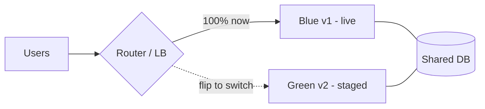
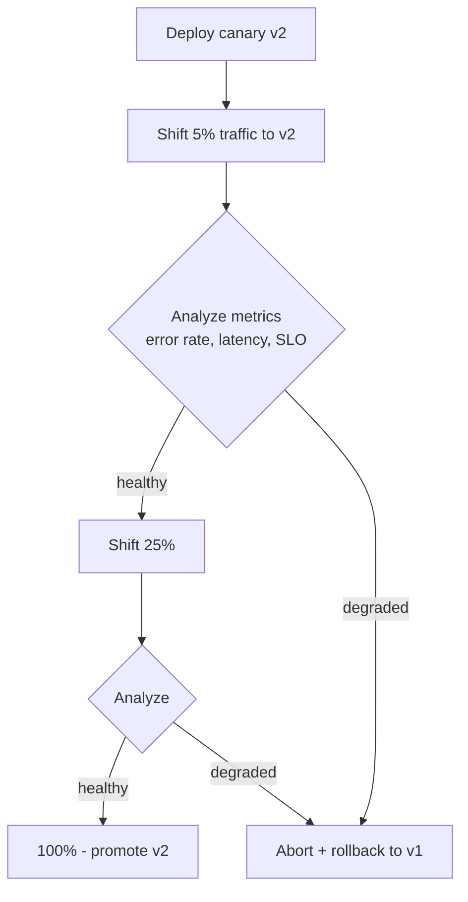
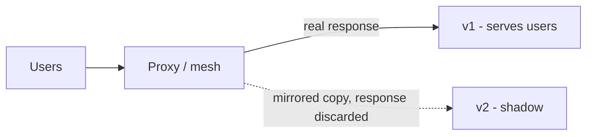
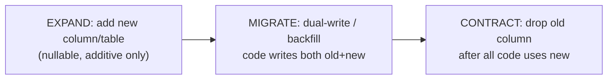

# Deployment Strategies

This page covers **how you roll new code into production without breaking users** —
the menu of deployment strategies (recreate, rolling, blue-green, canary, shadow,
A/B), the ideas that make them safe (feature flags, progressive delivery, health
gating, bake time, backward-compatible schema changes), and how you undo a bad
release (rollback vs roll-forward). It is concept-first with tool grounding in
Kubernetes, Argo Rollouts/Flagger, and load balancers.

> [!KEY-TAKEAWAY]
> Three ideas unlock this whole topic. **(1) Deploy ≠ release:** shipping bits to a
> server (deploy) is separate from exposing behavior to users (release) — feature
> flags decouple them. **(2) Every safe strategy is a way to limit blast radius and
> keep a fast, reliable rollback path** — you're trading infrastructure cost and
> complexity for lower risk. **(3) Zero-downtime deploys require backward-compatible
> changes** (especially the database), because for a moment old and new code run at
> the same time.

---

## Why deployment strategy matters

A deployment strategy is the *procedure* by which a new version replaces the old one
in a running environment. The naive approach — stop everything, swap the binary,
start again — causes downtime and, if the new version is broken, a full outage with
a slow recovery. Strategy choice is fundamentally about three levers:

- **Blast radius** — if this release is bad, how many users/requests are affected
  before you notice?
- **Rollback speed & reliability** — how fast, and how *safely*, can you get back to
  the known-good version?
- **Cost & complexity** — extra infrastructure (a second full environment), routing
  machinery (service mesh / smart LB), and operational sophistication.

The DORA/Accelerate research is the backdrop: elite teams deploy frequently *and*
have low change-failure rates, which is only possible when deployments are small,
automated, and safely reversible. Good deployment strategy is what makes "deploy
often" not mean "break often."

> [!INTERVIEW]
> A strong opening framing in an interview: "There's no single best strategy — I
> pick based on rollback needs, whether I can run two versions at once, statefulness,
> and cost. Let me walk the options by blast radius." That signals you think in
> trade-offs, not buzzwords.

---

## Recreate deployment

**Recreate** (aka "stop-and-start" or "highlander") terminates *all* instances of
the old version, then starts the new version. In Kubernetes this is
`strategy.type: Recreate` on a Deployment.

```yaml
spec:
  strategy:
    type: Recreate
```

- **Consequence:** there is a window where **zero instances serve traffic** →
  downtime. No two versions run simultaneously.
- **When it's actually the right call:** when old and new versions *cannot* coexist —
  e.g. an incompatible schema/format change, an exclusive lock on a resource, or a
  desktop/batch app where a maintenance window is acceptable. Also common in
  non-prod/dev environments where downtime is free.
- **Trade-off:** simplest possible strategy, cheapest (no extra capacity), but the
  worst availability. Rollback = recreate again with the old version (still downtime).

---

## Rolling update

**Rolling update** replaces instances **incrementally** — spin up some new-version
instances, drain/terminate some old ones, repeat until fully migrated. It is the
Kubernetes *default* (`RollingUpdate`) and the default for most orchestrators/ASGs.

Two knobs control the pace and the availability guarantee:

- **`maxSurge`** — how many *extra* instances above desired count may exist during
  the roll (controls speed / extra capacity used).
- **`maxUnavailable`** — how many instances may be *missing* below desired count
  (controls the availability floor). Setting `maxUnavailable: 0` with `maxSurge > 0`
  gives a zero-downtime roll (always add before removing).

```yaml
spec:
  strategy:
    type: RollingUpdate
    rollingUpdate:
      maxSurge: 25%
      maxUnavailable: 0
```

- **Pros:** no downtime (with the right knobs), no double infrastructure (only surge
  overhead), built in everywhere.
- **Cons / gotchas:**
  - During the roll, **both versions serve traffic simultaneously** → the release
    *must* be backward compatible (API + schema).
  - **Rollback is slow** — it's another rolling update in reverse, not an instant
    switch. If v2 corrupts data, the gradual rollout has already touched real users.
  - No traffic-percentage precision or automated metric analysis by itself — it's
    "replace pods and hope the readiness probes catch failures." Health checks
    (readiness probes) gate whether a new pod receives traffic, which limits — but
    doesn't eliminate — the blast radius.

---

## Blue-green deployment

**Blue-green** runs **two complete production environments**: *blue* (current live)
and *green* (new version). You deploy and fully test green while blue still serves
100% of traffic, then **flip the router** (load balancer, DNS, or service selector)
to send all traffic to green **instantly**. Blue is kept warm as the instant
rollback target.



- **Pros:**
  - **Instant cutover and instant rollback** — flip the router back to blue if green
    misbehaves. This is the headline benefit and the reason interviewers love it.
  - Green can be smoke-tested with production-like traffic *before* the switch.
  - No "mixed versions serving users" during the steady state (unlike rolling).
- **Cons / trade-offs:**
  - **~2x infrastructure** during the deploy (two full environments). Costly for
    large fleets, though cloud autoscaling/short overlap mitigates it.
  - **Stateful components are the hard part.** The **database is usually shared**
    between blue and green (you can't clone prod data instantly), so schema changes
    must be **backward compatible** — otherwise flipping back to blue breaks on a
    migrated schema. This is why blue-green + expand/contract migrations go together.
  - It's an all-at-once switch — 100% of users hit v2 at t=0, so a bad-but-passing-
    smoke-tests release still has full blast radius until you flip back (canary
    limits this better).

> [!WARNING]
> "Blue-green gives free rollback" is only true for **stateless** app code. If green
> ran a destructive, non-backward-compatible migration (dropped a column, rewrote
> data), flipping back to blue does **not** roll back the data — blue now points at a
> schema it doesn't understand. Always pair blue-green with expand/contract schema
> changes.

---

## Canary deployment

**Canary** releases the new version to a **small subset of traffic/users first**
(e.g. 1% → 5% → 25% → 100%), monitors health/business metrics at each step, and
**progressively rolls forward** only if metrics stay healthy — otherwise it
**automatically rolls back**. The name comes from "canary in a coal mine": a small
early-warning sample.



- **Key idea:** limit blast radius. A bad release harms ~1-5% of traffic for the
  duration of a bake step, not everyone.
- **Automated analysis** is what makes canary powerful: compare canary vs baseline
  on error rate, latency (p99), saturation, and business KPIs. If the canary is
  statistically worse, abort. Tools: **Argo Rollouts** (`AnalysisTemplate`/
  `AnalysisRun` querying Prometheus, etc.; "if the analysis is unsuccessful the
  rollout is aborted") and **Flagger**.
- **Bake time:** each step waits (bakes) long enough to gather signal — a canary that
  jumps straight to 100% in seconds isn't a canary.
- **vs rolling:** rolling replaces pods but doesn't hold a *fixed small percentage*
  and analyze — canary is deliberate, metric-gated traffic shifting with a defined
  rollback trigger.
- **Cons:** needs traffic-shifting infrastructure (service mesh / smart ingress) for
  precise percentages, good metrics/observability, and takes longer to fully roll
  out. Precise weights below "1 pod = X%" require a traffic router, not just replica
  counts.

---

## Canary vs A/B testing

These look similar (both send some users to a new variant) but answer **different
questions**:

| | Canary | A/B testing |
|---|---|---|
| Purpose | **Safety** — is the new build stable? | **Business experiment** — which variant performs better? |
| Split by | Usually random % of traffic | **User attribute** (geo, cohort, header, logged-in) for a controlled experiment |
| Success metric | Technical: errors, latency, saturation | Business: conversion, engagement, revenue |
| Duration | Minutes–hours (until confident) | Days–weeks (statistical significance) |
| Decision | Promote or roll back the *release* | Keep the winning *feature*; both builds may be "fine" |

A/B routes by an *attribute* to compare outcomes; canary routes a random slice to
verify the new version won't hurt anyone. You can implement A/B with feature flags
and it often runs on top of a deploy that already happened.

---

## Shadow (mirror or dark) deployment

**Shadow deployment** (traffic mirroring / dark launch) sends a **copy** of real
production requests to the new version **in parallel**, while the old version still
serves the actual user responses. The new version's responses are **discarded** (or
compared offline) — **users are never affected**.



- **Why:** test the new version under *real* production traffic patterns and load
  before it takes any user traffic — great for performance/regression validation of
  risky rewrites.
- **Gotchas / dangers:**
  - **Side effects must be suppressed.** If the shadow version writes to the same DB,
    sends emails, or calls payment APIs, mirroring causes **duplicate writes/charges**.
    Shadow safely applies mostly to **read/idempotent** paths or requires stubbed
    downstreams.
  - Doubles downstream load; needs response-diffing tooling to be useful.
- Envoy/Istio support request mirroring (`requestMirrorPolicy` / mirror weight).

---

## Feature flags: decoupling deploy from release

A **feature flag** (feature toggle) wraps new behavior in a runtime conditional so
code can be **deployed dark** (shipped but off) and **released** later by flipping
the flag — no redeploy. This is the cleanest expression of *deploy ≠ release*.

```python
if flags.enabled("new-checkout", user):
    return new_checkout(cart)
return old_checkout(cart)
```

- **Enables:** trunk-based development (merge incomplete features behind an off
  flag), gradual/percentage rollouts, instant **kill switch** (turn a bad feature off
  in seconds without a rollback deploy), targeted A/B/canary at the *feature* level,
  and testing in production.
- **Flag types:** release toggles (short-lived, remove after rollout), ops toggles
  (kill switches / circuit breakers), experiment toggles (A/B), permission toggles
  (entitlements).
- **The big gotcha — flag debt:** long-lived, forgotten flags create combinatorial
  code paths that are untested and confusing. Treat release flags as **temporary**;
  remove them once fully rolled out. Tools: LaunchDarkly, Unleash, OpenFeature
  (vendor-neutral API), Flagsmith.

> [!TIP]
> A feature flag is *not* a substitute for a deployment strategy — you still need to
> get the binary out safely. They're complementary: deploy safely (canary/rolling),
> then release the *feature* independently (flag). Combining them gives the finest
> control.

---

## Progressive delivery

**Progressive delivery** is the umbrella term for **canary + automated analysis +
feature flags + gradual traffic shifting done automatically**, with the pipeline
promoting or rolling back based on metrics rather than a human clicking through
steps. It's "continuous delivery, but the release is gradual and metric-gated."

- **Argo Rollouts** — a Kubernetes controller providing a `Rollout` resource (drop-in
  for Deployment) with `canary` and `blueGreen` strategies. Canary uses ordered
  `steps` of `setWeight` and `pause`, and `analysis` (querying Prometheus/Datadog/etc.
  via `AnalysisTemplate`) to auto-abort. Integrates with traffic providers (Istio,
  NGINX, ALB, SMI) for precise weights.

  ```yaml
  strategy:
    canary:
      steps:
      - setWeight: 5
      - pause: {duration: 10m}   # bake + analyze
      - setWeight: 25
      - pause: {duration: 10m}
      - setWeight: 100
      analysis:
        templates:
        - templateName: success-rate   # aborts rollout if unhealthy
  ```

- **Flagger** — similar controller (from Weaveworks/Flux ecosystem) that automates
  canary/blue-green/A/B with metric analysis and webhooks, often paired with a mesh.
- **Why it's the modern default for high-traffic services:** it turns "watch Grafana
  during the deploy and hit rollback if it looks bad" into a codified, automated,
  auditable control loop.

---

## Rollback vs roll-forward

When a release is bad, you have two recovery directions:

- **Rollback** — revert to the previous known-good version. Fast and low-cognitive-
  load *if* the deploy strategy supports it (blue-green flip, canary abort, keep the
  old image). The catch: **you can't roll back state** — data written / migrations
  applied by the bad version may not be reversible.
- **Roll-forward (fix-forward)** — leave the new version deployed and ship a *new*
  fix on top. Preferred when a rollback would be *unsafe* (irreversible migration
  already ran, or the old version can't handle the new schema/data), or when
  re-deploying is fast and the bug is small/known.

| | Rollback | Roll-forward |
|---|---|---|
| Speed | Usually fastest (flip/abort) | As fast as your pipeline can ship a fix |
| Safety with schema/data changes | Risky — old code may not fit migrated data | Safer — you never go backward over a migration |
| Cognitive load mid-incident | Low (known-good) | Higher (write + validate a fix under pressure) |

> [!INTERVIEW]
> "Rollback or roll-forward?" The senior answer: "Default to rollback for stateless
> app bugs because it's fast and reverts to a known-good state. But once a
> non-reversible migration has run, rollback is dangerous — I'd roll forward. This is
> exactly why I make schema changes backward-compatible (expand/contract): it keeps
> rollback safe for as long as possible."

---

## Zero-downtime deploys and backward-compatible schema (expand/contract)

Every rolling/blue-green/canary deploy has a moment where **old and new code run at
the same time against the same database**. For zero downtime, changes must be
**backward compatible in both directions** during that overlap. Database schema
changes are the classic trap because they're not instantly reversible.

The **expand/contract (parallel-change)** pattern makes a breaking schema change
over multiple safe deploys:



1. **Expand** — add the new schema element (new nullable column/table) *additively*.
   Old and new code both still work. Deploy.
2. **Migrate** — deploy code that reads/writes the new shape (often dual-writing old
   and new); backfill existing rows.
3. **Contract** — once *no* running code depends on the old element, drop it in a
   later deploy.

- **Rename column** = never `RENAME` in one shot; it's *add new → dual-write →
  backfill → switch reads → drop old*.
- Other zero-downtime requirements: **graceful shutdown** (drain in-flight requests
  on SIGTERM, deregister from the LB first — Kubernetes `preStop` hook +
  `terminationGracePeriodSeconds`), and **backward/forward-compatible API contracts**
  (additive changes, tolerant readers) so old clients aren't broken.

---

## Traffic shifting and health-check gating

The mechanism underneath canary/blue-green is **traffic shifting** — controlling what
fraction of requests reach each version — and **health gating** — refusing to send
(or continue sending) traffic to unhealthy instances.

- **Where the shift happens:**
  - **Replica-ratio** (Kubernetes without a mesh): approximate weight via pod counts
    (5 canary : 95 stable ≈ 5%). Coarse; can't do 1% with 3 pods.
  - **Service mesh / smart ingress** (Istio, Linkerd, NGINX, ALB weighted target
    groups): precise, request-level weighting independent of pod count.
  - **DNS weighting** (Route 53 weighted records): coarse, and **TTL/caching makes
    the shift slow and imprecise** — fine for big blue-green DNS flips, poor for tight
    canary control.
- **Health checks gate the rollout:**
  - **Readiness probe** — is this instance ready to receive traffic *right now*? A
    failing readiness probe pulls the pod out of the load-balancer pool (no traffic)
    without killing it. This is what makes rolling updates safe: a new pod that fails
    readiness never serves users.
  - **Liveness probe** — is this instance wedged and needing a restart?
  - **Startup probe** — protects slow-starting apps from premature liveness kills.
  - A rollout should also gate on **application/business metrics** (error rate, SLO
    burn), not just process-level probes — a process can be "ready" while returning
    500s.

> [!WARNING]
> Confusing liveness and readiness is a classic incident cause: a **liveness** probe
> that's too aggressive (or checks a dependency) will **restart-loop** healthy pods
> during a dependency blip, turning a minor issue into an outage. Use readiness (not
> liveness) for dependency checks, and don't put external dependencies in liveness.

---

## DORA metrics and how strategy affects them

The **DORA / Accelerate** research defines four key metrics for software delivery
performance; deployment strategy directly moves them.

| Metric | Definition | Elite target (State of DevOps) |
|---|---|---|
| **Deployment frequency** | How often you deploy to production | On-demand (multiple per day) |
| **Lead time for changes** | Time from commit to running in production | < 1 hour (elite) |
| **Change failure rate** | % of deployments causing a failure needing remediation | 0–15% (elite low end ~5%) |
| **Failed deployment recovery time** | Time to recover from a failed deployment (formerly MTTR) | < 1 hour |

- Safe strategies (canary, blue-green, feature flags) let you **deploy more
  frequently** with a **lower change-failure rate** (small blast radius) and **faster
  recovery** (instant rollback/kill switch) — i.e. they improve throughput *and*
  stability together, which is DORA's core finding (the two are not a trade-off for
  elite teams).
- DORA later added a fifth signal, **reliability** (operational performance /
  meeting SLOs), and a **deployment rework/instability** measure. The alerting/SLO
  math lives in the observability and SRE topics — see cross-references.

> [!KEY-TAKEAWAY]
> Interviewers use DORA as the "why." The point of picking a smart deployment
> strategy is measurable: smaller, safer, reversible releases push change-failure
> rate down and recovery time down, which is exactly what lets you deploy frequently.

---

## Choosing a strategy (decision guide)

| Strategy | Downtime | Rollback | Extra infra | Blast radius | Best for |
|---|---|---|---|---|---|
| Recreate | Yes | Slow (redeploy) | None | 100% | Incompatible versions; dev; maintenance windows OK |
| Rolling | No* | Slow (reverse roll) | Small (surge) | Gradual, uncontrolled | Default for stateless services |
| Blue-green | No | **Instant flip** | ~2x | 100% at cutover | Fast rollback needs; stateless apps |
| Canary | No | **Auto-abort** | Small–moderate | **Tiny (1-5%)** | High-traffic services; when you have good metrics |
| Shadow | No | N/A (no user impact) | ~2x + diffing | **Zero** | Validating rewrites under real load |
| A/B | No | Flag off | Flag platform | Targeted cohort | Business experiments, not safety |

\* zero-downtime only with `maxUnavailable: 0` and correct readiness probes.

Decision drivers to say out loud: *Can old & new coexist?* (no → recreate/expand-
contract) · *How fast must rollback be?* (instant → blue-green/canary) · *Do I have
metrics to auto-analyze?* (yes → canary/progressive) · *Is the change stateful?* (yes
→ expand/contract + roll-forward mindset) · *What's my infra budget?* (tight →
rolling).

---

## Common follow-up questions

- **"What's the difference between canary and blue-green?"** Blue-green flips 100% of
  traffic at once between two full environments (instant rollback, 2x infra); canary
  shifts a small percentage first and progressively increases while analyzing metrics
  (smallest blast radius, needs traffic control + metrics).
- **"How do canary and A/B testing differ?"** Canary = release *safety* (random %,
  technical metrics); A/B = business *experiment* (route by attribute, business
  metrics, run for statistical significance).
- **"How do you do a zero-downtime deploy with a schema change?"** Expand/contract:
  additive-first change, dual-write/backfill, then drop the old element in a later
  deploy — never a breaking change in one step.
- **"When would you roll forward instead of rolling back?"** When a rollback is unsafe
  — an irreversible migration already ran, or old code can't handle the new
  schema/data.
- **"Deploy vs release?"** Deploy = ship bits to servers; release = expose behavior to
  users. Feature flags decouple them so you can deploy dark and release with a toggle.
- **"How does a rolling update avoid downtime?"** `maxUnavailable: 0` + `maxSurge` (add
  new pods before removing old) plus readiness probes so only healthy pods get traffic.
- **"What breaks blue-green rollback?"** A destructive/non-backward-compatible
  migration on the shared DB — flipping back to blue then hits an incompatible schema.
- **"What's dangerous about shadow deployments?"** Un-suppressed side effects
  (duplicate writes/charges/emails) from mirroring non-idempotent requests.

## References

- DORA / Google — *Accelerate* (Forsgren, Humble, Kim) and the State of DevOps
  reports; DORA "Four Keys" metric definitions (dora.dev).
- Google SRE Book & SRE Workbook — canarying, safe releases, error budgets.
- Kubernetes docs — Deployments (`RollingUpdate`/`Recreate`, `maxSurge`,
  `maxUnavailable`), Pod lifecycle probes (readiness/liveness/startup), graceful
  termination.
- Argo Rollouts docs — canary & blue-green strategies, `setWeight`/`pause` steps,
  `AnalysisTemplate`/`AnalysisRun` automated analysis and abort.
- Flagger docs — automated canary/blue-green/A/B with metric analysis.
- Martin Fowler — *BlueGreenDeployment*, *CanaryRelease*, *FeatureToggles*,
  *ParallelChange* (expand/contract).
- Istio / Envoy docs — traffic shifting, weighted routing, request mirroring.
- 12-Factor App; Trunk-Based Development (trunkbaseddevelopment.com).
- Cross-references: `monitoring-and-observability` (deploy markers, post-deploy
  smoke/synthetic checks, SLO burn) · `sre-sla-slo-sli-reliability` (error budgets
  gating releases) · `gitops` (Argo CD pull-based promotion) · `secrets-management`
  (secrets in deploys) · Kubernetes domain (probe/rollout internals).
