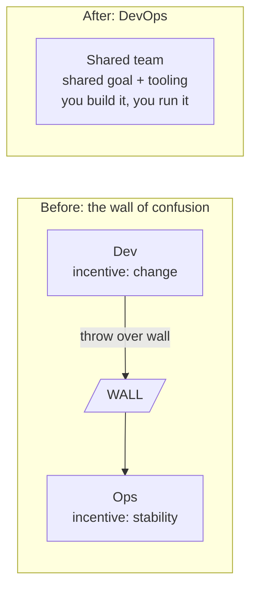
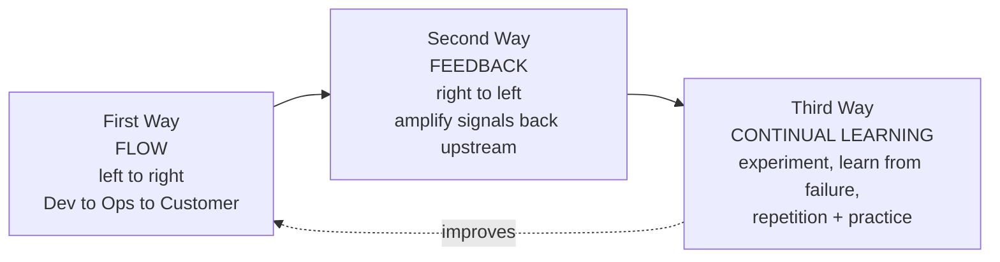
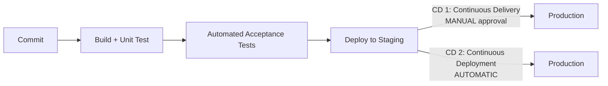

# DevOps Fundamentals & Culture

DevOps is the discipline of shortening the distance between writing code and running it
reliably in production. It is *not* a job title, a tool, or a team you can buy — it is a
combination of **culture** (shared ownership, blamelessness), **practices** (CI/CD,
infrastructure as code, automated testing), and **tools** (pipelines, Terraform, GitOps)
that together let an organisation ship small changes frequently, safely, and with fast
feedback. The word is a portmanteau of *Development* and *Operations*, and its founding
premise is that the historical split between "devs who write features and throw them over
a wall" and "ops who keep the wall standing" is the root cause of slow, painful, unreliable
delivery.

This note owns the *cultural and conceptual* foundation of the domain: what DevOps is and
why it exists (the wall of confusion, Conway's law), the frameworks used to reason about it
(CALMS, the Three Ways), the vocabulary that trips people up in interviews (CI vs
continuous delivery vs continuous deployment), the industry-standard way to *measure*
delivery performance (the DORA four keys), and how DevOps relates to the roles that grew
out of it (SRE, Platform Engineering). Deeper mechanics live in sibling topics:
pipeline internals in `cicd-pipeline-concepts`, error-budget math and alerting in
`sre-sla-slo-sli-reliability` and the `observability` domain, and the incident *process*
in the upcoming `reliability-and-operations` domain — this topic gives the framing and
cross-links onward.

> [!KEY-TAKEAWAY]
> DevOps = **Culture + Automation + Lean + Measurement + Sharing** (CALMS), aimed at
> optimising the *whole* flow from idea to running software. If you can only remember two
> things for an interview: (1) it breaks the dev/ops silo through shared ownership
> ("you build it, you run it"), and (2) the DORA four keys — deployment frequency, lead
> time for changes, change failure rate, and time to restore service — are how you *measure*
> whether you're actually doing it, not vanity metrics like lines of code.

---

## What DevOps is (and is not)

**Definition.** DevOps is a set of cultural values, practices, and tools that increase an
organisation's ability to deliver applications and services at high velocity — evolving and
improving products faster than teams using traditional software-development and
infrastructure-management processes. It emerged around 2009 (Patrick Debois coined
"DevOpsdays"; John Allspaw & Paul Hammond's *"10+ Deploys per Day"* talk at Velocity 2009 is
the canonical origin story).

**Why it exists — the wall of confusion.** Traditionally, Development is measured on
*change* (ship features) and Operations on *stability* (keep it up). Those incentives
conflict. Dev "throws code over the wall" to Ops with little context; Ops, fearing
instability, slows releases with heavyweight change control. The result is the
**wall of confusion**: friction, finger-pointing, and slow, batchy, risky releases. DevOps
dissolves the wall by aligning both groups on a *shared* goal — fast, safe delivery of value
to users — and giving them shared tooling and shared responsibility.

**What DevOps is *not*:**

- **Not just a toolchain.** Buying Jenkins/GitHub Actions/Terraform without changing
  incentives and ownership gives you "the same silos with faster scripts." Tools *enable*
  DevOps; they are not DevOps.
- **Not a single "DevOps engineer" who sits between dev and ops** — that often just rebuilds
  the wall with one person as the gate. (The title exists in industry, but the *goal* is to
  distribute the capability, not centralise it in a bottleneck.)
- **Not the same as Agile**, though complementary: Agile optimises how you *build*
  (iterative feature development); DevOps extends that flow through *delivery and
  operations* all the way to the running system.

> [!INTERVIEW]
> A very common opener: *"What is DevOps?"* The weak answer is "it's about CI/CD and
> automation tools." The strong answer names it as a **cultural + practice + tooling** shift
> whose purpose is optimising end-to-end flow and breaking the dev/ops silo, then cites a
> framework (CALMS or the Three Ways) and a measurement model (DORA). Always separate
> *culture* from *tools* — that separation is what interviewers are listening for.

---

## The wall of confusion & breaking silos

The **wall of confusion** (term popularised by Andrew Clay Shafer & Lee Thompson) names the
hand-off boundary where dev and ops responsibilities meet and communication breaks down.
Symptoms interviewers like to hear you diagnose:

- Releases batched into rare, large, high-risk events ("release weekends").
- "Works on my machine" — environment drift between dev, test, and prod.
- Blame cycles after incidents ("bad code" vs "bad infra").
- Ops as a ticket queue that devs wait on for environments, config, or deploys.

**How DevOps breaks the silo:**

| Lever | What it does |
|---|---|
| Shared ownership ("you build it, you run it") | The team that writes a service also operates it, so quality and operability are designed in, not bolted on. |
| Shared tooling & self-service | IaC + pipelines let devs provision and deploy without an ops ticket queue. |
| Small, frequent changes | Smaller batches → smaller blast radius, easier debugging, faster feedback. |
| Blameless culture | Failures become learning, so people surface problems instead of hiding them. |
| Automation of the delivery path | Removes manual, error-prone hand-offs (build, test, deploy). |

The point is not to *delete* the ops discipline — reliability, capacity, security still
require deep expertise — but to embed it, or make it available as a self-service platform,
rather than gating every change behind a hand-off. That "platform" framing is exactly what
`platform-engineering-and-idp` builds on.

---

## Conway's Law

**Conway's Law (1968):** *"Organisations design systems that mirror their own communication
structure."* If four teams build a compiler, you get a four-pass compiler; if front-end and
back-end teams barely talk, you get a brittle, chatty API between them.

**Why it matters to DevOps.** Your architecture will end up shaped like your org chart, so
if you want a certain architecture (e.g. loosely-coupled, independently-deployable
microservices) you must *first* shape the teams that way — small, autonomous, owning a
service end-to-end. This is the reasoning behind the **Inverse Conway Manoeuvre**:
deliberately restructure teams to induce the architecture you want. It also explains why a
monolithic org struggles to run microservices well: the communication structure fights the
target design.

> [!TIP]
> Conway's Law connects directly to *Team Topologies* (Skelton & Pais): stream-aligned
> teams own a slice of value end-to-end, and a platform team reduces their cognitive load.
> Mentioning the Inverse Conway Manoeuvre signals senior-level org awareness.

---

## CALMS framework

**CALMS** is the most widely-cited model for *assessing* how "DevOps" an organisation is
(attributed to Jez Humble, building on John Willis & Damon Edwards' original "CAMS"). It is
five pillars:

| Letter | Pillar | What it means in practice |
|---|---|---|
| **C** | **Culture** | Shared responsibility, blamelessness, collaboration over hand-offs. The hardest and most important pillar. |
| **A** | **Automation** | Automate the repetitive delivery path: builds, tests, deploys, provisioning (CI/CD + IaC). |
| **L** | **Lean** | Small batch sizes, limit work in progress, eliminate waste, optimise the whole value stream (roots in Lean manufacturing/Toyota). |
| **M** | **Measurement** | Measure outcomes (DORA metrics, MTTR, flow) to drive improvement — you can't improve what you don't measure. |
| **S** | **Sharing** | Share knowledge, tooling, and responsibility across dev and ops; blameless postmortems, internal docs, ChatOps (running ops tasks via chat-bot commands so actions and context are visible to the whole team). |

Why small batches (the heart of "Lean") actually help — concretely: a release that bundles
200 commits and then fails gives you 200 suspects to bisect and a blast radius covering
everything those 200 changes touched. Deploy those same 200 commits *one at a time* and a
failure points at exactly one change and caps the damage to that one change's surface area.
Smaller batches shorten the feedback loop (you learn faster) and shrink risk (you break
less) at the same time — that is the queueing/blast-radius argument behind Lean's push for
small batch sizes.

Interview trap: CALMS leads with **Culture**, not Automation. Candidates who list tools
first are signalling a tools-first (i.e., incomplete) understanding. The "L" is also
frequently missed — it's **Lean**, the batch-size/flow discipline borrowed from Lean
manufacturing.

---

## The Three Ways

The **Three Ways** are the principles underpinning DevOps, from *The Phoenix Project* and
*The DevOps Handbook* (Gene Kim et al.). They are ordered and cumulative.

1. **The First Way — Flow (Systems Thinking).** Optimise the *whole* left-to-right flow of
   work from Development → Operations → customer. Make work visible, reduce batch sizes and
   handoffs, and never pass a known defect downstream. This is where CI/CD, small PRs, and
   trunk-based development live.
2. **The Second Way — Feedback.** Create fast, constant feedback flowing *right-to-left* so
   problems are seen and fixed quickly: automated tests, monitoring, telemetry, "stop the
   line" (Andon cord) when something breaks. Shift-left testing and observability are Second
   Way practices.
3. **The Third Way — Continual Learning and Experimentation.** Foster a culture of
   experimentation, taking risks, learning from success *and* failure, and understanding
   that repetition and practice are prerequisites to mastery. Blameless postmortems, game
   days, chaos engineering, and dedicated improvement time are Third Way practices.

> [!INTERVIEW]
> If asked "what are the Three Ways?", the crisp mnemonic is **Flow → Feedback → Learning**
> (left-to-right, right-to-left, then continuous improvement of the whole loop). Tie each to
> a concrete practice: Flow=CI/CD, Feedback=monitoring/tests, Learning=blameless
> postmortems.

---

## CI vs Continuous Delivery vs Continuous Deployment

These three terms are constantly conflated. The "CD" abbreviation is genuinely ambiguous —
it means **two different things** depending on context.

- **Continuous Integration (CI):** Every developer merges to a shared mainline
  **frequently** (ideally many times a day), and *each* merge triggers an automated build +
  test to catch integration problems early. CI is fundamentally about *not* letting branches
  diverge — it is a practice about merging, verified by automation. It ends at a
  tested, built artifact.
- **Continuous Delivery (CD):** Every change that passes the pipeline is *automatically*
  proven to be **releasable** and pushed to a staging/pre-prod environment, so you *could*
  deploy to production **at any time with the push of a button** — but the final promotion to
  prod is a **manual decision** (a human clicks "go").
- **Continuous Deployment (also CD):** Goes one step further — *every* change that passes
  all automated gates is deployed to production **automatically, with no human approval
  step**. Continuous Deployment implies Continuous Delivery; the reverse is not true.

| | Continuous Integration | Continuous Delivery | Continuous Deployment |
|---|---|---|---|
| Merge to mainline + auto build/test | ✅ | ✅ | ✅ |
| Auto-deploy to staging / always releasable | | ✅ | ✅ |
| Deploy to **production** | manual, separate | **manual "button push"** | **fully automatic** |
| Requires strong automated test suite + progressive delivery | basic | strong | strongest (no human gate) |

> [!WARNING]
> The single most common mistake: saying Continuous *Delivery* deploys to production
> automatically. It does **not** — Delivery keeps a human "release" decision; only
> continuous *Deployment* removes the manual gate. Getting this distinction right is a
> frequent screening question.

> [!INTERVIEW]
> A senior follow-up is almost guaranteed: *"So why doesn't everyone do Continuous
> Deployment?"* Removing the human gate is only safe if the automation is trustworthy enough
> to catch regressions **without** a person looking — which in practice requires: (1) a
> comprehensive, fast automated test suite you actually trust; (2) progressive delivery
> (canary or blue-green) so a bad change hits a small % of traffic first; (3) automated
> rollback triggered by health/error-rate alarms; and (4) feature flags to decouple
> "deployed" from "released." Many orgs deliberately stay at Continuous *Delivery* and keep
> the manual gate — you trade a little speed to retain human judgment for high-risk,
> compliance-sensitive, or regulated changes. The gate is a *choice*, not a failure to
> automate. (Progressive-delivery mechanics live in `cicd-pipeline-concepts`.)

Pipeline stage mechanics (artifacts, gates, environments, promotion) are covered in depth in
`cicd-pipeline-concepts`.

---

## The DORA four key metrics

**DORA** (DevOps Research and Assessment — Nicole Forsgren, Jez Humble, Gene Kim; research
in the book *Accelerate* and the annual *State of DevOps* reports, now under Google Cloud)
identified **four key metrics** that predict software delivery performance. Two measure
**throughput/velocity**, two measure **stability**. Crucially, elite performers do well on
*both* at once — speed and stability are not a trade-off.

| Metric | Category | What it measures |
|---|---|---|
| **Deployment Frequency (DF)** | Throughput | How often you deploy to production. |
| **Lead Time for Changes (LT)** | Throughput | Time from code committed → code running in production. |
| **Change Failure Rate (CFR)** | Stability | % of deployments that cause a failure in production (needing hotfix/rollback). |
| **Failed Deployment Recovery Time** (formerly **MTTR / Time to Restore**) | Stability | How long to restore service after a production failure. |

Approximate performance bands (from recent State of DevOps reports — exact cutoffs shift
year to year, so cite them as *bands*, not gospel):

| | Elite | High | Medium | Low |
|---|---|---|---|---|
| Deployment frequency | On-demand (multiple/day) | Daily–weekly | Weekly–monthly | < monthly |
| Lead time for changes | < 1 day | 1 day–1 week | 1 week–1 month | 1–6 months |
| Change failure rate | 0–15% | 16–30% | 31–45% | 46–60% |
| Recovery time | < 1 hour | < 1 day | 1 day–1 week | > 1 week |

**Worked example — computing all four for one team, one month.** Take a team over a 30-day
month and plug real counts into each formula:

- **Deployment Frequency:** 60 production deploys in 30 days = 60 ÷ 30 = **2 deploys/day**.
  Multiple per day → **Elite** (on-demand).
- **Lead Time for Changes:** a commit is merged at 09:00, clears CI + acceptance tests +
  staging, and is live in prod at 11:30. 11:30 − 09:00 = **2.5 hours** → under a day →
  **Elite**. (Compute this *per change* and report the median, not the average, so one
  stuck change doesn't skew it.)
- **Change Failure Rate:** of those 60 deploys, 6 needed a hotfix or rollback.
  CFR = 6 ÷ 60 = 0.10 = **10%** → inside the 0–15% band → **Elite**. (Note: had it been 6
  failures out of 30 deploys, CFR = 20% → **High**, not Elite — the *denominator* is total
  deploys, not failures, so shipping more clean deploys actually *lowers* your rate.)
- **Recovery Time:** three incidents that month were restored in 20 min, 45 min, and 90 min.
  Mean = (20 + 45 + 90) ÷ 3 = 155 ÷ 3 ≈ **52 minutes** → under 1 hour → **Elite**.

So this team is Elite on all four — which is the whole point of *Accelerate*: strong
throughput (2/day, 2.5h lead time) and strong stability (10% CFR, ~52 min recovery)
co-occur; they are not traded against each other.

Key points interviewers probe:

- **Two throughput + two stability** — know which is which. DF and LT are speed; CFR and
  recovery are stability.
- They are **outcome metrics for the whole system**, deliberately *not* individual
  productivity metrics. Weaponising DORA as per-developer KPIs (or gaming DF by deploying
  trivially) destroys their value — this is called out explicitly by DORA. A newer **fifth
  measure, reliability** (operational performance vs SLOs), is often added.
- Lead time here means **change lead time** (commit → prod), not "idea → prod" (that broader
  measure is *product* lead time).

> [!KEY-TAKEAWAY]
> Memorise the four: **Deployment Frequency, Lead Time for Changes, Change Failure Rate,
> and Time to Restore Service (recovery time).** Speed (DF, LT) and stability (CFR, recovery)
> move *together* for elite teams — the central empirical finding of *Accelerate*.

Error budgets and how failure rate/reliability *gate releases* are covered in
`sre-sla-slo-sli-reliability`; the alerting/SLO math lives in the `observability` domain.

---

## You build it, you run it

Coined by Amazon's Werner Vogels (2006): *"You build it, you run it."* The team that
develops a service also carries the pager for it in production. This is the operational
expression of shared ownership.

**Why it works:** it creates a tight feedback loop — developers feel the operational pain of
their own design decisions (2am pages for a badly-instrumented service), so they build in
reliability, observability, and operability from the start rather than externalising the
cost onto a separate ops team. It directly supports the Second Way (feedback).

**Trade-offs / senior nuance:**

- It raises **cognitive load** on product teams (they must learn ops), which is precisely
  the problem Platform Engineering addresses by providing paved-road self-service.
- Pure "you build it, you run it" doesn't scale infinitely — hence hybrid models where a
  platform team owns the *undifferentiated heavy lifting* (CI/CD, runtime, observability
  plumbing) and product teams own their service's behaviour and on-call.

---

## Shift-left

**Shift-left** means moving activities that traditionally happen *late* (right) in the
delivery timeline to *earlier* (left) — closer to the developer, closer to commit time. The
canonical targets:

- **Shift-left testing** — run unit/integration/contract tests in CI on every commit, not in
  a big manual QA phase before release. (Where tests run in the pipeline is owned by
  `testing-strategy-in-cicd`.)
- **Shift-left security ("DevSecOps")** — SAST (Static Application Security Testing —
  scanning your own source for vulnerabilities) / SCA (Software Composition Analysis —
  flagging known-vulnerable third-party dependencies) / secret-scanning / IaC-scanning in the
  pipeline instead of a pre-launch pen-test gate. (Owned by `devsecops-and-pipeline-security`.)

**Why:** the cost of fixing a defect grows the later it is found; catching it at commit is
far cheaper than in production. Shift-left is a Second Way (fast feedback) practice.

> [!TIP]
> Modern framing adds **"shift-right"** — testing/observing in production (canaries, feature
> flags, synthetic monitoring, chaos experiments) because some things can only be validated
> under real traffic. Mature teams do *both*: shift-left to catch cheaply, shift-right to
> validate under reality.

---

## Blameless culture & postmortems

**Blameless culture** treats failures and incidents as learning opportunities about the
*system*, not occasions to punish individuals. The core assumption (from Sidney Dekker's
"Just Culture" and the Google SRE book): people generally act reasonably given the
information and tooling they had at the time, so **human error is a symptom of deeper
systemic problems**, not a root cause.

**Why blamelessness is pragmatic, not just kind:** if people are punished for mistakes, they
hide information, avoid risky-but-necessary changes, and stop reporting near-misses — which
*reduces* safety. Blamelessness maximises the honest information flow you need to actually
fix systems.

A **blameless postmortem** documents an incident's timeline, impact, contributing factors,
and — most importantly — **action items** to make the *system* more resilient, naming
mechanisms and roles rather than blaming a person ("the deploy tool allowed an unreviewed
config push" not "Alice pushed bad config").

> [!WARNING]
> "Blameless" does **not** mean "no accountability." Teams are accountable for producing
> follow-up actions and improving the system. It means removing *fear of punishment for the
> individual* so the truth surfaces — accountability shifts from "who to blame" to "what to
> improve."

The deep incident *process* (severity levels, incident command, on-call rotations,
postmortem templates) belongs to the upcoming `reliability-and-operations` domain and is
introduced in `incident-management-and-troubleshooting`.

---

## DevOps vs SRE vs Platform Engineering

These three overlap heavily and interviewers love to test whether you understand the
distinction. A useful framing: **SRE is one prescriptive implementation of DevOps
principles; Platform Engineering is the productisation of the DevOps/self-service capability.**

| | DevOps | SRE (Site Reliability Engineering) | Platform Engineering |
|---|---|---|---|
| Origin | Community/culture movement (~2009) | Google's engineering practice (Ben Treynor, ~2003; *SRE book* 2016) | ~2020s formalisation (Team Topologies, IDP movement) |
| Core idea | Break dev/ops silo; optimise end-to-end flow (a *philosophy*) | "What happens when you ask a software engineer to design an operations function" — apply engineering to reliability with **SLOs & error budgets** (a *prescriptive practice*) | Build an **Internal Developer Platform (IDP)** as a product: paved roads / golden paths that make the right way the easy way |
| Signature artifacts | CALMS, DORA, CI/CD | SLIs/SLOs, error budgets, toil reduction (toil = repetitive manual operational work that scales with load and could be automated), blameless postmortems | Self-service portals (e.g. Backstage), golden-path templates, platform-as-product |
| Relationship | The umbrella philosophy | *Implements* DevOps with concrete reliability engineering | *Enables* DevOps at scale by reducing team cognitive load |

Key one-liners for interviews:

- **"class SRE implements interface DevOps"** (Google's own framing) — SRE is a concrete
  implementation of the abstract DevOps philosophy.
- **Platform Engineering** exists because pure "you build it, you run it" overloads product
  teams; the platform team treats internal developers as customers and provides self-service
  infrastructure so product teams keep autonomy without drowning in operational complexity.
- The three are **complementary, not competing** — a mature org has a DevOps *culture*,
  applies *SRE* practices to reliability, and provides a *platform* to scale it.

SRE mechanics (SLIs/SLOs/error budgets) are introduced in `sre-sla-slo-sli-reliability`;
platform/IDP depth lives in `platform-engineering-and-idp`.

---

## Common follow-up questions

- "Is DevOps a role or a culture?" — Primarily a culture/practice. The "DevOps engineer"
  title exists, but centralising DevOps in one gatekeeping person re-creates the wall of
  confusion; the goal is distributed capability + self-service platforms.
- "How do you measure DevOps success?" — DORA four keys (DF, LT, CFR, recovery time),
  balancing throughput and stability, plus the newer reliability measure. Explicitly *not*
  vanity metrics (lines of code, commits) or per-developer scores.
- "Continuous Delivery vs Continuous Deployment?" — Both automate up to prod-ready;
  Delivery keeps a *manual* production release decision, Deployment is *fully automatic*.
- "What's the difference between DevOps and Agile?" — Agile optimises *building* software
  iteratively; DevOps extends the flow through *delivery and operations* to running software.
- "Explain Conway's Law and why it matters." — Systems mirror org communication
  structure; shape teams to get the architecture you want (Inverse Conway Manoeuvre).
- "What does 'blameless' actually mean — is nobody responsible?" — No punishment of
  individuals so truth surfaces; accountability shifts to fixing the system via action items.
- "How is SRE different from DevOps?" — SRE is a concrete, prescriptive *implementation*
  of DevOps principles centred on SLOs and error budgets.
- "What are the Three Ways?" — Flow, Feedback, Continual Learning/Experimentation.
- "What does the L in CALMS stand for?" — **Lean** (small batches, reduce WIP/waste),
  the most commonly-missed letter.

## References

- Nicole Forsgren, Jez Humble, Gene Kim — *Accelerate: The Science of Lean Software and
  DevOps* (2018); DORA metrics and research basis.
- DORA / Google Cloud — *State of DevOps* reports and the DORA metrics guide
  (dora.dev): four keys + reliability, performance bands.
- Gene Kim, Kevin Behr, George Spafford — *The Phoenix Project*; Gene Kim et al. —
  *The DevOps Handbook* (Three Ways).
- Google — *Site Reliability Engineering* and *The Site Reliability Workbook*
  (sre.google/books): "class SRE implements DevOps", blameless postmortems.
- Jez Humble & David Farley — *Continuous Delivery* (2010): CI/CD distinctions.
- Melvin Conway — *"How Do Committees Invent?"* (1968); Conway's Law.
- Matthew Skelton & Manuel Pais — *Team Topologies* (2019); Inverse Conway Manoeuvre,
  cognitive load, platform teams.
- John Willis & Damon Edwards — origin of CAMS (later CALMS, +Sharing, per Jez Humble).
- Werner Vogels — *"You build it, you run it"* (ACM Queue interview, 2006).
- Sidney Dekker — *The Field Guide to Understanding 'Human Error'* / Just Culture
  (blameless foundations).
