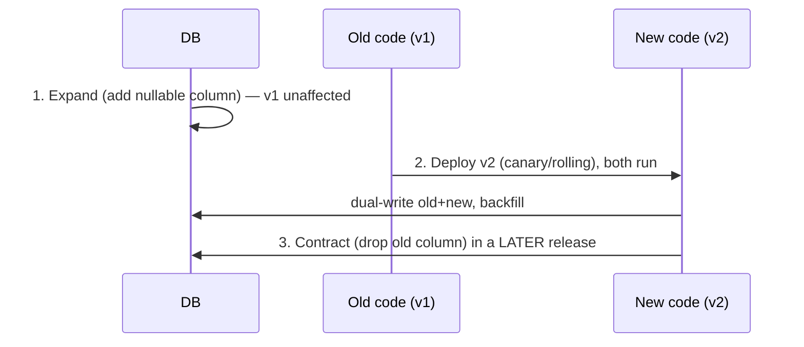
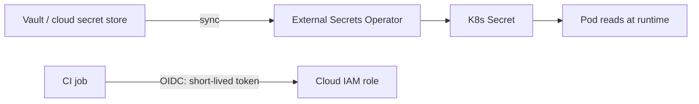

# DevOps System Design & Scenario Questions

This is the **integrative, judgment** topic for DevOps interviews. The other topics in
this domain teach the building blocks — pipelines, IaC (Terraform), config management
(Ansible), deployment strategies, GitOps (Argo CD/Flux), secrets, DevSecOps, SRE/SLOs.
Here you learn to **compose them into a coherent design under constraints and defend
the trade-offs out loud**: "design a CI/CD pipeline for a microservices app," "design
zero-downtime deploys with a DB migration," "design multi-env infra with IaC," "run
this outage," "build a self-service platform," "make us deploy 10× more often safely."

> [!KEY-TAKEAWAY]
> Scenario questions are graded on **method and trade-offs**, not on naming a tool.
> Four habits win: **(1) clarify requirements and constraints first** (scale, team
> size, RTO/RPO, compliance, existing stack) — don't design in a vacuum. **(2) State
> the invariants** you will protect (build once/deploy many, backward-compatible DB
> changes, fast reliable rollback, least privilege, everything reproducible from git).
> **(3) Walk the request end-to-end** (commit → build → test → scan → artifact →
> promote → deploy → verify → observe/rollback). **(4) Name the trade-off every time
> you make a choice** and tie it back to DORA outcomes (deploy frequency, lead time,
> change-failure rate, MTTR).

---

## How to approach a DevOps design or scenario question

There is a repeatable structure interviewers reward. Spending 60–90 seconds on
clarifying questions before drawing anything is a strong senior signal.

1. **Clarify requirements & constraints.** Ask: How many services/teams? Monorepo or
   many repos? What language/runtime and deploy target (VMs, containers, Kubernetes,
   serverless)? Traffic/scale and SLA? Compliance (SOC2/PCI/HIPAA — affects audit,
   secrets, separation of duties)? RTO/RPO for DR? What exists today (greenfield vs
   migration)? Team maturity and on-call model?
2. **State the invariants / principles** you will hold: build-once/deploy-many,
   immutable artifacts, backward-compatible schema changes, everything-as-code in git,
   least-privilege credentials (OIDC over long-lived keys), fast and reliable rollback,
   observability with deploy markers.
3. **Sketch the flow end-to-end** and label stages, gates, and environments. A picture
   (pipeline, GitOps loop, blue-green) beats prose.
4. **Make choices and justify each with a trade-off.** "Trunk-based + short-lived
   branches over GitFlow because it lowers lead time and merge risk for CD." Offer the
   alternative and when you'd pick it.
5. **Cover the non-happy path:** failures, rollback, secrets, security scanning, cost,
   scaling the CI itself, and how you'd measure success (DORA).
6. **Summarize** with the 2–3 biggest risks and what you'd build first (MVP → iterate).

> [!INTERVIEW]
> Anti-patterns that tank a scenario answer: jumping straight to a tool ("I'd use
> Jenkins"), ignoring the database in a zero-downtime question, forgetting rollback,
> using long-lived cloud keys in CI, and giving no measurable definition of success.

---

## Designing a CI/CD pipeline for a microservices application

The canonical prompt. Structure the answer as a **value stream** from commit to
production, and highlight what changes because it's *microservices* (many independently
deployable units).


Key decisions to voice:

- **Build once, deploy many.** Produce one immutable, versioned, ideally signed
  artifact (container image) in CI and promote *that same artifact* through envs.
  Rebuilding per environment breaks the "test what you ship" guarantee.
- **Per-service pipelines** so services deploy independently (independent deployability
  is the whole point of microservices). Share pipeline logic via templates/reusable
  workflows to avoid drift.
- **Static analysis in the diagram** (voice the acronyms): **SAST** = static application
  security testing (scans your source for vulns), **SCA** = software composition analysis
  (flags known-vulnerable *dependencies*), **SBOM** = software bill of materials (the
  signed list of everything in the artifact, for supply-chain auditing), **IaC scan** =
  policy/security checks on Terraform/manifests.
- **Contract testing** (e.g., Pact) between services so you catch breaking API changes
  without a slow full-E2E matrix on every commit. Concretely, **consumer-driven
  contracts**: the *consumer* records the requests it makes and responses it expects into
  a contract; CI replays that contract against the *provider*, so a provider physically
  can't merge a breaking change without a red contract test — far cheaper than spinning
  up the full service graph for E2E.
- **Config vs artifact:** the image is environment-agnostic; environment config and
  secrets are injected at deploy time (12-Factor). Never bake prod secrets into images.
- **Promotion** is a metadata/deploy operation, not a rebuild — often GitOps: CI updates
  an image tag in a config repo; Argo CD/Flux reconciles it into the cluster.

**How canary + auto-rollback actually work** (interviewers always push on the mechanics
behind that last diagram box). Route a **small traffic slice** to the new version and
step it up on a schedule — e.g. **1% → 5% → 25% → 100%**, with a **bake/soak window**
(say 5–15 min) at each step. During each bake, compare the canary's **SLO signals**
against the stable baseline: error rate, latency p99, saturation (CPU/mem). Promotion to
the next step is *gated* on those signals staying healthy (tools like Argo Rollouts or
Flagger automate this analysis). **Auto-rollback** trips the moment a signal breaches its
threshold during a bake — traffic snaps back to the stable version, no human needed.
Gotcha: canary needs **enough traffic to be statistically meaningful** — 1% of a
low-traffic service may see zero errors purely by chance, so for low-QPS services prefer
**blue-green** (flip all traffic, keep the old stack warm for instant rollback).

> [!TIP]
> When they say "microservices," proactively address: independent deployability, the
> versioning/contract problem, avoiding a distributed monolith (services that must
> deploy together), and observability across service boundaries (deploy markers +
> tracing — see the observability domain).

---

## Monorepo vs polyrepo for CI/CD

A frequent sub-question. Both ship microservices; the difference is repo topology and
what it does to your build system.

| Dimension | Monorepo | Polyrepo (repo per service) |
|---|---|---|
| Atomic cross-service change | Easy (one PR/commit) | Hard (coordinate N PRs) |
| Build scope | Must build **only affected** targets (needs path filters / affected-graph tooling like Bazel/Nx/Turborepo) | Naturally scoped to one service |
| Dependency/version drift | Single source of truth, easier | Drift across repos |
| CI blast radius / scale | Big — needs strong caching & selective builds or CI melts | Small per repo |
| Access control | Coarser (whole repo) | Fine-grained per repo |
| Tooling maturity needed | High | Lower |

- **Monorepo gotcha:** without *affected-target detection*, every commit triggers every
  build — CI cost and time explode. The fix is a build graph (Bazel/Nx/Turborepo) or CI
  path filters plus aggressive remote caching.
- **Polyrepo gotcha:** a shared library change fans out into many coordinated PRs and
  version bumps; contract tests and good versioning become essential.

There is no universally right answer — tie it to team size, tooling maturity, and how
often changes span services.

---

## Designing a zero-downtime deployment (strategy + DB migration + rollback)

The single most common "gotcha" scenario, because candidates forget the database.
Zero-downtime requires that **old and new code run simultaneously for a window**, so
every change must be backward-compatible during that overlap.

- **Strategy:** rolling, blue-green, or canary (see the deployment-strategies topic).
  Pick based on rollback speed, cost of a second environment, and blast radius.
- **The database is the hard part.** Use **expand/contract (parallel change)**:
  1. **Expand:** make an additive, backward-compatible schema change (add a nullable
     column / new table / new index). Old code ignores it; deploy is safe.
  2. **Migrate/dual-write & backfill:** new code writes both old and new; backfill data.
  3. **Contract:** only after all instances run new code and data is migrated, remove
     the old column/field — in a *later* release.
- **Never** rename or drop a column in the same release that starts using the new one —
  during the overlap the other version breaks.
- **Rollback** must be planned: keep the previous artifact deployable, and ensure the
  schema is compatible with the previous code (expand/contract makes app rollback safe;
  a destructive migration makes rollback impossible → prefer roll-forward there).



**Worked example — rename `users.username` → `users.handle` across 4 releases.**
The rename is the trap: done in one release it breaks the overlap. Spread over four:

| Release | Migration | App reads | App writes | Rollback-safe? |
|---|---|---|---|---|
| **R1 (expand)** | `ALTER TABLE users ADD COLUMN handle VARCHAR NULL` | `username` | `username` | Yes — new column is nullable and untouched by old code |
| **R2 (dual-write + backfill)** | `UPDATE users SET handle = username WHERE handle IS NULL` (batched) | `username` | **both** `username` + `handle` | Yes — R1 code still works; `handle` is just extra data |
| **R3 (switch reads)** | none | `handle` | both | Yes — rolling back to R2 still reads a fully-populated `username` |
| **R4 (contract)** | `ALTER TABLE users DROP COLUMN username` | `handle` | `handle` | **No** — old code needed `username`; roll *forward* only |

Why you can't collapse steps: if R1 and R3 were one release, during the rolling deploy a
new instance reads `handle` (still `NULL` for existing rows) while an old instance is
still writing only `username` — the new pods return blanks. Dual-write (R2) plus backfill
is what makes every row valid in *both* columns before any reader depends on the new one.
Only R4 is destructive, so it ships alone, after R3 has fully baked and you're confident
you won't roll back.

> [!WARNING]
> A migration that is not backward-compatible (drop/rename, `NOT NULL` without default,
> long table lock) breaks zero-downtime and blocks rollback. Also beware long-running
> `ALTER`s that lock large tables — use online-DDL tooling or additive steps.

---

## Designing multi-environment infrastructure with IaC

"Design dev/staging/prod with Terraform." The goal is **environments that are
structurally identical, differing only by parameters**, and changes that promote the
same way code does.

- **Modules:** encapsulate a reusable unit (VPC, cluster, service) as a module; each
  environment instantiates the module with different variables (sizes, counts, CIDRs).
  This kills copy-paste drift — the definition is DRY, the inputs vary.
- **Environment isolation:** separate **state per environment** (and often per
  component) so a `terraform apply` in dev can never touch prod. Use separate state
  files/backends or Terraform workspaces (workspaces are lighter but share backend
  config and are easy to misuse for strong prod isolation).
- **Promotion:** promote the *module version* (git tag) through envs — apply in dev,
  then staging, then prod, ideally gated in a pipeline. Plan in CI, apply on approval.
- **Layering:** split slow-changing foundational infra (networking, IAM) from
  fast-changing app infra so a small app change doesn't re-plan the whole account.

```hcl
# environments/prod/main.tf
module "service" {
  source        = "git::https://example.com/modules/service.git?ref=v1.4.0"
  environment   = "prod"
  instance_type = "m5.large"
  min_replicas  = 6
  max_replicas  = 30
}
```

> [!TIP]
> Separate state per environment is the single most important isolation control —
> blast radius of a bad `apply` is bounded to one environment. Directory-per-env with
> distinct backends is generally safer than one workspace-switching config for prod.

---

## Terraform state, locking, and drift at scale

State design is where IaC scenarios get deep (details also in the terraform topic).

- **Remote state with locking** (e.g., S3 + DynamoDB lock, or Terraform Cloud/`gcs`)
  prevents two concurrent `apply`s from corrupting state. Local state on a laptop does
  not scale to a team. (Note: Terraform **1.10+** added native S3 **lockfile-based**
  locking via `use_lockfile = true`, so the separate DynamoDB lock table is now optional
  — but the *reason* for locking is unchanged, and DynamoDB remains common in older
  configs.)
- **State is sensitive** — it can contain secrets/attributes in plaintext; encrypt the
  backend and restrict access.
- **Split state** by blast radius and change frequency; huge monolithic state makes
  every plan slow and risky. Use `terraform_remote_state`/data sources to reference
  outputs across states.
- **Drift** (someone changed infra in the console) is detected by `plan`; run periodic
  `plan` in CI to catch it. Reconcile by importing or reverting. `terraform import`
  brings unmanaged resources under management.
- **Never edit state by hand;** use `terraform state mv/rm/import`.

---

## Secrets management for a fleet

"How do secrets get to hundreds of services safely?" (Deploy/pipeline angle; the
security domain owns key lifecycle/crypto — cross-reference it.)

- **Never** commit secrets to git or bake them into images. Store them in a **secrets
  manager** — HashiCorp Vault, AWS Secrets Manager / SSM, GCP Secret Manager.
- **Injection at deploy time:** apps read secrets at startup/runtime (env or mounted
  file) rather than build time. In Kubernetes use the **External Secrets Operator**
  (syncs from Vault/cloud into K8s Secrets) or **Sealed Secrets/SOPS** for GitOps
  (encrypt secrets so ciphertext can safely live in git; only the cluster can decrypt).
- **CI-to-cloud auth:** use **OIDC federation** (GitHub Actions/GitLab → cloud IAM role)
  to get short-lived credentials — eliminates long-lived static keys stored as CI
  secrets. This is a top modern best practice.
- **Dynamic secrets & rotation:** Vault can mint short-lived DB credentials per app;
  rotation is automatic and leaked creds expire fast. Design rotation so deploys pick up
  new versions without downtime.
- **Least privilege & audit:** each service/pipeline gets only the secrets it needs;
  every access is logged (compliance).



---

## Migrating from manual deploys to automated CD

A classic "brownfield" scenario. Interviewers want an incremental, low-risk plan — not
a big-bang rewrite.

1. **Establish CI first:** get every commit building and testing automatically; add a
   version-control-everything baseline. You can't safely automate deploys you can't
   reproducibly build.
2. **Automate build-once artifacts** and store them in a registry.
3. **Codify the deploy** (script the existing manual steps → pipeline as code). Keep a
   human approval gate initially (continuous *delivery*).
4. **Add safety nets:** automated smoke tests, health checks, and a scripted rollback
   *before* removing the human.
5. **Introduce a safe strategy** (blue-green or canary) so failures have small blast
   radius and fast rollback.
6. **Increase frequency gradually;** watch change-failure rate and MTTR. Move to
   continuous deployment (no manual gate) only once confidence and test coverage justify
   it — and only for lower-risk services first.

> [!INTERVIEW]
> Emphasize *reducing batch size* (smaller, more frequent changes) and building trust
> via metrics. Big-bang cutovers and "automate everything at once" are red flags.
> Culture matters: DORA shows automation succeeds with blameless, collaborative teams.

---

## Designing a self-service developer platform (IDP)

Senior/staff prompt. The goal: **let product teams ship independently with paved-road
golden paths**, while the platform team encodes standards (security, observability,
compliance) so teams don't reinvent or bypass them.

- **Golden paths / templates:** scaffolding (e.g., Backstage software templates) that
  generates a repo with a compliant pipeline, IaC, Dockerfile, and observability wired
  in. New service in minutes, standards baked in.
- **Self-service via abstractions:** developers declare intent ("I need a Postgres and a
  service with 3 replicas"); the platform provisions via IaC modules / a control plane
  (e.g., Crossplane, or an internal API) without a ticket to ops.
- **Guardrails not gates:** policy-as-code (OPA/Conftest, Kyverno) enforces standards
  automatically instead of manual review bottlenecks.
- **Platform as a product:** measure adoption and developer experience; the platform
  team owns reliability and a roadmap, treating internal devs as customers.
- **Trade-off:** flexibility vs standardization. Too rigid → teams route around it; too
  loose → no leverage. Paved road = easy default, escape hatches allowed.

---

## Scaling CI: runner fleet, caching, and parallelization

"CI takes 45 minutes / costs too much — fix it." Attack it on three axes.

- **Parallelization:** split test suites across parallel jobs (test sharding/matrix),
  fan-out independent stages, and use build graphs so only *affected* targets build
  (critical in monorepos).
- **Caching:** cache dependencies (package managers) and build outputs (Docker layer
  cache, Bazel/Gradle remote cache) keyed correctly so cache hits are frequent but never
  serve stale results. Bad cache keys cause either misses (slow) or poisoning (wrong).
- **Runner fleet:** autoscale runners (ephemeral, on-demand) to absorb bursts without
  paying for idle capacity; right-size instances; use bigger machines for heavy compiles.
  **Ephemeral runners** (fresh per job) also improve security and reproducibility.
- **Test selection & fail-fast:** run fast/cheap checks first, order to fail fast, and
  use test impact analysis to run only tests affected by a change.
- **Flaky test management:** quarantine flaky tests so they don't block or erode trust
  (pipeline-level; the testing domain owns the discipline).

**Worked example — turn the 45-minute pipeline into ~12.** First *measure the split*:

```
queue  10 min → runners idle-wait for capacity
build   5 min → compile + docker build (cold, no cache)
test   28 min → single-threaded test suite  ← dominates
deploy  2 min
        ------
        45 min
```

Test is the bottleneck, not queue — so buying more runners first would waste money.
Instead: **shard the 28-min suite 7 ways** → ~28 ÷ 7 = **4 min** (runs in parallel);
**add Docker layer + remote build cache** so the 5-min build hits cache and drops to
~**1 min**; queue is already small so leave the fleet as-is (a modest autoscale bump
trims it to ~2 min). New total ≈ 2 + 1 + 4 + 2 = **~9–12 min**, roughly a 4× speedup —
and it came from targeting the measured constraint, not optimizing everything blindly.

> [!TIP]
> Diagnose before optimizing: measure where the time goes (queue time vs build vs test
> vs deploy). Long *queue* time → scale runners. Long *test* time → parallelize/select.
> Rebuilding unchanged targets → caching/affected-graph.

---

## Reducing deploy time and increasing deploy frequency safely

DORA shows elite performers deploy on-demand *and* keep change-failure rate low — speed
and stability are not a trade-off; they reinforce each other via small batches.

- **Small batch sizes:** frequent tiny changes are easier to test, review, and roll
  back. Large infrequent releases concentrate risk (higher change-failure rate, worse
  MTTR).
- **Trunk-based development + feature flags:** integrate to main continuously; hide
  unfinished work behind flags so you can deploy anytime and decouple deploy from
  release.
- **Automated testing & progressive delivery** provide the safety net that lets you go
  fast without more failures. Canary + auto-rollback bounds blast radius.
- **Decouple deploy from release** (flags) so "deploy" becomes routine and low-risk.
- **Measure with DORA** and improve the constraint (long tests? manual approvals?
  environment contention?).

---

## Designing incident response for an outage

"Prod is down — walk me through it." (DevOps framing; the deep on-call/postmortem
process is the upcoming reliability-and-operations domain — note that.)

1. **Detect & declare:** alerts fire (symptom-based, tied to SLOs); declare an incident,
   assign an **Incident Commander (IC)** and roles (comms, ops).
2. **Mitigate before diagnose:** restore service first — is a recent deploy the cause?
   **Roll back** (fastest lever). Fail over to a healthy region. Toggle a feature flag.
   Scale up. Don't root-cause a live outage before stopping the bleeding.
3. **Communicate:** regular status updates to stakeholders/status page; single source of
   truth in the incident channel.
4. **Diagnose with observability:** deploy markers (what changed?), dashboards, logs,
   traces (see observability domain) to find the failing component.
5. **Resolve & verify** recovery against SLOs.
6. **Blameless postmortem:** timeline, contributing causes, action items with owners.
   Focus on systemic fixes, not blame — this is core DORA/SRE culture.

> [!KEY-TAKEAWAY]
> "What changed?" is the highest-yield first question — most incidents follow a change.
> Fast, reliable rollback is your best MTTR tool, which is exactly why deployment
> strategy and CD investment pay off during incidents.

---

## Disaster recovery: RTO, RPO, and runbooks

DR scenarios hinge on two numbers and a tested plan.

- **RTO (Recovery Time Objective):** max acceptable *downtime* — how fast you must be
  back.
- **RPO (Recovery Point Objective):** max acceptable *data loss* — how far back the last
  usable backup can be.
- These drive architecture and cost:

| Strategy | RTO/RPO | Cost | Idea |
|---|---|---|---|
| Backup & restore | Hours+ | $ | Restore from backups on demand |
| Pilot light | ~10s of min | $$ | Core minimal env always on, scale up on failover |
| Warm standby | Minutes | $$$ | Scaled-down full copy running, scale up |
| Multi-site active/active | Near-zero | $$$$ | Full capacity in ≥2 regions serving live |

**Worked example — RPO is set by your backup/replication cadence.** RPO = how much data
you can lose = the gap between the failure and the last durable copy. Work it backwards
from the cadence:

| Data-protection cadence | Worst-case RPO | Why |
|---|---|---|
| Nightly snapshot (every 24h) | **up to ~24h** | Fail at 23:59, just before the 00:00 snapshot → lose the whole day |
| Snapshot every 6h | up to ~6h | Same logic, smaller window |
| Async cross-region replication (~2s lag) | **~seconds** | Only the in-flight, un-replicated writes are lost |
| Synchronous replication | ~0 | Write isn't ack'd until the replica has it — paid for in write latency + cost |

The number you pick then *forces a table row*: if the business demands **RPO ≈ 0**,
nightly backup-and-restore is disqualified — you need at least async replication, which
in turn pushes you to **warm standby or active/active** (you already have a live replica
to fail over to). Conversely, an internal tool that tolerates a day of loss can sit
happily on cheap nightly-backup + restore. Do the same for **RTO**: restoring a 2 TB
snapshot might take hours (rules out an RTO of minutes), whereas a warm standby is
already running so failover is a DNS/traffic switch measured in minutes.

- **Runbook:** a step-by-step, *tested* recovery procedure (failover steps, DNS/traffic
  switch, data restore, validation, comms). An untested runbook is a hope, not a plan.
- **IaC + backups make DR real:** rebuild infra from code in another region, restore
  data from backups/replicas. **Regularly test** failover (game days) — the classic
  failure is discovering the backup was never restorable during a real outage.
- **DNS/traffic** is the failover switch: health-checked DNS failover or global load
  balancer reroutes to the healthy region (see networking-and-dns-for-devops).

---

## Reliability gating: DORA metrics and error budgets in releases

How reliability data feeds release decisions (SLO alerting math lives in observability;
deep SRE process is upcoming reliability-and-operations — this is the DevOps framing).

- **The four DORA keys:** *Deployment frequency* and *lead time for changes*
  (throughput); *change-failure rate* and *failed-deployment recovery time / MTTR*
  (stability). Elite teams score high on both dimensions at once.
- **Error budget = 1 − SLO.** If the SLO is 99.9% availability, the budget is 0.1% of
  time. Spend the budget on releasing features; **when the budget is exhausted, gate
  releases** (freeze risky changes, prioritize reliability work). This turns "how much
  risk can we take this month" into a data-driven decision instead of an argument.

  **Worked example — budget in minutes (say this out loud).** A month is
  30 × 24 × 60 = **43,200 minutes**. Multiply by (1 − SLO):

  | Monthly SLO | Budget | Allowed downtime/month |
  |---|---|---|
  | 99.9% | 0.1% × 43,200 | **≈ 43.2 min** |
  | 99.95% | 0.05% × 43,200 | ≈ 21.6 min |
  | 99.99% | 0.01% × 43,200 | ≈ 4.3 min |

  Now the burn: at a 99.9% SLO, a single **30-minute** incident spends
  30 ÷ 43.2 ≈ **69%** of the whole month's budget. With ~13 minutes left, you freeze
  risky releases for the rest of the month and ship only reliability fixes. Interviewers
  often follow up on **burn-rate alerting**: page fast when you're burning budget far
  faster than sustainable — e.g. a **14.4× burn rate sustained over 1 hour** would
  exhaust a 30-day budget in ~2 days, so it warrants an immediate page.
- **Change-failure rate** ties strategy to outcome: canary + auto-rollback lowers it.
- Use these metrics to justify DevOps investment and to pick what to fix next
  (the constraint).

> [!INTERVIEW]
> Get the four DORA keys and their two categories right, define error budget as
> `1 − SLO`, and connect it to a concrete decision (gate releases when the budget is
> burned). That's the crisp senior answer.

---

## Articulating trade-offs (the meta-skill)

Every design choice in this topic is a trade-off; interviewers score whether you *name*
them. A pocket list:

- **Trunk-based vs GitFlow:** lead time & CD-friendliness vs release isolation.
- **Monorepo vs polyrepo:** atomic changes & shared tooling vs CI blast radius & access
  granularity.
- **Blue-green vs canary vs rolling:** instant rollback & double cost vs gradual risk &
  routing complexity vs cheap & slower rollback.
- **Continuous delivery vs deployment:** human gate/control vs speed/less toil.
- **Push vs pull (GitOps) deploys:** simple vs auditable/self-healing/drift-correcting.
- **Static long-lived keys vs OIDC short-lived creds:** simple vs far more secure.
- **Standardized platform vs team flexibility:** leverage/compliance vs autonomy.
- **Cost vs reliability (DR tier):** cheap slow recovery vs expensive near-zero RTO.

> [!TIP]
> The formula: "I'd choose X because [benefit tied to a requirement]; the cost is
> [downside]; I'd switch to Y if [condition]." Always offer the alternative and the
> switch condition — it proves you're reasoning, not reciting.

---

## Common follow-up questions

- **"Your deploy just failed in prod at 2am — what do you do?"** Mitigate first
  (rollback/flag/failover), communicate, then diagnose with deploy markers and
  observability; blameless postmortem after.
- **"How do you deploy a breaking DB change with zero downtime?"** Expand/contract:
  additive change → dual-write/backfill → deploy new code → drop old in a later release.
- **"CI is slow and expensive — where do you start?"** Measure queue vs build vs test;
  then caching, affected-target builds, parallel/sharded tests, autoscaled ephemeral
  runners.
- **"Monorepo or polyrepo for 40 services?"** Depends on tooling maturity; monorepo
  needs affected-graph builds + remote cache or CI melts; polyrepo needs strong contract
  testing and versioning.
- **"How do you keep prod credentials out of CI?"** OIDC federation for short-lived
  cloud creds; secrets manager + injection at deploy; no static long-lived keys.
- **"How do you know your DevOps changes are working?"** DORA four keys — improved
  deploy frequency and lead time *without* raising change-failure rate or MTTR.
- **"How do you enforce standards across many teams without becoming a bottleneck?"**
  Golden-path templates + policy-as-code guardrails (self-service platform), not manual
  review gates.

## References

- Forsgren, Humble, Kim — *Accelerate* and the DORA *State of DevOps* reports (four key
  metrics, elite performer definitions): <https://dora.dev/>
- Google — *Site Reliability Engineering* & *The SRE Workbook* (SLOs, error budgets,
  incident management): <https://sre.google/books/>
- Humble & Farley — *Continuous Delivery* (deployment pipeline, build once/deploy many).
- Trunk-Based Development: <https://trunkbaseddevelopment.com/>
- The Twelve-Factor App (config, build/release/run, backing services):
  <https://12factor.net/>
- HashiCorp Terraform docs — state, backends, locking, modules:
  <https://developer.hashicorp.com/terraform/language/state>
- HashiCorp Vault docs — dynamic secrets, secret injection:
  <https://developer.hashicorp.com/vault/docs>
- External Secrets Operator: <https://external-secrets.io/> ; Sealed Secrets:
  <https://github.com/bitnami-labs/sealed-secrets>
- GitHub Actions — OIDC hardening to cloud:
  <https://docs.github.com/actions/deployment/security-hardening-your-deployments>
- Argo CD (GitOps pull model): <https://argo-cd.readthedocs.io/>
- Backstage (developer portals / software templates): <https://backstage.io/>
- AWS Well-Architected — Reliability Pillar (DR strategies, RTO/RPO):
  <https://docs.aws.amazon.com/wellarchitected/latest/reliability-pillar/>
