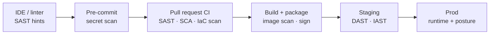
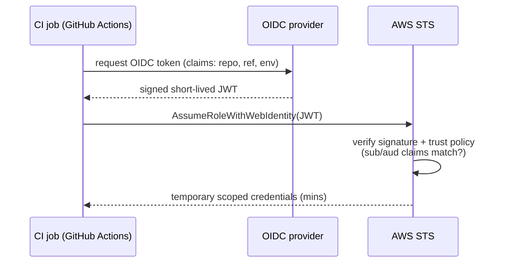

# DevSecOps & Pipeline Security

> **DevSecOps** is the practice of building security *into* the delivery pipeline as automated,
> fast-feedback checks — SAST, DAST, SCA, secret scanning, IaC scanning, and image scanning that
> run on every commit — instead of bolting on a manual security review at the end. This topic is
> about **security testing that lives inside CI/CD**: which scanner catches which class of bug,
> where it runs in the pipeline, when it should *break the build* versus merely warn, how to give
> CI **least privilege**, and how to protect the pipeline itself from being weaponized.

> [!KEY-TAKEAWAY]
> **Shift left, but gate wisely.** Run cheap, high-signal scans early (secret + SAST + SCA on
> every PR), fail the build only on **findings you can act on** (a critical, reachable, fixable
> CVE), and treat noisy checks as **advisory** so developers don't learn to ignore red. Give the
> pipeline **short-lived, scoped credentials** (OIDC, not long-lived cloud keys) and treat the CI
> system as a **production system** — it can push to prod, so an attacker who owns the runner owns
> your deploy.

> [!INTERVIEW]
> The classic tell of a shallow answer is confusing SAST/DAST/SCA. Anchor them: **SAST reads your
> source** (no run), **DAST attacks your running app** (no source), **SCA inventories your
> third-party dependencies** and matches them to known CVEs. Then layer on the DevSecOps culture
> point — security is a shared responsibility enforced by automation, not a gate team.

This topic owns the *pipeline* view of security. The **vulnerability classes themselves** (OWASP
Top 10, injection, XSS, crypto misuse) live in the dedicated **security** domain; **secrets in
deploys** (Vault, External Secrets, OIDC-to-cloud rotation) live in `secrets-management`; and
**supply-chain integrity** (SLSA, provenance, SBOM signing, artifact signing) is deepened in
`software-supply-chain-security`. Here we cross-reference those and focus on the *scanners and
gates* in the pipeline.

---

## Shift-left security and the DevSecOps culture

**Shift-left** means moving security checks *earlier* (leftward) in the delivery timeline —
into the IDE, the pre-commit hook, and the pull-request pipeline — rather than discovering
vulnerabilities in a pre-release pen-test or in production. The economic argument is the same as
for testing: **the cost to fix a defect rises the later it is found.** A secret caught by a
pre-commit hook costs seconds; the same secret found after it shipped means rotation, incident
response, and possible breach.

**DevSecOps** extends the DevOps "shared ownership" idea to security: instead of a separate
security team acting as a **manual approval gate at the end** (the bottleneck the DORA/Accelerate
research warns against), security expertise is embedded as **automated policy in the pipeline** and
as guardrails developers own. Security becomes *everyone's* job, enforced by tooling that gives
fast, in-workflow feedback.



Guardrails vs gates is the cultural crux:

- **Guardrails** are self-service, automated, and give feedback where the developer works (a
  failing PR check, an inline annotation). They scale.
- **Gates** are manual approvals that stop the line. Accelerate found heavyweight change-approval
  boards *correlate with worse* stability and speed — they slow delivery without reducing risk.
  Prefer **peer review + automated policy** over a central approval committee.

> [!TIP]
> "Shift left" is not "shift *only* left." Runtime/DAST and production posture checks still matter
> because static analysis can't see everything (auth logic, real config, runtime dependencies).
> Modern framing is "**shift left AND shield right**" — scan early *and* monitor/protect in prod.

## SAST — static application security testing

**SAST** analyzes **source code, bytecode, or binaries without executing them**, looking for
insecure *code patterns*: SQL string concatenation, use of `eval`, hard-coded crypto keys, unsafe
deserialization, path traversal, taint flows from user input to a sink. Because it reads code, it
can point at the **exact file and line**, and it can run **very early** — on the PR, before any
artifact exists. Tools: Semgrep, CodeQL (GitHub), SonarQube, Checkmarx, Fortify.

Strengths and limits:

- **Strength:** full code coverage (sees every path, even rarely executed ones), early feedback,
  precise location, language-aware rules.
- **Limit — false positives:** without runtime context SAST flags things that aren't exploitable
  (e.g. a "tainted" value that is actually validated elsewhere). High false-positive rates are the
  #1 reason teams disable SAST — tune rules and suppress with justification.
- **Limit — blind spots:** can't see runtime/config issues, auth/session logic across services, or
  vulnerabilities in third-party binaries (that's SCA's job).

```yaml
# GitHub Actions — Semgrep SAST on every PR
jobs:
  sast:
    runs-on: ubuntu-latest
    steps:
      - uses: actions/checkout@v4
      - uses: returntocorp/semgrep-action@v1
        with:
          config: p/owasp-top-ten   # ruleset
        # non-zero exit on findings -> fails the job (a gate)
```

> [!WARNING]
> SAST results are only as good as the rules and the suppression discipline. A wall of unfixed
> findings trains developers to ignore the check. Baseline existing findings, gate on *new*
> introductions ("diff-aware" scanning), and require a documented reason to suppress.

## DAST and IAST — testing the running application

**DAST (Dynamic Application Security Testing)** tests a **running application from the outside**,
like an attacker: it crawls endpoints and sends malicious payloads (injection strings, XSS
probes, auth bypass attempts) and observes responses. It has **no access to source code**, so it
finds *exploitable* runtime issues (misconfigured headers, injection that actually fires, exposed
admin routes) with **low false positives** — but it's **slow**, needs a **deployed environment**,
and gives poor code-location info. It runs **later** in the pipeline, against staging. Tool: OWASP
ZAP.

**IAST (Interactive Application Security Testing)** is the hybrid: an **agent/instrumentation runs
inside the application** while functional or DAST tests exercise it. Because it sees both the code
path *and* the runtime data flow, it correlates a runtime finding back to the exact line —
combining DAST's low false positives with SAST's precise location. Cost: it needs
instrumentation and only covers code paths your tests actually hit.

| | SAST | DAST | IAST | SCA |
|---|---|---|---|---|
| Needs source? | Yes | No | Yes (instrumented) | Manifest/lockfiles |
| Needs running app? | No | Yes | Yes | No |
| Pipeline stage | Early (PR/commit) | Late (staging) | During test runs | Early (PR/commit) |
| False positives | High | Low | Low | Low–medium |
| Finds | Insecure code patterns | Exploitable runtime issues | Both, correlated | Known-CVE dependencies |
| Blind to | Runtime/config, deps | Source location, unhit paths | Untested code paths | Your own code |

> [!INTERVIEW]
> Expect "why isn't SAST enough?" The answer: SAST can't confirm exploitability or see runtime
> configuration, so it over-reports and misses config/deploy issues. DAST confirms real attacks but
> can't cover code it never reaches and can't tell you *where* in the code to fix. They are
> **complementary**, not substitutes — a mature pipeline runs both plus SCA.

## SCA — software composition analysis (dependency CVE scanning)

**SCA** inventories your **third-party and open-source dependencies** (direct *and* transitive) and
matches them against vulnerability databases (the NVD, GitHub Advisory Database, OSV) to flag
components with known **CVEs**, and often checks their **licenses**. Since most modern codebases
are **70–90% third-party code**, SCA covers the risk SAST cannot: your own code may be perfect, but
a transitive `log4j` or `openssl` can still own you. Tools: Dependabot, Snyk, OWASP Dependency-Check,
`npm audit`, Trivy (fs mode), Grype, Renovate (for the fix side).

Key nuances:

- **Transitive dependencies dominate.** Most vulnerable components are pulled in indirectly. SCA
  must resolve the full dependency tree, which is why it reads **lockfiles** (`package-lock.json`,
  `poetry.lock`, `go.sum`) — pinned, resolved versions — not just top-level manifests.
- **Reachability / exploitability.** A CVE in a dependency you never call the vulnerable function
  of is lower risk. Advanced SCA does **reachability analysis** to cut noise; without it, prefer
  gating on *fixable* + *high severity* to avoid alert fatigue.
- **SBOM link.** SCA typically emits or consumes an **SBOM** (CycloneDX/SPDX). The SBOM as a
  *supply-chain artifact* (generation, signing, distribution) is deepened in
  `software-supply-chain-security`; here it's the input/output of the dependency scan.

> [!WARNING]
> **Log4Shell (CVE-2021-44228)** is the canonical SCA interview example: a critical RCE in a
> ubiquitous *transitive* logging dependency. Teams with an SBOM + SCA could answer "am I affected
> and where?" in minutes; teams without spent days grepping build outputs.

## Secret scanning — pre-commit and CI

**Secret scanning** detects hard-coded credentials — API keys, cloud access keys, private keys,
tokens, connection strings — in source, commits, and history, using regexes, provider-specific
patterns, and **entropy analysis** (high-randomness strings look like keys). Tools: Gitleaks,
TruffleHog, `detect-secrets`, GitHub/GitLab push protection.

Defense in depth across two points:

1. **Pre-commit hook (client side):** stops the secret before it ever enters history — cheapest
   possible catch. But it's **local and bypassable** (`--no-verify`), so it's a helper, not a
   control.
2. **CI / server-side push protection:** the enforceable backstop. Server-side push protection can
   **reject the push** containing a secret.

```yaml
# .pre-commit-config.yaml — client-side secret scan
repos:
  - repo: https://github.com/gitleaks/gitleaks
    rev: v8.18.0
    hooks:
      - id: gitleaks
```

> [!WARNING]
> **A leaked secret in Git history is compromised even after you delete the file.** Git keeps every
> commit; the secret lives in the object history and any clone/fork. The *only* correct response is
> to **rotate/revoke the credential immediately** — history rewrites (`filter-repo`, BFG) are
> cleanup, not remediation. This is why scanning **history**, not just the working tree, matters.
> (Managing secrets *properly* in deploys — Vault, OIDC, injection — is `secrets-management`.)

## IaC scanning — Terraform, CloudFormation, Kubernetes manifests

**IaC scanning** statically analyzes **infrastructure-as-code** (Terraform HCL, CloudFormation,
Kubernetes YAML, Helm, Dockerfiles) for **insecure configuration** *before* it is applied — the S3
bucket that's world-readable, the security group open to `0.0.0.0/0` on port 22, an unencrypted
RDS instance, an IAM policy with `"Action": "*"`, a privileged container. It's "SAST for
infrastructure," and it's high-value because a single misconfig can expose an entire environment.
Tools: **Checkov** (Bridgecrew/Prisma), **tfsec** (now folding into Trivy), **Terrascan**,
**KICS**, `kube-score`, `kubesec`.

```hcl
# This Terraform would be flagged by Checkov / tfsec:
resource "aws_s3_bucket" "data" {
  bucket = "app-data"
  acl    = "public-read"          # CKV: public S3 bucket
}
resource "aws_security_group_rule" "ssh" {
  type        = "ingress"
  from_port   = 22
  to_port     = 22
  protocol    = "tcp"
  cidr_blocks = ["0.0.0.0/0"]     # CKV: SSH open to the world
}
```

> [!TIP]
> Run IaC scanning on the **plan or the code in the PR**, before `terraform apply`. Catching an
> open security group in review is free; catching it after apply means the resource already exists
> (and may already be exploited). This pairs naturally with **policy-as-code** below for org-wide
> rules. IaC mechanics (state, plan/apply, drift) are in `infrastructure-as-code-terraform`.

## Container image scanning — Trivy, Grype

**Image scanning** inspects a built **container image** for known-vulnerable OS packages
(`apt`/`apk`/`yum`) and application dependencies baked into its layers, plus embedded secrets and
misconfigurations. It's essentially **SCA applied to the whole image**, including the base image.
Tools: **Trivy** (Aqua), **Grype** (Anchore), Clair, Docker Scout, cloud registry scanners (ECR,
GCR, ACR).

Where and how:

- **In CI** on the freshly built image (fail the build on critical fixable CVEs), **in the
  registry** (scan-on-push, continuous re-scan as new CVEs are disclosed), and **at admission**
  (a Kubernetes admission controller can block unsigned/unscanned images).
- **Base image choice is the biggest lever.** A `debian`-based image carries hundreds of OS
  packages; **distroless** or **Alpine/`scratch`** images carry far fewer, so far fewer CVEs and a
  smaller attack surface. "Rebuild on a slimmer, patched base" fixes more findings than chasing
  individual CVEs.
- **Re-scan continuously.** An image that was clean at build time can become vulnerable tomorrow
  when a new CVE is published against a package it contains — nothing in the image changed, the
  *knowledge* did.

```yaml
# GitLab CI — Trivy scans the image; fails on HIGH/CRITICAL that have a fix
image_scan:
  stage: scan
  script:
    - trivy image --exit-code 1 --severity HIGH,CRITICAL
        --ignore-unfixed "$IMAGE:$CI_COMMIT_SHA"
```

> [!TIP]
> `--ignore-unfixed` is a pragmatic gate setting: fail only on vulnerabilities that have a
> **patched version available**, so the pipeline doesn't block on CVEs the team literally cannot
> fix yet. (Container/K8s internals are their own domains — this is the pipeline-scan angle.)

## Security gates vs advisory findings — breaking the build

A **gate** fails the pipeline (non-zero exit / blocked merge) on a finding; an **advisory** check
reports the finding but lets the build proceed. Choosing which is which is the central DevSecOps
design decision, because **a gate that fires on noise gets disabled**, and a check everyone ignores
provides zero protection.

Sound gating policy:

- **Gate on severity + actionability:** fail on **Critical/High** severity that is **fixable** and,
  ideally, **reachable**. Let Low/Medium and unfixable findings be advisory (tracked, not blocking).
- **Diff-aware / baseline:** gate on **newly introduced** issues, not the pre-existing backlog, so
  a legacy repo can adopt scanning without an unshippable wall of red on day one.
- **Break-glass with accountability:** allow a documented, audited **exception/waiver** (with an
  owner and expiry) so a genuine emergency isn't blocked forever — but the waiver is visible and
  time-boxed, not a silent `# nosec`.
- **Fast + reliable:** a gate must be quick and deterministic. A flaky or 40-minute security scan
  becomes the thing people route around.

```yaml
# Pattern: SAST/SCA "gate" on criticals, "advisory" on the rest
- run: trivy fs --exit-code 1 --severity CRITICAL .   # gate: hard fail
- run: trivy fs --exit-code 0 --severity HIGH,MEDIUM . # advisory: report only
```

> [!INTERVIEW]
> "Should a security scan always fail the build?" The senior answer is **no** — blanket
> hard-failing on every finding maximizes false-positive friction and teaches teams to bypass
> checks. Gate on high-severity, fixable, (ideally) reachable issues; keep the long tail advisory
> and tracked. The goal is *sustained* adoption, not maximal strictness.

## Policy-as-code — OPA, Conftest, Kyverno

**Policy-as-code** expresses organizational rules as **version-controlled, testable code** that a
tool evaluates automatically, instead of a wiki page a human is supposed to remember. In the
pipeline it enforces things like "no public S3 buckets," "every image must be signed," "all
resources must carry a `cost-center` tag," "no container runs as root."

- **Open Policy Agent (OPA)** is a general-purpose policy engine; policies are written in the
  **Rego** language and OPA returns allow/deny decisions for arbitrary JSON input.
- **Conftest** runs OPA/Rego policies against **structured config files** (Terraform plan JSON,
  Kubernetes YAML, Dockerfiles) *in the pipeline* — the CI-native way to gate IaC on policy.
- **Kyverno / OPA Gatekeeper** enforce policy at the **Kubernetes admission** boundary (reject
  non-compliant resources at apply time) — the runtime backstop to the pipeline check.

```rego
# Conftest/OPA (Rego): deny a K8s Deployment running as root
package main
deny[msg] {
  input.kind == "Deployment"
  c := input.spec.template.spec.containers[_]
  not c.securityContext.runAsNonRoot
  msg := sprintf("container %q must set runAsNonRoot", [c.name])
}
```

> [!TIP]
> Enforce the same policy at **two points**: as a **CI gate** (fast feedback, blocks the PR) and at
> **admission** (defense in depth — catches anything applied out-of-band). Policy in the pipeline
> alone can be bypassed by a manual `kubectl apply`; admission alone gives slow, post-hoc feedback.

## Least-privilege for CI — OIDC vs long-lived keys

The pipeline needs credentials to deploy — and those credentials are a prime target. The core
principle is **least privilege + short lived**.

The **anti-pattern** is a **long-lived cloud access key** (e.g. an AWS `AKIA...` static key) stored
as a CI secret. It (1) rarely rotates, (2) often has broad permissions, and (3) if leaked, works
from anywhere until someone notices and revokes it.

The **modern pattern** is **OIDC federation**: the CI provider (GitHub Actions, GitLab CI) issues a
signed, short-lived **OIDC token** describing the workflow (repo, branch, environment). The cloud
provider is configured to **trust that identity provider** and, on presentation of a valid token,
mints **temporary, scoped credentials** (via AWS STS `AssumeRoleWithWebIdentity`, GCP Workload
Identity Federation, Azure workload identity). **No long-lived secret is ever stored in CI.**



```yaml
# GitHub Actions — OIDC to AWS, no static keys
permissions:
  id-token: write        # allow the job to request an OIDC token
  contents: read
jobs:
  deploy:
    runs-on: ubuntu-latest
    steps:
      - uses: aws-actions/configure-aws-credentials@v4
        with:
          role-to-assume: arn:aws:iam::111122223333:role/ci-deploy
          aws-region: us-east-1   # STS returns temporary creds; nothing stored
```

Other least-privilege practices: **scope tokens tightly** (a `GITHUB_TOKEN` should be
`contents: read` unless the job truly needs write; scope PATs/deploy keys per-repo), use
**environment protection rules** so only the prod job can assume the prod role, and **restrict the
trust policy** to specific `sub` claims (this repo, this branch/environment) so a fork or another
repo can't assume your role.

> [!WARNING]
> A too-loose OIDC **trust policy** is a real breach vector: if the IAM role trusts
> `repo:my-org/*` or omits the `sub`/`aud` condition, *any* workflow in the org — or an attacker's
> PR-triggered workflow — could assume it. Pin the trust to the exact repo **and** ref/environment.

## Protecting the pipeline itself — PPE, dependency confusion, runners

The CI/CD system is a **production system with write access to prod**: it holds credentials, builds
the artifacts you deploy, and runs arbitrary code. If an attacker controls the pipeline, code
scanning downstream is moot. Key threats (see OWASP **Top 10 CI/CD Security Risks**):

- **Poisoned Pipeline Execution (PPE):** an attacker gets malicious code to run *in* the CI
  environment — e.g. a fork's pull request triggers a workflow that reads secrets, or the CI config
  itself (`.gitlab-ci.yml`, workflow file) is modified in a PR and executed with privileges.
  **Mitigations:** don't run privileged, secret-bearing jobs on untrusted PRs
  (`pull_request_target` in GitHub Actions is dangerous — it runs with secrets in the *base* repo
  context); require approval for first-time contributors; keep the pipeline definition
  protected/reviewed.
- **Dependency confusion / substitution:** an attacker publishes a **public** package with the same
  name as your **internal/private** package and a higher version number; a misconfigured resolver
  pulls the malicious public one. **Mitigations:** scope/namespace internal packages, pin a trusted
  private registry, and configure the client to *not* fall back to public for internal names.
- **Unpinned actions/dependencies:** referencing a third-party GitHub Action by mutable tag
  (`@v3`) means whoever controls that tag can change what runs in your pipeline. **Pin to a full
  commit SHA.**
- **Runner hardening:** self-hosted runners that are **persistent and shared** leak state between
  jobs (a malicious job reads the next tenant's secrets/cache). Prefer **ephemeral,
  single-use runners**; isolate untrusted workloads; never expose runners with prod credentials to
  fork PRs.

```yaml
# Pin third-party actions to an immutable commit SHA, not a mutable tag
- uses: actions/checkout@b4ffde65f46336ab88eb53be808477a3936bae11  # v4.1.1
  #                     ^ full SHA — tag can be moved by the maintainer/attacker
```

> [!INTERVIEW]
> A strong closing point: "The pipeline is the softest, highest-value target in the SDLC — it can
> deploy to prod and holds every credential. Securing the *code* while leaving the *pipeline*
> unhardened (mutable action tags, fork PRs with secrets, shared persistent runners, long-lived
> keys) inverts the risk." Integrity of the pipeline/artifacts (SLSA levels, provenance) is
> deepened in `software-supply-chain-security`.

## Common follow-up questions

- **"SAST vs DAST vs SCA in one line each?"** SAST reads your *source* for insecure patterns (early,
  many false positives); DAST attacks the *running app* from outside (late, exploitable, low false
  positives); SCA inventories *third-party deps* and matches known CVEs.
- **"Why not fail the build on every vulnerability?"** Noise → developers disable/bypass the scan.
  Gate on critical + fixable + reachable; keep the rest advisory and tracked.
- **"What's the single most cost-effective security scan to add first?"** Usually **secret
  scanning** (server-side push protection) + **SCA** — cheap, high signal, catch the most common and
  most damaging incidents (leaked keys, known-CVE deps).
- **"How does OIDC remove secrets from CI?"** CI presents a short-lived signed identity token; the
  cloud trusts the IdP and mints temporary scoped credentials — no static key is stored, and leaked
  tokens expire in minutes.
- **"What is dependency confusion?"** A public package impersonating your internal one with a higher
  version, pulled by a resolver that falls back to public — fixed by namespacing and locking to a
  private registry.
- **"Why pin GitHub Actions to a SHA?"** A mutable tag (`@v3`) can be repointed by whoever controls
  it, silently changing what runs in your pipeline; a full commit SHA is immutable.
- **"Where does image scanning fit if I already have SCA?"** Image scanning also covers the **OS
  packages and base image** baked into layers, which app-level SCA misses; it should also re-scan
  in the registry as new CVEs appear.
- **"Guardrails vs gates?"** Guardrails are automated, self-service, in-workflow feedback (they
  scale); manual approval gates slow delivery and — per Accelerate — don't improve stability.

## References

- OWASP DevSecOps Guideline — https://owasp.org/www-project-devsecops-guideline/
- OWASP Top 10 CI/CD Security Risks — https://owasp.org/www-project-top-10-ci-cd-security-risks/
- OWASP ZAP (DAST) — https://www.zaproxy.org/
- OWASP Dependency-Check (SCA) — https://owasp.org/www-project-dependency-check/
- Semgrep (SAST) — https://semgrep.dev/docs/ ; GitHub CodeQL — https://codeql.github.com/
- Trivy — https://trivy.dev/ ; Grype — https://github.com/anchore/grype
- Checkov — https://www.checkov.io/ ; tfsec — https://aquasecurity.github.io/tfsec/
- Gitleaks — https://github.com/gitleaks/gitleaks ; TruffleHog — https://github.com/trufflesecurity/trufflehog
- Open Policy Agent / Rego — https://www.openpolicyagent.org/docs/ ; Conftest — https://www.conftest.dev/
- Kyverno — https://kyverno.io/ ; OPA Gatekeeper — https://open-policy-agent.github.io/gatekeeper/
- GitHub Actions — OIDC hardening — https://docs.github.com/actions/deployment/security-hardening-your-deployments/about-security-hardening-with-openid-connect
- GitHub Actions — security hardening (pinning, `pull_request_target`) — https://docs.github.com/actions/security-guides/security-hardening-for-github-actions
- AWS — `AssumeRoleWithWebIdentity` / IAM OIDC — https://docs.aws.amazon.com/IAM/latest/UserGuide/id_roles_providers_oidc.html
- DORA / Accelerate (change-approval findings) — https://dora.dev/
- OpenSSF — https://openssf.org/ ; SLSA framework — https://slsa.dev/ (deepened in `software-supply-chain-security`)
