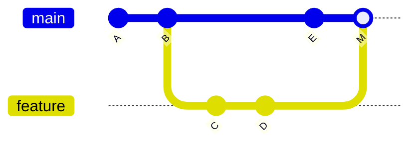
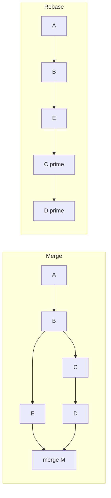
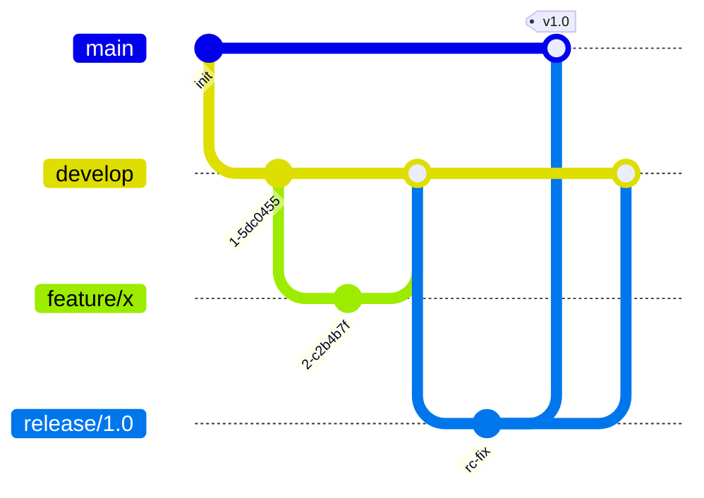
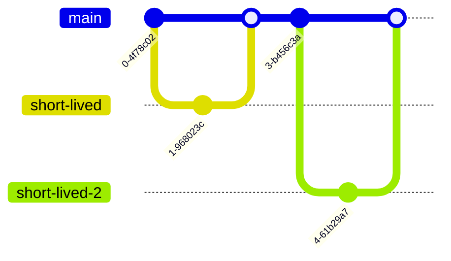
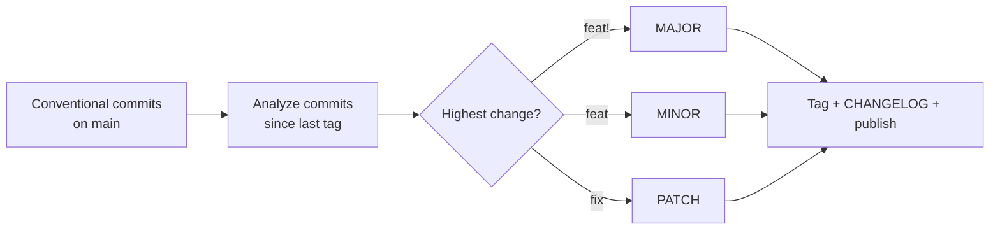

# Git & Branching Strategies

Version control is the substrate every CI/CD pipeline sits on: a commit is the unit that gets
built, tested, and deployed, and the **branching strategy** you choose is one of the biggest
levers on how fast and safely you can ship. This topic covers Git's core object model well
enough to reason about interview curveballs (merge vs rebase, `reset` vs `revert`, reflog
recovery), then the four mainstream branching models — **Git Flow, GitHub Flow, GitLab Flow,
and Trunk-Based Development** — with a hard emphasis on *why* long-lived branches are hostile to
continuous integration and why the DORA/Accelerate research keeps pointing at trunk-based
development.

This is the delivery-engineering view. We care about how a branching model interacts with the
pipeline: what triggers a build, what gates `main`, how feature flags let you merge unfinished
work, and how versioning/commit conventions feed automated releases.

> [!KEY-TAKEAWAY]
> "Continuous integration" literally means *integrating* everyone's work into a shared trunk
> **frequently** — at least daily. A branch that lives for two weeks is, by definition, two
> weeks of *not* integrating. Every branching decision in this topic ultimately trades off
> **isolation** (branches protect you from others' churn) against **integration frequency**
> (the thing CI and DORA reward). Trunk-based development optimizes for the latter and uses
> feature flags to recover the isolation you gave up.

> [!INTERVIEW]
> High-frequency probes: *"merge vs rebase — when do you use each?"*, *"`git reset` vs
> `git revert` — which is safe on a shared branch?"*, *"walk me through Git Flow and when it's
> overkill"*, *"what is trunk-based development and why does DORA recommend it?"*, *"how do you
> ship unfinished code to main safely?"* (feature flags / branch by abstraction),
> *"how do you protect `main`?"* (required status checks, reviews), and *"semantic versioning
> and conventional commits — what problem do they solve?"*.

---

## Git's object model: commits, refs, and HEAD

Git is a **content-addressable store** of four object types, each identified by the SHA-1 (now
migrating to SHA-256) hash of its content:

- **blob** — file contents (no name, no metadata).
- **tree** — a directory listing mapping names → blobs/trees (this is where filenames live).
- **commit** — a snapshot: a pointer to one root tree, plus **parent commit pointer(s)**,
  author/committer, timestamp, and message.
- **tag** (annotated) — a named pointer to an object, usually a commit, with its own metadata.

A key mental correction interviewers probe: **a commit stores a full snapshot of the tree, not
a diff.** Diffs are *computed* on demand by comparing two trees. Git dedupes unchanged files
because identical content hashes to the same blob.

- A **branch** is just a **movable pointer (ref) to a commit** — a 41-byte file under
  `.git/refs/heads/`. Creating a branch is O(1); it writes one small file. This is why Git
  branching is "cheap."
- **HEAD** is a pointer to *the current ref* (usually a symref like `ref: refs/heads/main`).
  When you commit, Git creates the commit and advances the branch HEAD points at. A
  **detached HEAD** points directly at a commit instead of a branch — commits you make there
  are not on any branch and can be lost once HEAD moves.


> [!TIP]
> Because history is a chain of parent pointers, "rewriting history" (rebase, amend, squash)
> always produces **new commit objects with new hashes** — you never edit a commit in place.
> That single fact explains why rewriting shared history is dangerous.

---

## The three areas: working tree, index (staging), and repository

Git has three states a file moves through, and most confusing commands become obvious once you
know which area they touch:

1. **Working tree** — the actual files on disk you edit.
2. **Index / staging area** — a snapshot of what will go into the *next* commit. `git add`
   copies working-tree content into the index.
3. **Repository (HEAD)** — the committed history. `git commit` records the index as a new commit.

| Command | Working tree | Index | HEAD |
|---|---|---|---|
| `git add` | — | ← working tree | — |
| `git commit` | — | — | ← index |
| `git reset --soft` | — | — | moves |
| `git reset --mixed` (default) | — | ← HEAD | moves |
| `git reset --hard` | ← HEAD | ← HEAD | moves |
| `git checkout -- <file>` / `git restore` | ← index | — | — |

Knowing this table lets you answer "how do I unstage a file?" (`git reset HEAD <file>` /
`git restore --staged`) versus "how do I discard local edits?" (`git restore <file>`).

**Worked example — the three `reset` variants on one scenario.** Say your branch is
`C1 ← C2 ← C3` (HEAD at `C3`), where `C3` was the commit "add feature X" that touched
`x.js`. You run `git reset HEAD~1` in each of its three modes. `HEAD~1` is `C2`, so all three
move the branch pointer back to `C2` — history now ends at `C2` and `C3` is no longer
referenced by the branch. The difference is what happens to `C3`'s changes to `x.js`:

| After `reset HEAD~1` | History (HEAD) | Index (staged) | Working tree (disk) | `x.js` state |
|---|---|---|---|---|
| `--soft` | `C1 ← C2` | `C3`'s changes | `C3`'s changes | staged, ready to re-commit |
| `--mixed` (default) | `C1 ← C2` | matches `C2` | `C3`'s changes | modified but **unstaged** |
| `--hard` | `C1 ← C2` | matches `C2` | matches `C2` | **gone** |

So `--soft` is "undo the commit but keep everything staged" (perfect for re-doing the commit
message or squashing `C3` into a new commit); `--mixed` is "undo the commit and the `git add`,
leaving my edits in the working tree"; `--hard` is "undo the commit *and* throw away the edits."
`C3`'s object still exists in the reflog after all three — see [Reflog](#reflog-the-safety-net)
— so even a `--hard` is recoverable until garbage collection.

---

## Fast-forward vs three-way merge

When you merge branch `feature` into `main`:

- **Fast-forward merge** — if `main` has not diverged (no new commits since `feature` branched
  off), Git can simply **move the `main` pointer forward** to `feature`'s tip. No merge commit
  is created; history stays linear.
- **Three-way merge** — if both branches have new commits (they diverged), Git computes a merge
  using the two tips and their **merge base** (common ancestor) and records a **merge commit
  with two parents**. History now has a visible branch/join.

**Worked example — what "three-way" actually diffs.** Suppose `feature` branched off `main` at
commit `B`, then both moved on: `main = A ← B ← E` and `feature = A ← B ← C ← D`. The **merge
base** is `B` (the last commit both share). "Three-way" means Git looks at *three* snapshots:
the base `B`, `main`'s tip `E`, and `feature`'s tip `D`. It computes two diffs — `B → E` (what
`main` changed) and `B → D` (what `feature` changed) — and combines both sets of changes. If the
two sides touched different lines, Git merges them automatically and writes merge commit `M`
with two parents (`E` and `D`). If they touched the *same* region, that region is a conflict.
Contrast the fast-forward case: if `main` had *not* moved (still at `B`), there's no divergence
and nothing to reconcile — Git just slides the `main` pointer forward to `D`, and history stays
the linear line `A ← B ← C ← D` with no merge commit.



- `git merge --ff-only` refuses to merge unless a fast-forward is possible (keeps linear
  history, fails loudly otherwise).
- `git merge --no-ff` forces a merge commit even when a fast-forward was possible — teams use
  this so every feature is a visible, revertable unit on `main`.

> [!WARNING]
> A fast-forward merge leaves **no record** that a branch ever existed. If your workflow relies
> on "one merge commit per PR" for auditability or easy revert, use `--no-ff` (this is what
> GitHub's "Create a merge commit" option does).

---

## Merge vs rebase

Both integrate changes from one branch into another; they differ in *how history looks* and
*what commits exist afterward*.

- **`git merge feature`** — preserves the true history and joins the two lines with a **merge
  commit**. Non-destructive: existing commits are untouched. History is truthful but can look
  tangled ("railroad tracks") with many merge commits.
- **`git rebase main`** (run on `feature`) — **replays** `feature`'s commits one by one on top
  of the current `main` tip, creating **new commits with new hashes**. Result is a **linear**
  history as if you'd started your work from the latest `main`.



**When to use which:**
- Rebase your *local, unpushed* feature branch onto the latest `main` to keep a clean, linear
  history and avoid noise merge commits before opening/updating a PR.
- Merge (or use the platform's merge button) to integrate a reviewed PR into `main`, especially
  when you want the merge to be an auditable, atomic event.

**Worked example — why the hash changes and why that breaks teammates.** Take `feature = A ← B
← C ← D` where `main` has since advanced to `E`. Commit `C` currently has hash `abc123` and its
parent is `B`. When you run `git rebase main`, Git replays `C`'s diff on top of `E`: the new
commit `C'` has the *same changes* but a *different parent* (`E` instead of `B`) and a new
timestamp, so its content hashes to something new — say `def456`. `D` likewise becomes `D'`. The
old `abc123` still exists in the object store (reachable via reflog) but nothing points to it on
the branch anymore. Now the danger: if a teammate had already pulled `abc123`, their `feature`
still ends in `abc123` while yours ends in `def456`. Git sees two divergent histories with
*duplicate-looking* commits, and their next `pull` produces conflicts or a tangle of doubled
commits. That is exactly what the Golden Rule prevents.

> [!WARNING]
> **The Golden Rule of Rebasing: never rebase commits that others have already pulled.** Rebase
> rewrites hashes; anyone who based work on the old commits now has a divergent history and gets
> painful conflicts. Rebase private history freely; never rewrite public/shared history.
> `git pull --rebase` is safe for *your own* not-yet-pushed local commits.

---

## Cherry-pick

`git cherry-pick <sha>` applies the **diff introduced by a single commit** onto your current
branch as a **new commit** (new hash, same change). Use it to port a specific fix without
merging an entire branch — classically to backport a hotfix from `main` onto a `release/1.4`
maintenance branch.

Gotchas interviewers like:
- Cherry-picking **duplicates the change** as a new commit; if you later merge the source
  branch, Git usually reconciles it, but you can get "empty commit" or conflict noise.
- It does not carry along the commit's ancestors — if the fix depends on an earlier commit, you
  must pick that too or hit conflicts.
- Prefer merging/backporting whole branches when possible; reserve cherry-pick for surgical,
  isolated changes.

---

## Reset vs revert (undoing changes safely)

Both "undo," but they are fundamentally different and this is a top-tier interview trap:

- **`git revert <sha>`** — creates a **new commit** that applies the **inverse** of the target
  commit. History is *preserved and moves forward*. Safe on shared branches because it doesn't
  rewrite anything others have.
- **`git reset <sha>`** — **moves the branch pointer backward** to an earlier commit, discarding
  (or unstaging) the commits after it. This **rewrites history**. Fine locally; destructive if
  the discarded commits were already pushed and shared.

| | `git revert` | `git reset` |
|---|---|---|
| Effect | Adds an inverse commit | Moves branch pointer back |
| History | Preserved (forward) | Rewritten (backward) |
| Safe on shared branch? | **Yes** | **No** |
| Typical use | Undo a bad commit on `main` | Fix your local, unpushed history |

> [!KEY-TAKEAWAY]
> To undo something on a branch other people share (like `main`), **`git revert`**. To clean up
> your own local commits before pushing, `git reset`. If you already pushed and must
> force-update, use `git push --force-with-lease` (not bare `--force`) so you don't clobber a
> teammate's newer commits.

---

## Stash

`git stash` shelves your **uncommitted** changes (working tree + staged) onto a stack and
reverts your working tree to a clean HEAD, letting you switch context (e.g., handle an urgent
hotfix) without committing half-done work. `git stash pop` reapplies and drops the top entry;
`git stash apply` reapplies but keeps it. `git stash -u` includes untracked files.

Gotcha: stashes are **local and easy to forget**; they aren't pushed. A stash conflict on `pop`
leaves the changes applied-but-conflicted and the stash entry retained.

---

## Reflog: the safety net

The **reflog** (`git reflog`) records every movement of HEAD and branch tips locally — commits,
resets, rebases, checkouts, merges. Because a commit object isn't garbage-collected while it's
still referenced by the reflog, you can **recover "lost" commits** after a bad `reset --hard`,
a botched rebase, or a deleted branch:

```bash
git reflog                 # find the SHA from before the mistake, e.g. HEAD@{3}
git reset --hard HEAD@{3}  # or: git branch recovered <sha>
```

> [!TIP]
> When someone says "I lost my commits after a rebase/reset," the answer is almost always
> `git reflog`. Reflog entries are local and expire (default 90 days for reachable, 30 for
> unreachable), and are **not** shared on clone.

---

## Finding a bad commit: git bisect

When a bug "appeared sometime in the last N commits" but you don't know which one,
`git bisect` does a **binary search** over history. You mark one commit `good` (bug absent) and
one `bad` (bug present); Git checks out the midpoint, you test and mark it `good`/`bad`, and it
halves the suspect range each round until one commit is left — the first `bad` one.

**Worked example.** A bug is somewhere in the last **200** commits. Linear search could take up
to 200 tests; bisect takes about `log2(200) ≈ 7.6`, so **8 tests**. The range shrinks
`200 → 100 → 50 → 25 → 13 → 7 → 4 → 2 → 1`, isolating the culprit in a handful of steps:

```bash
git bisect start
git bisect bad                 # current HEAD is broken
git bisect good v1.4.0         # this old tag was fine
# Git checks out the midpoint; test it, then:
git bisect good   # or: git bisect bad   -> repeat ~8 times
git bisect run ./test.sh       # or automate: Git runs the script and marks each step for you
git bisect reset               # restore your original HEAD when done
```

With `git bisect run <script>` (exit 0 = good, non-zero = bad) the whole search is automated.
One connection to squash-and-merge: squashing collapses a PR into a single commit, so bisect can
only pin blame to the *whole PR*, not to the individual commit inside it — coarser but usually
still fast enough.

---

## Merge conflicts

A conflict happens when a **three-way merge** finds that the *same region* of a file changed on
both branches relative to the merge base and Git can't auto-reconcile. Git marks the file with
conflict hunks:

```text
<<<<<<< HEAD
current branch version
=======
incoming branch version
>>>>>>> feature
```

Resolution: edit to the intended result, remove the markers, `git add` the file, then
`git commit` (or `git rebase --continue`). Tools/tactics:
- `git config merge.conflictstyle zdiff3` shows the **base** version too, making intent clearer.
- **rerere** (`rerere.enabled true`) records how you resolved a conflict and **replays** it
  automatically next time — valuable during long rebases.
- Semantic (non-textual) conflicts — code merges cleanly but behavior breaks — are **not**
  caught by Git; only tests catch them. This is a core argument for frequent integration.

> [!KEY-TAKEAWAY]
> Conflicts scale with **how long branches diverge**. Two branches merged daily rarely conflict;
> two branches merged after three weeks conflict badly ("merge hell"). Short-lived branches are
> the cheapest conflict-avoidance strategy there is.

---

## Git Flow

**Git Flow** (Vincent Driessen, 2010) is a heavyweight model with **multiple long-lived
branches** and strict roles:

- **`main`** (or `master`) — production; every commit is a tagged release.
- **`develop`** — integration branch for the next release.
- **`feature/*`** — branch off `develop`, merge back to `develop`.
- **`release/*`** — branch off `develop` to stabilize a release; merges to both `main` and
  `develop`.
- **`hotfix/*`** — branch off `main` to patch production; merges to both `main` and `develop`.



**Where it fits:** software with **explicit, versioned releases** shipped to customers who don't
auto-update — desktop/mobile apps, on-prem software, libraries, or multiple maintained versions.

**Why it's often overkill / anti-CI:** the many long-lived branches and the `develop`→`release`
→`main` promotion chain **delay integration**, breed merge conflicts, and add ceremony. For a
web service that deploys continuously, Git Flow's release/develop split is friction with little
benefit. Even Driessen later added a note that Git Flow is *not* ideal for continuously
delivered web apps and that simpler flows are preferable there.

---

## GitHub Flow

**GitHub Flow** is deliberately minimal:

1. `main` is always deployable.
2. Create a **short-lived descriptive branch** off `main` for any change.
3. Open a **pull request** early; discuss and review.
4. Merge to `main` after review + green checks.
5. **Deploy** (often immediately after merge, or merge triggers deploy).

There is **no `develop` branch** and no release branches. It suits **web apps deployed
continuously** where there's a single production version. It's simple and CI-friendly, but by
itself it doesn't prescribe how to handle multiple environments or how to ship code that isn't
finished — you either keep the branch short or hide work behind flags.

---

## GitLab Flow

**GitLab Flow** sits between GitHub Flow and Git Flow. It keeps the short-branch + MR simplicity
of GitHub Flow but adds **environment (or release) branches** to model promotion:

- **Environment branches:** code flows *downstream* through long-lived branches such as
  `main` → `staging` → `production`. You deploy an environment by merging into its branch, so
  the branch state always reflects what's running there. Merges go one direction (upstream to
  downstream), and fixes are made upstream then cherry-picked down if urgent.
- **Release branches:** for versioned software, cut `release/x.y` branches from `main` and
  cherry-pick fixes into them (bug fixes go to `main` first, then down to releases).

It's a good fit when you **can't deploy `main` straight to production** (need a staging gate, or
support released versions) but want to avoid Git Flow's full ceremony.

---

## Trunk-Based Development (the CI-native model)

**Trunk-Based Development (TBD)** is the model the **DORA/Accelerate** research identifies as a
statistically significant *predictor* of high delivery performance. Everyone commits to a single
shared branch (**trunk/`main`**) at least daily; branches, if used at all, are **short-lived**
(hours to ~a day) and merged back fast.

Two common forms:
- **Committing straight to trunk** — small teams; each push runs CI on trunk.
- **Short-lived feature branches** — branch, get a fast review, merge within a day (this is the
  scalable form for most teams; it's still "trunk-based" because branches don't outlive a day).



**Why DORA recommends it:** the *four keys* (deployment frequency, lead time for changes, change
failure rate, time to restore) improve when integration is frequent. TBD **maximizes
integration frequency**, which shrinks conflicts, keeps batch sizes small, and makes every merge
low-risk. Accelerate found teams do better with **fewer than three active branches**, branches
merged in **less than a day**, and **no code freezes / long integration phases**.

The obvious objection — "how do I merge unfinished work to `main`?" — is answered by **feature
flags** and **branch by abstraction** (below). That's the trade TBD makes: give up branch
isolation, buy it back in the code.

> [!WARNING]
> Trunk-based development is only safe with a strong test suite and CI on every commit. Without
> automated tests and fast pipeline feedback, committing to a shared trunk daily just spreads
> breakage faster. TBD and CI are a package deal.

---

## Feature flags and branch by abstraction

To keep unfinished work off users while still merging to trunk daily:

- **Feature flags (toggles):** wrap new behavior in a runtime conditional (`if flag.enabled(...)`)
  so incomplete or risky code ships **dark** and is enabled per-environment, per-user, or
  gradually. This also **decouples deploy from release** — you deploy the binary, then flip the
  flag to release the feature (and flip it back to roll back instantly without redeploying).
- **Branch by abstraction:** introduce an abstraction layer over the thing you're changing,
  build the new implementation behind it incrementally on trunk, then switch over and remove the
  old path — a large refactor done in small merged steps instead of a long-lived branch.

> [!TIP]
> Feature flags are the enabling technology that makes trunk-based development practical at
> scale. The cost is **flag lifecycle management** — stale flags become dead conditional code
> and a testing-combinatorics headache, so mature teams track and retire flags aggressively.

---

## Why long-lived branches hurt CI

Pulling the thread on the whole topic — a branch that lives for weeks causes:

1. **Delayed integration** — the branch is, by definition, un-integrated work. You only discover
   conflicts and semantic breakage at merge time, in a big batch ("merge hell" / "big-bang
   integration").
2. **Larger, riskier changes** — big diffs are harder to review well and more likely to cause a
   change failure; small frequent merges are safer (lower change-failure rate).
3. **Stale base** — the longer you diverge from `main`, the more `main` moved underneath you, so
   the eventual merge is harder and your tests ran against an old world.
4. **Blocked feedback** — CI's value is *fast feedback on integrated code*; if code isn't on the
   shared branch, CI can't tell you it integrates. Long branches defeat the purpose of CI.

This is the mechanical reason the industry (and DORA) pushes short-lived branches / trunk-based
development for services under continuous integration.

---

## Pull/merge request review flow

The **PR (GitHub) / MR (GitLab)** is the review + gate unit in branch-based workflows:

1. Push a branch; open a PR/MR describing the change.
2. **CI runs automatically** on the PR (build, tests, lint, security scans) — these become
   *required status checks*.
3. Reviewers comment/approve; author addresses feedback with follow-up commits.
4. Once approvals + checks are green, the branch is **merged** (merge commit, squash, or rebase).

Merge strategies the button offers:
- **Merge commit** — preserves all branch commits + a merge commit (full history, `--no-ff`).
- **Squash and merge** — collapses the branch into **one commit** on `main` (clean linear
  history, one revertable unit; loses intermediate commits). The real cost beyond "loses
  commits": it collapses per-commit `git blame`/`git bisect` resolution to PR granularity and
  discards intermediate authorship/co-author metadata — fine for small PRs, but on a large PR you
  lose the signal of *which* internal change introduced a line or a bug.
- **Rebase and merge** — replays the branch's commits onto `main` with no merge commit (linear,
  keeps individual commits, new hashes).

> [!TIP]
> **Squash-and-merge pairs naturally with trunk-based development:** developers commit messily on
> a short-lived branch, and the trunk gets one clean, atomic, easily-revertable commit per PR.

---

## Protecting main: branch protection & required checks

You keep `main` deployable with **branch protection rules** (GitHub) / **protected branches**
(GitLab):

- **Require pull requests** — no direct pushes to `main`.
- **Require status checks to pass** — CI (tests, lint, scans) must be green before merge; often
  **"require branches to be up to date"** so the check ran against current `main`.
- **Require reviews / approvals** — N approvals, optionally from **code owners** (`CODEOWNERS`).
- **Require signed commits**, **linear history**, **no force-push / no deletion**, and
  optionally enforce rules for admins too.

```yaml
# Example: GitHub Actions workflow that produces a required status check on PRs
name: ci
on:
  pull_request:
    branches: [main]
jobs:
  test:
    runs-on: ubuntu-latest
    steps:
      - uses: actions/checkout@v4
      - run: npm ci
      - run: npm test        # this job's success becomes the required check
```

> [!KEY-TAKEAWAY]
> "How do you keep `main` always deployable?" → **branch protection**: PR-only, required green
> CI checks (up-to-date with base), required reviews. The pipeline gate lives *at merge time*.

**Merge queues** (GitHub merge queue, GitLab merge trains, Bors/Zuul) address a subtle bug: two
PRs can each pass CI against `main` independently but **break when combined**. A merge queue
serializes merges and re-runs CI on the *prospective combined* result before landing, keeping
`main` green under high merge volume.

---

## Semantic versioning (SemVer)

**SemVer** gives releases a `MAJOR.MINOR.PATCH` number with defined meaning:

- **MAJOR** — incompatible / breaking API changes.
- **MINOR** — new functionality, **backward-compatible**.
- **PATCH** — backward-compatible bug fixes.

Pre-release/build metadata: `1.4.0-rc.1`, `1.4.0+build.5`. The point is a **machine- and human-
readable contract**: a consumer pinning `^1.4.0` (caret) accepts minors/patches but not `2.0.0`,
so dependency resolvers can auto-upgrade safely. Interview nuance: for a public library the
version communicates **compatibility**, not marketing; bumping MAJOR is how you signal "you must
read the migration notes."

---

## Conventional Commits & automated releases

**Conventional Commits** standardizes commit *messages* so tooling can parse intent:

```text
<type>[optional scope]: <description>

feat(auth): add OIDC login          # -> MINOR bump
fix(api): handle null user id       # -> PATCH bump
feat!: drop support for Node 16     # "!" or a BREAKING CHANGE footer -> MAJOR bump
```

Common types: `feat`, `fix`, `docs`, `refactor`, `test`, `chore`, `perf`, `ci`, `build`.

**Why it matters for delivery:** tools like **semantic-release**, **release-please**, or
**Changesets** read the commit history since the last tag, **compute the next SemVer number
automatically**, generate a **CHANGELOG**, tag the release, and publish — no human guesses the
version. This turns "cut a release" into a deterministic pipeline step.



---

## Monorepo vs polyrepo

- **Monorepo** — many projects/services in **one repository** (Google, Meta; tooling: Bazel, Nx,
  Turborepo, Pants). Pros: atomic cross-project commits, one source of truth, easy large-scale
  refactors and shared code, consistent tooling. Cons: needs **build tooling that scales**
  (affected-target detection so you don't test everything on every change), scaling Git itself
  (VFS, sparse/partial checkout), and coarse-grained access control.
- **Polyrepo** — one repository **per service/library**. Pros: clear ownership/boundaries,
  independent versioning and CI, smaller clones, simple per-repo access control. Cons: a
  cross-cutting change spans many PRs, dependency/version drift between repos, and duplicated
  CI/config.

> [!INTERVIEW]
> There's no universally right answer — tie it to **CI**: monorepos demand **change/affected
> detection** so pipelines only build/test what a commit touched (otherwise CI time explodes);
> polyrepos push the complexity to **cross-repo coordination and dependency management**. Say
> which problem your team is better equipped to handle.

---

## Common follow-up questions

- "`git merge` vs `git rebase` — and when is rebase dangerous?" Merge preserves history with
  a merge commit; rebase rewrites into linear history with new hashes. Never rebase commits
  others have pulled (Golden Rule).
- "I did `git reset --hard` and lost commits — recover them?" `git reflog` to find the SHA,
  then `git reset --hard <sha>` or `git branch recover <sha>`.
- "Undo a bad commit already on `main`?" `git revert` (adds inverse commit; safe on shared
  branch), not `reset`.
- "Why does DORA favor trunk-based development?" Frequent integration → small batches, fewer
  conflicts, lower change-failure rate, faster lead time; correlated with elite delivery
  performance.
- "How do you merge unfinished work to main?" Feature flags / branch by abstraction; deploy
  dark, release by flipping the flag.
- "How do you keep `main` deployable?" Branch protection: PR-only, required green checks
  (up-to-date with base), required reviews, plus a merge queue at scale.
- "When is Git Flow appropriate?" Versioned/released software with multiple supported
  versions (mobile, desktop, on-prem, libraries) — not continuously deployed web services.
- "Squash vs merge commit vs rebase merge?" Squash = one clean commit per PR (great with
  TBD); merge commit = full history + revertable unit; rebase merge = linear, keeps commits.
- "Two PRs each pass CI but break together — fix?" Merge queue / merge trains re-run CI on
  the combined result before landing.

## References

- Chacon & Straub, *Pro Git* (2nd ed.) — Git internals, branching, rebasing, reflog:
  https://git-scm.com/book/en/v2
- Git reference docs — `git-merge`, `git-rebase`, `git-reset`, `git-revert`, `git-reflog`:
  https://git-scm.com/docs
- Vincent Driessen, "A successful Git branching model" (Git Flow) + later note:
  https://nvie.com/posts/a-successful-git-branching-model/
- GitHub Flow: https://docs.github.com/en/get-started/using-github/github-flow
- GitLab Flow documentation:
  https://docs.gitlab.com/ee/topics/gitlab_flow.html
- Trunk-Based Development (Paul Hammant): https://trunkbaseddevelopment.com/
- DORA / Google Cloud, *Accelerate* & DevOps capabilities — trunk-based development, DORA metrics:
  https://dora.dev/capabilities/trunk-based-development/ and https://dora.dev/guides/dora-metrics-four-keys/
- Semantic Versioning 2.0.0: https://semver.org/
- Conventional Commits 1.0.0: https://www.conventionalcommits.org/
- Martin Fowler, "Feature Toggles (aka Feature Flags)" and "Branch By Abstraction":
  https://martinfowler.com/articles/feature-toggles.html
- GitHub branch protection rules & merge queue docs:
  https://docs.github.com/en/repositories/configuring-branches-and-merges-in-your-repository
