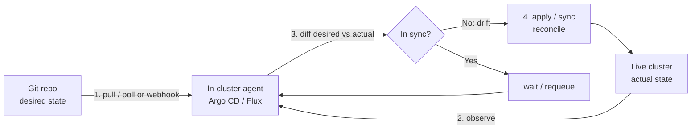
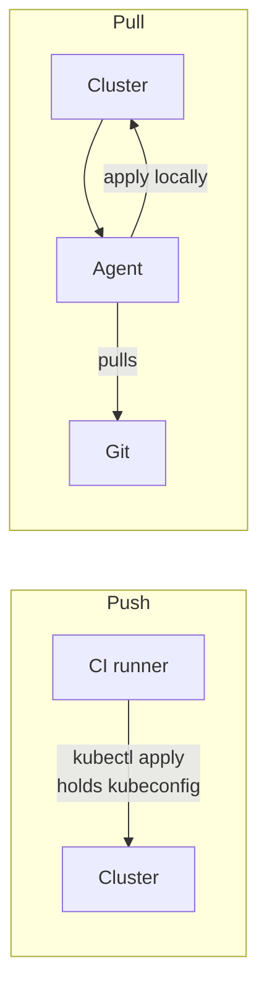
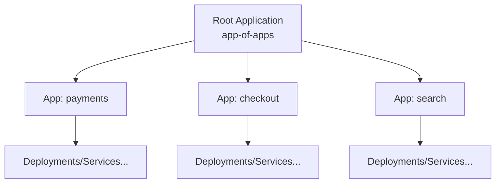
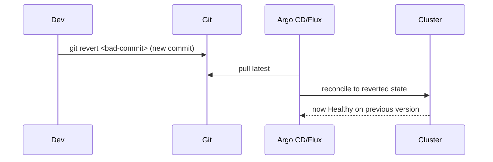

# GitOps

**GitOps** is an operating model for continuous delivery in which **the entire desired state
of a system is described declaratively, stored in Git, and continuously reconciled into the
running environment by an automated software agent.** Git becomes the *single source of truth*
and the *audit log*; a controller running inside the target environment (most commonly a
Kubernetes cluster) watches Git and works to make reality match what the repo says.

The term was coined by Weaveworks (Alexis Richardson) in 2017. The vendor-neutral definition is
now maintained by the **OpenGitOps** project under the CNCF, which distills GitOps into four
principles (below). This topic teaches GitOps concept-first, then grounds it in **Argo CD** and
**Flux**. Kubernetes internals belong to the Kubernetes domain — here we treat the cluster as the
thing being reconciled and point onward for pod/controller mechanics.

> [!KEY-TAKEAWAY]
> GitOps = **declarative desired state in Git** + **an in-cluster agent that continuously pulls
> and reconciles** the live state to match. The three things interviewers probe hardest: (1)
> **pull vs push** and why pull is more secure, (2) **drift detection & self-heal** via the
> reconciliation loop, and (3) **rollback = `git revert`** because Git is the source of truth.

---

## GitOps principles

The **OpenGitOps v1.0.0** specification defines four principles. A GitOps system is one whose
desired state is:

1. **Declarative** — the desired state is expressed *declaratively* (what, not how), e.g.
   Kubernetes YAML, Helm charts, Kustomize overlays, Terraform HCL.
2. **Versioned and Immutable** — desired state is stored so that it enforces immutability and
   versioning and retains a **complete version history** (Git commits, immutable SHAs).
3. **Pulled Automatically** — software agents automatically **pull** the desired state from the
   source; humans do not push to the cluster.
4. **Continuously Reconciled** — software agents **continuously observe** actual state and
   **attempt to apply** the desired state, closing any gap (drift).

**Why it matters.** Because the whole system is described in Git, you get code review on infra
changes, a full audit trail (who changed what, when, why — from commit metadata), reproducible
environments, and trivial rollback. Because an agent reconciles continuously, out-of-band changes
(someone `kubectl edit`-ing prod) are detected and can be automatically reverted.

> [!INTERVIEW]
> If asked "what is GitOps in one sentence?" say: *declarative desired state in Git, continuously
> reconciled into the environment by an automated agent.* Then name the four OpenGitOps
> principles. Do NOT just say "deploying from Git" — CI pushing `kubectl apply` from a pipeline is
> **not** GitOps; it violates the pull + continuous-reconciliation principles.

---

## Git as the single source of truth and audit log

In GitOps, **Git is authoritative**: if it isn't in Git, it isn't real (and if it drifts from Git,
the agent corrects it). This gives two properties interviewers love:

- **Single source of truth.** There is exactly one place to look to know what *should* be running.
  No config living only in someone's terminal history or the console.
- **Audit log for free.** Every change is a commit: author, timestamp, diff, and — if you require
  PRs — reviewers and approval. Compliance ("who changed the prod replica count on July 3rd?") is
  answered by `git log`/`git blame`, not by scraping CloudTrail or cluster events.

**Gotcha.** Git is the source of truth for *desired* state, not *observed* state. Runtime facts
(current pod IPs, autoscaler-chosen replica counts, external-secret values) are **not** stored in
Git. Confusing the two leads to fighting the reconciler — e.g. hardcoding a replica count in Git
while HPA also manages it causes thrashing.

> [!WARNING]
> Don't put plaintext secrets in Git just because "Git is the source of truth." Secrets need
> encryption (SOPS, Sealed Secrets) or externalization (External Secrets Operator, Vault). See
> the **Secrets in GitOps** section below and the security domain's secrets topic.

---

## The reconciliation loop

The heart of GitOps is a **control loop** (the same pattern Kubernetes controllers use):



1. **Observe** — read desired state from Git and actual state from the cluster.
2. **Diff** — compute the difference (Argo CD calls this `OutOfSync`).
3. **Act** — apply the manifests to converge actual → desired.
4. **Repeat** — continuously (poll interval, or event-driven), so drift never lasts long.

This is **level-triggered** (continuously converge toward a desired level), not **edge-triggered**
(react once to an event). Level-triggering is why GitOps self-heals: even if a sync is missed or a
resource is deleted out-of-band, the next loop notices the gap and fixes it.

**Reconciliation is idempotent:** running it when already in sync is a no-op. The agent applies the
*declared* state repeatedly and safely.

---

## Pull model vs push model

The **push model** (traditional CI/CD): a pipeline runs `kubectl apply`, `helm upgrade`, or a
`terraform apply` from the CI runner and *pushes* changes into the cluster. The CI system must hold
**cluster credentials** and have network reach into the environment.

The **pull model** (GitOps): an agent *inside* the target environment pulls desired state from Git
and applies it locally. External systems never get cluster credentials.



| Aspect | Push (pipeline applies) | Pull (GitOps agent) |
|---|---|---|
| Where creds live | In CI system (external) | In the cluster only |
| Attack surface | CI compromise → cluster access | No inbound cluster creds to steal |
| Drift correction | Only when pipeline reruns | Continuous (self-heal) |
| Network direction | CI → cluster (inbound) | Cluster → Git (outbound) |
| Multi-cluster | CI needs creds for each | Each cluster pulls itself |

> [!INTERVIEW]
> "Why is the pull model more secure?" Two reasons: (1) **credentials stay in the cluster** — the
> CI system never holds a kubeconfig, so a CI compromise doesn't hand over prod; and (2) the
> cluster only makes **outbound** connections to Git, so you don't expose the cluster API to
> external pushers. Bonus: continuous reconciliation means drift is corrected, not just applied.

**Nuance.** "Pull" refers to how *desired state reaches the cluster*, not whether polling or
webhooks trigger it. Both Argo CD and Flux poll Git by default and can also be nudged by webhooks;
either way the *agent inside the cluster* does the applying.

---

## Argo CD

**Argo CD** is a declarative GitOps continuous-delivery controller for Kubernetes (a CNCF Graduated
project). It runs *in* the cluster, watches Git repos, and syncs manifests to match. Key concepts:

- **Application** (CRD) — the core unit: a mapping of a Git repo/path/revision (source) to a target
  cluster/namespace (destination). It has a **sync status** (`Synced`/`OutOfSync`) and a **health
  status** (`Healthy`/`Degraded`/`Progressing`).
- **Sync** — the act of applying Git's manifests to the cluster.
- **Sync policy** — **manual** (a human clicks Sync / runs `argocd app sync`) or **automated**
  (Argo syncs on detecting drift). Automated adds two switches: **prune** (delete resources removed
  from Git) and **selfHeal** (revert live changes back to Git).
- **UI + CLI + API** — Argo CD ships a rich web UI showing the resource tree and diffs; `argocd` CLI
  and API for automation.

It supports plain YAML, **Helm**, **Kustomize**, and Jsonnet natively. Argo CD renders the source
(e.g. `helm template`) and diffs the result against live objects.

```yaml
# A minimal Argo CD Application with auto-sync, prune, and self-heal
apiVersion: argoproj.io/v1alpha1
kind: Application
metadata:
  name: payments
  namespace: argocd
spec:
  project: default
  source:
    repoURL: https://github.com/acme/deploy.git
    targetRevision: main
    path: apps/payments/overlays/prod
  destination:
    server: https://kubernetes.default.svc
    namespace: payments
  syncPolicy:
    automated:
      prune: true       # delete objects removed from Git
      selfHeal: true    # revert manual cluster changes
    syncOptions:
      - CreateNamespace=true
```

---

## Flux

**Flux** (Flux CD, also CNCF Graduated) is the other major GitOps toolkit. Rather than one big
controller, Flux is the **GitOps Toolkit**: a set of composable controllers driven by CRDs:

- **source-controller** — fetches artifacts from `GitRepository`, `HelmRepository`, `OCIRepository`,
  `Bucket` sources.
- **kustomize-controller** — reconciles `Kustomization` objects (applies Kustomize/plain YAML).
- **helm-controller** — reconciles `HelmRelease` objects (manages Helm releases).
- **notification-controller** — inbound webhooks + outbound alerts.
- **image-reflector/image-automation-controllers** — watch container registries and can commit
  updated image tags back to Git (image automation).

| Aspect | Argo CD | Flux |
|---|---|---|
| Shape | Single application controller + UI | Set of toolkit controllers, CRD-driven |
| UI | First-class built-in web UI | No official UI (third-party dashboards) |
| Core unit | `Application` | `Kustomization` / `HelmRelease` |
| Multi-tenancy | AppProjects, RBAC | Namespaced CRDs + RBAC |
| Image updates | Argo CD Image Updater (add-on) | Built-in image automation controllers |

Both implement the same GitOps principles (pull-based, reconciling agent in-cluster); the choice is
often about whether you want a strong UI (Argo CD) or a Git-native, API-composable toolkit (Flux).

---

## App-of-apps and ApplicationSets

At scale you don't want to hand-create hundreds of `Application` objects. Two patterns:

- **App-of-apps.** A single "root" Argo CD Application points at a Git directory that contains
  *other* Application manifests. Syncing the root creates/updates all the child Applications —
  bootstrapping a whole cluster from one object. The root app manages the children; the children
  manage the workloads.
- **ApplicationSet.** A controller/CRD that **generates** Applications from a template plus a
  *generator* (list, cluster, Git directory/file, matrix, pull-request, SCM). e.g. "for every
  directory under `apps/`, create an Application" or "for every registered cluster, deploy this
  app." This is the modern, less error-prone way to fan out across many apps or many clusters.



> [!TIP]
> App-of-apps is great for **bootstrapping** a cluster and expressing app ordering. **ApplicationSet**
> is better when the set of apps/clusters is dynamic or templated — you describe *how to generate*
> Applications instead of listing them.

---

## Sync waves and hooks

Within a single sync, Argo CD lets you **order** how resources are applied.

- **Sync phases** (via the `argocd.argoproj.io/hook` annotation): **PreSync** → **Sync** →
  **PostSync**, plus **SyncFail** (runs on failure) and **Skip**. PreSync is ideal for DB migrations;
  PostSync for smoke tests/notifications. A resource annotated as a hook runs as a **Resource Hook**
  in that phase; if a PreSync hook fails, the whole sync fails and stops.
- **Sync waves** (via the `argocd.argoproj.io/sync-wave` annotation, an integer): finer ordering
  *within* a phase. Argo applies resources from the **lowest wave number to the highest**. Both
  hooks and resources default to **wave 0**, and waves **can be negative** (run before everything).

Ordering precedence when Argo syncs: **phase → wave (ascending) → kind → name**. Argo applies the
first wave containing out-of-sync/unhealthy resources, waits for them to become healthy (with a
small delay between waves, default ~2s, `ARGOCD_SYNC_WAVE_DELAY`), then proceeds.

```yaml
# CRDs first (wave -1), then the app (wave 0), then a smoke test after (PostSync)
metadata:
  annotations:
    argocd.argoproj.io/sync-wave: "-1"      # apply CRDs before workloads
---
metadata:
  annotations:
    argocd.argoproj.io/hook: PostSync        # runs after sync + healthy
    argocd.argoproj.io/hook-delete-policy: HookSucceeded
```

> [!WARNING]
> Argo waits for resources in a wave to be **Healthy** before the next wave. If a resource has no
> health check or never reports Healthy, the sync can stall. Order dependencies with waves; don't
> assume plain YAML apply order.

---

## Drift detection and self-heal

**Drift** is any divergence between the live cluster and Git. The reconciliation loop *detects* it
by diffing; what happens next depends on policy.

- **Detection only** (manual sync): Argo marks the app `OutOfSync` and shows the diff, but waits for
  a human to sync. Good for prod where you want a human gate.
- **Self-heal** (`selfHeal: true`): when the agent sees the live state differ from Git — including
  manual `kubectl edit` changes — it **automatically reverts** the cluster back to Git. This makes
  out-of-band changes ephemeral.
- **Prune** (`prune: true`): resources deleted from Git are **deleted from the cluster**. Without
  prune, removing a manifest from Git leaves the object orphaned (still running).

**Gotcha — ignoring expected drift.** Some fields are *meant* to change at runtime (HPA-managed
`replicas`, defaulted fields, mutating-webhook injections). Fighting these causes churn. Use Argo's
`ignoreDifferences` (or Flux equivalents) to exclude those fields from the diff, so self-heal
doesn't thrash against another controller.

> [!INTERVIEW]
> Be precise about the three switches: **sync** applies Git → cluster; **prune** deletes cluster
> objects removed from Git; **selfHeal** reverts *manual live edits* back to Git. Turning on
> auto-sync without understanding prune has caused real outages (someone renames a file, prune
> deletes the old objects).

---

## Rollback via git revert

Because Git is the source of truth, **rollback is a Git operation**. To undo a bad deploy you don't
run a special rollback command against the cluster — you make Git describe the previous good state,
usually with **`git revert`** (which creates a *new* commit that undoes the change, preserving
history). The agent then reconciles the cluster back to that state.



- **Prefer `git revert` over `git reset`/force-push** on shared branches: revert keeps an honest,
  append-only audit trail (the rollback itself is a reviewable commit) and doesn't rewrite history.
- Argo CD also offers a **History & Rollback** button that syncs to a previous *deployed* revision;
  but that creates drift from `main` until you also fix Git, so the durable fix is still a commit.

> [!TIP]
> "How do you roll back in GitOps?" — `git revert` the offending commit; the agent reconciles the
> cluster to the prior state. Rollback inherits all of GitOps' properties: reviewed, audited,
> reproducible. Contrast with imperative rollback (`kubectl rollout undo`) which leaves Git lying.

---

## Environment promotion

Promotion moves a validated change from one environment to the next (dev → staging → prod). GitOps
does this **through Git**, and there are two dominant models:

- **Branch/directory per environment (config repo layout).** Each environment is a directory (or
  branch) with its own overlay; promotion is a **PR** that copies/bumps the tested artifact
  (e.g. image tag/digest) from the lower env's path to the higher env's path. Approving the PR is
  the promotion gate; the audit trail is the PR.
- **Overlays (Kustomize) / values (Helm).** A shared `base` plus per-environment overlays that patch
  differences (replica counts, resource limits, hostnames). Promotion changes only the pinned image
  digest in the higher overlay; everything else is inherited from base, minimizing drift between
  envs.

```
deploy/
  base/                      # shared manifests
  overlays/
    dev/    kustomization.yaml  (image: app:sha-abc, replicas: 1)
    staging/kustomization.yaml  (image: app:sha-abc, replicas: 2)
    prod/   kustomization.yaml  (image: app:sha-abc, replicas: 6)
```

**Best practice:** promote **immutable image digests** (not mutable tags like `latest`), so what
you tested in staging is bit-for-bit what runs in prod. Higher environments should require PR review
(and often a separate repo or CODEOWNERS) as the gate.

> [!WARNING]
> A single repo/branch shared across all environments makes it easy to promote *accidentally* (a
> merge hits prod immediately). Separate environments by path/branch/repo and gate prod with review
> + protected branches so promotion is deliberate.

---

## Secrets in GitOps

The tension: Git is the source of truth, but **you must never commit plaintext secrets**. Four
common solutions, each keeping the "in Git" property differently:

| Approach | How it works | Where the secret lives |
|---|---|---|
| **Sealed Secrets** (Bitnami) | Encrypt with a cluster-side controller's public key → commit the `SealedSecret`; controller decrypts in-cluster | Encrypted blob in Git |
| **SOPS** (+ age/KMS) | Encrypt fields in YAML with SOPS; Flux/Argo plugin decrypts at apply time | Encrypted YAML in Git |
| **External Secrets Operator (ESO)** | Git holds only a *reference*; operator fetches the real value from Vault/AWS Secrets Manager/etc. and creates the K8s Secret | External store; Git has a pointer |
| **Vault Agent / CSI** | Secret injected at runtime from Vault into the pod | External store (Vault) |

- **Sealed Secrets / SOPS**: encrypted material *is* in Git (declarative, versioned) — decryption
  happens in-cluster. Rotation means re-encrypting and committing.
- **External Secrets / Vault**: Git holds only references; the actual secret is managed and rotated
  in a dedicated store, which is better for automatic rotation and central policy.

> [!WARNING]
> Base64 in a Kubernetes `Secret` is **encoding, not encryption** — committing a raw `Secret`
> manifest exposes the value to anyone with repo read access. Always encrypt or externalize.

This is the *deploy/pipeline* view of secrets. For key lifecycle, rotation policy, and crypto
details, see the security domain's **secrets-management-and-key-lifecycle** topic.

---

## GitOps vs traditional CD

A crucial distinction interviewers test: **CI/CD pipelines are not automatically GitOps.**

| Aspect | Traditional (scripted) CD | GitOps |
|---|---|---|
| Trigger to cluster | Pipeline runs `kubectl/helm apply` (push) | In-cluster agent pulls from Git |
| Credentials | CI holds cluster creds | Creds stay in cluster |
| Source of truth | The pipeline run / imperative steps | Git repo (declarative) |
| Drift handling | Only fixed on next pipeline run | Continuously reconciled / self-healed |
| Rollback | Re-run pipeline / imperative undo | `git revert` |
| Audit | Pipeline logs | Git history + PRs |

**Where CI still fits.** GitOps is about **CD (delivery to the environment)**, not CI. You still run
CI to build, test, and produce an artifact; CI's job ends by **committing the new image
digest/manifest to the config repo** (or opening a PR). The GitOps agent takes over from there. A
common healthy pipeline: *CI builds & tests → CI updates the deploy repo → Argo/Flux reconciles.*

> [!INTERVIEW]
> If someone says "we do GitOps" but their pipeline pushes with `kubectl apply` and holds a
> kubeconfig, correct them: that's **pipeline-driven push CD**, not GitOps. GitOps requires the
> pull + continuous-reconciliation properties.

---

## Progressive delivery on GitOps

**Progressive delivery** = gradually shifting traffic to a new version while watching metrics
(canary, blue-green) with **automated analysis and rollback**. On GitOps this is done declaratively
so the *strategy* itself lives in Git.

- **Argo Rollouts** — a controller providing a `Rollout` resource (drop-in for `Deployment`) with
  **canary** and **blue-green** strategies, traffic shaping via a service mesh/ingress, and
  **AnalysisTemplates** that query Prometheus/etc. and **auto-abort** (roll back) on bad metrics.
- **Flagger** — similar progressive-delivery operator, commonly paired with Flux; automates canary
  analysis and promotion using a mesh/ingress + metric checks.

Because the rollout spec and analysis criteria are declarative manifests in Git, the delivery
strategy is versioned, reviewed, and reconciled like everything else. Rollback on a failed canary
is automatic (the controller aborts and shifts traffic back).

For the mechanics of canary/blue-green/rolling strategies themselves, see the
**deployment-strategies** topic. For the metric/SLO analysis math behind auto-abort, see the
observability domain's SLO topic.

---

## Common follow-up questions

- **"Is CI that runs `kubectl apply` GitOps?"** No — that's push-based CD. GitOps requires an
  in-cluster agent that *pulls* and *continuously reconciles*; CI ends by committing to the config
  repo.
- **"How do you roll back?"** `git revert` the bad commit; the agent reconciles to the prior state.
  Avoid imperative `kubectl rollout undo`, which makes Git lie.
- **"Why is pull more secure than push?"** Cluster credentials never leave the cluster, and only
  outbound Git connections are needed — a CI compromise can't reach prod.
- **"How do you handle secrets?"** Encrypt in Git (Sealed Secrets, SOPS) or externalize (External
  Secrets Operator, Vault). Never commit plaintext or base64-only Secrets.
- **"How do you stop the agent fighting the HPA?"** Use `ignoreDifferences` (Argo) to exclude
  HPA-managed fields like `replicas` from the diff so self-heal doesn't thrash.
- **"App repo vs config repo?"** Common practice is to **separate** application source code from the
  deployment/config repo, so CI on the app repo doesn't trigger reconciliation and the config repo
  has its own review/RBAC.
- **"How do you promote to prod?"** Bump the immutable image digest via a PR into the prod
  overlay/branch; approval is the gate, and the PR is the audit record.
- **"Argo CD vs Flux?"** Same principles; Argo CD has a strong built-in UI and `Application` model,
  Flux is a Git-native toolkit of controllers with built-in image automation.

## References

- OpenGitOps — Principles v1.0.0 (CNCF): https://opengitops.dev/
- Weaveworks — "Guide to GitOps" (origin of the term): https://www.weave.works/technologies/gitops/
- Argo CD documentation — https://argo-cd.readthedocs.io/ (Applications, sync policy, sync waves &
  hooks, ignoreDifferences, ApplicationSets)
- Flux documentation — https://fluxcd.io/flux/ (GitOps Toolkit, Kustomization, HelmRelease, image
  automation)
- Argo Rollouts — https://argo-rollouts.readthedocs.io/ (canary/blue-green, AnalysisTemplates)
- Flagger — https://docs.flagger.app/ (progressive delivery)
- Bitnami Sealed Secrets — https://github.com/bitnami-labs/sealed-secrets
- Mozilla SOPS — https://github.com/getsops/sops
- External Secrets Operator — https://external-secrets.io/
- CNCF GitOps Working Group / DORA "Accelerate" (four keys) — https://dora.dev/
