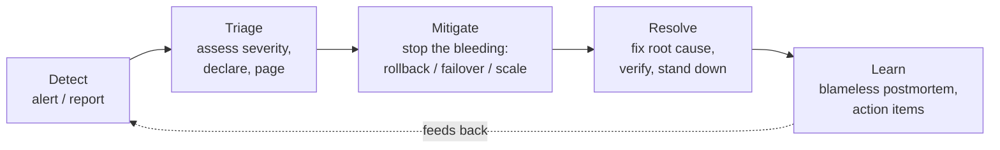
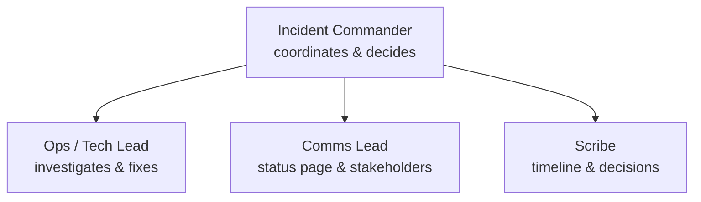
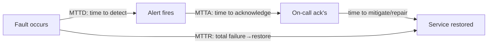
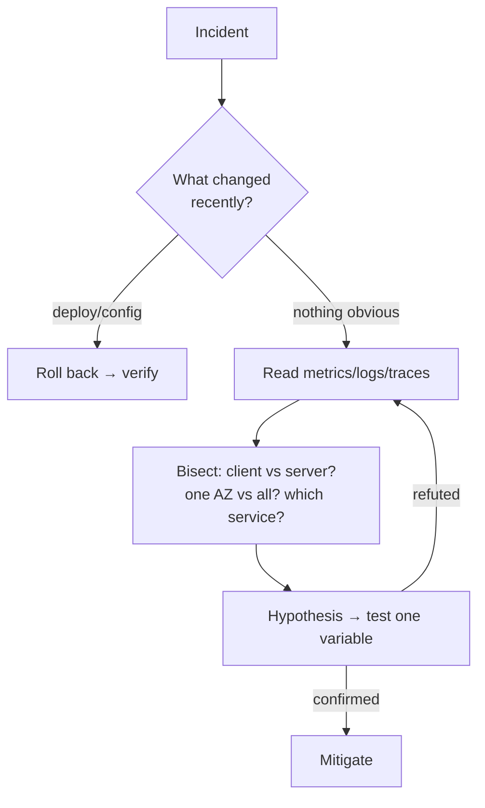

# Incident Management & Troubleshooting

This page covers **what you do when production breaks** — from the moment an alert
fires to the action items you close weeks later. It walks the incident lifecycle
(detect → triage → mitigate → resolve → learn), severity levels, the incident-command
role structure, the recovery/reliability metrics (MTTD, MTTA, MTTR, MTBF) and how they
connect to **DORA**, plus the hands-on discipline of **mitigating before you diagnose**,
systematic troubleshooting, root-cause analysis, blameless postmortems, runbooks, status
pages, and on-call. It is the **DevOps/delivery framing** of incidents.

> [!KEY-TAKEAWAY]
> Three ideas anchor this topic. **(1) Restore service first, understand later** — the
> job during an incident is to *stop the bleeding* (roll back, fail over, scale, flag off),
> not to find the root cause. Diagnosis is for the postmortem. **(2) Incidents are a
> coordination problem as much as a technical one** — clear roles (Incident Commander,
> Comms, Ops) and a single source of truth beat a smart engineer working alone. **(3) The
> learning is the point** — a *blameless* postmortem with tracked, owned action items is
> what turns an outage into a permanent reliability gain; blame just teaches people to hide
> failures.

> [!INTERVIEW]
> This topic gives the **DevOps/pipeline framing** of incidents — the lifecycle, metrics,
> and "mitigate first" instinct that connect to deployments (roll back the bad release) and
> DORA (time-to-restore, change-failure rate). The **deep on-call / postmortem / chaos-
> engineering process** lives in the upcoming *Reliability & Operations* domain, and the
> **alerting math** (SLO burn rates, error budgets) lives in *Observability*
> (`slo-based-alerting-and-error-budgets`). Say so, then go deep on the delivery angle.

---

## Why incident management matters

An **incident** is an unplanned disruption or degradation of a service that needs a
response now — a partial or full outage, elevated error rate, latency spike, data loss,
or security breach. Everything else (a slow query, a flaky test) is just a *problem* or a
*bug* until it materially hurts users or violates an SLO.

Incident **management** is the *process and coordination* that gets you from "something is
wrong" back to "service restored" quickly, consistently, and calmly — and then extracts a
durable lesson. Without a process, every outage is improvised: nobody knows who is in
charge, the same three engineers pile onto the same box, stakeholders spam the channel
asking for updates, and the fix that "worked last time" is lost.

Why it matters for a DevOps/backend engineer specifically:

- **You ship the changes that cause most incidents.** DORA's research is blunt here: the
  large majority of production incidents are triggered by a *change* (deploy, config,
  infra change). That is why "what changed recently?" is the first troubleshooting
  question, and why a fast, reliable **rollback path** (see Deployment Strategies) is your
  single most valuable incident tool.
- **Time-to-restore is a headline metric.** It's one of DORA's four keys and a proxy for
  how well your delivery system is built to *recover*, not just to deploy.
- **Reliability is a feature.** An error budget (see SRE topic) is spent by incidents;
  managing them well is what buys you the freedom to keep shipping fast.

> [!TIP]
> "Incident" is about **impact**, not effort. A one-line config typo that takes down
> checkout is a SEV1 incident; a week of gnarly debugging on a non-customer-facing batch
> job may never be an incident at all. Sizing by impact is the whole point of severity
> levels.

---

## The incident lifecycle

Most frameworks (Google SRE, PagerDuty, Atlassian) describe the same arc. A compact,
interview-ready version is **detect → triage → mitigate → resolve → learn**:

1. **Detect** — an alert fires (ideally SLO/symptom-based), synthetic check fails, or a
   human reports it. Faster detection = lower **MTTD**.
2. **Triage** — assess blast radius and set a **severity**; formally **declare** the
   incident (open a channel/bridge, assign roles); **escalate/page** the right people.
   Triage answers "how bad, who owns it, who else do we need?"
3. **Mitigate** — restore service by the fastest safe means, *usually without knowing the
   root cause yet* (roll back, fail over, scale out, disable a feature flag, shed load).
   This ends customer impact and is the metric that matters most.
4. **Resolve** — apply and verify the durable fix; confirm signals are healthy; **stand
   down** (close the incident, update the status page).
5. **Learn** — run a **blameless postmortem**, identify contributing factors, and create
   **tracked action items** so it can't recur the same way.

> [!WARNING]
> **Mitigate and resolve are different phases.** "Mitigated" means customers are okay
> again (bleeding stopped); "resolved" means the underlying cause is fixed. Declaring
> victory at mitigation and skipping the durable fix + learning is how the same incident
> recurs next week. Conversely, refusing to mitigate until you've found root cause
> prolongs customer pain — that's the classic junior mistake.

---

## Incident severity levels (SEV1 to SEV4)

**Severity** (SEV) classifies impact so the response is proportional. Exact definitions
vary by org, but the shape is near-universal — lower number = worse. A common scheme:

| Sev | Meaning | Example | Typical response |
|---|---|---|---|
| **SEV1** | Critical — major outage, broad customer impact, or data loss/security breach | Checkout down globally; customer PII exposed | All-hands, page IC immediately, exec + status-page comms, 24/7 until resolved |
| **SEV2** | High — significant degradation or a key feature down; workaround may exist | Search broken in one region; elevated 5xx | Page on-call + IC, active war room, frequent updates |
| **SEV3** | Moderate — minor/partial impact, limited scope | One non-critical endpoint slow; a single tenant affected | Handle in business hours, normal on-call |
| **SEV4** | Low — negligible customer impact, cosmetic or internal | Dashboard typo; a noisy but harmless log | Ticket, no paging |

Key ideas interviewers probe:

- **Severity ≠ priority.** Severity measures *impact*; priority measures *order of work*.
  Usually correlated, but a low-severity issue can be high-priority (e.g. a small leak
  that will become SEV1 in an hour).
- **Severity can change.** You upgrade/downgrade as you learn scope. Start conservative:
  it's cheaper to downgrade a SEV2 than to under-respond to a real SEV1.
- **The severity is what drives the runbook, comms cadence, and who gets paged.** That is
  the *point* of the scale — it turns "how bad is it?" into automatic, pre-agreed actions.

> [!TIP]
> When you don't yet know the blast radius, **declare high and downgrade**. Under-calling a
> SEV1 as a SEV3 wastes the most precious commodity in an incident: time.

---

## Incident command roles

Once an incident is more than one person can hold in their head, you split
*coordination* from *hands-on work*. This model comes from emergency response (ICS) and is
codified in Google SRE and PagerDuty's incident-response docs.

- **Incident Commander (IC)** — owns the incident, not the fix. The IC coordinates, makes
  decisions, delegates, keeps the timeline, and decides when to escalate or stand down.
  Crucially, **the IC does not put their hands on the keyboard** — the moment they start
  debugging, nobody is steering.
- **Operations / Tech Lead (Ops Lead)** — the person(s) actually investigating and
  applying changes (rolling back, scaling, running commands). Reports findings to the IC.
- **Communications Lead (Comms)** — owns *external* and stakeholder updates: status page,
  exec updates, customer-facing messaging — so the Ops folks aren't interrupted.
- **Scribe** — maintains the timeline: what was observed, decided, and done, with
  timestamps. Invaluable for the postmortem.

- For a small incident, **one person may wear all hats** — that's fine. The roles are a
  *framework to scale into*, not mandatory headcount.
- The **IC role is explicitly separate from seniority**: a mid-level engineer can be IC
  while a principal engineer is the Ops Lead. IC is about *coordination*, and having a
  single, clearly-named decision-maker prevents the "everyone assumes someone else has it"
  failure mode.

> [!INTERVIEW]
> A classic question: "The IC and the best debugger on the team are the same person — what
> do you do?" Answer: **hand off one of the roles.** If they keep debugging, coordination
> collapses; if they keep commanding, the best hands are idle. Naming the split is the
> signal interviewers want.

---

## MTTD, MTTA, MTTR and MTBF: the incident metrics

These "mean time to X" metrics measure different slices of the incident timeline. Getting
them straight is a very common interview trap.

| Metric | Full name | Measures | Lever to improve |
|---|---|---|---|
| **MTTD** | Mean Time To **Detect** | Fault → you notice it | Better monitoring/SLO alerts, synthetics |
| **MTTA** | Mean Time To **Acknowledge** | Alert fires → on-call responds | Good paging, alert quality, rotations |
| **MTTR** | Mean Time To **Recover/Restore/Repair** | Fault (or detection) → service restored | Rollback, runbooks, automation, practice |
| **MTBF** | Mean Time **Between** Failures | Uptime between incidents (reliability) | Fewer/less-fragile changes, resilience |

Gotchas interviewers love:

- **MTTR is overloaded.** It can expand to Time To *Recover*, *Restore*, *Repair*, or
  *Resolve* — and they mean different endpoints (customer-restored vs root-cause-fixed).
  Always **define which one you mean.** DORA uses **"time to restore service"** =
  customer impact ended.
- **MTBF is about frequency; MTTR is about recovery speed.** Availability ≈ `MTBF / (MTBF
  + MTTR)`. You can improve availability either by failing less often (raise MTBF) *or* by
  recovering faster (lower MTTR) — and for many systems, **lowering MTTR is cheaper and
  more achievable** than eliminating all failures. That's the SRE bet: assume failure,
  optimize recovery.

**Worked example — why "recover faster" beats "fail less" on cost.** Start with a system
that fails on average every 30 days (MTBF = 720 h) and takes 4 h to restore each time
(MTTR = 4 h):

- Availability = 720 / (720 + 4) = 720 / 724 = **0.99448 ≈ 99.45%**.
- Downtime/year = (1 − 0.99448) × 8760 h ≈ 0.00552 × 8760 ≈ **48 h/yr**.

Now compare the two levers, each aiming for the same target:

- **Halve MTTR to 2 h** (faster rollback, better runbook, automation): 720 / (720 + 2) =
  720 / 722 = **0.99723 ≈ 99.72%** → downtime ≈ 0.00277 × 8760 ≈ **24 h/yr**.
- **Double MTBF to 1440 h** (make the system fail *half as often*): 1440 / (1440 + 4) =
  1440 / 1444 = **0.99723 ≈ 99.72%** → downtime ≈ **24 h/yr**.

Both land on the *same* 99.72% / ~24 h. But halving MTTR is usually a scripting-and-drills
project; doubling MTBF means making the whole system twice as reliable — far harder and
open-ended. Same availability gain, wildly different cost. That's the "recovery is cheaper"
bet made concrete.
- **"Mean" hides tails.** A handful of hours-long incidents can dwarf many quick ones;
  medians and percentiles often tell a truer story than the mean.

> [!KEY-TAKEAWAY]
> Full timeline: **fault → (MTTD) → detected → (MTTA) → acknowledged → … → restored**, with
> **MTTR** spanning from failure (or detection) to restoration and **MTBF** measuring the
> healthy gap between incidents.

---

## Detection, escalation and paging

**Detection** should ideally be **symptom/SLO-based** ("checkout error rate > 2%",
"latency p99 breaching") rather than a pile of low-level cause alerts ("CPU 90%") — because
symptom alerts catch *user pain* regardless of cause, and cause alerts create noise. (The
alerting mechanics and burn-rate math live in Observability's
`slo-based-alerting-and-error-budgets`; this is the delivery framing.)

**Paging vs notifying:**
- **Page** = wake someone up (phone push/call/SMS) — reserve for **actionable, urgent,
  user-impacting** conditions. Every page should be worth waking a human for.
- **Notify** (email/chat) = FYI, no immediate action — for lower-severity signals.

**Escalation policy** = the pre-defined chain of *who gets paged next if no one
acknowledges*: primary on-call → (no ack in N minutes) → secondary → team lead → manager.
Tools like PagerDuty/Opsgenie automate this. The point is that an unacknowledged page must
**never dead-end** — it always escalates to a human.

> [!WARNING]
> **Alert fatigue is a reliability risk, not just an annoyance.** If on-call is paged 40
> times a shift for non-actionable noise, they'll start ignoring pages — and miss the real
> SEV1. Every page must be actionable and urgent; anything else should be a ticket or a
> dashboard. (See Observability's `on-call-alert-fatigue-and-actionable-signals`.)

---

## Mitigate before you diagnose (stop the bleeding)

This is the single most important operational instinct in the whole topic, and a favorite
interview scenario. **During an active incident, your first job is to restore service, not
to find out why it broke.** Root-cause analysis is for the postmortem, when customers are
no longer in pain and you're not under fire.

The fastest safe mitigations — roughly in order of "try first":

1. **Roll back the recent change.** If the incident started right after a deploy/config
   push, revert it. This is why "recent-change-first" and a reliable rollback path matter
   so much. (See Deployment Strategies: rollback vs roll-forward.)
2. **Fail over** to a healthy replica/region/AZ.
3. **Scale out / up** if it's a capacity/load problem.
4. **Disable the offending feature** via a feature flag (release ≠ deploy — you can turn
   off behavior without a redeploy).
5. **Shed or throttle load** (rate-limit, load-shed, enable a queue) to protect the core.

Only *after* customer impact is stopped do you dig into root cause at leisure.

Note the ordering is "roll back *first*" only when the **timeline implicates a recent
change**. If nothing shipped and the incident is load-driven (an organic traffic surge, a
viral event) or dependency-driven (a downstream on fire, a poisoned cache), rolling back a
perfectly good deploy wastes precious minutes and fixes nothing — scale out, shed load, or
fail over is the faster mitigation there. Let the timeline pick the lever: recent change →
roll back; no change → scale/shed/failover.

> [!INTERVIEW]
> The canonical scenario: *"You deploy at 2pm, error rate spikes at 2:03pm, pager goes off.
> What do you do?"* The winning answer is **roll back first** (mitigate — the timing screams
> "the deploy did it"), *then* investigate on the reverted-but-safe system. Answering "I'd
> add logging and reproduce it" is the trap — you're prolonging the outage to satisfy
> curiosity. Restore first; be curious in the postmortem.

> [!WARNING]
> Rollback isn't always available or safe — an **irreversible database migration**, a
> data-corruption bug that already wrote bad rows, or a schema change old code can't read
> may force **roll-forward** (a fast fix-forward) instead. Knowing *when rollback is unsafe*
> is a senior signal. This is why backward-compatible, reversible changes are a deployment
> best practice: they keep "just roll back" on the table.

---

## Systematic troubleshooting

Under pressure, the difference between a senior and a junior engineer is *method*, not raw
knowledge. A structured approach beats flailing:

- **What changed recently?** Deploys, config pushes, feature-flag flips, infra changes,
  traffic shifts, dependency/cert expiry. Correlate the incident's start time with the
  change log first — most incidents are change-induced.
- **Read the signals — don't guess.** Metrics (RED: Rate/Errors/Duration; USE:
  Utilization/Saturation/Errors), logs, and traces tell you *where* it hurts. Let data
  narrow the search space before you form theories. (Signal mechanics live in
  Observability.)
- **Bisection / divide-and-conquer.** Halve the problem space each step: is it client or
  server? one AZ or all? one service or its dependency? A bad commit? `git bisect` on the
  code; binary-search the request path across services. Each cut roughly halves what's
  left to check.
- **Follow the request path.** Trace one failing request end-to-end (load balancer → app →
  cache → DB → downstream) to localize the break.
- **Form a hypothesis, then test the cheapest one first.** Change *one variable at a time*
  so you can attribute cause; changing five things at once means you won't know what fixed
  (or worsened) it.
- **Check dependencies and the "boring" causes.** DNS, expired TLS certs, disk full,
  connection-pool exhaustion, a downstream that's actually the one on fire, a rate limit,
  a quota, a throttled cloud API.

**Worked example — bisecting a p99 latency spike.** Say p99 latency jumps from 120 ms to
900 ms with no recent deploy. There are ~10 places it could live (2 load balancers, 4 app
instances across 2 AZs, a cache tier, 2 DB replicas, a downstream API). Instead of
inspecting all ten, halve the search space at each step:

1. **Client or server?** Server-side latency metric shows 850 ms; the client isn't slow.
   → drop everything client-side.
2. **All AZs or one?** Split p99 by AZ: `us-east-1a` = 130 ms, `us-east-1b` = 870 ms.
   → the fault lives in AZ **1b** only; AZ 1a is exonerated (half the fleet gone).
3. **App or its dependency?** In 1b, app CPU is normal but time-spent-in-DB-call is 780 ms.
   → it's downstream of the app, in the data tier.
4. **Which replica?** 1b routes to DB replica-3, whose CPU is pinned at 100% (replica-4 at
   20%). → **culprit: replica-3 in 1b, saturated.**

Four halving cuts took ~10 candidates → 1. Mitigation follows immediately (drain traffic
off replica-3 / fail its readers over to replica-4), *before* you diagnose *why* replica-3
saturated. That is bisection: every step you spend on the answer must eliminate roughly
half of what's left, or you're just poking around.

> [!TIP]
> "It's always DNS" is a meme because it's *often* true — and it stands in for a whole
> class of infrastructure causes (certs, DNS TTLs, quotas, disk, connection pools) that are
> easy to overlook while you stare at your own application code. Check the boring stuff.

---

## Root-cause analysis and the 5 Whys

**Root-cause analysis (RCA)** happens *after* mitigation — its job is to find the
*contributing causes* so you can prevent recurrence, not to assign blame.

**The 5 Whys**: iteratively ask "why?" to drill from symptom to underlying cause. Example:

1. The site went down. *Why?* → The app couldn't reach the database.
2. *Why?* → The connection pool was exhausted.
3. *Why?* → A new endpoint opened a connection per request and never returned it.
4. *Why?* → The code review didn't catch the leak and there was no pool-usage alert.
5. *Why?* → We have no lint/test for connection handling and no saturation SLO.

Action items then attack the *deeper* whys (add a pool-usage alert, add a test), not just
the symptom (restart the app).

Senior caveats:

- **Reject "human error" as a root cause.** "The engineer ran the wrong command" is a
  *symptom* of a system that *allowed* the wrong command (no guardrail, confusing UI, no
  confirmation, no canary). Ask why the system let it happen. This is the essence of
  **blamelessness**.
- **Complex outages rarely have a single root cause.** Modern practice favors identifying
  **multiple contributing factors** (the "Swiss cheese" model — several holes lined up)
  over the reductive hunt for one culprit. The linear 5 Whys is a good starting tool but
  can oversimplify.

---

## Blameless postmortems and action items

A **postmortem** (a.k.a. post-incident review / retrospective) is the written record and
analysis of an incident. **Blameless** means it focuses on *systems and contributing
factors*, never on punishing individuals.

Why blameless? Because **blame optimizes for hiding failures.** If naming a mistake gets
you punished, people stop volunteering the truth, and you lose the very information that
makes systems safer. Google's SRE book is explicit: psychological safety is what makes the
learning possible. The assumption is that everyone acted reasonably with the information
they had at the time.

A good postmortem contains:

- **Summary & impact** — what broke, who/how many were affected, duration, SEV.
- **Timeline** — detection, key decisions, mitigation, resolution (from the scribe).
- **Detection & response analysis** — how did we find out? How fast? What slowed us down?
- **Contributing factors / root cause(s)** — the honest "why," via 5 Whys or similar.
- **What went well / what went poorly / where we got lucky.**
- **Action items** — the payload.

**Action items** are the whole reason a postmortem exists. Good ones are:

- **Owned** (a named person, not "the team"),
- **Tracked** (a real ticket with a due date, in the normal backlog),
- **Specific and verifiable**, and
- **Prioritized** — high-value prevention items shouldn't rot behind features.

> [!WARNING]
> **A postmortem with no tracked, owned action items is theater.** The classic anti-pattern
> is a beautiful doc that everyone reads, nods at, and forgets — so the same outage recurs.
> If you take one thing from this section into an interview: *the deliverable of a
> postmortem is a short list of owned, tracked action items,* not the document itself.

> [!INTERVIEW]
> Interviewers listen for the word **"blameless"** and for you rejecting "human error" as a
> root cause. Saying "we'd figure out who pushed the bad deploy" is a red flag; "we'd ask
> why our pipeline let an untested change reach prod without a canary" is the answer.

---

## Runbooks and playbooks

A **runbook** is a documented, often step-by-step procedure for handling a known
situation — "if the payment queue backs up, do X, Y, Z; here are the dashboards; here's how
to fail over." Alerts should **link to their runbook** so a paged, half-asleep on-call
isn't starting from zero at 3am.

- **Why they matter:** they reduce MTTR and cognitive load, spread knowledge beyond the one
  person who knows the fix, and make on-call survivable for newcomers.
- **Runbook vs playbook:** loosely, a *runbook* is the concrete procedure for a specific
  task/alert; a *playbook* is a broader strategy/decision guide. Many orgs use the terms
  interchangeably — don't die on that hill in an interview.
- **Keep them alive:** a stale runbook that references a decommissioned host is worse than
  none because it sends you down a dead end. Postmortem action items are a prime source of
  *new* runbook entries.
- **Automate the runbook when you can:** a runbook whose steps are fully deterministic is a
  candidate for a script or self-healing automation — the endgame of "codify the fix."

---

## Status pages and incident communication

**Communication is a first-class incident workstream**, owned by the Comms role — not an
afterthought. During an outage, uninformed stakeholders and customers generate their own
firestorm (support tickets, exec pings, social media) that *distracts the responders*.

- **Status page** (e.g. Statuspage, Instatus) — the single public source of truth. Post an
  acknowledgement fast ("we're investigating"), then update on a **regular cadence** even
  when there's no news ("still investigating, next update in 30 min"). Silence reads as
  incompetence; steady updates buy trust.
- **Internal vs external comms differ.** Internal (eng/exec) can be detailed and technical;
  external (customers) should be honest but measured — impact, scope, ETA-if-known — without
  premature root-cause claims you may have to retract.
- **Cadence beats content.** Regular "no change yet" updates are better than going dark
  until you have the full story.
- **Templates save time.** Pre-written comms templates per severity let Comms post in
  seconds during the chaos.

> [!TIP]
> Separating the **Comms** role from **Ops** exists precisely so that answering "any
> update?" for the fifth time doesn't interrupt the person typing the rollback command.

---

## On-call basics

**On-call** is the rotation of engineers responsible for responding to pages for a service
during a window (a week is common). It operationalizes "you build it, you run it."

- **Primary + secondary (backup)** rotations, with an automated **escalation policy** so an
  unacknowledged page never dead-ends.
- **Follow-the-sun** rotations (teams in different time zones) avoid waking people at 3am —
  a humane pattern for global orgs.
- **Sustainable load is a hard requirement.** Google SRE guidance: on-call should be a
  minority of the job, with a cap on incidents per shift, so responders aren't burned out
  or overloaded during a real event. Chronic pager noise is a bug to fix, not a rite of
  passage.
- **Compensation & handoffs:** on-call should be compensated (time off or pay), and shifts
  should end with a **handoff** covering ongoing issues and recent changes.

> [!INTERVIEW]
> This page covers on-call at the **DevOps-framing** level. The **deep on-call process,
> chaos engineering, game days, and error-budget-driven policy** belong to the upcoming
> *Reliability & Operations* domain; alert quality and fatigue live in *Observability*.
> Signalling that you know where those boundaries are is itself a senior signal.

---

## How incidents connect to DORA metrics

Incidents are where two of the **four DORA keys** are measured, which is why this topic
sits in the DevOps domain rather than being purely an SRE concern:

| DORA metric | Incident connection |
|---|---|
| **Change Failure Rate (CFR)** | % of deployments that cause a failure requiring remediation (rollback, hotfix, incident). Directly counts incident-causing changes. |
| **Failed Deployment Recovery Time** (formerly "Time to Restore Service" / MTTR) | How fast you recover from an incident/failed deploy. This *is* your incident MTTR, viewed through the delivery lens. |
| Deployment Frequency | (Throughput) — indirectly: small frequent deploys shrink blast radius and speed rollback. |
| Lead Time for Changes | (Throughput) — how fast a change reaches prod, including the fix during an incident. |

The through-line: **elite performers deploy often AND recover fast.** They achieve low
recovery time precisely by having small reversible changes, automated rollback, good
detection, runbooks, and practiced incident response — everything on this page. Managing
incidents well is what lets a team keep its foot on the delivery gas without breaking users.

> [!KEY-TAKEAWAY]
> Incident management isn't the opposite of shipping fast — it's the *safety system that
> makes* shipping fast survivable. Low change-failure rate and low time-to-restore are how
> DORA elite teams reconcile speed with stability.

---

## Common follow-up questions

- "You just deployed and error rate spiked — walk me through what you do." Roll back
  first (mitigate — timing implicates the deploy), verify recovery, communicate, *then*
  diagnose in the postmortem. Do not "add logging and reproduce" while customers burn.
- "When is rollback the wrong move?" When it's unsafe/impossible: irreversible DB
  migration, already-corrupted data, schema change old code can't read. Then roll forward
  with a fast fix. This is why backward-compatible, reversible changes matter.
- "IC vs Ops Lead — why separate them?" Coordination and hands-on work compete for
  attention; one person can't steer and debug at once. IC decides and delegates; Ops fixes.
- "Difference between MTTR and MTBF?" MTTR = recovery speed (fault→restored); MTBF =
  reliability/frequency (healthy time between incidents). Availability ≈ MTBF/(MTBF+MTTR).
- "What makes a postmortem *blameless*, and why bother?" Focus on systems/contributing
  factors, never punish individuals — because blame makes people hide failures, destroying
  the information you need to improve. Reject "human error" as a root cause.
- "Severity vs priority?" Severity = impact; priority = order of work. Correlated but
  distinct; a low-sev issue can be high-priority.
- "How do you keep on-call sustainable?" Actionable-only paging, sane rotation, caps on
  incidents/shift, compensation, follow-the-sun, and killing alert fatigue at the source.
- "What's the deliverable of a postmortem?" Owned, tracked, prioritized action items —
  not the document.
- "5 Whys limitation?" Real outages usually have multiple contributing factors (Swiss
  cheese), not one linear root cause; use it to start, not to oversimplify.

---

## References

- Google, *Site Reliability Engineering* & *The SRE Workbook* — incident management,
  postmortem culture, on-call, blamelessness (sre.google/books).
- Google SRE, "Managing Incidents" and "Postmortem Culture: Learning from Failure" chapters.
- PagerDuty Incident Response documentation (response.pagerduty.com) — IC/roles, severity,
  escalation, comms.
- Atlassian Incident Management Handbook — lifecycle, severity, communication, status pages.
- DORA / *Accelerate* (Forsgren, Humble, Kim) and the annual DORA State of DevOps reports —
  four keys, change failure rate, failed-deployment recovery time.
- Etsy, "Blameless PostMortems and a Just Culture" (John Allspaw) — foundational blameless
  postmortem essay.
- Cross-references in this library: Deployment Strategies (rollback vs roll-forward,
  feature flags); SRE: SLA/SLO/SLI & Reliability (error budgets); Observability
  (`slo-based-alerting-and-error-budgets`, `on-call-alert-fatigue-and-actionable-signals`).
- The deep incident/on-call/chaos-engineering **process** is covered in the upcoming
  *Reliability & Operations* domain.
