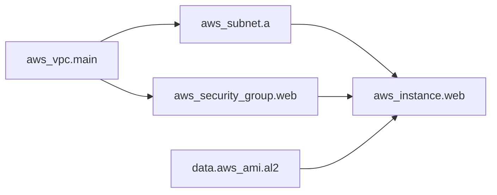
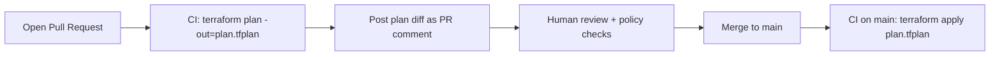

# Infrastructure as Code (Terraform)

**Infrastructure as Code (IaC)** is the practice of provisioning and managing
infrastructure — compute, networking, storage, DNS, IAM, managed services — through
machine-readable definition files kept in version control, instead of clicking in a
console or running ad-hoc scripts. **Terraform** (HashiCorp) is the dominant
cloud-agnostic IaC tool: you describe the *desired end state* in **HCL** (HashiCorp
Configuration Language), and Terraform figures out the API calls needed to make reality
match.

This topic teaches IaC concept-first and then grounds it in Terraform mechanics —
the core workflow, state, modules, and the CI patterns that make it safe. Docker/K8s
internals belong to those domains; here we point at them when infra provisions them.

> [!KEY-TAKEAWAY]
> Terraform's whole model rests on three ideas: (1) you declare **desired state** in HCL,
> (2) Terraform records what it manages in **state**, and (3) `plan` diffs desired state vs
> state vs the real world before `apply` changes anything. Interviewers probe state,
> locking, and drift harder than syntax.

---

## Infrastructure as Code benefits

**What it is.** Treating infrastructure the same way you treat application code: defined in
text files, reviewed in pull requests, versioned in Git, and applied by automation.

**Why it matters — the problems IaC solves:**

- **Repeatability / no snowflakes.** A "snowflake" server is one configured by hand that
  nobody can reproduce. IaC makes environments *reproducible* — dev, staging, and prod come
  from the same code, differing only by variables.
- **Versioned & auditable.** Every infra change is a commit: you get history, blame, diffs,
  and the ability to `git revert`. The code *is* the documentation of what exists.
- **Reviewable.** Infra changes go through code review and automated policy checks before
  they touch production, the same as app code.
- **Speed & scale.** Stand up (or tear down) a whole environment with one command; scale by
  changing a `count` instead of manually provisioning boxes.
- **Disaster recovery.** If a region is lost, re-apply the code to rebuild it.

> [!INTERVIEW]
> "Why IaC over ClickOps?" Lead with **reproducibility and auditability** (no snowflakes,
> everything reviewed and versioned), then mention **drift detection** and **DR**. A weak
> answer only says "automation is faster."

**Gotcha.** IaC does not eliminate configuration drift by itself — someone can still change
things out-of-band in the console. IaC gives you the *tools* to detect and correct drift
(`plan`), but you need process/discipline (and ideally CI enforcement) to benefit.

---

## Declarative vs imperative IaC

**Declarative** ("what"): you describe the desired end state; the tool computes the steps.
Terraform, CloudFormation, and Kubernetes manifests are declarative. You say "I want 3
instances"; Terraform figures out whether to create, do nothing, or destroy to reach 3.

**Imperative** ("how"): you write the ordered steps to execute. Shell scripts and raw AWS
CLI calls are imperative. "Create instance A, then B, then C."

| Aspect | Declarative (Terraform) | Imperative (scripts) |
|---|---|---|
| You specify | Desired end state | Step-by-step actions |
| Idempotency | Built-in (converges to state) | You must code it yourself |
| Re-running | Safe; no-op if already correct | Often re-creates or errors |
| Reasoning | "What should exist" | "What to do now" |

**Idempotency** is the key property: applying the same declarative config repeatedly yields
the same result. Terraform achieves this by comparing desired state to recorded state.

**Nuance.** Terraform is *mostly* declarative but has imperative escape hatches
(`provisioners`, `local-exec`). Ansible is often called "declarative-ish" — its modules are
idempotent, but playbooks are an ordered task list, so it sits between the two paradigms.
Pulumi/CDK use general-purpose languages but still produce a declarative desired-state graph.

---

## Terraform core workflow: init, plan, apply, destroy

The canonical loop:

```bash
terraform init      # download providers/modules, configure the backend
terraform plan      # compute + show the diff (create/update/destroy), no changes made
terraform apply     # execute the plan to reach desired state
terraform destroy   # tear down everything in state
```

- **`init`** — initializes the working directory: downloads provider plugins and modules,
  and sets up the state backend. Must run first (and again after adding providers/modules).
- **`plan`** — a **dry run**. Refreshes state against the real world, then diffs desired
  config vs current state and prints the execution plan: `+` create, `~` update in place,
  `-/+` replace (destroy then create), `-` destroy. Makes **no** changes. This is your
  safety gate.
- **`apply`** — carries out the plan. By default it re-plans and prompts for approval; pass
  a saved plan file (`terraform plan -out=tf.plan` then `terraform apply tf.plan`) to apply
  *exactly* what was reviewed — important in CI.
- **`destroy`** — removes all resources tracked in state.

Other useful commands: `terraform fmt` (canonical formatting), `terraform validate`
(syntax/type check, no API calls), `terraform state` (inspect/manipulate state), `terraform
import` (bring existing resources under management).

> [!TIP]
> In CI, always `plan -out=plan.tfplan` and then `apply plan.tfplan`. Applying a saved plan
> guarantees you execute exactly what a human reviewed — no window for the world to change
> between plan and apply.

---

## HCL, providers, resources, and data sources

**HCL** is Terraform's declarative configuration language. The building blocks:

```hcl
terraform {
  required_providers {
    aws = { source = "hashicorp/aws", version = "~> 5.0" }
  }
}

provider "aws" {            # a PROVIDER: plugin that talks to an API (AWS, GCP, k8s...)
  region = "us-east-1"
}

resource "aws_instance" "web" {   # a RESOURCE: something Terraform creates & manages
  ami           = data.aws_ami.al2.id
  instance_type = "t3.micro"
  tags = { Name = "web" }
}

data "aws_ami" "al2" {            # a DATA SOURCE: reads existing/external info (read-only)
  most_recent = true
  owners      = ["amazon"]
  filter {
    name   = "name"
    values = ["amzn2-ami-hvm-*"]
  }
}
```

- **Provider** — a plugin implementing the CRUD API for a platform (AWS, Azure, GCP,
  Kubernetes, Cloudflare, GitHub, etc.). Terraform is provider-agnostic; the provider does
  the actual API calls. Providers are versioned separately from Terraform core.
- **Resource** — a managed object Terraform will **create, update, and destroy** to match
  config. Addressed as `<type>.<name>` (e.g. `aws_instance.web`).
- **Data source** — a **read-only** lookup of information that exists outside this config
  (an existing AMI, a VPC, a secret). Terraform reads it; it never creates/destroys it.
- **Meta-arguments** — `count`, `for_each` (create N copies), `depends_on` (explicit
  ordering), `lifecycle` (e.g. `create_before_destroy`, `prevent_destroy`), `provider`.

**Gotcha.** Don't confuse a `resource` (managed, mutable by Terraform) with a `data` source
(observed, never mutated). Using a data source to "look up" something you actually want
Terraform to own is a common mistake — Terraform won't create or protect it.

---

## The Terraform dependency graph

Terraform builds a **directed acyclic graph (DAG)** of all resources and data sources, then
walks it to decide order of operations. Edges come from **references**: if
`aws_instance.web` uses `aws_security_group.sg.id`, Terraform knows the SG must exist first.

- **Implicit dependencies** (preferred): created automatically whenever one resource
  references another's attribute. This is how you should express ordering 99% of the time.
- **Explicit dependencies**: `depends_on = [aws_iam_role_policy.x]` — for hidden
  dependencies Terraform can't infer from references (e.g. IAM eventual consistency).
- **Parallelism**: Terraform applies independent nodes concurrently (default up to 10,
  tunable with `-parallelism=n`). The DAG guarantees dependency order while maximizing
  concurrency.
- On `destroy`, Terraform walks the graph in **reverse** order.



A **cycle** (A depends on B depends on A) is an error — the graph must be acyclic. Inspect
it with `terraform graph`.

---

## Terraform state and why it exists

**State** is Terraform's record of the resources it manages: a JSON file (`terraform.tfstate`)
mapping each config resource to its real-world object ID and last-known attributes.

**Why state exists (why not just query the cloud each time?):**

1. **Mapping config → real resource.** Your HCL says `aws_instance.web`; AWS knows only
   `i-0abc123`. State stores that binding so Terraform knows *which* real object a config
   block owns.
2. **Performance.** For large infra, refreshing thousands of resources via API on every run
   is slow; cached attributes in state let Terraform diff quickly (and you can even
   `-refresh=false`).
3. **Metadata & dependencies.** State stores resource dependencies and provider metadata
   needed to compute correct create/destroy ordering.
4. **Detecting deletes/renames.** Knowing what it created lets Terraform notice when
   something you removed from config should be destroyed.

**Desired state (HCL) vs state file vs real world** are three distinct things. `plan`
reconciles all three: it refreshes state from the real world, then diffs against your HCL.

> [!WARNING]
> State is **precious**. Losing it means Terraform "forgets" what it manages and may try to
> recreate everything. Never hand-edit `terraform.tfstate`; use `terraform state`
> subcommands (`mv`, `rm`, `show`) instead.

---

## Remote state backends

By default state is a **local** file — fine for solo experiments, unworkable for teams
(everyone would have a divergent copy, and secrets would sit on laptops). A **remote
backend** stores state centrally and shared.

Common backends: **AWS S3** (with DynamoDB or S3-native lock), **Terraform Cloud/Enterprise**,
**Azure Blob Storage**, **GCS**, **Consul**, **HTTP**.

```hcl
terraform {
  backend "s3" {
    bucket         = "acme-tfstate"
    key            = "prod/network/terraform.tfstate"
    region         = "us-east-1"
    dynamodb_table = "tf-locks"   # state locking (classic pattern)
    encrypt        = true
  }
}
```

**Benefits of remote state:**

- **Shared, single source of truth** for the team.
- **Locking** (see below) to prevent concurrent writes.
- **Encryption at rest** and access control via IAM/bucket policy.
- **Versioning** (S3 versioning) so you can recover a corrupted/old state.
- Keeps sensitive attributes off individual laptops.

Related: `terraform_remote_state` is a *data source* to read another config's outputs —
one common way to share values (e.g. VPC ID) across separately-managed stacks.

---

## State locking

When state lives remotely and multiple people/CI jobs run `apply` at once, two concurrent
writes can **corrupt state** or cause conflicting changes. **State locking** prevents this:
Terraform acquires a lock before any operation that writes state and releases it after.

- **S3 backend** historically used a **DynamoDB table** as the lock (a conditional PutItem
  on a `LockID` key); newer Terraform/OpenTofu also support **S3-native locking** via a
  `.tflock` object with conditional writes, reducing the need for DynamoDB.
- **Terraform Cloud, Azure, GCS, Consul** provide their own locking mechanisms.
- Not all backends support locking (e.g. plain HTTP without support). Local state uses a
  local file lock.

If a run crashes and leaves a stale lock, `terraform force-unlock <LOCK_ID>` releases it —
**dangerously**, only when you're certain no other apply is running.

> [!WARNING]
> `terraform apply -lock=false` disables locking. Never do this in a team/CI context — it
> reintroduces the exact concurrent-write corruption locking exists to prevent.

---

## Sensitive data in state

Terraform stores **all** managed attributes in state, including secrets it had to know —
generated DB passwords, private keys, `random_password` values. **State is effectively
plaintext**; marking a variable/output `sensitive = true` only redacts it from *CLI output*,
not from the state file.

**Mitigations:**

- Store state in a backend with **encryption at rest** (S3 SSE, etc.) and strict access
  control — treat read access to the state bucket as read access to your secrets.
- Prefer generating/fetching secrets from a secrets manager (Vault, AWS Secrets Manager) at
  deploy/runtime rather than materializing them into Terraform state. (See the
  `secrets-management` topic for pipeline secret handling.)
- Never commit state to Git.
- Restrict who can `terraform state pull` / read the backend.

> [!INTERVIEW]
> A favorite trap: "Does `sensitive = true` encrypt the value in state?" **No.** It only
> hides it from plan/apply output and logs. The state file still contains the plaintext.

---

## State as source of truth vs the real world (drift)

Terraform treats **its state (reconciled with your config) as the intended source of
truth**. But the real infrastructure can diverge:

- The **config (HCL)** = desired state you author.
- The **state file** = what Terraform last recorded.
- The **real world** = what actually exists in the cloud right now.

`terraform plan` refreshes state from the real world and reports the delta needed to make
reality match config. If someone changed a resource out-of-band, plan shows a diff to *undo*
that change (revert reality to config) — Terraform will "correct" drift on the next apply.

This is why out-of-band console edits are dangerous with IaC: your next `apply` may silently
revert them. The discipline is: **all changes go through the code**.

---

## Drift detection

**Drift** is any difference between the real infrastructure and what Terraform state/config
expects — caused by manual console edits, other tools, or cloud-side auto-changes.

**How to detect it:**

- `terraform plan` (with refresh) shows drift as a diff. A clean/prod check often uses
  `terraform plan -detailed-exitcode`: exit `0` = no changes, `2` = changes/drift present,
  `1` = error. CI can run this on a schedule and alert on exit `2`.
- Terraform Cloud/Enterprise has built-in scheduled **drift detection**.

**How to remediate:**

- **Re-apply** to force reality back to config (revert the drift), **or**
- **Update the config** to match the intentional out-of-band change, **or**
- `terraform apply -refresh-only` to accept real-world changes into state without other
  changes (formerly `terraform refresh`).

> [!TIP]
> Run scheduled `plan -detailed-exitcode` in CI as a **drift alarm** on production stacks.
> Catching drift early prevents a surprise revert during an unrelated future apply.

---

## Modules

A **module** is a reusable, encapsulated group of Terraform resources — a folder of `.tf`
files with **inputs (variables)**, **resources**, and **outputs**. Every Terraform config
is itself the "root module"; you call child modules to compose infrastructure.

```hcl
module "vpc" {
  source  = "terraform-aws-modules/vpc/aws"   # from the public Registry
  version = "~> 5.0"
  name    = "prod"
  cidr    = "10.0.0.0/16"
}

# use its outputs
resource "aws_instance" "web" {
  subnet_id = module.vpc.private_subnets[0]
}
```

**Why modules:**

- **Reuse / DRY** — define a "standard service" or "standard VPC" once, instantiate many
  times with different inputs.
- **Composition & encapsulation** — hide internal complexity behind a clean input/output
  interface.
- **Consistency & governance** — a golden module bakes in tagging, encryption, and naming
  standards.

**Sources:** local paths (`./modules/vpc`), the **Terraform Registry**
(`terraform-aws-modules/...`), Git URLs, S3, etc. Always **pin a `version`** (or a Git ref)
for registry/remote modules so builds are reproducible.

**Gotcha.** Modules don't manage state separately — child module resources live in the same
state as the root that calls them. Over-nesting modules ("module lasagna") makes plans hard
to read; keep composition shallow.

---

## Variables, outputs, and locals

- **`variable`** — an input/parameter to a module. Has `type`, optional `default`,
  `description`, `sensitive`, and `validation` blocks. Set via `-var`, `*.tfvars`,
  `TF_VAR_*` env vars, or defaults.
- **`output`** — a return value exposed by a module (and shown after apply / consumed by a
  parent module or `terraform_remote_state`).
- **`locals`** — named intermediate expressions to avoid repetition within a module; not
  settable from outside.

```hcl
variable "env" {
  type = string
  validation {
    condition     = contains(["dev", "staging", "prod"], var.env)
    error_message = "env must be dev, staging, or prod."
  }
}

locals {
  name_prefix = "acme-${var.env}"
}

output "instance_ip" {
  value     = aws_instance.web.private_ip
  sensitive = false
}
```

**Variable precedence** (later wins): defaults → env `TF_VAR_*` → `terraform.tfvars` →
`*.auto.tfvars` → explicit `-var`/`-var-file` on the CLI.

**Gotcha.** `locals` are computed, not inputs — you can't override a local from the CLI.
Use a `variable` for anything the caller should set.

---

## Workspaces vs directory-per-environment

Two ways to manage multiple environments (dev/staging/prod):

**CLI workspaces** (`terraform workspace new prod`): multiple *named states* backed by the
**same configuration and backend**. `terraform.workspace` lets config vary by workspace.

**Directory-per-environment**: a separate folder (and separate backend state key) per env,
each with its own `*.tfvars`, often sharing modules.

| | Workspaces | Directory-per-env |
|---|---|---|
| State separation | Multiple state paths, one backend config | Fully separate backends/keys |
| Blast radius | Same code path for all envs; easy to fat-finger prod | Strong isolation per env |
| Backend/creds | Shared backend & often shared creds | Can use different accounts/creds per env |
| Best for | Ephemeral/short-lived variants, feature envs | Long-lived dev/staging/prod |

**Consensus / gotcha.** HashiCorp explicitly warns that **CLI workspaces are not a good fit
for strong environment isolation** (prod vs dev), because they share one backend and
credentials — the recommended pattern for prod-grade separation is **directory (or
repo)-per-environment**. Workspaces shine for **ephemeral** parallel copies (e.g. per-PR
environments). (Terraform Cloud "workspaces" are a different, heavier concept than CLI
workspaces.)

---

## Provisioners as a last resort

**Provisioners** (`local-exec`, `remote-exec`, `file`) run scripts as part of resource
create/destroy — e.g. SSH into a new box and run a shell command.

**Why they're a last resort (HashiCorp's own guidance):**

- They're **imperative** actions inside a declarative tool — Terraform can't model what they
  did, so they break the desired-state/idempotency model.
- They're **not tracked in state**; if a provisioner's effect changes, Terraform can't
  detect drift.
- `remote-exec` needs connectivity/SSH and is flaky in CI.
- A **failed provisioner taints** the resource (marks it for recreation on next apply),
  which can be surprising.

**Prefer instead:** cloud-native `user_data`/cloud-init, pre-baked images (Packer),
configuration management (Ansible) as a separate step, or a provider resource that does the
thing declaratively. Use provisioners only when there's genuinely no provider/API path.

---

## Importing existing infrastructure

To bring resources that already exist (created by hand or another tool) under Terraform
management **without recreating them**, use import:

- **`terraform import <address> <id>`** (classic): writes the resource into state; you must
  then hand-write matching HCL. Import populates state, *not* config.
- **`import` block** (Terraform 1.5+, declarative): put an `import { to = ..., id = ... }`
  block in config; `plan`/`apply` performs the import, and `-generate-config-out` can even
  scaffold the HCL.

```hcl
import {
  to = aws_instance.web
  id = "i-0abc123def456"
}
```

**Gotcha.** Import brings a resource under management but does **not** create the config for
it (in the classic command) — if your HCL doesn't match the imported resource, the next
plan will show changes. Import maps a real object into state; it never modifies the resource.

---

## Immutable vs mutable infrastructure

- **Mutable** infrastructure: you change servers **in place** (SSH in, patch, update config
  on the running box). Over time this produces snowflakes and drift.
- **Immutable** infrastructure: you never modify a running server; to change it you **build
  a new image and replace** the instance (destroy old, create new). Terraform + pre-baked
  images (Packer) + `create_before_destroy` / rolling replacement is the canonical pattern.

**Benefits of immutable:** reproducibility, easy rollback (redeploy the previous image), no
config drift, and consistency between environments. It pairs naturally with declarative IaC
and blue-green/rolling deployments (see the `deployment-strategies` topic).

Terraform's `-/+` (replace) action and `lifecycle { create_before_destroy = true }` support
the immutable pattern; Ansible-style in-place patching is the mutable pattern.

---

## Terraform vs Pulumi, CloudFormation, and CDK

| Tool | Language | Cloud scope | State | Notes |
|---|---|---|---|---|
| **Terraform** | HCL (declarative DSL) | Multi-cloud (providers) | Own state file (local/remote) | De-facto standard; huge provider/module ecosystem |
| **OpenTofu** | HCL | Multi-cloud | Same as Terraform | Open-source fork after Terraform's BUSL license change (2023) |
| **Pulumi** | Real languages (TS, Python, Go, C#) | Multi-cloud | Own state (Pulumi service/self-managed) | Full programming-language power, loops/abstractions |
| **AWS CloudFormation** | YAML/JSON templates | **AWS only** | Managed by AWS (stacks; no state file you own) | Native AWS; drift detection & rollback built in |
| **AWS CDK** | Real languages (TS, Python, …) | AWS (synthesizes to CloudFormation) | Via CloudFormation | Imperative code → declarative CFN templates |

**Key distinctions to state in an interview:**

- **Terraform is cloud-agnostic** via providers; **CloudFormation is AWS-only**.
- **CDK synthesizes down to CloudFormation** — CFN is still the engine and state manager.
- **Terraform manages its own state**; CloudFormation state is managed *for* you by AWS (no
  state file to secure/lock yourself, but less portable).
- **Pulumi/CDK use general-purpose languages** (great for complex logic/abstraction) vs
  Terraform's purpose-built HCL (simpler, more constrained, more declarative).
- **OpenTofu** is the Linux Foundation open-source fork created after HashiCorp relicensed
  Terraform to BUSL; drop-in compatible for most configs.

---

## Plan in CI, apply on merge

The standard safe GitOps-style workflow for Terraform in a pipeline:



- On **pull request**: run `fmt -check`, `validate`, `plan`, and policy/security scanning
  (e.g. `tflint`, `tfsec`/Checkov, OPA/Sentinel). Post the plan as a PR comment so reviewers
  see exactly what would change. **No apply on PRs.**
- On **merge to main**: run `apply` (ideally applying the *saved* plan file), gated by
  environment approvals for prod.
- **State locking** ensures two pipeline runs can't apply concurrently.
- Use **least-privilege, short-lived credentials** — prefer **OIDC federation** from the CI
  system to the cloud (e.g. GitHub Actions OIDC → AWS IAM role) instead of long-lived
  static keys. (See `secrets-management` for OIDC-to-cloud details.)

> [!INTERVIEW]
> "How do you run Terraform safely in CI?" Hit: **plan on PR (never apply), review the plan
> diff, apply the saved plan on merge, remote state with locking, and OIDC short-lived
> creds**. Bonus: policy-as-code gate and drift-detection cron.

This mirrors the IaC benefits (reviewable, auditable, repeatable) end-to-end — the pipeline
is what makes "infrastructure as code" actually behave like code.

---

## Common follow-up questions

- **"Why does Terraform need a state file — can't it just read the cloud?"** Mapping
  config→real IDs, performance, dependency metadata, and detecting deletions. It *can*
  refresh from the cloud, but state is the authoritative binding.
- **"What happens if two engineers run `apply` at once?"** Without locking, corrupted or
  conflicting state; with a locking backend the second run waits/fails to acquire the lock.
- **"Is a value marked `sensitive` encrypted in state?"** No — only hidden from output;
  state is plaintext. Encrypt the backend and control access.
- **"Workspaces or separate directories for prod?"** Directories/repos per env for strong
  isolation; workspaces for ephemeral parallel copies. HashiCorp advises against workspaces
  for prod isolation.
- **"How do you adopt Terraform for existing hand-built infra?"** `import` (block or
  command) resources into state and write matching HCL; verify with a clean `plan`.
- **"Terraform vs CloudFormation?"** Multi-cloud + own state vs AWS-only + AWS-managed
  state; CDK synthesizes to CFN.
- **"How do you handle secrets Terraform generates?"** Encrypt/lock state, restrict access,
  and prefer external secret managers over materializing secrets into state.
- **"How do you detect and fix drift?"** `plan -detailed-exitcode` (scheduled in CI);
  remediate by re-apply, updating config, or `-refresh-only`.

## References

- HashiCorp — Terraform documentation: <https://developer.hashicorp.com/terraform/docs>
- HashiCorp — State, purpose of: <https://developer.hashicorp.com/terraform/language/state/purpose>
- HashiCorp — Remote backends & state locking: <https://developer.hashicorp.com/terraform/language/backend>
- HashiCorp — Sensitive data in state: <https://developer.hashicorp.com/terraform/language/state/sensitive-data>
- HashiCorp — Provisioners (last resort): <https://developer.hashicorp.com/terraform/language/resources/provisioners/syntax>
- HashiCorp — Modules: <https://developer.hashicorp.com/terraform/language/modules>
- HashiCorp — Managing workspaces / when not to use them: <https://developer.hashicorp.com/terraform/cli/workspaces>
- HashiCorp — Import & import blocks: <https://developer.hashicorp.com/terraform/language/import>
- HashiCorp — Provider ecosystem (Registry): <https://registry.terraform.io/>
- OpenTofu (open-source fork): <https://opentofu.org/>
- AWS — CloudFormation & CDK docs: <https://docs.aws.amazon.com/cloudformation/> · <https://docs.aws.amazon.com/cdk/>
- DORA / Accelerate research (delivery outcomes IaC enables): <https://dora.dev/>
