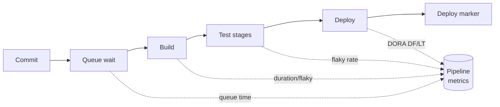

# Monitoring and Observability (DevOps view)

This page is the **delivery-pipeline view** of monitoring and observability: how the
signals your systems emit plug into shipping software safely and fast. It covers tying
deploys to metric changes (deployment markers), measuring the delivery process itself
(DORA and pipeline metrics), gating releases on health (smoke tests, synthetic checks,
readiness probes, golden signals), and closing the loop with automated rollback on SLO
breach and alert routing to on-call.

> [!KEY-TAKEAWAY]
> In DevOps, observability is not a dashboard you look at *after* work — it is
> **wired into the pipeline**. A deploy annotates your metrics so you can correlate a
> regression with the change that caused it; a post-deploy smoke/synthetic check acts
> as an automated release gate; an SLO breach can trigger automated rollback; and the
> pipeline itself is a system you must monitor (build time, flaky rate, queue time).
> The measurable outcome is the DORA four keys.

> [!INTERVIEW]
> The dedicated **observability** domain owns the deep mechanics — metrics/logs/traces,
> OpenTelemetry, PromQL, cardinality, SLO error-budget math. In a *DevOps* interview,
> stay in the delivery lane: "how does observability make releases safe and how do I
> measure delivery performance?" Cross-reference the observability and
> SRE topics for the internals rather than re-deriving them.

---

## Three pillars recap and the DevOps boundary

Observability is the property of a system that lets you ask arbitrary questions about
its internal state from the outside, without shipping new code to answer them. It is
conventionally described via **three pillars**:

- **Metrics** — cheap, aggregatable numeric time series (request rate, error rate,
  latency percentiles, CPU). Great for alerting and dashboards; low cardinality.
- **Logs** — timestamped, often structured event records. High detail, higher cost,
  good for "what exactly happened at 14:03".
- **Traces** — the causal path of one request across services (spans), essential in
  distributed systems for finding *where* latency or errors originate.

**Monitoring vs observability:** monitoring is watching *known* failure modes
(predefined dashboards/alerts on metrics you knew to collect); observability is being
able to debug *unknown* failure modes after the fact. You need both.

> [!TIP]
> Boundary for this topic: the **observability domain** teaches the pillars, OTel,
> Prometheus/PromQL, and cardinality in depth. Here we care only about how these
> signals serve *delivery* — so we reference them and focus on deploy markers,
> release gates, DORA, and pipeline monitoring.

---

## Deployment markers and annotations

A **deployment marker** (a.k.a. annotation or deploy event) is a timestamped record —
pushed to your metrics/observability backend at the moment a release goes out — that
labels the exact time, version, and environment of a deploy. When rendered on a
dashboard it appears as a vertical line, so a human (or an automated diff) can instantly
see "latency doubled *right after* v1.42.0 shipped."

Why it matters: the single most common on-call question is *"what changed?"* Correlating
a metric regression with a specific deploy turns an hour of guessing into a
one-glance answer, and it is a prerequisite for **automated rollback** (you need to
know which version to revert to).

How it is wired into the pipeline — a final pipeline step emits the marker:

```yaml
# GitHub Actions: annotate Grafana/Datadog after a successful deploy
- name: Mark deployment
  run: |
    curl -sf -X POST "https://api.datadoghq.com/api/v1/events" \
      -H "DD-API-KEY: ${{ secrets.DD_API_KEY }}" \
      -H "Content-Type: application/json" \
      -d '{
        "title": "Deploy checkout-svc ${{ github.sha }}",
        "text": "release '"${GITHUB_REF_NAME}"' by '"${GITHUB_ACTOR}"'",
        "tags": ["service:checkout", "env:prod", "version:${{ github.sha }}"]
      }'
```

Good markers carry **version, environment, service, and who/what triggered it** as
tags/labels so you can filter. Prometheus users often expose a
`build_info{version="..."}` gauge or push a Grafana annotation; Datadog/New Relic/Honeycomb
have native deploy-marker APIs.

> [!WARNING]
> Emit the marker as close to the actual traffic cutover as possible, not at pipeline
> start. A marker stamped at the beginning of a 20-minute rolling deploy will not line
> up with the metric change and defeats the correlation.

---

## DORA metrics: the four keys

The **DORA** (DevOps Research and Assessment) / *Accelerate* research identifies four
key metrics that together measure software delivery performance. Two measure **throughput**
(speed) and two measure **stability** — and the research found the two are *not* a
trade-off: elite teams score well on both.

| Metric | What it measures | Category |
|---|---|---|
| **Deployment Frequency (DF)** | How often you deploy to production | Throughput |
| **Lead Time for Changes (LT)** | Time from code committed to running in prod | Throughput |
| **Change Failure Rate (CFR)** | % of deploys that cause a failure needing remediation (rollback/hotfix/patch) | Stability |
| **Failed Deployment Recovery Time** (formerly MTTR) | Time to restore service after a failed deployment | Stability |

Approximate performance clusters from the DORA reports (the *State of DevOps*
report recalibrates the exact band boundaries most years — quote these as
**approximate**, and the CFR bands especially shift between editions):

| Metric | Elite | High | Medium | Low |
|---|---|---|---|---|
| Deploy frequency | On-demand (multiple/day) | Weekly–monthly | Monthly–biannually | < biannually |
| Lead time | < 1 hour | 1 day – 1 week | 1 week – 1 month | 1–6 months |
| Change failure rate | 0–15% | 16–30% | (varies) | (varies) |
| Recovery time | < 1 hour | < 1 day | 1 day – 1 week | > 6 months |

**Worked example — computing the keys from raw events.** Take one change and one week:

- **Lead time:** commit pushed **09:00**, merged + built **09:20**, deployed to prod
  **10:30** → lead time = 10:30 − 09:00 = **90 min**. That's just over the elite
  threshold (< 1 h), so this team is "high", not "elite", on lead time.
- **Change failure rate:** over the week you shipped **40 deploys**, of which **2**
  needed a rollback/hotfix → CFR = 2 / 40 = **5%** — inside the elite 0–15% band.
- **Recovery time:** the failing deploy broke prod at 14:00 and the rollback restored
  service at 14:25 → recovery = **25 min** (< 1 h → elite).

Contrast the CFR arithmetic with a slow team: 4 deploys/month, 2 fail → 2 / 4 = **50%**
CFR. Same *number* of failures as a busy day, 10× the *rate* — which is the point below.

Key nuances interviewers probe:

- **CFR is a *rate*, not a count** — deploying 100×/day with 5 failures (5% CFR) is
  healthier than deploying 2×/month with 1 failure (50% CFR). Small frequent deploys
  lower both blast radius and CFR.
- These are **outcome** metrics for the *system*, not individual-productivity metrics.
  Weaponizing them against engineers causes gaming (e.g. splitting one change into ten
  deploys to inflate frequency).
- DORA later added **reliability** as a fifth measure (operational performance / meeting
  user expectations), reflecting SRE practice.

> [!TIP]
> You can compute all four from data you already have: deploys from the pipeline/deploy
> tool, lead time from commit timestamp → deploy timestamp, CFR and recovery time from
> incident/rollback records. Tools like the Four Keys project, Sleuth, LinearB, and
> DevLake automate this.

---

## Monitoring the pipeline itself

The CI/CD pipeline is a production system for your engineers — if it is slow or flaky,
throughput and morale both drop. Treat it as observable and instrument these signals:

- **Build/pipeline duration** — total and per-stage; the trend matters more than a
  single run. Rising build time silently taxes every commit.
- **Queue / wait time** — how long jobs wait for a runner/agent. High queue time means
  you are runner-starved, not slow.
- **Success/failure rate** and **flaky rate** — the fraction of failures that pass on
  retry with no code change. Flaky tests erode trust in the pipeline (see
  `testing-strategy-in-cicd` for quarantine).
- **Queue time + run time = feedback latency**, which directly drives DORA lead time.
- **Cost** — runner minutes, especially on hosted CI billed per minute.



> [!WARNING]
> Retrying a red build until it goes green ("retry roulette") hides flakiness and
> inflates your apparent success rate while destroying feedback latency. Track the
> *first-attempt* pass rate and the flaky rate separately.

---

## The four golden signals as a release health check

Google SRE's **four golden signals** are the minimum set to watch for any
user-facing service — and they double as the ideal **release health check** during and
after a deploy:

- **Latency** — request duration; separate successful from failed request latency, and
  watch tail percentiles (p95/p99), not just the mean.
- **Traffic** — demand on the system (requests/sec, transactions/sec).
- **Errors** — rate of failed requests (HTTP 5xx, exceptions, wrong-content responses).
- **Saturation** — how "full" the service is (CPU, memory, queue depth) — the resource
  closest to its limit.

During a canary or rolling deploy you compare these signals **new version vs baseline**;
a regression in any of them is a signal to halt/rollback. This is the metric layer that
tools like **Argo Rollouts (AnalysisTemplate)** and **Flagger** query to decide whether
to promote or abort a progressive rollout.

**Worked example — reading a canary scorecard.** Say the analysis threshold is "abort if
p99 latency > 1.5× baseline **or** error rate > 1%":

| Signal | Baseline (stable) | Canary (new) | Threshold | Verdict |
|---|---|---|---|---|
| p99 latency | 200 ms | 420 ms | > 300 ms (1.5×) | **regressed** |
| errors | 0.3% | 1.8% | > 1% | **regressed** |
| traffic | 1,000 rps | 1,000 rps | (context only) | ok |
| saturation (CPU) | 55% | 60% | < 80% | ok |

Latency 420 ms > 300 ms **and** errors 1.8% > 1% — either alone is enough, so the canary
**aborts** and traffic returns to stable. Note traffic isn't a pass/fail gate here: it's
context (if canary rps had collapsed to near-zero while baseline held, that itself would
be the alarm — the new version is dropping requests).

> [!INTERVIEW]
> If asked "which metrics gate a deploy?" the four golden signals are the crisp answer.
> The related **RED** method (Rate, Errors, Duration — for request-driven services) and
> **USE** method (Utilization, Saturation, Errors — for resources) are good follow-ons;
> know that RED ≈ traffic+errors+latency and USE targets saturation/resources.

---

## Post-deploy smoke tests and synthetic monitoring as a release gate

A **smoke test** is a small, fast set of checks run *immediately after* a deploy against
the real (just-deployed) environment to confirm the release is minimally healthy —
"is it on fire?" — e.g. hit `/health`, log in, place one test order. It runs as a
pipeline stage; failure blocks promotion or triggers rollback.

**Synthetic monitoring** goes further and runs scripted, agent-driven transactions
against production **continuously** (every 1–5 min from multiple regions), independent of
real user traffic. It catches problems before/without a real user hitting them and gives
you a signal even at 3 a.m. with zero traffic.

```yaml
# GitLab CI: post-deploy smoke stage as a release gate
smoke-test:
  stage: verify
  needs: [deploy-prod]
  script:
    - curl -sf https://checkout.example.com/health || exit 1
    - ./smoke/place-test-order.sh          # end-to-end critical path
  # non-zero exit fails the pipeline -> deploy job's rollback runs
```

Distinctions worth knowing:

- **Smoke test** = one-shot, in the pipeline, gates *this* release.
- **Synthetic (a.k.a. active/probe) monitoring** = continuous, in production, catches
  regressions and outages any time.
- Both are **black-box** (outside-in) checks; they complement white-box metrics.

The rollback wiring is mechanical: the smoke stage's script ends in `|| exit 1`, so a
failed check makes the job exit **non-zero**; the pipeline marks the stage failed, which
triggers the `on_failure`/rollback job (or, for progressive delivery, the controller sees
the metric fail and aborts). No human decides — a red smoke test *is* the rollback signal.

> [!WARNING]
> Two gotchas here. (1) **Exclude synthetic/smoke traffic from user-facing SLIs and
> dashboards** — those requests aren't real users, and a 1-minute synthetic probe against
> low real traffic can badly skew error rate and latency percentiles (or worse, mask a
> real regression). Tag it and filter it out. (2) Point synthetics and smoke tests at
> **real dependencies** with idempotent/cleanable test data — a smoke test that mocks the
> database gives false confidence, and one that leaves junk orders behind pollutes prod.

---

## Health checks and readiness for deploy gating

Orchestrators use **health probes** to decide when an instance should receive traffic and
when to restart it. They are the deploy-gating primitive underneath rolling/blue-green
deploys:

- **Liveness** — "is the process wedged?" If it fails, the orchestrator **restarts** the
  container. Must be cheap and *not* depend on downstream services (or a dependency
  outage triggers a restart storm).
- **Readiness** — "can this instance serve traffic *right now*?" If it fails, the
  instance is pulled from the load-balancer pool but **not** restarted. This is what
  gates a rolling deploy: a new pod gets traffic only once it reports ready.
- **Startup** — for slow-booting apps; holds off liveness/readiness until the app has
  finished initializing, so a long warm-up is not mistaken for a hang.

```yaml
# Kubernetes probes: readiness gates traffic; liveness restarts
readinessProbe:
  httpGet: { path: /ready, port: 8080 }
  initialDelaySeconds: 5
  periodSeconds: 5
livenessProbe:
  httpGet: { path: /healthz, port: 8080 }
  periodSeconds: 10
```

Design tip: `/ready` should check the dependencies the instance genuinely needs (DB
pool warm, caches loaded); `/healthz` should stay shallow. A rolling deploy with correct
readiness gates achieves **zero-downtime** because traffic never routes to a not-yet-ready
instance. (Kubernetes probe internals live in the Kubernetes domain — here it is the
*deploy gate*.)

> [!WARNING]
> A common outage: making the **liveness** probe depend on a downstream service. When
> that dependency blips, every replica fails liveness and Kubernetes restarts them all
> at once, turning a partial degradation into a total outage.

---

## Automated rollback on SLO breach

The safety payoff of all the above is **automated rollback**: the pipeline (or the
progressive-delivery controller) watches health signals during and after a deploy and
**automatically reverts** to the last known-good version if they regress — no human in
the loop for the fast path.

Two common triggers:

- **Analysis-based (canary):** Argo Rollouts `AnalysisTemplate` / Flagger runs a
  metric query (error rate, p99 latency, golden signals) against the canary; if it fails
  the success condition, the rollout **aborts** and shifts traffic back to stable.
- **Alarm/SLO-based:** the deploy is tied to an alarm or SLO burn-rate; a breach within
  a bake window trips rollback. (AWS CodeDeploy can auto-rollback on a CloudWatch alarm.)

```yaml
# Argo Rollouts: abort canary if success rate < 99% over the window
metrics:
- name: success-rate
  interval: 1m
  successCondition: result[0] >= 0.99
  failureLimit: 2
  provider:
    prometheus:
      query: |
        sum(rate(http_requests_total{status!~"5..",app="checkout"}[2m]))
        / sum(rate(http_requests_total{app="checkout"}[2m]))
```

**Tracing the query.** The numerator sums the rate of requests whose status is *not* a
5xx; the denominator sums *all* requests — so `result[0]` is the success ratio. Say over
the 2-minute window the checkout canary served **10,000 requests** and **150** were 5xx:

- non-5xx = 10,000 − 150 = **9,850**
- ratio = 9,850 / 10,000 = **0.985**
- successCondition `result[0] >= 0.99` → `0.985 >= 0.99` is **false** → this evaluation
  **fails**.

`failureLimit: 2` means the metric may fail up to 2 times before it's fatal; the 3rd
consecutive failure **aborts** the rollout and Argo shifts 100% of traffic back to the
stable ReplicaSet. (0.985 is a 1.5% error rate — well past a typical <1% budget, so this
canary is correctly killed.)

Key concepts:

- **Bake time** — a deliberate soak period at each canary step so slow-burning issues
  (memory leaks, error spikes under load) surface before full promotion.
- **Rollback vs roll-forward** — rollback reverts to the prior artifact (fast, safe when
  backward-compatible); roll-forward ships a fix. Automated rollback assumes
  backward-compatible changes, especially DB schema (see `deployment-strategies`).
- **Rollback must itself be tested** — an untested rollback path is not a safety net.

> [!TIP]
> Rollback is only safe if the previous version can run against the *current* database
> and dependencies. This is why expand/contract (backward-compatible) migrations are a
> prerequisite for confident automated rollback.

---

## Alerting and routing to on-call

Alerting turns metrics into human action. In the delivery loop, alerts fire on
**symptoms users feel** (SLO burn, golden-signal regressions), route to the right
on-call engineer, and often carry deploy context so the responder immediately sees the
suspect release.

DevOps-relevant principles (the deep alerting math and on-call process live in the SRE /
observability topics):

- **Alert on symptoms, not causes** — page on "checkout error rate > 2%", not "CPU >
  80%". Cause-based alerts create noise and miss novel failures.
- **Every page must be actionable** — if there is nothing to do, it should be a ticket or
  dashboard, not a page. Alert fatigue causes real pages to be ignored.
- **SLO burn-rate alerting** — page fast on a fast burn of the error budget, slower on a
  slow burn (multi-window multi-burn-rate). Details in the SRE/observability SLO topic.
- **Routing** — tools like PagerDuty/Opsgenie map alerts → on-call schedules with
  escalation policies; alerts should include the recent deploy marker so "what changed?"
  is answered in the page itself.

> [!INTERVIEW]
> If pushed on alerting depth, name the pattern (symptom-based, SLO burn-rate,
> actionable-only) and explicitly hand off: "the burn-rate windows and on-call/postmortem
> process are the SRE topic — the DevOps hook is that alerts carry deploy context and can
> gate/rollback releases."

---

## Error budgets and DORA as release gates

The tie between reliability signals and *delivery decisions*:

- An **SLO** (Service Level Objective) is a target for an **SLI** (a measured indicator
  like success rate or latency); the **error budget** = 100% − SLO is how much
  unreliability you are allowed to spend. When the budget is healthy, ship fast; when it
  is exhausted, the policy can **freeze feature releases** and redirect effort to
  reliability. This is error budgets *gating* releases.
- **DORA CFR and recovery time** are the retrospective scorecard: rising CFR after a
  process change is a signal your gates (tests, canary, smoke checks) are too weak or
  your changes too large.

**Worked example — "what does 99.9% actually buy you?"** A month is ~30 days ×
24 h × 60 min = **43,200 min**. The budget is the *allowed* unreliability, `100% − SLO`:

- **99.9%** SLO → 0.1% × 43,200 = **~43 min/month** of allowed downtime.
- **99.99%** SLO → 0.01% × 43,200 = **~4.3 min/month** — one bad deploy can blow it.
- **99%** SLO → 1% × 43,200 = **432 min ≈ 7.2 h/month**.

Now spend it: one incident burns **30 min** against a 99.9% (43-min) budget →
30 / 43 = **~70% of the month's budget gone in one event**. Two more like it and you're
over budget → the SLO policy **freezes feature releases** until the budget recovers. The
punchline interviewers want: a "three nines" target is a shockingly small time budget,
which is exactly why it forces small, safe, reversible deploys.

Together these make observability a *control input* to the pipeline rather than just a
readout. (The SLI/SLO/error-budget definitions and burn math are owned by the
`sre-sla-slo-sli-reliability` topic and the observability domain — cross-link them.)

---

## Common follow-up questions

- **"How do you know a deploy caused a regression?"** Deployment markers/annotations
  correlate the metric change to a version; compare golden signals new-vs-baseline.
- **"What metrics gate a deploy?"** The four golden signals (latency, traffic, errors,
  saturation) queried by a canary analysis; plus a post-deploy smoke test on the
  critical path.
- **"Liveness vs readiness — what breaks if you confuse them?"** Readiness gates traffic
  (zero-downtime rolling deploys); a liveness probe that depends on a downstream can
  cause a restart storm and turn degradation into an outage.
- **"Smoke test vs synthetic monitoring?"** Smoke = one-shot in-pipeline release gate;
  synthetic = continuous scripted prod transactions catching issues any time.
- **"Define the DORA four keys and their clusters."** DF, lead time, CFR, recovery time;
  throughput vs stability; CFR is a rate; elite = deploy on demand, <1h lead time & recovery.
- **"How does automated rollback work?"** Canary analysis (Argo Rollouts/Flagger metric
  query) or alarm/SLO breach within a bake window reverts to last known-good; requires
  backward-compatible changes.
- **"How do you measure pipeline health?"** Build duration, queue time, first-attempt
  pass rate, flaky rate, cost; these feed lead time.
- **"When do you stop shipping features?"** When the error budget is exhausted per the
  SLO policy.

## References

- Forsgren, Humble, Kim — *Accelerate* (DORA four keys); Google Cloud DORA reports
  (`dora.dev`) — DF, lead time, CFR, failed-deployment recovery time, performance clusters.
- Google — *Site Reliability Engineering* and *The SRE Workbook* — four golden signals,
  symptom-based & SLO burn-rate alerting, error budgets.
- Argo Rollouts docs — AnalysisTemplate / automated canary analysis and abort.
- Flagger docs — progressive delivery, metric-based promotion/rollback.
- Kubernetes docs — Configure Liveness, Readiness and Startup Probes.
- Datadog / Grafana / New Relic / Honeycomb docs — deployment markers/annotations and
  synthetic monitoring.
- AWS docs — CodeDeploy automatic rollback on CloudWatch alarms.
- Brendan Gregg — USE method; Tom Wilkie — RED method.
- Cross-references: `../observability` domain (metrics/logs/traces, OTel, PromQL, SLO
  math), `sre-sla-slo-sli-reliability`, `deployment-strategies`, `testing-strategy-in-cicd`.
