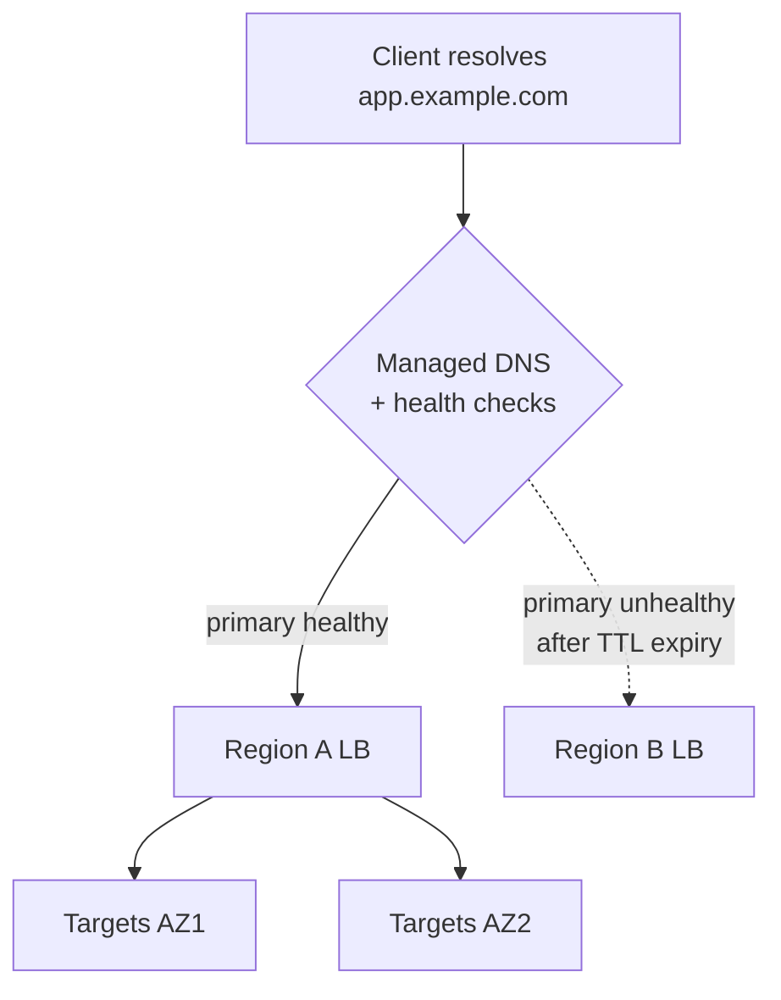
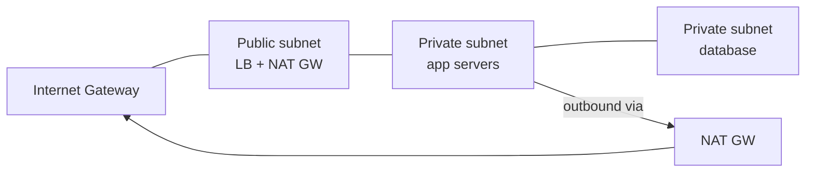
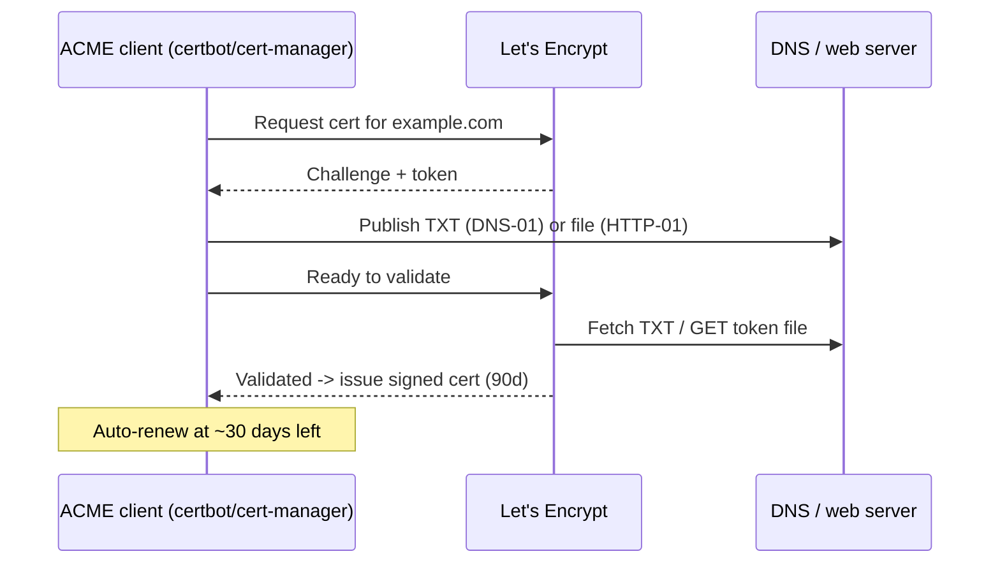

# Networking & DNS for DevOps

This page is the **ops-practitioner view of networking** — the parts a DevOps/platform
engineer configures and debugs every day: DNS records that point traffic at deploys and
enable failover, load balancers and their health checks, firewalls / security groups /
NACLs, CIDR planning for VPC layout, bastions and VPNs, TLS certificate automation with
ACME, reverse proxies and ingress/egress, and the CLI toolkit for troubleshooting.

> [!KEY-TAKEAWAY]
> This topic is **operational**, not wire-level. You should know *what a record/rule/probe
> does and how to configure it safely*, not how the TCP handshake or DNS resolver internals
> work byte-by-byte. For the protocol internals — TCP/IP, the DNS resolution algorithm, the
> TLS handshake, HTTP semantics — see the dedicated **networking** domain. Here we answer:
> "How do I route traffic to a new deploy? Fail over on outage? Open exactly the right
> ports? Automate certs? Debug why the service is unreachable?"

> [!INTERVIEW]
> A strong framing: "Networking for DevOps is about *controlled reachability* — deciding
> precisely what can talk to what, on which ports, with which identity, and how traffic
> gets steered as deploys and failures happen. Almost every choice is a trade-off between
> reachability (things work) and least privilege (blast radius is contained)."

---

## The ops view vs wire-level networking

DevOps networking is concerned with **configuration and operations**, layered on top of
protocols the networking domain owns:

| Wire-level (networking domain) | Ops view (this topic) |
|---|---|
| How DNS recursion/caching resolves a name | Which **records** you create and their **TTLs** |
| TCP 3-way handshake, congestion control | **L4 vs L7** load balancing, health checks |
| TLS handshake, cipher negotiation | **Cert issuance/renewal** (ACME), rotation, SANs |
| IP routing, packet forwarding | **CIDR/subnet** layout, route tables, NAT |
| HTTP request/response semantics | **Reverse proxy / ingress** routing rules |

The mental model: you rarely write protocol code, but you constantly declare *intent* —
"this hostname resolves to that load balancer," "only these CIDRs may reach port 5432,"
"renew this cert 30 days before expiry" — usually as IaC (Terraform) or platform config.

---

## DNS record types for ops

DNS maps names to values. The record types a DevOps engineer touches most:

| Record | Maps | Typical ops use |
|---|---|---|
| **A** | name → IPv4 | Point a host at a server/LB IP |
| **AAAA** | name → IPv6 | Same, for IPv6 |
| **CNAME** | name → another name (alias) | Point `www` at `app.example.com` or a managed LB DNS name |
| **MX** | domain → mail server + priority | Route email |
| **TXT** | name → free text | SPF/DKIM/DMARC, **ACME DNS-01 domain validation**, ownership proofs |
| **SRV** | service → host+port+priority+weight | Service discovery (SIP, XMPP, Kerberos, some internal SD) |
| **NS** | zone → authoritative nameservers | Delegate a zone / subdomain |
| **PTR** | IP → name (reverse DNS) | rDNS for mail reputation, logging |
| **CAA** | domain → allowed CAs | Restrict which CAs may issue certs |
| **ALIAS/ANAME** (vendor) | zone apex → another name | CNAME-like behavior at the apex |

> [!WARNING]
> **You cannot put a CNAME at the zone apex** (e.g. `example.com` itself) per RFC 1034 —
> the apex must have SOA/NS records, and CNAME cannot coexist with other records at the
> same name. That's why providers invented **ALIAS/ANAME** records (Route 53 "alias",
> Cloudflare "CNAME flattening") that behave like a CNAME but resolve to the target's A/AAAA
> at query time, so they can sit at the apex.

- **CNAME chains** add resolution latency and cannot coexist with other record types at the
  same name. Prefer alias records for apex; keep chains short.
- **TXT for validation** is the workhorse of automation: ACME DNS-01, domain-ownership
  checks for CDNs/SaaS, and email auth (SPF/DKIM/DMARC) all use TXT.

---

## TTL and DNS propagation

Every record has a **TTL** (time-to-live, seconds) telling resolvers how long to cache the
answer. TTL is the single most important operational DNS knob.

- **High TTL** (e.g. 3600–86400): fewer authoritative queries, better resilience if your DNS
  is briefly unreachable, but **slow to change** — a cutover or failover can take hours to
  be seen everywhere.
- **Low TTL** (e.g. 30–60): changes propagate fast (good before a migration/cutover), but
  more query load and more dependence on DNS being up.

**"DNS propagation" is a misnomer** — nothing is pushed. Authoritative changes are instant;
what you're waiting for is **cached answers to expire** across the world's resolvers, bounded
by the *old* TTL. Some resolvers ignore TTLs or cache longer, so plan conservatively.

> [!TIP]
> **Playbook for a planned cutover:** lower the TTL to 60s *at least the old-TTL duration
> ahead of time* (so the low value is itself cached everywhere), do the change, verify, then
> raise TTL back up. Lowering TTL one minute before the change does nothing — resolvers still
> hold the old high-TTL answer.

- The **negative-caching TTL** (from the SOA record's minimum field) governs how long
  NXDOMAIN/"no such record" answers are cached — relevant when you *add* a record and it
  seems not to appear.

---

## DNS-based traffic management (failover, weighted, geo, latency)

Managed DNS (Route 53, NS1, Cloudflare, Azure DNS) can return **different answers by policy**,
turning DNS into a coarse global traffic manager:

- **Failover routing** — a **health check** monitors the primary; if it fails, the
  authoritative DNS stops returning the primary's answer and returns the secondary. Recovery
  speed is bounded by health-check interval **+ TTL** (clients keep the cached primary until
  it expires). Keep failover-record TTLs low (30–60s).
- **Weighted routing** — split answers by weight (e.g. 90/10) for canary-at-DNS or gradual
  migration between stacks/regions.
- **Latency-based routing** — return the region with lowest measured latency to the resolver.
- **Geolocation / GeoDNS** — answer by the client's (or resolver's) geographic location, for
  data residency or localized endpoints.
- **Multivalue / round-robin** — return multiple healthy IPs; crude client-side load spread.

> [!WARNING]
> DNS is a **poor fine-grained load balancer**: caching and TTLs mean you can't precisely
> control which client hits which endpoint, and failover is not instant. Use DNS for
> **coarse, cross-region/cross-provider** steering and failover; use a **load balancer** for
> fast, precise, per-request distribution *within* a region. Also beware DNS decisions are
> keyed on the **resolver's** location/identity (e.g. a public 8.8.8.8 resolver), not always
> the end user's.



---

## Split-horizon DNS

**Split-horizon (split-view) DNS** returns *different answers for the same name* depending on
who is asking — typically internal clients get a **private** IP and external clients get a
**public** IP (or NXDOMAIN).

- Common with **private hosted zones** (Route 53 private zone attached to a VPC) vs a public
  zone for the same domain.
- Lets `api.internal.example.com` resolve to a private RFC 1918 address inside the VPC while
  never being reachable/resolvable from the internet.
- **Gotcha:** the *same* FQDN resolving differently by network is a classic source of "works
  on my laptop / broken on the box" confusion — always note *which resolver* answered when
  debugging (see troubleshooting below).

---

## Load balancers: L4 vs L7

A load balancer spreads traffic across healthy backends and provides a stable front. The key
distinction is the **OSI layer** it operates at:

| | **L4 (transport)** | **L7 (application)** |
|---|---|---|
| Operates on | TCP/UDP, IP:port | HTTP/HTTPS, gRPC |
| Sees | Connections, not content | Paths, headers, cookies, hostnames |
| Routing | By IP/port only | Path/host/header-based, rewrites |
| TLS | Usually passthrough | Can **terminate** TLS, inspect/route |
| Examples | AWS NLB, HAProxy (TCP), IPVS | AWS ALB, nginx, Envoy, HAProxy (HTTP) |
| Strengths | Very high throughput, low latency, preserves source IP, any protocol | Content routing, host/path fan-out, header manipulation, WAF, redirects |

- **L4** is fast and protocol-agnostic; ideal for non-HTTP, raw TCP/UDP, or when you want the
  backend to terminate TLS. It cannot make routing decisions on URL/host.
- **L7** understands the request, so it can route `/api` to one target group and `/static` to
  another, do host-based virtual hosting, inject headers, and offload TLS.
- Many stacks combine them: an **NLB in front of Envoy/ingress** (L4 for raw throughput + L7
  for smart routing), or a global L7 (Cloudflare/CloudFront) in front of regional LBs.

> [!TIP]
> When a backend needs the **real client IP**, an L7 LB that terminates the connection hides
> it — use the **`X-Forwarded-For`** header (and configure the app/proxy to trust it), or use
> the **PROXY protocol** for L4. Don't trust `X-Forwarded-For` from untrusted hops.

---

## Health checks and target groups

Load balancers only send traffic to **healthy** backends, determined by **health checks**.

- A **target group** (AWS term; "backend pool"/"upstream" elsewhere) is the set of registered
  targets (instances/IPs/pods) an LB routes to, plus the health-check config.
- Health-check parameters: **protocol/port/path** (e.g. `GET /healthz`), **interval**,
  **timeout**, **healthy/unhealthy threshold** (consecutive checks to flip state), and
  expected status/matcher (e.g. `200-299`).
- **Shallow vs deep checks:** a shallow check (`/healthz` returns 200 if the process is up)
  detects crashes; a deep check (verifies DB/dependency reachability) detects broken
  dependencies **but risks cascading failure** — if a shared DB blips, every instance flips
  unhealthy at once and the LB has nothing to route to. Prefer shallow LB checks + separate
  dependency alarms, or a check that degrades gracefully.

> [!WARNING]
> Distinguish **readiness** from **liveness**. Removing a target that's temporarily busy
> (readiness) is right; *restarting* it (liveness) on a transient dependency failure can turn
> a blip into an outage. This mirrors Kubernetes readiness vs liveness probes — see the
> Kubernetes domain for probe internals.

- **Connection draining / deregistration delay:** when a target is removed (deploy, scale-in),
  the LB stops sending *new* connections but lets in-flight requests finish for a grace period
  — essential for zero-downtime rolling deploys.

---

## Sticky sessions (session affinity)

**Stickiness** pins a client to the same backend across requests, usually via a cookie
(L7) or source-IP hash (L4).

- **When needed:** backend holds in-memory session state not shared across instances.
- **Cost:** uneven load distribution, breaks graceful scale-in/deploys (a removed instance
  loses its sessions), and defeats even spreading.
- **Better pattern:** make backends **stateless** — externalize session state to Redis/a
  shared store or use signed stateless tokens (JWT) — so any instance can serve any request.
  Stickiness is a crutch for stateful apps, not a goal.

- L7 stickiness types: **duration-based** (LB-generated cookie, e.g. ALB `AWSALB`) or
  **application-controlled** (LB honors the app's own session cookie).

---

## CIDR and subnetting for infrastructure

**CIDR** (Classless Inter-Domain Routing) notation `10.0.0.0/16` = an IP prefix + mask
length. The `/N` says the first N bits are the network; the remaining `32-N` bits are hosts.

- `/16` = 65,536 addresses; `/24` = 256; `/28` = 16. Each subnet loses a few to
  network/broadcast/reserved (AWS reserves **5** per subnet — .0 network, .1 router, .2 DNS,
  .3 future, and the last as broadcast).
- **RFC 1918 private ranges:** `10.0.0.0/8`, `172.16.0.0/12`, `192.168.0.0/16`. Use these for
  VPCs; they're not internet-routable.
- **Plan for non-overlap:** VPCs/subnets that must peer or VPN together **cannot have
  overlapping CIDRs** — pick ranges up front. This is a top real-world networking mistake.

| CIDR | Addresses | Usable (AWS, −5) |
|---|---|---|
| `/28` | 16 | 11 |
| `/24` | 256 | 251 |
| `/20` | 4,096 | 4,091 |
| `/16` | 65,536 | 65,531 |

> [!TIP]
> Smaller mask number = **bigger** network (`/16` > `/24`). Interview shortcut: each step down
> in prefix length **doubles** the addresses; `/24` → 256, `/23` → 512, `/25` → 128.

---

## Public vs private subnets, NAT, and route tables

In a cloud VPC, "public" vs "private" is defined by **routing**, not a subnet property:

- A **public subnet** has a route to an **Internet Gateway (IGW)** — resources with public IPs
  can be reached from and reach the internet directly.
- A **private subnet** has **no** route to an IGW. To let private instances make *outbound*
  connections (pull packages, call APIs) without being inbound-reachable, route their
  internet-bound traffic through a **NAT gateway** that lives in a public subnet.
- **Typical layout:** public subnets hold only the load balancer and NAT gateway; app servers
  and databases live in private subnets. Nothing in a private subnet has a public IP.



> [!WARNING]
> **NAT gateways are unidirectional (outbound only)** and cost money (hourly + per-GB) — a
> common surprise bill when private instances pull large images over NAT instead of via a VPC
> endpoint/gateway to the registry. NAT does **not** allow unsolicited inbound connections;
> that's what the LB/IGW is for.

---

## Security groups vs NACLs (and least-privilege rules)

Two layers of network filtering in a VPC, and interviewers love the distinction:

| | **Security Group** | **Network ACL (NACL)** |
|---|---|---|
| Attached to | Instance / ENI (resource) | Subnet |
| Stateful? | **Stateful** — return traffic auto-allowed | **Stateless** — must allow both directions |
| Rules | **Allow only** | **Allow and Deny** |
| Evaluation | All rules evaluated (any match allows) | Numbered rules, **lowest number first**, first match wins |
| Default | Deny all inbound, allow all outbound | Default NACL allows all; custom denies all |

- **Stateful (SG):** if you allow inbound 443, the response is automatically allowed out —
  you don't write a matching outbound rule.
- **Stateless (NACL):** you must allow the return traffic explicitly, typically on the
  **ephemeral port range** (commonly `1024–65535`) — forgetting this is a classic
  "connection hangs" bug.
- **SGs can reference other SGs** as a source (e.g. "allow 5432 from the app SG"), which is
  cleaner and more durable than hardcoding IPs.

> [!KEY-TAKEAWAY]
> **Least privilege for networks:** default-deny, then open the *minimum* — specific ports,
> from specific CIDRs or SGs, in specific directions. Never `0.0.0.0/0` on SSH (22)/RDP
> (3389)/databases. Prefer SG-to-SG references over IP allowlists. NACLs are a coarse,
> stateless *second* layer (e.g. block a bad CIDR subnet-wide), not your primary control.

---

## Firewalls, bastion/jump hosts, and VPNs

Controlling operator/admin access to private infrastructure:

- **Bastion / jump host:** a hardened, minimal host in a public subnet that is the *only*
  SSH entry point; you hop through it to reach private instances. Reduces attack surface to
  one audited box. Lock its SG to your office/VPN CIDR.
- **VPN (site-to-site / client):** extends your private network to operators or another
  network over an encrypted tunnel, so you reach private resources by their private IPs
  without exposing them publicly.
- **Modern alternatives (prefer these):** **SSM Session Manager** (AWS), Teleport,
  Cloudflare/Tailscale zero-trust access — give **agent/identity-based** access with full
  audit logging and *no open inbound SSH port at all*, eliminating the bastion's exposure.
- **Firewall** is the general term; in cloud it's realized as SGs/NACLs plus managed
  network firewalls (AWS Network Firewall, WAF for L7). Host firewalls (`iptables`/`nftables`,
  `ufw`, firewalld) add a per-host layer.

> [!TIP]
> "Do we still need a bastion?" — increasingly no. Session Manager/zero-trust proxies remove
> the last public SSH port, centralize authz on IAM/SSO, and log every session, which is both
> more secure and easier to audit than a bastion with a shared key.

---

## TLS certificates & ACME automation (Let's Encrypt)

TLS certs prove server identity and enable HTTPS. The ops job is **issuing and renewing them
automatically** so nothing expires in production.

- **ACME** (RFC 8555) is the protocol Let's Encrypt and others use to automate issuance.
  A client (**certbot**, **acme.sh**, **cert-manager** in Kubernetes, **Caddy** built-in,
  Traefik) proves domain control via a **challenge**, then gets a cert.
- **Challenge types:**
  - **HTTP-01** — serve a token file at `http://DOMAIN/.well-known/acme-challenge/<token>`
    on **port 80**. Simple; **cannot issue wildcards**; needs inbound 80.
  - **DNS-01** — publish a **TXT** record at `_acme-challenge.DOMAIN`. **Required for
    wildcard** (`*.example.com`) certs; works without any inbound port; needs API access to
    your DNS provider.
  - **TLS-ALPN-01** — validate over TLS on **port 443** via a custom ALPN protocol; suits
    TLS-terminating proxies; no wildcards.
- Let's Encrypt certs are valid **90 days**; automation renews well before expiry (certbot
  renews at ~30 days remaining). Short lifetimes are intentional — they force automation and
  limit exposure of a compromised key.
- **CAA records** let you restrict which CAs may issue for your domain (defense against
  mis-issuance).

> [!WARNING]
> Let's Encrypt enforces **rate limits** (e.g. certificates-per-registered-domain per week).
> Loop your renewal logic against the **staging** environment while testing, or you'll get
> locked out for days. Also: HTTP-01 needs port 80 reachable — behind a strict firewall/proxy,
> use DNS-01 instead.



---

## Certificate rotation and management

Beyond first issuance, certs must be **rotated** without downtime:

- **Automated renewal** (ACME clients, AWS ACM auto-renewal for ACM-issued certs) is the
  norm; **calendar reminders are not a strategy** — expired certs cause outages.
- **cert-manager** (Kubernetes) issues certs as Secrets and renews them; ingress controllers
  hot-reload. **Reverse proxies** (nginx/Envoy) must be told to **reload** to pick up the new
  cert — build the reload into the renewal hook.
- **SANs / wildcards:** one cert can cover many names via Subject Alternative Names, or a
  wildcard `*.example.com` (DNS-01 only). Wildcards reduce cert sprawl but broaden blast
  radius if the key leaks.
- **Monitoring:** alert on **days-to-expiry** (e.g. blackbox_exporter/synthetic checks) as a
  backstop even with automation — automation can silently fail (DNS API creds expired, rate
  limit hit).
- **mTLS:** service-to-service, both sides present certs; typically automated by a service
  mesh (Istio/Linkerd) with short-lived certs. See the security domain for PKI/key-lifecycle
  depth and the Kubernetes domain for mesh internals.

---

## Reverse proxies and ingress/egress

A **reverse proxy** (nginx, Envoy, HAProxy, Traefik, Caddy) sits in front of backends and
handles TLS termination, routing, caching, compression, rate limiting, and header rewriting.

Minimal nginx example — TLS termination + path routing:

```nginx
server {
    listen 443 ssl;
    server_name app.example.com;
    ssl_certificate     /etc/letsencrypt/live/app.example.com/fullchain.pem;
    ssl_certificate_key /etc/letsencrypt/live/app.example.com/privkey.pem;

    location /api/ {
        proxy_pass http://api_backend;
        proxy_set_header Host $host;
        proxy_set_header X-Forwarded-For $proxy_add_x_forwarded_for;
        proxy_set_header X-Forwarded-Proto $scheme;
    }
    location / { proxy_pass http://web_backend; }
}
```

- **Ingress** = traffic *into* your network/cluster. In Kubernetes an **Ingress**/**Gateway**
  resource plus a controller (nginx-ingress, Envoy Gateway, Traefik) implements host/path
  routing and TLS. (K8s ingress internals are the Kubernetes domain's.)
- **Egress** = traffic *out*. Often overlooked: restricting egress (egress firewall / NAT +
  allowlist, K8s NetworkPolicy) contains data exfiltration and limits what a compromised
  workload can reach. Least privilege applies **outbound** too.
- **Forward proxy** (vs reverse): a forward proxy sits in front of *clients* (outbound
  filtering/caching); a reverse proxy fronts *servers*.

---

## Ports and common services

Knowing default ports speeds debugging and rule-writing:

| Port | Service |
|---|---|
| 22 | SSH |
| 53 | DNS (UDP + TCP) |
| 80 | HTTP |
| 443 | HTTPS |
| 3306 | MySQL |
| 5432 | PostgreSQL |
| 6379 | Redis |
| 27017 | MongoDB |
| 25 / 587 / 465 | SMTP / submission / SMTPS |
| 3389 | RDP |
| 9090 / 9100 | Prometheus / node_exporter |

- **0–1023** are *well-known/privileged* ports (binding needs root/CAP_NET_BIND_SERVICE).
- **Ephemeral ports** (client source ports, commonly `32768–60999` on Linux, `1024–65535`
  generically) matter for stateless NACL return-traffic rules.

---

## Troubleshooting: the DevOps network toolkit

A quick "is it DNS, the network, or the app?" triage flow and the tools. (Deep protocol
analysis lives in the networking domain — this is the practical layered checklist.)

| Tool | Answers |
|---|---|
| `dig` / `nslookup` | What does this name resolve to? From *which* resolver? (`dig @8.8.8.8 name`) TTL? |
| `ping` | Is the host reachable at L3 (ICMP; may be firewalled)? |
| `traceroute` / `mtr` | Where along the path does it stop? |
| `curl -v` / `curl -I` | Full HTTP + TLS handshake detail, redirects, headers, cert |
| `openssl s_client -connect host:443` | Inspect the cert chain, expiry, SANs, TLS version |
| `nc -zv host port` / `telnet` | Is the TCP port open/reachable? |
| `ss -tlnp` / `netstat` | What's listening locally, on which port/PID? |
| `tcpdump` | Packet-level capture when all else is inconclusive |

> [!TIP]
> **Work up the layers**: (1) does the name resolve (`dig`)? (2) is the host/route reachable
> (`ping`/`traceroute`)? (3) is the TCP port open (`nc -zv`)? (4) does TLS complete
> (`openssl s_client`)? (5) does the app respond (`curl -v`)? Naming the exact rung that
> fails — "resolves fine, port 443 open, but TLS cert expired" — is what separates a senior
> answer from "the site is down."

> [!WARNING]
> "It's always DNS" is a meme because it's often true: stale caches, wrong/low TTL surprises,
> split-horizon returning the wrong view, a CNAME to a decommissioned target, or a resolver
> that ignores TTL. Always confirm *which resolver answered* and *what TTL remains* before
> chasing deeper layers.

---

## Common follow-up questions

- **"Why can't you CNAME the zone apex, and what do you use instead?"** RFC 1034 forbids CNAME
  coexisting with the apex's mandatory SOA/NS records; use provider **ALIAS/ANAME** (Route 53
  alias, Cloudflare CNAME flattening) that resolves to the target's A/AAAA at query time.
- **"How long until a DNS change takes effect?"** Bounded by the **old** record's TTL (plus
  resolvers that over-cache). Lower TTL *ahead of time* for a planned cutover; there's no push.
- **"L4 vs L7 — when do you pick each?"** L4 for raw TCP/UDP throughput, non-HTTP, source-IP
  preservation, or backend TLS termination; L7 when you need path/host/header routing, TLS
  offload, or a WAF.
- **"Security group vs NACL?"** SG = stateful, allow-only, on the instance/ENI; NACL =
  stateless, allow+deny, ordered, on the subnet. SG is your primary control; NACL is a coarse
  second layer (remember ephemeral-port return rules).
- **"How do private instances reach the internet?"** Route outbound through a **NAT gateway**
  in a public subnet; NAT is outbound-only, so nothing inbound is exposed.
- **"HTTP-01 vs DNS-01 ACME challenge?"** HTTP-01 needs port 80 and can't do wildcards; DNS-01
  publishes a TXT record, works behind firewalls, and is **required for wildcard** certs.
- **"How do you avoid expired certs?"** Automate renewal (certbot/cert-manager/ACM), reload the
  proxy on renew, and *also* alert on days-to-expiry as a backstop.
- **"How do you debug 'the service is unreachable'?"** Layer up: `dig` → `ping`/`traceroute` →
  `nc -zv` port → `openssl s_client` TLS → `curl -v` app; name the exact failing rung.
- **"Why not use sticky sessions everywhere?"** They unbalance load and break clean scale-in;
  prefer stateless backends with externalized session state.

## References

- **networking** domain (this repo) — TCP/IP, DNS resolution algorithm, TLS handshake, HTTP
  semantics (wire-level internals). This topic is the ops layer above it.
- RFC 1034/1035 (DNS), RFC 1918 (private address space), RFC 8555 (ACME).
- Let's Encrypt docs — challenge types (HTTP-01/DNS-01/TLS-ALPN-01), rate limits, 90-day certs.
- AWS docs — VPC, subnets, route tables, Internet/NAT gateways, security groups vs network
  ACLs, ELB/ALB/NLB target groups & health checks, Route 53 routing policies & health checks,
  ACM, SSM Session Manager.
- cert-manager, certbot, acme.sh, Caddy — ACME automation clients.
- nginx / Envoy / HAProxy / Traefik docs — reverse proxy & load balancing config.
- Kubernetes docs — Ingress/Gateway API, NetworkPolicy, readiness/liveness probes (internals
  covered in the Kubernetes domain).
- Cross-references: `deployment-strategies` (LB traffic shifting, health-gated rollouts) ·
  `monitoring-and-observability` (synthetic/blackbox checks, cert-expiry alerts) ·
  `secrets-management` (TLS keys/DNS-API creds in deploys) · `devsecops-and-pipeline-security`
  (egress control, WAF) · Kubernetes & security domains (mesh mTLS, PKI/key lifecycle).
