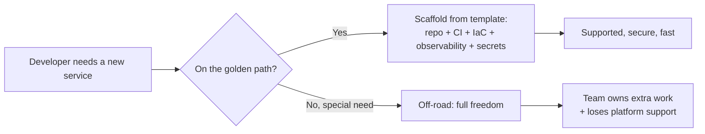
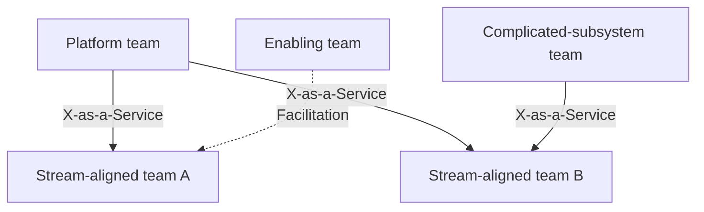

# Platform Engineering & Internal Developer Platforms

**Platform engineering** is the discipline of designing and building an **Internal Developer
Platform (IDP)** — a curated set of self-service tools, workflows, and automation — that reduces
the cognitive load on stream-aligned application teams and gives them **golden paths** to ship
software quickly and safely. It is best understood as the **product-centric evolution of DevOps**:
instead of asking every team to assemble and operate its own CI/CD, IaC, secrets, and runtime
stack, a dedicated **platform team** treats that stack as an internal *product* whose *customers*
are the organization's developers.

The term rose to prominence around 2021–2023 (Team Topologies, the CNCF Platforms Working Group,
Gartner's forecast that 80% of large software orgs would have platform teams by 2026, and the
community site *platformengineering.org*). It does **not** replace DevOps culture — it operationalizes
DevOps's "you build it, you run it" ideal at scale by making the safe path the easy path.

> [!KEY-TAKEAWAY]
> Platform engineering builds a **thinnest-viable internal platform** that offers **self-service
> golden paths** to reduce developer **cognitive load**. The platform is run **as a product**
> (developers are customers, adoption is voluntary, success measured by DevEx). Interviewers probe:
> golden paths vs mandates, IDP vs portal (Backstage), platform team vs SRE vs DevOps, cognitive
> load, and *when* platform engineering is worth it.

This topic is concept-first and cross-references sibling topics: CI/CD tooling, infrastructure-as-code
(Terraform), GitOps (Argo CD/Flux), secrets-management, and SRE/SLO topics all describe the
*components* a platform composes. Kubernetes/Docker internals live in their own domains.

---

## Platform engineering as the evolution of DevOps

**Beginner.** Early DevOps (post-2009) tore down the wall between Dev and Ops: teams were told to
own their full lifecycle ("you build it, you run it"). That works, but as tool sprawl grew
(Kubernetes, Terraform, Helm, CI systems, service meshes, observability stacks), *every* team
having to master *all* of it became unsustainable. Platform engineering is the response: centralize
the undifferentiated heavy lifting into a **reusable platform**, so app teams keep autonomy over
*what* they build without re-inventing *how* to ship it.

**Intermediate.** The distinction from "old-school central IT / ops ticket queues" is critical:

| Dimension | Traditional central Ops | DevOps (every team DIY) | Platform engineering |
|---|---|---|---|
| Delivery model | Ticket → ops does it | Team does everything itself | Self-service platform |
| Coupling | High (bottleneck) | Low but high duplication | Low, shared golden paths |
| Speed | Slow (queue) | Fast but inconsistent | Fast and consistent |
| Cognitive load | On ops | High on every dev | Reduced for app devs |
| Governance | Manual gatekeeping | Ad hoc | Encoded in the paved road |

Platform engineering is *not* a return to gatekeeping. The platform is consumed via API/CLI/UI on
demand — no ticket, no waiting on a human. It removes the trade-off that DevOps created between
"autonomy" and "duplication/overload."

**Advanced / gotchas.** A common anti-pattern is rebranding a legacy ops or "DevOps team" (an
anti-pattern in Team Topologies terms) as a "platform team" while keeping ticket-driven,
gatekeeping behavior — you get a bottleneck with a new name. Real platform engineering requires:
self-service (no humans in the request path), a product mindset, and voluntary adoption. If teams
*must* file a request and wait, it isn't a platform.

> [!INTERVIEW]
> "Isn't platform engineering just DevOps rebranded / a new NoOps ops team?" Answer: it's DevOps
> *scaled* — it keeps the culture (shared ownership, automation) but adds a **product-managed,
> self-service internal platform** so app teams aren't each forced to become Kubernetes/Terraform
> experts. It reduces cognitive load; it does not recreate a gatekeeping silo.

---

## Internal Developer Platform (IDP) and developer portals

**Beginner.** An **Internal Developer Platform (IDP)** is the *whole* self-service layer — the
composition of tooling, automation, templates, IaC modules, pipelines, and runtime that developers
use to build, deploy, and operate services. A **developer portal** (e.g. **Backstage**) is a
*part* of it: the UI/catalog "pane of glass" through which developers discover and interact with the
platform. **Portal ≠ platform** — the portal is a front door; the platform is everything behind it.

**Intermediate — Backstage.** Backstage is an open-source framework for building developer portals,
created at **Spotify** and donated to the **CNCF** (now an incubating project). Its core building
blocks:

- **Software Catalog** — a central registry of all software (services, libraries, pipelines, ML
  models, resources) described by `catalog-info.yaml` entities (Components, APIs, Systems, Resources,
  Groups). Answers "what do we have and who owns it?"
- **Software Templates (Scaffolder)** — parameterized templates that scaffold a new service
  (repo + CI + IaC + on-catalog registration) from a form. This is where golden paths become clickable.
- **TechDocs** — "docs-like-code": Markdown alongside source, rendered in the portal.
- **Plugins** — the extensibility model; integrate CI, Kubernetes, cloud cost, PagerDuty, etc.

A minimal catalog entity:

```yaml
apiVersion: backstage.io/v1alpha1
kind: Component
metadata:
  name: payments-api
  annotations:
    github.com/project-slug: acme/payments-api
    backstage.io/techdocs-ref: dir:.
spec:
  type: service
  lifecycle: production
  owner: team-payments
  system: checkout
```

**Advanced / gotchas.** Backstage is a *framework you assemble*, not a turnkey product — building
and maintaining a portal is itself an engineering investment. The portal is optional: many IDPs
expose golden paths purely via CLI/API/Git (a portal is a discovery/UX convenience, not a
requirement). Reference-architecture-wise, a portal typically sits **on top of** an
**orchestrator/control-plane** layer (e.g. Humanitec, Kratix, Crossplane, or Terraform/Argo behind
the scenes) that actually provisions resources; the portal itself usually doesn't provision.

**Build vs buy vs orchestrator (a common senior follow-up).** Three layers get conflated; separate
them and give a "pick X when Y":

- **Build the portal — Backstage (OSS framework).** Maximum flexibility and no license cost, but you
  pay in *staffing*: a real team to build plugins and ride the **upgrade treadmill** (frequent
  breaking releases). *Pick when* you have platform engineers to invest and unusual needs that SaaS
  can't model.
- **Buy the portal — Port / Cortex / OpsLevel (SaaS).** Fast time-to-value, managed upgrades, opinionated
  scorecards out of the box — but less control and per-seat cost, and your catalog lives in a vendor.
  *Pick when* you want the portal's value in weeks, not quarters, and can live with their model.
- **Orchestrator — Humanitec / Crossplane / Kratix.** A *different layer*: it sits **below** the portal
  and does the actual provisioning (resource graphs, control planes). *Pick when* your hard problem is
  "turn a high-level request into cloud resources consistently," not "give devs a catalog UI." Often you
  pair one with a portal (portal = front door, orchestrator = engine room).

> [!TIP]
> If you can only build one Backstage capability first, build the **Software Catalog + ownership
> metadata** — it's the substrate everything else (scaffolding, TechDocs, scorecards) hangs off,
> and it directly attacks "who owns this and what depends on it?"

---

## Platform as a product

**Beginner.** "**Platform as a product**" means running the internal platform with the same rigor
as a customer-facing product: it has a **product manager**, a **roadmap**, **users** (your
developers), **user research**, and metrics of success. Crucially, **adoption is usually voluntary**
— if the platform is worse than what a team could build itself, teams route around it, and that
signal is the point.

**Intermediate.** Concrete practices:

- **Developers are customers** → interview them, watch them onboard, measure their pain.
- **Voluntary adoption / "pull, not push"** → win users by being genuinely better, not by mandate.
- **Treat the platform's reliability as a product SLA** → the platform itself needs SLOs (see
  sre-sla-slo-sli-reliability).
- **Thinnest Viable Platform (TVP)** → start with the smallest thing that helps (even a well-curated
  wiki page of paved-road defaults), then grow based on demand — not a big-bang platform.

**Advanced / gotchas.** The most common failure is a **"build it and they will come"** platform:
engineers build what they *think* is cool with no user research, then wonder why adoption stalls.
Symptoms: no PM, no feedback loop, success measured by features shipped rather than developer
outcomes, mandatory adoption masking a bad product. Because adoption is voluntary, **DevEx metrics
and adoption rate are the north-star KPIs**, not lines of Terraform written.

> [!WARNING]
> Mandating platform use to force adoption hides the truth. If teams only use the platform because
> they're required to, you've lost the feedback signal that tells you whether it's actually good.
> Fix the product; don't mandate around a weak one.

---

## Golden paths and paved roads

**Beginner.** A **golden path** (Spotify's term; Netflix calls it the **paved road**) is an
**opinionated, well-supported, documented, end-to-end route** to building and running a common kind
of software — e.g. "here's how you create a Java REST service: this template, this CI, this deploy
target, these defaults, and we support it." It's the easy, blessed way.

**Intermediate — the core principle: the golden path is *supported*, not *mandatory*.** Teams may
step off it, but then they own the extra work and lose platform support. This preserves autonomy
while nudging the majority onto a consistent, secure, maintained path. Contrast:

| | Golden path / paved road | Mandate / lockdown |
|---|---|---|
| Nature | Opinionated default, supported | Enforced, only option |
| Off-road allowed? | Yes, but you own the consequences | No (or heavy exception process) |
| Adoption driver | It's genuinely easier | Compliance / policy |
| Effect on autonomy | Preserved | Reduced |

Golden paths bake in good defaults for security, observability, deployment strategy, and cost — so
following the path *automatically* gives you SAST scanning, secrets injection via Vault/OIDC, an SLO
dashboard, and a safe rollout. That's how governance becomes a byproduct of convenience ("compliance
by construction") rather than a gate.

**Advanced / gotchas.** Too *few* paths ⇒ they don't fit real needs and teams go off-road (platform
irrelevant). Too *many* ⇒ maintenance explosion and choice paralysis (the whole point was to reduce
choices). Golden paths must be **maintained and version-upgraded** by the platform team — an
abandoned, stale path is worse than none because it erodes trust. Netflix's paved road explicitly
allows leaving it, but off-road teams forfeit paved-road support and tooling.



---

## Self-service infrastructure and scaffolding

**Beginner.** The engine of an IDP is **self-service**: a developer requests what they need
(a new service, a database, an environment) through a **template/form/CLI/API/Git commit**, and
automation provisions it — **no ticket, no waiting on a human**. Under the hood this is usually
**IaC** (Terraform modules, Helm charts, Kustomize) wrapped behind an interface so the developer
doesn't hand-write HCL.

**Intermediate.** Typical mechanisms:

- **Scaffolding / templating** — a template generates a new repo pre-wired with CI, Dockerfile,
  IaC, and catalog registration (Backstage Scaffolder, `cookiecutter`, Cookiecutter-style generators).
- **Curated IaC modules** — the platform publishes versioned, opinionated Terraform modules; app
  teams consume them instead of writing raw resources:

  ```hcl
  module "service" {
    source  = "app.terraform.io/acme/paved-service/aws"
    version = "3.2.0"
    name        = "payments-api"
    team        = "team-payments"
    cpu         = 512
    enable_slo_dashboard = true   # good defaults baked in
  }
  ```

- **Control plane / orchestration** — tools like Crossplane, Kratix, or Humanitec expose
  higher-level abstractions ("give me a Postgres") that map to cloud resources, often reconciled
  GitOps-style (see the gitops topic).

**Worked example — one trip down the golden path.** Follow what actually happens, artifact by
artifact, when a developer creates a new service. Say they open the Backstage portal and fill the
scaffolder form: `name=payments-api`, `team=payments`, `template=java-rest-service`. Click *Create*:

1. **Scaffolder renders the template** → creates a new GitHub repo `acme/payments-api` from
   `java-rest-service`, substituting the form values into every templated file.
2. **Repo is committed with the paved-road wiring already inside it:**
   - `.github/workflows/ci.yaml` — build + unit tests + SAST scan + container publish (the CI golden path).
   - `Dockerfile` — hardened base image, non-root user.
   - `terraform/main.tf` — calls the `paved-service` module (`cpu=512`, `enable_slo_dashboard=true`).
   - `catalog-info.yaml` — the Component entity with `owner: team-payments`, `system: checkout`.
3. **Scaffolder registers `catalog-info.yaml`** in the Software Catalog → the service is now
   discoverable and its ownership is known.
4. **Argo CD sees the new Terraform/manifests in Git and syncs them** (GitOps) → the AWS resources
   (ECS/EKS service, load balancer, IAM role) get provisioned from the module.
5. **Because the module set `enable_slo_dashboard=true` and requested Vault access**, the reconcile
   also produces: a **Grafana SLO dashboard** for `payments-api` and a **Vault secret path**
   `secret/payments/payments-api` wired to the service's OIDC identity.

Elapsed developer effort: **one form, zero tickets, no hand-written HCL.** What they *received*: a
running repo, CI, container, cloud infra, observability, and secrets — all on supported, consistent
defaults. That last-mile bundle ("secure + observable + deployable by default") is the golden path;
everything the dev *didn't* have to learn (K8s, Terraform state, Vault policy) is the extraneous
cognitive load the platform absorbed.

**Advanced / gotchas.** Self-service without **guardrails** becomes a foot-gun (teams provision
oversized/insecure/expensive resources). Guardrails = policy-as-code (OPA/Conftest, Sentinel),
sane module defaults, quotas, and cost visibility — enforced *in the paved road* so they don't slow
the happy path. The key design tension: expose enough parameters to be useful, but not so many that
the abstraction leaks the full complexity (see *Abstraction without hiding too much*). "Self-service"
is the defining test of a real platform — if a human must approve/execute each request, it's a
service desk, not a platform.

---

## Developer experience (DevEx) metrics

**Beginner.** Because the platform is a product for developers, you measure **developer experience
(DevEx)**: how fast, easy, and pleasant it is to build and ship. Good DevEx → faster delivery,
higher retention, less burnout. You measure it with a mix of **system metrics** (objective) and
**perceptual metrics** (surveys of how developers *feel*).

**Intermediate — two complementary frameworks:**

- **DORA / the Four Keys** (from the *Accelerate*/DORA research) — outcome metrics for delivery
  performance, useful to show the platform is working:
  1. **Deployment frequency**
  2. **Lead time for changes** (commit → production)
  3. **Change failure rate** (% of deploys causing a failure)
  4. **Failed deployment recovery time** (formerly MTTR / time to restore) — the 2023/2024 DORA
     reports also add **reliability** as a fifth focus.
- **SPACE framework** (Forsgren et al.) — a *multidimensional* view of productivity so you don't
  optimize a single number: **S**atisfaction & well-being, **P**erformance, **A**ctivity,
  **C**ommunication & collaboration, **E**fficiency & flow. SPACE's point: pick metrics from
  *several* dimensions and combine perceptual + system data.

Platform-specific signals: **time-to-first-deploy for a new hire/service**, **onboarding time**,
**self-service adoption rate**, **frequency of interruptions**, **build/CI wait times**.

**Worked example — classifying a team with DORA.** DORA buckets teams into four performance
clusters. The exact thresholds drift a little year to year, but the rough anchors are:

| Metric | Elite | High | Medium | Low |
|---|---|---|---|---|
| Deployment frequency | On-demand (multiple/day) | Daily → weekly | Weekly → monthly | < once/month |
| Lead time for changes | < 1 day | 1 day → 1 week | 1 week → 1 month | > 1 month |
| Change failure rate | 0–15% | 16–30% | 16–30% | > 30% |
| Failed-deploy recovery | < 1 hour | < 1 day | 1 day → 1 week | > 1 week |

Now take a hypothetical team: **deploys 30× per week, commit-to-prod median 4h, 1 of every 20
deploys fails, mean restore 45 min.** Plug each number in:

- **Deployment frequency:** 30/week ÷ 7 ≈ **4.3 deploys/day** → multiple per day → **Elite**.
- **Lead time:** 4h < 24h → under a day → **Elite** (it's near the Elite/High edge — an hour-scale
  lead time is comfortably Elite, a multi-day one would drop to High).
- **Change failure rate:** 1 ÷ 20 = **5%**, inside the 0–15% band → **Elite**.
- **Failed-deploy recovery:** 45 min < 60 min → **Elite**.

All four land in Elite, so this is an **Elite performer**. Note CFR is a *ratio of deploys that
break*, not a count — the same 1 failure against 5 weekly deploys would be 20% (High/Medium), so
deploying *more often* can actually improve CFR by shrinking each change.

**Advanced / gotchas.** Beware **single-metric gaming** — e.g. optimizing deployment *frequency*
alone encourages tiny meaningless deploys; measuring individual **activity** (commits, PRs) as
"productivity" is famously misleading and harmful. DORA metrics are *team/system* metrics, **not
individual performance metrics**. The DevEx paper (Noda, Storey, Forsgren, et al., 2023) stresses
three DevEx dimensions — **flow state, feedback loops, and cognitive load** — and that **perceptual
(survey) data is essential** because system metrics alone miss friction developers actually feel.

> [!WARNING]
> Never use DORA or SPACE metrics to rank or evaluate *individual* developers. They're designed for
> team-level and system-level improvement; weaponizing them against individuals destroys the trust
> the data depends on and drives gaming.

---

## Team Topologies and platform teams

**Beginner.** *Team Topologies* (Matthew Skelton & Manuel Pais, 2019) gives the organizational
vocabulary platform engineering leans on. It defines **four fundamental team types** and **three
interaction modes**.

**Four team types:**

| Team type | Purpose |
|---|---|
| **Stream-aligned** | Aligned to a single value stream / product / user segment; owns delivery end-to-end. The primary, most common team type. |
| **Platform** | Provides an internal platform *as a service* to reduce cognitive load for stream-aligned teams. |
| **Enabling** | Coaches/helps stream-aligned teams adopt new skills/tech; temporary, mentoring role. |
| **Complicated-subsystem** | Owns a part needing deep specialist expertise (e.g. a video codec, ML ranking, an options-pricing engine). |

**Three interaction modes:**

- **Collaboration** — two teams work closely together for a bounded time to discover something new
  (high bandwidth, high cost; use sparingly).
- **X-as-a-Service** — one team consumes something another provides "as a service" with minimal
  interaction. **This is the target mode for a platform team ↔ stream-aligned teams.**
- **Facilitation** — one team (usually enabling) helps another remove obstacles / learn.

**Intermediate.** A platform team should mostly operate in **X-as-a-Service** mode: stream-aligned
teams self-serve with minimal coordination. Early on, a platform team may briefly **collaborate**
with a pilot team to co-design, then transition to X-as-a-Service once the interface stabilizes.
An **enabling** team is *not* the platform — it teaches skills and moves on; it doesn't run a service.

**Advanced / gotchas.** The book explicitly names anti-patterns: a **"DevOps team"** or **"tools
team"** that becomes a silo/bottleneck, or a platform team stuck in permanent **collaboration**
(never graduating to as-a-service) so it becomes a shared dependency everyone waits on. The right
platform is **as thin as possible** and consumed with minimal cognitive overhead. A common exam trap:
confusing *enabling* (temporary coaching) with *platform* (durable as-a-service product).



---

## When platform engineering makes sense

**Beginner.** Platform engineering has real cost (a dedicated team, ongoing maintenance). It pays
off at **scale**, not on day one. A 3-person startup with one service does **not** need an IDP — it
needs to ship product. Building a platform prematurely is over-engineering.

**Intermediate — signals it's time:**

- Many teams **duplicating** the same CI/CD, Terraform, deploy, and observability plumbing.
- Developers spending large fractions of time on undifferentiated ops instead of features.
- Inconsistent security/compliance because every team does it differently.
- Slow onboarding; long time-to-first-deploy for new services/hires.
- Enough engineers that a platform team's cost amortizes (rough rule of thumb: dozens of
  developers / many teams — Gartner and community guidance often cite the ~tens-of-engineers range;
  there's no hard universal number).

**Worked example — justifying the headcount (rough ROI).** Interviewers push on "how do you justify
a platform team's cost?" Do the toil arithmetic. Suppose **8 stream-aligned teams each burn ~1
engineer-month/year** re-inventing and maintaining the *same* CI, Terraform, and observability
plumbing. Duplicated toil = 8 × 1 = **8 engineer-months/year** of undifferentiated work. A
**3-person platform team costs ~36 engineer-months/year**. Naively that looks like a loss (8 saved
vs 36 spent) — which is exactly why platform teams don't pay off at small scale. Now scale to **30
teams**: duplicated toil = **30 engineer-months/year**, still shy of 36 but close, and the platform
*also* buys consistency (security, faster onboarding, fewer incidents) that the raw toil number
undercounts. The break-even flips clearly once the saved toil plus those second-order gains exceed
the team's cost — typically in the **tens of teams** range. The honest framing: *the platform is
justified once (duplicated toil eliminated + consistency/onboarding value) > platform team cost*,
which is why it's a scale play, not a day-one one.

**Migrating existing teams (the "too late" case).** When you already have snowflake infra, don't
force-migrate. Instead: (1) **pilot with 1–2 willing teams** to prove the golden path and harden it;
(2) provide a **migration path / codemod** so moving is cheap (scripts that convert their existing
setup onto the paved module); (3) **pull, don't push** — let teams adopt because the DevEx is
genuinely better, and leave the gnarliest snowflakes for last rather than mandating a big-bang cutover.

**Advanced / gotchas.** Start with a **Thinnest Viable Platform**, seed it from a real, painful,
repeated need (not speculation), and grow by demand. Two failure modes bracket the decision:
(1) **too early** — a platform team polishing tooling nobody needs while the business starves for
features; (2) **too late** — years of accumulated per-team snowflake infra that's now expensive to
converge. The honest interview answer: "It depends on scale and pain — measure duplication and
developer toil first; don't build a platform because it's fashionable (Gartner hype ≠ your need)."

> [!INTERVIEW]
> If asked "should this company do platform engineering?", never answer a flat yes. Ask about number
> of teams, duplication, developer toil, and onboarding time. Recommend a **thinnest viable platform**
> seeded from the single most-duplicated pain point, run as a product, and grown by demand.

---

## Platform engineering vs SRE vs DevOps

**Beginner.** These overlap but answer different questions:

| | Primary focus | Deliverable | Customer |
|---|---|---|---|
| **DevOps** | Culture & practices: break Dev/Ops silos, automate, shared ownership | Ways of working, CI/CD, automation | The whole org |
| **SRE** | **Reliability** of running systems via engineering (SLOs, error budgets, toil reduction) | Reliability, on-call, SLOs | The service & its users |
| **Platform engineering** | **Developer experience / self-service** at scale | An Internal Developer Platform (product) | Internal developers |

**Intermediate.** DevOps is a *philosophy/culture*; SRE is Google's *prescriptive implementation*
of reliability engineering; platform engineering is a *product discipline* that packages capabilities
for self-service. They're complementary: a platform team often *productizes* SRE and DevOps
practices (e.g. golden paths that ship an SLO dashboard and safe deploy strategy by default). SRE
focuses on **run-time reliability and error budgets** (see sre-sla-slo-sli-reliability); platform
engineering focuses on **the developer's build-and-ship experience**.

**Advanced / gotchas.** They can conflict or blur: a platform team is *not* automatically responsible
for the reliability of every app it hosts — ownership should stay with the stream-aligned team
("you build it, you run it"), while the platform provides the *means* to run it well. A frequent
confusion: treating the platform team as "the SRE/ops team that gets paged for everyone." Better: the
platform team runs *the platform* reliably (its own SLOs), and enables app teams to run *their*
services reliably.

---

## Cognitive load and "you build it, you run it"

**Beginner.** **Cognitive load** is the total mental effort a team must expend. Team Topologies
(borrowing from Sweller) distinguishes **intrinsic** (the inherent difficulty of the domain),
**extraneous** (accidental complexity from tools/process/environment), and **germane** (effort spent
learning the value-adding domain). The platform's job is to **minimize extraneous load** so teams
can spend their limited cognitive budget on the germane, business-differentiating work.

**Worked example — bucketing a payments team's load.** The three types blur unless you tag a real
team's day. Take the `payments` team and sort what they spend mental effort on:

- **Intrinsic** (inherent to the domain, *cannot* be removed): payment/ledger correctness rules,
  idempotency of charges, double-entry accounting, PCI-scope reasoning. Hard because payments are
  hard.
- **Germane** (effort that *builds* the valuable expertise): learning the fraud-scoring model,
  reasoning about chargeback flows. This is the "good" load — it's the team getting better at the
  thing that differentiates the business.
- **Extraneous** (accidental, tool/process friction — the "bad" load): hand-writing raw Kubernetes
  manifests, wiring a CI pipeline from scratch, managing Terraform state files, configuring Vault
  policies.

The platform can only delete the **extraneous** bucket — the golden path hands them CI, manifests,
IaC, and secrets pre-wired (see the trip-down-the-golden-path trace above). It **cannot** touch the
intrinsic ledger complexity, and it shouldn't try to remove germane load (that's the team learning
its own domain). So "reduce cognitive load" precisely means *shrink the extraneous slice*, freeing
the team's fixed budget for the intrinsic + germane work only they can do. The classic student error
is filing "learning fraud-scoring" as extraneous — it isn't; it's germane, and off-loading it would
hollow out the team.

**Intermediate.** "You build it, you run it" (Werner Vogels, Amazon) made teams own their whole
lifecycle — great for accountability and feedback, but it dumped enormous *extraneous* load on every
team (learn Kubernetes, Terraform, CI, secrets, networking, observability…). The platform resolves
the tension: teams **still** run what they build, but on top of a platform that removes the
undifferentiated complexity. So the answer to "does platform engineering kill 'you build it, you run
it'?" is **no — it makes it sustainable** by lowering the extraneous load that made full ownership
crushing.

**Advanced / gotchas.** A team should own a **domain small enough that its total cognitive load
fits** — Team Topologies advises limiting the number of domains per team by their complexity. The
platform can *reduce extraneous* load but can't remove *intrinsic* domain complexity. Beware
"solving" cognitive load by re-centralizing ops (a bottleneck) — the goal is to *shift* extraneous
load onto a self-service platform, not to take ownership away from teams.

> [!KEY-TAKEAWAY]
> The platform's core value proposition, in one sentence: **reduce extraneous cognitive load via
> self-service golden paths, so stream-aligned teams keep end-to-end ownership without being crushed
> by tool sprawl.**

---

## Abstraction without hiding too much

**Beginner.** A platform abstracts complexity — but a good abstraction **hides the boring/repetitive
parts while still letting experts get underneath when they need to.** Abstractions that hide *too*
much become opaque black boxes: when something breaks, no one can debug it, and teams distrust and
abandon the platform.

**Intermediate.** Design principles:

- **Leaky-abstraction awareness** (Joel Spolsky's "Law of Leaky Abstractions"): all non-trivial
  abstractions leak; when they do, users need an escape hatch and enough understanding to cope.
- **Provide escape hatches / "eject" ramps** — the paved road covers 80%; make the off-road path
  possible (raw Terraform, custom manifests) without punishing debuggability.
- **Progressive disclosure** — sensible defaults up front, advanced knobs available when needed.
- **Golden path, not golden cage** — an abstraction so rigid it can't accommodate real needs pushes
  teams off the platform entirely.

**Advanced / gotchas.** Two failure modes bracket the sweet spot:
(1) **Over-abstraction** — a black-box "deploy" button whose failures are undebuggable and whose
constraints don't fit real apps; teams lose trust.
(2) **Under-abstraction** — the platform exposes the full complexity (raw K8s + raw Terraform),
providing little value over doing it yourself.
The target is the **thinnest viable platform** that hides *extraneous* complexity while keeping the
system observable and the escape hatch open. Rule of thumb: if an on-platform incident can only be
resolved by the platform team, the abstraction is too opaque.

> [!WARNING]
> The worst platform abstraction is one that works until it doesn't, then gives the app team no way
> to see inside or route around it. Always ship an escape hatch and enough transparency to debug.

---

## Common follow-up questions

- **"Is platform engineering just DevOps/NoOps rebranded?"** No — it keeps DevOps culture but adds a
  product-managed, self-service internal platform to scale it and cut cognitive load. It is not a
  return to gatekeeping ops.
- **"Portal vs platform — what's the difference?"** The portal (e.g. Backstage) is the UI/catalog
  front door; the platform (IDP) is the entire self-service capability behind it. You can have an IDP
  with no portal.
- **"How do you know your platform is succeeding?"** Voluntary adoption rate + DevEx/DORA/SPACE
  outcomes (lead time, deploy frequency, time-to-first-deploy, developer-reported friction) — not
  features shipped.
- **"Should golden paths be mandatory?"** Generally no — supported-but-optional. Mandates hide the
  adoption signal; make the safe path the easy path so teams choose it.
- **"When is it too early?"** When you have few teams and little duplication — build product, not a
  platform. Start with a thinnest viable platform seeded from real, repeated pain.
- **"Platform team vs SRE team?"** Platform = developer self-service product (X-as-a-Service); SRE =
  reliability engineering (SLOs/error budgets). They complement; the platform can productize SRE
  practices.
- **"How do you avoid the platform team becoming a bottleneck?"** Self-service (no humans in the
  request path), X-as-a-Service interaction mode, escape hatches, and a product-managed roadmap.

## References

- Matthew Skelton & Manuel Pais, *Team Topologies* (2019); teamtopologies.com — four team types,
  three interaction modes, cognitive load.
- Backstage documentation — backstage.io (Software Catalog, Software Templates/Scaffolder, TechDocs,
  Plugins); created at Spotify, CNCF project.
- CNCF Platforms Working Group, *Platforms White Paper* (tag-app-delivery); *Platform Engineering
  Maturity Model*.
- platformengineering.org and Humanitec resources — Internal Developer Platform, thinnest viable
  platform, self-service.
- Forsgren, Humble, Kim, *Accelerate* (2018) and annual DORA *State of DevOps* reports — the four
  key metrics.
- Forsgren, Storey, Maddila, Zimmermann, Houck, Butler, *The SPACE of Developer Productivity* (2021).
- Noda, Storey, Forsgren, Greiler, *DevEx: What Actually Drives Productivity* (ACM Queue, 2023) —
  flow, feedback loops, cognitive load.
- Spotify Engineering, "How We Use Golden Paths"; Netflix, "The Paved Road."
- Joel Spolsky, "The Law of Leaky Abstractions" (2002).
- Werner Vogels, "You build it, you run it" (ACM Queue interview, 2006).
