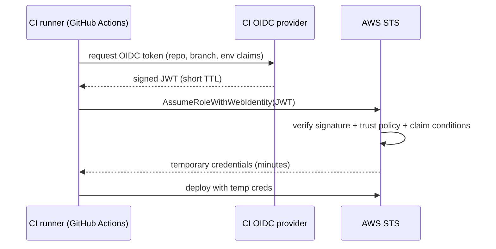
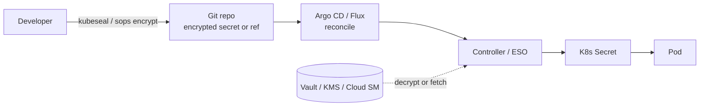

# Secrets Management (in Deploys & Pipelines)

> A **secret** is any credential that grants access to a system: API keys, database passwords,
> TLS private keys, cloud access keys, OAuth client secrets, SSH keys, signing keys. This topic is
> about the **delivery/operations** view: how secrets flow *through* your CI/CD pipeline and *into*
> your running deployments without ever being committed to git, baked into an image, or left lying
> around as a long-lived cloud key. The **cryptography and key-lifecycle theory** (KMS internals,
> envelope encryption, HSMs, key rotation math, OWASP secret-storage rules) lives in the dedicated
> **security** domain's `secrets-management-and-key-lifecycle` topic — here we point to it and focus
> on the *pipeline plumbing*.

> [!KEY-TAKEAWAY]
> Three principles carry almost every interview answer: **(1) never store a secret in code or git**
> — reference it from a store at deploy/runtime; **(2) prefer short-lived, dynamically-issued
> credentials over long-lived static ones** — Vault dynamic secrets and OIDC federation eliminate
> the standing key an attacker can steal; **(3) scope to least privilege and make rotation cheap**
> so a leak is a shrug, not an incident.

> [!INTERVIEW]
> Interviewers probe the **secret-zero problem** ("if secrets live in Vault, what secret does the
> app use to authenticate *to* Vault?") and the **GitOps paradox** ("GitOps wants everything in git
> — how do you put secrets in git safely?"). Have crisp answers: platform-issued workload identity
> (OIDC/instance identity) for secret-zero; and *encrypted* secrets (SOPS/Sealed Secrets) or
> *references* (External Secrets Operator) for GitOps. Also expect "a secret leaked in git history —
> what do you do?" The correct first move is **rotate**, not `git rm`.

Cross-references: **pipeline security scanners** (SAST/DAST/SCA/secret-scanning as a *gate*) are in
`devsecops-and-pipeline-security`; **artifact/image signing and provenance** are in
`software-supply-chain-security`; **GitOps reconciliation mechanics** are in `gitops`; **KMS/crypto
theory** is in the security domain.

---

## Why secrets never belong in code or git

The cardinal rule: **secrets must never be committed to source control or hard-coded in
application code.** This is [12-Factor App](https://12factor.net/config) factor III — *store config
in the environment* — and it separates code (public, versioned, shared) from credentials (sensitive,
per-environment, rotatable).

Why git specifically is dangerous:

- **Git history is permanent and distributed.** Deleting a secret in a later commit does **not**
  remove it — it stays in every clone, every fork, every CI cache, and every packed object. Anyone
  with repo access (or a leaked mirror) can `git log -p` and read it. "I removed it in the next
  commit" is a wrong answer.
- **Repos leak.** A private repo becomes public by accident; a laptop is stolen; a fork escapes.
  Public secret-scanning bots crawl new GitHub commits within *seconds* — leaked AWS keys are
  routinely abused for cryptomining minutes after a push.
- **Blast radius.** One committed key often has broad, long-lived privileges, so a single leak can
  compromise an entire account.

What to do instead: keep secrets in a **secret store** (Vault, cloud secret manager) or inject them
as **environment/config at deploy time**, and keep only a *reference* (a path or name) in code.
Detect accidents with **secret scanning** (`gitleaks`, `trufflehog`, GitHub push protection) in
pre-commit hooks and CI.

> [!WARNING]
> If a secret ever touches git history, **rotating (invalidating) the secret is mandatory** — history
> rewriting (`git filter-repo`/BFG) is cleanup, not remediation. Assume it is compromised the moment
> it is pushed.

## CI/CD secret injection and masked variables

Pipelines need secrets to build, test, and deploy (registry passwords, deploy tokens, cloud creds).
Every CI system provides an **encrypted secret store** whose values are injected as **environment
variables or files** into jobs at runtime and **masked** in logs:

- **GitHub Actions** — repo/org/environment **Secrets** exposed via `${{ secrets.NAME }}`; values are
  automatically masked (replaced with `***`) in logs.
- **GitLab CI** — **CI/CD variables** with **Masked** and **Protected** flags; protected variables
  are only exposed to jobs running on protected branches/tags.
- **Jenkins** — the **Credentials** plugin store; injected via `withCredentials` / credential
  bindings, masked in console output.

```yaml
# GitHub Actions: inject a secret as an env var, use in a step
jobs:
  deploy:
    runs-on: ubuntu-latest
    environment: production          # gated environment (reviewers/rules)
    steps:
      - run: ./deploy.sh
        env:
          DB_PASSWORD: ${{ secrets.DB_PASSWORD }}   # masked in logs
```

Key protections and gotchas:

- **Masking is best-effort, not a guarantee.** CI masks *exact* string matches. If your script
  `base64`-encodes, splits, or transforms the secret and echoes it, the masked pattern no longer
  matches and it prints in cleartext. Never `echo` a secret.
- **Environments/scopes.** Bind production secrets to a **protected environment** (GitHub) or
  **protected variable** (GitLab) so they are unavailable to jobs from untrusted branches or forks.
- **`pull_request` from forks gets no secrets by default** in GitHub Actions — a deliberate defense
  so a malicious PR cannot exfiltrate them. `pull_request_target` runs with secrets in the base repo
  context and is a classic exfiltration footgun if you check out and run untrusted PR code.
- **CI is a production system.** Whoever controls the runner can read every secret it can access, so
  runner isolation and least-privilege scoping matter as much as the store.

## OIDC federation to the cloud (no stored long-lived keys)

The best CI secret is **no stored secret at all.** Instead of saving a long-lived cloud access key
in CI variables, use **OIDC (OpenID Connect) federation**: the CI provider issues a **short-lived,
signed JWT** describing the workflow (repo, branch, environment); the cloud provider is configured to
**trust** that issuer and exchange the token for **temporary credentials** scoped to a role.



```yaml
# GitHub Actions -> AWS via OIDC: no stored AWS keys
permissions:
  id-token: write        # allow the workflow to mint an OIDC token
  contents: read
steps:
  - uses: aws-actions/configure-aws-credentials@v4
    with:
      role-to-assume: arn:aws:iam::123456789012:role/deploy-role
      aws-region: us-east-1     # exchanges OIDC token for temp STS creds
```

Why this is the modern default:

- **No long-lived key to leak, store, or rotate.** Credentials live for minutes and are scoped to
  the job.
- **Fine-grained trust.** The cloud trust policy pins claims — e.g. only `repo:org/name` on
  `ref:refs/heads/main` or a specific `environment` — so a fork or feature branch cannot assume the
  role.
- Works across GitHub Actions, GitLab CI, and others to AWS, GCP, and Azure. **Pitfall:** a lax trust
  condition (e.g. wildcarding the `sub` claim or trusting `*`) lets *any* repo assume your role — the
  condition must pin org/repo and ideally branch/environment.

## HashiCorp Vault and dynamic secrets

**HashiCorp Vault** is a dedicated secrets-management system. Beyond storing static key/value
secrets (the KV engine), its distinguishing feature is **dynamic secrets**: Vault **generates
credentials on demand** for a backend (database, cloud, PKI) and **leases** them with a TTL, then
**automatically revokes** them when the lease expires or is revoked.

- **Static secret:** you store a DB password in Vault; every app reads the same shared, long-lived
  password.
- **Dynamic secret:** the app asks Vault for DB access; Vault **creates a brand-new DB user** with a
  short TTL, hands it over, and **deletes that user** when the lease ends. Each consumer gets unique,
  short-lived, individually-revocable credentials — a leak is contained and auto-expiring.

Core Vault concepts:

- **Secrets engines** — pluggable backends (`kv`, `database`, `aws`, `pki`, `transit`). The `transit`
  engine does **encryption-as-a-service** (Vault encrypts/decrypts without ever storing the data).
- **Leasing & TTL** — dynamic secrets carry a lease; clients renew or let them expire. Revocation is
  first-class (revoke a lease → the underlying credential is destroyed).
- **Auth methods** — how a client proves identity to get a token (AppRole, Kubernetes, cloud IAM,
  OIDC/JWT). This is where the **secret-zero** problem is solved (see below).
- **Policies** — path-based ACLs granting least-privilege access to specific secret paths.
- **Seal/unseal** — Vault storage is encrypted; the master key is protected by Shamir key shares or
  auto-unseal via a cloud KMS.

> [!TIP]
> The interview one-liner: **"dynamic secrets turn a standing, shared, long-lived credential into a
> per-client, short-lived, auto-revoked one"** — that is Vault's headline value over a plain
> encrypted KV store.

## Cloud-native secret managers

The major clouds offer managed secret stores that integrate with their IAM and KMS:

| Service | Cloud | Notable features |
|---|---|---|
| **Secrets Manager** | AWS | Built-in **automatic rotation** via Lambda; KMS-encrypted; versioned |
| **SSM Parameter Store** | AWS | Cheaper KV; `SecureString` KMS-encrypted; no built-in rotation |
| **Secret Manager** | GCP | Versioned secrets; IAM-scoped; CMEK support |
| **Key Vault** | Azure | Secrets + keys + certs; managed-identity access |

Trade-offs vs Vault:

- **Pros:** zero infrastructure to run, native IAM integration, KMS-backed encryption, and (for AWS
  Secrets Manager) built-in scheduled **rotation**.
- **Cons:** mostly **static** secrets (Secrets Manager rotation replaces a stored value on a
  schedule; it is not the same as Vault's per-request dynamic generation), cloud lock-in, and less
  flexible engines (no general dynamic-DB-user or `transit` equivalent out of the box).
- **Access is by workload identity**, not a stored key: an EC2 instance role, EKS IRSA, or Lambda
  execution role calls `GetSecretValue` — again solving secret-zero via platform identity.

## Kubernetes Secrets and their limitations

A Kubernetes **Secret** is a namespaced object holding key/value data, consumed by pods as **env
vars** or mounted **files (volumes)**. The critical thing to know for interviews:

- **Kubernetes Secrets are only base64-encoded, NOT encrypted, by default.** `base64` is encoding,
  not encryption — `echo <value> | base64 -d` reveals it. Stored in **etcd**, they are at rest in
  whatever protection etcd has.
- Enable **encryption at rest for etcd** (an `EncryptionConfiguration`, ideally with a KMS provider)
  so Secrets are actually encrypted on disk.
- **RBAC matters:** anyone who can `get`/`list` Secrets in a namespace (or read etcd, or exec into a
  pod) can read them. Scope RBAC tightly.
- Prefer **mounted files over env vars** for sensitive values: env vars can leak via child-process
  environments, crash dumps, and `/proc`, and are harder to rotate live.

```yaml
# Secret data is base64-encoded, not encrypted
apiVersion: v1
kind: Secret
metadata: { name: db-creds }
type: Opaque
data:
  password: c3VwZXJzZWNyZXQ=      # base64("supersecret") — trivially decoded
```

Because raw Secrets are weak and can't safely live in git, teams layer on the GitOps patterns below,
or pull from an external store at runtime (External Secrets Operator, Vault Agent/CSI, Secrets Store
CSI driver).

## Encrypted secrets in git for GitOps (SOPS, Sealed Secrets, External Secrets)

**GitOps** (see the `gitops` topic) declares *everything* in git as the source of truth — but you
can't commit a plaintext Kubernetes Secret. Three established patterns resolve the paradox:

- **SOPS (Mozilla `sops`)** — encrypts *the values* of a YAML/JSON file (keys stay readable) using a
  KMS key (AWS KMS, GCP KMS, Azure, age, or PGP). The **encrypted** file is committed; the cluster
  (via the Flux SOPS integration or a decrypt step) decrypts using the KMS key it's allowed to use.
  Editing is done with `sops` so it never sits in plaintext on disk.
- **Sealed Secrets (Bitnami)** — a cluster-side **controller** holds a private key; you encrypt with
  `kubeseal` using the public key to produce a `SealedSecret` CRD that is **safe to commit**. **Only
  that specific controller can decrypt it** into a real `Secret`. Encryption is one-way from the
  developer's side and cluster-scoped by default.
- **External Secrets Operator (ESO)** — you commit **no ciphertext at all**, only an
  `ExternalSecret` **reference** that names a secret in an external store (Vault, AWS/GCP/Azure). The
  operator fetches the value and **materializes a native `Secret`**, keeping it in sync. Git holds
  only the pointer.

| Pattern | What's in git | Who can decrypt | Rotation source of truth |
|---|---|---|---|
| **SOPS** | ciphertext (values encrypted) | anyone with the KMS/age/PGP key | git commit |
| **Sealed Secrets** | ciphertext (`SealedSecret` CRD) | only the cluster controller's private key | git commit |
| **External Secrets** | a *reference*, no ciphertext | whoever the operator's identity allows | the external store |



> [!TIP]
> Rule of thumb: **ESO** if you already run a real secret store and want *rotation at the store* +
> nothing sensitive in git; **Sealed Secrets** for a simple, self-contained cluster with no external
> store; **SOPS** when you want secrets versioned *with* the manifests and are comfortable managing
> KMS-key access.

## Secret rotation without redeploy

**Rotation** is periodically replacing a credential with a new value; the goal is that a stolen
secret has a short useful life. The hard part in deploys is rotating **without downtime or a full
redeploy**:

- **Naive rotation** bakes the secret into config at deploy time, so rotating means editing config
  and redeploying every consumer — slow, and the old secret stays valid until the last pod restarts.
- **Rotation without redeploy** decouples the *value* from the *deployment*:
  - Apps **fetch the secret at runtime** from a store and **re-read on a TTL / on lease renewal**
    (Vault dynamic secrets and agent templating do this natively — the credential rotates under the
    app), or subscribe to change notifications.
  - **Sidecar/agent injection** (Vault Agent, Vault CSI, Secrets Store CSI driver) updates the mounted
    file when the source changes; the app watches the file and reloads.
  - **Dual/overlapping validity (two active versions):** issue the new secret while the old still
    works, roll consumers over, then revoke the old. This avoids a window where nobody has a valid
    credential — essential for zero-downtime rotation. (AWS Secrets Manager rotation uses `AWSCURRENT`
    / `AWSPENDING` staging labels for exactly this.)
- **Mounted files rotate more gracefully than env vars**: an env var is fixed for the process
  lifetime (you must restart the process to change it), while a mounted file can be updated in place
  and re-read.

> [!WARNING]
> Rotating a secret in the store does nothing if consumers cached it at startup as an env var. Design
> for rotation *up front* (runtime fetch + reload, or short leases) — retrofitting it after an
> incident is painful.

## Least-privilege access and scoping

**Least privilege** (a core security principle) applied to secrets: every human, service, and
pipeline gets access to **only the specific secrets it needs, for the minimum time, with the minimum
verbs.** In practice:

- **Scope by path/namespace/environment.** Vault policies grant a service read on
  `secret/data/app-x/*` only; a K8s ServiceAccount reads Secrets only in its namespace; prod secrets
  bind to a protected environment.
- **Separate identities per workload/pipeline stage.** The build job that pushes an image and the
  deploy job that assumes a cloud role should have **different, narrowly-scoped identities**, not one
  shared admin credential.
- **Short TTLs + revocation** shrink the exposure window; audit logs (Vault audit device, cloud
  CloudTrail) record who read what.
- **Read-only where possible** — a service that only *consumes* a DB password never needs write to
  the secret store.

The payoff: least privilege limits **blast radius** — a compromised job or pod can only reach the
handful of short-lived secrets it was scoped to, not the whole vault.

## The secret-zero (bootstrapping) problem

If all secrets live in a store, **what credential does a workload use to authenticate *to the
store*?** That first credential is **secret-zero** — and if it's a long-lived static token baked into
the app or image, you've just recreated the problem you were solving.

Solutions all lean on **an identity the platform can vouch for, so no static secret is shipped**:

- **Platform/workload identity.** The cloud/orchestrator already knows who the workload is: an EC2
  **instance identity document**, a **Kubernetes ServiceAccount JWT** (Vault's Kubernetes auth
  verifies it with the API server), EKS **IRSA**, GCP/Azure **workload identity**. Vault or the cloud
  secret manager trusts that platform-signed identity — no bootstrapping secret is stored.
- **Vault AppRole** — a `RoleID` (not very sensitive) plus a short-lived, delivered-just-in-time
  `SecretID`; the CI system or a trusted broker delivers the `SecretID` so it never lives at rest.
- **OIDC/JWT** — the CI runner mints a signed identity token (same mechanism as cloud OIDC
  federation) that Vault or the cloud trusts.

> [!KEY-TAKEAWAY]
> The secret-zero answer interviewers want: **push trust down to something the platform issues and
> attests (instance identity, ServiceAccount token, OIDC JWT) so there is no long-lived static
> bootstrap secret to steal.** You never fully eliminate root-of-trust, but you make the first
> credential short-lived and platform-attested.

## Injection mechanisms: env var vs file vs API

How a secret actually reaches the process matters:

| Mechanism | How | Pros | Cons |
|---|---|---|---|
| **Environment variable** | `env: DB_PASS=...` | universal, 12-Factor-friendly, simple | leaks via child procs, `/proc/<pid>/environ`, crash dumps, `ps`; **can't rotate without restart** |
| **Mounted file / volume** | secret written to a tmpfs path | rotatable in place, tighter perms, not in process env | app must read + watch the file; path must be secured |
| **Direct API / SDK fetch** | app calls Vault/Secrets Manager at runtime | freshest value, no secret at rest in config, supports dynamic secrets | adds runtime dependency + latency; needs secret-zero auth |
| **Sidecar/agent injection** | Vault Agent / CSI writes file, handles auth + renewal | app stays simple, auto-rotation, caching | extra moving part per pod |

Guidance: **env vars are fine for simple, non-rotating config but are the leakiest and can't rotate
live**; **files (ideally on tmpfs) are better for sensitive, rotatable secrets**; **API/agent fetch
is best when you need dynamic or frequently-rotated secrets.** 12-Factor recommends env config for
*portability*, but security-sensitive teams often prefer files/agents for the rotation and leakage
reasons above.

## Detecting leaked secrets and rotate-on-leak

Defense in depth assumes secrets *will* occasionally leak, so detect fast and respond correctly:

- **Prevent at the source:** pre-commit hooks (`gitleaks`, `pre-commit`) and **GitHub push
  protection** block a commit that contains a detected secret before it ever lands.
- **Scan continuously:** `trufflehog`/`gitleaks` in CI scan history and diffs; provider-side scanning
  (GitHub secret scanning) alerts and can auto-notify the credential issuer.
- **The correct incident response is ROTATE FIRST.** When a live secret leaks, the immediate action
  is to **revoke/rotate the credential** so the leaked value is worthless. *Then* clean history
  (`git filter-repo`/BFG) and investigate misuse via audit logs. Rewriting history without rotating
  leaves a still-valid secret in every existing clone.
- **Design so rotation is cheap** (short TTLs, dynamic secrets, automated rotation) — the whole point
  is that "rotate on leak" is a routine, low-drama operation rather than a multi-team fire drill.

> [!WARNING]
> `git rm` + a new commit does **not** remove a secret from history, and even history rewriting can't
> recall clones/forks already pulled. Treat any pushed secret as compromised and rotate it.

## Short-lived vs long-lived credentials

The single most impactful modern practice: **prefer short-lived, dynamically-issued credentials over
long-lived static ones.**

| | Long-lived static | Short-lived / dynamic |
|---|---|---|
| Lifetime | months/years (often never rotated) | minutes/hours |
| On leak | large window of abuse; must detect + manually rotate | expires on its own; tiny window |
| Rotation | manual, error-prone, often skipped | automatic / inherent |
| Examples | committed API key, IAM user access key | STS temp creds via OIDC, Vault dynamic DB user, K8s projected SA token |
| Audit | shared → hard to attribute | per-issue → easy to attribute |

Why short-lived wins: a stolen credential that expires in 15 minutes is nearly worthless, rotation
becomes automatic instead of a chore everyone forgets, and each issuance is uniquely attributable in
audit logs. This is why **OIDC federation** (CI→cloud) and **Vault dynamic secrets** are the
recommended patterns, and why long-lived cloud access keys are increasingly treated as an
anti-pattern. The trade-off is added infrastructure (an issuer/broker) and a runtime dependency —
worth it for anything touching production.

## Common follow-up questions

- **"A developer committed an AWS key to a public repo. Walk me through the response."** Rotate/revoke
  the key immediately (assume abuse), check CloudTrail for misuse, then scrub history and add push
  protection + pre-commit scanning to prevent recurrence. Rotation first, cleanup second.
- **"How do you avoid storing cloud keys in GitHub Actions?"** OIDC federation: grant
  `id-token: write`, configure a cloud trust policy pinning the repo/branch/environment claims, and
  exchange the OIDC token for short-lived STS/temp credentials per run.
- **"Kubernetes Secrets are secure, right?"** No — base64-encoded, not encrypted, by default; enable
  etcd encryption-at-rest (KMS provider), lock down RBAC, and prefer mounted files over env vars.
- **"How do secrets work with GitOps if git is the source of truth?"** Commit *encrypted* secrets
  (SOPS/Sealed Secrets) or a *reference* (External Secrets Operator) — never plaintext.
- **"What's the secret-zero problem and how do you solve it?"** The credential needed to auth to the
  secret store; solve with platform-attested identity (instance identity, SA token, OIDC) so no
  static bootstrap secret ships.
- **"Static vs dynamic secrets?"** Static = one stored value shared by all consumers; dynamic =
  Vault generates a unique, short-TTL, auto-revoked credential per request.
- **"Env var vs file injection — which is safer?"** Files (on tmpfs) leak less and rotate in place;
  env vars are simpler but leak via `/proc`, child procs, and dumps, and can't rotate without restart.

## References

- [The Twelve-Factor App — III. Config](https://12factor.net/config)
- [HashiCorp Vault docs — secrets engines, dynamic secrets, leasing](https://developer.hashicorp.com/vault/docs)
- [HashiCorp Vault — Kubernetes auth & AppRole](https://developer.hashicorp.com/vault/docs/auth)
- [GitHub Actions — Using secrets in a workflow](https://docs.github.com/en/actions/security-for-github-actions/security-guides/using-secrets-in-github-actions)
- [GitHub Actions — OIDC hardening with cloud providers](https://docs.github.com/en/actions/security-for-github-actions/security-hardening-your-deployments/about-security-hardening-with-openid-connect)
- [GitLab CI/CD — masked & protected variables](https://docs.gitlab.com/ci/variables/)
- [Kubernetes — Secrets](https://kubernetes.io/docs/concepts/configuration/secret/) and [Encrypting data at rest](https://kubernetes.io/docs/tasks/administer-cluster/encrypt-data/)
- [AWS Secrets Manager — rotation & staging labels](https://docs.aws.amazon.com/secretsmanager/latest/userguide/rotating-secrets.html)
- [Bitnami Sealed Secrets](https://github.com/bitnami-labs/sealed-secrets), [Mozilla SOPS](https://github.com/getsops/sops), [External Secrets Operator](https://external-secrets.io/)
- [OpenSSF — secrets management guidance](https://openssf.org/) · [gitleaks](https://github.com/gitleaks/gitleaks) · [trufflehog](https://github.com/trufflesecurity/trufflehog)
