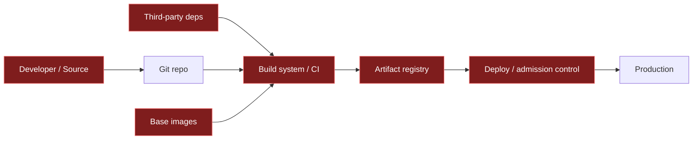
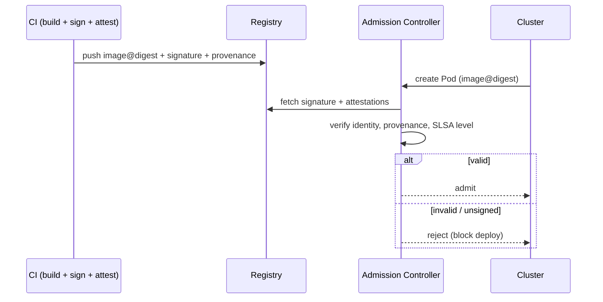

# Software Supply Chain Security

The **software supply chain** is everything that touches your code on its way from a
developer's keyboard to running in production: source repositories, third-party
dependencies, the build system, CI/CD pipelines, artifact registries, container base
images, and the deploy tooling. **Supply chain security** is the discipline of making that
whole path *tamper-evident and verifiable* — so that what runs in prod is provably built
from the source you think it is, by the process you think built it, with only the
dependencies you intended.

The mental shift for interviews: traditional AppSec asks "is *my* code vulnerable?"
Supply chain security asks "can I trust every input and every step that produced this
artifact — including the ~90% of a modern app that is other people's code and the build
infrastructure itself?" A single compromised dependency or a poisoned build step can
inject malware into thousands of downstream victims who never made a mistake in their own
code.

Boundaries with sibling topics: general in-pipeline scanning (SAST/DAST/SCA, IaC scanning)
lives in `devops-cicd/devsecops-and-pipeline-security`; **secrets in pipelines/deploys**
live in `devops-cicd/secrets-management`; the **artifact lifecycle** (build-once-promote-
many, immutability, lockfiles as a reproducibility tool) lives in
`devops-cicd/artifact-and-dependency-management`. This topic owns the *integrity and
provenance* story: SLSA, SBOMs, signing/attestation, verifying third-party inputs, and
admission control.

> [!KEY-TAKEAWAY]
> Supply chain security = **provenance + integrity + verification** across the whole
> path. Concretely: know your dependencies (SBOM), lock and verify them (lockfiles +
> hashes), harden the build so it produces **signed provenance** (SLSA), sign your
> artifacts (Sigstore/cosign + in-toto attestations), pin third-party actions/images **by
> digest not tag**, and *verify signatures at deploy time* (admission control). Trust
> nothing you cannot verify.

---

## The software supply chain threat model

An attacker does not need to breach your production network if they can compromise
something you *pull in and trust*. The supply chain has many injection points, and each is
a distinct attack class:

- **Source tampering** — malicious commit, compromised maintainer account, or a poisoned
  Git repo.
- **Dependency compromise** — a legitimate package gets a malicious version (maintainer
  account takeover, malicious PR, or a hijacked publish token).
- **Build system compromise** — the CI/CD runner or build tool itself is subverted so the
  *output* differs from the source (this is what happened in SolarWinds).
- **Registry / distribution tampering** — the artifact is swapped or mutated in the
  registry or in transit.
- **Consumption attacks** — you are tricked into pulling the wrong thing: **dependency
  confusion**, **typosquatting**, or a mutable tag being repointed.

The defining property of supply-chain attacks is **leverage**: compromise one widely-used
link and you reach everyone downstream. Defenders respond with **defense in depth** and,
crucially, **verifiability** — you cannot manually inspect every dependency, so you build
machinery that lets you *verify* provenance and integrity automatically.



> [!INTERVIEW]
> A strong answer names the *build system itself* as an attack surface, not just
> dependencies. Many candidates only mention "vulnerable libraries." The senior insight is
> that a trustworthy input processed by a compromised build produces a malicious output —
> which is exactly why provenance and hermetic/reproducible builds matter.

---

## Notable attacks: SolarWinds, Log4Shell, dependency confusion, typosquatting

Interviewers use these as anchors — know what class each represents and what defense it
motivates.

| Attack | Class | What happened | Defense it motivates |
|---|---|---|---|
| **SolarWinds (SUNBURST, 2020)** | Build compromise | Attackers implanted code in the Orion **build process**; signed builds shipped malware to ~18k orgs. Source looked clean. | Hardened/isolated builds, SLSA L3, provenance, reproducible builds |
| **Log4Shell (CVE-2021-44228, 2021)** | Transitive vuln | A critical RCE in the ubiquitous `log4j` library; most victims didn't even know they depended on it. | SBOM (find where you use it fast), SCA, dependency inventory |
| **Dependency confusion (2021)** | Consumption / naming | A public package with the same name as an **internal** package and a higher version gets pulled instead of the private one. | Scoped/namespaced packages, private-registry priority, explicit registry config |
| **Typosquatting** | Consumption / naming | Malicious package with a name close to a popular one (`reqeusts`, `python-sqlite`). Installed by typo or copy-paste. | Lockfiles + hash pinning, allowlists, install-time scanning |
| **`event-stream` (2018)** | Maintainer takeover | A popular npm package's maintainer handed off to a bad actor who added a crypto-stealing payload in a transitive dep. | Provenance, OpenSSF Scorecard signals (maintenance/code-review), pinning |
| **Codecov (2021)** | Build/CI compromise | A tampered bash uploader exfiltrated CI secrets/env vars from thousands of pipelines. | Pin third-party scripts/actions by digest, least-privilege CI tokens |
| **XZ Utils backdoor (CVE-2024-3094, 2024)** | Long-game maintainer social engineering | A patient attacker gained maintainer trust and slipped an obfuscated backdoor into `xz`/`liblzma`, nearly reaching stable distros. | Reproducible builds, scrutiny of build scripts, Scorecard, provenance |

> [!WARNING]
> **Log4Shell was not a supply-chain *attack*** — it was a vulnerability in a dependency.
> But it *is* a supply-chain *problem*: the pain was that organizations couldn't quickly
> answer "where do we use log4j, and in what version?" That inability is exactly what an
> SBOM fixes.

---

## Supply chain security vs. general DevSecOps

These overlap but are not the same, and interviewers probe the distinction.

- **DevSecOps / general AppSec** (owned by `devsecops-and-pipeline-security`) is about
  finding *vulnerabilities and misconfigurations*: SAST on your code, DAST on the running
  app, SCA for known-CVE dependencies, IaC scanning, secret scanning. It largely answers
  *"is there a known weakness?"*
- **Supply chain security** is about **integrity and provenance**: can you *prove* the
  artifact was built from the intended source by the intended process with the intended
  inputs, and hasn't been tampered with? It answers *"is this the thing I think it is, and
  can I verify that?"*

Example that separates them: a dependency with **zero known CVEs** can still be malicious
(a fresh backdoor, like XZ). SCA finds nothing — no CVE exists yet. Supply-chain controls
(provenance, reproducible builds, maintainer/Scorecard signals, signature verification)
are what give you a fighting chance. Conversely, SLSA provenance tells you *how* something
was built but says nothing about whether the code has an SQL-injection bug — that's SAST's
job. **You need both.**

> [!TIP]
> Framing: DevSecOps is mostly *detective* ("scan for known bad"); supply-chain security
> adds a *provenance/attestation* layer that is *preventive and verifiable* ("only run
> what we can prove is ours"). SCA is the overlap zone — it's a dependency control that
> shows up in both conversations.

---

## SLSA framework: levels, provenance, and build integrity

**SLSA** ("Supply-chain Levels for Software Artifacts," pronounced "salsa") is an OpenSSF
framework of incremental security requirements for producing artifacts. As of v1.0 it
focuses on the **Build track** (the earlier source-related requirements from v0.1 were
split out into a future Source track). The Build track has levels **L0–L3**:

| Level | Name | Requirement | Prevents |
|---|---|---|---|
| **L0** | (none) | No guarantees; the absence of SLSA. Dev/test on a laptop. | nothing |
| **L1** | Provenance exists | Build produces **provenance** describing how it was built (platform, process, top-level inputs). May be **unsigned** — trivial to forge. | honest mistakes; gives basic visibility |
| **L2** | Signed provenance / hosted build | Provenance is generated by a **hosted build platform** and **signed**; consumers verify the signature. | **tampering *after* the build** |
| **L3** | Hardened builds | **Hardened, isolated** build platform: build runs can't influence each other and signing secrets are inaccessible to user-defined build steps. | **tampering *during* the build** (insiders, other tenants, stolen build creds) — the SolarWinds class |

**Provenance** is machine-readable metadata that answers: *what* was built (artifact
digest), *from what* (source repo + commit, resolved inputs), *by whom/what* (the build
platform identity), and *how* (the build entry point/parameters). Consumers compare an
artifact's provenance against expected values to detect tampering. The interoperable format
is **in-toto attestations** carrying a **SLSA Provenance** predicate.

The critical L2 vs L3 distinction: **L2 signs the provenance** (you can trust it wasn't
altered after the build), but a compromised build *step* could still lie. **L3 hardens the
platform** so the build environment itself is isolated and the signing key is out of reach
of the code being built — that's what would have caught SolarWinds. GitHub Actions with
its OIDC-based **provenance generator** and hosted GitLab/Google Cloud Build can reach
L2–L3 without you running your own signing infrastructure.

> [!WARNING]
> SLSA L1 provenance is **unsigned** and therefore "trivial to bypass or forge" — it is
> about consistency and visibility, not tamper-resistance. Don't claim L1 gives you
> integrity guarantees; the signature (L2) is what makes provenance trustworthy.

---

## Hermetic and reproducible builds

Two related build-integrity properties that underpin higher SLSA levels:

- A **hermetic build** declares *all* of its inputs up front and runs with **no network
  access** during the build — it can only use pre-fetched, pinned dependencies. This
  removes the "the build reached out and pulled something unexpected" attack and makes the
  input set auditable. Tools like Bazel and Nix are built around hermeticity.
- A **reproducible build** is one where the *same source + same inputs* produces a
  **bit-for-bit identical** artifact, regardless of who builds it or when. Achieving it
  requires eliminating nondeterminism: embedded timestamps, file ordering, absolute paths,
  locale, and random seeds. The payoff is **independent verification** — multiple parties
  can rebuild and confirm they get the same bytes, so a tampered build stands out.

Why they matter for supply chain: reproducibility lets a third party (or your own
re-builder) *detect* a SolarWinds-style build compromise, because the malicious binary
would no longer match an independent rebuild. Hermeticity shrinks the build's attack
surface and is a prerequisite for trustworthy provenance about inputs.

Concrete example of nondeterminism breaking reproducibility. Suppose the compiler embeds
a build timestamp (`__DATE__ __TIME__`) into the binary:

```
Build A (10:00:00): ...embeds "2024-01-01 10:00:00" -> sha256 = 3f9a...c21e
Build B (10:05:00): ...embeds "2024-01-01 10:05:00" -> sha256 = b7d4...08af
```

Identical source, identical dependencies — yet the two artifacts differ. Because a hash
avalanches on a single changed byte, that one differing timestamp flips the *entire*
SHA-256 digest, so an independent rebuild can never confirm a match. The standard fix is
to pin the clock: set `SOURCE_DATE_EPOCH` (and sort file order, strip absolute paths, fix
the locale) so every rebuild embeds the same value and lands on the same digest. Now a
rebuild that *doesn't* match is real evidence of tampering — not just a different clock.

> [!TIP]
> Interview line: "Reproducible builds turn trust into *verification* — instead of
> trusting the build server, N independent rebuilders can confirm the artifact matches the
> source. Hermetic builds make that possible by pinning and isolating all inputs."

---

## SBOM: Software Bill of Materials (SPDX, CycloneDX)

An **SBOM** is a formal, machine-readable **inventory of everything in an artifact** —
every component, its version, supplier, license, and relationships (including transitive
dependencies). Think of it as the ingredient label for software.

Why it matters:

- **Vulnerability response speed** — when the next Log4Shell drops, you query SBOMs to
  answer "which of our 300 services ship the affected version?" in minutes, not weeks.
- **License compliance** — surface GPL/AGPL or other obligations.
- **Transparency & regulation** — increasingly required (e.g., US Executive Order 14028
  pushed SBOMs for software sold to the federal government).

Two dominant formats:

| Format | Steward | Notes |
|---|---|---|
| **SPDX** | Linux Foundation | ISO/IEC 5962 standard; broad, license-focused heritage, also carries security data |
| **CycloneDX** | OWASP | Security-first; lightweight; supports VEX, and extends to SaaSBOM/ML-BOM |

**VEX** (Vulnerability Exploitability eXchange) is the piece that turns an SBOM's raw
component list into an actionable answer. It's a machine-readable statement asserting
whether a product is *actually affected* by a given CVE — with a status like `affected`,
`fixed`, `under_investigation`, or `not_affected` plus a justification (e.g.
`vulnerable_code_not_in_execute_path`). Concretely: your SBOM says you ship `log4j 2.14`,
so SCA flags CVE-2021-44228 — but if you never enable the vulnerable JNDI lookup, you
publish a VEX saying `not_affected` and the scanner stops paging you. VEX is how you
suppress false-positive SCA noise without hiding real exposure.

**Generation** happens best **during the build**, when the resolver knows the exact
resolved versions (source-based, most accurate). You can also generate from a built
artifact/image by scanning (e.g., **Syft**, Trivy) — convenient but can miss or misidentify
components. An SBOM should be produced per build, versioned with the artifact, and ideally
**attached as a signed attestation** so consumers can trust it.

```bash
# Generate a CycloneDX SBOM from a container image with Syft
syft registry.example.com/app@sha256:abc123... -o cyclonedx-json > sbom.json
# Attach it to the image as a signed attestation (cosign)
cosign attest --predicate sbom.json --type cyclonedx registry.example.com/app@sha256:abc123...
```

> [!KEY-TAKEAWAY]
> An SBOM is *inventory*, not *analysis*. By itself it doesn't tell you what's vulnerable —
> you feed it into vulnerability/VEX tooling. Its superpower is answering "**do we use X,
> and where?**" instantly across your whole estate.

---

## Artifact signing and verification (Sigstore, cosign, in-toto)

**Signing** binds an artifact to an identity so a consumer can verify (a) it hasn't been
tampered with and (b) it came from an expected signer. The modern, dominant toolchain is
**Sigstore**, whose CLI **cosign** signs container images and other **OCI** (Open Container
Initiative — the standard image/artifact format) artifacts.

The traditional problem with signing was **key management**: long-lived private keys get
lost, leaked, or become a burden to rotate and distribute. Sigstore's answer is **keyless
signing**:

1. The client generates an **ephemeral** keypair in memory.
2. It authenticates the signer's **OIDC** (OpenID Connect — the identity-token standard
   that GitHub/Google/Microsoft and CI systems issue) identity (a human SSO login, or a CI
   workload identity).
3. **Fulcio** (the CA) verifies the OIDC token and issues a **short-lived certificate**
   binding the identity to the ephemeral public key.
4. The artifact is signed; the private key is discarded.
5. The signing event (artifact hash, public key, signature) is recorded in **Rekor**, a
   **transparency log** — a tamper-evident, publicly auditable append-only ledger.

Because keys are ephemeral, there's nothing long-lived to steal or rotate. Verification
checks the signature against the certificate's identity and confirms a matching Rekor entry
exists. Identity owners can *monitor Rekor* to detect unexpected signing under their name.
Fulcio's root and Rekor's key are distributed via **TUF (The Update Framework)**, which
solves the "how do you securely bootstrap and rotate the trust roots themselves" problem:
it signs and versions the root metadata so a compromised mirror or CDN can't feed you a
fake Fulcio/Rekor key, and roots can be rotated without every client re-pinning by hand.

```bash
# Keyless sign (uses ambient OIDC, e.g. GitHub Actions workload identity)
cosign sign registry.example.com/app@sha256:abc123...

# Verify: require the signer identity and the OIDC issuer
cosign verify \
  --certificate-identity-regexp 'https://github.com/myorg/.*' \
  --certificate-oidc-issuer https://token.actions.githubusercontent.com \
  registry.example.com/app@sha256:abc123...
```

**in-toto attestations** generalize signing beyond "I signed this blob": an attestation is
a signed statement *about* an artifact — its SLSA provenance, its SBOM, test results, scan
results, review status. Each is a signed `subject → predicate` claim. This is how
provenance, SBOMs, and policy evidence travel with (or alongside) the artifact and get
verified downstream.

> [!WARNING]
> **Always sign and verify by digest (`@sha256:...`), not by tag.** Tags are mutable — a
> signature "on a tag" is meaningless because the tag can be repointed to different bytes.
> The signature must bind to the immutable content digest.

---

## Dependency pinning, lockfiles, and integrity verification

Pinning is the frontline control against dependency-substitution and drift. Three levels,
increasing in strength:

1. **Version pinning** — `requests==2.31.0` rather than `requests>=2` or `^2`. Removes
   "silent upgrade to a new (possibly malicious) version," but still trusts the registry
   to serve the right bytes for that version.
2. **Lockfiles** — `package-lock.json`, `poetry.lock`, `Cargo.lock`, `go.sum`,
   `yarn.lock`, `pip`'s hash-locked `requirements.txt`. These pin the **entire transitive
   tree** to exact versions, and (importantly) record a **cryptographic hash** of each
   package.
3. **Hash/integrity verification** — the install tool refuses a package whose downloaded
   bytes don't match the recorded hash. `npm ci` (not `npm install`) installs strictly
   from the lockfile; `go.sum` + the checksum database verify module hashes;
   `pip install --require-hashes` enforces hashes.

```
# pip: hash-pinned requirements (pip --require-hashes rejects mismatches)
requests==2.31.0 \
  --hash=sha256:942c5a758f98d790eaed1a29cb6eefc7ffb0d1cf7af05c3d2791656dbd6ad1e1
```

Key operational points:

- Use the **strict, reproducible install** command in CI: `npm ci`, `pip install
  --require-hashes`, `yarn install --frozen-lockfile`. `npm install` may *rewrite* the
  lockfile and resolve new versions — wrong for CI.
- Lockfiles must be **committed** and treated as reviewed artifacts; a PR that changes a
  hash should get scrutiny.
- `go.sum` + the **Go checksum database (sum.golang.org)** provide a global transparency
  log for module hashes so everyone sees the same bytes for a given module version.

> [!TIP]
> Lockfiles serve two masters: **reproducibility** (artifact-and-dependency-management's
> concern) *and* **integrity** (this topic's concern, via recorded hashes). The security
> value only materializes when you use the *verifying* install command — a lockfile you
> don't enforce buys you little.

---

## Dependency confusion, typosquatting, and trusted sources

**Dependency confusion** exploits how package managers resolve a name across **multiple
configured sources**. If your internal package `acme-utils` is only in your private
registry, but an attacker publishes a *public* `acme-utils` with a **higher version**, a
naive resolver that checks both may prefer the public, higher-versioned (malicious) one.

Worked trace — the resolver's decision:

```
Package requested:  acme-utils   (unpinned, e.g. "acme-utils": "*")
Configured sources: [ private registry (nexus.acme.internal), public npm ]

1. Resolver queries private:  acme-utils -> 1.4.0   (your real internal build)
2. Resolver queries public:   acme-utils -> 99.0.0  (attacker just published this)
3. Resolver picks the HIGHEST version across all sources: max(1.4.0, 99.0.0) = 99.0.0
4. Installs public 99.0.0 -> runs attacker's postinstall script in CI. Compromised.
```

Now apply the fix and re-run the trace. Scope the package to a namespace you own,
`@acme/acme-utils`, so the *name itself* only exists in your registry:

```
Package requested:  @acme/acme-utils
1. @acme scope is bound to nexus.acme.internal only -> resolver never queries public npm
2. Resolves @acme/acme-utils -> 1.4.0. There is no public "@acme/acme-utils" to shadow it.
```

Version `99.0.0 > 1.4.0` is still true, but it no longer matters: the malicious public
`acme-utils` and your scoped `@acme/acme-utils` are now *different names*, so there is
nothing to confuse. (Pinning the resolver so bare internal names never fall through to
public gives the same outcome.)

Defenses:

- **Namespacing/scoping** — npm scopes (`@acme/utils`), Maven groupIds you control, so the
  name can't be squatted publicly.
- **Registry priority / no fall-through** — configure the client so internal names resolve
  *only* against the private registry; don't let public resolution shadow internal names.
- **Reserve your names** on the public registry, or use a proxy that mirrors and blocks
  confusable names.

**Typosquatting** publishes malicious packages under names close to popular ones
(`reqeusts`, `crossenv` vs `cross-env`). Defenses: lockfiles + hashes (a typo'd name won't
match your locked tree), allowlists/curation, and install-time scanning.

**Trusted sources / registry security** more broadly:

- **Proxy public registries through your own** (Artifactory/Nexus/CodeArtifact) so you
  control caching, get an audit trail, and survive upstream deletions (the `left-pad`
  problem) — this also lets you apply policy at the proxy.
- **Curate an allowlist** of approved packages/versions for regulated environments.
- Enforce **least-privilege publish tokens** and 2FA on your own registry accounts;
  publish-token theft is a common compromise vector.

> [!INTERVIEW]
> Classic scenario: "Your internal `payments-sdk` build suddenly pulled a public package.
> What happened and how do you prevent it?" Answer: **dependency confusion** — a public
> package shadowed the internal name via a higher version. Fix by scoping/namespacing the
> package and configuring the resolver so internal names *never* fall through to the public
> registry, plus pin via lockfile.

---

## Pinning third-party actions and images by digest, not tag

Your CI configuration *is* code that runs with your credentials, and container base images
*are* dependencies. Both are commonly referenced by **mutable tags**, which is an integrity
hole: whoever controls the tag (or the upstream repo) can change what those bytes are *after*
you reviewed them.

**GitHub Actions** — referencing an action by a tag or branch is dangerous because tags are
movable and even a Git tag can be re-pointed. Pin to a **full commit SHA**:

```yaml
# Risky: mutable tag — upstream (or an attacker who takes the repo) can change v4's contents
- uses: actions/checkout@v4

# Safer: immutable commit SHA (add a comment noting the human-readable version)
- uses: actions/checkout@8f4b7f84864484a7bf31766abe9204da3cbe65b3 # v4.2.2
```

**Container images** — pull and deploy **by digest**, not by tag:

```dockerfile
# Risky: 'latest' (and even '1.27') can be repointed to different bytes
FROM nginx:latest
# Safer: immutable content digest
FROM nginx:1.27.3@sha256:0c86dddac19f2ce4fd716ac58c0fd7c0d1c9b2bb1a1c8f9b3d3d3d3d3d3d3d3d3
```

The **Codecov (2021)** breach is the poster child: a third-party CI uploader script was
tampered with and exfiltrated secrets from thousands of pipelines. Pinning the exact
reviewed bytes (and running CI with least-privilege, read-only tokens — see
`secrets-management`) is the mitigation.

> [!WARNING]
> Pinning to a **Git tag** (e.g. `@v4`) is *not* pinning — tags are mutable and can be
> force-moved. Only a **full commit SHA** (actions) or a **content digest** (images) is
> immutable. Automate the pinning/updating with tools like Dependabot or `pin-github-action`
> so it stays maintainable.

---

## OpenSSF Scorecard: measuring project security posture

**OpenSSF Scorecard** is an automated tool that assesses a repository against a set of
security **heuristics ("checks")** and scores each **0–10**, rolling them up into a
weighted aggregate. It's how you triage the security posture of your **own** repos and,
importantly, of the **open-source dependencies** you're considering.

Representative checks (with risk weights):

| Check | Weight | What it looks for |
|---|---|---|
| **Dangerous-Workflow** | Critical | Risky patterns in GitHub Actions (e.g., untrusted input to `pull_request_target`) |
| **Branch-Protection** | High | Protected branches, required reviews |
| **Token-Permissions** | High | Workflow `GITHUB_TOKEN` declared read-only / least privilege |
| **Code-Review** | High | Changes reviewed before merge |
| **Maintained** | High | Active commits, recent activity (project isn't abandoned) |
| **Vulnerabilities** | High | Unfixed known vulns (via OSV) |
| **Signed-Releases** | High | Releases are cryptographically signed |
| **Dependency-Update-Tool** | High | Uses Dependabot/Renovate |
| **Pinned-Dependencies** | Medium | Dependencies (incl. actions) pinned by hash |

Worked rollup (illustrative weights: Critical = 10, High = 7.5, Medium = 5). Take the 9
checks above and say a repo scores **9/10 on all of them except one that scores 0**. The
aggregate is a weighted average, `Σ(weight × score) / Σ(weight)`:

```
Σ(weights) = 10 + 7×7.5 + 5 = 67.5      (1 Critical, 7 High, 1 Medium)
All checks 9:  9 × 67.5 / 67.5                              = 9.0

Case A — the 0 is Dangerous-Workflow (Critical, weight 10):
  numerator = (9×67.5) − (9×10) = 607.5 − 90 = 517.5
  aggregate = 517.5 / 67.5                                  ≈ 7.7

Case B — the 0 is Pinned-Dependencies (Medium, weight 5):
  numerator = (9×67.5) − (9×5) = 607.5 − 45 = 562.5
  aggregate = 562.5 / 67.5                                  ≈ 8.3
```

Same failing check, same 0 — but a **Critical** miss drags the score to 7.7 while a
**Medium** miss only reaches 8.3. That's what "weighted aggregate" buys you: a dangerous
CI workflow costs you twice as much as an unpinned dependency. So a "6" is not "60% good"
— it usually means something heavily-weighted is failing.

Use it to set a **minimum bar** for dependencies ("we don't adopt libraries scoring < 6")
and to harden your own repos. It measures *practices/posture*, not "is this code exploit-
free" — a high score means the project follows good security hygiene, which correlates with
lower supply-chain risk but isn't a guarantee.

> [!TIP]
> Scorecard signals like **Maintained** and **Code-Review** are exactly the ones that would
> have flagged risk in maintainer-takeover cases (`event-stream`) where there was no CVE to
> find. It's a *posture* signal, complementary to CVE-based SCA.

---

## Admission control: verifying signatures at deploy time

Signing and generating provenance is worthless if nothing **checks** them before code runs.
**Admission control** enforces policy at the boundary where an artifact enters the runtime
— most commonly a **Kubernetes admission controller** that intercepts pod creation and
**rejects images that aren't signed by a trusted identity** (or lack required attestations
like SLSA provenance or an SBOM).

Tools: **Sigstore Policy Controller**, **Kyverno**, and **OPA/Gatekeeper** can verify cosign
signatures and in-toto attestations as an admission gate. A typical policy: *"only admit
images from `registry.example.com/*` that carry a valid cosign signature from our CI's OIDC
identity and a SLSA provenance attestation for build level ≥ L3."*

```yaml
# Kyverno: require a cosign signature from a trusted keyless identity before admitting a pod
apiVersion: kyverno.io/v1
kind: ClusterPolicy
metadata:
  name: require-signed-images
spec:
  validationFailureAction: Enforce
  rules:
    - name: verify-signature
      match:
        any:
          - resources: { kinds: [Pod] }
      verifyImages:
        - imageReferences: ["registry.example.com/*"]
          attestors:
            - entries:
                - keyless:
                    subject: "https://github.com/myorg/*"
                    issuer: "https://token.actions.githubusercontent.com"
```

This closes the loop: it's the **verification** half of the sign/attest → verify pattern.
Without an enforcing gate, signatures are documentation, not a control.



> [!KEY-TAKEAWAY]
> The chain is only as strong as its **enforcement point**. Sign artifacts and attach
> provenance/SBOM attestations in CI, then **verify at admission** (Kyverno / Sigstore
> Policy Controller / OPA-Gatekeeper) so unsigned or untrusted images literally cannot run.
> `validationFailureAction: Enforce` (not `Audit`) is what turns policy into prevention.

---

## Common follow-up questions

- "Walk me through securing the supply chain of a service end-to-end." Pin & verify
  deps (lockfile + hashes, proxy through a private registry), scan (SCA) — build hermetically
  on a hardened runner that emits **signed SLSA provenance** — generate and attach an **SBOM**
  — **sign** the image keyless with cosign and attach in-toto attestations — pin base images
  and CI actions **by digest/SHA** — **verify signatures + provenance at admission** before
  anything runs.
- "Which of your controls would have stopped SolarWinds?" SLSA **L3** hardened/isolated
  builds + **reproducible builds** (independent rebuild would mismatch the tampered binary).
  Signing alone (L2) wouldn't — the malicious build would have signed the bad artifact.
- "SLSA L2 vs L3?" L2 = signed provenance from a hosted platform (prevents tampering
  *after* build). L3 = hardened, isolated platform with unreachable signing keys (prevents
  tampering *during* build).
- "Why digest instead of tag?" Tags (and even Git tags) are mutable and can be
  repointed; only a content digest / full commit SHA is immutable, so it's the only thing a
  signature or pin can meaningfully bind to.
- "SBOM vs SCA?" SBOM = inventory of components. SCA = analysis that matches components
  against known-vuln databases. SBOM feeds SCA/VEX; it's not itself a vulnerability report.
- "Is Log4Shell a supply-chain attack?" No — it's a *vulnerability* in a dependency.
  It's a supply-chain *management* problem: without an SBOM you can't quickly find where
  you're exposed.
- "How does keyless signing avoid key management?" Ephemeral keys + short-lived Fulcio
  certs bound to an OIDC identity + a Rekor transparency-log record — nothing long-lived to
  leak or rotate.

## References

- SLSA v1.0 — Security Levels (Build track L0–L3): https://slsa.dev/spec/v1.0/levels
- SLSA — Provenance & threats: https://slsa.dev/spec/v1.0/threats
- Sigstore / cosign docs (keyless signing, Fulcio, Rekor): https://docs.sigstore.dev/
- in-toto attestation framework: https://github.com/in-toto/attestation
- OpenSSF Scorecard (checks & scoring): https://github.com/ossf/scorecard
- SPDX specification: https://spdx.dev/  ·  CycloneDX: https://cyclonedx.org/
- CISA / NTIA on SBOM: https://www.cisa.gov/sbom
- SLSA & the SolarWinds threat model: https://slsa.dev/spec/v1.0/threats-overview
- The Update Framework (TUF): https://theupdateframework.io/
- Kyverno image verification: https://kyverno.io/docs/writing-policies/verify-images/
- Sigstore Policy Controller: https://docs.sigstore.dev/policy-controller/overview/
- Executive Order 14028 (SBOM mandate context): https://www.nist.gov/itl/executive-order-14028-improving-nations-cybersecurity
