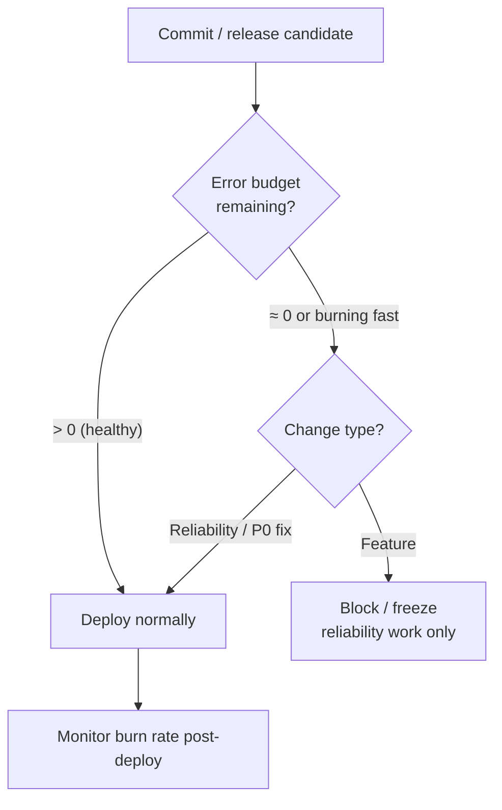
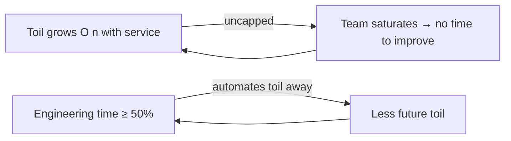

# SRE: SLA, SLO, SLI & Reliability

Site Reliability Engineering (SRE) is Google's discipline for running production systems by
treating **operations as a software problem**. Instead of hiring humans to hand-crank
releases, watch dashboards, and page each other at 3 a.m., SRE hires engineers who write
software to *do* the operations work — and who spend the rest of their time making the
system so reliable that there is less work to do. The founding text is Google's *Site
Reliability Engineering* book (Beyer, Jones, Petoff, Murphy — O'Reilly, 2016), followed by
*The Site Reliability Workbook* (2018).

For the **DevOps/delivery angle** — which is what this topic owns — the key ideas are:
reliability is a *feature* you set a numeric target for (the **SLO**), you measure it with a
good ratio metric (the **SLI**), you sign an external contract with a penalty around it (the
**SLA**), and the gap between "perfect" and your SLO is a budget you get to *spend* on
shipping changes (the **error budget**). That error budget is the bridge between velocity
and reliability, and it is increasingly wired directly into the release pipeline as a gate.

> [!KEY-TAKEAWAY]
> Remember the three in one sentence: **SLI** is what you *measure* (a good/total ratio,
> e.g. fraction of successful requests), **SLO** is the *internal target* you hold yourself
> to (e.g. 99.9% over 28 days), and **SLA** is the *external, contractual promise* to
> customers with a *penalty* (usually service credits) if you miss it. The SLO is always
> stricter than the SLA. `1 − SLO` is your **error budget** — the amount of unreliability
> you are *allowed* to spend, which is why "100% is the wrong reliability target."

This topic gives the DevOps framing (error budgets gating releases, DORA metrics, the basic
incident/postmortem flow). The **deep incident/on-call/postmortem/chaos process** lives in
the upcoming `reliability-and-operations` domain, and the **burn-rate alerting math**
(multi-window multi-burn-rate alerts, PromQL) is owned by the `observability` domain's
SLO-alerting topic — cross-linked below rather than duplicated here.

---

## What SRE is (Google's approach)

**Definition.** SRE is "what happens when you ask a software engineer to design an
operations team" (Ben Treynor Sloss, who coined the term at Google around 2003). It is a
concrete *implementation* of the DevOps philosophy: DevOps says "reduce silos, accept
failure as normal, implement gradual change, leverage tooling/automation, measure
everything" — SRE prescribes specific practices that satisfy each of those.

**Core tenets:**

- **Operations is a software problem.** SRE teams are staffed with engineers who can write
  code and are expected to automate their way out of manual work.
- **Manage by Service Level Objectives.** You do not chase 100%; you pick an SLO and manage
  to it.
- **Error budgets** turn the dev-vs-ops "how fast can we ship?" argument into a shared,
  data-driven decision.
- **Cap toil at 50%.** Engineers must spend at least half their time on engineering
  (automation, reliability work), not manual operations.
- **Blamelessness & learning from failure.** Failure is treated as a systems problem, not a
  people problem; postmortems are blameless.
- **Automate this year's job away.** The goal is to make the *next* unit of scale not
  require a proportional unit of human effort — reliability and scalability should be
  decoupled from headcount.

> [!INTERVIEW]
> A classic opener: "How is SRE different from DevOps?" The crisp answer: *DevOps is a
> philosophy/culture; SRE is a specific, opinionated implementation of it with concrete
> practices (SLOs, error budgets, a 50% toil cap, blameless postmortems).* "class SRE
> implements interface DevOps" is the slogan from Google's *Class SRE Implements DevOps*
> video series.

---

## SLI — Service Level Indicator

**Definition.** An SLI is a **quantitative measure of some aspect of the level of service**
that is provided. It is best expressed as a **ratio of good events to valid events**,
scaled 0–100%:

```
SLI = good events / valid events × 100%
```

Framing it as a ratio has two nice properties: it is always between 0 and 100%, and it maps
cleanly to an SLO ("99.9% of requests are good") and to an error budget ("0.1% may be bad").

**Common SLI categories** (the "SLI menu" from the SRE Workbook):

| SLI type | Good / valid definition (example) |
|---|---|
| **Availability** | successful HTTP responses / all valid HTTP requests |
| **Latency** | requests served faster than a threshold / all valid requests (e.g. `< 300 ms`) |
| **Correctness / quality** | records processed without error / all records |
| **Freshness** | data views refreshed within threshold / all views |
| **Throughput / durability** | for pipelines and storage systems |

**Good SLIs** are measured as close to the **user's experience** as possible. Prefer
measuring at the load balancer or client over deep in the backend, because that is what the
user actually feels. Latency SLIs should use a **percentile** (p95/p99), never the mean —
an average hides the tail where real users suffer.

> [!TIP]
> Latency SLIs are usually expressed as a *count that beats a threshold*, not as a raw
> percentile. "99% of requests complete under 300 ms" is an SLI+SLO pair; it degrades
> gracefully and is easy to turn into an error budget, whereas "p99 latency = X ms" is
> harder to budget against.

---

## SLO — Service Level Objective

**Definition.** An SLO is the **target value or range for an SLI**, measured over a **time
window**. It is an *internal* goal the team commits to. Example:

> "99.9% of valid HTTP requests over a rolling **28-day** window return successfully."

**Key design points:**

- **Pick a window.** Rolling windows (e.g. 28 days) are common because they don't reset
  abruptly at a calendar boundary; calendar-aligned windows (monthly quarters) match SLAs.
- **SLOs should be as loose as you can get away with**, not as tight as possible. Every extra
  nine costs real engineering effort and shrinks your error budget (your freedom to ship).
- **The SLO drives the error budget** (`error budget = 1 − SLO`) and therefore how fast you
  can move.
- **Fewer, meaningful SLOs beat many vanity ones.** Pick the handful of SLIs users actually
  care about (availability, latency) and set targets there.

> [!WARNING]
> **100% is the wrong reliability target for basically everything.** It is impossible to
> reach (dependencies, networks, and clients all fail), and the last fraction of a nine
> costs exponentially more than users can perceive — especially when the user's own device,
> Wi-Fi, and ISP are already less reliable than 99.9%. Chasing 100% eliminates the error
> budget, which eliminates your ability to ship.

---

## SLA — Service Level Agreement

**Definition.** An SLA is an **explicit or implicit contract with your users that includes
consequences** of meeting (or missing) the SLOs it contains. The consequences are usually
financial — **service credits** or refunds — and sometimes the right to terminate.

**The critical relationship:** your **SLA is looser than your SLO**. You alert and react on
the internal SLO so that you have a safety margin *before* you breach the contractual SLA and
owe customers money. For example: SLA promises 99.9% (credits below that); internal SLO is
99.95%; SLI dashboards and alerts fire on the SLO.

```
Reality ────────────────────────────────────────────────►
     stricter                                     looser
  100% ──── SLO (99.95%, internal) ──── SLA (99.9%, external/contractual)
             ▲ alert & react here          ▲ owe service credits below here
```

**What an SLA typically contains:** the covered service, the SLI definitions, the target
(e.g. "Monthly Uptime Percentage ≥ 99.9%"), exclusions (scheduled maintenance, force
majeure, customer-caused issues), and the **remedy** (a service-credit schedule, e.g. 10%
credit below 99.9%, 25% below 99.0%). Credits are usually **claim-based** — the customer
must request them.

> [!TIP]
> A team with **no paying external customers may have SLOs but no SLA**. Internal services
> often publish only SLOs. Interviewers love the distinction: *an SLA has a business/legal
> consequence; an SLO is an engineering target.*

---

## SLI vs SLO vs SLA — the comparison

| | **SLI** | **SLO** | **SLA** |
|---|---|---|---|
| Stands for | Service Level *Indicator* | Service Level *Objective* | Service Level *Agreement* |
| What it is | A **measurement** (metric) | A **target** for that metric | A **contract** with a penalty |
| Audience | Engineers | Engineers / internal | Customers / legal / business |
| Example | 99.94% of requests succeeded | ≥ 99.95% over 28 days | ≥ 99.9%, else 10% credit |
| Consequence of missing | (it's just a number) | Trigger error-budget policy | **Pay** service credits |
| Strictness | — | Stricter than SLA | Loosest of the three |

Mnemonic: **I** = *Indicator* (what you measure) → **O** = *Objective* (what you aim for) →
**A** = *Agreement* (what you promise, with teeth). Not everything with an SLO has an SLA,
but every SLA is built on top of SLIs and SLOs.

> [!INTERVIEW]
> A frequent trap: "Is 99.9% an SLI, SLO, or SLA?" It depends on framing — the *measured*
> 99.94% is an SLI value; the *target* "≥ 99.9%" is an SLO; the *contractual promise* "≥
> 99.9% or you get a credit" is an SLA. State the distinction explicitly rather than
> guessing.

---

## Error budgets

**Definition.** The error budget is the **amount of unreliability you are allowed to
tolerate** over the SLO window — the complement of the SLO:

```
error budget = 100% − SLO
```

If the SLO is 99.9% over 28 days, the error budget is **0.1%** of requests (or of time). For
a service handling 10,000,000 requests / 28 days, that's **10,000** requests you may fail
before breaching. As a *time* budget over 28 days, 0.1% ≈ **40.3 minutes** of full downtime.

**Why it's powerful:** it reframes reliability from a subjective argument into a shared,
quantitative resource. Product/dev wants to ship features (which risk reliability); SRE
wants stability. The error budget makes the trade-off *explicit and self-regulating*:

- **Budget remaining** → you can take risks: ship faster, run experiments, do risky
  migrations, relax freeze rules.
- **Budget exhausted** → reliability work takes priority; risky changes pause (see the
  error-budget policy).

**Budget consumption ("burn").** You spend budget through failed requests, latency
violations, incidents, and bad deploys. The *rate* at which you spend it is the **burn
rate** (1× burn = you'll exactly exhaust the budget by window end; 10× burn = you'll exhaust
it in a tenth of the window). Burn-rate alerting (multi-window, multi-burn-rate) is the
modern way to page on SLO threats — that math is owned by the `observability` domain's
SLO-alerting topic; cross-link there for PromQL and window tuning.

> [!KEY-TAKEAWAY]
> The error budget is the **common incentive** that aligns dev and ops: it's not "bad," it's
> a resource to *spend* on velocity. A team that never uses its error budget has set its SLO
> too high and is over-investing in reliability at the expense of shipping.

---

## Error-budget policy (gating releases)

An **error-budget policy** is the *pre-agreed, written* document that says **what happens
when the budget is exhausted**. Agreeing on it *before* an incident (when everyone is calm
and rational) is what gives it teeth; it typically requires sign-off from dev, SRE, and
product leadership.

**Typical policy escalation:**

1. **Budget healthy** → normal velocity; ship freely.
2. **Budget low / burning fast** → heightened scrutiny, extra review on risky changes.
3. **Budget exhausted** → **feature freeze**: only reliability fixes, bug fixes, and P0
   security patches ship until the budget recovers. New feature work pauses.
4. **Repeated/severe exhaustion** → escalate: pull developers onto reliability work, or
   re-negotiate the SLO.

**Wiring it into the pipeline (the DevOps angle).** Modern setups make the gate *automatic*
rather than a manual meeting decision — the CD pipeline queries the SLO/error-budget status
and blocks non-critical deploys when the budget is gone:

```yaml
# GitHub Actions — an error-budget gate before deploy (illustrative)
jobs:
  slo-gate:
    runs-on: ubuntu-latest
    steps:
      - name: Query remaining error budget
        id: budget
        run: |
          # query your SLO tool (Nobl9 / Sloth / custom Prometheus recording rule)
          REMAINING=$(curl -s "$SLO_API/services/checkout/error-budget" | jq '.remaining_percent')
          echo "remaining=$REMAINING" >> "$GITHUB_OUTPUT"
      - name: Block feature deploys when budget exhausted
        if: ${{ steps.budget.outputs.remaining <= 0 && github.event.inputs.change_type == 'feature' }}
        run: |
          echo "::error::Error budget exhausted — feature deploys frozen. Only reliability/P0 fixes allowed."
          exit 1
  deploy:
    needs: slo-gate
    runs-on: ubuntu-latest
    steps:
      - run: ./deploy.sh
```



> [!WARNING]
> An error-budget policy with **no enforcement** is theatre. If leadership overrides the
> freeze every time to ship the roadmap, the policy is dead. The whole point is that the
> *policy*, agreed in advance, makes the decision — not a person under pressure.

---

## Availability math (the nines)

Availability is usually stated in **"nines."** You must be able to convert a nines target
into **allowed downtime per period** on the spot in an interview.

| Availability | Error budget | Downtime / year | Downtime / month (avg, 30.44d) | Downtime / week | Downtime / day |
|---|---|---|---|---|---|
| **99%** (two nines) | 1% | 3.65 days | ~7.2 hours | ~1.68 hours | ~14.4 min |
| **99.9%** (three nines) | 0.1% | 8.77 hours | ~43.8 min | ~10.1 min | ~1.44 min |
| **99.95%** | 0.05% | 4.38 hours | ~21.9 min | ~5.04 min | ~43 s |
| **99.99%** (four nines) | 0.01% | 52.6 min | ~4.38 min | ~1.01 min | ~8.6 s |
| **99.999%** (five nines) | 0.001% | 5.26 min | ~26 s | ~6 s | ~0.86 s |

**How to derive it:** downtime = `(1 − availability) × period`. For 99.9% over 30 days:
`0.001 × 30 × 24 × 60 min = 43.2 min` (≈ 43.8 for a 365.25/12-day month). Each extra nine
divides allowed downtime by **10**.

**Request-based vs time-based.** The nines above are *time-based* (uptime). Modern SLOs are
often *request-based*: "99.9% of requests succeed." They're related but not identical — a
service can be "up" while serving errors, so request-based availability is usually the
better user proxy.

**Compound / dependency availability.** For serial dependencies, availabilities *multiply*:
a service that depends on 5 components each at 99.9% has a ceiling of `0.999^5 ≈ 99.5%`.
This is why deep dependency chains make high nines expensive, and why redundancy (parallel
paths) is needed to *raise* availability above any single component.

> [!TIP]
> Quick memory pegs: **three nines ≈ ~43 min/month**, **four nines ≈ ~4 min/month**, **five
> nines ≈ ~26 s/month**, and **99% ≈ 3.65 days/year**. Interviewers frequently ask "how much
> downtime does four nines allow per month?" — the answer is about **4.3 minutes**.

---

## Toil and the 50% cap

**Definition.** Toil is the kind of work tied to running a production service that is:
**manual, repetitive, automatable, tactical, devoid of enduring value, and scales linearly
(O(n)) with service growth.** Answering a page by hand, applying the same config change
across hosts, manual failovers, and rubber-stamping quota requests are all toil.

**What is *not* toil:** overhead (email, meetings, expense reports — not tied to running the
service) and genuine engineering work (design, coding automation) even though the latter is
also effortful. Toil isn't "work I dislike"; it has the six specific properties above.

**The 50% cap.** Google's SRE model caps toil at **50%** of an SRE's time. The other ≥50%
must go to *engineering* — building automation and reliability improvements that reduce
future toil. If toil creeps above 50%, that's a signal to redistribute work, push some back
to the dev team, or hire — otherwise the team becomes a pure ops team that can never dig
out.

**Why cap it:** toil that scales O(n) with load means growth eventually consumes 100% of the
team, capping the service's scale at the team's manual throughput. Engineering work is how
you *decouple* growth from headcount (sublinear scaling).



> [!INTERVIEW]
> A great answer names the six properties (manual, repetitive, automatable, tactical, no
> enduring value, scales linearly) and the 50% cap, then adds the *why*: uncapped toil makes
> reliability scale with headcount, defeating the purpose of SRE.

---

## SRE vs DevOps

Both aim at fast, safe delivery, but they operate at different levels of abstraction.

| | **DevOps** | **SRE** |
|---|---|---|
| Nature | A **philosophy / culture** (a set of principles) | A concrete **implementation / role** with prescribed practices |
| Scope | The whole dev↔ops flow, org-wide culture | Reliability of production services, run by engineers |
| Key artifacts | CALMS, Three Ways, DORA metrics | SLIs/SLOs/SLAs, error budgets, toil cap, postmortems |
| Origin | Community movement (~2009, Debois/Allspaw) | Google (~2003, Treynor Sloss) |
| Slogan | "You build it, you run it" | "class SRE implements interface DevOps" |

They are **complementary, not competing.** DevOps sets the *goals* ("reduce silos, accept
failure, automate, measure"); SRE gives *specific, measurable ways to achieve them* (error
budgets satisfy "accept failure," the toil cap satisfies "automate," SLOs satisfy "measure
everything"). Many orgs run a DevOps culture *and* an SRE function. See the
`devops-fundamentals-and-culture` topic for the culture side.

---

## SRE team topologies (embedded vs centralized)

There is no single right way to organize SRE; the SRE Workbook describes several
**implementation patterns**, chosen by company size and maturity:

- **Kitchen-sink / "everything" SRE** — one team owns everything; common at small scale, but
  scope grows unbounded.
- **Centralized / infrastructure SRE** — a central team owns shared platforms, tooling, and
  standards (SLO frameworks, deploy tooling) that product teams consume. Consistency, but
  risk of being a bottleneck or too far from product context.
- **Embedded SRE** — an SRE (or a few) sits *inside* a product/dev team, sharing context and
  on-call. Deep product knowledge, but hard to keep practices consistent across the org and
  the SRE can get pulled into pure feature work.
- **Consulting / enablement SRE** — SREs advise many teams (reviews, best practices) without
  owning on-call; scales expertise but has less direct leverage.
- **Product/application vs infrastructure SRE** — split by whether the team supports a
  customer-facing app or the underlying platform.

**Engagement model:** many mature orgs use a **production readiness review (PRR)** before an
SRE team agrees to take on (onboard) a service, and negotiate the SLO and error-budget
policy as part of that handshake. This connects to the platform-engineering trend (a central
team building a self-service internal developer platform so product teams operate their own
services).

> [!TIP]
> The trade-off to state in an interview: **centralized = consistency + economy of scale but
> risk of bottleneck/detachment; embedded = context + speed but risk of inconsistency and
> scope creep.** Most large orgs run a hybrid (central platform team + embedded SREs).

---

## Reducing toil via automation

Reducing toil is the *engineering* half of the SRE job, and it's where the DevOps toolchain
comes in. The progression is roughly: **eliminate → automate → self-heal**.

- **Eliminate at the source.** The cheapest toil is the toil you design away — fix the flaky
  system, remove the manual approval that adds no value, make the operation unnecessary.
- **Automate with code and IaC.** Replace manual host changes with **Terraform/Ansible**
  (declarative infra), manual deploys with **CD pipelines** (GitHub Actions / GitLab CI /
  Jenkins), and manual cluster ops with **GitOps** (Argo CD / Flux) so the desired state is
  reconciled automatically. See `infrastructure-as-code-terraform`,
  `configuration-management-ansible`, and the CD/GitOps topics.
- **Build runbooks, then automate them.** A documented runbook is step one; turning that
  runbook into a script or an auto-remediation is step two.
- **Self-healing.** Autoscaling, health-check-driven restarts, automatic rollback on failed
  canary, and auto-failover remove the human from the loop entirely.

**Measure it.** Track toil (surveys, ticket categories, time tracking) so you know whether
automation is actually reducing it. Prioritize automating the **highest-frequency ×
highest-effort** toil first (best ROI). Automating a once-a-year task rarely pays off; the
xkcd "is it worth the time?" trade-off applies.

> [!WARNING]
> Beware automating a *broken* process — you just make the mistakes faster. And beware
> **automation that itself becomes toil** (brittle scripts everyone has to babysit). Good
> automation is idempotent, observable, and safe to re-run.

---

## Blameless postmortems (intro)

A **postmortem** is a written record of an incident: its impact, the timeline, the root
cause(s), and the actions taken to prevent recurrence. **Blameless** means it focuses on
*systems and processes*, not on punishing individuals — the premise is that people act
rationally given the information and tools they had, so if a human "caused" an outage, the
*system* let them.

**Why blameless matters:** if people fear blame, they hide information, and you lose the
learning that prevents the next outage. Psychological safety → honest postmortems → real
fixes. A postmortem should produce **prioritized, tracked action items** (owned, with due
dates), not just a narrative.

**Trigger criteria** (agree in advance): e.g. any user-visible downtime/data loss beyond a
threshold, any incident requiring emergency human intervention, or any SLO breach. The
document is typically **shared widely** so the whole org learns.

This is only the DevOps-framing intro. The **deep incident-command, on-call rotation,
severity/escalation, and chaos-engineering process** is owned by the upcoming
`reliability-and-operations` domain; the basic incident flow also appears in
`incident-management-and-troubleshooting`.

> [!INTERVIEW]
> If asked "what makes a postmortem blameless?", say: it replaces "who screwed up?" with
> "what about our system allowed this, and how do we make it impossible or safe next time?" —
> and it always ends in tracked, owned action items.

---

## DORA metrics (the reliability/velocity link)

The **DORA (DevOps Research and Assessment)** program — the *Accelerate* research by Nicole
Forsgren, Jez Humble, and Gene Kim, now Google Cloud's annual *State of DevOps* report —
established **four key metrics** that predict software delivery performance. They are the
DevOps-side counterpart to SRE's SLOs and connect velocity to reliability.

**The four keys (two for velocity, two for stability):**

| Metric | What it measures | Elite benchmark (recent DORA reports) |
|---|---|---|
| **Deployment Frequency** | How often you deploy to production | On-demand (multiple per day) |
| **Lead Time for Changes** | Time from code committed to running in prod | Less than one day (hours) |
| **Change Failure Rate (CFR)** | % of deployments causing a failure needing remediation | 0–15% |
| **Failed Deployment Recovery Time** (formerly *Time to Restore / MTTR*) | How fast you recover from a failed deployment | Less than one hour |

A **fifth metric — reliability** (operational performance against SLOs) — was added in later
reports, explicitly tying DORA to SRE: high performers ship *fast* **and** stay reliable;
the two are not a trade-off but correlate positively.

**The reliability link:** the two stability metrics (CFR, recovery time) are essentially
"how much do you spend your error budget, and how fast do you replenish it?" A rising CFR
burns error budget; slow recovery deepens the burn. DORA gives the *pipeline* view; SLOs/error
budgets give the *service* view. Deeper DORA treatment lives in
`devops-fundamentals-and-culture`.

> [!WARNING]
> DORA metrics are **team-level improvement signals, not individual performance KPIs.**
> Weaponizing them (e.g. ranking engineers by deploy count) causes gaming and destroys their
> value. And you must read velocity and stability *together* — high deploy frequency with a
> 40% change failure rate is not "elite," it's reckless.

---

## Common follow-up questions

- "Why is 100% the wrong reliability target?" Because it's unreachable (dependencies,
  clients, and networks fail), the marginal nines cost exponentially more than users can
  perceive (their own devices are less reliable), and a 100% target leaves zero error
  budget — no room to ship changes.
- "Give me the SLI/SLO/SLA in one line each." SLI = the measurement (good/valid ratio);
  SLO = the internal target for that measurement over a window; SLA = the external contract
  with a penalty. SLO is stricter than SLA.
- "How much downtime does 99.99% allow per month?" About **4.3 minutes** (52.6 min/year).
- "What happens when the error budget is exhausted?" The error-budget policy kicks in —
  typically a feature freeze until the budget recovers; only reliability/P0 fixes ship.
- "How is SRE different from DevOps?" DevOps is the philosophy; SRE is a specific,
  opinionated implementation (SLOs, error budgets, 50% toil cap, blameless postmortems).
- "What's toil and why cap it at 50%?" Manual/repetitive/automatable work that scales
  O(n); capped so reliability doesn't scale with headcount and engineers keep automating.
- "How do you wire error budgets into CI/CD?" A pipeline gate queries SLO status and
  blocks non-critical deploys when the budget is gone (see the GitHub Actions snippet).
- "SLO window: rolling vs calendar?" Rolling (e.g. 28 days) avoids abrupt calendar
  resets and reflects recent experience; calendar windows align with monthly SLA reporting.
- "How do dependency availabilities combine?" Serial dependencies multiply
  (`0.999^n`), so long chains cap your ceiling; use redundancy to raise it.

## References

- Beyer, Jones, Petoff, Murphy — *Site Reliability Engineering* (O'Reilly, 2016),
  <https://sre.google/sre-book/table-of-contents/> — esp. "Embracing Risk", "Service Level
  Objectives", "Eliminating Toil".
- Beyer et al. — *The Site Reliability Workbook* (O'Reilly, 2018),
  <https://sre.google/workbook/table-of-contents/> — "Implementing SLOs", "SLO Engineering
  Case Studies", "How SRE Relates to DevOps", "SRE Team Lifecycles".
- Google Cloud — *SRE fundamentals: SLIs, SLAs and SLOs*,
  <https://cloud.google.com/blog/products/devops-sre/sre-fundamentals-slis-slas-and-slos>.
- Google — *Class SRE Implements DevOps* (video series / articles), <https://sre.google/>.
- DORA / Google Cloud — *State of DevOps* reports and the four keys,
  <https://dora.dev/> and <https://cloud.google.com/devops>.
- Forsgren, Humble, Kim — *Accelerate: The Science of Lean Software and DevOps* (IT
  Revolution, 2018).
- Cross-links: `observability` domain (SLO burn-rate alerting math),
  `devops-fundamentals-and-culture` (DORA depth, CALMS), upcoming
  `reliability-and-operations` (incident/on-call/postmortem/chaos process).
