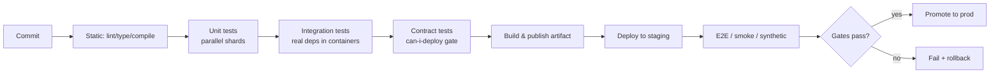
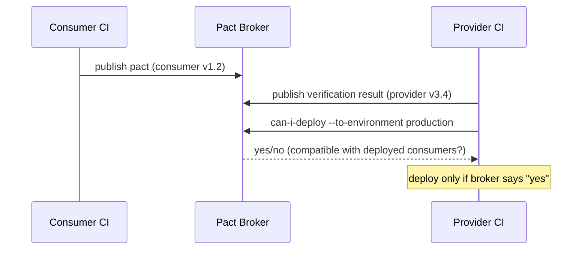

# Testing Strategy in CI/CD

> [!INTERVIEW]
> This topic is about **where tests run in the delivery pipeline** and how they act
> as **gates** — staging, fail-fast ordering, parallelization, test selection, flaky
> quarantine, contract/can-i-deploy gates, and post-deploy smoke checks. It is **not**
> about the testing discipline itself (test-double taxonomy, JUnit/mocking, how to
> write a good unit test). For that, see the dedicated **testing** domain. Here the
> lens is always: *does this make the pipeline fast, trustworthy, and safe to
> auto-promote?*

---

## Where tests fit in the pipeline

A CI/CD pipeline runs tests in **progressively more expensive, more realistic
stages**. The ordering principle is **fail fast**: cheap, high-signal tests run first
so a broken commit is rejected in seconds, not after a 40-minute integration suite.

The canonical ordering, cheapest/fastest first:

1. **Static checks** — lint, format, type-check, compile. Sub-second to seconds. No app needed.
2. **Unit tests** — pure logic, no I/O, run in parallel. Seconds to a couple of minutes.
3. **Integration / component tests** — real DB, message broker, or HTTP dependency
   (often via containers/Testcontainers). Minutes.
4. **Contract tests** — verify provider/consumer message shapes without a full environment.
5. **End-to-end (E2E) / acceptance tests** — the whole system wired together, usually
   against a deployed staging environment. Slow and the flakiest.
6. **Deploy** to an environment.
7. **Post-deploy smoke / synthetic tests** — a handful of checks against the *running,
   deployed* system to confirm the release is healthy before promotion.



> [!KEY-TAKEAWAY]
> Order stages by **cost × failure probability**: put the tests that are cheap and
> most likely to catch a mistake first. The pipeline is a filter — each stage should
> reject as many bad builds as possible before you spend money on the next.

This mirrors the **test pyramid** (Mike Cohn / Martin Fowler): many fast unit tests at
the base, fewer integration tests in the middle, very few slow E2E tests at the top.
An **inverted pyramid** (mostly E2E) produces slow, flaky pipelines that engineers
learn to ignore.

---

## Fail-fast and stage gating

**Fail-fast** means the pipeline stops (or at least blocks promotion) at the first
failing gate rather than running everything and reporting at the end. It saves compute
and shortens the feedback loop.

Mechanics differ by tool:

- **GitHub Actions**: jobs run in parallel by default; use `needs:` to sequence them so
  a downstream job only runs after upstream success. Within a matrix, `fail-fast: true`
  (the default) cancels sibling matrix jobs when one fails.
- **GitLab CI**: `stages:` run sequentially; a stage only starts if the previous stage
  succeeded. `needs:` creates a DAG so independent jobs can start early.
- **Jenkins**: declarative `stage` blocks run in order; `failFast true` in a `parallel`
  block aborts siblings on first failure.

```yaml
# GitHub Actions — fail-fast ordering via needs:
jobs:
  lint:      { runs-on: ubuntu-latest, steps: [ ... ] }
  unit:
    needs: lint
    runs-on: ubuntu-latest
    steps: [ ... ]
  integration:
    needs: unit        # only runs if unit passed
    runs-on: ubuntu-latest
    steps: [ ... ]
```

> [!TIP]
> Fail-fast is a trade-off. Cancelling all matrix jobs on the first failure gives quick
> feedback but hides *other* failures (you fix one, rerun, discover the next). For a
> "tell me everything that's broken" run — e.g. a nightly cross-version matrix — set
> `fail-fast: false`. Use fail-fast on PR/pre-merge runs, full runs on scheduled builds.

---

## Quality gates and coverage thresholds

A **quality gate** is a pass/fail condition that blocks promotion: coverage below a
threshold, new critical SAST findings, failing tests, mutation score too low, etc.
The gate turns "we measured it" into "the pipeline enforces it."

**Coverage thresholds** are the most common gate. Guidance for interviews:

- **Fail the build below a floor** (e.g. line coverage < 80%) to prevent regressions.
- Prefer a **"coverage on new/changed code" (diff coverage / patch coverage)** gate
  (SonarQube's "Clean as You Code", Codecov patch status) over a single global number.
  A global 80% target lets untested new code hide behind a large tested legacy base.
- Coverage is a **necessary-not-sufficient** signal. 100% line coverage with no
  assertions tests nothing. **Mutation testing** (PIT, Stryker) measures whether tests
  actually *catch* injected bugs and is a stronger gate — but slower, so it's often a
  nightly/periodic gate rather than per-PR.

```yaml
# SonarQube "Quality Gate" concept — pipeline fails if gate status != OK
# Typical "Sonar way" conditions on NEW code:
#   - Coverage on New Code >= 80%
#   - Duplicated Lines on New Code < 3%
#   - 0 new Blocker/Critical issues
#   - Security Hotspots Reviewed = 100%
```

> [!WARNING]
> Ratcheting a global coverage number upward on a legacy codebase is demoralizing and
> gameable (people add assertion-free tests). Gate on the **diff**: "new code must be
> ≥ X% covered." The overall number then drifts up naturally.

---

## Parallelization, sharding, and test splitting

Wall-clock time — not CPU time — is what engineers feel. The main lever is
**parallelization**: split the suite across N runners so total time ≈ (serial time / N)
plus overhead.

Two distinct axes:

| Technique | What it splits | Example |
|---|---|---|
| **Sharding / test splitting** | One test suite across N machines | Jest `--shard=1/4`, CircleCI `circleci tests split`, Playwright `--shard` |
| **Matrix / fan-out** | Same suite across configs (OS, versions) | GH Actions `strategy.matrix` |

**Balancing shards matters.** Naive splitting (alphabetical, or by file count) leaves
one runner with all the slow tests while others idle. Good splitters use **historical
timing data** to balance so every shard finishes at roughly the same time.

```yaml
# GitHub Actions — shard a suite across 4 runners
strategy:
  matrix:
    shard: [1, 2, 3, 4]
steps:
  - run: npx jest --shard=${{ matrix.shard }}/4
```

> [!TIP]
> Parallelism has diminishing returns: fixed per-job overhead (checkout, dependency
> install, container pulls) is paid *per runner*. Going from 2 to 20 shards can make
> things *slower* if each shard spends 90s booting to run 10s of tests. Cache
> dependencies and measure the crossover point.

Independent of sharding, use **intra-process parallelism** (JUnit 5 parallel execution,
`pytest-xdist`, Go's `t.Parallel()`) to use all cores on each runner. This requires
tests to be **isolated** (no shared mutable state, unique DB schemas/temp dirs).

---

## Test selection and test impact analysis

Running the *entire* suite on every commit doesn't scale in a large monorepo. **Test
selection** (a.k.a. **Test Impact Analysis / Predictive Test Selection**) runs only the
tests **affected by the change**, based on a dependency graph between code and tests.

Approaches:

- **Build-graph based**: Bazel / Gradle / Nx / Turborepo know the dependency graph, so
  `bazel test //...` combined with target diffing runs only downstream-affected targets.
- **Coverage-map based**: record which tests exercise which files; on a diff, select
  tests whose coverage touched the changed files (e.g. .NET/`dotnet test` impacted,
  Ekstazi, Launchable, Microsoft's research-based predictive selection).
- **Change-scope based**: in a monorepo, only run the pipeline for packages whose files
  changed (`paths:` filters, Nx `affected`).

```yaml
# GitLab CI — only run a job when relevant paths change
test-billing:
  rules:
    - changes:
        - services/billing/**/*
```

> [!WARNING]
> Test selection trades **safety for speed**: if the impact graph is wrong (reflection,
> config-driven wiring, DI, dynamic imports), you can skip a test that *would* have
> failed and ship a bug. Mitigate by running the **full suite** on the main branch /
> pre-merge / nightly, and using selection only for fast PR feedback. Never let
> selection be the *only* place a test ever runs.

> [!KEY-TAKEAWAY]
> Selection = "run fewer tests"; sharding = "run the same tests on more machines." They
> compose: select the affected tests, then shard those across runners.

---

## Flaky tests: quarantine and retry policy

A **flaky test** passes or fails non-deterministically on the *same* code — caused by
timing/races, test-order dependence, shared state, network calls, time/timezone, or
random data. Flakes are corrosive: they erode trust ("just rerun it"), and a real
failure hides among the noise.

**Pipeline-level tactics** (distinct from *fixing* the test, which is the test domain's job):

- **Automatic retry** of failed tests (`--retries`, JUnit `@RepeatedTest`, pytest-rerunfailures,
  Playwright `retries`). Pragmatic but dangerous: it **masks** flakiness and can hide a
  genuine intermittent bug. Cap retries (1–2), and *record* that a retry happened.
- **Quarantine**: move a known-flaky test into a separate lane that runs but does **not
  block** the pipeline, while still reporting. This keeps the main gate green and
  trustworthy without deleting coverage. The test stays quarantined until fixed, with a
  tracking ticket and an SLA.
- **Flake detection / scoring**: CI platforms (GitHub, GitLab "flaky test" detection,
  Datadog CI, BuildPulse) re-run or analyze history to flag tests that fail
  intermittently and auto-quarantine above a threshold.

> [!WARNING]
> Blanket "retry the whole job 3× until green" is an anti-pattern — it hides real
> intermittent product bugs (races in the code under test) and multiplies CI cost.
> Retry at the **individual test** granularity, surface a flake report, and quarantine
> rather than silently re-run forever.

```yaml
# Quarantine pattern: flaky tests tagged/excluded from the blocking run,
# run separately as non-blocking.
blocking-tests:   { run: pytest -m "not flaky" }        # gates the merge
flaky-watch:      { run: pytest -m flaky, allow_failure: true }  # reports only
```

---

## Contract testing and the can-i-deploy gate

**Contract tests** verify that a **consumer** and **provider** agree on the shape of
their interaction (HTTP/JSON, messages) **without** standing up both services in one
environment. Tools: **Pact** (consumer-driven), **Spring Cloud Contract**. This gives
E2E-like integration confidence at unit-test speed — the key reason they belong in the
pipeline instead of a slow, brittle end-to-end suite.

Flow (consumer-driven, Pact):

1. **Consumer** test runs against a mock provider and generates a **pact** (contract) file.
2. The pact is published to a **Pact Broker** (or PactFlow), tagged with the app version
   and branch.
3. The **provider** pipeline verifies it can satisfy every consumer's pact.
4. Before deploying, the pipeline runs **`can-i-deploy`**: it asks the broker "given the
   versions already in `production`, is this version compatible with all its integration
   partners?" — and **blocks the deploy** if any contract is unsatisfied.



```bash
# The gate: exits non-zero (fails the stage) if not safe to deploy
pact-broker can-i-deploy \
  --pacticipant Billing \
  --version $GIT_SHA \
  --to-environment production
```

> [!KEY-TAKEAWAY]
> `can-i-deploy` decouples deploys: you can ship provider and consumer independently
> because the broker enforces compatibility. It answers "will I break someone currently
> in prod?" — a gate a full E2E suite would answer far more slowly and flakily.

---

## Post-deploy smoke and synthetic tests

Passing tests in CI does **not** prove the *deployed* system works — config, secrets,
DNS, network policy, and infra differ from CI. So after deploying (to staging or prod),
run a small, fast set of checks against the **running system**.

- **Smoke tests**: a shallow "is it alive and serving?" set — health endpoint returns
  200, can log in, homepage renders, a canonical read/write path works. Run immediately
  post-deploy; failure triggers **rollback** before promotion.
- **Synthetic monitoring**: the same idea run **continuously in production** on a
  schedule from outside (Datadog Synthetics, Grafana/k6, Pingdom, CloudWatch Synthetics
  canaries) to catch regressions between deploys and measure user-facing availability/latency.

Post-deploy checks are the natural pairing with **progressive delivery**: run smoke
tests against the canary/blue-green target; automated **canary analysis** (Argo
Rollouts, Flagger, Spinnaker/Kayenta) compares the new version's error rate and latency
to baseline and auto-promotes or auto-rolls-back.

> [!TIP]
> Keep the post-deploy smoke set tiny (seconds) and **non-destructive** if it runs
> against prod. It's a go/no-go gate, not a regression suite. Deep functional testing
> belongs earlier (staging E2E); the deploy-time check just confirms *this deployment*
> in *this environment* is healthy.

For how these checks tie into metrics, deploy markers, and SLO alerting, see the
`monitoring-and-observability` topic in this domain (and the dedicated **observability**
domain for the signal internals).

---

## Performance and security tests in the pipeline

Beyond correctness, mature pipelines gate on **non-functional** properties:

- **Performance / load tests** (k6, Gatling, JMeter, Locust): run a *smoke-level* load
  test per pipeline (short, low load, assert p95 latency / error-rate thresholds) and
  full soak/stress tests nightly. A **performance budget** (e.g. p99 < 300 ms, or
  Lighthouse budgets for frontends) becomes a gate that fails the build on regression.
- **Security tests in the pipeline** — **SAST** (static code analysis: CodeQL,
  Semgrep, SonarQube), **SCA** (dependency/CVE scan: Dependabot, Snyk, Trivy, `npm/pip
  audit`), **DAST** (dynamic scan of a running app: OWASP ZAP), **secret scanning**
  (gitleaks, TruffleHog), and **IaC scanning** (tfsec, Checkov, KICS).

> [!INTERVIEW]
> Security-in-the-pipeline mechanics (SAST/DAST/SCA/IaC scan, where each runs, how to
> triage) are covered in depth in this domain's **`devsecops-and-pipeline-security`**
> topic; the OWASP/crypto discipline lives in the **security** domain. Here just know
> *that* they are pipeline stages/gates and roughly where they sit (SAST/SCA/secret-scan
> early and fast; DAST needs a deployed target so it runs post-deploy against staging).

> [!WARNING]
> Non-functional gates are prone to **noise**. Load-test results vary with shared CI
> hardware; security scanners produce false positives. Gate on **thresholds/deltas with
> tolerance**, allow documented suppressions with expiry, and don't let a flaky perf run
> block every merge — or engineers will disable the gate.

---

## Test result reporting and trends

A pipeline should make results **visible and actionable**, not bury them in logs.

- **Machine-readable reports**: publish **JUnit XML** (the de-facto standard consumed by
  GitHub, GitLab, Jenkins, Bitbucket), or Cucumber/TAP/Allure. CI renders pass/fail per
  test, surfaces the failing assertion, and links artifacts (screenshots, logs).
- **Trends over time**: track pass rate, duration, flake rate, and coverage across runs
  (Jenkins Test Results Trend, GitLab test reports, Allure history, Datadog CI
  Visibility). Trends reveal a **slowly rotting suite** or a **creeping slowdown** long
  before it becomes a crisis.
- **Annotations & PR feedback**: surface failures inline on the PR (GitHub Checks
  annotations, coverage diff comments) so developers fix without digging through logs.

```yaml
# GitLab CI — surface JUnit results in the MR widget
unit:
  script: pytest --junitxml=report.xml
  artifacts:
    when: always            # collect even on failure
    reports:
      junit: report.xml
```

> [!TIP]
> `artifacts: when: always` (GitLab) / `if: always()` (GitHub Actions) is critical: by
> default artifact/report upload steps are skipped when a prior step fails — which is
> exactly when you most need the report. Always upload test reports even on failure.

---

## Keeping the suite fast

Fast pipelines are a first-class engineering goal — DORA's research ties **fast feedback
and short lead time** to elite delivery performance. Slow suites get skipped, disabled,
or bypassed. Levers, roughly in order of impact:

- **Right-size the pyramid**: replace slow E2E with cheaper contract/integration/unit
  tests where possible. Most confidence should come from the fast layers.
- **Parallelize & shard** across runners; use all cores per runner.
- **Cache** dependencies, build outputs, and container layers; use **remote build
  caches** (Bazel, Gradle, Nx, Turborepo) so unchanged targets aren't rebuilt/retested.
- **Test selection / impact analysis** on PRs; full suite on main/nightly.
- **Kill or quarantine flakes** so nobody wastes cycles on reruns.
- **Fail fast**: cheap gates first.
- **Split fast vs. slow lanes**: a required "fast" gate (< ~10 min) blocks merge; a
  "full" lane runs post-merge/nightly.

> [!KEY-TAKEAWAY]
> A common target: **PR feedback under ~10 minutes**. Beyond that, developers
> context-switch and the batch of changes per run grows, which makes failures harder to
> localize. Optimize the *critical path to merge*, not total CPU time.

---

## Test environments and data management

Realistic tests need realistic dependencies, but shared long-lived environments are a
classic bottleneck (contention, drift, "works on staging"). Modern practice:

- **Ephemeral / on-demand environments**: spin up a fresh environment per PR (preview
  environments, `vcluster`, Docker Compose, Kubernetes namespaces) and tear it down
  after. Eliminates cross-test interference and "who broke staging."
- **Containers as dependencies**: **Testcontainers** starts a real Postgres/Kafka/Redis
  in a container inside the test run — real behavior, disposable, no shared server.
- **Service virtualization / mocks**: stub *external, third-party* dependencies you
  don't control (WireMock, Mountebank) so tests are deterministic and don't hit vendor
  rate limits.
- **Test data**: seed deterministic fixtures; isolate per test (unique schema/tenant);
  avoid depending on prod-copied data (privacy + flakiness). Reset state between runs so
  tests are **idempotent and order-independent**.

> [!WARNING]
> A single shared staging environment that every pipeline deploys to serially is a
> throughput killer and a flakiness source: one team's bad deploy fails everyone's E2E.
> Ephemeral per-change environments (or hermetic container-backed tests) trade a bit of
> spin-up cost for isolation and parallelism.

---

## Pointer: the testing discipline itself

This topic covers *pipeline mechanics*. The **testing** domain owns the craft:

- Test-double taxonomy (stub/mock/fake/spy), test structure (AAA), unit vs. integration boundaries.
- How to write good assertions, TDD/BDD, property-based testing.
- Framework specifics (JUnit, pytest, etc.) and the performance-testing discipline.

Cross-reference it when an interviewer pivots from "where do tests run in your pipeline"
to "how do you write a good test / mock a dependency."

---

## Common follow-up questions

- **"Your PR pipeline takes 45 minutes. Walk me through how you'd cut it."**
  Measure first (which stages dominate); right-size the pyramid; parallelize/shard with
  timing-balanced splits; cache deps/build; add test impact analysis on PRs with full
  suite on main; quarantine flakes; split a fast required lane from a full post-merge lane.

- **"A test passes locally and in CI 90% of the time. What do you do?"**
  It's flaky — quarantine it (non-blocking lane, tracking ticket) to protect the gate,
  add bounded per-test retry with a flake report, then fix the root cause (timing, shared
  state, order dependence). Don't blanket-retry the whole job.

- **"How do you deploy a provider service without breaking its consumers?"**
  Consumer-driven contract tests (Pact) + a `can-i-deploy` gate against the broker that
  checks compatibility with the versions currently in production; block the deploy if any
  contract is unsatisfied.

- **"CI is green but the deploy still broke prod. Why, and how do you catch it?"**
  CI tests artifacts, not the deployed environment (config/secrets/DNS/infra differ). Add
  post-deploy smoke tests and synthetic monitoring; use canary analysis to auto-rollback.

- **"Coverage is 85% but bugs still ship. Is the number wrong?"**
  Coverage measures execution, not assertion quality. Gate on *diff* coverage, and use
  mutation testing to measure whether tests actually catch injected faults.

- **"When would you set `fail-fast: false`?"**
  On a nightly/cross-version matrix where you want the *full* list of what's broken, not
  just the first failure. On PR runs, keep fail-fast on for quick feedback.

---

## References

- DORA / *Accelerate* (Forsgren, Humble, Kim) — fast feedback, CI, test automation as
  drivers of delivery performance: <https://dora.dev/> and *Accelerate* (IT Revolution, 2018).
- Martin Fowler — Test Pyramid: <https://martinfowler.com/bliki/TestPyramid.html>
- Martin Fowler — Continuous Integration & self-testing code: <https://martinfowler.com/articles/continuousIntegration.html>
- Martin Fowler / Toby Clemson — Contract Test & Consumer-Driven Contracts:
  <https://martinfowler.com/bliki/ContractTest.html>
- Pact docs — `can-i-deploy` and the Pact Broker: <https://docs.pact.io/pact_broker/can_i_deploy>
- Google Testing Blog — flaky tests: <https://testing.googleblog.com/2016/05/flaky-tests-at-google-and-how-we.html>
- GitHub Actions — using a matrix / `fail-fast`: <https://docs.github.com/actions>
- GitLab CI — unit test reports & `rules:changes`: <https://docs.gitlab.com/ee/ci/testing/>
- SonarQube — Quality Gates & "Clean as You Code": <https://docs.sonarsource.com/>
- k6 / Testcontainers docs: <https://k6.io/docs/> · <https://testcontainers.com/>
