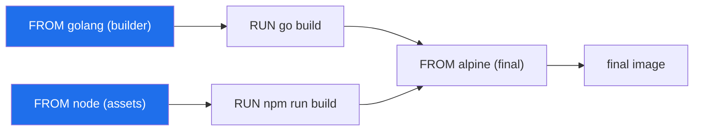
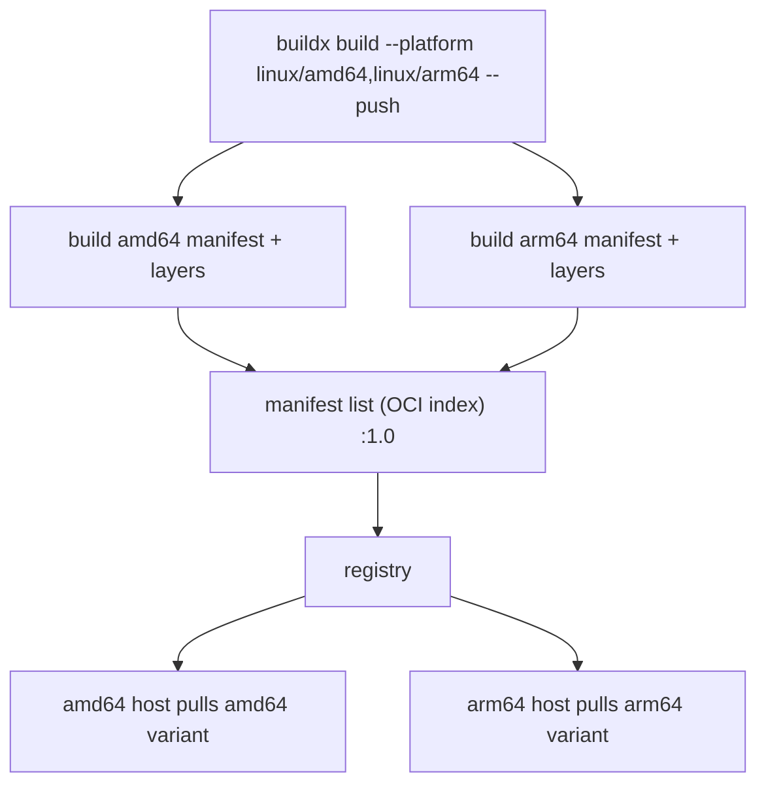

# BuildKit & Advanced Builds

For years `docker build` used a single-threaded "legacy" builder that executed a Dockerfile
top-to-bottom, one instruction at a time, guessing at cache validity by comparing image
histories. **BuildKit** is the modern replacement — a concurrent, content-addressable build
engine that runs independent work in parallel, caches with exact checksums, streams only the
files it needs from the build context, and adds capabilities the old builder never had:
cache mounts, secret/SSH mounts, heredocs, multi-platform images, exportable registry cache,
and build attestations (SBOM/provenance).

BuildKit is now the **default builder** for Docker Desktop and Docker Engine on Linux
containers. This topic assumes you already understand layers and the build cache
(`dockerfile-layers-build-cache`) and multi-stage builds (`multi-stage-builds-image-optimization`);
here we go one level deeper into the engine and the advanced `buildx` features senior
engineers are expected to know.

> [!KEY-TAKEAWAY]
> BuildKit turns a Dockerfile into a **dependency graph (LLB)** instead of a linear script.
> That single change unlocks everything else: parallel stages, precise checksum-based
> caching, skipping unused stages, and pluggable mounts/frontends. When you hit a build
> feature that "the old builder couldn't do," the reason is almost always the graph model.

---

## BuildKit vs the legacy builder

The **legacy builder** (the classic `docker build` engine) processes a Dockerfile
sequentially: each instruction produces an intermediate container and image, cache validity
is decided by heuristics on image history, and the *entire* build context is sent to the
daemon up front as a tarball. Multi-stage builds run stage after stage even when they don't
depend on each other.

**BuildKit** reworks all of this:

| Aspect | Legacy builder | BuildKit |
|---|---|---|
| Execution | Sequential, instruction-by-instruction | Concurrent graph solver — independent steps run in parallel |
| Unused stages | Still built | Detected and **skipped** |
| Cache validity | Heuristics over image history | Exact **checksums** of inputs + content mounted per op |
| Build context | Whole context tarball sent up front | Incremental — only changed/needed files streamed |
| Intermediate images | Creates them as side effects | No leftover intermediate images/containers |
| Secrets | Leak into layers via ARG/COPY | `--mount=type=secret` never lands in a layer |
| Advanced mounts | None | cache / bind / secret / ssh / tmpfs |
| Multi-platform | No | `buildx --platform` manifest lists |
| Cache export | No | `--cache-to`/`--cache-from` to registry/local/gha |

Because BuildKit resolves a Dockerfile into a **content-addressable dependency graph**, it
can prune work that doesn't affect the requested output, deduplicate identical operations,
and parallelize anything not on a dependency chain.

> [!INTERVIEW]
> "What does BuildKit give you over the old builder?" Strong answer names three concrete
> wins: **parallelism** (concurrent stage/step execution), **better caching** (checksum-based,
> plus exportable/importable remote cache), and **new mount types** (cache/secret/ssh). Bonus:
> multi-platform builds and skipping unused stages. A weak answer just says "it's faster."

---

## LLB: the low-level build graph

Under the hood BuildKit doesn't execute Dockerfile instructions directly. A **frontend**
compiles your Dockerfile into **LLB (Low-Level Build)** — an intermediate binary format that
describes a **content-addressable dependency graph** of operations (run this command, mount
this, copy these files). BuildKit's **solver** then executes that graph.

Consequences of the graph model:

- **Parallelism is automatic.** Two multi-stage branches that don't depend on each other run
  concurrently. You don't ask for it; the solver derives it from the graph.
- **Caching is by content, not history.** Each vertex is keyed by a checksum of its inputs
  (parent state, command, mounted content). Identical inputs → cache hit, regardless of what
  else changed in the file.
- **Dead code is eliminated.** A stage no other stage `COPY --from`s and that isn't the build
  target is simply not executed.



Here the `builder` and `assets` branches have no edge between them, so BuildKit runs
`go build` and `npm run build` **in parallel**, then joins at the final stage.

---

## Enabling BuildKit and buildx

On modern Docker (Docker Desktop, Engine on Linux) BuildKit is the **default**, so plain
`docker build` already uses it. Ways it gets selected or forced:

- **`DOCKER_BUILDKIT=1 docker build .`** — explicitly enable BuildKit on an engine where it
  isn't the default (older engines). `DOCKER_BUILDKIT=0` forces the legacy builder.
- **`docker buildx build .`** — `buildx` is the CLI plugin that exposes BuildKit's full
  feature set (multi-platform, cache export, multiple builder instances). `docker build` is
  effectively an alias for the default buildx builder for common cases.

**Builder drivers** matter for advanced features:

| Driver | Where BuildKit runs | Multi-platform | Registry/local cache export |
|---|---|---|---|
| `docker` (default) | Inside the Docker daemon | Only with containerd image store | Limited (inline/local/registry/gha only with containerd store) |
| `docker-container` | A dedicated BuildKit container | Yes (with QEMU) | Yes (all backends) |
| `kubernetes` | Pods in a cluster | Yes | Yes |
| `remote` | A remote BuildKit instance | Yes | Yes |

Create a richer builder with:

```bash
docker buildx create --name mybuilder --driver docker-container --use
docker buildx inspect --bootstrap
```

> [!WARNING]
> Many "why doesn't this work?" build problems come down to the **default `docker` driver**.
> It can't produce a multi-platform manifest list (without the containerd image store) and
> can't export `--cache-to type=registry` cache. Switch to `docker-container` for those.

---

## RUN --mount=type=cache — persistent build caches

`RUN --mount=type=cache,target=<dir>` mounts a **persistent directory that survives across
builds** but is **not** part of the resulting image. It's the right way to cache package
manager downloads / compiler artifacts so rebuilds only fetch what changed.

```dockerfile
# syntax=docker/dockerfile:1
FROM node:20
WORKDIR /app
COPY package*.json ./
RUN --mount=type=cache,target=/root/.npm \
    npm ci
COPY . .
```

Even when the `npm ci` layer's cache is invalidated (e.g. `package.json` changed), the
`~/.npm` download cache is reused, so only new/changed packages are fetched over the network.

Other examples:

```dockerfile
# Go module + build cache
RUN --mount=type=cache,target=/go/pkg/mod \
    --mount=type=cache,target=/root/.cache/go-build \
    go build -o /app ./...

# apt — disable the auto-clean and use a locked cache so parallel builds serialize
RUN --mount=type=cache,target=/var/cache/apt,sharing=locked \
    --mount=type=cache,target=/var/lib/apt,sharing=locked \
    apt-get update && apt-get install -y --no-install-recommends curl
```

`sharing` controls concurrent access:

- `sharing=shared` (default) — multiple builds use the cache simultaneously.
- `sharing=locked` — builds acquire a lock and wait (needed when the tool requires exclusive
  access to its cache, like apt's dpkg database).
- `sharing=private` — each build gets its own separate cache instance.

> [!TIP]
> A cache mount is **not** the same as a layer. It is not committed to the image and not part
> of layer caching — it's a scratchpad that persists on the builder between builds. That's why
> it shrinks images (downloads don't land in a layer) *and* speeds rebuilds.

---

## RUN --mount=type=bind — mounting context without a COPY layer

`RUN --mount=type=bind` mounts a file or directory from the build context (or another stage)
into the `RUN` step **without creating a COPY layer**. It's read-only by default and its
contents are **not persisted** in the image — only the command's output is.

```dockerfile
# syntax=docker/dockerfile:1
FROM golang:1.22
WORKDIR /src
RUN --mount=type=bind,target=. \
    --mount=type=cache,target=/root/.cache/go-build \
    go build -o /bin/app ./cmd/app
```

Here the source tree is bind-mounted just for the build; nothing is copied into a layer, so a
large context used only to produce one binary doesn't bloat the image or its cache. You can
also bind-mount from an earlier stage with `from=<stage>`:

```dockerfile
RUN --mount=type=bind,from=builder,source=/out,target=/in cp /in/app /app
```

Even with the `rw` option, writes to a bind mount are discarded after the instruction — they
never reach the final image or the build cache.

---

## RUN --mount=type=secret — secrets that never hit a layer

Passing secrets via `ARG`/`ENV` or `COPY` bakes them into image layers and history where
anyone with the image can extract them. `--mount=type=secret` mounts a secret file into a
single `RUN` step; it is **never written to a layer, image, or build cache**.

```dockerfile
# syntax=docker/dockerfile:1
FROM alpine
RUN --mount=type=secret,id=npmrc,target=/root/.npmrc \
    npm install
```

Supply the secret at build time from a file or environment variable:

```bash
docker buildx build --secret id=npmrc,src=$HOME/.npmrc .
docker buildx build --secret id=aws,env=AWS_SECRET_ACCESS_KEY .
```

By default the secret mounts at `/run/secrets/<id>`; use `target=` to place it elsewhere, and
`required=true` to fail the build if it isn't provided. The secret exists only for the
lifetime of that `RUN` and leaves no trace in `docker history` or the layers.

> [!WARNING]
> A classic leak: `ARG TOKEN` + `RUN git clone https://$TOKEN@...`. The token is visible in
> `docker history` and in the layer. Use `--mount=type=secret` (or `type=ssh`) instead —
> never `ARG`/`ENV` for secrets. Squashing or multi-stage does **not** reliably scrub an ARG
> secret from history.

---

## RUN --mount=type=ssh — private git and SSH auth

`--mount=type=ssh` forwards your host SSH agent socket into a `RUN` step so it can, e.g.,
`git clone` a private repository or `pip install` from a private VCS — without copying keys
into the image.

```dockerfile
# syntax=docker/dockerfile:1
FROM alpine
RUN apk add --no-cache openssh-client git
RUN mkdir -p ~/.ssh && ssh-keyscan github.com >> ~/.ssh/known_hosts
RUN --mount=type=ssh \
    git clone git@github.com:acme/private-repo.git
```

```bash
# forward the agent (assumes ssh-agent is running with keys loaded)
docker buildx build --ssh default .
```

The private key stays in the host agent; only the agent *socket* is exposed to the build, and
only for that instruction. Nothing key-related is committed to a layer.

---

## Heredocs in Dockerfiles

BuildKit's Dockerfile frontend supports **heredoc** syntax, letting you write multi-line
`RUN` scripts and inline file contents without long `&&` chains or `echo` pipelines.

```dockerfile
# syntax=docker/dockerfile:1
FROM ubuntu:24.04

# multi-line RUN as one layer, one shell
RUN <<EOF
set -eux
apt-get update
apt-get install -y --no-install-recommends ca-certificates
rm -rf /var/lib/apt/lists/*
EOF

# write a file inline (COPY heredoc)
COPY <<EOF /app/config.yaml
server:
  port: 8080
EOF
```

> [!TIP]
> Add `set -e` (or `set -eux`) at the top of a heredoc `RUN`. Without it, each line runs but a
> failure mid-script may not fail the build — unlike a `&&`-chained `RUN` where any failure
> stops the chain. Heredocs improve readability but you own the error handling.

---

## The syntax directive and frontends

The first line of a modern Dockerfile is often:

```dockerfile
# syntax=docker/dockerfile:1
```

This **syntax directive** tells BuildKit which **frontend** image to use to parse the file. A
frontend is the component that compiles a human-readable format (the Dockerfile) into LLB.
Because the frontend is a versioned, downloadable image, you get new Dockerfile features (like
`--mount`, heredocs, new flags) **without upgrading the Docker Engine** — BuildKit pulls the
pinned frontend image at build time.

- `docker/dockerfile:1` — the recommended, stable channel; auto-updates to the latest 1.x.
- `docker/dockerfile:1.7` — pin a minor version for reproducibility.
- The directive must be a comment **before** any other instruction (before `FROM`).

Frontends are also how BuildKit supports **non-Dockerfile** build definitions entirely — any
tool that emits LLB (or ships as a frontend image) can drive a build.

> [!INTERVIEW]
> "Why put `# syntax=docker/dockerfile:1` at the top?" Because it pins the **frontend**, so
> advanced syntax (`RUN --mount`, heredocs, secrets) works on any BuildKit engine regardless
> of the engine's bundled parser version — the feature travels with the frontend image, not
> the daemon.

---

## Multi-platform builds with buildx

A **multi-platform image** is a single tag backed by a **manifest list** (OCI image index)
pointing to per-architecture manifests. When a host pulls it, Docker automatically selects the
variant matching its CPU/OS (e.g. `linux/arm64` on Apple Silicon or Graviton, `linux/amd64`
on x86).

```bash
docker buildx build --platform linux/amd64,linux/arm64 -t acme/app:1.0 --push .
```

Three ways to produce the non-native architecture:

1. **QEMU emulation** — zero Dockerfile changes; BuildKit runs foreign-arch steps under QEMU
   user-mode emulation. Simplest but **slow** for compile-heavy work.
2. **Native nodes** — attach real amd64 and arm64 builders (`--append`) so each arch builds
   natively. Fast, more setup.
3. **Cross-compilation** — use `--platform=$BUILDPLATFORM` on the builder stage and the
   compiler's own cross-compile support. Fastest for languages like Go/Rust.

BuildKit injects predefined build args:

- `BUILDPLATFORM` / `BUILDOS` / `BUILDARCH` — the **builder's** native platform.
- `TARGETPLATFORM` / `TARGETOS` / `TARGETARCH` / `TARGETVARIANT` — the **target** being built.

```dockerfile
# syntax=docker/dockerfile:1
FROM --platform=$BUILDPLATFORM golang:1.22 AS build
ARG TARGETOS TARGETARCH
WORKDIR /src
COPY . .
RUN GOOS=$TARGETOS GOARCH=$TARGETARCH go build -o /app ./...

FROM alpine
COPY --from=build /app /app
ENTRYPOINT ["/app"]
```

Pinning the build stage to `$BUILDPLATFORM` means the toolchain runs **natively** and only
cross-compiles the output — avoiding slow QEMU emulation of the whole compiler.

> [!WARNING]
> Multi-platform requires the `docker-container` (or `kubernetes`/`remote`) driver, or the
> containerd image store. And `--load` can only import a **single** platform into the local
> engine — a manifest list must be `--push`ed to a registry, since the classic image store
> can't hold a manifest list locally.



---

## Remote / registry cache (--cache-to & --cache-from)

BuildKit's local cache lives on the builder host. In CI, builders are often ephemeral, so you
export the cache to a shared backend and import it on the next run to get cache hits across
machines.

```bash
docker buildx build \
  -t acme/app:1.0 --push \
  --cache-to   type=registry,ref=acme/app:buildcache,mode=max \
  --cache-from type=registry,ref=acme/app:buildcache .
```

Cache backends:

| Backend | Where cache lives | Notes |
|---|---|---|
| `inline` | Embedded in the pushed image | Simplest; **min mode only** (can't cache intermediate layers) |
| `registry` | A separate image in a registry | Recommended for CI; supports `mode=max` |
| `local` | A local directory | Good for self-hosted runners with a persistent volume |
| `gha` | GitHub Actions cache | For GitHub-hosted CI |
| `s3` / `azblob` | Object storage | For custom CI infra |

**`mode` controls what gets exported** (all backends except inline):

- `mode=min` (default) — cache only the layers that end up in the final image.
- `mode=max` — cache **all** layers including intermediate/multi-stage build steps → far more
  cache hits, at the cost of a larger cache to push/pull.

> [!TIP]
> `type=registry,mode=max` on the `docker-container` driver is the standard CI recipe: your
> builder is thrown away each run, but the next run imports full build cache from the registry
> and skips unchanged work. `inline` cache is convenient but can't do `mode=max`, so it misses
> intermediate-stage caching.

---

## Provenance & SBOM attestations

BuildKit can attach **build attestations** to an image — signed, structured metadata stored as
extra manifests in the image index (the in-toto format):

- **Provenance** — how the image was built: the build command/frontend, source, materials,
  and (at higher levels) VCS metadata. Answers "where did this image come from?"
- **SBOM** — a Software Bill of Materials listing packages/components in the image, so scanners
  and auditors can enumerate what's inside.

```bash
docker buildx build --provenance=true --sbom=true -t acme/app:1.0 --push .
# provenance modes: min (default for pushed images) or max (full build detail)
docker buildx build --provenance=mode=max -t acme/app:1.0 --push .
```

Inspect what's attached:

```bash
docker buildx imagetools inspect acme/app:1.0 --format '{{ json .Provenance }}'
```

This is the **image-level** primitive behind supply-chain security. For the broader framework
(SLSA levels, Sigstore/cosign signing policy, verifying provenance in a pipeline) see
`devops-cicd/software-supply-chain-security`; scanning an image's SBOM/layers for CVEs with
Trivy/Grype/Docker Scout is covered in `image-scanning-supply-chain`.

> [!WARNING]
> Attestations require an exporter that supports the OCI image index (push to a registry, or
> the `oci`/`docker` exporter). The default `docker` driver's classic image store can't hold
> the attestation manifests locally — another reason CI uses `docker-container` + `--push`.

---

## docker buildx bake

`docker buildx bake` is a **build orchestrator**: instead of many `docker buildx build`
commands with long flag lists, you declare targets in an HCL/JSON/Compose file and build them
together (in parallel, with shared config) via one command.

```hcl
# docker-bake.hcl
group "default" {
  targets = ["api", "worker"]
}

target "api" {
  context    = "."
  dockerfile = "Dockerfile.api"
  tags       = ["acme/api:latest"]
  platforms  = ["linux/amd64", "linux/arm64"]
}

target "worker" {
  inherits = ["api"]           # reuse platforms etc.
  dockerfile = "Dockerfile.worker"
  tags       = ["acme/worker:latest"]
}
```

```bash
docker buildx bake                 # build the default group
docker buildx bake api --push      # build one target and push
docker buildx bake --set *.platform=linux/arm64   # override at CLI
```

Bake is to `buildx build` what Compose is to `docker run`: a declarative, version-controlled
description of a **multi-image** build, with inheritance, variables, and matrix expansion —
ideal for monorepos and CI where you build several images with shared settings.

---

## Common follow-up questions

- **Is BuildKit on by default? How do I turn it off?** Yes, it's default on Docker Desktop and
  Engine (Linux containers). Force legacy with `DOCKER_BUILDKIT=0` (or use Windows containers,
  which still use the legacy builder).
- **Cache mount vs layer cache — what's the difference?** The layer cache is the committed
  image layers keyed by instruction/inputs. A `--mount=type=cache` is a persistent scratch
  directory reused between builds that is *never committed* to the image.
- **How do I keep a secret out of the image?** `--mount=type=secret` (or `type=ssh` for git).
  Never `ARG`/`ENV`/`COPY` a secret — it survives in `docker history` and the layer.
- **Why can't I `docker load` my multi-arch image?** The classic local image store can't hold a
  manifest list; push it to a registry, or use the containerd image store. `--load` handles a
  single platform only.
- **min vs max cache mode?** `min` caches only final-image layers; `max` caches intermediate
  build stages too — more hits, bigger cache.
- **Why does my registry cache export fail on the default builder?** The `docker` driver can't
  export `type=registry` cache (without containerd store). Create a `docker-container` builder.
- **What does `# syntax=docker/dockerfile:1` do?** Pins the frontend image, so new Dockerfile
  features work regardless of the engine's built-in parser version.
- **How do I build several images at once with shared config?** `docker buildx bake` with an
  HCL/Compose file.

---

## References

- Docker docs — [BuildKit](https://docs.docker.com/build/buildkit/)
- Docker docs — [Build cache: optimize with cache mounts](https://docs.docker.com/build/cache/optimize/)
- Docker docs — [Dockerfile reference: `RUN --mount`](https://docs.docker.com/reference/dockerfile/#run---mount)
- Docker docs — [Build secrets](https://docs.docker.com/build/building/secrets/)
- Docker docs — [Multi-platform images](https://docs.docker.com/build/building/multi-platform/)
- Docker docs — [Cache storage backends (`--cache-to`/`--cache-from`)](https://docs.docker.com/build/cache/backends/)
- Docker docs — [Build attestations (provenance & SBOM)](https://docs.docker.com/build/metadata/attestations/)
- Docker docs — [`docker buildx bake`](https://docs.docker.com/build/bake/)
- Docker docs — [Builder drivers](https://docs.docker.com/build/builders/drivers/)
- moby/buildkit — [LLB and frontends](https://github.com/moby/buildkit)
