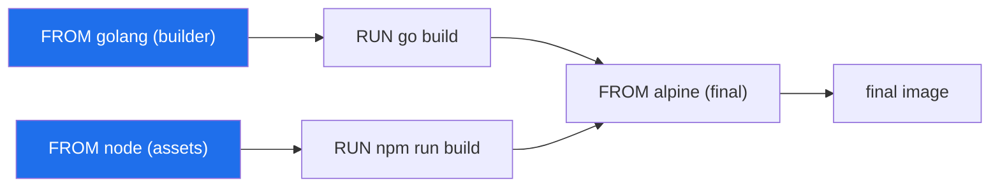
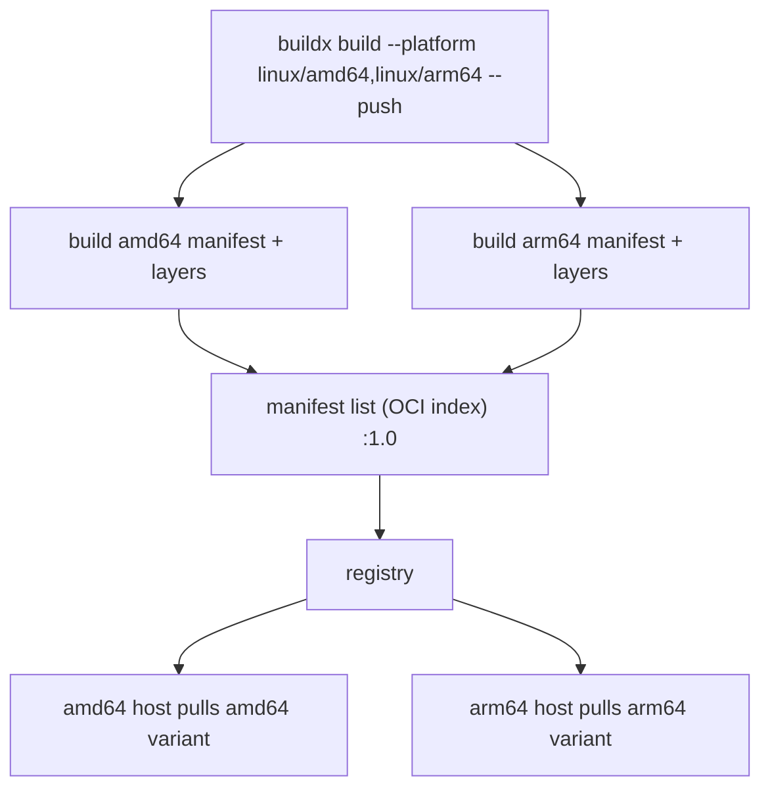

# BuildKit & Advanced Builds

The previous topic, image scanning, left two demands the legacy `docker build` engine cannot
meet: attach provenance and an SBOM — an attestation — to every image, and never let a
credential land in a layer. BuildKit is the engine that pays that bill: the credential half is
settled below under the secret and SSH mounts, the attestation half under Provenance & SBOM
attestations.

Run `docker build` on a four-stage Dockerfile with the old engine and it works strictly top to
bottom — stage one, then two, then three, then four, one instruction at a time. It does this even
when two of those stages share no files and could run at once. Edit a single line of `package.json` and
it re-downloads every npm package from scratch. BuildKit stopped doing both, and a good deal
more. The question this topic answers: once a Dockerfile becomes a dependency graph instead of
a script, what does that buy you — parallel stages, checksum-exact caching, mounts whose
contents never reach a layer, multi-architecture images, and signed build metadata?

> [!TIP]
> **Reading map.** About 18 minutes. If you already run `docker buildx` day to day and only
> want the advanced mounts, start at [RUN --mount=type=cache](#run---mounttypecache--persistent-build-caches);
> the first three sections are the engine model underneath them. The multi-platform and
> cache-export sections carry the material most likely to bite you in CI.

> [!KEY-TAKEAWAY]
> BuildKit turns a Dockerfile into a dependency graph rather than a linear script. That single
> change is behind everything else here: parallel stages, checksum-based caching, skipping
> stages nothing depends on, and pluggable mounts and frontends. Whenever a build feature looks
> like something the old builder simply could not do, the graph model is almost always why.

---

## BuildKit vs the legacy builder

The two engines differ in one thing that produces all the others: the old builder runs a
Dockerfile as a script, BuildKit runs it as a graph.

The **legacy builder** is the classic `docker build` engine, and it reads a Dockerfile the way
a shell reads a script — one instruction after the next. Each instruction starts an
intermediate container, freezes it into an intermediate image, and hands that to the next
instruction. It decides whether a cached step is still valid by comparing image histories, a
heuristic rather than a measurement. Before any of that, it ships the *entire* build context to
the daemon as one tarball. And multi-stage builds run stage after stage even when the stages
never reference each other.

BuildKit reworks each of those decisions. The question the table below answers is narrow: for
one build, what does each engine do differently, from sending the context to exporting cache?

| Aspect | Legacy builder | BuildKit |
|---|---|---|
| Execution | Sequential, instruction-by-instruction | Concurrent graph solver — independent steps run in parallel |
| Unused stages | Still built | Detected and skipped |
| Cache validity | Heuristics over image history | Exact checksums of inputs + content mounted per op |
| Build context | Whole context tarball sent up front | Incremental — only changed/needed files streamed |
| Intermediate images | Creates them as side effects | No leftover intermediate images/containers |
| Secrets | Leak into layers via ARG/COPY | `--mount=type=secret` never lands in a layer |
| Advanced mounts | None | cache / bind / secret / ssh / tmpfs |
| Multi-platform | No | `buildx --platform` manifest lists |
| Cache export | No | `--cache-to`/`--cache-from` to registry/local/gha |

Every row traces back to the same root. Because BuildKit resolves the whole Dockerfile into one
content-addressable dependency graph before running anything, it sees the entire build at once.
It can drop work that does not affect the output you asked for, run an identical operation once
and reuse the result, and start any two steps off the same dependency chain at the same time. The
old builder, holding only a running position in a script, sees none of that.

The graph model is why plain `docker build` already gives you these wins today: BuildKit is the
default builder on Docker Desktop and on Docker Engine for Linux containers, so you run the graph
engine without asking for it.

> [!INTERVIEW]
> "What does BuildKit give you over the old builder?" A strong answer names three concrete
> wins: parallelism (concurrent stage and step execution), better caching (checksum-based, plus
> cache you can export and re-import), and new mount types (cache, secret, ssh). Bonus points
> for multi-platform builds and skipping unused stages. A weak answer just says "it's faster."

The table keeps saying "graph"; the next section is what that graph actually is.

---

## LLB: the low-level build graph

BuildKit never runs your Dockerfile instructions directly; it first compiles them into a graph,
then runs the graph. The compiler is a **frontend**: the component that reads a human-readable
build file and turns it into a graph rather than executing it.

What the frontend emits is **LLB (Low-Level Build)** — a binary format that spells the build out
as a content-addressable dependency graph of small operations: run this command, mount this
directory, copy these files. Each operation is a node, and an edge means "this node needs that
node's result first."

The half that runs it is the **solver**: the component that walks the finished LLB graph and
executes each node, in whatever order and concurrency the edges permit. So the pipeline reads
Dockerfile → frontend → LLB graph → solver → image, and the graph in the middle is why the rest
of this topic is possible.

That split is the whole reason the graph model behaves the way it does. What does holding the
entire build as a graph — rather than a position in a script — change? Three things, and each
falls straight out of the structure:

- Parallelism comes for free. Two multi-stage branches with no edge between them run at the same
  time, because the solver reads the graph and sees they do not depend on each other. You never
  request it.
- Caching keys on content, not history. Each node is identified by a checksum over its inputs —
  its parent node's result, the command, the mounted content — so identical inputs hit the
  cache no matter what else in the file changed.
- Dead work disappears. A stage that no other stage `COPY --from`s, and that is not the build
  target you asked for, is a node with no path to the output, so the solver simply never runs it.



In this graph the `builder` and `assets` branches share no edge, so the solver runs `go build`
and `npm run build` at the same time, then joins them at the final stage — the shape of the graph
is the instruction.

Seeing what the engine does is one thing; the next section is how you confirm you are actually
running it, and how you reach the features that only it can offer.

---

## Enabling BuildKit and buildx

On modern Docker you are already running BuildKit, so the real question is not how to switch it
on but how to reach the features plain `docker build` keeps out of sight.

Two knobs select the engine. `DOCKER_BUILDKIT=1 docker build .` forces BuildKit on an older
engine where it is not the default; `DOCKER_BUILDKIT=0` forces the legacy builder back on
anywhere. Beyond those, the legacy builder still runs by itself in one place — Windows
containers, which BuildKit does not build.

The command that unlocks the rest is **`buildx`** — the CLI plugin that exposes BuildKit's full
feature set: multi-platform builds, cache export, and more than one builder instance at a time.
Plain `docker build` is effectively a shortcut for the default buildx builder on the common
cases; `docker buildx build .` is the same build with every advanced flag available.

Which features you actually get, though, depends on the **builder driver** — where the BuildKit
process runs and what it is allowed to do. The question to hold while reading the table is: for
each place BuildKit can run, can it build for other architectures, and can it export cache to a
registry?

| Driver | Where BuildKit runs | Multi-platform | Registry/local cache export |
|---|---|---|---|
| `docker` (default) | Inside the Docker daemon | Only with containerd image store | Limited (inline/local/registry/gha only with containerd store) |
| `docker-container` | A dedicated BuildKit container | Yes (with QEMU) | Yes (all backends) |
| `kubernetes` | Pods in a cluster | Yes | Yes |
| `remote` | A remote BuildKit instance | Yes | Yes |

The default `docker` driver is behind most "why doesn't this work?" build problems. It cannot
assemble a multi-platform manifest list unless you switch on the containerd image store, and it
cannot export cache with `--cache-to type=registry` at all. The fix in both cases is a
container-hosted builder, created once:

```bash
docker buildx create --name mybuilder --driver docker-container --use
docker buildx inspect --bootstrap
```

With the right builder selected, the mount types are where its power first shows — starting with
a cache that outlives a single build.

---

## RUN --mount=type=cache — persistent build caches

A cache mount — a directory attached with `RUN --mount=type=cache,target=<dir>` that survives
between builds and is never part of the resulting image — lets a rebuild reuse the last build's
downloads and compiled objects instead of fetching them all again.

```dockerfile
# syntax=docker/dockerfile:1
FROM node:20
WORKDIR /app
COPY package*.json ./
RUN --mount=type=cache,target=/root/.npm \
    npm ci
COPY . .
```

Even when the `npm ci` layer itself is invalidated — `package.json` changed, so that layer's
cache no longer counts — the `~/.npm` download cache mounted into the step is still there, so
only new or changed packages cross the network. The slow, cacheable part of a build, the
downloads, is decoupled from the easily-busted layer cache.

The same pattern fits any tool with its own on-disk cache — Go's module and build caches, or
`apt`'s package lists and archives:

```dockerfile
# Go module + build cache
RUN --mount=type=cache,target=/go/pkg/mod \
    --mount=type=cache,target=/root/.cache/go-build \
    go build -o /app ./...

# apt — disable the auto-clean and use a locked cache so parallel builds serialize
RUN --mount=type=cache,target=/var/cache/apt,sharing=locked \
    --mount=type=cache,target=/var/lib/apt,sharing=locked \
    apt-get update && apt-get install -y --no-install-recommends curl
```

### Where it needs care: sharing, and what a cache mount is not

The `apt` example raises the one question a shared scratch directory has to answer: what happens
when two builds want the same cache mount at once? The `sharing` option decides, and its three
values map to three answers. `sharing=shared`, the default, lets every build read and write the
cache at the same time. `sharing=locked` makes a build wait for a lock, which is what `apt`
needs because `dpkg` requires exclusive access to its database. `sharing=private` gives each
concurrent build its own separate copy of the cache, trading reuse for isolation.

None of this is layer caching, and the difference is the point. The layer cache stores committed
image layers keyed on their inputs; a cache mount is a scratchpad on the builder that is never
committed to the image. So it wins twice: the downloads never land in a layer, keeping the image
small, and they persist between builds, keeping rebuilds fast.

A cache mount keeps a tool's scratch state across builds; the next mount type does the opposite,
reaching into the build context for a single command and leaving nothing behind.

---

## RUN --mount=type=bind — mounting context without a COPY layer

A **bind mount** (the `--mount=type=bind` form) hands a single `RUN` step the build context's
files directly, so a command reads them without a `COPY` ever writing them into a layer. The
mount is read-only by default, and its contents are not persisted in the image — only whatever
the command produces is.

```dockerfile
# syntax=docker/dockerfile:1
FROM golang:1.22
WORKDIR /src
RUN --mount=type=bind,target=. \
    --mount=type=cache,target=/root/.cache/go-build \
    go build -o /bin/app ./cmd/app
```

Here the whole source tree is mounted just long enough to compile one binary, and nothing gets
copied into a layer. Compare that with `COPY . .`: a large source tree copied for a build you
throw away still lands in a layer and bloats both the image and its cache, whereas the bind
mount leaves only `/bin/app` behind. You can also bind-mount from an earlier stage instead of
the context, with `from=<stage>`:

```dockerfile
RUN --mount=type=bind,from=builder,source=/out,target=/in cp /in/app /app
```

The mount is read-only for a reason, but you can add the `rw` option when a command insists on
writing into the mounted tree. Even then the writes are thrown away when the instruction
finishes. They never reach the final image or the build cache, so `rw` buys a scratch surface for
one command, not a way to smuggle files out.

A bind mount and a cache mount both keep build-time files out of the image; the next mount type
does the same for the one kind of file that matters most — a credential.

---

## RUN --mount=type=secret — secrets that never hit a layer

A **secret mount** (`--mount=type=secret`) lets one `RUN` step read a credential that BuildKit
keeps out of every layer, the image, and the build cache. The obvious alternatives are worse.
Passing a secret through `ARG`, `ENV`, or `COPY` bakes it into a layer and the image's build
history, where anyone who pulls the image can read it back.

```dockerfile
# syntax=docker/dockerfile:1
FROM alpine
RUN --mount=type=secret,id=npmrc,target=/root/.npmrc \
    npm install
```

You supply the value at build time, from either a file or an environment variable:

```bash
docker buildx build --secret id=npmrc,src=$HOME/.npmrc .
docker buildx build --secret id=aws,env=AWS_SECRET_ACCESS_KEY .
```

The `id` is the handle that ties the CLI flag to the mount in the Dockerfile. By default the
file appears at `/run/secrets/<id>`; `target=` puts it somewhere else, and `required=true` fails
the build outright if the secret was not supplied. The file exists only while that one `RUN`
runs, so it leaves no trace in `docker history` or in any layer.

> [!WARNING]
> The classic leak is `ARG TOKEN` followed by `RUN git clone https://$TOKEN@...`: the expanded
> command, token and all, is recorded in `docker history` and sits in the layer. Reach for
> `--mount=type=secret` (or `type=ssh`) instead, and never `ARG`/`ENV` for a secret. Squashing
> the image or moving to multi-stage does not reliably scrub an `ARG` secret out of history — the
> only safe move is to keep it out from the start.

A secret mount fits when the credential is a file or an environment variable; the next mount
type is for the case where it is an SSH key you would rather not copy anywhere at all.

---

## RUN --mount=type=ssh — private git and SSH auth

An **SSH mount** (`--mount=type=ssh`) forwards your host's running SSH agent into one `RUN` step,
so that step can `git clone` a private repository — or `pip install` from a private VCS — without
a key ever being copied into the image.

```dockerfile
# syntax=docker/dockerfile:1
FROM alpine
RUN apk add --no-cache openssh-client git
RUN mkdir -p ~/.ssh && ssh-keyscan github.com >> ~/.ssh/known_hosts
RUN --mount=type=ssh \
    git clone git@github.com:acme/private-repo.git
```

```bash
# forward the agent (assumes ssh-agent is running with keys loaded)
docker buildx build --ssh default .
```

The private key never leaves the host agent. What crosses into the build is the agent *socket*,
and only for the one instruction that mounts it — the build can ask the agent to sign an
authentication challenge but can never read the key itself. So nothing key-related is committed
to a layer, and the key material stays exactly where it started.

Every mount so far changed what a `RUN` can reach; the next feature changes what you can write
inside one — a whole shell script, or a file, without a chain of `&&`.

---

## Heredocs in Dockerfiles

A **heredoc** (the shell's `<<EOF ... EOF` block, which BuildKit's Dockerfile frontend
understands) lets one `RUN` carry a whole multi-line shell script — or write an entire file
inline — instead of a long `&&` chain or a stack of `echo` pipelines.

```dockerfile
# syntax=docker/dockerfile:1
FROM ubuntu:24.04

# multi-line RUN as one layer, one shell
RUN <<EOF
set -eux
apt-get update
apt-get install -y --no-install-recommends ca-certificates
rm -rf /var/lib/apt/lists/*
EOF

# write a file inline (COPY heredoc)
COPY <<EOF /app/config.yaml
server:
  port: 8080
EOF
```

Readability comes with a catch you now own. A `&&`-chained `RUN` stops the moment any command
fails, because `&&` only runs the next command on success. A heredoc `RUN` has no such chain. The
shell runs the lines in order and, unless told otherwise, keeps going after a failing command,
reporting only the exit status of the last line — so a failure in the middle can silently pass the
build. The fix is the first line of the script: `set -e` (or `set -eux`) makes the shell abort on
the first failing command, which is why every heredoc `RUN` above starts with it.

Heredocs, `--mount`, and the rest all arrive through one channel you have been copying to the top
of every example without comment — the `# syntax=` line.

---

## The syntax directive and frontends

The comment at the top of every example above,

```dockerfile
# syntax=docker/dockerfile:1
```

is the **syntax directive** — it names which frontend image BuildKit downloads to parse the file.
The frontend, recall, is the component that compiles the Dockerfile into the LLB graph, and the
directive lets you choose which version of that compiler runs.

That indirection is what makes new Dockerfile features portable. Because the frontend is a
versioned image pulled at build time — not code baked into the daemon — new syntax travels with
it. A feature like `--mount`, heredocs, or a new flag ships in a newer frontend and works on any
BuildKit engine that can pull it, with no Docker Engine upgrade required. Two tags cover most
needs, and the difference is how tightly you pin:

- `docker/dockerfile:1` — the recommended, stable channel; it auto-updates to the latest 1.x
  release, so you get fixes without editing the file.
- `docker/dockerfile:1.7` — a pinned minor version, when you want a reproducible parser and no
  surprise updates.

Two rules make it work. The directive must be a comment, and it must come before any other
instruction — before `FROM` — because BuildKit reads it to decide how to parse everything that
follows. And because a frontend is just "something that turns an input into LLB," it need not read
a Dockerfile at all: any tool that emits LLB, or ships as a frontend image, can drive a BuildKit
build.

One frontend feature earns its own section, because it is the reason many people reach for
BuildKit in the first place: building one image for more than one CPU architecture.

---

## Multi-platform builds with buildx

A **multi-platform image** is one tag backed by a manifest list (OCI image index) that points at
a separate per-architecture manifest. When a host pulls the tag, Docker reads that list and picks
the entry matching its own CPU and OS — `linux/arm64` on Apple Silicon or Graviton, `linux/amd64`
on x86. The same `acme/app:1.0` then runs everywhere, and the user never chooses a variant.

```bash
docker buildx build --platform linux/amd64,linux/arm64 -t acme/app:1.0 --push .
```



Building the architecture your builder does not natively run is the hard part, and there are
three ways to do it, ordered here from least setup to fastest build. The first is emulation: run
the foreign-architecture steps under **QEMU** (an emulator that runs another CPU's binaries),
which needs zero Dockerfile changes but is slow for compile-heavy work. The second is native
nodes: attach real amd64 and arm64 builders with `--append`, so each architecture builds on its
own hardware — fast, but more machines to run. The third is cross-compilation: keep the toolchain
on the builder's own architecture and have the compiler emit code for the target, fastest of all
for languages like Go and Rust.

Cross-compilation needs the build to know two platforms at once, so BuildKit injects predefined
build arguments that answer one question: which architecture is this, the builder's or the
target's? The `BUILD*` group is the builder's own platform — `BUILDPLATFORM`, `BUILDOS`,
`BUILDARCH`. The `TARGET*` group is the platform being produced — `TARGETPLATFORM`, `TARGETOS`,
`TARGETARCH`, and `TARGETVARIANT` for cases like `arm/v7`.

```dockerfile
# syntax=docker/dockerfile:1
FROM --platform=$BUILDPLATFORM golang:1.22 AS build
ARG TARGETOS TARGETARCH
WORKDIR /src
COPY . .
RUN GOOS=$TARGETOS GOARCH=$TARGETARCH go build -o /app ./...

FROM alpine
COPY --from=build /app /app
ENTRYPOINT ["/app"]
```

Pinning the build stage to `$BUILDPLATFORM` keeps the Go toolchain running on the builder's own
architecture; only the output is built for `$TARGETARCH`. The compiler runs at native speed and
merely retargets its output, which is what makes cross-compilation the fast path.

### Where it gets slow: what emulation actually costs

"Slow" has a mechanism worth naming, because it decides which path you pick. Linux lets you
register a helper program to run binaries the CPU cannot execute directly; BuildKit registers
QEMU as that helper for foreign architectures. This is user-mode emulation: QEMU translates one
foreign binary at a time, not a whole machine. When an amd64 builder runs an arm64 binary, QEMU
reads the guest CPU's instructions and translates them into the host CPU's as the program runs.
The work is real execution plus a translation layer on top — not native execution.

That translation is why compile-heavy steps drag. For CPU-bound work like a compiler run,
emulated execution is commonly several times slower than native, and a heavy build can reach an
order of magnitude. The exact factor depends on the workload and on the guest/host architecture
pair; steps that mostly wait on the network or disk barely notice. So the cost lands hardest exactly where a build spends its time —
compiling — and lightest on the parts that copy files around.

That cost is the whole reason the cross-compilation path exists. Pinning the toolchain to
`$BUILDPLATFORM` runs the compiler natively and asks it to emit foreign code, so the one
expensive step never touches the emulator. Emulation stays the right call when nothing in the
build is CPU-bound, or when you simply cannot change the Dockerfile.

> [!WARNING]
> Multi-platform needs the `docker-container` driver (or `kubernetes`/`remote`), or the containerd
> image store switched on. And `--load` can only import a single platform into the local
> engine: a manifest list must be `--push`ed to a registry, because the classic image store cannot
> hold a manifest list locally.

Every buildx feature so far runs on a builder whose local cache vanishes when a CI job ends; the
next section is how you carry that cache from one job to the next.

---

## Remote / registry cache (--cache-to & --cache-from)

BuildKit's cache normally lives on the builder that produced it, which is useless in CI where
every job starts on a fresh builder with an empty cache. A **remote cache** fixes that: BuildKit
exports the cache to a shared backend with `--cache-to` and imports it on the next run with
`--cache-from`, so a throwaway builder still gets last run's cache hits.

```bash
docker buildx build \
  -t acme/app:1.0 --push \
  --cache-to   type=registry,ref=acme/app:buildcache,mode=max \
  --cache-from type=registry,ref=acme/app:buildcache .
```

Where can that shared cache live? Six backends, differing mainly in where they store the data:

| Backend | Where cache lives | Notes |
|---|---|---|
| `inline` | Embedded in the pushed image | Simplest; min mode only (can't cache intermediate layers) |
| `registry` | A separate image in a registry | Recommended for CI; supports `mode=max` |
| `local` | A local directory | Good for self-hosted runners with a persistent volume |
| `gha` | GitHub Actions cache | For GitHub-hosted CI |
| `s3` / `azblob` | Object storage | For custom CI infra |

The `mode` decides how much of the build gets saved, and it applies to every backend except
`inline`. `mode=min`, the default, keeps only the layers that end up in the final image.
`mode=max` keeps every layer, including the intermediate steps of multi-stage builds — many more
cache hits on the next run, at the cost of a larger cache to push and pull.

That trade-off has a standard resolution: `type=registry,mode=max` on a `docker-container`
builder is the common CI recipe, because the builder is discarded each run but the next run
re-imports the full cache and skips unchanged work. `inline` is convenient but min-only, so it
can never cache intermediate stages. And exporting `type=registry` cache at all still needs the
`docker-container` driver, not the default `docker` one.

Exporting cache moves build outputs between machines; the next feature attaches metadata that
travels inside the image itself — a record of how it was built and what is in it.

---

## Provenance & SBOM attestations

A **build attestation** is signed, structured metadata that BuildKit attaches to an image as
extra manifests in its image index, recording facts a consumer would otherwise have to take on
trust. The signed statements use in-toto, a standard format for machine-checkable claims about how
an artifact was produced, and BuildKit emits two kinds.

**Provenance** — a record of how the image was built — captures the build command and frontend,
the source, the materials that went in, and at higher detail levels the VCS metadata. It answers
the question "where did this image come from?", the one thing you cannot recover from the image
bytes alone.

An **SBOM** — a Software Bill of Materials — records what is inside: the packages and components
the image contains, so a scanner or an auditor can enumerate them without unpacking and guessing.
You turn both on at build time and push them with the image:

```bash
docker buildx build --provenance=true --sbom=true -t acme/app:1.0 --push .
# provenance modes: min (default for pushed images) or max (full build detail)
docker buildx build --provenance=mode=max -t acme/app:1.0 --push .
```

```bash
docker buildx imagetools inspect acme/app:1.0 --format '{{ json .Provenance }}'
```

Attestations are the image-level primitive supply-chain security is built on, and BuildKit
gives you deliberately just the primitive. The broader framework — SLSA levels, Sigstore/cosign
signing policy, verifying provenance inside a pipeline — lives in
`devops-cicd/software-supply-chain-security`; scanning an image's SBOM and layers for CVEs with
Trivy, Grype, or Docker Scout is the subject of `image-scanning-supply-chain`.

One catch decides where attestations can travel. They only survive through an exporter that
understands the OCI image index — push to a registry, or use the `oci`/`docker` exporter. The
default `docker` driver's classic image store cannot hold the attestation manifests locally,
which is the same reason CI reaches for `docker-container` and `--push`, or switches on the
containerd image store.

Every buildx feature so far is one build behind one long command line; the last section is how you
describe many builds at once, declaratively.

---

## docker buildx bake

**`docker buildx bake`** — a build orchestrator — builds many images from one declarative file
instead of many `docker buildx build` command lines. You describe each image as a target in an
HCL, JSON, or Compose file, and one command builds them together, in parallel, with configuration
shared between them.

```hcl
# docker-bake.hcl
group "default" {
  targets = ["api", "worker"]
}

target "api" {
  context    = "."
  dockerfile = "Dockerfile.api"
  tags       = ["acme/api:latest"]
  platforms  = ["linux/amd64", "linux/arm64"]
}

target "worker" {
  inherits = ["api"]           # reuse platforms etc.
  dockerfile = "Dockerfile.worker"
  tags       = ["acme/worker:latest"]
}
```

```bash
docker buildx bake                 # build the default group
docker buildx bake api --push      # build one target and push
docker buildx bake --set *.platform=linux/arm64   # override at CLI
```

The `inherits` keyword lets `worker` borrow `api`'s settings, and `--set *.platform=linux/arm64`
overrides a field across every target from the command line, so a file tuned for release can be
retargeted for a quick local build without editing it. Bake is to `buildx build` what Compose is
to `docker run`: a version-controlled description of the whole job rather than a pile of flags,
with inheritance, variables, and matrix expansion for monorepos that ship several images at once.
The mapping stops at the verb — Compose starts containers, bake produces images.

Together these features are the full modern build surface. A graph engine runs work in parallel
and caches by content; mounts keep caches, context, and credentials out of the image; portable
frontends carry new syntax; a manifest list backs multi-architecture output; cache travels across
CI runs; provenance and SBOMs record what shipped; and bake orchestrates all of it from one file.
Every one of them exists because BuildKit resolved the Dockerfile into a graph first.

---

## Common follow-up questions

- *Is BuildKit on by default, and how do I turn it off?* Yes — it is the default on Docker
  Desktop and on Engine for Linux containers. Force the legacy builder with `DOCKER_BUILDKIT=0`,
  or use Windows containers, which still build on the legacy engine.
- *Cache mount vs layer cache — what is the difference?* The layer cache is the committed image
  layers, keyed by instruction and inputs. A `--mount=type=cache` is a persistent scratch
  directory reused between builds that is never committed to the image.
- *How do I keep a secret out of the image?* Use `--mount=type=secret` (or `type=ssh` for git).
  Never `ARG`/`ENV`/`COPY` a secret — it survives in `docker history` and in the layer.
- *Why can't I `docker load` my multi-arch image?* The classic local image store cannot hold a
  manifest list; push it to a registry, or switch on the containerd image store. `--load` handles
  a single platform only.
- *min vs max cache mode?* `min` caches only final-image layers; `max` caches intermediate build
  stages too — more hits, bigger cache.
- *Why does my registry cache export fail on the default builder?* The `docker` driver cannot
  export `type=registry` cache (without the containerd store). Create a `docker-container` builder.
- *What does `# syntax=docker/dockerfile:1` do?* It pins the frontend image, so new Dockerfile
  features work regardless of the engine's built-in parser version.
- *How do I build several images at once with shared config?* `docker buildx bake` with an
  HCL, JSON, or Compose file.

---

## References

- Docker docs — [BuildKit](https://docs.docker.com/build/buildkit/)
- Docker docs — [Build cache: optimize with cache mounts](https://docs.docker.com/build/cache/optimize/)
- Docker docs — [Dockerfile reference: `RUN --mount`](https://docs.docker.com/reference/dockerfile/#run---mount)
- Docker docs — [Build secrets](https://docs.docker.com/build/building/secrets/)
- Docker docs — [Multi-platform images](https://docs.docker.com/build/building/multi-platform/)
- Docker docs — [Cache storage backends (`--cache-to`/`--cache-from`)](https://docs.docker.com/build/cache/backends/)
- Docker docs — [Build attestations (provenance & SBOM)](https://docs.docker.com/build/metadata/attestations/)
- Docker docs — [`docker buildx bake`](https://docs.docker.com/build/bake/)
- Docker docs — [Builder drivers](https://docs.docker.com/build/builders/drivers/)
- moby/buildkit — [LLB and frontends](https://github.com/moby/buildkit)
