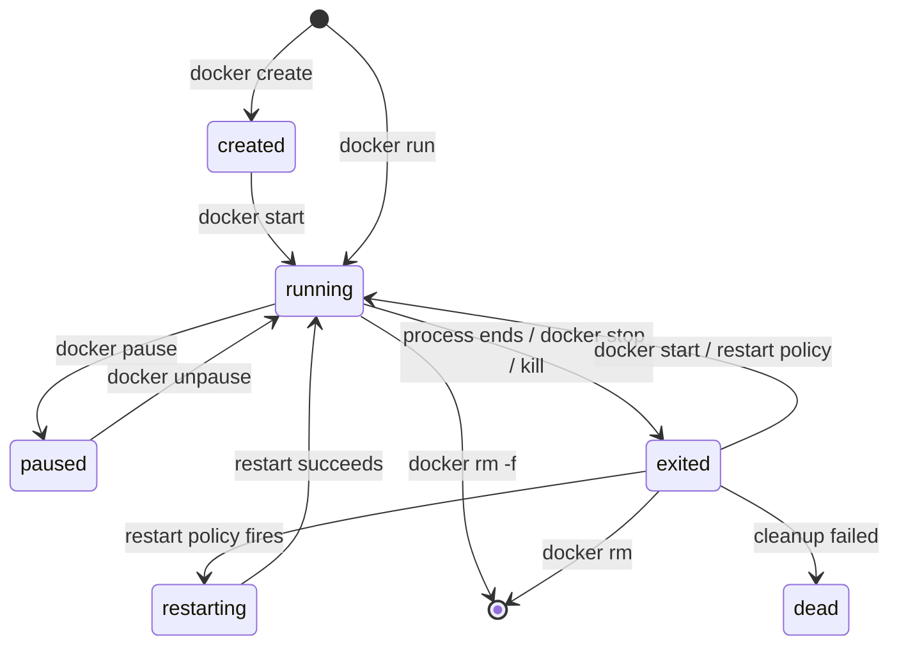
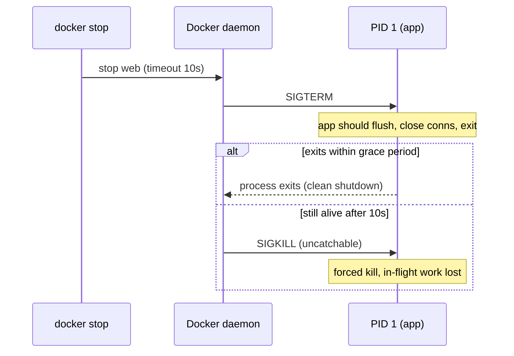
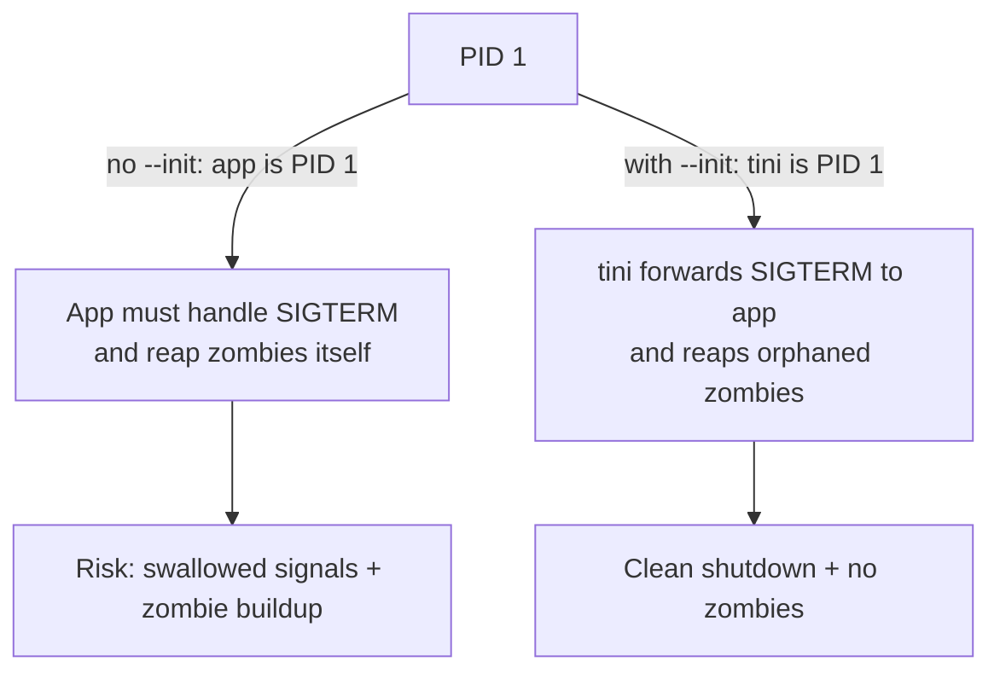

# Container Lifecycle & Runtime Operations

This page covers **what actually happens to a container from `docker run` to `docker rm`** —
the lifecycle state machine, the commands that move a container between states, how stopping
sends signals (SIGTERM then SIGKILL), why a container exits and what its exit code means,
restart policies, the difference between `attach` and `exec`, how to observe a running
container, the PID 1 / zombie-reaping problem, and applying resource limits at runtime.

It is concept-first and hands-on. Where relevant it points at neighbouring topics:
image/layer internals live in `dockerfile-layers-build-cache` and `image-internals-storage-drivers`;
`ENTRYPOINT`/`CMD` startup mechanics live in `entrypoint-vs-cmd`; graceful-shutdown patterns
and `HEALTHCHECK` details live in `production-healthchecks-logging`; and the namespaces/cgroups
that *do* the isolation are covered at the container-mechanism level in `runtimes-oci-standards`
(the operating-systems domain owns the general theory). Kubernetes is the downstream *consumer*
of these primitives — we note that but do not teach pods here.

> [!KEY-TAKEAWAY]
> Three ideas unlock this whole topic. **(1) A container is a process, not a machine** — it
> lives exactly as long as its main process (PID 1) runs, and exits with that process's exit
> code. **(2) Stopping is a negotiation, not a murder:** `docker stop` sends `SIGTERM`, waits a
> grace period (default 10s), then `SIGKILL`s — so your app needs to handle SIGTERM to shut down
> cleanly. **(3) State transitions are explicit:** `run`/`create`/`start`/`stop`/`kill`/`pause`/
> `rm` each move the container between well-defined states, and restart policies automate the
> `exited → running` edge.

---

## The container-as-a-process model

The single most important mental model: **a container is not a lightweight VM — it is one or
more processes on the host kernel, wrapped in namespaces (isolation) and cgroups (resource
limits).** There is no guest kernel, no init system by default, no boot sequence. When you
`docker run nginx`, Docker starts the `nginx` process directly as **PID 1 inside the container's
PID namespace**.

The consequences flow directly from this:

- **The container lives exactly as long as its main process.** When PID 1 exits, the container
  stops — full stop. `docker run ubuntu` exits *immediately* because bash with no TTY has nothing
  to do and returns. A container is not "a place to run things"; it *is* the running thing.
- **The container's exit code == the main process's exit code.** `docker run ubuntu sh -c 'exit 7'`
  produces a container in the `exited (7)` state.
- **Signals go to PID 1.** `docker stop` delivers `SIGTERM` to PID 1, not to a broadcast of all
  processes — which is why signal handling and the init/reaping problem matter (see below).

> [!INTERVIEW]
> "Why did my container exit right away?" is a top interview and real-world question. The answer
> is almost always: **its foreground process ended.** A web server stays up because it blocks
> serving requests; `bash` exits because there's nothing on its stdin. The fix is a
> long-running foreground process, not a background daemon (`nginx -g 'daemon off;'`, not
> `service nginx start`).

This is also why you never "background" the real workload inside a container and then keep PID 1
alive with a `sleep` — if the workload dies, PID 1 (sleep) is oblivious and the orchestrator
thinks the container is healthy.

---

## The lifecycle state machine

A Docker container is always in exactly one **state**, visible in `docker inspect -f '{{.State.Status}}'`
or the `STATUS` column of `docker ps -a`. The states are:

| State | Meaning |
|---|---|
| `created` | Container filesystem + config exist, but the process has never started (`docker create`, or `run` that failed before start). |
| `running` | PID 1 is executing. |
| `paused` | Processes frozen via the freezer cgroup (`docker pause`); still resident in memory. |
| `restarting` | Exited and a restart policy is bringing it back up. |
| `exited` | The main process finished (cleanly or not); container stopped but still exists on disk. Carries an exit code. |
| `dead` | A defunct container the daemon couldn't fully remove (e.g. an unkillable process / storage error); requires manual cleanup. Rare. |

Note there is **no distinct "stopped" status string** — a stopped container reports `exited`.
People say "stopped" colloquially; the daemon calls it `exited`.



> [!TIP]
> `docker run` is not primitive — it is **`docker create` + `docker start`** (plus attach/log
> wiring). Splitting them is occasionally useful: `create` lets you set up config/networks and
> get a container ID before anything runs, then `start` when ready.

---

## run vs create vs start

- **`docker create <image>`** builds the writable container layer and stores the config, leaving
  the container in `created`. Nothing executes. It prints the container ID.
- **`docker start <container>`** launches PID 1 of an existing `created` or `exited` container.
  By default it runs **detached** and prints the name; add `-a` (`--attach`) to stream its output
  and `-i` to attach stdin.
- **`docker run <image>`** = `create` then `start` in one step, and it's what you use 95% of the
  time.

```bash
# These two blocks are equivalent:
docker run -d --name web nginx

docker create --name web nginx     # -> created
docker start web                   # -> running
```

A key property: **`start` re-runs the *same* container with the same original command and
writable layer intact.** It does not create a new container, so files written to the container
layer in the previous run are still there. Contrast with `docker run`, which always makes a
*new* container from the image.

> [!WARNING]
> You cannot change the command, ports, env, or most config of an existing container on `start` —
> those are fixed at `create`/`run` time. To "change" them you must `rm` and `run` a fresh
> container. This immutability is by design and underpins reproducibility.

---

## Foreground, detached, and interactive TTY flags

By default `docker run` is **foreground**: your terminal attaches to the container's
stdout/stderr and the CLI blocks until the container exits. Ctrl-C sends SIGINT to the process.

- **`-d` / `--detach`** runs in the background and returns immediately, printing the container ID.
  Use `docker logs`, `docker attach`, `docker exec` to interact afterward.
- **`-i` / `--interactive`** keeps **stdin open** to the container even when not attached.
- **`-t` / `--tty`** allocates a **pseudo-TTY**, giving line editing, job control, and a prompt.

The famous `-it` combination is for interactive shells:

```bash
docker run -it ubuntu bash        # interactive shell; stdin open + a TTY
docker run -i  ubuntu             # pipe stdin without a TTY (good for scripts/pipes)
docker run -d nginx               # detached long-running service
```

| Flag combo | Use it for |
|---|---|
| (none) | short-lived foreground task, output streamed to terminal |
| `-d` | long-running services (servers, workers) |
| `-it` | interactive shell / REPL you type into |
| `-i` (no `-t`) | feeding data via a pipe, no terminal cosmetics: `echo hi \| docker run -i alpine cat` |

> [!TIP]
> Adding `-t` when there's no real terminal (e.g. in CI logs) causes garbled output and CR/LF
> artifacts because the app thinks it has a TTY. In pipelines use `-i` alone, or neither.

---

## Stopping: SIGTERM, the grace period, then SIGKILL

Stopping a container is a **two-phase, graceful** operation:

1. Docker sends the container's **stop signal (default `SIGTERM`)** to PID 1.
2. It waits a **grace period** — default **10 seconds** on Linux (30s on Windows).
3. If PID 1 is still alive when the grace period expires, Docker sends **`SIGKILL`** (which
   cannot be caught or ignored) and the process is forcibly terminated.

```bash
docker stop web                 # SIGTERM, wait 10s, then SIGKILL
docker stop -t 30 web           # give it 30s before SIGKILL
docker stop -t 0 web            # effectively immediate SIGKILL
```

Related commands:

- **`docker kill`** skips the grace period and sends `SIGKILL` immediately by default; use
  `--signal` to send any signal (e.g. `docker kill --signal=SIGHUP web` to trigger a config
  reload without stopping).
- **`docker restart [-t N]`** = `stop` (with the same grace semantics) then `start`.

The stop signal is configurable so apps that use a different shutdown signal work correctly:

```dockerfile
STOPSIGNAL SIGQUIT          # e.g. nginx treats SIGQUIT as graceful shutdown
```
or per-container: `docker run --stop-signal=SIGQUIT --stop-timeout=20 ...`.



> [!WARNING]
> The **shell form** of `CMD`/`ENTRYPOINT` (`CMD npm start`) runs your app as a *child* of
> `/bin/sh -c`, so **PID 1 is `sh`, which does not forward `SIGTERM`** to your app. Result:
> SIGTERM is swallowed, the grace period elapses, and every stop takes a full 10 seconds and ends
> in SIGKILL — no graceful shutdown. Use the **exec form** (`CMD ["npm","start"]`) so your app is
> PID 1 and receives signals directly. (Deep dive in `entrypoint-vs-cmd`.)

---

## Why a container exits, and exit codes

A container transitions `running → exited` for exactly one reason: **PID 1 terminated.** That can
happen because the process finished its work, crashed, or was signalled. The **container's exit
code is PID 1's exit status**, and it's the primary debugging clue (`docker inspect -f '{{.State.ExitCode}}' c`
or the `STATUS` column).

Common exit codes:

| Code | Meaning |
|---|---|
| `0` | Clean exit — the process finished successfully. |
| `1`–`124` | Application-defined error from the process itself (e.g. an uncaught exception, `exit 3`). |
| `125` | **Docker daemon** itself failed to run the container (bad flag, image/config error) — the *engine* erred, not your process. |
| `126` | The command was found but **not executable** (permission / it's a directory). |
| `127` | The command was **not found** in `PATH`. |
| `137` | Process killed by **SIGKILL** (128 + 9) — often an OOM kill or a `docker stop` that hit its timeout. |
| `143` | Process terminated by **SIGTERM** (128 + 15). |

The `128 + N` convention: when a process dies from signal *N*, the exit code is `128 + N`. So
`137 = 128 + 9 (SIGKILL)` and `143 = 128 + 15 (SIGTERM)`.

> [!INTERVIEW]
> "A container keeps dying with exit code 137 — what happened?" Strong answer: it was
> **SIGKILLed**. The two usual causes are (a) the **kernel OOM killer** killed it because it
> exceeded its `--memory` limit (check `docker inspect -f '{{.State.OOMKilled}}'` — it'll be
> `true`), or (b) it ignored SIGTERM and `docker stop` escalated to SIGKILL after the grace
> period. These are distinguishable via the `OOMKilled` flag and the logs.

```bash
docker ps -a                                          # STATUS shows "Exited (137) 2m ago"
docker inspect -f '{{.State.ExitCode}} oom={{.State.OOMKilled}}' web
```

---

## Restart policies

A **restart policy** automates the `exited → running` edge so a container comes back after a
crash or host reboot, without an external supervisor. Set it with `--restart` on `run`.

| Policy | Restarts on non-zero exit? | On clean exit (0)? | Survives daemon/host restart? | Restarts after manual `docker stop`? |
|---|---|---|---|---|
| `no` (default) | no | no | no | n/a |
| `on-failure[:N]` | yes (up to `N` times if given) | no | no (does not restart on daemon restart) | n/a |
| `always` | yes | yes | yes | **yes** on daemon restart (re-launched) |
| `unless-stopped` | yes | yes | yes, *unless* it was manually stopped before | **no** — stays down if you stopped it |

```bash
docker run -d --restart on-failure:5 worker      # retry a crashing job up to 5x
docker run -d --restart unless-stopped web        # come back on reboot, but respect my manual stop
```

Key nuances interviewers probe:

- **`always` vs `unless-stopped`**: both restart on crash and on daemon/host restart. The
  difference is *manual intent* — if you `docker stop` an `always` container and then the daemon
  restarts, Docker brings it **back up** (it forgets you stopped it); `unless-stopped` **remembers**
  and leaves it down. Use `unless-stopped` for services you want to be able to take down manually.
- **Exponential backoff**: on repeated failures Docker restarts with an increasing delay
  (starting around 100ms and doubling) to avoid a tight crash loop hammering the host.
- **Manual stop overrides the policy**: `docker stop` on an `on-failure`/`unless-stopped`
  container does *not* trigger a restart — the policy only reacts to the process exiting on its
  own, not to your explicit stop.
- Restart policies and the manual `docker run --rm` flag are mutually exclusive.

> [!TIP]
> In Compose the equivalent is `restart: unless-stopped`. In Kubernetes this concept becomes the
> pod `restartPolicy` and, more importantly, the controller (Deployment/ReplicaSet) that recreates
> pods — a *different, higher* layer. Don't rely on Docker restart policies when running under an
> orchestrator; let the orchestrator own it. (See the `kubernetes` domain.)

---

## Pausing and unpausing

**`docker pause`** freezes all processes in a container using the kernel's **freezer cgroup** —
processes are suspended in place (not sent a signal, not swapped out; they simply stop being
scheduled). **`docker unpause`** resumes them.

```bash
docker pause  web       # -> paused; processes frozen, RAM still held
docker unpause web      # -> running; resumes exactly where it left off
```

- Because it's a scheduler freeze, the process **doesn't know it was paused** — no signal is
  delivered, no state is lost, memory stays resident. This differs fundamentally from `stop`,
  which ends the process.
- Use cases: momentarily freeing CPU during a burst, taking a consistent snapshot, or debugging
  timing.
- A `paused` container still holds its memory and its port bindings; it just isn't consuming CPU.

> [!WARNING]
> Pausing does **not** free memory and is **not** a substitute for stopping. And you can't `exec`
> into or `stop` a paused container cleanly — unpause first.

---

## `exec` vs `attach`

Both let you interact with a *running* container, but they do fundamentally different things:

- **`docker attach`** connects your terminal to the **existing PID 1's** stdin/stdout/stderr. You
  are looking at the *same* process the container is running. **Ctrl-C here sends SIGINT to PID 1
  and can kill the container.** Detach without killing using the escape sequence `Ctrl-P Ctrl-Q`.
- **`docker exec`** starts a **brand-new, additional process** inside the container's namespaces.
  It's the right tool for "get me a shell to poke around":

```bash
docker exec -it web bash                 # new shell alongside the app — safe to Ctrl-C/exit
docker exec web ls /app                  # run a one-off command, capture output
docker exec -u root -it web sh           # exec as a different user
docker attach web                        # attach to PID 1's streams (careful!)
```

| | `attach` | `exec` |
|---|---|---|
| Talks to | the original PID 1 | a new child process |
| Killing risk | Ctrl-C may stop the container | exiting only ends *your* process |
| Common use | watch/interact with the foreground app | debug shell, run ad-hoc commands |
| Works if PID 1 has no shell | yes (it's whatever PID 1 is) | needs the binary to exist in the image |

> [!INTERVIEW]
> "How do you get a shell in a running container to debug it?" → `docker exec -it <c> sh`. If a
> candidate says `docker attach`, that's a red flag: attach reconnects to the main process and a
> stray Ctrl-C can take the service down. Also mention: distroless/scratch images have **no shell**,
> so `exec sh` fails — you'd need `docker debug`, an ephemeral debug container, or `nsenter`.

---

## Observing a running container: ps, inspect, logs, stats

The core read-only introspection commands:

- **`docker ps`** lists running containers (`-a` for all states, `-q` for just IDs). The `STATUS`
  column shows state + how long, e.g. `Up 3 hours (healthy)` or `Exited (137) 5m ago`.
- **`docker inspect <c>`** dumps the full JSON config + live state: state/exit code, mounts,
  networks, env, the resolved command, health status. Use Go templates to extract fields:

```bash
docker inspect -f '{{.State.Status}} pid={{.State.Pid}} restarts={{.RestartCount}}' web
docker ps --filter status=exited --format '{{.Names}}\t{{.Status}}'
```

- **`docker logs <c>`** shows what PID 1 wrote to **stdout/stderr** (the json-file/local logging
  driver captures these). `-f` follows, `--tail N` shows the last N lines, `--since 10m` time-bounds.
  This only works if the app logs to stdout/stderr — apps logging to a file *inside* the container
  produce empty `docker logs`. (Logging drivers are detailed in `production-healthchecks-logging`.)
- **`docker stats`** streams live CPU %, memory usage/limit, network and block I/O per container —
  the quick way to see if something is near its memory limit or pegging a CPU. `--no-stream` for a
  one-shot snapshot.
- **`docker top <c>`** shows the processes running inside the container (as seen from the host).

```bash
docker logs -f --tail 100 web            # tail the app's stdout/stderr
docker stats --no-stream                 # one-shot resource snapshot of all containers
```

> [!TIP]
> `docker events` streams lifecycle events (create, start, die, oom, health_status) daemon-wide —
> great for understanding *when and why* containers changed state during an incident.

---

## PID 1, signal handling, and the zombie-reaping problem

Running as PID 1 carries two special kernel responsibilities that ordinary processes never face,
and ignoring them causes real production bugs:

1. **No default signal handlers.** For PID 1, the kernel does **not** install the default action
   for signals like `SIGTERM`. So if your app is PID 1 and has *no explicit SIGTERM handler*,
   SIGTERM is **ignored** — `docker stop` then always falls through to SIGKILL after the grace
   period. (This is separate from, and in addition to, the shell-form problem above.)
2. **Reaping zombies.** When any child process exits, it becomes a **zombie** until its parent
   `wait()`s on it to collect the exit status. Orphaned grandchildren get re-parented to **PID 1**,
   which is responsible for reaping them. A typical app isn't written to reap arbitrary orphans, so
   in containers that spawn subprocesses, **zombies accumulate** and can exhaust the process table.

The fix is a tiny, proper init process as PID 1 that forwards signals and reaps zombies:

```bash
docker run --init -d myapp          # inserts tini as PID 1; app runs as its child
```

`--init` injects **tini** (a ~10KB init) as PID 1; it forwards signals to your app and reaps any
orphaned zombies. You can also bake an init in yourself (`ENTRYPOINT ["tini","--","myapp"]`) or use
`dumb-init`.



> [!INTERVIEW]
> "When do you need `--init`?" Best answer: when your container's main process **spawns child
> processes and isn't itself a proper init** (e.g. a shell script that launches workers, or a
> language runtime that forks), so orphaned children would accumulate as zombies; and/or when the
> app doesn't handle signals well and you want reliable SIGTERM forwarding. A single well-behaved
> binary that handles SIGTERM and forks nothing often doesn't need it.

---

## Runtime resource limits: memory and CPU

Limits are enforced by **cgroups** and can be applied at `run` time (and, on newer Docker, changed
live with `docker update`). They protect the host and neighbours from a runaway container — the
"noisy neighbour" problem.

**Memory:**

```bash
docker run -d --memory=512m --memory-swap=512m myapp
```

- `--memory` (`-m`) is a **hard limit**. Exceeding it triggers the kernel **OOM killer**, which
  picks the **highest-`oom_score` process in the cgroup** (roughly the largest memory footprint) —
  *not* PID 1 by convention. In the common single-process container that victim *is* PID 1, so the
  container dies with **exit code 137** and `OOMKilled=true`. In a multi-process container the
  killer may reap a *child* while PID 1 survives, so the container stays up and `OOMKilled` may not
  flip — check `OOMKilled` and `dmesg` to be sure. (On cgroup v2 you can set `memory.oom.group` to
  kill the whole cgroup atomically, but it defaults to `0` — single-process kills.)
- `--memory-swap` is memory **+ swap** combined; setting it equal to `--memory` disables swap.
- `--memory-reservation` is a *soft* limit (best-effort under pressure).

**CPU:**

```bash
docker run -d --cpus=1.5 myapp          # at most 1.5 cores of CPU time
docker run -d --cpu-shares=512 myapp     # relative weight under contention (default 1024)
```

- `--cpus=N` caps CPU time to *N* cores' worth using the CFS quota — a **hard cap** (throttling).
- `--cpu-shares` is only a **relative weight** that matters *under contention*; an idle host lets a
  low-share container use everything. It is not a cap.
- `--cpuset-cpus="0,1"` pins the container to specific cores.

> [!WARNING]
> Limits are essential for the JVM and other runtimes: modern JVMs (and Node, etc.) are
> container-aware and size their heap/thread pools from the cgroup limit. Without `--memory`, a
> container "sees" the *host's* total RAM and may size itself to numbers that get it OOM-killed.
> Always set explicit limits for production workloads.

> [!TIP]
> Verify what's actually applied: `docker inspect -f '{{.HostConfig.Memory}} {{.HostConfig.NanoCpus}}' web`
> or watch live pressure with `docker stats`. Under Kubernetes these become `resources.limits`/
> `requests` and the OOM/throttling behaviour is the same at the cgroup level.

---

## Removing containers and cleanup

An `exited` container **still exists** — it keeps its writable layer, config, and logs on disk and
shows in `docker ps -a`. Removal is a separate, explicit step:

- **`docker rm <c>`** deletes a stopped container (its writable layer and metadata). It refuses a
  running container unless you force it with **`docker rm -f`** (which SIGKILLs then removes).
- **`docker run --rm`** auto-removes the container the moment it exits — ideal for one-off/CI tasks
  so you don't accumulate dead containers. (Incompatible with `--restart`.)
- **`docker container prune`** bulk-removes all stopped containers.

```bash
docker rm web                    # remove one stopped container
docker rm -f web                 # force-remove a running one (SIGKILL + rm)
docker run --rm alpine echo hi   # runs, prints, self-deletes
docker container prune -f        # reclaim all stopped containers
```

> [!WARNING]
> Removing a container deletes its **writable layer** — any data written *inside* the container
> (not to a volume/bind mount) is gone forever. This is why persistent data belongs in volumes
> (see `volumes-and-storage`), and why treating containers as **ephemeral and disposable** is the
> intended model. Also: named containers hold their name until removed, so a re-`run` with the same
> `--name` fails with a conflict until you `rm` the old one.

---

## Common follow-up questions

- **Why does my container exit immediately after `docker run`?** Because its PID 1 (foreground
  process) finished. You need a long-running foreground process; e.g. `nginx -g 'daemon off;'`, not
  a backgrounded daemon.
- **`docker stop` takes 10 seconds every time — why?** Your app isn't receiving/handling SIGTERM.
  Usually the shell-form `CMD` (PID 1 is `sh` which doesn't forward the signal), or the app has no
  SIGTERM handler while running as PID 1. Use exec form and/or handle SIGTERM; escalation to SIGKILL
  is what causes the 10s delay.
- **What's the difference between `docker kill` and `docker stop`?** `stop` = SIGTERM then SIGKILL
  after a grace period (graceful); `kill` = SIGKILL immediately by default (or any signal via
  `--signal`).
- **`always` vs `unless-stopped`?** Both restart on crash and reboot; `always` restarts even a
  container you manually stopped when the daemon restarts, `unless-stopped` respects your manual
  stop.
- **How do I get a shell in a running container?** `docker exec -it <c> sh|bash`. Not `attach`
  (that connects to PID 1 and Ctrl-C can kill it).
- **What does exit code 137 mean?** Killed by SIGKILL (128+9) — commonly an OOM kill (check
  `OOMKilled`) or a stop that hit its timeout.
- **When do I need `--init`?** When PID 1 spawns children it won't reap (zombie risk) or doesn't
  handle signals — tini forwards signals and reaps zombies.
- **Does `docker start` create a new container?** No — it re-runs the same container with its
  existing writable layer and original command. `docker run` always creates a new one.
- **Can I change a container's ports/env/command after creation?** No; those are fixed at
  create/run time. Remove and recreate to change them.

## References

- Docker Docs — [`docker run`](https://docs.docker.com/reference/cli/docker/container/run/),
  [`docker create`](https://docs.docker.com/reference/cli/docker/container/create/),
  [`docker stop`](https://docs.docker.com/reference/cli/docker/container/stop/),
  [`docker exec`](https://docs.docker.com/reference/cli/docker/container/exec/)
- Docker Docs — [Start containers automatically (restart policies)](https://docs.docker.com/engine/containers/start-containers-automatically/)
- Docker Docs — [Runtime options with Memory, CPUs, and GPUs (resource constraints)](https://docs.docker.com/engine/containers/resource_constraints/)
- Docker Docs — [Specify a container's init process (`--init` / tini)](https://docs.docker.com/reference/cli/docker/container/run/#init)
- Tini — [krallin/tini (the init `--init` uses)](https://github.com/krallin/tini)
- OCI Runtime Spec — [container lifecycle & operations](https://github.com/opencontainers/runtime-spec/blob/main/runtime.md)
- Linux kernel — [Control Group v2 (memory controller, `memory.oom.group`)](https://www.kernel.org/doc/html/latest/admin-guide/cgroup-v2.html) (default `0`: OOM killer targets the highest-`oom_score` process, not necessarily PID 1)
- `signal(7)` / `credentials(7)` man pages — PID 1 signal semantics and zombie reaping
