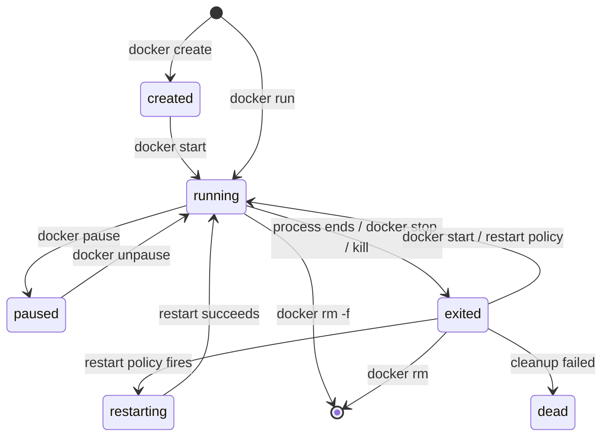
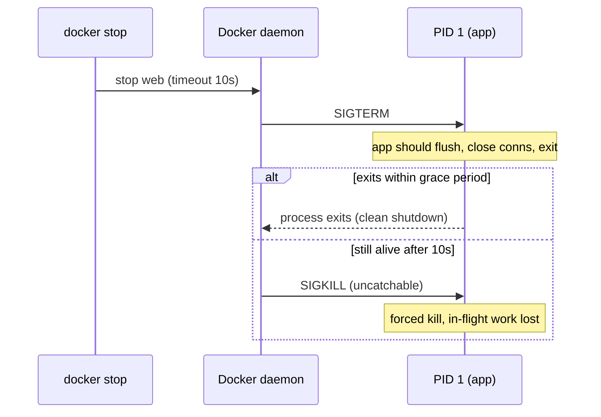
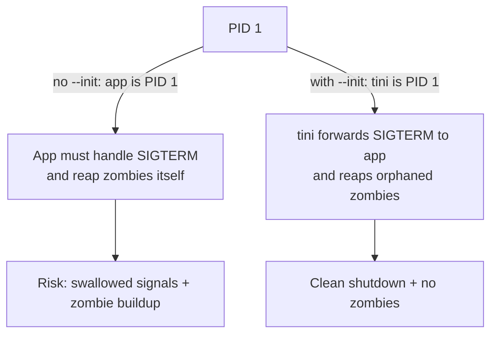

# Container Lifecycle & Runtime Operations

The last topic left `time docker stop web` sitting at 10.3 seconds on a container that was doing
nothing at all. Those ten seconds are the grace period, and the section below called *Stopping:
SIGTERM, the grace period, then SIGKILL* is where the whole negotiation comes apart.

`docker run ubuntu` prints nothing and exits immediately. `docker run nginx` sits there
until you stop it. Same daemon, same syntax, same kind of image, and the difference is not a
setting you forgot. A container has no life of its own: it is a process, and it lasts exactly as
long as that process does. So every verb the CLI gives you — start, stop, pause, exec, limit,
remove — is a move on one process. Which moves exist, what each one does to the process, and
what each one costs you?

> [!TIP]
> **Reading map.** About 40 minutes. The first three sections build the state machine and the
> commands that walk it; everything after that is one edge of the machine in detail. If you
> already know that a container is a process in namespaces under cgroups, start at
> [Stopping: SIGTERM, the grace period, then SIGKILL](#stopping-sigterm-the-grace-period-then-sigkill),
> which is where the two hardest edges — the stop and the exit — actually live. The
> [PID 1 section](#pid-1-signal-handling-and-the-zombie-reaping-problem) is the one to reread
> before a production incident.

---

## The container-as-a-process model

Start `nginx` in a container, then run `docker top` on it, and the `nginx` process shows up with
an ordinary host PID — because that is what it is, a process on the host kernel. There is no
guest kernel underneath it, no init system unless you put one there, and no boot sequence. What
namespaces and cgroups add is a restricted view and a resource ceiling, not a machine. When you
`docker run nginx`, Docker starts the `nginx` process directly, and inside the container's PID
namespace that process is PID 1.

Three things follow from that, and each is where you actually meet it.

A container lasts exactly as long as its PID 1. When PID 1 exits, the container stops; there is
nothing else keeping it alive. `docker run ubuntu` returns almost at once because the image's
default command is a shell, and a shell with no terminal and nothing on its stdin has nothing to
do, so it returns. A container is not a place to run things. It is the running thing.

The container's exit status is PID 1's exit status, passed straight through.
`docker run ubuntu sh -c 'exit 7'` leaves you a container in state `exited (7)`, and that 7 came
from the shell, not from Docker.

Signals arrive at PID 1 and stop there. `docker stop` delivers `SIGTERM` to PID 1 alone — it is
not a broadcast to every process in the container. Whether anything else in the container ever
hears about the shutdown depends entirely on what PID 1 does next, which is the whole of the
signal-handling section later on.

This is why "why did my container exit immediately?" almost always has the same answer: its
foreground process finished. A web server stays up because serving requests blocks forever; a
shell exits because there is nothing to read. The fix is a process that stays in the foreground,
which is not the same as starting a service. `CMD ["nginx", "-g", "daemon off;"]` keeps nginx in
the foreground and the container up. A `CMD` of `service nginx start` forks nginx into the
background and then returns, so PID 1 is gone and the container stops with nginx along with it.

### Where it breaks: keeping PID 1 alive with a sleep

The tempting repair for that is to background the real workload and park PID 1 on something that
never returns — `myapp &` followed by `sleep infinity`, or a `tail -f /dev/null`. The container
now stays up, which is exactly the problem. PID 1's liveness is the only liveness signal Docker gets
for free, and `sleep` is extremely good at being alive. Telling Docker anything else takes a
`HEALTHCHECK`. When the workload segfaults, `sleep` does not notice, `docker ps` still reports
`Up 4 hours`, the restart policy has nothing to react to, and every layer above Docker is told the
container is fine.

The same reasoning explains why the exit code stops being useful the moment the workload is not
PID 1. Your app's non-zero exit is collected by whatever forked it; `sleep`'s eventual exit code,
if it ever produces one, describes `sleep`. You have kept the container and thrown away both
signals it was able to give you.

Once you accept that the container is the process, the set of things a container can *be* is
small and worth naming exactly.

---

## The lifecycle state machine

`docker ps -a` prints one word in its `STATUS` column, and that word is the container's **state**
— the single thing the daemon says it is doing right now. A container is in exactly one state at
a time, and you can read it directly with `docker inspect -f '{{.State.Status}}'`. Seven answers
are possible, and they sort by one question: is anything of yours executing?

| State | Meaning |
|---|---|
| `created` | Container filesystem + config exist, but the process has never started (`docker create`, or `run` that failed before start). |
| `running` | PID 1 is executing. |
| `paused` | Processes frozen via the freezer cgroup (`docker pause`); still resident in memory. |
| `restarting` | Exited and a restart policy is bringing it back up. |
| `exited` | PID 1 finished, cleanly or not; the container stopped but still exists on disk. Carries an exit code. |
| `removing` | A `docker rm` is in progress: the daemon is tearing the container down. Usually too brief to catch, which is why the diagram below does not draw it. |
| `dead` | A defunct container the daemon couldn't fully remove (e.g. an unkillable process / storage error); requires manual cleanup. Rare. |

Two of the seven never execute anything: `created` and `exited`. Two are mid-flight: `running` and
`restarting`. `paused` is a live process held still with its memory intact, `removing` is a teardown
already under way, and `dead` is wreckage.

There is no `stopped` status string. A container you stopped reports `exited`, the same word a
container that finished on its own reports, because from the daemon's side those are the same
event: PID 1 is no longer running. People say "stopped" out loud and that is fine, but if you
grep for it in `docker inspect` output you will find nothing.



Read the arrows and you can see which edges are yours and which are not. You drive
`docker create`, `start`, `pause`, `unpause`, `stop`, `kill` and `rm`. PID 1 drives the `running → exited`
edge whenever it feels like it. A restart policy drives `exited → restarting → running` on its
own, which is the only loop in the diagram, and the only reason a container can come back without
you.

### Where it breaks: the dead state

`dead` is the one state you cannot reach by running anything. Every other edge in the diagram is
either a command of yours or PID 1 terminating. `dead` is the residue of a removal that started and
could not finish, because a process would not die or the storage under the container's writable
layer errored out. The cure is therefore not `docker start` or `docker stop`, since there is nothing
there to start. It is manual cleanup.

`dead` is rare. The reason to know the word anyway is that such a container still occupies its slot:
it lists in `docker ps -a` and it still holds its `--name`. A redeploy that reuses that name fails
with a naming conflict, and the container blocking it is neither running nor removable by the usual
route.

Every edge you drive is a command, and three of those commands overlap enough that people use
them interchangeably and then get surprised.

---

## run vs create vs start

`docker run` is not a primitive. It is `docker create` followed by `docker start`, with the attach
and log wiring hooked up in between, and you can type the two halves yourself:

```bash
# These two blocks are equivalent:
docker run -d --name web nginx

docker create --name web nginx     # -> created
docker start web                   # -> running
```

`docker create <image>` does the setup half. It builds the container's writable layer, stores the
config you passed, prints the container ID, and leaves the container in `created` with nothing
executing. `docker start <container>` does the execution half: it launches PID 1 of a container that
is already `created` or `exited`. By default `start` runs detached and prints the name back to you.
Add `-a` (`--attach`) to stream the container's output into your terminal, and `-i` to attach your
stdin as well.

`docker run` fuses the two halves and is what you type roughly 95% of the time. `docker restart` is
the other fusion — `stop` then `start` on a container that already exists. Typing the halves
separately is worth it when something has to be true before the process runs: `create` hands you a
container ID, so you can attach it to networks, register it somewhere, or line up several containers
and start them in an order you control.

The property that actually matters is what `start` reuses. It re-runs the *same* container: same
original command, same writable layer, still holding whatever the last run wrote into it. A file
your process created at `/tmp/state.json` on Monday is still there when you `docker start` it on
Tuesday. `docker run` never does this — it always builds a new container from the image, with an
empty writable layer, so anything the previous container wrote is somewhere else entirely, in the
old container that is still sitting in `docker ps -a`.

### What it costs: the config is frozen at create time

The price of `start` reusing the container is that it reuses all of it. Ports, environment
variables, mounts, the command itself and most other config are fixed the moment `create` runs,
and `docker start` has no flags to change them. Discovering you needed `-p 8080:80` after the fact
is not something `start` can fix.

So the sequence is `docker rm` and then a fresh `docker run` carrying the flag you wanted. That
costs you the writable layer and any data in it, along with the old config. The exchange is real.
Immutable runtime config buys a container whose behaviour is fully described by the command that made
it, which is what makes "recreate it from the same `docker run` line" reliable rather than hopeful.
Take that deal unless the container holds state you cannot regenerate. If it does, that state
belonged in a volume rather than the writable layer, and the fix is upstream of this decision.

Whichever of the three you type, one more choice is still open: where the container's stdin,
stdout and terminal are wired.

---

## Foreground, detached, and interactive TTY flags

Type `docker run nginx` with no flags and your shell stops being yours: the container's stdout and
stderr stream into your terminal and the CLI does not return until PID 1 exits. Ctrl-C at that
point sends SIGINT to the process, so the usual way people end that state also ends the container.
Three flags move the wiring around, and each answers a different question.

`-d` (`--detach`) answers "who owns my terminal?". The container runs in the background, the CLI
returns immediately with the container ID, and your shell is free. Anything you want from the
container afterwards comes through `docker logs`, `docker attach` or `docker exec`. A container
started this way is **detached** — nothing is wired to your terminal, and the container is
entirely indifferent to whether your shell is still alive.

`-i` (`--interactive`) answers "can the container still read input?". It holds the container's
stdin open even when nothing is attached to it, which is what lets you pipe bytes in.

`-t` (`--tty`) answers "does the container think a human is typing?". It allocates a
**pseudo-TTY** — a kernel device pair that looks to the program exactly like a terminal — so you
get line editing, job control, and a shell prompt that redraws itself.

```bash
docker run -it ubuntu bash        # interactive shell; stdin open + a TTY
docker run -i  ubuntu             # pipe stdin without a TTY (good for scripts/pipes)
docker run -d nginx               # detached long-running service
```

| Flag combo | Use it for |
|---|---|
| (none) | short-lived foreground task, output streamed to terminal |
| `-d` | long-running services (servers, workers) |
| `-it` | interactive shell / REPL you type into |
| `-i` (no `-t`) | feeding data via a pipe, no terminal cosmetics: `echo hi \| docker run -i alpine cat` |

`-it` is the pair you type from habit, and the habit is what bites in CI. A build agent has no
terminal, so asking for a TTY there makes the program believe something false. It starts emitting
cursor movements, colour codes and CR line endings into a log file nobody is watching, and your CI
output arrives garbled. When you are piping data in from a script, ask for `-i` alone; when you are
piping nothing, ask for neither.

Detaching leaves a container running with nothing attached to it, which raises the question of how
you end it without simply killing it.

---

## Stopping: SIGTERM, the grace period, then SIGKILL

`docker stop web` kills nothing for the first ten seconds. It asks, waits, and only then forces the
issue, in three steps:

1. Docker sends the container's **stop signal** — `SIGTERM` unless the image or the run command
   named another one — to PID 1.
2. It waits. That interval is the **grace period**: the time `docker stop` gives PID 1 after
   SIGTERM before it resorts to SIGKILL. The default is 10 seconds on Linux, 30 on Windows.
3. If PID 1 is still alive when the grace period expires, Docker sends `SIGKILL`. That signal
   cannot be caught, blocked or ignored — the kernel removes the process without letting it run
   another instruction.

So the answer to "how long does a stop take?" is set by your process, not by Docker. Exit in 200
milliseconds and the stop takes 200 milliseconds. Never exit and it takes the whole grace period
and ends in a kill.

```bash
docker stop web                 # SIGTERM, wait 10s, then SIGKILL
docker stop -t 30 web           # give it 30s before SIGKILL
docker stop -t 0 web            # effectively immediate SIGKILL
```

Two neighbouring commands sit on the same machinery. `docker kill` skips step 2 entirely and sends
`SIGKILL` straight away, which is what you reach for when a process is wedged and you have already
decided to lose whatever it was doing. Its `--signal` flag turns it into a general-purpose signal
sender rather than a killer, and that is genuinely useful: `docker kill --signal=SIGHUP web` makes
nginx reload its config with the container still running. `docker restart [-t N]` is `stop`
followed by `start`, grace period and all, so a restart of a container that ignores SIGTERM takes
ten seconds longer than you expect.

The stop signal is configurable because SIGTERM is not universal. nginx, for one, treats SIGQUIT
as its graceful shutdown and SIGTERM as a fast one, so you tell Docker which to send:

```dockerfile
STOPSIGNAL SIGQUIT          # e.g. nginx treats SIGQUIT as graceful shutdown
```

or per-container, at run time: `docker run --stop-signal=SIGQUIT --stop-timeout=20 ...`.



### Where it breaks: when the wait is the whole ten seconds

A container doing nothing at all still takes the full ten seconds to stop. That is the most common
version of this failure. Docker is not waiting for the container to finish its work; it has no idea
whether there is any. It waits for one specific event, PID 1 exiting, and only that event happening
shortens the wait. An idle process that ignores SIGTERM and a saturated one that ignores SIGTERM
look identical from the daemon's side. Both cost you ten seconds and a kill.

Two different things cause SIGTERM to go unanswered, and they stack. The first is in your
Dockerfile, and it decides whether your app is even the thing being signalled.

> [!WARNING]
> The shell form of `CMD`/`ENTRYPOINT` (`CMD npm start`) runs your app as a *child* of
> `/bin/sh -c`, so PID 1 is `sh` — and `sh` does not forward SIGTERM to the child it started. The
> signal arrives, `sh` absorbs it, your app never hears it, the grace period elapses, and every
> stop takes a full 10 seconds and ends in SIGKILL. Use the exec form (`CMD ["npm","start"]`) so
> your app is PID 1 and gets the signal directly. Why `sh` behaves that way, and what the two
> forms actually do, is the subject of `entrypoint-vs-cmd`.

The second cause survives even after you fix the first, because it is a property of PID 1 rather than
of your Dockerfile. A process running as PID 1 gets no default signal handling from the kernel, so
an app with no SIGTERM handler of its own ignores the signal even when it arrives cleanly. That
mechanism gets its own section later, because it also explains a failure with nothing to do with
shutdown.

Every stop, graceful or forced, leaves exactly one number behind, and that number is the fastest
route to what happened.

---

## Why a container exits, and exit codes

`docker ps -a` shows `Exited (137) 2m ago`, and both halves of that are load-bearing. A container
goes from `running` to `exited` for exactly one reason — PID 1 terminated — whether it finished its
work, crashed, or was signalled. The number in brackets is the **exit code**: PID 1's exit status,
handed up unchanged, and usually the fastest clue you have. Read it from the `STATUS` column, or
precisely with `docker inspect -f '{{.State.ExitCode}}' c`.

Common exit codes:

| Code | Meaning |
|---|---|
| `0` | Clean exit — the process finished successfully. |
| `1`–`124` | Application-defined error from the process itself (e.g. an uncaught exception, `exit 3`). |
| `125` | The Docker daemon itself failed to run the container (bad flag, image/config error) — the *engine* erred, not your process. |
| `126` | The command was found but not executable (permission / it's a directory). |
| `127` | The command was not found in `PATH`. |
| `137` | Process killed by SIGKILL (128 + 9) — often an OOM kill or a `docker stop` that hit its timeout. |
| `143` | Process terminated by SIGTERM (128 + 15). |

The two large numbers are not arbitrary. When a process dies from signal *N*, the convention is to
report `128 + N`, so `137 = 128 + 9 (SIGKILL)` and `143 = 128 + 15 (SIGTERM)`. Adding 128 is what
keeps a signal death from colliding with a program that chose to `exit 9`.

`137` is the one you will actually meet, and on its own it tells you only that something sent
SIGKILL. Two very different events do that, and separating them is the whole diagnosis.

> [!INTERVIEW]
> "A container keeps dying with exit code 137 — what happened?" Something SIGKILLed it, and there
> are two candidates. Either the kernel OOM killer took it for exceeding its `--memory` limit, in
> which case `docker inspect -f '{{.State.OOMKilled}}'` reports `true`; or it ignored SIGTERM and
> `docker stop` escalated after the grace period, in which case `OOMKilled` stays `false` and the
> logs stop at whatever the app was doing. The flag is what separates them.

```bash
docker ps -a                                          # STATUS shows "Exited (137) 2m ago"
docker inspect -f '{{.State.ExitCode}} oom={{.State.OOMKilled}}' web
```

### Where the rule breaks: codes your process never produced

"The exit code is PID 1's exit status" holds for every row of that table except three, and those
three waste the most debugging time of any code here. `125`, `126` and `127` are reported for a
container in which your program never ran at all. Reading them as your program's verdict sends you
looking in the wrong place.

`125` means the daemon refused or failed before there was a process to have a status: a flag it
would not accept, a config it could not apply, an image problem. Nothing of yours executed, so
grepping your application logs finds nothing, because there are none. `126` and `127` mean the
container got as far as trying to execute the command and could not. Either the file was not found on
`PATH`, or it was found and was not executable: a directory, or a script without the execute bit.
The difference between these and a `1` matters operationally: a `1` means your code ran and
decided something was wrong, so the fix is in your code. A `125` means the fix is in the
`docker run` line, and a `127` means the fix is in the image.

An exit is a fact, not a verdict, and whether it should be the end of the container is a separate
decision you configure.

---

## Restart policies

`docker run -d --restart unless-stopped web` hands the container's death to Docker instead of to
you. A **restart policy** is a standing instruction attached to the container that automates the
`exited → running` edge, so a crash or a host reboot brings the container back without any external
supervisor watching it. Without one, `exited` is terminal until a human types something. There are
four, and they differ only in which ways of dying they consider worth reacting to.

| Policy | Restarts on non-zero exit? | On clean exit (0)? | Survives daemon/host restart? | Restarts after manual `docker stop`? |
|---|---|---|---|---|
| `no` (default) | no | no | no | n/a |
| `on-failure[:N]` | yes (up to `N` times if given) | no | no (does not restart on daemon restart) | n/a |
| `always` | yes | yes | yes | yes on daemon restart (re-launched) |
| `unless-stopped` | yes | yes | yes, *unless* it was manually stopped before | no — stays down if you stopped it |

```bash
docker run -d --restart on-failure:5 worker      # retry a crashing job up to 5x
docker run -d --restart unless-stopped web        # come back on reboot, but respect my manual stop
```

The default is `no`, which surprises people who assumed Docker keeps things running for them.
`on-failure` is the policy for work that either succeeds or deserves a bounded number of retries, so
it ignores a clean `exit 0` and honours the `:N` cap.

`always` and `unless-stopped` look identical in the first three columns and differ in exactly one
place: whether Docker remembers that *you* were the one who stopped it. Stop an `always` container
and it stays down, as you would expect — but restart the daemon, and the daemon re-launches
everything marked `always`, including the one you deliberately took out of service. It has no
record of your intent. `unless-stopped` keeps that record: it comes back from a reboot only if it
was not manually stopped when the daemon went away. So `unless-stopped` is the one to choose for
anything you may need to take down by hand and have stay down.

Manual stops never trigger a policy in the first place. A policy fires on the process exiting on
its own; `docker stop` is you exiting it, and Docker distinguishes the two. The same reasoning
explains why `--restart` and `--rm` are mutually exclusive: `--rm` says delete this container the
instant it exits, and a restart policy says start it again the instant it exits, so there is no
coherent container for both flags to be about.

### What it costs: the policy cannot tell a crash from a doomed configuration

A restart policy reacts to an exit code and nothing else. It cannot tell whether a restart could
plausibly fix what went wrong. Give it a container that dies in 40 milliseconds over a wrong
`DATABASE_URL`, and it reacts exactly as it would to a transient network blip. Left alone it would
relaunch that container as fast as the daemon can fork, and the crash loop would cost more host CPU
than the workload ever did.

Docker's answer is delay rather than judgement: on repeated failures it restarts with an increasing
wait, starting around 100ms and doubling each time — **exponential backoff**, the same doubling a
retrying network client uses. Doubling from 100ms, the tenth wait is 51.2 seconds rather than a
tenth of a second, which keeps the host usable while a human reads the logs. Two things stop that
ladder from growing without limit. No single wait exceeds one minute, and the ladder resets to the
bottom once the container has stayed up for ten seconds. What it does not buy you is any notion of
*why*, which is the ceiling on this whole mechanism.

That ceiling is why the layer above takes the job over. Compose spells the same thing as
`restart: unless-stopped`, still Docker's mechanism under a different name. Kubernetes splits it in
two. A pod's `restartPolicy` restarts containers inside a pod that already exists. A controller such
as a Deployment or ReplicaSet notices that the pod itself is gone and creates a replacement
somewhere. Docker has no equivalent of that second half, which is why you let the orchestrator own
restarts when there is one, rather than having both react to the same exit.

Restarting is one way to interrupt a container; there is another that halts every process in it
without ending any of them.

---

## Pausing and unpausing

`docker pause web` stops every process in the container from being scheduled, and
`docker unpause web` resumes them exactly where they were. No signal is sent, nothing is swapped
out, and no process is asked for its opinion. The mechanism is the kernel's **freezer cgroup**: the
control that suspends every task in a cgroup without terminating any of them. From inside the
container, nothing happened at all — no signal arrived, no state was lost, and memory stayed
resident.

```bash
docker pause  web       # -> paused; processes frozen, RAM still held
docker unpause web      # -> running; resumes exactly where it left off
```

That is the difference from `stop`, and it is a difference in kind rather than degree. `stop`
negotiates the end of a process; `pause` removes it from the scheduler's run queue and leaves
everything else standing. A paused container still holds its memory and its port bindings. It is
simply not consuming CPU.

That makes it useful for three narrow jobs. It frees CPU for a few seconds during a burst. It holds
a process still long enough to snapshot what it was writing. And it stops the clock on one container
without losing its state, which is sometimes the only way to see a timing bug.

> [!WARNING]
> Pausing does not free memory, and it is not a cheaper `stop`. Every page the container had is
> still resident: you have released one resource, CPU, and none of the others. You also cannot
> `exec` into a paused container at all: the daemon refuses and tells you to unpause it first.
> `stop` does not act cleanly on one either, so unpause before you do anything else to it.

A paused container tells you nothing about itself, which is a good moment to ask how you get inside
a running one.

---

## `exec` vs `attach`

`docker exec -it web bash` and `docker attach web` both connect your terminal to a running
container, and only one of them can take the service down by accident. The difference is which
process you end up talking to.

`docker attach` connects your terminal to the streams of the process that is already there: PID 1's
stdin, stdout and stderr. You are not next to the application, you are holding its console. Ctrl-C
in that terminal sends SIGINT to PID 1, and for most applications that ends the process and
therefore the container. The way out without killing anything is the detach sequence
`Ctrl-P Ctrl-Q`, which disconnects your terminal and leaves the process running.

`docker exec` does something else entirely: it starts a brand-new process inside the container's
namespaces, as a sibling of the application rather than a handle on it. Your shell sees the same
filesystem, the same network, the same process table, and it has its own stdin and its own exit.
When you type `exit` or Ctrl-C, the only thing that ends is your shell.

```bash
docker exec -it web bash                 # new shell alongside the app — safe to Ctrl-C/exit
docker exec web ls /app                  # run a one-off command, capture output
docker exec -u root -it web sh           # exec as a different user
docker attach web                        # attach to PID 1's streams (careful!)
```

| | `attach` | `exec` |
|---|---|---|
| Talks to | the original PID 1 | a new child process |
| Killing risk | Ctrl-C may stop the container | exiting only ends *your* process |
| Common use | watch/interact with the foreground app | debug shell, run ad-hoc commands |
| Works if PID 1 has no shell | yes (it's whatever PID 1 is) | needs the binary to exist in the image |

> [!INTERVIEW]
> "How do you get a shell inside a running container to debug it?" `docker exec -it <c> sh`, and
> the reason it has to be `exec` is in the last row of that table: `exec` runs a new process, so it
> needs a shell binary present in the image, while `attach` just reconnects to whatever PID 1
> already is. That difference is also what makes `attach` the wrong reflex — one stray Ctrl-C on a
> production container ends PID 1, and PID 1 ending is the container ending.

### Where it breaks: the image with no shell

Run `docker exec -it web sh` against a **distroless** image and it fails immediately with an
executable-not-found error. A distroless image ships only your application binary and its runtime
libraries: no shell, no package manager, no coreutils. Nothing is wrong with the container. `exec`
needs a binary to execute, you named one that is not in the image, and an image built from `scratch`
has even less. Failing that way is the routine cost of the small-image discipline, and the failure lands
precisely when you are debugging in a hurry.

Three routes get you a shell anyway, and none of them put one in the image. `docker debug` attaches
a toolbox from outside the image. An ephemeral debug container joins the target's namespaces while
carrying its own filesystem full of tools. `nsenter`, run on the host against the container's PID,
does the same thing at the lowest level, through the kernel's namespace-entry call. All three keep the
production image free of a shell, which is the point of not having one.

Most of what you want from a container needs no shell at all, only the read-only commands the daemon
already exposes.

---

## Observing a running container: ps, inspect, logs, stats

`docker ps` answers a different question from `docker logs`, and reaching for the wrong one is most
of what makes a container feel opaque. Five read-only commands cover four questions: what state is
it in, how was it configured, what did it say, and what is it consuming.

What state is it in, and how was it set up:

- `docker ps` lists running containers (`-a` for all states, `-q` for just IDs). The `STATUS`
  column shows state + how long, e.g. `Up 3 hours (healthy)` or `Exited (137) 5m ago`.
- `docker inspect <c>` dumps the full JSON config + live state: state/exit code, mounts, networks,
  env, the resolved command, health status. Go templates pull out one field instead of all of it.

```bash
docker inspect -f '{{.State.Status}} pid={{.State.Pid}} restarts={{.RestartCount}}' web
docker ps --filter status=exited --format '{{.Names}}\t{{.Status}}'
```

What did it say:

- `docker logs <c>` shows what PID 1 wrote to stdout and stderr, which the default `json-file`
  driver captures as the container runs. Under a driver that cannot replay logs itself, the daemon
  keeps a local cache so `docker logs` still works. `-f` follows, `--tail N` shows the last N lines,
  and `--since 10m` time-bounds the output.

What is it consuming, right now:

- `docker stats` streams live CPU %, memory usage against limit, network and block I/O per
  container — the quick way to see whether something is near its memory ceiling or pegging a core.
  `--no-stream` takes a single snapshot instead of a live feed.
- `docker top <c>` lists the processes running inside the container, as the host sees them.

```bash
docker logs -f --tail 100 web            # tail the app's stdout/stderr
docker stats --no-stream                 # one-shot resource snapshot of all containers
```

There is a fifth question none of those five commands can answer: what happened, in what order.
`docker events` streams lifecycle events daemon-wide as they occur — `create`, `start`, `die`, `oom`,
`health_status` — so it is the one command that reconstructs an incident rather than describing the
present. During a crash loop it shows you the `die`/`start` pairs and their timestamps, which is
the difference between "the container is down" and "the container has restarted eleven times in
four minutes".

### Where it breaks: an empty docker logs

The most confusing outcome here is `docker logs web` printing nothing while the application is
demonstrably running and demonstrably logging. What it means is that `docker logs` is not a log
viewer. It replays the bytes the logging driver captured from the container's stdout and stderr,
and it knows about nothing else.

So an application configured the way applications traditionally are — writing to
`/var/log/app.log`, or to a path from a logging config file — writes into the container's own
writable layer instead. Those bytes exist; they are simply somewhere `docker logs` never looks, and
they are inside a filesystem that disappears with the container. Reading them needs an `exec` and a
`cat`, and keeping them needs the application reconfigured to log to stdout, which is why
"log to stdout" is a container convention rather than a preference.

These commands tell you what a container is doing. Why a stop hangs, or why processes pile up
inside one, is a property of PID 1 itself.

---

## PID 1, signal handling, and the zombie-reaping problem

`docker stop` on a container whose application has no SIGTERM handler takes the full ten seconds
every time, even with the exec form and no shell anywhere in the picture. Being PID 1 carries two
kernel responsibilities that no ordinary process has, and neither of them is anything most
application code was written to do.

The first is signal handling. For an ordinary process, a signal you have not handled still does
something, because the kernel applies a default action — SIGTERM's default action is to terminate
the process. For PID 1, the kernel skips that default. A signal PID 1 has not explicitly installed
a handler for is simply ignored. So an app running as PID 1 with no SIGTERM handler does not die on
SIGTERM; `docker stop` waits out the grace period and escalates to SIGKILL, every time. A missing
handler is a separate problem from the shell form earlier, and the two stack: fixing your `CMD` gets
the signal to your app, and only your app can decide to act on it.

The second is reaping. When any process exits, it does not disappear — the kernel keeps a small
record of it, holding its exit status, until its parent calls `wait()` to collect it. A process in
that state is a **zombie**: finished, occupying nothing but a process-table slot, waiting to be
read. Collecting it is called reaping, and normally the parent does it. But when a parent dies
before its children, those orphans are re-parented to PID 1, and reaping them becomes PID 1's job
by kernel convention. A web server or a Python script is not written to reap processes it never
started, so it never calls `wait()` on them, and in a container that spawns subprocesses the
zombies accumulate. They cost no CPU and almost no memory; what they consume is process-table
entries. Fill the table and nothing can fork any more. That table is shared with the host, so the
damage does not stay inside the container that leaked.

The fix for both at once is to make PID 1 a process whose entire job is those two duties — an
**init**, a supervisor that forwards signals down to your app and reaps whatever gets re-parented
to it:

```bash
docker run --init -d myapp          # inserts tini as PID 1; app runs as its child
```

`--init` puts a small init in front of your process, so it becomes PID 1 and your app becomes its
child. Docker ships tini for this — a small static init binary, installed as `docker-init`, that
forwards signals to your app and reaps any orphaned zombies. You can bake the same thing into the
image yourself with `ENTRYPOINT ["tini","--","myapp"]`, or use `dumb-init` instead.



### What it costs: deciding whether you need an init

`--init` is close to free: one extra process, one static binary under a megabyte, one extra hop for
each signal. What it is not is invisible, because it changes who PID 1 is. Your app is no longer
PID 1, so it gets default signal actions back, and its exit status reaches Docker by way of tini.

You need it when PID 1 spawns children it will not reap: a shell script that launches workers, a
process manager, a language runtime that forks, anything where orphans can appear. You also want it
when the app's signal handling is unreliable and you would rather have a process that definitely
forwards SIGTERM than argue with the app. A single static binary that installs a SIGTERM handler and
forks nothing gains nothing from it, and adding it there buys a dependency for no defect.

The thing `--init` does not do is make your app shut down gracefully. It delivers the signal
faithfully; what happens next is your handler's problem, and if there is no handler the ten seconds
come back — this time with a well-behaved init sitting in front of an app that is ignoring it.

Signals are how a container dies when something asks it to. Resource limits are how it dies when
the kernel decides, without asking anyone.

---

## Runtime resource limits: memory and CPU

`docker run -d --memory=512m myapp` gives the kernel permission to kill your process, and that is the
point. Limits are enforced by cgroups and set at `run` time — and, unlike most of the config, not
frozen there. Ports, env and the command are fixed at create time; resource limits and the restart
policy can both be changed on a live container with `docker update`. What they buy is protection
for the host from one container that allocates without bound. That is the noisy-neighbour problem,
where a single workload degrades every other workload on the machine.

Memory is the limit with no gentle version, because a process denied memory cannot proceed at all:

```bash
docker run -d --memory=512m --memory-swap=512m myapp
```

`--memory` (`-m`) is a hard limit, and the enforcement is not throttling. Cross it and the kernel's
**OOM killer** — the routine that frees memory by terminating a process outright — picks a victim
inside your cgroup and kills it. In the usual single-process container the only real candidate is
PID 1, so the container dies with exit code 137 and `OOMKilled=true`, which is one of the two
routes to a 137 from the exit-code section.

`--memory-swap` is memory plus swap combined, not swap on its own, so setting it equal to
`--memory` leaves zero swap and disables swapping entirely. `--memory-reservation` is the soft
version of `--memory`: a target the kernel tries to push you back down to when the host is under
pressure, with nothing killed if it cannot.

CPU is the opposite: a process denied CPU time waits rather than fails, so the enforcement can be
gentler, and Docker gives you three flags that are gentle in three different ways.

```bash
docker run -d --cpus=1.5 myapp          # at most 1.5 cores of CPU time
docker run -d --cpu-shares=512 myapp     # relative weight under contention (default 1024)
```

The first two look interchangeable and are opposites. `--cpus=N` is a ceiling: it caps the container
at *N* cores' worth of CPU time using the **CFS quota**, the scheduler's allowance of run time per
period. Spend this period's allowance and the container is throttled until the next one, so on an
idle 32-core host, `--cpus=1.5` still gets 1.5 cores and no more.

`--cpu-shares` is a weight rather than a cap. It decides only who wins when several containers want
CPU at the same instant, and the default is 1024, so a container set to `--cpu-shares=512` on an
otherwise idle host will happily use every core on the machine. `--cpuset-cpus="0,1"` is the third
kind of answer, pinning the container to named cores instead of rationing its time.

> [!WARNING]
> A runtime that sizes itself from the wrong number is the most expensive version of a missing
> limit. Modern JVMs, and Node, read the cgroup limits and size themselves from what they find. The
> default heap comes from the memory limit; the default thread pools come from the CPU count the
> container is allowed. Without `--memory` there is no limit to read, so the runtime falls back to
> what the
> host reports — all of it — and a JVM on a 64 GB host sizes its heap from 64 GB rather than from
> the 512 MB you meant to give it, then gets OOM-killed long before reaching it.

Set the limits explicitly for anything in production, then confirm they landed rather than assuming:
`docker inspect -f '{{.HostConfig.Memory}} {{.HostConfig.NanoCpus}}' web` shows what the daemon
recorded, and `docker stats` shows how close the container is running to it. Under Kubernetes the
same two numbers arrive as `resources.limits` and `requests`, and the OOM and throttling behaviour
is identical, because it is the same cgroup doing the work.

### The version-specific truth: which process the OOM killer takes

The OOM killer does not target PID 1, and nothing in it privileges PID 1 either way. It scores the
processes in the cgroup and kills the one with the highest `oom_score`, which in practice is roughly
the largest memory footprint. Single-process containers hide this completely, because the largest
footprint and PID 1 are the same process.

Put two processes in a container and the behaviour separates. The killer may reap a child while PID
1 keeps running, so the container stays `running` and what you see is a container that is up with a
worker mysteriously missing. Docker records `OOMKilled` for a kill of any process in the container's
cgroup, so the tell is the odd pairing: `OOMKilled=true` on a container that is still `running`.
`dmesg` usually carries the kernel's own record of the kill too, and it names which process went.

Cgroup v2 offers the behaviour people usually assumed they already had. Set `memory.oom.group` and
the kernel kills every process in the cgroup atomically, so a memory overrun takes the container
rather than one process out of it. It defaults to `0`, which means single-process kills. The
split-brain container above is therefore the out-of-the-box behaviour, and the atomic version is
opt-in.

An OOM-killed container is still there afterwards, holding its writable layer and its name, until
something removes it.

---

## Removing containers and cleanup

An `exited` container is still a container. It keeps its writable layer, its config and its captured
logs on disk, it still answers `docker inspect`, and it still lists in `docker ps -a`. That is why a
machine that has run a few hundred one-off jobs has a few hundred containers on it. Nothing removes
them for you; `exited` is a resting state, not a cleanup.

- `docker rm <c>` deletes a stopped container: its writable layer and its metadata. It refuses to
  touch a running one unless you add `-f`, and `docker rm -f` is a SIGKILL followed by the removal,
  with no grace period anywhere in it.
- `docker run --rm` removes the container the instant it exits, which is what you want for
  one-off and CI work so the machine stays clean without a sweep job. It is incompatible with
  `--restart`, for the reason the restart section gave.
- `docker container prune` removes every stopped container in one command; `docker system prune`
  widens the same sweep past containers.

```bash
docker rm web                    # remove one stopped container
docker rm -f web                 # force-remove a running one (SIGKILL + rm)
docker run --rm alpine echo hi   # runs, prints, self-deletes
docker container prune -f        # reclaim all stopped containers
```

> [!WARNING]
> `docker rm` deletes the writable layer, and everything your process wrote into it goes with it —
> the uploaded file, the SQLite database, the cache directory, all of it, with no undo and no
> warning prompt. Only data written to a volume or a bind mount survives the container that wrote
> it, which is what makes storage a separate decision from the lifecycle rather than a detail of it
> (`volumes-and-storage`).

There is one non-obvious consequence of removal being explicit: a container holds its `--name`
until it is removed. A redeploy that runs `docker run --name web` again fails with a naming
conflict, and the container blocking it is the dead one you never cleaned up — which is the same
reason a `dead` container blocks a name.

That closes the machine. A container was one foreground process in namespaces under cgroups, and
every command in this topic was a move on that process. `create` laid down its writable layer and
`start` gave it a PID 1. `stop` negotiated with that PID 1 and then killed it; the exit code
reported how it ended, and a restart policy decided whether it came back. `rm` reclaimed the layer
`create` made, and what `rm` reclaims is exactly that layer and nothing underneath it. The image
layers the container started from
are untouched and shared, so cleaning up a hundred containers built from one gigabyte image frees the
megabytes they wrote, not the gigabyte they share.

## Common follow-up questions

- Why does my container exit immediately after `docker run`? Because its PID 1, the foreground
  process, finished. You need a process that stays in the foreground; `nginx -g 'daemon off;'`, not a
  backgrounded daemon.
- `docker stop` takes 10 seconds every time — why? Your app is not acting on SIGTERM. Either the
  shell-form `CMD` means PID 1 is `sh` and the signal is never forwarded, or the app is PID 1 with no
  SIGTERM handler, in which case the kernel installs no default action for it. Both end in the grace
  period expiring and a SIGKILL, and that escalation is the 10 seconds.
- What's the difference between `docker kill` and `docker stop`? `stop` is SIGTERM, then SIGKILL
  after the grace period. `kill` is SIGKILL immediately, or any signal you name with `--signal`.
- `always` vs `unless-stopped`? Both restart on a crash and after a reboot. `always` restarts
  even a container you manually stopped, once the daemon restarts; `unless-stopped` remembers your
  manual stop and leaves it down.
- How do I get a shell in a running container? `docker exec -it <c> sh` or `bash`. Not `attach`,
  which connects to PID 1's streams where a stray Ctrl-C can end it.
- What does exit code 137 mean? SIGKILL, since 137 is 128 + 9. Usually an OOM kill — check the
  `OOMKilled` flag — or a `docker stop` that ran out its grace period.
- When do I need `--init`? When PID 1 spawns children it will not reap, so zombies would
  accumulate, or when you do not trust the app's signal handling. tini forwards signals and reaps
  orphans.
- Does `docker start` create a new container? No. It re-runs the same container with its existing
  writable layer and its original command. `docker run` always creates a new one.
- Can I change a container's ports, env or command after creation? No — those are fixed at
  create/run time, so you remove and recreate. Resource limits and the restart policy are the
  exceptions: `docker update` changes those on a live container.

## References

- Docker Docs — [`docker run`](https://docs.docker.com/reference/cli/docker/container/run/),
  [`docker create`](https://docs.docker.com/reference/cli/docker/container/create/),
  [`docker stop`](https://docs.docker.com/reference/cli/docker/container/stop/),
  [`docker exec`](https://docs.docker.com/reference/cli/docker/container/exec/)
- Docker Docs — [Start containers automatically (restart policies)](https://docs.docker.com/engine/containers/start-containers-automatically/)
- Docker Docs — [Runtime options with Memory, CPUs, and GPUs (resource constraints)](https://docs.docker.com/engine/containers/resource_constraints/)
- Docker Docs — [Specify a container's init process (`--init` / tini)](https://docs.docker.com/reference/cli/docker/container/run/#init)
- Tini — [krallin/tini (the init `--init` uses)](https://github.com/krallin/tini)
- OCI Runtime Spec — [container lifecycle & operations](https://github.com/opencontainers/runtime-spec/blob/main/runtime.md)
- Linux kernel — [Control Group v2 (memory controller, `memory.oom.group`)](https://www.kernel.org/doc/html/latest/admin-guide/cgroup-v2.html) (default `0`: OOM killer targets the highest-`oom_score` process, not necessarily PID 1)
- `signal(7)` / `credentials(7)` man pages — PID 1 signal semantics and zombie reaping
