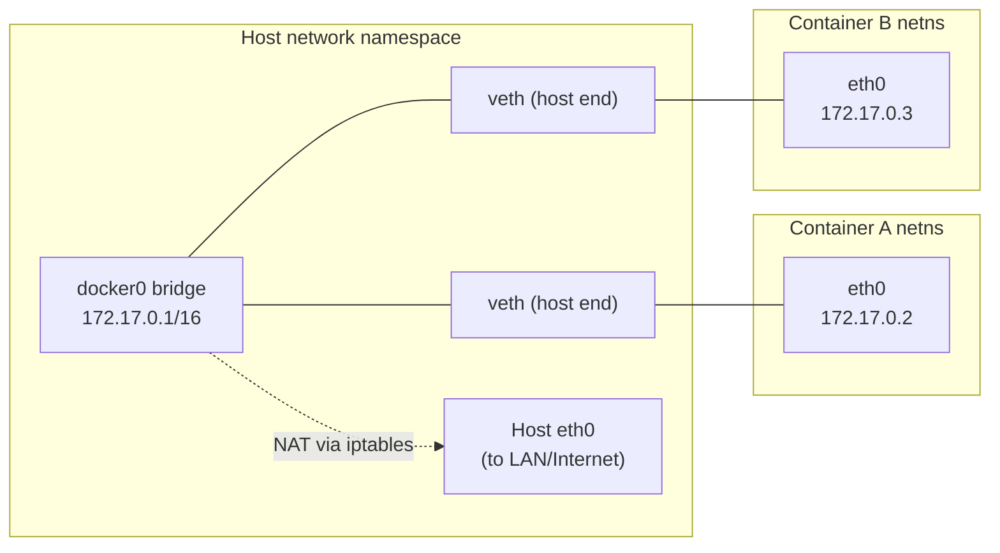
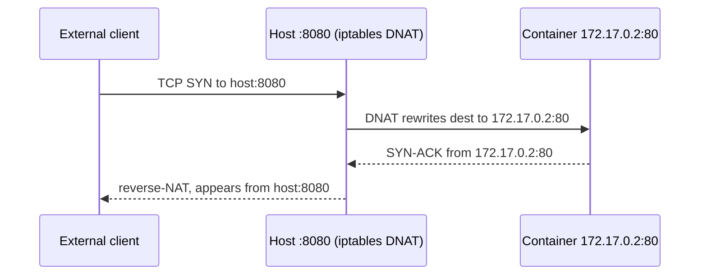

# Docker Networking

Docker networking is the machinery that lets containers talk to each other, to the host,
and to the outside world — while still being *isolated* from one another by default. The
core idea is simple: **every container gets its own network namespace** (its own private
view of interfaces, IP addresses, routing table, and firewall rules), and Docker's job is
to wire those namespaces together using virtual interfaces, a software bridge, an embedded
DNS server, and Linux `iptables`/NAT rules. Understanding networking well means being able
to answer three questions for any setup: *what IP/interface does the container see, how does
a packet leave the container, and how does another party reach it?*

This note owns the **container-level** networking mechanism: the built-in drivers (bridge,
host, none, overlay, macvlan), the crucial difference between the *default* bridge and a
*user-defined* bridge (automatic DNS by container name), port publishing vs `EXPOSE`,
container-to-container communication, the embedded DNS resolver, and the `iptables`/NAT
plumbing underneath. Network namespaces and general Linux networking theory are owned more
deeply by the upcoming `operating-systems` and existing `networking` domains — here we use
them concretely as *the thing that isolates a container's network*. Kubernetes (a separate
upcoming domain) replaces most of this with its own CNI model; where relevant we point
onward rather than teach K8s here.

> [!KEY-TAKEAWAY]
> The single most-asked Docker networking interview fact: **containers on the *default*
> `bridge` network can only reach each other by IP; containers on a *user-defined* bridge
> get automatic DNS resolution by container name.** Almost every "why can't my two
> containers talk to each other by name?" question resolves to "you're on the default
> bridge — create a user-defined network (or use Compose, which does it for you)."

---

## Network namespaces: the isolation mechanism

A **network namespace** is the Linux kernel feature that gives each container its own,
independent copy of the network stack: its own network interfaces, IP addresses, routing
table, ARP table, `/proc/net`, port number space, and `iptables` rules. This is *the*
mechanism that makes container networking "isolated" — two containers can both bind port
8080 without conflict because each port lives in a different namespace.

When Docker starts a container on a bridge network, it:

1. Creates a new network namespace for the container.
2. Creates a **`veth` (virtual ethernet) pair** — two connected virtual NICs, like a pipe.
3. Puts one end *inside* the container's namespace (it appears as `eth0` there) and
   attaches the other end to the `docker0` bridge in the host namespace.
4. Assigns the container an IP from the bridge's subnet and sets its default route.



> [!TIP]
> You can inspect a container's isolated stack with `docker exec <c> ip addr` and
> `docker exec <c> ip route`. The `eth0` you see there is one end of a `veth` pair; its
> peer lives on the host attached to `docker0`. Use `--network host` to *skip* this and
> share the host's namespace directly (see below).

The OCI/`operating-systems` domains cover namespaces (and the other six: PID, mount, UTS,
IPC, user, cgroup) in general; here the key point is that **network namespace = the box
that Docker networking plumbs into and out of.**

## The bridge network driver (default)

The **bridge** driver is Docker's default for standalone containers. On daemon startup
Docker creates a Linux software bridge called **`docker0`** (default subnet `172.17.0.0/16`,
gateway `172.17.0.1`). Every container attached to a bridge network gets a `veth` into that
bridge and a private IP on its subnet. Containers on the same bridge can reach each other
directly; to reach the *outside* world their traffic is **NAT'd** (masqueraded) behind the
host's IP.

- A bridge network is **single-host** — it only connects containers on the *same* Docker
  host. For multi-host, you need `overlay`.
- Traffic between containers on the same bridge is L2-switched by the bridge; traffic
  leaving the host is source-NAT'd so the LAN sees the host's IP, not the container's.
- Outbound (egress) works out of the box. Inbound from outside the host requires
  **port publishing** (`-p`) — nothing outside can reach a container's port otherwise.

```bash
docker network ls                 # bridge, host, none are always present
docker network inspect bridge     # see subnet, gateway, connected containers
docker run -d --name web nginx    # attaches to default bridge, gets 172.17.0.x
```

> [!WARNING]
> The **default** `bridge` network is legacy. It has **no embedded DNS** — containers on it
> can only reach each other by IP address (or the deprecated, security-discouraged `--link`).
> Prefer a **user-defined** bridge for anything real. See the next section — it is the most
> common interview trap.

## Default bridge vs user-defined bridge

This distinction is the crux of Docker networking interviews. Both use the same `bridge`
*driver*, but they behave very differently:

| Feature | Default `bridge` (`docker0`) | User-defined bridge (`docker network create`) |
|---|---|---|
| Automatic DNS by container name | **No** (IP only) | **Yes** — resolve peers by name/alias |
| Isolation from unrelated containers | All share one bridge | Each network is separate |
| Attach/detach a running container | No (`docker network connect` limited) | Yes, on the fly |
| Legacy `--link` needed for name lookup | Yes (deprecated) | No |
| Recommended for new work | No | **Yes** |

Create one and containers can find each other **by name**:

```bash
docker network create appnet
docker run -d --name db  --network appnet postgres:16
docker run -d --name api --network appnet myapi
# inside api:  psql -h db ...   <-- "db" resolves via Docker's embedded DNS
```

On the *default* bridge that same `psql -h db` fails to resolve — you'd have to hard-code
`172.17.0.x`, which changes across restarts. This is why **Docker Compose automatically
creates a user-defined bridge** for your project: service names just work as hostnames.

> [!INTERVIEW]
> "Two containers on the default bridge, why can't A ping B by name?" → The default bridge
> has no built-in DNS. Fix: put both on a user-defined network (`docker network create` /
> Compose), then names resolve automatically. Mentioning that Compose does this for you is
> the senior-level detail.

## The embedded DNS resolver

On user-defined networks Docker runs an **embedded DNS server** at **`127.0.0.11`** inside
each container's namespace. Docker injects this address into the container's
`/etc/resolv.conf`. When a container looks up another container's **name** or
**network-alias**, the embedded resolver answers with that container's IP on the shared
network; anything it can't answer (e.g. `example.com`) it forwards to the host's configured
upstream DNS servers.

```bash
docker exec api cat /etc/resolv.conf   # nameserver 127.0.0.11
docker exec api getent hosts db        # resolves to db's IP on appnet
```

- Resolution is scoped to the **network**: a container resolves only names of containers it
  shares a user-defined network with.
- **Network aliases** give additional names: `docker run --network appnet
  --network-alias primary ...` (Compose lets multiple replicas share an alias, giving basic
  round-robin DNS).
- DNS is dynamic: names track container restarts even though the IP changes — which is why
  you must **never hard-code container IPs**.

> [!WARNING]
> The embedded DNS only exists on **user-defined** networks. On the default bridge,
> `/etc/resolv.conf` points straight at upstream DNS and container-name lookups fail.

## Host network driver

With `--network host` the container **does not get its own network namespace** — it shares
the host's. There is no `veth`, no `docker0`, no NAT, and no per-container IP. A process
that binds port 8080 in the container is binding 8080 *on the host* directly.

```bash
docker run -d --network host nginx   # nginx :80 is now the host's :80
```

- **Pros:** lowest network overhead (no NAT/bridge hop), full access to host interfaces —
  useful for high-throughput or latency-sensitive workloads and tools that need to see the
  host's real interfaces.
- **Cons:** **no network isolation**, and **`-p` port publishing is ignored** (there's
  nothing to map — the container is already on the host stack). Port conflicts with host
  services and other host-mode containers are real.
- On **Docker Desktop (macOS/Windows)** the daemon runs inside a Linux VM, so `--network
  host` historically did *not* expose ports on your Mac/Windows host the way it does on
  native Linux (Docker added limited host-networking support on Desktop later, gated behind
  a setting). On native Linux it behaves as described.

> [!WARNING]
> `--network host` removes network isolation — a compromised container sees and can bind all
> host interfaces/ports. Treat it as a security trade-off, not a default. See `docker-security`.

## None network driver

`--network none` gives the container its **own** network namespace but **no** connectivity:
only a loopback (`lo`) interface, no `eth0`, no bridge, no external access.

```bash
docker run --rm --network none alpine ip addr   # only lo, 127.0.0.1
```

Use it for fully network-isolated workloads: batch jobs that only touch local files, running
untrusted code, or when you want to attach networking manually later. It is the strongest
network isolation Docker offers out of the box.

## Port publishing (-p) vs EXPOSE

These are constantly confused. **`EXPOSE` is documentation only.** **`-p` / `--publish`
actually opens a path from outside the host to a container port.**

- `EXPOSE 8080` in a Dockerfile (or `expose:` in Compose) records *intent* — it's metadata
  that tells humans and tools "this container listens on 8080." It **does not** publish the
  port or make it reachable from the host. `docker inspect` and `-P` read it.
- `-p HOST:CONTAINER` creates the actual NAT/DNAT rule mapping a host port to the container
  port, so external clients hitting `host:HOST` are forwarded to `container:CONTAINER`.

```bash
docker run -p 8080:80  nginx     # host :8080 -> container :80
docker run -p 80        nginx    # container :80 -> a RANDOM host port (container-port-only form)
docker run -P           nginx    # publish ALL EXPOSEd ports to random high host ports
docker run -p 127.0.0.1:8080:80 nginx   # bind only to loopback (not 0.0.0.0)
```

Key nuances:

- Format is **`[hostIP:]hostPort:containerPort[/protocol]`**. Omit `hostIP` and Docker binds
  `0.0.0.0` (all interfaces) — so `-p 8080:80` is reachable from the LAN. Bind to
  `127.0.0.1:8080:80` to keep it host-local.
- `-P` (capital) publishes **every** `EXPOSE`d port to a *random* ephemeral host port.
- Publishing is only needed for **inbound** traffic from outside the host. Containers on the
  **same network already reach each other on the container port directly** — you do NOT need
  `-p` for container-to-container traffic, only to expose to the host/outside.
- `-p` inserts `iptables` DNAT rules (see below) and starts a small userland
  `docker-proxy` process as a fallback path.

> [!INTERVIEW]
> "I added `EXPOSE 3000` but `curl localhost:3000` on my host fails — why?" → `EXPOSE`
> doesn't publish anything; it's just metadata. You need `-p 3000:3000` (or `-P`). Bonus:
> service-to-service calls inside the same Docker network never needed `-p` at all.

## Container-to-container communication

How two containers talk depends on whether they share a network:

- **Same user-defined network:** they reach each other **by container name** on the
  **container's own port** — e.g. `http://api:3000`. No `-p` needed; publishing is only for
  host/external access.
- **Same default bridge:** reachable **by IP only** (no DNS), which is fragile.
- **Different networks:** they cannot reach each other at all until you connect one container
  to the other's network (`docker network connect`). A container can be attached to
  **multiple** networks simultaneously (multi-homed), which is how you segment tiers (e.g. a
  proxy on both `frontend` and `backend` while the DB stays only on `backend`).

```bash
docker network create frontend
docker network create backend
docker run -d --name db  --network backend  postgres:16
docker run -d --name api --network backend  myapi          # api <-> db OK
docker network connect frontend api                        # api now also on frontend
docker run -d --name proxy --network frontend -p 80:80 nginx  # proxy -> api, not db
```

> [!TIP]
> Segmenting networks is a real security control: keep the database on a `backend` network
> the public-facing proxy is *not* on, so a compromised proxy can't reach the DB directly.

## localhost inside a container is not the host

A classic bug. Inside a container, `localhost` / `127.0.0.1` refers to **the container's own
loopback**, not the host machine and not other containers. So:

- `curl localhost:5432` inside the `api` container does **not** reach a Postgres running in a
  *different* container or on the host — it hits `api` itself.
- To reach **another container**, use its **service/container name** on a shared network
  (`db:5432`).
- To reach a **service on the host** from inside a container, use the special DNS name
  **`host.docker.internal`** (available on Docker Desktop, and on Linux if you add
  `--add-host=host.docker.internal:host-gateway`). On native Linux you can also use the
  bridge gateway IP (`172.17.0.1`) or `--network host`.

```bash
# reach a DB running on the host machine from inside a container:
docker run --add-host=host.docker.internal:host-gateway myapp
#   then connect to host.docker.internal:5432
```

> [!INTERVIEW]
> "My app in a container connects to `localhost:5432` for the DB in another container and it
> fails — why?" → `localhost` is the container's own loopback. Put both on a user-defined
> network and connect to the DB by its **service name**, not localhost.

## iptables and NAT under the hood

On Linux, Docker programs the kernel's `netfilter`/`iptables` to implement bridge
networking. Two things happen:

1. **Egress (masquerading / SNAT):** in the `nat` table's `POSTROUTING` chain (Docker's
   `DOCKER` and `MASQUERADE` rules), packets leaving a container for the outside world have
   their source IP rewritten to the host's IP, so return traffic can find its way back. This
   is why an external server sees the *host's* IP, not `172.17.0.x`.
2. **Ingress (port publishing / DNAT):** `-p 8080:80` adds a `PREROUTING`/`DOCKER`-chain
   DNAT rule that rewrites the destination of packets arriving on host port 8080 to the
   container's `172.17.0.x:80`.



Practical consequences:

- `docker0` forwarding requires the kernel's **IP forwarding** (`net.ipv4.ip_forward=1`),
  which Docker enables automatically.
- Docker's rules live in custom chains (`DOCKER`, `DOCKER-USER`). To add your own firewall
  rules that survive Docker's manipulation, put them in the **`DOCKER-USER`** chain — it's
  evaluated before Docker's own rules and Docker won't overwrite it.
- A userland **`docker-proxy`** process also exists per published port as a fallback for
  cases where `iptables` hairpin/loopback forwarding doesn't apply (e.g. connecting to the
  published port from the host itself). Modern Docker relies primarily on `iptables`.
- Docker can be run with `--iptables=false`, but then *you* own all the NAT/forwarding rules
  and container connectivity typically breaks until you provide them.

> [!WARNING]
> Docker's `iptables` rules can bypass a host firewall like `ufw`: a `-p 8080:80` binding to
> `0.0.0.0` is reachable from the LAN even if `ufw` "blocks" 8080, because Docker's DNAT runs
> before the filter rules `ufw` manages. Publish to `127.0.0.1:` or use the `DOCKER-USER`
> chain to actually restrict access.

## Overlay networks (multi-host / Swarm)

The **overlay** driver connects containers running on **different Docker hosts** as if they
were on one L2 network. It's the driver for **Docker Swarm** services (and multi-host setups
generally). Overlay encapsulates container traffic in **VXLAN** (UDP port 4789) tunnels
between hosts, using a distributed key-value store (Swarm's built-in Raft store) to share
network state.

```bash
docker network create -d overlay --attachable mynet   # on a swarm manager
docker service create --network mynet --name api myapi
```

- Requires **Swarm mode** (`docker swarm init`) for the control plane; `--attachable` lets
  standalone containers also join.
- Provides the same service-name DNS as user-defined bridges, plus a **routing mesh** so a
  published port is reachable on *any* swarm node and load-balanced to service tasks (via a
  virtual IP / VIP).
- Overhead: VXLAN encapsulation adds header bytes (watch MTU) and requires UDP 4789 +
  TCP/UDP 7946 (gossip) + TCP 2377 (management) open between nodes.

> [!TIP]
> In Kubernetes (separate upcoming domain) the equivalent job — cross-node pod networking —
> is done by a **CNI plugin** (Calico, Cilium, Flannel), not Docker overlay. Mention this as
> the "what replaced it" answer; don't teach K8s here.

## Macvlan and ipvlan

**macvlan** gives each container its **own MAC address and an IP on the physical LAN**,
making the container appear as a *physical device* on the network — no NAT, no port
publishing, routers/DHCP see it directly. Useful for legacy apps that expect to be a
first-class host on the LAN, or for monitoring tools.

```bash
docker network create -d macvlan \
  --subnet=192.168.1.0/24 --gateway=192.168.1.1 \
  -o parent=eth0 lan
docker run -d --network lan --ip 192.168.1.50 myapp   # a real LAN IP
```

- **Gotcha:** by default the **host cannot talk to its own macvlan containers** (the NIC
  won't loop a frame back to itself) without an extra macvlan sub-interface. Also many cloud
  providers and Wi-Fi NICs block promiscuous/multiple-MAC mode, so macvlan often only works
  on bare-metal/wired setups.
- **ipvlan** is similar but shares the parent's MAC (containers get distinct IPs, same MAC) —
  useful where the network restricts the number of MACs per port.

## Managing networks and connecting containers

The `docker network` command group manages networks; `--network` selects one at run time;
`connect`/`disconnect` attach a **running** container to additional networks.

```bash
docker network create --driver bridge --subnet 10.10.0.0/24 appnet
docker network ls
docker network inspect appnet          # subnet, gateway, connected containers, IPs
docker run -d --name c1 --network appnet --network-alias svc alpine sleep 1000
docker network connect other c1        # c1 is now multi-homed on appnet + other
docker network disconnect appnet c1
docker network rm appnet               # fails if containers still attached
docker network prune                   # remove all unused networks
```

- `--network` at `docker run` picks the *initial* network; without it you get the default
  bridge.
- A container can join **multiple** networks (multi-homing) — one `eth0`, `eth1`, ... per
  network — enabling tiered segmentation.
- Custom `--subnet`/`--gateway`/`--ip-range` let you control addressing (e.g. to avoid
  clashing with corporate subnets — the default `172.17/172.18...` ranges sometimes collide).

## Compose networks

Docker Compose makes user-defined networking the default with almost no ceremony:

- Compose creates a **single user-defined bridge network per project** automatically (named
  `<project>_default`), and attaches every service to it.
- Services therefore reach each other **by service name** via the embedded DNS — no `-p`
  needed for inter-service traffic. `ports:` is only for exposing to the host; `expose:` is
  documentation only.
- You can declare **multiple named networks** and attach services selectively to segment
  tiers.

```yaml
services:
  api:
    build: .
    ports: ["8080:8080"]     # expose to host
    networks: [frontend, backend]
    environment:
      DB_HOST: db            # resolves via Compose DNS to the db service
  db:
    image: postgres:16
    networks: [backend]      # NOT on frontend — api can reach it, host/proxy cannot
networks:
  frontend:
  backend:
```

Here `api` talks to `db` at `db:5432` over the `backend` network; the `db` service is
deliberately kept off `frontend`. This is the idiomatic way to isolate a database from a
public-facing tier.

> [!INTERVIEW]
> "In Compose, how does my `web` service find `db`?" → Compose puts both on a shared
> user-defined network and runs embedded DNS, so `web` connects to hostname **`db`** (the
> service name) on the DB's *container* port. No `ports:`/`-p` is required for that internal
> call — publishing is only for host access.

---

## Common follow-up questions

- **What's the difference between the default bridge and a user-defined bridge?** Automatic
  DNS by container name on user-defined; IP-only on the default. Plus better isolation and
  live attach/detach. (Most common question.)
- **Does `EXPOSE` publish a port?** No — it's documentation/metadata. Only `-p`/`-P` publish.
- **Why can't my two containers reach each other by name?** They're on the default bridge (no
  DNS) or on different networks. Put them on a shared user-defined network / Compose.
- **Why does `localhost` inside my container not reach the DB container?** `localhost` is the
  container's own loopback. Use the peer's service name on a shared network.
- **How do I reach a service running on the host from inside a container?**
  `host.docker.internal` (Desktop, or Linux with `--add-host ...:host-gateway`) or the bridge
  gateway IP; or `--network host`.
- **Do containers need `-p` to talk to each other?** No — publishing is only for host/outside
  access. Same-network containers already reach each other on the container port.
- **What does `--network host` cost you?** Network isolation; `-p` becomes a no-op; port
  conflicts with the host. Gains raw performance.
- **How do containers on different hosts talk?** Overlay driver (Swarm, VXLAN). In K8s, a CNI
  plugin does this.
- **How does outbound internet work from a container?** SNAT/masquerade via `iptables` behind
  the host IP; IP forwarding enabled by Docker.
- **Why is my container reachable from the LAN despite `ufw` blocking the port?** Docker's
  DNAT `iptables` rules run before `ufw`'s filter rules; publish to `127.0.0.1:` or use the
  `DOCKER-USER` chain.

## References

- Docker docs — *Networking overview*: https://docs.docker.com/network/
- Docker docs — *Bridge networks* (default vs user-defined, DNS):
  https://docs.docker.com/network/drivers/bridge/
- Docker docs — *Host networking*: https://docs.docker.com/network/drivers/host/
- Docker docs — *Overlay networks*: https://docs.docker.com/network/drivers/overlay/
- Docker docs — *Macvlan / ipvlan networks*: https://docs.docker.com/network/drivers/macvlan/
- Docker docs — *Container networking & published ports*:
  https://docs.docker.com/config/containers/container-networking/
- Docker docs — *Packet filtering and firewalls* (iptables, `DOCKER-USER`):
  https://docs.docker.com/network/packet-filtering-firewalls/
- Docker docs — *Networking in Compose*: https://docs.docker.com/compose/networking/
- Linux man pages — `network_namespaces(7)`, `veth(4)`, `bridge(8)`
- CIS Docker Benchmark — networking recommendations (see `docker-security`)
