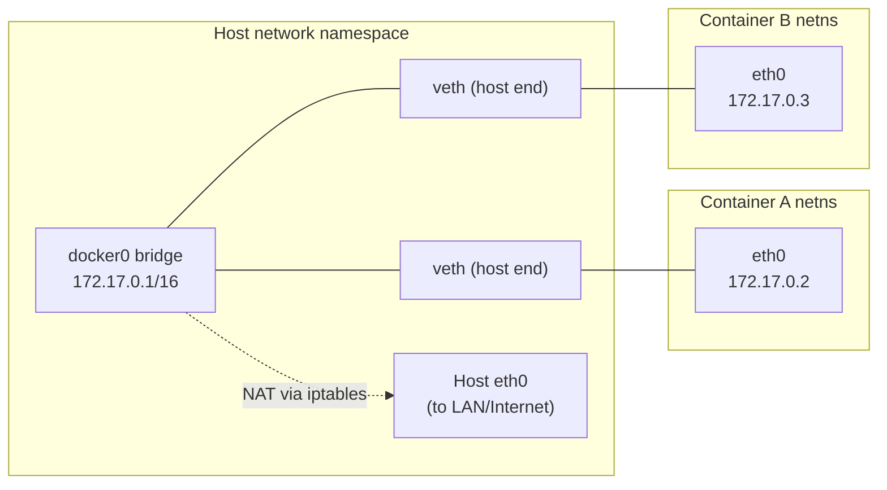
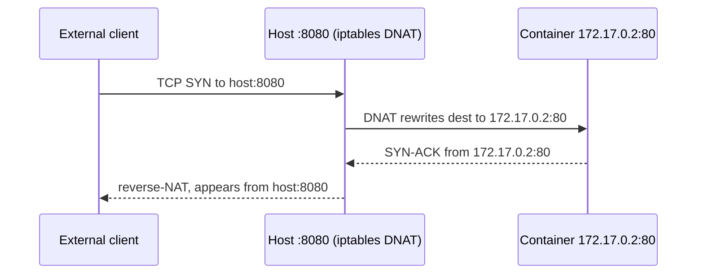

# Docker Networking

Topic 6 left two containers passing bytes through one shared volume with no way to address
each other: a container's ID changes on every recreate, so what does one call the other, and
which process answers that name? An embedded DNS server inside the engine answers it, and
[The embedded DNS resolver](#the-embedded-dns-resolver) shows the address it listens on and
where it gets its answers.

Run `docker run -d --name db postgres:16`, then `docker run -d --name api node-api`, then
`psql -h db` inside `api`. The name does not resolve. Both containers are running, both are
plugged into the same software bridge, and `api` can in fact reach the database at
`172.17.0.2:5432` — an address that changes the next time either one is recreated. Add
`--network appnet` to both `docker run` lines and `psql -h db` connects on the first
attempt. Nothing inside either container changed; only what their interfaces were plugged
into did. Three questions decide every container's connectivity, and this file answers all
three: what interfaces and addresses does the container see, how does a packet get out, and
how does anything outside reach back in?

> [!TIP]
> **Reading map.** About 50 minutes. It is a long file because the plumbing under a one-line
> `docker run` is genuinely deep. Sections 1-4 build the mechanism you need for everything
> else: the namespace, the bridge, the two kinds of bridge, and the resolver.
> If you already run everything through Compose and just want the plumbing under it, start
> at [iptables and NAT under the hood](#iptables-and-nat-under-the-hood) and read
> [Compose networks](#compose-networks) last. The macvlan and overlay sections are
> self-contained; skip them unless you run containers on a flat LAN or across several hosts.

> [!KEY-TAKEAWAY]
> Containers on the *default* `bridge` network can only reach each other by IP address.
> Containers on a *user-defined* bridge get name resolution for free. Nearly every "why
> can't my two containers talk to each other by name?" report resolves to "both are on the
> default bridge" — and the fix is one `docker network create`, or Compose, which does it
> for you.

---

## Network namespaces: the isolation mechanism

Two containers on the same machine can both bind port 8080 and neither one fails. Nothing
arbitrates between them, because neither one can see the other's port 8080 at all: the
kernel has handed each process group its own private copy of the network stack. That copy
holds its own interfaces, its own IP addresses, its own routing table, its own ARP table,
its own `/proc/net`, its own set of 65,535 port numbers per protocol, and its own `iptables`
rules. The kernel feature that hands out those copies is the **network namespace** — an
independent instance of everything the kernel knows about networking, attached to a set of
processes rather than to the machine.

A namespace with nothing in it is a dead end, so Docker has to run a wire into it. The wire
is a **`veth` pair**: two virtual network cards created together and permanently connected,
so a frame pushed into one comes out of the other. One card is moved into the container's
namespace, where it shows up as `eth0`; the other stays in the host's namespace. Because a
`veth` pair has exactly two ends, it connects exactly two namespaces — which is why the host
end does not dangle, but plugs into a software switch that every container's host end shares.

Starting one container on a bridge network is therefore four steps, in this order:

1. Create a new network namespace for the container.
2. Create a `veth` pair.
3. Move one end into the container's namespace and rename it `eth0`; attach the other end to
   the `docker0` bridge, which lives in the host's namespace.
4. Assign the container an IP from the bridge's subnet and install a default route through
   the bridge's own address.



You can read any container's copy of the stack directly, which is the fastest way to settle
an argument about what it can and cannot reach:

```bash
docker exec api ip addr    # the container's interfaces: lo and eth0
docker exec api ip route   # its default route, pointing at the bridge
```

The `eth0` in that output is one end of a `veth` pair; its peer sits on the host attached to
`docker0`. That copied stack is the whole of what "isolated" means here, so be exact about
what it leaves untouched.

### What the namespace leaves alone: the other seven kinds

Current Linux kernels have eight kinds of namespace, and the network namespace is one of
them. The other seven are mount, UTS, IPC, PID, user, cgroup and time. UTS is the one whose
name gives nothing away: it isolates the hostname and the NIS domain name. Time is recent
enough that older writeups count only six others, since its `/proc/<pid>/ns/time` handle first
appears in Linux 5.6. The eight are independent of each other. A process can share the host's
network namespace while keeping its own PID and mount namespaces, or the reverse.

That independence is what `--network host` actually does, and it is the reason a later
section calls that flag a loss of *network* isolation and nothing broader. The container is
placed in the host's network namespace, so it sees the host's interfaces and binds the host's
ports. It still gets its own PID namespace, so its process tree still starts at `PID 1` inside, while
`ps` on the host shows those same processes under different PIDs of its own. Nothing else
moves. There is no single
"isolated or not" switch to point at, which is what makes blast radius a per-namespace
question.

A namespace on its own explains where a container's addresses live but not where its packets
go, which is the bridge driver's job.

## The bridge network driver (default)

Typing `docker run -d nginx` with no `--network` flag at all still gets you a working
container that can reach the internet, and the driver that arranges it is `bridge`. On daemon
startup Docker creates a Linux software bridge named `docker0`, gives it the subnet
`172.17.0.0/16` and takes the address `172.17.0.1/16` on it, so containers land on
`172.17.0.2` upward. Those numbers are defaults, not
laws: `bip` or `default-address-pools` in `/etc/docker/daemon.json` moves the whole range,
which matters if `172.17` already belongs to something at your company.

A bridge is a software switch, so everything plugged into it shares one broadcast domain and
one subnet. Two containers on the same bridge reach each other with no help from Docker at
all, because to each of them the other is simply a neighbour on the same wire. Reaching
anything *off* the host is different: `172.17.0.2` is a private address that no router on the
internet will send a reply to, so the packet's source address is rewritten to the host's own
before it leaves. That rewrite is **source NAT**, or masquerading — the host substitutes its
own address on the way out and undoes the substitution on the replies coming back. So an
external service you call from a container logs the host's IP, never `172.17.0.x`.

That asymmetry decides what works with no flags and what does not. Outbound works
immediately, because masquerading is installed for you. Inbound from another machine does
not. Nothing outside the host has a route to `172.17.0.2`, and nothing on the host is listening
on the container's behalf. You ask for that with **port publishing**, the `-p` flag two
sections down. And a bridge only spans one machine — the `veth` ends have to
be attachable to the same bridge device, and a bridge device lives in one kernel — so
containers on two different hosts need the `overlay` driver instead.

```bash
docker network ls                 # bridge, host, none are always present
docker network inspect bridge     # see subnet, gateway, connected containers
docker run -d --name web nginx    # attaches to default bridge, gets 172.17.0.x
```

### How a frame crosses the bridge: MAC learning, not routing

Follow one packet from `api` to `db` when both sit on the same bridge and `api` has already
learned that `db` is `172.17.0.3`. Because `api`'s own address is `172.17.0.2/16`, its routing
table says `172.17.0.3` is directly connected — no gateway, no default route, no host
involvement. So `api` broadcasts an ARP request asking who owns `172.17.0.3`. The bridge floods
that request out of every port, as it must with any broadcast frame — a broadcast address is
never learned and never narrowed down. `db` answers with its MAC address, and `api` sends the
real TCP packet in a frame addressed to that MAC.

The bridge is now doing the one thing a bridge does. It read the source MAC on `db`'s reply
and recorded which port that reply arrived on, in a table the kernel calls the forwarding
database. When the next frame for that MAC arrives, the bridge looks it up and copies the
frame to exactly that one port — `db`'s `veth` end — instead of flooding. No routing decision
is taken, no address is rewritten, and no `iptables` NAT rule is consulted, which is the
mechanical reason east-west traffic between containers needs no `-p` and never appears in
your published-port list.

Two separate bridges therefore cannot reach each other by accident. Each is a distinct
device with its own forwarding database and its own subnet, and a bridge only ever copies
frames among its own ports, so a frame on `frontend` has nowhere to go on `backend`.
Crossing would require the host to route between the two subnets, and Docker installs
`filter`-table rules that refuse exactly that forwarding. This is the enforcing mechanism
behind the "each network is separate" row in the next section's table, and behind every
tiered setup later in this file.

The default `docker0` bridge is the one place where that convenience stops short, which is
the single most common cause of a container that cannot find its peer.

## Default bridge vs user-defined bridge

Both kinds of network run the same `bridge` driver, and only one of them will resolve a
container's name. `docker0` is what you get with no flags; a network you make yourself with
`docker network create appnet` is what you get when you ask. One question separates them in
practice — what does asking buy you? — and the answer has four parts.

| Feature | Default `bridge` (`docker0`) | User-defined bridge (`docker network create`) |
|---|---|---|
| Automatic DNS by container name | No — IP only | Yes — resolve peers by name or alias |
| Isolation from unrelated containers | All share one bridge | Each network is separate |
| Attach/detach a running container | No — detaching needs a stop and recreate | Yes, on the fly |
| Legacy `--link` needed for name lookup | Yes (legacy) | No |
| Recommended for new work | No | Yes |

Create one and the containers find each other by name:

```bash
docker network create appnet
docker run -d --name db  --network appnet postgres:16
docker run -d --name api --network appnet node-api   # the Express API from earlier topics
# inside api:  psql -h db ...   <-- "db" resolves via Docker's embedded DNS
```

The name `db` in that last line is a **container name**: the string you passed to `--name`,
which the engine's own DNS server answers for as long as the asking container shares a
user-defined network with it. That is the piece topic 6 was missing. A container ID changes
on every recreate and an IP changes with it, but the name you chose does not, so the name is
the only stable handle one container has on another. One catch is worth knowing before it
bites you: only names you set yourself resolve. Skip `--name` and Docker invents something
like `nervous_hopper` for the CLI's benefit, and that generated name is not in DNS.

Run the same `psql -h db` on the default bridge and it fails at the resolver, before any
packet is sent. Your only options there are the container's current IP, which you would have
to re-read after every recreate, or the `--link` flag below. This is why Docker Compose
creates a user-defined bridge for every project without being asked: it is the cheapest way
to make service names work as hostnames.

> [!INTERVIEW]
> "Two containers on the default bridge — why can't A reach B by name?" The default bridge
> runs no DNS for container names, so the lookup fails before any packet leaves A. Put both
> on a network you created, or let Compose create one, and the names resolve.

### Why the default bridge kept the old behaviour

Nothing technical stops `docker0` from resolving names. It is the same driver, and the same
driver does resolve names on `appnet`. What you are looking at is history that was never
rewritten. Before user-defined networks existed, every container landed on `docker0`, and
the only ways to address a peer were its IP address or `--link`. Docker added the resolver
alongside the new network type and left the old one exactly as it was. The reason is that
`docker0` is what a container gets when its author asked for nothing, and that includes
every script written years ago which reads `172.17.0.x` out of `docker inspect`. So the rule
is historical rather than architectural, and the docs mark the default bridge legacy rather
than fixing it.

`--link` is the mechanism that filled the gap, and it explains why nobody should reach for it
now. `docker run --link db:webdb` writes the linked container's address
into the new container's `/etc/hosts`. Separately, it injects a pile of environment
variables. There is `WEBDB_NAME`, then `WEBDB_PORT_5432_TCP_ADDR`, `_PORT` and `_PROTO` for
each exposed port, plus `WEBDB_ENV_<name>` for every variable Docker set on the source
container. That last group is the problem. Every `-e` and `--env-file` value you passed to
`db` — database passwords included — is copied into the consumer's environment, where any
process in it can read them. Docker's own documentation calls out the security implication,
labels the whole flag legacy, and says it may eventually be removed.

Once a name resolves, the obvious next question is which process is doing the resolving.

## The embedded DNS resolver

Every container on a user-defined network has a DNS server inside its own namespace, at
`127.0.0.11` — an address inside the container's own loopback range. Look up `db` there and you get `db`'s
address on the network the two of you share. Look up `example.com` and the same server hands
the query onward to whatever upstream servers the host is configured to use, then returns the
answer. So one nameserver covers both jobs, and nothing inside the container needs to know
which is which.

```bash
docker exec api cat /etc/resolv.conf   # nameserver 127.0.0.11
docker exec api getent hosts db        # resolves to db's IP on appnet
```

Three properties of that resolver shape how you design around it. Resolution is scoped to the
network, so a container resolves only the names of containers it shares a user-defined network
with — being on the same host buys nothing. Names are not limited to the container name. A
**network alias** is an extra name for the same container on one network, set with
`--network-alias primary` at run time or `--alias` when attaching to an existing network.
Compose can give several replicas the same alias, so one lookup returns several addresses and
clients spread across them. And the mapping is maintained live rather than written once,
so a container that is recreated with a new IP still answers to the same name. That last
property is the whole argument against hard-coding a container IP anywhere: the name survives
what the address does not.

"The default bridge has no DNS" is a shorthand, and the precise version matters. There is a
`/etc/resolv.conf` there, and it is a copy of the host's, pointing straight at the host's
upstream servers. Public names therefore resolve perfectly well; only container names fail,
because no server in the path has ever heard of them. A second difference shows up in a
failure. On a custom network the embedded server tries upstream servers in order and stops at
the first success or `NXDOMAIN`. On the default bridge the container's own resolver library
decides, and some libraries query several servers in parallel and take the first reply even
when that reply is `NXDOMAIN`.

### How 127.0.0.11 can be a loopback address and a server at once

The address is the puzzle. `127.0.0.11` is loopback, so a packet sent to it never leaves the
container's network namespace, and yet the process answering is `dockerd` on the host. Both
halves are true, and the trick is that a socket belongs to a namespace while the process
holding it does not have to. The engine's own word for a container's whole networking setup —
its namespace plus the interfaces, addresses and rules inside it — is the **sandbox**, and
building one is where this happens. The engine switches into the container's new network
namespace, opens a UDP socket and a TCP socket on `127.0.0.11`, then switches back. The
sockets stay in the container's namespace, held by a process outside it. The engine then
installs `nat` rules inside that same namespace so that traffic to port 53 lands on the
ephemeral port the kernel actually assigned. Docker's source calls the address
`resolverIPSandbox` for that reason, and the routine that opens the sockets is documented as
the one to run inside the container's network namespace.

The other half of the question is how the engine knows the answer, and the answer is that it
never had to look it up. The engine is what assigned `db` its address in the first place, when
it attached that container to `appnet`. The name-to-address mapping is a side effect of
attachment, recorded at the moment the container joins the network — which is before any
process inside the container has run, let alone bound a port.

`/etc/resolv.conf` is engine-generated too, not something the image ships. The engine writes
it under `/var/lib/docker/network/files/<sandbox-id>/resolv.conf`, with the header `#
Generated by Docker Engine.`, and mounts it in. It starts from a copy of the host's file,
then swaps the host's nameservers for `127.0.0.11` and keeps the displaced ones as its own
upstreams. Two limits on that upstream path explain DNS that is slow rather than broken: the
resolver tries at most three external servers and gives each one four seconds. Edit the file
by hand inside a running container and the engine notices the change and stops rewriting it,
which is convenient and also a good way to strand yourself.

The resolver has no IPv6 counterpart. Nothing plays the role of `127.0.0.11` in the IPv6
loopback range, so the IPv4 address is used even by containers that have only IPv6 addresses
otherwise.

The resolver only exists because the container has its own namespace to put it in, so the
next question is what happens when you take that namespace away.

## Host network driver

`--network host` skips the namespace entirely: the container joins the host's network
namespace instead of getting a new one. There is no `veth` pair, no `docker0`, no NAT, and no
per-container IP address, because there is no second stack to bridge to. A process that binds
port 8080 inside that container has bound port 8080 on the host, and `ss -ltnp` on the host
shows it directly.

```bash
docker run -d --network host nginx   # nginx :80 is now the host's :80
```

What you buy is the removal of every hop the bridge added. Traffic no longer crosses a `veth`
pair, no source or destination address is rewritten, and no userland helper process is started
per published port. The container also sees the host's real interfaces, with their real names
and addresses. For some workloads that is the only way they work at all. A DHCP client, a
monitoring agent reading per-interface counters and a service that has to advertise the host's
own address to peers all fail behind NAT.

What you pay is the two things the namespace was providing. Network isolation is gone — a
process in that container can bind any host port and reach anything the host can reach,
including services bound to the host's loopback that you assumed were unreachable from
containers. And port mapping stops meaning anything: `-p`, `-P`, `--publish` and
`--publish-all` are all ignored, and Docker tells you so with
`WARNING: Published ports are discarded when using host network mode`. Two host-mode
containers that both want port 8080 collide exactly as two ordinary host processes would, and
so does one host-mode container against a service already running on the machine. Take the
trade only if you can name the interface-level or port-range reason you need it; the moment the
reason is only "it seemed faster", the bridge is the better default.

> [!WARNING]
> "Host mode is just a faster bridge" is the belief that causes the damage. Host mode is a
> different isolation boundary. A compromised process in a host-mode container can bind
> privileged host ports it does not own, and can reach services on the host's loopback that no
> bridge network can see. Treat the flag as a security decision with a performance benefit,
> not the reverse — `docker-security` covers the blast radius.

### Where it breaks: Docker Desktop is not the host

On macOS and Windows the daemon runs inside a Linux virtual machine, so "the host" that
`--network host` joins is that VM, not your laptop. For years that made the flag close to
useless there. Docker Desktop 4.34 added support, opt-in: sign in to your Docker account, open
Settings, then under the Resources tab choose Network, tick "Enable host networking", and
apply and restart.

Even switched on it is not the Linux behaviour, and the differences follow from it being an
emulation rather than a shared namespace. The implementation works at layer 4, so TCP and
UDP are carried and anything below them is not. A containerised process cannot bind a
specific host IP address, only the port, because it has no direct access to the host's
interfaces. Host networking on Desktop is also incompatible with Enhanced Container
Isolation, since one feature exists to reach the host and the other exists to prevent that.
And only Linux containers are covered. If you are testing something that depends on seeing
real interfaces, you still need a Linux host.

Sharing the host's stack is one extreme; the other is a namespace with nothing plugged into
it at all.

## None network driver

`--network none` gives the container a network namespace and then plugs nothing into it. The
container gets a loopback interface, `lo`, and nothing else: no `eth0`, no `veth` pair, no
bridge membership, no address on any subnet, and therefore no way to send or receive a
packet outside itself.

```bash
docker run --rm --network none alpine ip addr   # only lo, 127.0.0.1
```

A namespace with nothing plugged into it is the strongest network isolation the engine
offers without extra tooling. Reach for it when network access would only ever be a
liability. That covers a batch job which reads and writes local files, an untrusted build or
a piece of submitted code, and a data transform whose inputs all arrive on a volume. `none`
is also the safe starting point when you intend to attach a network deliberately later,
because `docker network connect` works on a running container, and `none` means nothing was
reachable in the meantime.

Isolating a container is easy; the harder direction is letting something outside the host in,
and that is where two similar-looking Dockerfile and CLI features get confused.

## Port publishing (-p) vs EXPOSE

`EXPOSE` has never opened a port in its life. `EXPOSE 8080` in a Dockerfile records that the
program in this image listens on 8080, and `expose:` in Compose records the same thing about
the container it creates; neither changes anything about what can reach that port. `-p` /
`--publish` is the flag that does the work, by installing a kernel rule that rewrites the
destination of packets arriving on a host port so they arrive at the container's port
instead. Confusing the two produces the single most common "why can't I curl my container?"
report there is.

```bash
docker run -p 8080:80  nginx     # host :8080 -> container :80
docker run -p 80        nginx    # container :80 -> a RANDOM host port (container-port-only form)
docker run -P           nginx    # publish ALL EXPOSEd ports to random high host ports
docker run -p 127.0.0.1:8080:80 nginx   # bind only to loopback (not 0.0.0.0)
```

The full form is `[hostIP:]hostPort:containerPort[/protocol]`, and each optional piece answers
a different question about the mapping. *Who can reach it* is the `hostIP`. Leave it out and
Docker binds `0.0.0.0`, every interface the host has, so `-p 8080:80` on a machine with a
public address is published to the internet. Write `127.0.0.1:8080:80` when you meant "only
this machine". *Which host port* is the `hostPort`, and `-P` is the version that lets the
kernel choose. It publishes every port the image declared to a random port out of the ephemeral
range in `/proc/sys/net/ipv4/ip_local_port_range` — handy for parallel test runs, useless for
anything a human has to type. *Which protocol* is the suffix, defaulting to TCP, with `udp` and
`sctp` available; a port that serves both TCP and UDP needs two mappings.

Publishing is for traffic entering the host from outside it, and nothing else. Two containers
on the same user-defined network already reach each other on the container's real port, because
their frames cross the bridge without any rule being consulted. So adding `-p` to the database
container does not help the API reach it, and it does hand the LAN a route to your database.

> [!INTERVIEW]
> "I added `EXPOSE 3000` but `curl localhost:3000` on the host fails — why?" Because `EXPOSE`
> publishes nothing; it only records the port in the image. You need `-p 3000:3000` or `-P`.
> The follow-up worth volunteering: service-to-service calls inside a shared Docker network
> never needed `-p` at all.

### Where EXPOSE actually lives: the image config

`EXPOSE` writes into the image config, the same JSON object that carries the entrypoint and
the environment from earlier topics. The field is `ExposedPorts`. The OCI image
specification defines it as a set whose keys look like `8080/tcp`, with `tcp` assumed when
no protocol is given. The example in the spec is literally `"ExposedPorts": {"8080/tcp":
{}}`. That is why `docker inspect` can show you a port nobody published. It is also why the
value survives `docker push` and `docker pull` while a `-p` flag does not: one is part of
the artifact, the other is part of one container's runtime configuration.

The spec is also precise about the relationship, and the sentence settles the "is it just
documentation?" argument: these values "act as defaults and are merged with any specified when
creating a container". So `EXPOSE` is a default that the run command may add to, and `-P` is
the flag that says "use the defaults". Nothing reads `ExposedPorts` unless you ask it to,
which is why an image full of `EXPOSE` lines and a container with no `-p` is a perfectly
ordinary and completely unreachable combination.

Publishing explains how the outside world gets in. It says nothing about how two containers
reach each other, which needs its own rules.

## Container-to-container communication

Whether two containers can talk is decided entirely by whether they share a network. There are
three answers, and two of them look identical from inside the application, so keep them apart.

Sharing a user-defined network is the good case. `api` reaches the database at `db:5432`, and a
browser-facing service reaches the API at `http://api:3000` — by name, on the container's own
port, with nothing published. Sharing the default bridge works too, but only by address: the
connection string has to carry `172.17.0.3`, and be rewritten every time the peer is recreated.
Being on different networks means no connectivity at all, and it fails at the resolver. `db`
does not resolve, because as the bridge section showed, a frame on one bridge has nowhere to go
on another.

That last case is a control, not an obstacle. A container can be attached to several networks at
once, getting one `eth0`, `eth1` and so on per network, which is called multi-homing. So you
decide which pairs can reach each other by deciding which networks each container joins:

```bash
docker network create frontend
docker network create backend
docker run -d --name db  --network backend  postgres:16
docker run -d --name api --network backend  node-api            # api <-> db OK
docker network connect frontend api                             # api now also on frontend
docker run -d --name proxy --network frontend -p 80:80 nginx    # proxy -> api, not db
```

Read the last two lines as the security property they encode. `proxy` is the only container
with a published port, so it is the only one the outside world can reach; it sits on
`frontend` only, so the furthest it can get inside is `api`. The database is on `backend`
alone, and no rule anywhere has to be written to keep `proxy` away from it: the absence of a
shared network is the enforcement. When someone finds a remote-code-execution bug in your reverse
proxy, that layout is the difference between an incident and a breach. It costs one extra
`docker network create`.

The trade you are making is reachability for review effort: every extra network is another
thing to get right in Compose and another edge in your head when debugging "why can't A see
B". Two tiers is nearly free and worth it whenever anything holds data you would not publish.
Beyond three or four, the segmentation is doing work an orchestrator's network policies do
better, and the cost of hand-maintaining it stops paying for itself.

Even with the network right, one address inside a container means something different from
what almost everyone expects.

## localhost inside a container is not the host

Inside a container, `localhost` and `127.0.0.1` mean that container's own loopback interface
and nothing else. The namespace section is the whole reason: loopback is part of the network
stack, every namespace gets its own copy, and a packet sent to `127.0.0.1` in one namespace
cannot leave it. So `curl localhost:5432` inside `api` reaches neither a Postgres in another
container nor one on the host. It asks `api` whether *it* has anything listening on 5432, gets
no, and returns connection refused. The error is honest; the address
was wrong.

Which address is right depends on where the thing you want lives. Another container is reached
by its container name on a shared user-defined network, so the fix is `db:5432`. A service on
the host machine is reached by `host.docker.internal`, a hostname Docker Desktop resolves for
you and that you create yourself on Linux with `--add-host`:

```bash
# reach a DB running on the host machine from inside a container:
docker run --add-host=host.docker.internal:host-gateway node-api
#   then connect to host.docker.internal:5432
```

`host-gateway` is the piece doing the work, and it is a value the flag understands rather than
a name that resolves anywhere: Docker substitutes the host's internal address for it and writes
the result into the container's `/etc/hosts`. Pairing it with the name
`host.docker.internal` is convention, and following the convention is what makes one
`docker run` line work on a laptop and a Linux server. On Linux you can skip the alias and use
the bridge gateway address directly: `172.17.0.1`, the address `docker0` holds. Two things
about that shortcut. It moves if you changed the subnet, and the host process has to be bound
to something other than its own loopback before a container can reach it at all.

> [!INTERVIEW]
> "My app in a container connects to `localhost:5432` for a database in another container and
> it fails — why?" Because `localhost` is that container's own loopback, in its own namespace.
> Put both containers on a user-defined network and connect to the database by its container
> name. The follow-up: on the host, the same fix is `host.docker.internal`, not `localhost`.

Names, addresses and published ports all end up as kernel rules, and the rules explain several
behaviours that otherwise look like bugs.

## iptables and NAT under the hood

Every promise the bridge driver made is kept by rules Docker writes into `netfilter`, the
kernel's packet-filtering framework that `iptables` is the front end for, and you can read
them with `iptables -t nat -L -n`. That machinery is organised as a handful of *tables*, each
holding *chains* that are consulted at fixed points in a packet's journey; Docker uses two of
them. In the `nat` table it rewrites addresses. In the
`filter` table it decides what to allow.

Two rewrites carry all the traffic. On the way out, a packet from `172.17.0.2` heading for the
internet reaches the `nat` table's `POSTROUTING` chain, where a rule with target `MASQUERADE`
replaces its source address with the host's. That is why the far end logs the host's IP, and why the reply,
addressed to the host, still finds its way back to the right container. On the way in,
`-p 8080:80` installs a rule in the `nat` table's `PREROUTING` chain that rewrites the
destination of anything arriving on host port 8080 to `172.17.0.2:80`. The kernel tracks the
connection, so the reply's source is rewritten back to the host on its way out, and the
external client never learns a container was involved.



Rewriting a destination is useless if the kernel then declines to move the packet, so Docker
also turns on IP forwarding at startup if it is not already on, setting
`net.ipv4.ip_forward=1` and the IPv6 equivalent. Turning that on would make the machine a router for anything
that asked, so when Docker enables forwarding it also sets the `filter` table's `FORWARD` chain
policy to `DROP` and adds its own rules for the traffic it wants. You can decline that half
with `--ip-forward-no-drop` if the host genuinely is a router.

Your own firewall rules go in one specific place. Docker builds its own chains in the `filter`
table — `DOCKER`, `DOCKER-FORWARD`, `DOCKER-BRIDGE` and others — and reserves one of them,
`DOCKER-USER`, for you. It is jumped to from `FORWARD` before any of Docker's own rules, and
Docker never rewrites its contents. Anything you add elsewhere risks being reordered or
flushed the next time the daemon restarts a container. One detail bites people writing those
rules: by the time a packet reaches `DOCKER-USER` it has already been through DNAT, so
matching on `--dport 8080` matches nothing — the destination now reads `172.17.0.2:80`. Match
the original instead, with `conntrack --ctorigdstport 8080`, accepting that `conntrack` matches
cost more per packet than plain address matches.

### Where the chains sit: why ufw never sees the packet

Publish port 8080 on a host where `ufw` is configured to deny 8080, and the port is reachable
from the LAN anyway. That is not a bug in either one. It follows from where in the packet's
path each of them installed its rules. Walk the arriving packet through in order:

1. `nat` / `PREROUTING` runs first, and Docker's DNAT rule rewrites the destination from
   `host:8080` to `172.17.0.2:80`.
2. The kernel then makes its routing decision, and it makes it on the *new* destination. That
   address is not the host's, so the packet is not delivered locally — it is to be forwarded.
3. Forwarded packets traverse `filter` / `FORWARD`. Locally delivered packets traverse
   `filter` / `INPUT`. This packet goes to `FORWARD`.
4. `ufw`'s deny rule lives in `INPUT`, which this packet never reaches. Docker's own jump to
   `DOCKER-USER` sits at the top of `FORWARD`, and `ufw` did not put anything there.

So `ufw` is working exactly as configured, on a chain the traffic does not use. There are two
real fixes and they differ in scope. Publishing to `127.0.0.1:8080:80` binds the mapping to
loopback, so nothing off the machine can reach it at all. Adding your rules to `DOCKER-USER`
keeps the mapping public but filters it, which is the option you want when some sources should
get through — and remember from above that the match has to be on the pre-DNAT port.

Docker Engine 28 narrowed the exposure in a related case. Before it, a host on the same
network could reach *any* container port by addressing the container's IP directly, published
or not, as long as it had a route to the bridge subnet. Engine 28 blocks that: packets aimed
straight at a container address are dropped by a rule in the `raw` table's `PREROUTING` chain,
which runs before `filter`, so a `DOCKER-USER` rule cannot re-permit them. Sometimes you need
that access back — a load balancer next to the host, or a Kubernetes plugin rewriting
destinations before the packet arrives. For those, 28.2 added two ways to allow it. The
`allow-direct-routing` daemon option turns the filtering off for the whole daemon; the
`com.docker.network.bridge.trusted_host_interfaces` network option takes a list of host
interface names, so only traffic arriving on those is let through.

> [!WARNING]
> "My firewall denies that port, so nothing can reach it" is the belief that gets hosts
> compromised. A published Docker port is reachable from anywhere that can route to the host
> unless you either bound it to `127.0.0.1` or wrote a `DOCKER-USER` rule. Check with
> `iptables -t nat -L DOCKER -n` from the host itself rather than trusting `ufw status`, which
> reports honestly about chains this traffic does not enter.

### What docker-proxy is still for, and what turning the rules off costs

Run `ss -ltnp` on a host with one published port and you will find a process called
`docker-proxy` holding it. It looks redundant next to the DNAT rule, and for traffic arriving
on a real interface it is: that path is pure kernel. The proxy exists for the case NAT handles
badly, which is a connection that turns around inside the host without ever reaching the wire
— a *hairpin*. The clearest instance is `curl 127.0.0.1:8080` on the host itself.

Follow why that one is hard. Both addresses in that connection are loopback addresses, and
RFC 1122 requires that addresses in `127.0.0.0/8` never appear outside a host. Rewriting only
the destination to `172.17.0.2` would leave a packet with a loopback source that has to cross
`docker0`, and the container's reply would be addressed to `127.0.0.1` — its own loopback, not
the caller's. A userland process sidesteps all of it: `docker-proxy` accepts the connection
like any ordinary server and opens a second connection to `172.17.0.2:80`, so each half is
between two addresses that can legitimately talk to each other.

That is a choice, not a necessity, and the daemon exposes it. `--userland-proxy` defaults to
true, so a proxy process is created per published port unless you set `"userland-proxy": false`
in `/etc/docker/daemon.json`. Turn it off and the kernel handles the loopback case too, via a
masquerade rule that rewrites the source as well as the destination. Engine 28.0 made the two
mutually exclusive, skipping those `nat`/`POSTROUTING` rules for a container's own published
ports whenever the proxy is on. So "modern Docker relies mainly on `iptables`" is true of the
data path and not of the process list: the proxy is still there by default. What it costs is
one process per published port and one userspace copy of every byte on the loopback path, which
is why a container publishing a wide port range is the usual reason to switch it off. Host-mode
containers start no proxy at all, since they have no mapping to proxy.

Turning off Docker's rule management entirely is a bigger decision than it sounds, because
three separate things stop working. Start the daemon with `--iptables=false`, or set
`"iptables": false` in `daemon.json`, and Docker adds no masquerade rules, "even if you set
`--ip-masq` to `true`", so containers lose outbound access to the internet. It adds no DNAT
rules either, so `-p` becomes a flag that records your intent and nothing more, and you must
write the mappings yourself. The filtering rules that keep the LAN from reaching container
addresses directly go with them too. So every container port becomes reachable from the
local network, which is the opposite of what someone disabling firewall integration expects.
The legitimate use is running a second daemon or a different network plugin that owns the
rules instead; if that is not your situation, leave it alone.

One host's worth of bridges and rules stops working the moment your containers need to live on
two machines.

## Overlay networks (multi-host / Swarm)

The overlay driver makes containers on two different machines behave as though they shared one
bridge, and it does it by putting their frames inside ordinary UDP packets sent to port 4789.
A container on host A addresses a frame to a container on host B. Host A wraps that whole
frame, headers included, in a UDP packet sent to host B's real address. Host B unwraps it and
delivers the frame to the right container. Nothing in between needs to know containers exist,
because
what it is switching is a normal UDP flow between two hosts. That wrapping is **VXLAN**, a
standard way to carry one Ethernet segment inside a UDP payload, and the containers at each end
see only a single flat network.

```bash
docker network create -d overlay --attachable mynet   # on a swarm manager
docker service create --network mynet --name api node-api
```

Overlay needs a control plane, because host A can only wrap a frame if something told it which
host to send it to, and that machinery is Swarm mode. `docker swarm init` is a prerequisite
even when the things you attach are ordinary containers rather than services, and those
containers can only join a network created with `--attachable`. What you get in return starts
with the same name resolution a user-defined bridge gives you, now working across hosts. Then
it adds a publishing model no single-host bridge can offer. Every node joins an ingress routing
mesh, so a service's published port answers on *any* node in the swarm, including nodes running
none of that service's containers, and the request is forwarded to a node that has one. The
port is not literally bound on each machine — the docs are explicit that "port 8080 may not
actually be bound" — which is also why two nodes publishing the same port do not conflict.

Three ports have to be open between the nodes, and each carries a different kind of traffic.
TCP 2377 is the Swarm control plane, where managers and workers exchange cluster state;
`docker swarm join --listen-addr` moves it. UDP 4789 carries the encapsulated container
traffic itself and moves with `docker swarm init --data-path-port`. TCP and UDP 7946 carry node
discovery between the machines and cannot be moved at all, which makes it the one to check
first when a swarm forms but its networks do not work. If you also add `--opt encrypted`,
Docker turns on IPsec inside the VXLAN tunnels, at a performance cost its own documentation
calls non-negligible and with no support for Windows containers.

### What every node has to know: the overlay's shared state

Host A cannot wrap a frame until it knows which host's address to wrap it toward. So
something has to hold a live answer to one question: which machine holds the container at
overlay address `10.0.9.4`? Every node needs that answer for every peer its containers talk
to. It has to change whenever a container is created, moved or destroyed. And no node can be
allowed to act on a stale copy, because two nodes disagreeing about who owns an address
means traffic wrapped toward a machine that will drop it. That addressing requirement is
what Swarm's built-in store exists to hold, alongside the services and tasks themselves.

Only manager nodes hold it. Managers run the Raft consensus algorithm to keep one consistent
copy of the global cluster state between them, which is where the familiar arithmetic comes
from. A quorum is `(N/2)+1` managers, so a group of N tolerates `(N-1)/2` failures: three
managers survive one loss, five survive two. Losing quorum is a partial outage rather than a
total one, and the shape of it is worth knowing before you are in it. Containers already running
keep running and keep talking, because their nodes already have the addressing they need. But
nothing can be scheduled, rebalanced or replaced until a majority is back.

Load balancing hangs off the same state. By default a service is published with
`--endpoint-mode vip`, and the service name resolves to a single **virtual IP** — an address the
swarm owns that belongs to no container. A client connects to it, and the swarm forwards each
connection to one of the service's tasks. The client never learns a task address, so it cannot
cache one that is about to disappear. `--endpoint-mode dnsrr` inverts the trade: DNS returns
every task's address and the client picks, so you control the choice and pay with whatever your
client's DNS caching does to you during a deploy. On each node, the `docker_gwbridge` bridge is
what joins the ingress network to the host's real interface.

The one number to hold onto is the encapsulation overhead, because it produces a failure that
does not look like a network failure. Start with the ceiling it eats into: a path's **MTU** is
the largest packet that path will carry in one piece, and 1500 bytes is the usual figure on
Ethernet. That figure counts the IP packet, not the Ethernet header wrapped around it — which
is exactly why the arithmetic below charges an inner Ethernet header and not an outer one.
Over IPv4 the tunnel costs 50 bytes: 20 for the outer IP header, 8 for UDP, 8 for VXLAN
itself, and 14 for the inner Ethernet header the tunnel has to carry, because what it is
carrying is a frame. So on a 1500-byte path, the outer IP, UDP and VXLAN headers take 36,
leaving 1464 bytes of inner frame; the inner Ethernet header takes 14 of those, leaving 1450
bytes for the inner IP packet the application's data actually rides in.

RFC 7348 forbids the sending end from fragmenting VXLAN packets and lets the receiving end
silently discard fragments it gets, so an oversized inner packet is simply not delivered. Small
packets are unaffected, which is the trap: the TCP handshake completes, small requests succeed,
and the first full-size transfer stalls. Whether you get a clean error or a hang depends on
whether the ICMP "fragmentation needed" message reaches the sender. A firewall that drops ICMP
turns a correctable condition into a connection that sits there retransmitting.

The engine sets an MTU on an overlay network's interfaces rather than leaving them at the
underlay's 1500, and `-o com.docker.network.driver.mtu=` is how you override it. Docker's own
documentation states no default value for that option, so the figure in force on your cluster
is whatever `docker network inspect` prints there — not one you can read out of a document,
including this one.

Kubernetes solves the same cross-node problem with a different mechanism, and the name to
know is a CNI plugin, such as Calico, Cilium or Flannel, rather than the overlay
driver. That is the "what replaced this" answer, and the machinery belongs to a separate domain.

Encapsulation buys reach across hosts by hiding containers behind host addresses. The opposite
choice — putting containers directly on the physical network — is a different driver.

## Macvlan and ipvlan

A macvlan container gets its own MAC address and its own address on the physical LAN, so
nothing else on that network can tell it from a separate machine. Your router hands it a route,
your DHCP server can hand it a lease, and a colleague on the same office network can reach it at
`192.168.1.50`. None of that involves NAT or a published port: Docker writes no packet filter
rules for macvlan, ipvlan or host networking at all.

Reach for it when being behind an address translator is the actual problem. Two cases qualify:
appliances and legacy services that advertise their own address to peers, and monitoring tools
that need to see traffic as the LAN sees it.

```bash
docker network create -d macvlan \
  --subnet=192.168.1.0/24 --gateway=192.168.1.1 \
  -o parent=eth0 lan
docker run -d --network lan --ip 192.168.1.50 node-api   # a real LAN IP
```

The `parent` option is the load-bearing part: it names the host interface the container's
traffic physically leaves through. Give it a dotted name like `eth0.50` and Docker reads that
as VLAN 50 — one of the separate logical networks a switch can carry over a single physical
cable, each tagged with its own number — and creates the tagged sub-interface for it itself.
That tagging scheme is the 802.1Q standard, and this is how you land different Docker networks
in different VLANs off one cable. `ipvlan` is the same idea with one MAC address
instead of many. In its layer-2 mode the containers share the parent interface's MAC and differ
only by IP, so the switch sees one address where macvlan would show it a dozen. Pick ipvlan when
something upstream counts MAC addresses per port, which switch security features routinely do.

### Where it breaks: the host, the cloud, and the count of MAC addresses

The gotcha that costs an afternoon is that the host cannot reach its own macvlan containers.
`ping 192.168.1.50` from the host times out, while the same ping from any other machine on the
LAN answers immediately. Docker's documentation is blunt about the cause: it is a restriction in
the Linux kernel, not a configuration you got wrong. Meanwhile the container stays perfectly
reachable from every *other* machine on the LAN, which is what makes it so confusing to debug.
There are two fixes. Attach the container to a bridge network as well as the macvlan one, so
the host has a second path to it. Or create a macvlan interface on the host itself using the same parent
interface, and give that interface an address inside the Docker network's subnet; the host then
reaches the containers through it as any other LAN device would.

The requirement underneath macvlan is what rules out most environments. One physical
interface has to carry several MAC addresses, which the Docker docs call handling
promiscuous mode, and the equipment on the other end of the cable has to be willing to learn
all of them. Most cloud providers block exactly that, so a macvlan network on an EC2
instance or a managed VM will not pass traffic. The docs go as far as saying you may need
physical access to your networking equipment. Any link that will not carry a second MAC
address behind one endpoint fails the same requirement, which is why wireless is not a
realistic place to try this. There is a scaling cost even where it works, and the docs name
it: too many unique MAC addresses on a network is a condition called VLAN spread. A few
hundred containers each announcing their own address will degrade a network that was sized
for a few dozen machines.

Three limits bound where macvlan can run at all. It is Linux-only, so Docker Desktop cannot
offer it. It wants kernel 3.9 as a minimum, with 4.0 or newer advised. And it is unsupported in
rootless mode. Inside those bounds the `macvlan_mode` option takes `bridge`, `vepa`, `passthru`
or `private`. The default, and the one nearly everyone wants, is `bridge`: containers sharing a
parent interface talk to each other locally instead of having each frame pushed out to the
switch and back, which is what `vepa` does.

Choosing a driver is one decision; the commands that create networks and move containers
between them are another.

## Managing networks and connecting containers

A network is an object with its own lifecycle, independent of the containers on it, and the
`docker network` command group is how you manage that lifecycle. `--network` picks a
container's first network at `docker run`; leave it off and you get the default bridge.
`connect` and `disconnect` change the wiring of a container that is already running, which the
default bridge cannot do.

```bash
docker network create --driver bridge --subnet 10.10.0.0/24 appnet
docker network ls
docker network inspect appnet          # subnet, gateway, connected containers, IPs
docker run -d --name c1 --network appnet --network-alias svc alpine sleep 1000
docker network connect other c1        # c1 is now multi-homed on appnet + other
docker network disconnect appnet c1
docker network rm appnet               # fails if containers still attached
docker network prune                   # remove all unused networks
```

`docker network inspect` is the one to reach for when something cannot reach something else. It
prints the subnet, the gateway and every attached container with its address on that network,
which settles "are these two actually on the same network?" in one command instead of three
guesses. Attaching a running container is what makes tiered layouts practical. A container gets
an `eth0` on its first network and an `eth1` on the next, so it can now reach peers on both while
peers on either one still cannot reach across it.

The two removal commands differ in how much they will do without asking. `docker network rm`
refuses while a container is still attached, so you disconnect or remove the containers first;
that refusal is a feature, since it stops you deleting the network out from under something
that expects to find it. `docker network prune` removes every network no container references,
and its definition of unused is exactly that: not referenced by any container. It never touches
`bridge`, `host` or `none`. One difference from volumes: there is no `-a` here to widen the
sweep, because there is no second, narrower meaning of unused to widen from. `--filter
until=24h` and `--filter label=...` narrow it instead.

### Why you would set the subnet yourself

`--subnet 10.10.0.0/24` in that first command was not decoration. Left alone, Docker
allocates from its own default pool: `172.17`, `172.18` and onward, mostly inside
`172.16.0.0/12`, with chunks of `192.168.0.0/16` behind them. Both blocks are RFC 1918
private space, which means your employer is equally entitled to use them — and `192.168` is
the space office LANs and VPNs reach for first. The collision is specific rather than
occasional. If your VPN or corporate router advertises a route that overlaps the range
Docker picked, containers on that network cannot reach those internal addresses at all. The
reason is the container's own routing table: it says the destination is a neighbour on the
bridge, so the packet never leaves for the gateway. The symptom is an internal service that
is reachable from the host and unreachable from the container.

Three options control the addressing, and they answer different questions. `--subnet` says which
block the network uses, which is the one that fixes a collision. `--gateway` says which address
in it the bridge itself holds, and you rarely need to set it. `--ip-range` narrows the part
Docker allocates from automatically, which is how you reserve addresses for containers you pin
with `--ip`. Sizing the subnet down pays off on a busy host too. A `/24` per network gives you 254
usable addresses, so many networks fit inside one block you have cleared with your network
team. A `/16` each burns that same space 256 times faster.

Doing all of this by hand for a five-service application is exactly the work Compose exists to
remove.

## Compose networks

Compose does all of the previous section for you and asks for nothing in return. The network
it creates is always named `<project>_default`. Start a project in a directory called
`myapp` and Compose creates `myapp_default`, then attaches every service in the file to it.
The prefix is the project name, taken from the directory unless you override it with
`--project-name` or `COMPOSE_PROJECT_NAME`. Each service registers its name with the
engine's internal DNS server, so `api` reaches the database at `db:5432` with no `ports:`
entry, no address and no configuration you wrote. This is the same user-defined bridge and
the same resolver at `127.0.0.11` from earlier in this file; Compose simply always creates
one.

Declaring your own networks is how you get segmentation, and it reads the way the layout works:

```yaml
services:
  api:
    build: .
    ports: ["8080:8080"]     # expose to host
    networks: [frontend, backend]
    environment:
      DB_HOST: db            # resolves via Compose DNS to the db service
  db:
    image: postgres:16
    networks: [backend]      # NOT on frontend — api can reach it, host/proxy cannot
networks:
  frontend:
  backend:
```

`api` is on both networks and `db` is on `backend` only. So `api` reaches `db` at `db:5432`,
while anything that can only get to `frontend` cannot see the database at all. The `ports:` entry
on `api` is the single door into the project from the host, and it exists because a browser
outside all of this has to arrive somewhere. Of that pair, the `8080` on the right of the colon
is what service-to-service traffic uses, and the one on the left is only for arrivals from
outside. `expose:` is the Compose spelling of `docker run --expose`: it adds the port to the
container's declared set as it is created, on top of whatever the image already declared, and
opens nothing. It never edits the image.

One case breaks the whole arrangement, and it follows from the host driver. A service with
`network_mode: host` is not on the project network, so service-name resolution does not work
for it in either direction.

The whole subject is one chain. A container has its own network namespace. A `veth` pair
connects that namespace to a bridge. A user-defined bridge adds a resolver that turns names into
the addresses the engine itself assigned. `iptables` rules translate between the container's
private address and the host's real one in both directions. Overlay, macvlan and host each
replace one link in that chain with a different trade. Name what the container sees, how its
packets leave and how anything reaches back, and the rest is derivable at a terminal rather than
memorised.

---

## Common follow-up questions

- What's the difference between the default bridge and a user-defined bridge? Name
  resolution. A user-defined bridge runs the embedded resolver, so peers answer to their
  container names; the default bridge is IP-only. It also gives better isolation and lets you
  attach and detach a running container.
- Does `EXPOSE` publish a port? No. It writes the port into the image config's
  `ExposedPorts` set, where `docker inspect` and `-P` can read it. Only `-p` and `-P` publish.
- Why can't my two containers reach each other by name? They are on the default bridge, or
  on different networks, or one of them was started without `--name` so it has only a generated
  name that is not in DNS. Put both on a shared user-defined network with names you chose.
- Why does `localhost` inside my container not reach the DB container? `localhost` is that
  container's own loopback, in its own network namespace. Use the peer's container name on a
  shared network.
- How do I reach a service running on the host from inside a container?
  `host.docker.internal`, which Docker Desktop resolves and which you create on Linux with
  `--add-host=host.docker.internal:host-gateway`; or the bridge gateway address `172.17.0.1`;
  or `--network host`.
- Do containers need `-p` to talk to each other? No. Publishing is only for traffic entering
  the host from outside. Same-network containers already reach each other on the container port,
  because the bridge forwards their frames without consulting a NAT rule.
- What does `--network host` cost you? Network isolation, and `-p` becomes a no-op with a
  warning. You also inherit the host's port conflicts. You gain the removal of the NAT hop and
  the per-port proxy process.
- How do containers on different hosts talk? The overlay driver, which needs Swarm mode and
  wraps container frames in VXLAN over UDP 4789. In Kubernetes a CNI plugin does this job.
- How does outbound internet work from a container? A masquerade rule in the `nat` table's
  `POSTROUTING` chain rewrites the source address to the host's, and Docker enables IP
  forwarding so the kernel will move the packet at all.
- Why is my container reachable from the LAN despite `ufw` blocking the port? DNAT in
  `nat`/`PREROUTING` runs first and retargets the packet at the container, so the routing
  decision sends it to `filter`/`FORWARD` while `ufw`'s rules sit in `INPUT`. Publish to
  `127.0.0.1:` or filter in `DOCKER-USER`, matching the pre-DNAT port with
  `conntrack --ctorigdstport`.

## References

- Docker docs — *Networking overview*: https://docs.docker.com/engine/network/
- Docker docs — *Bridge network driver* (default vs user-defined, DNS):
  https://docs.docker.com/engine/network/drivers/bridge/
- Docker docs — *Host network driver* (Desktop 4.34 support and its limits):
  https://docs.docker.com/engine/network/drivers/host/
- Docker docs — *Overlay network driver* (Swarm prerequisite, ports, `--attachable`):
  https://docs.docker.com/engine/network/drivers/overlay/
- Docker docs — *Macvlan network driver* (parent interface, promiscuous mode, cloud limits):
  https://docs.docker.com/engine/network/drivers/macvlan/
- Docker docs — *Packet filtering and firewalls* (the `ufw` interaction, `iptables: false`):
  https://docs.docker.com/engine/network/packet-filtering-firewalls/
- Docker docs — *Docker and iptables* (`DOCKER-USER`, chain order, `--ctorigdstport`):
  https://docs.docker.com/engine/network/firewall-iptables/
- Docker docs — *Legacy container links* (`--link` and its environment variables):
  https://docs.docker.com/engine/network/links/
- Docker docs — *Container networking and published ports* — `-p`, `-P` and
  `--add-host=host-gateway` are documented in the `docker run` reference:
  https://docs.docker.com/reference/cli/docker/container/run/
- Docker docs — *dockerd reference* (`--userland-proxy`, `--iptables`, `--ip-forward`,
  `--ip-forward-no-drop`, `--bip`): https://docs.docker.com/reference/cli/dockerd/
- Docker docs — *Networking in Compose*: https://docs.docker.com/compose/how-tos/networking/
- Docker docs — *Use the routing mesh* (ingress, `--endpoint-mode vip` vs `dnsrr`):
  https://docs.docker.com/engine/swarm/ingress/
- Docker docs — *Raft consensus in swarm mode* (quorum arithmetic):
  https://docs.docker.com/engine/swarm/raft/
- Docker Engine 28 release notes — the bridge packet-filtering rework and the block on direct
  routed access to container ports: https://docs.docker.com/engine/release-notes/28/
- OCI Image Specification — image configuration, the `ExposedPorts` field:
  https://github.com/opencontainers/image-spec/blob/main/config.md
- RFC 7348 — VXLAN frame format, and the requirement that tunnel endpoints not fragment:
  https://www.rfc-editor.org/rfc/rfc7348.html
- RFC 1122 §3.2.1.3 — addresses in `127.0.0.0/8` must not appear outside a host:
  https://www.rfc-editor.org/rfc/rfc1122.html
- Moby source — `daemon/libnetwork`, where `resolverIPSandbox` is `127.0.0.11` and the resolver's
  sockets are opened inside the container's network namespace:
  https://github.com/moby/moby/tree/master/daemon/libnetwork
- Linux man pages — `namespaces(7)`, `network_namespaces(7)`, `veth(4)`, `bridge(8)`, and
  `ip-link(8)` for what the `macvlan_mode` values actually do
- CIS Docker Benchmark, networking recommendations — the benchmark itself sits behind a
  registration wall, so the runnable form is `docker-bench-security`, whose container-runtime
  checks are the concrete requirements: 5.8 no published port below 1025, 5.9 no published port
  that is not needed, 5.10 no container sharing the host's network namespace, 5.14 every
  published port bound to a specific host address rather than the wildcard `0.0.0.0`, and 5.30
  no container left on `docker0`. Every one of those is a decision this file argues for on
  mechanical grounds: https://github.com/docker/docker-bench-security
