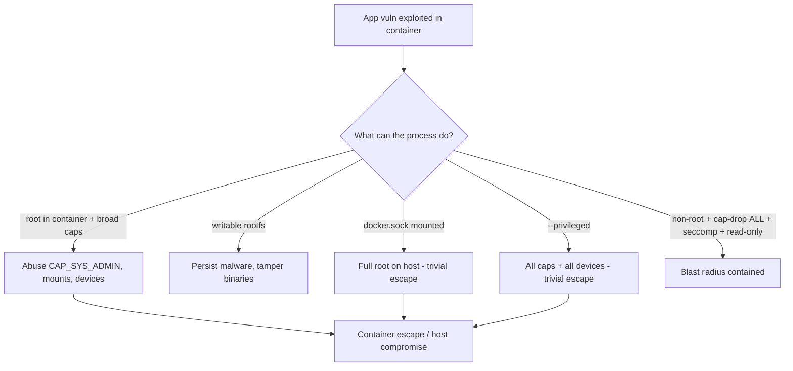
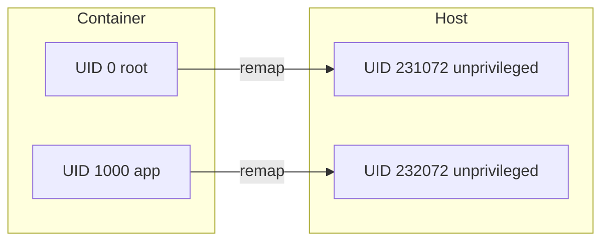
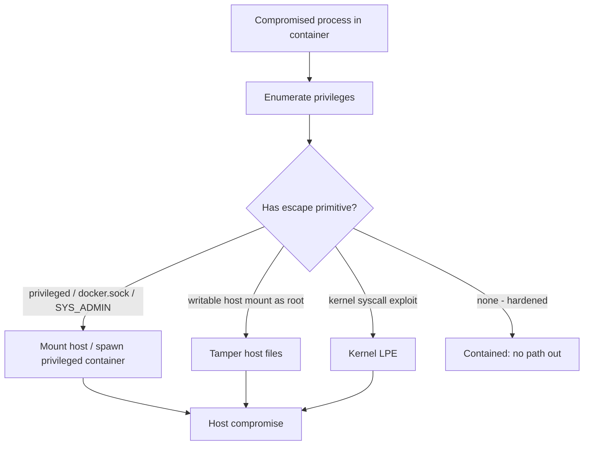

# Security Best Practices

Topic 11's debug ladder deliberately opened the isolation boundary: it joined a toolbox
container to a target's PID and network namespaces, read the target's files through
`/proc/1/root`, and in CI reached the daemon through a mounted `/var/run/docker.sock`. Those
exact primitives — a mounted `docker.sock`, `--privileged`, `CAP_SYS_ADMIN` — are an
attacker's escape vectors here. "Container escape threat model", below, prices each one and
shows where the only difference between debugging a container and breaking out of it is intent.

A Node process, compromised through one bad npm dependency, is running as UID 0 inside a
container on a host that also carries a database and a dozen other services. It shares one
Linux kernel with all of them, and there is no hypervisor in between. Right now that process
is a single kernel bug — or one careless `--privileged` — away from the host's disk and every
other container on the box. Container security is the work of making that last step hard:
shrinking what the process may do, so that a break-in stays a break-in and never becomes a
takeover of the host. Which levers actually shrink it, and which only look like they do?

> [!TIP]
> **Reading map.** About 22 minutes. If you already run containers as non-root with dropped
> capabilities, jump to [Container escape threat model](#container-escape-threat-model), where
> the separate controls compose into one boundary. The nine middle sections are one control
> each and read in any order; everything else is the reasoning that ties them together.

> [!KEY-TAKEAWAY]
> The whole topic reduces to two habits: **least privilege** — grant a container only what it
> demonstrably needs — and defense in depth, where you assume each control will fail and stack
> another behind it. In practice: run as non-root, `--cap-drop ALL` then add back only what you
> need, `--read-only` rootfs, leave seccomp and AppArmor/SELinux on, set
> `--security-opt no-new-privileges`, keep secrets out of the image, and never mount the Docker
> socket into an untrusted container or run `--privileged`.

---

## Container security threat model

A container is an ordinary Linux process, and its security is only ever as strong as the one
kernel it shares with every other container and the host. When you run
`docker run node:22-slim`, the kernel does not build a second computer around that process; it
shows the process a private view of the machine and then lets it call the very same kernel code
everything else calls.

Several kinds of **namespace** draw that private view — a namespace is the kernel showing one
process a private version of some global resource. The process gets its own process IDs (the
PID namespace), its own mount tree (mount), its own network interfaces (network), its own
hostname (UTS), its own inter-process channels (IPC), and its own range of user IDs (user).
Control groups, or cgroups, cap how much CPU and memory and how many process IDs it may burn.
Capabilities, seccomp and a Linux Security Module then fence what it may ask the kernel to do.
Docker's runtime and the OCI rules that standardise all of these primitives are the subject of
`runtimes-oci-standards`; this topic uses them and glosses each where it needs one, rather than
re-deriving them there.

The one wall a container does not have is a hypervisor. A virtual machine runs its own kernel on
emulated hardware, so a guest process reaching for the host must first break the kernel it is in
and then break the hypervisor beneath that. A container process skips the first wall: its
syscalls run against the host kernel directly, and a namespace changes only what the process
*sees*, never which kernel *executes* the call. One kernel bug reachable from inside a container
is therefore a bug reachable on the host, which is why the whole discipline narrows what a
compromised process can even attempt.

If that process is compromised, where can the damage go? It travels five ways, and they line up
by how far each one reaches:

- Container escape — the process breaks isolation and reaches the host kernel, host files, or
  other containers. The headline threat, and most of this file exists to make it hard.
- Lateral movement — the process stays put but attacks over the network: other containers,
  internal services, or a cloud metadata endpoint that hands out credentials.
- In-container privilege escalation — a non-root process becomes root inside the container, then
  reaches for a capability or a setuid binary to convert that into reach on the host.
- Supply-chain compromise — the image already carried the attacker before any flag could help: a
  hijacked base image, or a dependency published yesterday, shipped inside it.
- Secret exposure — credentials baked into a layer, an `ENV` value, or a log line, which unlock
  something else the moment they are read.



### Why the layers stack: each assumes the last failed

Drop every capability and a bug in a syscall you are still allowed to make can escape; add
seccomp and a logic error in an allowed syscall's arguments can still escape. No single control
is complete, because they all end at the same kernel. So hardening is never one flag. You run as
non-root *and* drop capabilities *and* filter syscalls *and* mount the rootfs read-only, so the
one control an attacker defeats is never the only thing between them and the host. Each layer is
written as if the layer before it has already failed — which is what "defense in depth" means
here, and why the sections that follow are additive rather than alternatives.

> [!INTERVIEW]
> Asked "how is a container different from a VM, security-wise?", the one-sentence answer is:
> a container shares the host kernel, so its isolation is only as strong as that kernel boundary
> — a kernel exploit escapes it, whereas a VM has a hypervisor boundary underneath. We layer
> capabilities, seccomp, LSMs and non-root on top precisely to cut the chance, and the blast
> radius, of ever reaching the shared kernel.

The cheapest of these layers, and the one that changes the most, is the identity the process
runs as — and by default that identity is root.

---

## Root in container is risky (run as non-root)

By default a container's process runs as UID 0, and on a shared kernel that UID 0 is the host's
root, not a sandboxed pretend-root. Unless the image or the run command says otherwise, `node
server.js` inside the container runs as user 0, group 0 — the same numbers the host calls root.
No remapping happens in between. So if that process escapes its namespaces, or if you bind-mount
a host directory into it, it reads and writes those host resources as full root.

Running as an unprivileged user is the single highest-leverage step, because it removes that
equivalence before anything else has to hold. You set it in the Dockerfile with the `USER`
instruction:

```dockerfile
FROM node:22-slim
# create a dedicated unprivileged user
RUN groupadd --gid 10001 app && useradd --uid 10001 --gid app --create-home app
WORKDIR /app
COPY --chown=app:app . .
RUN npm ci --omit=dev
USER app                 # everything after this, and the container process, runs as app
EXPOSE 3000
CMD ["node", "server.js"]
```

Four things decide whether that `USER` line actually holds at runtime:

- `USER` applies to every following `RUN` and to `CMD`/`ENTRYPOINT` and the running container, so
  place it *after* the steps that genuinely need root, such as installing packages, and *before*
  the runtime command.
- Prefer a numeric UID (`USER 10001`, or `docker run --user 10001:10001`) so Kubernetes
  `runAsNonRoot` and OCI runtime checks can confirm the user is non-root without reading
  `/etc/passwd` inside the image, which a name would force them to do first.
- A non-root process cannot bind a port below 1024, because the kernel gates those behind a
  privilege, so either listen on a high port such as 8080 and publish it, or grant the one
  capability that lifts the gate, `CAP_NET_BIND_SERVICE`.
- Anything the app must write has to be owned by its UID: use `COPY --chown=app:app`, own the
  writable directories at build time, or mount a writable volume or tmpfs for them.

### USER is a default, not a fence

`USER` records who the image *prefers* to run as; it does not stop anyone from choosing
otherwise. Whoever runs the image can put it straight back to root with `docker run --user 0`,
and the Dockerfile has no say. So `USER` is a good default and a weak guarantee: the guarantee
has to come from wherever the container is launched. On a plain host that guarantee is the run
command's own flags. Keep dropping capabilities, mounting read-only and setting no-new-privileges
even when you set the user, because those hold regardless of the UID the container ends up with.
In an orchestrator it is policy: Kubernetes can refuse any pod that would run as root with
`runAsNonRoot: true`, which the `kubernetes` domain covers.

> [!WARNING]
> Because `USER` is advisory, a non-root image is a starting posture, not a control you can lean
> on alone. The controls that *are* enforced at run time — dropped capabilities, a read-only
> rootfs, `no-new-privileges` — are what make non-root stick, and they are the rest of this file.

Running as non-root demotes the process, but the Docker daemon that launched it is still running
as root on the host — which is the gap rootless Docker closes.

---

## Rootless Docker

**Rootless Docker** moves the whole daemon off root — not just the container process — so even a
full daemon compromise lands in an ordinary user account. `USER` demotes the process *inside* the
container, but the daemon that starts and supervises every container has, by default, been
running as host root the entire time. Rootless mode runs that daemon and its containers as your
own unprivileged login, so the most privileged thing in the picture is no longer root at all.

```bash
# install/enable rootless mode for the current user
dockerd-rootless-setuptool.sh install
export DOCKER_HOST=unix:///run/user/$(id -u)/docker.sock
docker run hello-world     # daemon + container run as your unprivileged UID
```

It buys that with user namespaces (the next section) plus two helpers: `newuidmap`/`newgidmap`
hand the daemon its allotted UID range, and `slirp4netns` or `rootlesskit` give it networking
without root. The containment is genuine — a breakout reaches a normal user, not root — but you
pay for it in three places:

| Aspect | Rootful (default) | Rootless |
|---|---|---|
| Daemon UID | root (0) | your unprivileged UID |
| Escape blast radius | host root | your user account only |
| Bind ports < 1024 | yes | needs extra config (`net.ipv4.ip_unprivileged_port_start`) |
| Networking | native bridge | slirp4netns (slower) unless configured |
| Some storage drivers / features | all | limited (e.g. AppArmor, some overlayfs setups) |
| Cgroups resource limits | full | needs cgroup v2 + delegation |

The networking cost is the one people trip on. `slirp4netns` runs the container's TCP/IP stack as
a userspace process rather than in the kernel, so every packet crosses the user/kernel boundary an
extra time. Traffic still works, just slower than the kernel bridge until you configure a faster
path. Resource limits need cgroup v2 with delegation turned on, because an unprivileged user
cannot write the cgroup v1 hierarchy. Rootless is distinct from `--user` and from `userns-remap` below,
which harden a daemon that is still itself rootful.

Rootless leans on one kernel feature to pull this off — mapping container UIDs onto unprivileged
host UIDs — and that same feature can harden a normal rootful daemon on its own.

---

## User namespaces (userns-remap)

User namespaces break the "container root is host root" equivalence by mapping the container's
UID 0 onto an unprivileged host UID such as 231072. A process that is root *inside* the container
is, from the host's point of view, ordinary user 231072 with none of root's authority. If it
escapes, it escapes as that nobody. Remapping is the kernel feature underneath rootless mode, but
you can switch it on for an otherwise normal, rootful daemon:

```json
// /etc/docker/daemon.json
{ "userns-remap": "default" }
```

Docker then hands the daemon a contiguous **subordinate UID/GID range** — a block of host UIDs the
system has set aside for it to give out — read from `/etc/subuid` and `/etc/subgid` (for example
`dockremap:231072:65536`). It maps container UIDs 0..65535 onto host 231072..296607: container 0
becomes host 231072, container 1000 becomes host 232072, and so on across the block.



Turning remapping on changes three things you then have to plan for:

- A file the container writes into a bind mount lands owned by the *remapped* host UID (231072),
  not by 0 or 1000, so a host process or another user sharing that directory sees owners it did
  not create and may not be able to read.
- Some features are restricted or unavailable while remapping is on: `--privileged`, certain
  kinds of network and PID sharing, and a few storage drivers.
- The mapping is per-daemon, not per-container, so by default every container draws from the same
  range and two containers remap onto the same host UIDs — the remap alone does not isolate them
  from each other.

Remapping shrinks *who* the container is. The next lever shrinks *what* even root inside it may
do: Linux capabilities.

---

## Drop Linux capabilities

The kernel splits root's single all-or-nothing power into about forty separate **capabilities** —
each a named shard of root's authority that a process can hold on its own. `CAP_NET_BIND_SERVICE`
is the power to bind a port below 1024; `CAP_CHOWN` is the power to change a file's owner;
`CAP_NET_RAW` is the power to open raw sockets; `CAP_SYS_ADMIN` is a huge catch-all covering mounts
and much else. A process holds its shard even when its UID is not 0 — which is why a non-root
container is not automatically a weak one. The full list lives in `capabilities(7)`.

Docker does not give a container all forty. By default it grants a restricted allowlist of about
fourteen and drops the rest, so a container already cannot load kernel modules, mount arbitrary
filesystems, or reach raw block devices. But that default set is still broader than one hardened
app needs, and the reason is that it is a *compatibility* default sized for the average image, not
for your service. `CAP_CHOWN` and `CAP_SETUID` cover the file-ownership changes and user-switching
that package installs and init scripts do; `CAP_NET_RAW` is there so `ping` works; `CAP_MKNOD`
lets an image create device nodes. A single application that never chowns files it did not create,
never switches users, and never sends a raw packet uses none of them.

So the rule is: drop everything, then add back only what you can name a need for.

```bash
# drop all, add back only the ability to bind ports < 1024
docker run --cap-drop ALL --cap-add NET_BIND_SERVICE nginx
```

```yaml
# docker-compose.yml
services:
  api:
    image: myapi:1.2.3
    cap_drop: ["ALL"]
    cap_add: ["NET_BIND_SERVICE"]
```

### Which capabilities actually bite

Most web apps land at *zero* added capabilities. If the app listens on a high port and runs as
non-root, `--cap-drop ALL` on its own breaks nothing, because it was not using any of root's shards
to begin with. Two of the defaults are worth singling out when you do keep some. `CAP_NET_RAW` is
not just `ping`: it lets a process craft raw packets — what an attacker uses to spoof addresses and
poison ARP on the container network — so dropping it is a cheap, common win. `CAP_SYS_ADMIN` is
close to a master key: it re-enables mounting and a long tail of privileged operations. Adding it
back is very nearly `--privileged` for escape purposes, and should be treated with the same
suspicion.

Adding `CAP_SYS_ADMIN` already hands back most of what a container drops; `--privileged` hands back
everything at once.

---

## --privileged is dangerous

`docker run --privileged` switches off most of the container security boundary in one flag. It
grants all capabilities rather than the restricted default set. It also removes the seccomp syscall
filter and largely the AppArmor confinement, exposes every host device node under `/dev`, and
permits `mount` and the other syscalls a container is normally blocked from making.

Put together, those add up to a trivial escape, and the exact step is worth seeing rather than
taking "effectively root" on faith. Because `--privileged` exposes every host device under `/dev`
— including `/dev/sda`, the host's real disk — the container can mount that block device onto a
directory and read or rewrite the host's entire filesystem, root's files included. A second route
needs no mounted disk at all: the cgroup `release_agent` trick. Cgroup v1 keeps a file that names
a program the *host* kernel runs as root whenever a cgroup empties. A container with mount rights
can point that file at a script on a shared path and have the host run it. Either way the
container is effectively root on the host. `--privileged` exists for genuine edge cases such as
Docker-in-Docker or direct hardware access, but it should be read as "no isolation."

```bash
# AVOID. If you only need one device or capability, request that instead:
docker run --device=/dev/fuse --cap-add SYS_ADMIN myfs        # narrow
docker run --privileged myfs                                   # everything - dangerous
```

The right move when a container seems to "need" privilege is almost never `--privileged`: name the
one capability (`--cap-add`), device (`--device`), or sysctl it actually requires, and grant only
that. If you genuinely need Docker-in-Docker, prefer rootless DinD or a socket-less builder such as
BuildKit/`buildx` over handing the container the whole host.

Even a container with no extra privileges can still be tampered with from inside if its own
filesystem is writable — which is what a read-only root filesystem removes.

---

## Read-only root filesystem

A read-only root filesystem stops a compromised process from writing to its own image, so it
cannot drop a malware binary, overwrite the one it runs, or leave anything behind that survives a
restart. Most services never need to write to their image at runtime in the first place: they
read code and config, and write only logs or a cache. Making the rootfs read-only therefore costs
nothing, and it also catches accidental writes that would otherwise slip by.

```bash
docker run --read-only \
  --tmpfs /tmp \
  --tmpfs /run \
  -v applogs:/var/log/app \
  myapp
```

```yaml
services:
  api:
    image: myapi:1.2.3
    read_only: true
    tmpfs:
      - /tmp
      - /run
    volumes:
      - app-cache:/var/cache/app   # named volume for the one writable path
```

`--read-only` mounts the whole container rootfs read-only, and then you add writable paths back
one at a time, so every writable location is a deliberate exception you can see. `--tmpfs /tmp`
grants an in-memory filesystem that vanishes when the container stops — right for scratch paths
like `/tmp` and `/run` that must not persist — while a named volume or bind mount is right for the
handful of directories that must survive. Read-only pairs naturally with a non-root user and
dropped capabilities: it removes tampering, they remove privilege, and together they leave a
compromised process with very little to stand on. It also pairs well with minimal, single-artifact
images such as distroless or `scratch`, which have almost nothing writable worth protecting anyway.

Read-only closes the disk as an attack surface; seccomp narrows the most direct one of all — the
set of syscalls the process may make into the kernel.

---

## Seccomp profiles

**Seccomp** — secure computing mode — filters which syscalls a process may make, cutting the
kernel's attack surface at its narrowest point: the actual entry into kernel code. A syscall is
the request a process sends the kernel whenever it needs something it cannot do alone — opening a
file, say, or sending a packet. Every kernel exploit reachable from a container is reached through
one. Docker applies a default seccomp profile that works as an allowlist. Its `defaultAction` is
`SCMP_ACT_ERRNO`: any syscall not named is denied and the caller gets "operation not permitted",
while the syscalls an ordinary program needs are marked `SCMP_ACT_ALLOW`. That default blocks
around 44 of the 300-plus syscalls — the dangerous or obsolete ones like `mount`, `reboot`,
`kexec_load`, and `ptrace` in some configurations. The set is tuned to stop the risky calls while
letting almost every real application run unchanged.

```bash
# default profile is applied automatically. Use a custom one:
docker run --security-opt seccomp=/path/to/profile.json myapp

# DISABLE seccomp entirely (avoid unless debugging):
docker run --security-opt seccomp=unconfined myapp
```

You do not opt in to any of this: the default profile is attached to every container
automatically, which is why the main thing to know is how it comes *off*. Setting
`seccomp=unconfined` removes it, and so does `--privileged`, which runs the container with no
seccomp at all — one more reason that flag reads as "no isolation." Going the other way, you can
tighten past the default with a custom profile that allows only the syscalls your app actually
issues, discovered by tracing it with `strace` or seccomp audit mode. What seccomp cannot do is
reason about *what* a syscall touches: it sees `open`, not which file, and knows nothing about
users or networks — that judgement belongs to capabilities and to LSMs.

Seccomp judges the syscall but not its target. Deciding which files and sockets a process may
touch is the job of an LSM — AppArmor or SELinux.

---

## AppArmor & SELinux (MAC / LSMs)

AppArmor and SELinux are Linux Security Modules that enforce **mandatory access control**: a
central policy, not the file's owner, decides what a process may touch — which files, which
sockets, which capabilities. The contrast with ordinary Unix permissions is the whole point. There
the owner of a file sets who may read it; under mandatory access control the policy overrides the
owner, so a process cannot widen its own reach even if it owns the target. LSMs sit alongside
seccomp, which filters syscalls, and capabilities, which partition root's powers, and add the one
axis those two miss: the specific resource.

AppArmor is the default on Debian and Ubuntu and works from path-based profiles; Docker loads a
profile called `docker-default` for every container unless you override it.

```bash
docker run --security-opt apparmor=my-profile myapp
docker run --security-opt apparmor=unconfined myapp     # disable (avoid)
```

SELinux is the default on RHEL and Fedora, and works from labels rather than paths. It combines
type enforcement with MCS categories, so two containers with different categories cannot read each
other's files even when they run as the same user. You enable it in the daemon and label the
mounts. The `:z` and `:Z` bind-mount suffixes relabel a volume so the container may use it: `:z`
makes it shareable between containers, `:Z` makes it private to this one.

```bash
docker run --security-opt label=type:svirt_apache_t myapp
docker run -v /data:/data:Z myapp     # relabel volume privately for this container
```

The reason to keep both on is defense in depth. Even when a syscall clears seccomp and the process
holds a matching capability, the LSM policy can still refuse the specific path or socket, forcing
the attacker to defeat a third, independent gate. Writing custom policy is a specialty of its own.
The container-level rule is short: leave the default profile in place and tighten it, rather than
reaching for `unconfined`, which throws the gate away entirely.

MAC, seccomp and capabilities all assume the process began unprivileged. One kernel bit keeps it
that way by blocking the classic climb back up through a leftover setuid binary.

---

## no-new-privileges

The `no_new_privs` bit tells the kernel that a process and its children can never gain privileges
through `execve`, which neutralises setuid/setgid binaries and file capabilities in one flag. A setuid
binary is one the kernel runs with its file *owner's* privileges — often root — no matter who
launched it, which is how `sudo` and `ping` have traditionally worked. `execve` is the moment a
process replaces its own program with a new one, and it is exactly then that the kernel would
normally hand over those elevated privileges. Once `no_new_privs` is set, it does not: a non-root
attacker who finds a setuid-root `sudo` in the image can run it, but it stays non-root.

```bash
docker run --security-opt no-new-privileges myapp
```

```yaml
services:
  api:
    image: myapi:1.2.3
    security_opt:
      - no-new-privileges:true
```

`no-new-privileges` closes the classic path from non-root to root-*inside*-the-container, which
usually runs through a setuid binary left lying in the base image by a package the app never even
calls. The flag is cheap, almost always safe for an application container, and on every hardening
checklist including the CIS Docker Benchmark. Read it as the complement to running non-root:
non-root limits what the process starts as, and `no-new-privileges` stops it climbing back up.

These controls all constrain the running process. The next problem starts earlier, at build time,
when a secret gets baked into the image itself.

---

## Keep secrets out of images and layers

A secret baked into an image is not deleted by deleting it: the bytes stay in the layer that added
them, and every pull ships them. Anything sensitive — an API key, a database password, a TLS
private key, a token — has two well-worn ways of ending up in an image where anyone who can pull it
can read it. The first is layer history. The second is environment metadata. `ENV SECRET=...` is
stored in the image's own metadata, so it shows up in `docker inspect` and is handed to every
process and child in the container. An `ARG` passed at build time can likewise surface in
`docker history`.

```dockerfile
# ANTI-PATTERN - secret is permanently in a layer and in history
COPY id_rsa /root/.ssh/id_rsa
RUN git clone git@host:repo && rm /root/.ssh/id_rsa   # rm does NOT remove it from the layer
ENV DB_PASSWORD=hunter2                                # visible in docker inspect
```

The fix at build time is a BuildKit secret mount, which makes the file readable during a single
`RUN` and never writes it into any layer — the same machinery as a cache mount, but a distinct
feature aimed at exactly this problem:

```dockerfile
# syntax=docker/dockerfile:1
RUN --mount=type=secret,id=npmrc,target=/root/.npmrc npm ci
```
```bash
docker build --secret id=npmrc,src=$HOME/.npmrc .
```

At run time, inject the secret instead of embedding it: mount it as a file, or use the
orchestrator's secret store — `docker secret` in Swarm, Secrets in Kubernetes — and read it from a
path rather than from `ENV`.

```yaml
services:
  api:
    image: myapi
    secrets: [db_password]      # mounted at /run/secrets/db_password
secrets:
  db_password:
    file: ./db_password.txt
```

Then scan images for secrets that slipped through anyway, with Trivy, git-secrets, or gitleaks in
CI. Broader secrets hygiene — rotation, vaulting, KMS — belongs to the `security` domain; here the
concern is only keeping them out of the image in the first place.

### Why "delete it in the next layer" fails

An image is a stack of layers, and each layer is a frozen record of the filesystem changes one
build step made — established in images-vs-containers. Frozen is the operative word: a later step
that runs `rm secret` does not reach back and edit the earlier layer, it only records, in a *new*
top layer, that the file should now appear gone. The bytes of the secret still sit in the layer
that first added them. And because a `docker pull` or `docker save` transfers every layer, whoever
receives the image can unpack that earlier layer and read the file straight out of it. `docker
history --no-trunc` will even show them the command that put it there.

> [!WARNING]
> Treat anything ever written into a layer as public, permanently. Deleting it, overwriting it, or
> setting a short-lived `ENV` in a later step does not remove it from the layer it first landed in,
> and that layer travels with every copy of the image.

Secrets are one thing an image can leak. The daemon's own socket is a live door — mounting it into
a container hands over the whole host.

---

## The Docker socket = root

Access to the Docker daemon's Unix socket, `/var/run/docker.sock`, is access to root on the host,
because whoever can talk to the API on the other end can ask it to start a *new* container that
bind-mounts `/` and runs `--privileged`. The daemon runs that request as root, so with one API call
an attacker who reaches the socket owns the host filesystem — no kernel bug required. Mounting the
socket into a container therefore hands that container full control of the machine it runs on.

```yaml
# DANGEROUS - this container can now root the host
services:
  ci-runner:
    image: some/ci-image
    volumes:
      - /var/run/docker.sock:/var/run/docker.sock   # = giving root
```

So how do you keep that door shut when a container legitimately needs to do Docker-ish work? Never
mount the socket into anything untrusted or internet-exposed. When a container needs to *build*
images — the usual reason a CI job wants the socket — give it a socket-less builder such as
BuildKit/`buildx`, Kaniko, or rootless Docker-in-Docker instead, none of which need the host
daemon. When you genuinely must expose the API, put a filtering proxy in front that allows only the
specific endpoints you need, and never carry it over plain TCP without mTLS. And remember the quiet
form of the same grant: the socket is owned by the `docker` group, so adding a user to that group
is handing them root, and it should be treated as exactly that privileged.

The socket, `--privileged`, and broad capabilities are all escape vectors. The next section lays
them side by side and asks which flags actually hand an attacker a way out — and which leave a
hardened container with none.

---

## Container escape threat model

An escape is a process leaving its container to reach the host or its neighbours. The plainest one
needs no exploit at all: a container running as root with a host directory bind-mounted in simply
writes those host files as UID 0. Most escapes are like that — not a clever kernel trick but a
primitive the container was handed at launch. So the useful way to hold the whole topic is a
table of vectors against the control that removes each one:

| Escape vector | Why it works | Control |
|---|---|---|
| `--privileged` | all caps + all devices + no seccomp | never use it; grant narrow `--device`/`--cap-add` |
| Mounted `docker.sock` | API = spawn privileged container | never mount into untrusted containers |
| Broad capabilities (`CAP_SYS_ADMIN`) | mount host fs, cgroup tricks | `--cap-drop ALL`, add minimal set |
| Writable host bind mount as root | write host files as UID 0 | non-root + userns-remap + read-only mounts |
| Kernel vuln reached via syscall | shared kernel exploited | seccomp default profile, patch host kernel |
| Setuid binary in image | non-root climbs to root-in-container | `no-new-privileges`, distroless (no setuid) |
| Leaked secrets in image | creds reused elsewhere | BuildKit secrets, scan images |



Read down the middle column and a pattern falls out: because every container shares the one kernel,
the strategy is to remove primitives — capabilities, devices, syscalls, the socket — and to reduce
identity — non-root, userns-remap — until even a total compromise inside the container finds no
route out. The last row of the flowchart is the goal: a container holding none of these primitives
has no escape *to attempt*, which is why "a hardened container has no escape primitive" is a real
answer, not a slogan.

### When you need a real wall, not a taller fence

Those escape vectors are the very primitives topic 11's debug ladder reached for on purpose — a
mounted `docker.sock`, a shared namespace, a writable bind mount. Mechanically the debug session
and the breakout are the same act. The only thing separating them is intent and who authorised it,
which is why the boundary is defined by configuration, not by a wall. That has a hard limit: every
control here still ends at the shared kernel, so a kernel bug reached through an allowed syscall
walks straight past all of them. When a workload's isolation must survive that, you stop sharing
the kernel. gVisor (`runsc`) puts a second kernel, written in user space, between the container and
the host, and services its syscalls there. Kata Containers runs each container inside a lightweight
virtual machine, with its own kernel and a hypervisor underneath. Both add the boundary that
capabilities and seccomp cannot — at the cost of the syscall interception or the VM — and both are
covered in `runtimes-oci-standards`.

Every control here assumes the image holds what you think it holds. The next section is where that
assumption gets checked — by scanning what the image actually contains.

---

## Image scanning & supply chain (Docker angle)

Most container CVEs come from the base image and OS packages, not from your code — a CVE being a
publicly catalogued vulnerability with a tracking id. So the container-level hygiene is about the
image's *contents*, and the full supply-chain treatment is the very next topic. From the Docker
angle the moves are short. Scan the image's layers against vulnerability databases with Trivy,
Grype, or Docker Scout, which read the package metadata each layer records and match it against
known CVEs:

```bash
trivy image myapi:1.2.3
docker scout cves myapi:1.2.3
```

Then shrink and pin what you scan. A minimal or distroless base — `gcr.io/distroless/*` or
`scratch` — carries fewer packages, so fewer CVEs, and ships no shell or package manager for an
attacker who does get in to use. Pin by digest rather than a moving tag (`FROM debian:12@sha256:...`)
so the bytes you scanned are the bytes you run. Generate an SBOM, a software bill of materials
listing everything in the image (`docker sbom`, `syft`), so you can answer "what shipped" later.
And sign images with cosign/Sigstore so a deployer can verify their origin and provenance before
running them.

> [!INTERVIEW]
> Keep the boundary clear. This topic owns the image-and-container angle: scanning layers,
> distroless, signing an image, an image's SBOM, base-image CVEs. The broader framework — SLSA
> levels, provenance attestation, keyless signing, policy gates in the pipeline — belongs to
> `devops-cicd/software-supply-chain-security`, and topic 13 (`image-scanning-supply-chain`) is the
> full treatment this section is only pointing at.

Knowing each control on its own is one thing; the industry's checklist for whether you actually
applied all of them is the CIS Docker Benchmark.

---

## CIS Docker Benchmark & hardening checklist

The **CIS Docker Benchmark** is the industry's consensus hardening standard: host configuration,
daemon configuration, image, and runtime rules. Its runtime slice is exactly the flag set the rest
of this file has been assembling. The tool `docker-bench-security` checks a host
against many of its items automatically. You do not memorise the document; you internalise the
handful of high-value runtime controls, which compose into a single command line:

```bash
docker run \
  --user 10001:10001 \
  --read-only --tmpfs /tmp \
  --cap-drop ALL --cap-add NET_BIND_SERVICE \
  --security-opt no-new-privileges \
  --security-opt seccomp=/etc/docker/seccomp-tight.json \
  --pids-limit 200 --memory 512m --cpus 1.0 \
  --restart on-failure \
  myapi:1.2.3@sha256:...
```

One line in there is new to this file and worth its own reason: the resource limits. Set
`--memory`, `--cpus`, and `--pids-limit`. Without them a single compromised or runaway container
can exhaust the host's memory, CPU, or process table — a fork bomb is a handful of lines — and take
every neighbour on the box down with it. The limit turns a host-wide outage into one throttled
container, and it is enforced by the same cgroups that draw the container's boundary in the first
place. The rest of the checklist is the composite of the sections above:

- [ ] Run as non-root (`USER` / `--user`), numeric UID.
- [ ] `--cap-drop ALL`, add back only required caps.
- [ ] `--read-only` rootfs + `--tmpfs` for writable paths.
- [ ] `no-new-privileges` set.
- [ ] Keep seccomp and AppArmor/SELinux enabled (never `unconfined`).
- [ ] Never `--privileged`; grant `--device`/`--cap-add` narrowly instead.
- [ ] Never mount `docker.sock` into untrusted containers.
- [ ] No secrets in image/`ENV`/layers — use BuildKit secrets + runtime secret stores.
- [ ] Set resource limits (`--memory`, `--cpus`, `--pids-limit`) to bound DoS blast.
- [ ] Minimal base image (distroless/pinned digest), scan for CVEs, sign images.
- [ ] Prefer rootless Docker or userns-remap so the daemon/container isn't host root.

Run down that list before shipping and every line maps back to a section above: it is least
privilege and defense in depth turned into a command you can paste. Nothing on it is exotic, and
that is the point — a hardened container is an ordinary one with its unused powers taken away.

---

## Common follow-up questions

- "A container runs as root by default — is that root the same as host root?" Yes, the same UID 0,
  unless user namespaces remap it — which is why non-root plus userns matters, and why a writable
  host bind mount is dangerous.
- "Difference between `USER`, rootless Docker, and userns-remap?" `USER` makes the *process*
  non-root while the *daemon* stays root; rootless makes the *daemon itself* run as an unprivileged
  user; userns-remap keeps a rootful daemon but maps container UID 0 onto an unprivileged host UID.
- "Why is `--privileged` so bad?" It grants all capabilities and all host devices and drops
  seccomp/AppArmor — effectively no isolation, and a trivial host escape.
- "How do capabilities differ from seccomp?" Capabilities partition root's powers; seccomp filters
  syscalls. They act at different layers and are complementary, along with LSMs, which govern
  resource access.
- "How do you give build steps a secret without leaking it?" A BuildKit `--mount=type=secret`: the
  secret is readable during one `RUN` and never written to a layer. `ENV` and `COPY`+`rm` both leak.
- "Someone mounted `docker.sock` into a container — what's the risk?" That container has root on the
  host: it can call the API to spawn a privileged container that mounts `/`.
- "How would you harden this `docker run`?" Walk the CIS runtime controls: non-root, cap-drop,
  read-only, no-new-privileges, resource limits, a minimal base image, scanned and signed.
- "Container vs VM isolation?" Shared kernel versus a hypervisor boundary; for stronger isolation
  reach for gVisor or Kata.

## References

- Docker docs — Docker security: https://docs.docker.com/engine/security/
- Docker docs — Seccomp: https://docs.docker.com/engine/security/seccomp/
- Docker docs — AppArmor: https://docs.docker.com/engine/security/apparmor/
- Docker docs — Rootless mode: https://docs.docker.com/engine/security/rootless/
- Docker docs — User namespaces (userns-remap): https://docs.docker.com/engine/security/userns-remap/
- Docker docs — Runtime privilege & capabilities: https://docs.docker.com/reference/cli/docker/container/run/#privileged
- Docker docs — BuildKit build secrets: https://docs.docker.com/build/building/secrets/
- Docker docs — Protect the Docker daemon socket: https://docs.docker.com/engine/security/protect-access/
- Docker Scout: https://docs.docker.com/scout/
- Trivy: https://trivy.dev/  •  Grype: https://github.com/anchore/grype
- CIS Docker Benchmark: https://www.cisecurity.org/benchmark/docker
- `capabilities(7)`: https://man7.org/linux/man-pages/man7/capabilities.7.html
- `seccomp(2)`: https://man7.org/linux/man-pages/man2/seccomp.2.html
- gVisor: https://gvisor.dev/  •  Kata Containers: https://katacontainers.io/
- Related topics: `image-scanning-supply-chain` (the full supply-chain treatment),
  `runtimes-oci-standards` (namespaces, cgroups, capabilities, and the OCI runtime), and the
  security domain for general application security.
