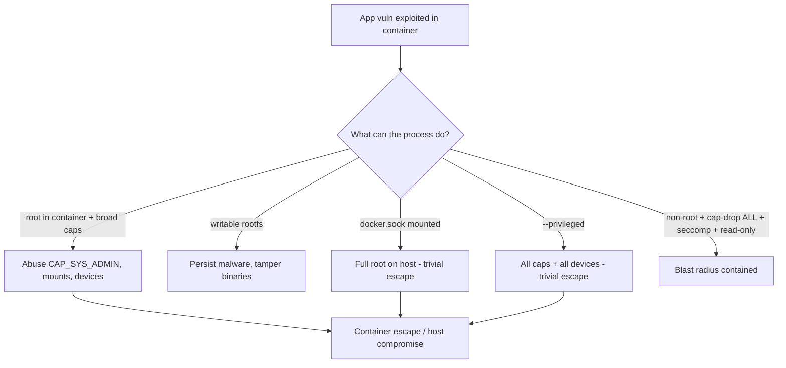
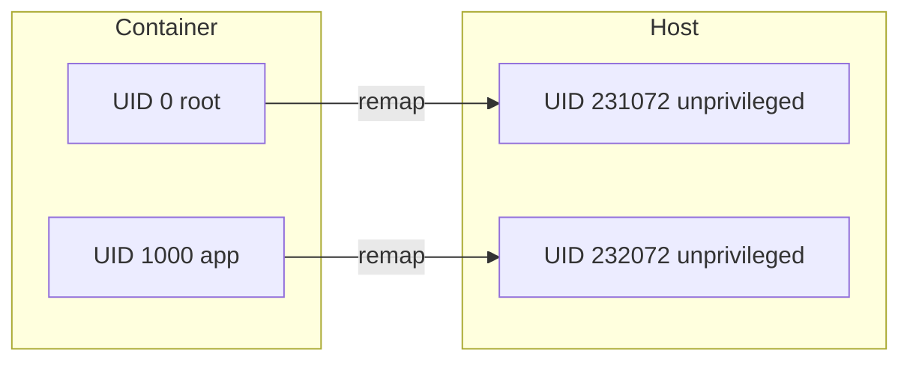
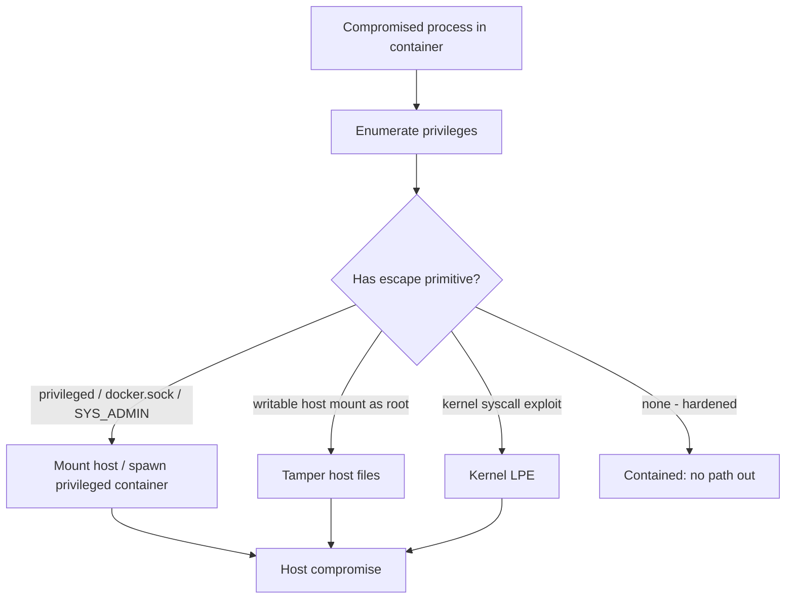

# Security Best Practices

Containers share the **host kernel**. That single fact drives the entire container-security
threat model: a container is not a VM, there is no hypervisor boundary, and a process that
breaks out of its isolation talks directly to the same kernel every other container and the
host use. "Docker security" is therefore mostly about **shrinking what a container can do**
if it (or the app inside it) is compromised — run as an unprivileged user, drop kernel
capabilities, filter syscalls, mount the root filesystem read-only, and never hand a
container the keys to the host.

This topic is **container security specifically**: the hardening levers Docker/OCI give you
and the traps that quietly grant root-on-host. General application security (authn/z,
injection, crypto, OWASP) lives in the **security** domain — this topic points there for
appsec basics and focuses on the container layer. Scanning image layers for CVEs is
introduced here from the Docker angle and cross-references
`image-scanning-supply-chain` and `devops-cicd/software-supply-chain-security` for the
broader SLSA/SBOM/Sigstore framework.

> [!KEY-TAKEAWAY]
> The container security mantra is **least privilege + defense in depth**: run as non-root,
> `--cap-drop ALL` then add back only what you need, `--read-only` rootfs, keep seccomp and
> AppArmor/SELinux enabled, set `--security-opt no-new-privileges`, keep secrets out of the
> image, and **never** mount the Docker socket into an untrusted container or run
> `--privileged`. Each layer assumes the previous one might fail.

---

## Container security threat model

A container is a normal Linux process (or process tree) that the kernel has placed into a
set of **namespaces** (PID, mount, network, UTS, IPC, user) for *isolation* and **cgroups**
for *resource limits*, with **capabilities**, **seccomp**, and an **LSM** (AppArmor/SELinux)
restricting what it may do. There is no hardware virtualization boundary — the kernel is
shared. (Namespaces/cgroups theory is owned by the **operating-systems** domain; here we use
them as the container isolation mechanism.)

The threats you defend against, in rough order of interview importance:

- **Container escape / breakout** — the app inside is compromised and the attacker tries to
  reach the host kernel, other containers, or host files. This is *the* headline threat.
- **Lateral movement** — a breached container is used to attack the network, other
  containers, or cloud metadata endpoints.
- **Privilege escalation inside the container** — becoming root-in-container, then abusing a
  capability or a setuid binary to affect the host.
- **Supply-chain compromise** — a malicious/vulnerable base image or dependency ships with
  the image (covered under image scanning + `devops-cicd`).
- **Secret exposure** — credentials baked into layers, `ENV`, or logs.



> [!INTERVIEW]
> When asked "how is a container different from a VM security-wise?" the one-sentence answer
> is: **a container shares the host kernel, so the isolation is only as strong as the kernel
> boundary — a kernel exploit escapes it, whereas a VM has a hypervisor boundary.** That is
> why we layer capabilities, seccomp, LSMs, and non-root on top: to reduce the chance and
> impact of reaching that shared kernel. See the **security** domain for general appsec.

---

## Root in container is risky (run as non-root)

By default, the process inside a container runs as **UID 0 (root)** unless the image or run
command says otherwise. Crucially, **container root maps to host root** (same UID 0) unless
you enable user namespaces. If such a container escapes — or you bind-mount a host directory
into it — that process acts as *host* root on those resources.

Running as non-root is the single highest-leverage hardening step. Set it in the Dockerfile
with the `USER` instruction:

```dockerfile
FROM node:20-slim
# create a dedicated unprivileged user
RUN groupadd --gid 10001 app && useradd --uid 10001 --gid app --create-home app
WORKDIR /app
COPY --chown=app:app . .
RUN npm ci --omit=dev
USER app                 # everything after this, and the container process, runs as app
EXPOSE 3000
CMD ["node", "server.js"]
```

Key mechanics and gotchas:

- `USER` affects subsequent `RUN`, `CMD`, `ENTRYPOINT`, and the running container. Put it
  **after** the steps that need root (installing packages), before the runtime command.
- You can also override at run time: `docker run --user 10001:10001 myimg` (numeric UID:GID).
  Prefer a **numeric** UID so Kubernetes `runAsNonRoot` and OCI checks can verify it without
  resolving `/etc/passwd`.
- A non-root process **cannot bind ports < 1024** by default. Either listen on a high port
  (e.g. 8080) and map it, or grant `CAP_NET_BIND_SERVICE`.
- Files the app writes need correct ownership — use `COPY --chown` and make writable dirs
  owned by the app UID, or use a writable volume/tmpfs.

> [!WARNING]
> `USER` in the Dockerfile is **advisory** — anyone running the image can override it with
> `docker run --user 0`. Defense in depth still applies at run time (drop caps, read-only,
> no-new-privileges). In orchestrators, enforce non-root with policy (e.g. K8s
> `runAsNonRoot: true`), covered in the **kubernetes** domain.

---

## Rootless Docker

`USER` makes the *process inside* the container non-root, but the **Docker daemon itself
still runs as root** on the host. **Rootless Docker** runs the entire daemon and containers
as an unprivileged host user, so even the daemon has no root. It leverages user namespaces
(via `newuidmap`/`newgidmap` and `slirp4netns`/`rootlesskit` for networking).

```bash
# install/enable rootless mode for the current user
dockerd-rootless-setuptool.sh install
export DOCKER_HOST=unix:///run/user/$(id -u)/docker.sock
docker run hello-world     # daemon + container run as your unprivileged UID
```

Trade-offs vs rootful:

| Aspect | Rootful (default) | Rootless |
|---|---|---|
| Daemon UID | root (0) | your unprivileged UID |
| Escape blast radius | host root | your user account only |
| Bind ports < 1024 | yes | needs extra config (`net.ipv4.ip_unprivileged_port_start`) |
| Networking | native bridge | slirp4netns (slower) unless configured |
| Some storage drivers / features | all | limited (e.g. AppArmor, some overlayfs setups) |
| Cgroups resource limits | full | needs cgroup v2 + delegation |

Rootless is a strong containment story (a breakout gets a normal user, not root) but has
performance and feature caveats. It is distinct from `--user` and from `userns-remap`
(next), which harden a rootful daemon.

---

## User namespaces (userns-remap)

**User namespaces** let container UID 0 map to an **unprivileged host UID**. So a process
that is "root inside the container" is, from the host's view, an ordinary user (e.g. host UID
231072). If it escapes, it has no host privileges. This is the kernel feature underneath
rootless mode, but it can also be enabled on a normal rootful daemon.

Enable daemon-wide remapping in `/etc/docker/daemon.json`:

```json
{ "userns-remap": "default" }
```

Docker then allocates a contiguous **subordinate UID/GID range** from
`/etc/subuid` and `/etc/subgid` (e.g. `dockremap:231072:65536`) and remaps container UIDs
0..65535 to host 231072..296607.



Gotchas:

- **Volume ownership shifts**: files created in bind mounts are owned by the *remapped* host
  UID, which can surprise you when sharing data with host processes.
- Not all features are compatible (e.g. `--privileged`, some network/PID sharing, and
  certain storage drivers may be restricted with remapping on).
- It is **per-daemon** by default (all containers share the mapping) unless configured
  otherwise; two containers still share the same host range.

---

## Drop Linux capabilities

The kernel splits root's powers into ~40 discrete **capabilities** (see
`capabilities(7)`), e.g. `CAP_NET_BIND_SERVICE` (bind low ports), `CAP_CHOWN`,
`CAP_SETUID`, `CAP_NET_RAW` (raw sockets), `CAP_SYS_ADMIN` (a huge, dangerous catch-all:
mount, etc.). A process with a capability has that slice of root power even if not UID 0.

By default Docker grants a **restricted allowlist** of ~14 capabilities (using an *allowlist*
approach) and drops the rest — so containers already cannot load kernel modules, do arbitrary
mounts, or access raw block devices. But that default set is still **broader than most apps
need** (it includes `CAP_CHOWN`, `CAP_SETUID`, `CAP_NET_RAW`, `CAP_MKNOD`, etc.).

Best practice: **drop everything, add back only what's required.**

```bash
# drop all, add back only the ability to bind ports < 1024
docker run --cap-drop ALL --cap-add NET_BIND_SERVICE nginx
```

```yaml
# docker-compose.yml
services:
  api:
    image: myapi:1.2.3
    cap_drop: ["ALL"]
    cap_add: ["NET_BIND_SERVICE"]
```

Notes:

- Most web apps need **zero** added capabilities if they listen on a high port and run as
  non-root — `--cap-drop ALL` alone is fine.
- `CAP_NET_RAW` (in the default set) enables ping and **packet spoofing / ARP tricks**;
  dropping it is a common hardening win.
- Adding `CAP_SYS_ADMIN` is nearly equivalent to `--privileged` for escape purposes — avoid.

---

## --privileged is dangerous

`docker run --privileged` disables *most* of the container security boundary at once:

- Grants **all capabilities** (not the restricted default set).
- Removes the **seccomp** and (largely) the **AppArmor** confinement.
- Gives access to **all host devices** under `/dev` (disks, etc.).
- Allows **mount** operations and other normally-blocked syscalls.

The practical result: a `--privileged` container is trivially able to escape to the host —
e.g. mount the host's root disk, or write to `/sys` / cgroup-release-agent tricks — so it is
**effectively root on the host**. It exists for edge cases like Docker-in-Docker or hardware
access, but should be treated as "no isolation."

```bash
# AVOID. If you only need one device or capability, request that instead:
docker run --device=/dev/fuse --cap-add SYS_ADMIN myfs        # narrow
docker run --privileged myfs                                   # everything - dangerous
```

> [!WARNING]
> Reaching for `--privileged` to "make it work" is almost always the wrong fix. The right
> move is to identify the **specific** capability (`--cap-add`), device (`--device`), or
> sysctl the app needs and grant only that. If you truly need Docker-in-Docker, prefer
> rootless DinD or a socket-less builder (BuildKit/buildx) instead.

---

## Read-only root filesystem

Most apps don't need to write to their own image filesystem at runtime. Making the container
root filesystem **read-only** stops an attacker from dropping malware, tampering with
binaries, or persisting a foothold, and it catches accidental writes.

```bash
docker run --read-only \
  --tmpfs /tmp \
  --tmpfs /run \
  -v applogs:/var/log/app \
  myapp
```

```yaml
services:
  api:
    image: myapi:1.2.3
    read_only: true
    tmpfs:
      - /tmp
      - /run
    volumes:
      - app-cache:/var/cache/app   # named volume for the one writable path
```

Mechanics:

- `--read-only` mounts the container's rootfs read-only. **Writable exceptions** are added
  back explicitly: `--tmpfs` (in-memory, ephemeral — good for `/tmp`, `/run`) or a
  volume/bind mount for paths that must persist.
- Combine with **non-root** and **cap-drop**: read-only prevents tampering, and if writes
  are needed only in known dirs, tmpfs/volumes make the surface explicit.
- A read-only rootfs pairs well with immutable, single-artifact images (distroless/scratch).

---

## Seccomp profiles

**Seccomp** (secure computing mode) filters which **syscalls** a process may make — the
narrowest, most direct kernel-attack-surface reduction. Docker ships a **default seccomp
profile** that is an *allowlist*: `defaultAction` is `SCMP_ACT_ERRNO` (deny with "operation
not permitted"), and specific syscalls are allowed via `SCMP_ACT_ALLOW`. It blocks around
**44 of 300+** syscalls (dangerous/obsolete ones like `mount`, `reboot`, `kexec_load`,
`ptrace` in some configs), balancing security with broad app compatibility.

```bash
# default profile is applied automatically. Use a custom one:
docker run --security-opt seccomp=/path/to/profile.json myapp

# DISABLE seccomp entirely (avoid unless debugging):
docker run --security-opt seccomp=unconfined myapp
```

Key facts:

- The default profile is applied to **every** container automatically — you don't have to
  opt in.
- `--privileged` runs the container **unconfined** (no seccomp) — another reason to avoid it.
- You can tighten further with a custom profile that whitelists only the syscalls your app
  actually issues (build one by tracing with `strace`/`seccomp` audit mode).
- Seccomp only filters syscalls; it does not know about files, users, or networks — that's
  what LSMs and capabilities add.

---

## AppArmor & SELinux (MAC / LSMs)

**AppArmor** and **SELinux** are Linux Security Modules implementing **Mandatory Access
Control**: policy — not the file owner — decides what a process may touch (files, network,
capabilities). They complement seccomp (syscalls) and capabilities (root powers) by
restricting *resources*.

- **AppArmor** (Debian/Ubuntu default): path-based profiles. Docker loads a default profile
  `docker-default` for containers unless overridden.
  ```bash
  docker run --security-opt apparmor=my-profile myapp
  docker run --security-opt apparmor=unconfined myapp     # disable (avoid)
  ```
- **SELinux** (RHEL/Fedora default): label-based (type enforcement + MCS categories). Enable
  in the daemon and label mounts; the `:z`/`:Z` bind-mount suffixes relabel volumes:
  ```bash
  docker run --security-opt label=type:svirt_apache_t myapp
  docker run -v /data:/data:Z myapp     # relabel volume privately for this container
  ```

These are **defense in depth**: even if a syscall passes seccomp and the process has a
capability, the LSM policy can still deny access to a specific path or socket. Deep MAC
theory is beyond this topic — the point for containers is *don't disable them* and prefer
tightening over `unconfined`.

---

## no-new-privileges

The `no_new_privs` bit is a per-process kernel flag: once set, a process (and its children)
**can never gain more privileges via `execve`** — most importantly, **setuid/setgid binaries
and file capabilities are neutralized**. So even if an attacker who is a non-root container
user finds a setuid-root binary (like `sudo` or `ping`), running it will **not** escalate.

```bash
docker run --security-opt no-new-privileges myapp
```

```yaml
services:
  api:
    image: myapi:1.2.3
    security_opt:
      - no-new-privileges:true
```

Why it matters:

- It closes the classic **non-root → root-in-container** escalation path through leftover
  setuid binaries in the base image.
- It's cheap and almost always safe to enable for application containers; it's part of every
  hardening checklist (and the CIS Docker Benchmark).
- Complements running as non-root: non-root limits what you start as, `no-new-privileges`
  stops you climbing back up.

---

## Keep secrets out of images and layers

Secrets (API keys, DB passwords, TLS private keys, tokens) must **never** be baked into an
image. Two traps:

1. **Layer history persists.** Anything `COPY`ed or created and later "deleted" in a *later*
   layer still exists in the earlier layer — `docker history` and `docker save`/registry
   pulls expose it. A file removed with `RUN rm secret` in a new layer is still recoverable
   from the layer that added it.
2. **`ENV`/`ARG` leak.** `ENV SECRET=...` is stored in image metadata and visible via
   `docker inspect` and to every process (and child) in the container. `ARG` values passed
   at build time can end up in `docker history`.

```dockerfile
# ANTI-PATTERN - secret is permanently in a layer and in history
COPY id_rsa /root/.ssh/id_rsa
RUN git clone git@host:repo && rm /root/.ssh/id_rsa   # rm does NOT remove it from the layer
ENV DB_PASSWORD=hunter2                                # visible in docker inspect
```

Do it right:

- **Build-time secrets:** BuildKit secret mounts — the file is available during one `RUN` and
  **never written to any layer**:
  ```dockerfile
  # syntax=docker/dockerfile:1
  RUN --mount=type=secret,id=npmrc,target=/root/.npmrc npm ci
  ```
  ```bash
  docker build --secret id=npmrc,src=$HOME/.npmrc .
  ```
- **Run-time secrets:** inject via a mounted file or the orchestrator's secret store
  (`docker secret` in Swarm, K8s Secrets), **not** `ENV`. Read them from a file path.
  ```yaml
  services:
    api:
      image: myapi
      secrets: [db_password]      # mounted at /run/secrets/db_password
  secrets:
    db_password:
      file: ./db_password.txt
  ```
- Scan images for leaked secrets (Trivy, git-secrets, gitleaks) in CI.

> [!WARNING]
> `docker history --no-trunc <image>` and unpacking layers reveals build steps and files.
> Assume anything ever placed in a layer is public. General secrets-management practice
> (rotation, vaulting, KMS) lives in the **security** domain.

---

## The Docker socket = root

The Docker daemon listens on the **Unix socket `/var/run/docker.sock`**. Access to that
socket is **equivalent to root on the host**: through the Docker API you can start a new
container that bind-mounts `/` and runs `--privileged`, i.e. take over the host. So mounting
the socket into a container hands that container full host control.

```yaml
# DANGEROUS - this container can now root the host
services:
  ci-runner:
    image: some/ci-image
    volumes:
      - /var/run/docker.sock:/var/run/docker.sock   # = giving root
```

Guidance:

- **Never** mount `docker.sock` into an untrusted or internet-exposed container.
- If a container needs to build images, prefer a **socket-less builder** (BuildKit/`buildx`,
  Kaniko, or rootless DinD) rather than the host socket.
- If you must expose Docker API access, put a filtering proxy (e.g. a socket-proxy that
  allows only specific read endpoints) in front, and never over plain TCP without mTLS.
- The daemon socket is owned by the `docker` group — **membership in `docker` = root**;
  treat it as a privileged grant.

---

## Container escape threat model

"Escape" means a process leaves its container isolation and affects the host or other
containers. The common escape vectors — and the control that stops each — are the practical
core of this topic:

| Escape vector | Why it works | Control |
|---|---|---|
| `--privileged` | all caps + all devices + no seccomp | never use it; grant narrow `--device`/`--cap-add` |
| Mounted `docker.sock` | API = spawn privileged container | never mount into untrusted containers |
| Broad capabilities (`CAP_SYS_ADMIN`) | mount host fs, cgroup tricks | `--cap-drop ALL`, add minimal set |
| Writable host bind mount as root | write host files as UID 0 | non-root + userns-remap + read-only mounts |
| Kernel vuln reached via syscall | shared kernel exploited | seccomp default profile, patch host kernel |
| Setuid binary in image | non-root climbs to root-in-container | `no-new-privileges`, distroless (no setuid) |
| Leaked secrets in image | creds reused elsewhere | BuildKit secrets, scan images |



Because isolation shares one kernel, the strategy is to **remove primitives** (caps, devices,
syscalls, socket) and **reduce identity** (non-root, userns) so that even a full in-container
compromise has no route to the host. For workloads needing stronger isolation, sandboxed
runtimes like **gVisor** (`runsc`) or **Kata Containers** (micro-VM per container) add a real
boundary — see `runtimes-oci-standards`.

---

## Image scanning & supply chain (Docker angle)

Most container CVEs come from the **base image and OS packages**, not your code. The
Docker-specific hygiene:

- **Scan image layers** for known CVEs with **Trivy**, **Grype**, or **Docker Scout**:
  ```bash
  trivy image myapi:1.2.3
  docker scout cves myapi:1.2.3
  ```
  These read the image's package metadata (per layer) and match against vuln databases.
- **Use minimal / distroless / pinned base images.** Fewer packages = fewer CVEs and no
  shell for an attacker. `gcr.io/distroless/*` and `scratch` remove shells and package
  managers entirely.
- **Pin by digest**, not a floating tag, for reproducibility:
  `FROM debian:12@sha256:...`.
- **Generate an SBOM** of the image (`docker sbom`, `syft`) so you know what shipped.
- **Sign and verify images** with **cosign/Sigstore**; verify signatures + provenance before
  deploy.

> [!INTERVIEW]
> Keep the boundary clear: **this topic** owns the *image/container* angle (scanning layers,
> distroless, image signing, SBOM of an image, base-image CVEs). The broader supply-chain
> framework — SLSA levels, provenance attestation, keyless signing, policy gates in the
> pipeline — is owned by `devops-cicd/software-supply-chain-security`; point there for the
> general model.

---

## CIS Docker Benchmark & hardening checklist

The **CIS Docker Benchmark** is the industry hardening standard (host config, daemon config,
image, and runtime rules). `docker-bench-security` automates checking many of them. You don't
memorize it, but you should be able to recite the high-value runtime controls it recommends:

```bash
docker run \
  --user 10001:10001 \
  --read-only --tmpfs /tmp \
  --cap-drop ALL --cap-add NET_BIND_SERVICE \
  --security-opt no-new-privileges \
  --security-opt seccomp=/etc/docker/seccomp-tight.json \
  --pids-limit 200 --memory 512m --cpus 1.0 \
  --restart on-failure \
  myapi:1.2.3@sha256:...
```

Interview-ready hardening checklist:

- [ ] Run as **non-root** (`USER` / `--user`), numeric UID.
- [ ] **`--cap-drop ALL`**, add back only required caps.
- [ ] **`--read-only`** rootfs + `--tmpfs` for writable paths.
- [ ] **`no-new-privileges`** set.
- [ ] Keep **seccomp** and **AppArmor/SELinux** enabled (never `unconfined`).
- [ ] **Never** `--privileged`; grant `--device`/`--cap-add` narrowly instead.
- [ ] **Never** mount `docker.sock` into untrusted containers.
- [ ] **No secrets** in image/`ENV`/layers — use BuildKit secrets + runtime secret stores.
- [ ] Set **resource limits** (`--memory`, `--cpus`, `--pids-limit`) to bound DoS blast.
- [ ] **Minimal base image** (distroless/pinned digest), **scan** for CVEs, **sign** images.
- [ ] Prefer **rootless Docker** or **userns-remap** so the daemon/container isn't host root.

---

## Common follow-up questions

- **"A container runs as root by default — is that root the same as host root?"** Yes, same
  UID 0, unless user namespaces remap it. That's why non-root + userns matters and why a
  writable host bind mount is dangerous.
- **"Difference between `USER`, rootless Docker, and userns-remap?"** `USER` = the *process*
  is non-root but the *daemon* is still root; rootless = the *daemon itself* runs as an
  unprivileged user; userns-remap = a rootful daemon maps container UID 0 to an unprivileged
  host UID.
- **"Why is `--privileged` so bad?"** It grants all capabilities, all host devices, and drops
  seccomp/AppArmor — effectively no isolation, trivial host escape.
- **"How do capabilities differ from seccomp?"** Capabilities partition root's *powers*;
  seccomp filters *syscalls*. They operate at different layers and are complementary, along
  with LSMs (resource access).
- **"How do you give build steps a secret without leaking it?"** BuildKit
  `--mount=type=secret`; the secret is available during one `RUN` and never written to a
  layer. `ENV`/`COPY`+`rm` both leak.
- **"Someone mounted `docker.sock` into a container — what's the risk?"** That container has
  root on the host: it can spawn a privileged container that mounts `/`.
- **"How would you harden this `docker run`?"** Walk the CIS checklist: non-root, cap-drop,
  read-only, no-new-privileges, resource limits, minimal base, scanned/signed image.
- **"Container vs VM isolation?"** Shared kernel vs hypervisor boundary; for stronger
  isolation use gVisor/Kata.

---

## References

- Docker docs — Docker security: https://docs.docker.com/engine/security/
- Docker docs — Seccomp: https://docs.docker.com/engine/security/seccomp/
- Docker docs — AppArmor: https://docs.docker.com/engine/security/apparmor/
- Docker docs — Rootless mode: https://docs.docker.com/engine/security/rootless/
- Docker docs — User namespaces (userns-remap): https://docs.docker.com/engine/security/userns-remap/
- Docker docs — Runtime privilege & capabilities: https://docs.docker.com/reference/cli/docker/container/run/#privileged
- Docker docs — BuildKit build secrets: https://docs.docker.com/build/building/secrets/
- Docker docs — Protect the Docker daemon socket: https://docs.docker.com/engine/security/protect-access/
- Docker Scout: https://docs.docker.com/scout/
- Trivy: https://trivy.dev/  •  Grype: https://github.com/anchore/grype
- CIS Docker Benchmark: https://www.cisecurity.org/benchmark/docker
- `capabilities(7)`: https://man7.org/linux/man-pages/man7/capabilities.7.html
- `seccomp(2)`: https://man7.org/linux/man-pages/man2/seccomp.2.html
- gVisor: https://gvisor.dev/  •  Kata Containers: https://katacontainers.io/
- Cross-references: `image-scanning-supply-chain`, `devops-cicd/software-supply-chain-security`,
  the **security** domain (general appsec), the **operating-systems** domain (namespaces/cgroups theory).
