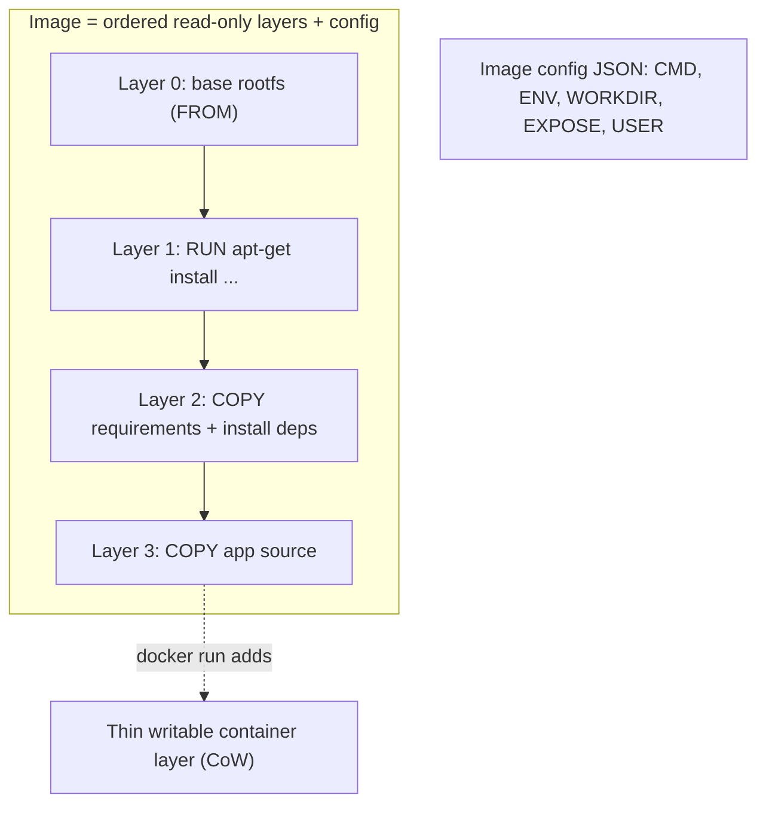
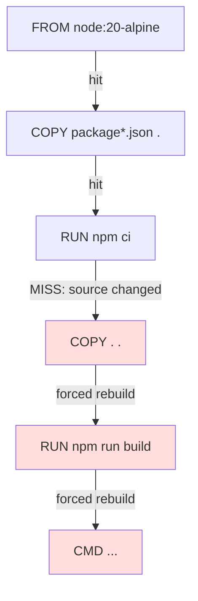
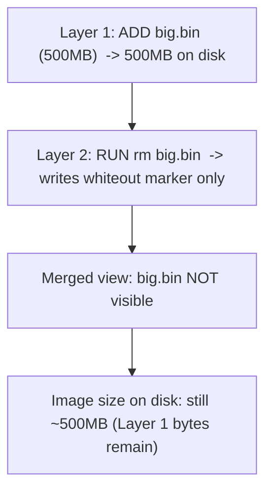

# Dockerfile, Layers & Build Cache

A **Dockerfile** is a plain-text script of instructions that tells the builder how to
assemble a container **image**. Building it produces a stack of read-only **layers** —
each layer is a filesystem changeset (a diff of files added/changed/deleted) plus some
metadata. The magic that makes Docker builds fast and images small is the **build
cache**: the builder reuses a previously built layer whenever it can prove the
instruction (and its inputs) are unchanged. Understanding *which instructions create
layers*, *how the cache is keyed and invalidated*, and *how layer stacking affects image
size* is the single most interview-relevant chunk of Docker knowledge — it explains why
one Dockerfile rebuilds in 2 seconds and another in 8 minutes, and why one image is
80 MB and a functionally identical one is 1.2 GB.

This note owns Dockerfile *mechanics* and the *layer/cache* model. Sibling topics go
deeper: `entrypoint-vs-cmd` covers startup instructions in detail;
`multi-stage-builds-image-optimization` covers `FROM ... AS` stages and slimming;
`buildkit-advanced-builds` covers BuildKit frontends, cache mounts, and cache export;
`image-internals-storage-drivers` covers overlay2/copy-on-write at the storage-driver
level. Here we teach the everyday model an engineer must have in their head while
writing Dockerfiles.

> [!KEY-TAKEAWAY]
> Three facts win most interviews on this topic: (1) **only `RUN`, `COPY`, and `ADD`
> create filesystem layers** — `ENV`, `WORKDIR`, `CMD`, `LABEL`, `EXPOSE`, etc. only add
> metadata (a zero-size or config-only layer). (2) **A cache miss on one instruction
> busts the cache for that instruction AND every instruction after it** — so order
> matters: put rarely-changing steps (install dependencies) *before* frequently-changing
> steps (copy source). (3) **Layers are additive; deleting a file in a later layer does
> not shrink an earlier layer** — the bytes still ship inside the image.

---

## What a Dockerfile is and the image-layer model

**Definition.** A Dockerfile is a recipe: a sequence of instructions, one per logical
step, evaluated top-to-bottom by a builder (`docker build`, powered by **BuildKit** in
modern Docker). Each instruction that changes the filesystem produces a new **layer**
stacked on top of the previous ones. The final image is the ordered set of those layers
plus a JSON **image config** (the default command, env, working dir, exposed ports,
etc.).

**Why layers exist.** Layers give three things at once:

- **Cache & fast rebuilds** — unchanged layers are reused, so only what changed rebuilds.
- **Sharing & dedup** — layers are content-addressed (identified by a SHA-256 digest of
  their contents). Two images built `FROM ubuntu:22.04` *share* the base layers on disk
  and only pull/push the layers they don't already have.
- **Immutability** — each layer is read-only. At `docker run`, a thin writable layer is
  added on top (copy-on-write), so the image itself is never mutated.



**Interview framing.** An image is *not* a tarball you edit in place; it's an ordered
list of immutable diffs. "Building" means "evaluate instructions, produce/reuse layers,
write a config." A **container** is a running (or stopped) instance = image layers +
writable layer + namespaces/cgroups. Keep that separation crisp.

> [!INTERVIEW]
> If asked "what is a layer?": a layer is a **filesystem changeset** (a set of file
> additions, modifications, and whiteout markers for deletions), stored once and
> identified by the SHA-256 digest of its contents. Images are built by stacking layers;
> the union filesystem (overlay2) presents them as one merged tree.

---

## Which instructions create layers vs metadata

Only three instructions produce a **filesystem layer**:

| Instruction | Creates a layer? | What it does |
|---|---|---|
| `RUN` | **Yes** | Executes a command in a new layer; captures resulting fs changes |
| `COPY` | **Yes** | Copies files from build context (or another stage) into the image |
| `ADD` | **Yes** | Like COPY plus tar-extraction / remote-URL fetch |
| `FROM` | (brings in base layers) | Sets the base image; its layers become the foundation |
| `ENV` | No (metadata) | Sets an environment variable in the image config |
| `WORKDIR` | No (metadata)* | Sets the working directory (created if missing) |
| `CMD` | No (metadata) | Default command/args, run at container start (not build) |
| `ENTRYPOINT` | No (metadata) | Fixed executable, run at container start |
| `EXPOSE` | No (metadata) | Documents a port; does not publish it |
| `LABEL` | No (metadata) | Key/value annotations |
| `USER` | No (metadata) | Default UID/GID for subsequent RUN and at runtime |
| `ARG` | No (metadata) | Build-time variable; not persisted in the image |
| `VOLUME` | No (metadata) | Declares a mount point |
| `HEALTHCHECK` | No (metadata) | Sets the container health probe |
| `STOPSIGNAL` | No (metadata) | Signal used to stop the container |

\* In older/classic builder output, metadata instructions still showed as separate
"layers" of size 0 B in `docker history`. Under BuildKit the final image only contains
layers for instructions that actually change the filesystem; metadata is folded into the
image config. Either way, `ENV`/`WORKDIR`/`CMD` **do not add meaningful bytes**.

**Common gotcha.** People say "reduce layers by combining `ENV` lines." That's mostly a
myth on modern builds — `ENV` doesn't cost a filesystem layer. The layers that *cost
size and cache* are `RUN`, `COPY`, and `ADD`. Optimize those.

> [!WARNING]
> `CMD` and `ENTRYPOINT` run at **container start time, not build time**. A `RUN`
> executes during the build and its output is baked into a layer. Confusing the two
> ("why didn't my `CMD` install the packages?") is a classic beginner error.

---

## The build context and .dockerignore

**What the build context is.** When you run `docker build .`, the `.` is the **build
context** — the set of files the client sends to the builder. `COPY`/`ADD` can only
reference paths *inside* this context; you cannot `COPY ../secret.txt` from outside it.

**Why it matters.** The entire context is transferred to the daemon/BuildKit before the
build runs. If your context includes `node_modules/`, `.git/`, build artifacts, or a
10 GB dataset, every build starts by shipping all of it — slow, and it can bust cache.
You'll see it in the first build line:

```
=> [internal] load build context
=> => transferring context: 1.83GB     # <- red flag
```

**`.dockerignore`.** A `.dockerignore` file (glob patterns, gitignore-style) excludes
paths from the context so they're never sent and never accidentally `COPY`'d in:

```dockerignore
.git
node_modules
**/*.log
dist
.env
*.md
```

Excluding files also **stabilizes the cache**: if a `COPY . .` pulls in a log file that
changes every run, the layer's checksum changes every build. Ignoring it keeps the layer
cacheable.

> [!TIP]
> Two frequent wins: (1) put a good `.dockerignore` in place *before* using `COPY . .`,
> and (2) never `COPY . .` early — copy only the dependency manifest first (see ordering
> below). A missing `.dockerignore` is the most common cause of "why is my build context
> 2 GB and my cache never hits?"

---

## How the build cache works and cache-invalidation rules

**The core rule.** For each instruction, the builder looks for an existing cached layer
that was produced by the *same parent layer* + the *same instruction* + the *same
inputs*. If it finds one, it reuses it (a **cache hit**). If not, it's a **cache miss**:
it builds a new layer — **and because every later instruction depends on this one's
result, the cache is invalidated for that instruction and ALL subsequent instructions**,
which all rebuild.



**How each instruction's cache key is computed:**

- **`RUN`** — the cache is keyed on the **command string only**. The builder does *not*
  inspect what files the command produced. So `RUN apt-get update && apt-get install
  curl` will keep hitting the same cached layer on later builds even if a newer `curl`
  exists upstream — "the files updated in the container aren't examined to determine if a
  cache hit exists." This is why `RUN apt-get update` alone can serve stale package
  indexes; combine it with the install in one `RUN`.
- **`COPY` / `ADD`** — the builder computes a **checksum of the file contents/metadata**
  of the sources being copied. If any copied file's contents change, the checksum
  changes → cache miss. (Notably, changing *only* the mtime does not bust the cache;
  content is what matters.)
- **Metadata instructions** (`ENV`, `WORKDIR`, etc.) — keyed on the instruction text.
- **`ARG`** — changing a build-arg value that an instruction uses invalidates from that
  point (basis of the `ARG CACHEBUST` trick).

**Forcing / controlling cache:**

```bash
docker build --no-cache .                       # ignore all cache
docker build --no-cache-filter=deps .           # skip cache only for stage "deps" (BuildKit)
docker build --build-arg CACHEBUST=$(date +%s) . # bust from the ARG line onward
docker builder prune                            # reclaim cache storage
```

> [!WARNING]
> The classic stale-cache bug: `RUN apt-get update` on its own line, then a separate
> `RUN apt-get install -y foo`. On a rebuild, the `update` line is a cache hit (same
> string), so you install against a **cached, possibly months-old package index**.
> Always put update+install in **one `RUN`**: `RUN apt-get update && apt-get install -y foo`.

---

## Ordering instructions least-to-most-frequently-changed

**The principle.** Because a cache miss cascades to all later layers, put instructions
that change **rarely** early and instructions that change **often** late. In practice:
base image → OS packages → dependency manifests + dependency install → application
source → build. Your source code changes on nearly every commit; your dependency list
changes rarely — so install deps *before* copying source.

**Anti-pattern (bad ordering):**

```dockerfile
FROM node:20-alpine
WORKDIR /app
COPY . .              # <- source copied first; ANY code change busts this layer...
RUN npm ci            # <- ...so npm ci re-runs on every single build (slow!)
CMD ["node", "server.js"]
```

**Good ordering:**

```dockerfile
FROM node:20-alpine
WORKDIR /app
COPY package.json package-lock.json ./   # changes rarely
RUN npm ci                               # cached until deps change
COPY . .                                 # changes often, but it's the LAST fs layer
CMD ["node", "server.js"]
```

Now a normal code change only invalidates the final `COPY . .` — `npm ci` stays cached
and rebuilds drop from minutes to seconds. The same pattern applies everywhere:
`requirements.txt`/`pip install`, `go.mod`/`go mod download`, `pom.xml`/`mvn
dependency:go-offline`, `Gemfile`/`bundle install`.

> [!INTERVIEW]
> "You have a Node app whose Docker build re-runs `npm install` on every code change —
> how do you fix it?" Answer: split the `COPY` so the lockfile is copied and dependencies
> installed *before* copying the rest of the source, exploiting layer caching. This is
> one of the most commonly asked Docker optimization questions.

---

## COPY vs ADD

Both add files from the build context into the image and both create a layer, but they
differ in "magic" behavior. **The guidance (Docker + best practices): prefer `COPY`**;
use `ADD` only when you specifically want its extra features.

| Capability | `COPY` | `ADD` |
|---|---|---|
| Copy files/dirs from build context | Yes | Yes |
| Copy from another build stage (`--from`) | Yes | Yes |
| Auto-extract a **local** tar archive into dest | No | **Yes** (decompressed & unpacked) |
| Fetch a **remote URL** | No | Yes (`ADD https://...`) |
| Extract a **remote** tar | — | **No** (remote archives are NOT auto-extracted) |
| Fetch a **git repo** | No | Yes (`ADD git@...`, BuildKit) |
| Checksum-verify remote (`--checksum`) | — | Yes |

```dockerfile
# ADD auto-extracts a LOCAL tar into /opt (surprising if unexpected)
ADD app.tar.gz /opt/          # extracted contents land in /opt

# COPY is literal — copies the file as-is
COPY app.tar.gz /opt/         # /opt/app.tar.gz stays a tarball

# Prefer curl/wget in a RUN over ADD <url> so you can verify + clean up in one layer
RUN curl -fsSL https://example.com/x.tgz -o /tmp/x.tgz \
 && tar -xzf /tmp/x.tgz -C /opt && rm /tmp/x.tgz
```

**Why prefer COPY:** it's predictable (no hidden extraction), and using `RUN curl` for
downloads lets you verify checksums and delete the archive *in the same layer* so it
doesn't bloat the image. `ADD <url>` historically didn't let you clean up (the download
is its own layer) and doesn't extract remote tars anyway, so it's rarely the right tool.

> [!TIP]
> Interview one-liner: "`COPY` for local files, `ADD` only when you want its
> tar-auto-extraction; for remote downloads use `RUN curl && verify && clean` in a single
> layer." Reaching for `ADD https://...` in a review is a yellow flag.

---

## Combining RUN commands to reduce layers

**Why combine.** Each `RUN` is its own layer. Splitting related steps into many `RUN`s
creates many layers, and — critically — anything written then deleted in a *later* `RUN`
still occupies space in the *earlier* layer (see next section).

**Bad — bloated, and the cleanup doesn't help:**

```dockerfile
RUN apt-get update
RUN apt-get install -y build-essential
RUN wget https://example.com/big.tar.gz
RUN tar -xzf big.tar.gz && make install
RUN rm big.tar.gz                     # deletes in a NEW layer; earlier layer still fat
RUN apt-get purge -y build-essential  # too late — bytes already shipped in earlier layer
```

**Good — one layer, clean up before the layer closes:**

```dockerfile
RUN apt-get update \
 && apt-get install -y --no-install-recommends build-essential wget \
 && wget https://example.com/big.tar.gz \
 && tar -xzf big.tar.gz && make install \
 && rm big.tar.gz \
 && apt-get purge -y --auto-remove build-essential wget \
 && rm -rf /var/lib/apt/lists/*        # all in ONE layer -> temp files never persist
```

Because everything happens in a single layer, the temporary tarball, build tools, and
apt lists are gone by the time that layer is committed — they never contribute to image
size.

> [!WARNING]
> Don't over-combine to the point of hurting cache. There's a tension: fewer layers = smaller/cleaner,
> but a single giant `RUN` re-runs entirely on any change to that line. A good balance:
> group logically-related, install-and-cleanup steps into one `RUN`; keep genuinely
> independent, differently-changing steps separate so they cache independently.

---

## Why each layer adds size (deleting in a later layer)

**The rule.** Layers are **additive diffs stacked** by a union filesystem (overlay2). A
file deleted in a later layer is represented by a **whiteout** marker — the file
*appears* gone in the merged view, but the original bytes **still exist in the earlier
layer** and still ship in the image. You cannot shrink an existing layer from a later
one.



**Consequence.** These do *not* reduce final image size:

- `RUN rm -rf /some/big/thing` in a **separate, later** `RUN`.
- `RUN apt-get purge ...` after the install ran in an earlier layer.
- Deleting caches/secrets in a later step (also a **security leak** — see below).

**Fixes:**

- Create and delete within the **same** `RUN` (the layer commits after cleanup).
- Use **multi-stage builds**: build in a fat stage, `COPY --from=build` only the
  artifacts into a slim final stage — intermediate junk never enters the final image.
- Use `docker build --squash` (experimental) or BuildKit strategies where appropriate.

> [!WARNING]
> **Secrets in layers are permanent.** `COPY id_rsa .` then `RUN ... && rm id_rsa` still
> leaves the key in the earlier layer — anyone can `docker save` the image and extract it.
> Use BuildKit **secret mounts** (`RUN --mount=type=secret,id=...`) instead; the secret
> is never written to any layer. (See `docker-security` and `buildkit-advanced-builds`.)

---

## RUN cache with package managers (BuildKit cache mounts)

Because `RUN` cache is keyed on the command string, package-manager *download* caches
don't survive between builds normally — a cache miss re-downloads everything. **BuildKit
cache mounts** (`RUN --mount=type=cache`) give you a persistent, build-time-only cache
directory that survives across builds *without* becoming part of the image.

```dockerfile
# syntax=docker/dockerfile:1
FROM python:3.12-slim
WORKDIR /app
COPY requirements.txt .
RUN --mount=type=cache,target=/root/.cache/pip \
    pip install -r requirements.txt          # pip's download cache persists between builds
```

```dockerfile
# apt example: keep the apt cache between builds (and don't delete it since it's a mount)
RUN --mount=type=cache,target=/var/cache/apt,sharing=locked \
    --mount=type=cache,target=/var/lib/apt/lists,sharing=locked \
    apt-get update && apt-get install -y --no-install-recommends curl
```

The cache mount is **not** a layer — its contents never ship in the image. Even when the
`RUN` line itself is a cache *miss* (e.g. `requirements.txt` changed), pip/npm/apt only
downloads the *newly needed* packages and reuses the rest from the mount, so rebuilds
stay fast. Requires the BuildKit syntax header (`# syntax=docker/dockerfile:1`) and
BuildKit enabled (default in modern Docker).

> [!TIP]
> Distinguish two caches in interviews: (1) the **layer cache** (reuse whole layers when
> instruction+inputs unchanged), and (2) **cache mounts** (a persistent scratch dir for a
> package manager, orthogonal to layers). Mixing these up is common; naming both scores
> points. Deeper coverage in `buildkit-advanced-builds`.

---

## ARG vs ENV

Both define variables, but they live at different times and have different persistence:

| | `ARG` | `ENV` |
|---|---|---|
| Available at | **build time only** | build time **and** container runtime |
| Persisted in image? | **No** | **Yes** (in image config) |
| Set via | `--build-arg NAME=val` | baked into Dockerfile (or overridden by `-e` at run) |
| Scope | from its declaration line to end of stage (per-stage) | from declaration onward |
| Can precede `FROM`? | **Yes** (only ARG can) | No |
| Precedence | `ENV` of same name **overrides** `ARG` in RUN env | — |

```dockerfile
ARG NODE_VERSION=20            # can appear before FROM to parameterize the base image
FROM node:${NODE_VERSION}-alpine

ARG BUILD_ENV=production       # build-time only; NOT in final image
ENV APP_ENV=production         # persists; visible via `docker inspect` / to the process

RUN echo "building for $BUILD_ENV"   # ARG usable in this RUN
```

**Gotchas:**

- An `ARG` declared before `FROM` is **outside** any stage; to use it *after* `FROM` you
  must redeclare `ARG NAME` (with no default to inherit the outer value).
- `ARG` values are **visible in `docker history`** (unless they're the predefined proxy
  ARGs). **Never pass secrets via `--build-arg`** — use BuildKit secret mounts.
- `ENV` values *are* baked into the image and readable by anyone with the image, so
  they're also unsuitable for secrets.

> [!INTERVIEW]
> "How do you make a base image version configurable at build time?" → `ARG` before
> `FROM`. "Difference between ARG and ENV?" → ARG is build-time-only and not persisted;
> ENV persists into the image config and is available to the running process. "Where do
> secrets go?" → **Neither** — use `--mount=type=secret`.

---

## Base images: FROM, scratch, tags and digests

**`FROM`** sets the starting layers. Choices trade size, security surface, and
convenience:

- **Full distro** (`ubuntu:22.04`, `debian:bookworm`) — familiar, has a shell + package
  manager, but large (tens–hundreds of MB) and more CVEs.
- **Slim** (`python:3.12-slim`, `debian:bookworm-slim`) — trimmed distro, good default.
- **Alpine** (`alpine:3.20`, `node:20-alpine`) — ~5 MB base, musl libc (watch for glibc
  incompatibilities and DNS quirks).
- **Distroless** (`gcr.io/distroless/*`) — just your app + runtime libs, **no shell, no
  package manager** → tiny attack surface (see `image-scanning-supply-chain`).
- **`FROM scratch`** — the **empty** image: zero base layers. Used for fully static
  binaries (Go/Rust) — the resulting image contains only your binary.

```dockerfile
# Static Go binary on scratch -> a few-MB image, no OS at all
FROM golang:1.22 AS build
WORKDIR /src
COPY . .
RUN CGO_ENABLED=0 go build -o /app ./cmd/server

FROM scratch
COPY --from=build /app /app
ENTRYPOINT ["/app"]
```

**Tags vs digests.** `FROM node:20-alpine` uses a **mutable tag** — the same tag can
point to different image contents over time, so builds aren't reproducible and the base
layer can silently change (busting cache and reproducibility). Pin to an **immutable
digest** for reproducible/verifiable builds:

```dockerfile
FROM node:20-alpine@sha256:abc123...   # pinned; always the exact same base layers
```

**`FROM ... AS name`** names a stage for multi-stage builds; `COPY --from=name` (or
`--from=<image>`) pulls files from it. (Full treatment in
`multi-stage-builds-image-optimization`.)

> [!TIP]
> `latest` is not "the newest stable" — it's just the default tag with no special
> meaning; it can be stale or move unexpectedly. Pin explicit versions (and ideally a
> digest) in anything beyond throwaway experiments.

---

## Inspecting layers and diagnosing size/cache

Know the commands to *prove* what's happening — interviewers love "how would you debug
this."

```bash
docker history --no-trunc myimage:tag   # per-layer instruction + size (find the fat layer)
docker image inspect myimage:tag        # config: env, cmd, entrypoint, layers (RootFS.Layers)
docker build --progress=plain .         # full step output; shows CACHED vs executed steps
docker build .  | grep CACHED           # which steps hit cache
docker save myimage:tag -o img.tar      # export layers as tar (inspect what's inside)
```

In build output, `CACHED` next to a step means a cache hit; its absence means it ran.
The first non-`CACHED` step is where your cache broke — look at what changed feeding that
instruction (a source file for `COPY`, the command string for `RUN`, a build arg).
`docker history` with sizes tells you which layer to attack for size (usually a `RUN`
that installed build tools or a `COPY` of something large).

> [!INTERVIEW]
> "Your image is 1.4 GB and you don't know why — walk me through debugging." Strong
> answer: `docker history --no-trunc` to find the largest layer(s); check for a fat build
> toolchain / package caches / large `COPY`; then fix via same-layer cleanup, multi-stage
> build, `.dockerignore`, or a slimmer base. Naming the exact commands is the signal.

---

## Common follow-up questions

- **"Which Dockerfile instructions create layers?"** — `RUN`, `COPY`, `ADD` (plus the
  base layers from `FROM`). Everything else (`ENV`, `WORKDIR`, `CMD`, `ENTRYPOINT`,
  `LABEL`, `EXPOSE`, `USER`, `ARG`, `VOLUME`, `HEALTHCHECK`) is metadata only.
- **"What invalidates the build cache?"** — A changed instruction string; for `COPY`/`ADD`
  a change in the copied files' contents/metadata; a changed build arg. And a miss on any
  instruction invalidates that instruction *and all following ones*.
- **"Why does my `npm install`/`pip install` re-run on every code change?"** — You copied
  source before installing deps. Copy the manifest + install first, then copy source.
- **"I `rm` a big file in a later `RUN` but the image is still huge — why?"** — Layers are
  additive; the deleted file's bytes remain in the earlier layer (whiteout only hides it).
  Delete in the same `RUN`, or use multi-stage builds.
- **"COPY or ADD?"** — Prefer `COPY`; use `ADD` only for local-tar auto-extraction (or its
  remote/git/checksum features). For downloads prefer `RUN curl && verify && clean`.
- **"ARG vs ENV?"** — ARG = build-time only, not persisted; ENV = persisted into the image
  and available at runtime. Neither is for secrets.
- **"How do you keep a package-manager download cache across builds?"** — BuildKit cache
  mounts (`RUN --mount=type=cache,...`), which are not part of the image.
- **"Why pin a digest instead of a tag?"** — Tags are mutable; a digest is immutable →
  reproducible builds and stable base-layer caching.
- **"How do you cut build context and stabilize cache?"** — Add a `.dockerignore` and copy
  only what you need.

## References

- Docker docs — Dockerfile reference: https://docs.docker.com/reference/dockerfile/
- Docker docs — Build cache & optimizing builds:
  https://docs.docker.com/build/cache/ and https://docs.docker.com/build/cache/invalidation/
- Docker docs — Building best practices:
  https://docs.docker.com/build/building/best-practices/
- Docker docs — `.dockerignore`: https://docs.docker.com/reference/dockerfile/#dockerignore-file
- BuildKit — cache mounts & secrets:
  https://docs.docker.com/build/building/secrets/ and
  https://github.com/moby/buildkit/blob/master/frontend/dockerfile/docs/reference.md
- OCI Image Spec (layers, content-addressing):
  https://github.com/opencontainers/image-spec/blob/main/layer.md
- Docker docs — multi-stage builds: https://docs.docker.com/build/building/multi-stage/
