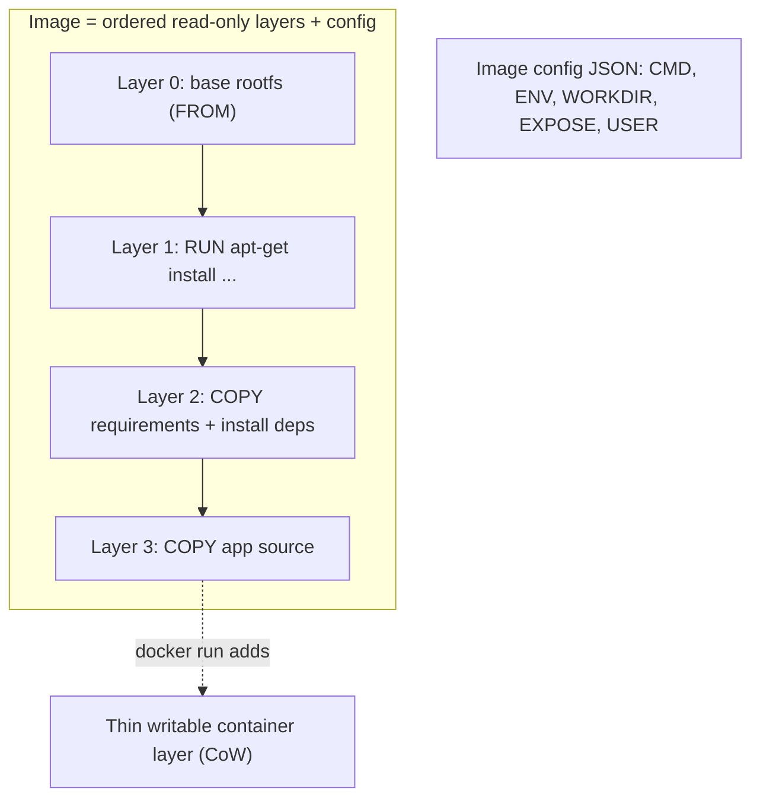
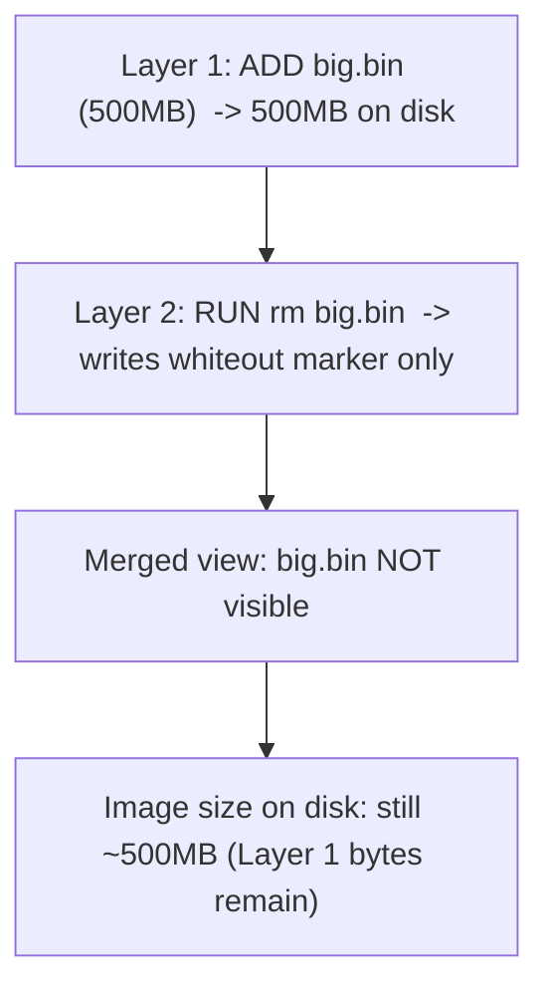

# Dockerfile, Layers & Build Cache

Topic 2 left 400 MB of deleted toolchain unaccounted for — the whiteout that still ships.
Where those bytes sit, why the build never reclaims them, and why no later instruction can
reach back and evict them is settled in
[Why each layer adds size](#why-each-layer-adds-size-deleting-in-a-later-layer).

Two teams ship the same Express-style Node API. One team changes a single line of
`server.js` and has a new image 2 seconds later; the image is 80 MB. The other team changes
the same line, waits 8 minutes while `npm ci` reinstalls every dependency from scratch, and
gets a 1.2 GB image. Same source, same `node:22-alpine` base, same install command. The
difference is the order of six lines in a Dockerfile, plus one file that was never written.
So: what exactly does the builder compare before it decides it may skip an instruction, and
what does an instruction leave behind in the image forever?

> [!TIP]
> **Reading map.** About 50 minutes. The first four sections are the model everything else
> rests on — what a layer is, which instructions make one, what gets sent to the builder,
> and how the cache key is computed. Already writing Dockerfiles daily? Jump to
> [Why each layer adds size](#why-each-layer-adds-size-deleting-in-a-later-layer) for the
> size arithmetic, [ARG vs ENV](#arg-vs-env) for the scope trap, and
> [Reading the CACHED column](#reading-the-cached-column) for the diagnosis loop.
> Everything else is context.

> [!KEY-TAKEAWAY]
> Three facts carry most of this topic. First, only `RUN`, `COPY` and `ADD` add layers;
> `ENV`, `WORKDIR`, `CMD`, `LABEL` and `EXPOSE` only write fields into the image's config,
> so combining them saves no bytes. Second, a cache miss on one instruction forces a rebuild
> of that instruction and every instruction after it, which is why rarely-changing steps
> belong above frequently-changing ones. Third, layers only add: deleting a file in a later
> layer hides it without shrinking the earlier layer, and the bytes still ship.

---

## What a Dockerfile is and the image-layer model

A Dockerfile is read top to bottom, and every instruction that changes the filesystem
freezes its result into one more read-only layer. A twelve-line Dockerfile with three `RUN`s
and one `COPY` adds four layers of its own; the other eight lines add none. The layers are
ordered, and the order is part of the image: layer 3 is applied over layer 2, which is applied
over layer 1.

An image is those ordered layers plus one JSON document, the **image config** — the fields
that describe how to start a container rather than what is in its filesystem. Five of them
appear in almost every image: the default command, environment variables, working directory,
exposed ports and default user. A layer carries bytes. The config carries settings. Nothing in
the config takes up meaningful space, and nothing in a layer can be changed after the fact.

Topic 1 established the layer: a changeset holding the files this step added, the files it
modified, and a whiteout marker for each file it deleted. Each one is stored once and named by
the SHA-256 digest of its own bytes, and the union filesystem presents the stack as one merged
tree. Three properties of the design are what the rest of this topic trades on. Unchanged
layers can be reused, so a rebuild only redoes what actually changed. Identical layers are stored and transferred
once, so two images built `FROM ubuntu:22.04` share those base layers on disk. And every
layer is read-only, so `docker run` adds a thin writable layer on top and copies a file up
into it on first write, leaving the image itself untouched.



An image is not an archive you open and edit but an ordered list of frozen diffs plus a
settings file, so "building" means evaluating instructions, producing or reusing layers, and
writing that file. A container is one of those images with a writable layer and its own
namespaces and cgroups around it. Every size problem and every cache problem in this topic
follows from the freezing.

### Where the layers go: pushing and pulling only what is missing

`docker push` of a rebuilt 80 MB image often uploads only a couple of megabytes — just the
layer holding your source. Sharing works the same way on the wire as it does on disk, because
a registry stores each layer as a **blob**: one opaque file, filed under the digest of its own
bytes.

A push sends the blobs first and the **manifest** last — the small JSON document that
lists which blob digests make up this image, and in what order. Before uploading a blob the
client can ask whether the registry already has that digest: a `HEAD` on the blob's URL
answers 200 or 404. A layer the registry already knows is not uploaded twice. A pull runs the
same check in reverse: the client reads the manifest, compares those digests against local
storage, and fetches only the ones it is missing.

That existence check is why ordering pays off twice. An unchanged dependency layer is
skipped by the rebuild and skipped by the push, because the registry already holds a blob
with that digest. Invalidate a 500 MB layer and you pay twice: once in build time, once in
upload bytes. So the next question is which instructions can make a layer at all, since only
those lines can cost you either.

---

## Which instructions create layers vs metadata

Only three instructions can add a layer: `RUN`, `COPY` and `ADD`. `FROM` contributes the base
image's existing layers rather than making a new one. Every other instruction — `ENV`,
`WORKDIR`, `CMD`, `EXPOSE` and the rest — writes a field into the config, and a config field
takes no meaningful space. Sorting the whole instruction set takes one question: does this
line change files on disk inside the image, or does it only record a setting for later?

| Instruction | Creates a layer? | What it does |
|---|---|---|
| `RUN` | **Yes** | Executes a command in a new layer; captures resulting fs changes |
| `COPY` | **Yes** | Copies files from build context (or another stage) into the image |
| `ADD` | **Yes** | Like COPY plus tar-extraction / remote-URL fetch |
| `FROM` | (brings in base layers) | Sets the base image; its layers become the foundation |
| `ENV` | No (metadata) | Sets an environment variable in the image config |
| `WORKDIR` | No (metadata)* | Sets the working directory (created if missing) |
| `CMD` | No (metadata) | Default command/args, run at container start (not build) |
| `ENTRYPOINT` | No (metadata) | Fixed executable, run at container start |
| `EXPOSE` | No (metadata) | Documents a port; does not publish it |
| `LABEL` | No (metadata) | Key/value annotations |
| `USER` | No (metadata) | Default UID/GID for subsequent RUN and at runtime |
| `ARG` | No (metadata) | Build-time variable; not persisted in the image |
| `VOLUME` | No (metadata) | Declares a mount point |
| `HEALTHCHECK` | No (metadata) | Sets the container health check |
| `STOPSIGNAL` | No (metadata) | Signal used to stop the container |

\* `WORKDIR` writes a config field and also creates the directory if it is missing, so it is
the one row where "metadata" is not the whole story.

That table settles a piece of folklore. "Reduce your layer count by combining your `ENV`
lines into one" saves nothing on a modern build, because no `ENV` line was costing a layer
to begin with. The lines that cost size and cost cache are `RUN`, `COPY` and `ADD`, and
those are the ones worth combining or reordering. Metadata instructions still matter for
the cache — the builder keys them on their own text, so editing an `ENV` value does
invalidate everything below it — but they never add bytes.

> [!WARNING]
> "Why didn't my `CMD apt-get install -y curl` install anything?" Because `CMD` and
> `ENTRYPOINT` name what runs when a container starts, and nothing in them executes during
> the build. Only `RUN` executes at build time, and only its filesystem changes get frozen
> into a layer. A `CMD` that installs packages installs them fresh on every container start,
> into a writable layer that is discarded when the container is removed.

### What `docker history` is really listing

Run `docker history` on the image from the diagram above and you may see nine rows for four
layers. The rows are not layers; they are build steps. The image config keeps two separate
lists: the ordered layer digests, which `docker image inspect` prints as `RootFS.Layers`, and
a history array recording each step in order. The OCI image spec marks a history entry
`empty_layer: true` when it "doesn't correspond to an actual layer in the rootfs section".
`docker history` prints that array, which is why metadata steps appear as rows of `0B`. So the
rows track build steps — yours and the base image's — and `RootFS.Layers` tracks layers.

The layer-count folklore has a source. Older builders listed every instruction, metadata
included, as its own row in `docker history`, so a Dockerfile with ten `ENV` lines looked like
it had ten more layers than it really did. Those rows were always 0 B, but a row that looks
layer-shaped gets read as a layer. BuildKit, the default builder in current Docker, puts
layers in the final image only for instructions that actually change the filesystem and folds
the rest into the config. Either way the practical reading is the same: a `0B` row is a
setting, and the rows with real byte counts are the ones to attack. Those byte counts, though,
depend on something that happens before the first instruction even runs — what the builder was
handed.

---

## The build context and .dockerignore

The `.` at the end of `docker build .` is a directory. It gets packed up and shipped to the
builder before a single instruction runs. That directory tree is the **build context**: the
files the client sends over, and the only files `COPY` and `ADD` are allowed to read. So
`COPY ../secret.txt .` fails no matter what permissions you have. The path is outside what was
sent, so as far as the builder is concerned it does not exist.

The context is handed over before any instruction runs, so its size is a toll you pay before
the cache can help you at all. Watch the first two lines of output:

```
=> [internal] load build context
=> => transferring context: 1.83GB     # <- red flag
```

That 1.83 GB is the Node API's repository with `node_modules/` and `.git/` still in it. The
project's own source is a few megabytes; the rest is a dependency tree the image is about to
install from scratch anyway, plus every commit ever made. A 10 GB dataset sitting in the same
folder would be sent too. None of it is needed. A cold build sends the whole tree before it
evaluates a single line, and a cold build is what you get on the first build of the day and on
every fresh CI runner. A warm local builder sends less, because BuildKit loads context files
as it needs them and keeps what it already has, so a rebuild on the same machine often prints
a few kilobytes instead. The 1.83 GB is what a clean checkout costs, and CI is mostly clean
checkouts.

A `.dockerignore` file at the context root fixes it. The patterns are globs in the same
style as `.gitignore`, and anything matching them is never sent, so it can never be copied
in by accident either:

```dockerignore
.git
node_modules
**/*.log
dist
.env
*.md
```

Those patterns are doing two different jobs. `node_modules` and `.git` are there for size.
`.env` is there because `COPY . .` would otherwise bake your local credentials into a
layer, and a later section shows why a deleted file is not really deleted.

### Where it also pays: keeping a layer cacheable

`**/*.log` earns its place for a third reason: cache stability. `COPY . .` computes its
cache key from the files it is about to copy. One log file that grows on every run changes
that key on every run, so the `COPY` layer and everything below it rebuilds even when no
source file was touched. Ignoring the log makes the same `COPY` a cache hit.

Two habits follow: write the `.dockerignore` before you ever write `COPY . .`, and never put
`COPY . .` near the top of the file. A missing `.dockerignore` is the single most common answer
to "why is my build context 2 GB and why does my cache never hit?", and it costs one file to
fix. The next question is what exactly goes into that cache key, instruction by instruction.

---

## How the build cache works and cache-invalidation rules

Before running an instruction the builder looks for a layer it built earlier from the same
starting point, and reuses it if it finds one. "Same starting point" has three parts: the
same parent layer, the same instruction text, and the same inputs. All three match and you get
a **cache hit**: the existing layer is reused and nothing executes.

Any one of them differs and you get a **cache miss**, so the instruction runs and produces a
new layer. And a miss is never local. Every instruction builds on the layer below it, so a new
layer at line 5 gives line 6 a parent the builder has never seen. Line 6 misses, which makes
line 7 miss, all the way down. One changed character in a `COPY` at line 5 of a ten-line Dockerfile
re-runs lines 5 through 10. The 8-minute rebuild in the opener is exactly this: the Node API
copies its source above `RUN npm ci`, so every code change makes the install a miss.


### What each instruction hashes

"Same inputs" means something different for `RUN` than for `COPY`, and the difference is
the source of the classic stale-package bug. One question separates the instructions: can
the builder see the inputs without doing the work?

| Instruction | What the cache key is built from | What it ignores |
|---|---|---|
| `RUN` | the command string, exactly as written | everything the command reads or writes |
| `COPY` / `ADD` | a checksum over the files being copied | the files' modification times |
| `ENV`, `WORKDIR`, other metadata | the instruction's own text | nothing else is involved |
| `ARG` | the value of the build argument | — |

For `COPY` and `ADD` the builder computes a **checksum**: a hash over the files the instruction
would copy. It covers their contents and their file metadata, and deliberately not their
modification time. Change a byte in `server.js` and the checksum changes, so the layer is
rebuilt. Run `touch server.js` and nothing changes, because the timestamp moved and nothing
that is hashed did. The docs say "file metadata" without listing which attributes count. So the
safe operating rule is this: any change to a copied file other than its mtime may cost you the
layer. One more distinction, because the two words look alike. This checksum is computed over
files in your working tree; an image layer's digest is computed over the bytes of a finished
layer.

`RUN` is the one the builder cannot inspect. A
`RUN` line is an arbitrary command, so the only way to learn what files it would produce is
to execute it — which is exactly the work the cache exists to skip. So the builder keys the
step on the one thing it can read for free: the command string. Docker's docs are blunt about
the consequence. The files updated in the container "aren't examined to determine if a cache
hit exists," and "just the command string itself is used to find a match." One exception: a
`RUN` that bind-mounts files in is hashed like a `COPY`, because those files are visible
without running anything.

That has a sharp edge. `RUN apt-get update` on its own line is a hit forever, because its
string never changes, so the package index inside that cached layer is as old as the day it
was built. The install on the next line then resolves against a months-old index. Nothing
about your rebuild tells you this happened; the step just says `CACHED`.

Combining the two lines helps, and it is worth being exact about how much. `RUN apt-get update
&& apt-get install -y curl` is still keyed on its string alone. Leave that line untouched for
six months and it stays a cache hit for six months. It keeps serving the index it built on day
one, and it keeps installing whatever `curl` that index named — even if a newer `curl` has
been published since. What combining buys you is that the refresh is now tied to the string
changing: add or bump a package and the update re-runs in the same step that consumes it. It
does not make the packages fresh on its own. Freshness needs something that actually forces a
miss — `--no-cache`, a changed package list, or a rebuild you schedule deliberately.

> [!WARNING]
> "But I run `apt-get update` every build." You run the *line* every build; the command
> inside it has not executed since the layer was first created. Put the update and the
> install in one instruction: `RUN apt-get update && apt-get install -y foo`, so the index is
> refreshed in the same step that consumes it. Split across two `RUN`s you get the worst case:
> the update is a permanent cache hit, so every install resolves against a frozen index no
> matter how often the install line itself changes.

### Forcing a miss on purpose

Sometimes you want the miss. There are four levers, and they differ in how much they throw
away:

```bash
docker build --no-cache .                        # ignore all cache, rebuild every step
docker build --no-cache-filter=deps .            # ignore cache only for the stage named "deps"
docker build --build-arg CACHEBUST=$(date +%s) . # change a value, bust from that point down
docker builder prune                             # delete cached layers to reclaim disk
```

`--no-cache-filter` takes stage names, not line numbers or instruction text: `deps` has to
be a stage declared as `FROM ... AS deps`, and you can name several, comma-separated. Naming
a stage is the surgical alternative to `--no-cache`: the dependency stage re-runs while the
rest of the build stays cached.

The `CACHEBUST` line looks like magic and is not. Your shell expands `$(date +%s)` to the
current epoch second before Docker ever sees the command, so every invocation passes a value
no earlier build used. A changed build-argument value invalidates the cache, and invalidation
cascades, so everything from that point down re-runs.

One detail is genuinely unsettled. The docs say build arguments invalidate the cache, and
their own example declares `ARG CACHEBUST` immediately above the step it wants to re-run
without referencing the value inside that step. They never say whether declaring the
argument is enough, or whether an instruction has to consume it. So place the `ARG` line
directly above the instruction you want re-run, where both readings agree, and expect a full
rebuild if you put it at the top of the file.

The levers all treat a symptom. The cure is putting your instructions in an order where the
things that change often cannot invalidate the things that are expensive.

---

## Ordering instructions least-to-most-frequently-changed

Put the lines that rarely change at the top and the lines that change on every commit at the
bottom. That one rule turns the Node API's 8-minute rebuild into a 2-second one, because
`RUN npm ci` stops sitting underneath the source copy. It follows from the cascade: a miss
invalidates everything below it, so whatever sits below a frequently-changing line rebuilds
at that line's frequency, however expensive it is.

Rank your own instructions by how often each one's inputs change and the running order falls
out: base image, then OS packages, then the dependency manifest and the dependency install,
then the application source, then the build. Your source changes several times a day. Your
lockfile changes when someone adds a library. So the install belongs above the source copy,
not below it.

The version that gets it wrong is also the shorter one, which is why it gets written first:

```dockerfile
FROM node:22-alpine
WORKDIR /app
COPY . .              # <- source copied first; ANY code change busts this layer...
RUN npm ci            # <- ...so npm ci re-runs on every single build (slow!)
CMD ["node", "server.js"]
```

`COPY . .` includes `server.js`, so its checksum changes with every edit, so it misses, so
`RUN npm ci` — the next line down — misses too and reinstalls every dependency. The install
is doing nothing different from last time. It re-runs because of where it sits.

Splitting the copy in two fixes it:

```dockerfile
FROM node:22-alpine
WORKDIR /app
COPY package.json package-lock.json ./   # changes rarely
RUN npm ci                               # cached until deps change
COPY . .                                 # changes often, but it's the LAST fs layer
CMD ["node", "server.js"]
```

Now the only thing a code change invalidates is the final `COPY . .`, and there is nothing
expensive below it. `npm ci` stays a cache hit until `package-lock.json` itself changes, and
the rebuild drops from 8 minutes to about 2 seconds. Asked in a review how to stop a Node
image reinstalling on every code change, this is the whole answer: copy the lockfile alone,
install, then copy the source.

Every ecosystem has the same pair of files, so the same split works with different names:
`requirements.txt` before `pip install -r requirements.txt`; `go.mod` before
`go mod download`; `pom.xml` before `mvn dependency:go-offline`; `Gemfile` and
`Gemfile.lock` before `bundle install`. In each case you are copying the smallest file that
determines the dependency set, installing from it, and only then copying the code.

### Where it breaks: when the dependency manifest changes as often as the source

A repository that bumps a version in `package-lock.json` on most commits gets nothing from
the split. The lockfile is now a frequently-changing input, so `npm ci` misses about as often
as it did before and you are back to a full install per build. The ordering was never wrong;
the assumption behind it was. The same happens in a monorepo where one `COPY . .` pulls in a
dozen packages' dependency manifests at once. Any one of them changing invalidates the single
install step below.

Ordering can only exploit a difference in change frequency that actually exists. Where it
does not, you need a cache that survives a miss rather than one that avoids it, which is
what cache mounts do later in this topic. First, though, the copy itself: `COPY` has a
sibling that does more than it appears to.

---

## COPY vs ADD

`COPY` does exactly one thing: it copies files from the build context into the image. Both
`COPY app.tar.gz /opt/` and `ADD app.tar.gz /opt/` create a layer, and `ADD` then adds
behaviour on top — it unpacks local archives, fetches URLs, clones git repositories. The
common review rule is "use `COPY` unless you need one of those". It is a decent default,
because `COPY` cannot surprise you. Docker's own guidance is narrower than that rule. It puts
`COPY` on local files and stage-to-stage copies, and it points at `ADD` for fetching a remote
artifact — `ADD` gives a more precise build cache and takes a `--checksum`, where a
hand-rolled `wget` gives you neither.

| Capability | `COPY` | `ADD` |
|---|---|---|
| Copy files/dirs from build context | Yes | Yes |
| Copy from another build stage (`--from`) | Yes | Yes |
| Auto-extract a **local** tar archive into dest | No | **Yes** (decompressed & unpacked) |
| Fetch a **remote URL** | No | Yes (`ADD https://...`) |
| Extract a **remote** tar | — | **No** by default (`--unpack=true` opts in) |
| Fetch a **git repo** | No | Yes (`ADD git@...`, BuildKit) |
| Checksum-verify remote (`--checksum`) | — | Yes |

The asymmetry in the middle two rows is the one that bites. A local archive is unpacked; a
remote one is downloaded whole:

```dockerfile
# ADD auto-extracts a LOCAL tar into /opt (surprising if unexpected)
ADD app.tar.gz /opt/          # extracted contents land in /opt

# COPY is literal — copies the file as-is
COPY app.tar.gz /opt/         # /opt/app.tar.gz stays a tarball

# RUN curl when the download must not survive: fetch, unpack and rm inside one layer
RUN curl -fsSL https://example.com/x.tgz -o /tmp/x.tgz \
 && tar -xzf /tmp/x.tgz -C /opt && rm /tmp/x.tgz
```

Two details make the unpacking harder to predict than it looks. The builder decides whether
something is an archive by reading the file's bytes, not its name, so a file called
`data.tar.gz` that is not really a compressed archive is copied as-is with no error. And the
`--unpack` flag, available from Dockerfile frontend version 1.17, flips either default in
either direction, so "was it extracted?" now depends on the flag as well as on the source.

`ADD`'s remote features carry their own small print. A git source is recognised by its
`git@` prefix or `.git` suffix, and a fragment after `#` picks a branch, tag, commit or
subdirectory: `ADD git@github.com:moby/buildkit.git#v0.14.1:docs /buildkit-docs`. An SSH
source needs a key forwarded with `docker build --ssh default .`. The `--checksum` flag
needs frontend version 1.6 or later, and what you pass depends on the source. For HTTP it is
the SHA-256 content digest, written `sha256:<hash>`, and SHA-256 is the only algorithm
supported. For git it is the commit SHA, and a prefix of one character or more will match.

### What it costs: the layer you cannot clean up

`ADD https://example.com/x.tgz /tmp/` puts the downloaded file into the layer that the `ADD`
itself creates. The download and the layer are the same thing, so there is no room left in
that layer to delete the archive after unpacking. A `RUN rm /tmp/x.tgz` on the next line runs
in a new layer, which hides the file without reclaiming its bytes — the mechanism the next
two sections take apart.

The `RUN curl` form avoids that because fetch, verify, unpack and delete all happen inside
one command, and the layer is not committed until the whole command finishes. `--checksum`
has since closed the verification half of the gap for HTTP and git sources, so the honest
summary is narrower than the old advice. Use `COPY` for local files. Use `ADD` when you want
local tar extraction or a checksummed remote fetch. Use `RUN curl && verify && rm` when the
download must not survive into the image. The same principle governs how you group several
`RUN` lines into one.

---

## Combining RUN commands to reduce layers

Each `RUN` produces its own layer, and a layer is sealed the moment its command finishes. So
six `RUN` lines make six layers, and anything one of them creates is frozen before the next
one gets a chance to remove it. The real argument for combining related commands follows, and
it is neither tidiness nor the layer count: cleanup only works while the layer is still
open.

Here is a build that installs a toolchain, uses it, and cleans up afterwards — and ships all
of it anyway:

```dockerfile
RUN apt-get update
RUN apt-get install -y build-essential
RUN wget https://example.com/big.tar.gz
RUN tar -xzf big.tar.gz && make install
RUN rm big.tar.gz                     # deletes in a NEW layer; earlier layer still fat
RUN apt-get purge -y build-essential  # too late — bytes already shipped in earlier layer
```

Every line reads as sensible. The tarball is deleted; the compiler is purged. But the
tarball was frozen into layer 3 and the compiler into layer 2, and lines 5 and 6 write new
layers that only record the removal. The image carries the full weight of both.

Chaining the same work into one instruction changes the result, because now there is only one
layer and it is committed after the cleanup:

```dockerfile
RUN apt-get update \
 && apt-get install -y --no-install-recommends build-essential wget \
 && wget https://example.com/big.tar.gz \
 && tar -xzf big.tar.gz && make install \
 && rm big.tar.gz \
 && apt-get purge -y --auto-remove build-essential wget \
 && rm -rf /var/lib/apt/lists/*        # all in ONE layer -> temp files never persist
```

When the builder captures the changeset for that instruction, the tarball is already gone,
the compiler is already purged and the apt lists are already deleted, so none of them appear
in the diff at all. They existed only inside the running command. `--no-install-recommends`
and the `rm -rf /var/lib/apt/lists/*` are in there for the same reason: they keep bytes out
of the layer rather than deleting them from it afterwards.

### What it costs: cache granularity

That single instruction is now eight commands long, joined by seven `&&`, and its cache key is
the whole string. Add
one package to the install list and the string changes, so the entire chain re-runs: the
update, the download, `make install`, all of it. Two separate `RUN`s would have let the
download stay cached while only the install re-ran. You are buying image size with rebuild
time, and the exchange rate depends on how often each part changes.

The rule that falls out is about change frequency again, not about counting layers. Group
commands that must clean up after themselves, and commands that always change together, into
one `RUN`. Split commands that change on genuinely different schedules — a rarely-touched
system-package install and a frequently-touched build step — so each keeps its own cache
entry.

Both halves of this section have leaned on the same unexplained claim — that a delete in a
later layer does not give the bytes back. The next section settles it.

---

## Why each layer adds size (deleting in a later layer)

A 500 MB file deleted two instructions later still costs 500 MB in the image you ship. Topic
2's 400 MB toolchain is the same arithmetic: the Dockerfile downloads it, builds with it,
deletes it on the next line, and the image is still 1.19 GB. The bytes are exactly where the
download put them — in the layer that `ADD` or `wget` created. What the delete produced is a
whiteout in a *different*, later layer: a marker that says "this path is gone from here
down". The merged view honours it, so `ls` inside the container finds nothing, and `du`
agrees. The image's layer list still names a 400 MB blob, and `docker pull` still transfers
it.

Two guesses feel right here and both are wrong. The first is that the build tidies up at the
end. It does not: each instruction's changeset is committed the moment that instruction
finishes, and the finished image is the list of those committed layers, with no compaction
pass afterwards. The second is that the delete edits the earlier layer, removing the file at
source. That cannot happen, for a reason worth its own seam below.



Topic 2 showed a whiteout that cost nothing: delete a file inside a running container and the
whiteout goes into that container's writable layer, which is thrown away when the container
is removed. Pruning a hundred containers therefore gave back only forty megabytes. A
whiteout written during a *build* goes into an image layer instead, and image layers are the
thing you push, pull and keep. Same marker, same mechanism, opposite lifetime: one dies with
the container, the other ships forever, and the bytes it hides keep their full size in the
layer below.

So none of these three shrink the final image, and each of them looks like it should:

- `RUN rm -rf /some/big/thing` in a separate, later `RUN`.
- `RUN apt-get purge ...` when the install ran in an earlier layer.
- Deleting a credential or a cache in a later step — which is also a security problem, below.

### Why a later instruction cannot reach back

Editing layer 1 is not an operation that exists. A layer is stored as a blob whose name *is* a
digest of its own bytes, and the image's layer list names those digests in order. Change one
byte inside layer 1 and the digest changes, so what you have produced is a different blob with
a different name — not an edited layer, a new one. The old digest is still the one the layer
list names, still the name your registry files that blob under, and possibly still what three
other images built from the same base are sharing. (Strictly there are two digests in play: the
one an image's own layer list records, computed over the layer's uncompressed contents, and the
one a registry files the blob under. The immutability argument reads the same on either.)

Immutability is the whole reason a build can only append. Content-addressed storage buys the
sharing and the cache hits that make the first four sections work, and the price is that
nothing already committed can be revised. A later instruction gets to add files, replace files in the
merged view, and write whiteouts. It never gets to reach down and reduce what an earlier
layer weighs.

### What actually fixes it

Three fixes work, and they differ in what they can reach. Cleaning up inside the same `RUN`
works for anything created and destroyed within one instruction: the compiler, the tarball,
the apt lists. Nothing already committed before that line is within its reach. Multi-stage
builds reach everything. You build in a fat stage, then `COPY --from=build` only the finished
artifact into a fresh final stage, and the fat stage's layers never appear in the final
image's layer list. Multi-stage is the reliable fix for a toolchain problem, and
`multi-stage-builds-image-optimization` takes it apart properly.

Squashing is the third, and it is a legacy escape hatch rather than a tool to reach for.
`docker build --squash` collapses the layers a build just created into one new layer, which
does drop the hidden bytes. What it charges for that:

- Layer sharing goes away for everything the build produced — the base image is still shared,
  but your dependencies and your code are now one blob, so any change re-uploads all of it.
- The daemon keeps the cached layers *and* the squashed copy, so local disk use goes up.
- One layer cannot be downloaded in parallel, so pulls get slower.
- A build that changed nothing on the filesystem fails outright.

`--squash` is also an experimental daemon feature, available from API version 1.25 and only
when the daemon runs with `--experimental` or `experimental: true` in `daemon.json`. The flag
is documented against the legacy pre-BuildKit backend, which today matters only for Windows
containers. Docker's own documentation sends readers to multi-stage builds instead.

> [!WARNING]
> "I deleted the key in the next line, so it is not in the image." It is. `COPY id_rsa .`
> followed by `RUN ... && rm id_rsa` leaves the private key sitting in the layer the `COPY`
> created, and anyone who can pull the image can run `docker save` and read it straight out
> of the tar. No scanner, no `docker exec`, no running container needed. The fix is not to
> delete the file more carefully; it is never to put it in a layer. A
> `RUN --mount=type=secret,id=...` exposes the file to that one command only, and it is not
> part of any layer.

One consequence of same-`RUN` cleanup deserves a second look. If a package manager's
download cache is deleted before the layer closes, every rebuild re-downloads the packages
from the network — which is the problem the next section solves.

---

## RUN cache with package managers (BuildKit cache mounts)

`pip install -r requirements.txt` downloads every wheel again the moment its `RUN` line
misses, even if you only added one package to a list of forty. The layer cache is
all-or-nothing: it either hands you the whole finished layer or runs the whole command from the
start. And pip's own download cache is no help, because it only ever existed inside the layer
the previous run produced. A miss builds a fresh layer from the parent instead of reusing that
one, so from the new command's point of view the cache directory is empty. A **cache mount**
fixes exactly that gap: `RUN --mount=type=cache` attaches a directory that persists across
builds, is visible to that one command, and is not part of the image.

```dockerfile
# syntax=docker/dockerfile:1
FROM python:3.12-slim
WORKDIR /app
COPY requirements.txt .
RUN --mount=type=cache,target=/root/.cache/pip \
    pip install -r requirements.txt          # pip's download cache persists between builds
```

Change `requirements.txt` and that `RUN` still misses — the checksum changed, so the layer is
rebuilt. What is different is what the rebuild has to do: pip finds thirty-nine wheels already
sitting in `/root/.cache/pip` and downloads only the fortieth. The install re-runs; the
network traffic does not. The mount is not a layer either, so nothing in that cache directory
appears in the image. So you do not clean it up at the end of the command the way you would
with `/var/lib/apt/lists`.

So there are two caches, doing two different jobs. The layer cache decides *whether* an
instruction runs, by comparing keys. A cache mount decides *how much work the instruction
does* when it does run, by keeping a scratch directory alive between builds. They are orthogonal: you can hit one and miss the
other in any combination. Deeper mechanics, including how the cache is exported and shared
between machines, belong to `buildkit-advanced-builds`.

Two requirements come with the syntax. The `# syntax=docker/dockerfile:1` line pins the
Dockerfile frontend, which is the part that understands `--mount`, and it pulls the latest
stable frontend release. A parser directive like that one must sit at the very top of the
file, before any comment or instruction, or it is read as an ordinary comment. The second
requirement is BuildKit itself, which `docker build` uses by default unless you are building
Windows containers or have set `DOCKER_BUILDKIT=0`.

### What `sharing=locked` prevents

```dockerfile
# apt example: keep the apt cache between builds (and don't delete it since it's a mount)
RUN --mount=type=cache,target=/var/cache/apt,sharing=locked \
    --mount=type=cache,target=/var/lib/apt/lists,sharing=locked \
    apt-get update && apt-get install -y --no-install-recommends curl
```

Two builds on the same CI runner will happily start at the same second, and by default they
get the same cache directory at the same time. `sharing=shared` lets several writers use one
mount concurrently. For pip that is fine. For apt it is not. Apt expects exclusive access to
its lists and its archive directory, and two `apt-get` processes writing to one directory
corrupt each other's state. `sharing=locked` makes the second build wait until the first
releases the mount. The third option, `sharing=private`, gives the second writer a new mount
of its own instead of making it queue: no waiting, and no benefit from what the first build
has already downloaded.

One property of cache mounts is easy to over-trust. They are a performance optimisation and
nothing more: another build may overwrite their files, and the builder's garbage collector
may reclaim the whole directory when it needs the space. So the build must still work on an
empty mount — the case you get on every fresh CI machine. Never put anything in a cache mount
that the build cannot regenerate.

Cache mounts leave nothing in the image. Variables are the other build-time-only feature, and
one of the two kinds does persist — which is the next section's distinction.

---

## ARG vs ENV

`ARG BUILD_ENV=production` is gone the moment the build finishes; `ENV APP_ENV=production` is
still there when your process starts three months later. Both declare a variable, both are
usable in later instructions, and that is where the similarity stops. One is scaffolding for
the build, the other is a field written into the image config that every container from that
image will see.

| | `ARG` | `ENV` |
|---|---|---|
| Available at | **build time only** | build time **and** container runtime |
| Persisted in image? | **No** | **Yes** (in image config) |
| Set via | `--build-arg NAME=val` | baked into Dockerfile (or overridden by `-e` at run) |
| Scope | from its declaration line to end of stage (per-stage) | from declaration onward |
| Can precede `FROM`? | **Yes** (only ARG can) | No |
| Precedence | `ENV` of same name **overrides** `ARG` in RUN env | — |

```dockerfile
ARG NODE_VERSION=20            # can appear before FROM to parameterize the base image
FROM node:${NODE_VERSION}-alpine

ARG BUILD_ENV=production       # build-time only; NOT in final image
ENV APP_ENV=production         # persists; visible via `docker inspect` / to the process

RUN echo "building for $BUILD_ENV"   # ARG usable in this RUN
```

`ARG` is the only instruction allowed before `FROM`, and parameterising the base image tag is
what that permission is for: `--build-arg NODE_VERSION=22` now switches the base image without
editing the file. The precedence row is the one that produces confused bug reports. Declare
both an `ARG PORT` and an `ENV PORT`, pass `--build-arg PORT=8080`, and your `RUN` steps see
the `ENV` value, because an `ENV` of the same name always wins. The idiom that gets the
build-arg value through is to feed one into the other with a shell default:
`ENV APP_VERSION=${APP_VERSION:-1.0.0}`. That takes the build argument when one was passed and
falls back otherwise, and it persists either way, because `ENV` always persists.

Neither is a secret store. A build argument's value is visible in `docker history`, so
`--build-arg NPM_TOKEN=...` publishes the token to everyone who can pull the image. The one
exception is the predefined proxy variables: `HTTP_PROXY`, `NO_PROXY` and their siblings.
Docker leaves them out of `docker history` by default, and out of the cache key too, so
switching proxies does not force a rebuild. Declare `ARG HTTP_PROXY` yourself and you lose both
exemptions at once. `ENV` is worse rather than better: its values go into the image config,
where `docker inspect` prints them for anyone holding the image. Secrets belong in neither,
which is what `RUN --mount=type=secret` is for.

### Where the pre-`FROM` ARG disappears

The variable that worked in the `FROM` line is empty on the line after it:

```dockerfile
ARG NODE_VERSION=20            # outside every stage
FROM node:${NODE_VERSION}-alpine
RUN echo "version=$NODE_VERSION"   # prints "version=" — empty
ARG NODE_VERSION                   # redeclared, no default
RUN echo "version=$NODE_VERSION"   # prints "version=20"
```

An `ARG` takes effect from the line it is declared on, and its scope ends with the stage it
was declared in. An `ARG` before `FROM` belongs to no stage at all, so inside the stage that
name was never declared. An undeclared variable expands to an empty string rather than
raising an error, which is why this fails silently instead of failing the build. The bare
`ARG NODE_VERSION`, with no `=` and no default, sets nothing. It re-declares the name inside
the stage, and the value it picks up is the one from the outer declaration.

The same scoping rule explains a multi-stage surprise. A stage built `FROM` another stage
inherits that stage's arguments. Two unrelated stages share nothing, so each one needs its own
`ARG` line for the same variable. Repeating the declaration is not duplication here; it is
the only way to bring the name into scope. The `FROM` line above makes one more choice worth
deciding deliberately: which base image every stage starts from.

---

## Base images: FROM, scratch, tags and digests

`FROM node:22-alpine` decides how many layers and how many megabytes your image starts with
before you have written a single instruction of your own. It also decides what a shell, a
package manager and a CVE feed look like for that image. Every rung of the ladder below
answers the same question differently: how much operating system does this program actually
need at runtime?

- **Full distro** (`ubuntu:22.04`, `debian:bookworm`) — familiar, has a shell + package
  manager, but large (tens–hundreds of MB) and more CVEs.
- **Slim** (`python:3.12-slim`, `debian:bookworm-slim`) — trimmed distro, good default.
- **Alpine** (`alpine:3.20`, `node:22-alpine`) — single-digit megabytes (Docker Hub's own
  blurb rounds `alpine` to 5 MB), musl libc rather than glibc.
- **Distroless** (`gcr.io/distroless/*`) — just your app + runtime libs, **no shell, no
  package manager** → tiny attack surface.
- **`FROM scratch`** — the **empty** image: zero base layers. Used for fully static
  binaries (Go/Rust) — the resulting image contains only your binary.

The ladder trades convenience for surface, and the rung you pick decides how you debug. On a
full distro you run `apt-get install -y curl` inside the container. On distroless there is no
shell to exec into and nothing to install with, so debugging moves outside the container.
`scratch` is the limit: no libc, no `/etc/passwd`, no CA certificates, nothing but what you
copied in.

```dockerfile
# Static Go binary on scratch -> a few-MB image, no OS at all
FROM golang:1.22 AS build
WORKDIR /src
COPY . .
RUN CGO_ENABLED=0 go build -o /app ./cmd/server

FROM scratch
COPY --from=build /app /app
ENTRYPOINT ["/app"]
```

`CGO_ENABLED=0` is what makes that work: it produces a binary with no dynamic dependency on a
C library, which matters because there is no C library in the final image to link against.
`FROM ... AS name` names a stage so that `COPY --from=name` can reach into it — `--from=build`
here. The same flag accepts `--from=<image>`, so you can copy a file straight out of a
published image without running it.

### What Alpine's musl libc costs

The `alpine` image is under 4 MB compressed on the registry and under 10 MB unpacked on disk;
Docker Hub's own blurb rounds that to 5 MB. The two measures differ by more than a factor of
two, so say which one you mean. Either way the saving is real. The cost is
that Alpine links musl libc where almost every other
distribution links glibc, and binaries compiled against one are not portable to the other. The
sharpest everyday version is Python wheels. A wheel built for the `manylinux` platform tag
links glibc, so `pip` will not install it on Alpine. Unless the project also publishes a
`musllinux` wheel, pip falls back to compiling from source: the image now needs a compiler,
and the install goes from seconds to minutes. The same trap catches any Node package with a
native addon.

musl's DNS resolver has also differed from glibc's, in two ways that show up inside clusters.
One is how it handles a search list with several entries. The other is what it does when an
answer is too big for one UDP packet. That half has a fix with a date on it. musl 1.2.4 added
TCP fallback for large DNS records in May 2023, and Alpine 3.18 and later carry it. So
`alpine:3.20` — the tag named above — is already past that problem. The search-list behaviour
still differs. Anything older than 3.18 has both. That version dependence is why "Alpine DNS"
blog posts contradict each other: each was written against a different musl. Check which musl
your own tag ships before you trust a post about it. Where the few megabytes you save do not
pay for knowing all that, `-slim` on a glibc distro costs a few tens of megabytes. It removes
the whole class of problem.

### The version-specific truth: tags move, digests do not

`FROM node:22-alpine` today and `FROM node:22-alpine` next month can be two different images.
A tag is a movable label, which is topic 1's point with a build consequence. The base layers
under your image can change without a line of your Dockerfile changing. So the cache breaks
for every instruction below `FROM`, and today's build stops being reproducible against last
week's. Pinning the digest removes the ambiguity, because a digest names the exact bytes:

```dockerfile
FROM node:22-alpine@sha256:abc123...   # pinned; always the exact same base layers
```

`latest` is worth calling out because its name misleads. The tag does not mean "the newest
stable release". A publisher applies it when you do not ask for another, and whether it points
at anything sensible is up to them. It can be months old, and it can move under you. Use an
explicit version for anything beyond a throwaway experiment, and a digest wherever you need
the build to be reproducible.

Pinning has a cost, and it is why not everybody does it. A digest never picks up the base
image's security patches, so a pin with no automated bump keeps you on a known-old base. Pin
the digest and let a bot raise the pull request that moves it. The update becomes a reviewed
event rather than an accident. A rebuild can now go wrong in the base image, the ordering or
the cleanup, so the last thing to learn is how to prove which one did.

---

## Inspecting layers and diagnosing size/cache

Five commands turn every claim in this topic into something you can check on a real image.
Each one answers a different question: which layer is fat, what the config says, which steps
ran, which were reused, and what is actually inside the bytes.

```bash
docker history --no-trunc myimage:tag   # per-layer instruction + size (find the fat layer)
docker image inspect myimage:tag        # config: env, cmd, entrypoint, layers (RootFS.Layers)
docker build --progress=plain .         # full step output; shows CACHED vs executed steps
docker build --progress=plain . 2>&1 | grep CACHED  # BuildKit writes progress to stderr, so 2>&1 is required
docker save myimage:tag -o img.tar      # export layers as tar (inspect what's inside)
```

`--no-trunc` matters more than it looks. Without it, `docker history` cuts the command column
short. The command is how you tell which Dockerfile line produced a 600 MB row, so a truncated
column hides the answer you came for. The `2>&1` matters for the same kind of reason: BuildKit
writes its progress to stderr, so a plain pipe into `grep` filters an empty stream and tells
you nothing.

### Reading the `CACHED` column

```
 => CACHED [2/5] WORKDIR /app
 => [3/5] COPY package.json package-lock.json ./
 => [4/5] RUN npm ci
 => [5/5] COPY . .
```

`CACHED` in front of a step means the builder reused an existing layer. Its absence means the
step ran. So the first step *without* `CACHED` is where your cache broke, and every step below
it was going to re-run regardless. Take that one step and ask what feeds it:

- a `COPY` is fed by the files it copies, so look for a changed file, or a log file that
  `.dockerignore` is letting through;
- a `RUN` is fed by its command string, so look for an edited line or a changed variable
  inside it;
- any step is fed by a build argument whose value moved.

In the output above the first step without `CACHED` is step 3, so a file that `COPY` covers
changed — here, `package-lock.json`. Steps 4 and 5 tell you nothing extra. They lost their
cache the moment step 3 produced a layer the builder had never seen, whatever their own inputs
were doing.

### Where the bytes went: a 1.4 GB image, top down

> [!INTERVIEW]
> Your image is 1.4 GB and nobody knows why. Walk through how you find out, naming the
> commands you would run and what each one would tell you.

Start with `docker history --no-trunc` and read the size column, because one or two rows
almost always hold most of the weight. Three shapes account for most of them:

- a `RUN` that installed a build toolchain;
- a package-manager cache never cleaned up in the same instruction;
- a `COPY` that pulled in something large, usually `node_modules` or a `.git` directory that
  a `.dockerignore` should have excluded.

If the command does not make the contents obvious, `docker save` the image and look inside
the tar — the most direct way to see a layer's actual file list.

The fix follows from which shape you found, and each one is a mechanism from earlier in this
topic. A toolchain in an early layer is a multi-stage job, because no later instruction can
shrink it. A cache directory is same-`RUN` cleanup, or a cache mount if you want to keep it
between builds without shipping it. An oversized `COPY` is a `.dockerignore` fix, plus moving
the copy below the install. And an image that is simply large everywhere is a base-image
choice, where `-slim` or Alpine or distroless changes the floor rather than the shape.

The whole loop is this: the builder freezes what each instruction produced, in the order you
wrote them, and reuses a frozen layer whenever the instruction and its inputs are unchanged.
Fast rebuilds come from putting the volatile lines last; small images come from never letting
bytes into a layer at all. The commands above tell you which of the two you got wrong.

---

## Common follow-up questions

- "Which Dockerfile instructions create layers?" — `RUN`, `COPY` and `ADD`, plus the base
  layers `FROM` brings in. `ENV`, `WORKDIR`, `CMD`, `ENTRYPOINT`, `LABEL`, `EXPOSE`, `USER`,
  `ARG`, `VOLUME` and `HEALTHCHECK` write config fields instead.
- "What invalidates the build cache?" — A changed instruction string; for `COPY`/`ADD` a
  change in the copied files' contents or metadata, mtime excluded; a changed build argument.
  And a miss on one instruction re-runs it plus every instruction below it.
- "Why does my `npm install`/`pip install` re-run on every code change?" — The source was
  copied above the install, so a code edit invalidates the install's parent layer. Copy the
  dependency manifest, install, then copy the source.
- "I `rm` a big file in a later `RUN` but the image is still huge — why?" — The bytes are
  in the earlier layer and the `rm` only wrote a whiteout in a later one. Layers are immutable,
  so delete inside the same `RUN` or use a multi-stage build.
- "COPY or ADD?" — `COPY` unless you need local tar extraction, a remote or git fetch, or
  `--checksum` verification. For downloads that must not survive into the image, `RUN curl`
  with verification and cleanup in one instruction.
- "ARG vs ENV?" — `ARG` exists only during the build and is not persisted; `ENV` is written
  into the image config and is visible to the running process. Secrets belong in neither.
- "How do you keep a package-manager download cache across builds?" — A BuildKit cache
  mount, `RUN --mount=type=cache,target=...`, which persists between builds and is not part of
  any layer.
- "Why pin a digest instead of a tag?" — A tag can be moved to different contents, which
  changes your base layers silently; a digest names exact bytes, so the build is reproducible
  and the base layer stays cached.
- "How do you cut build context and stabilise cache?" — Add a `.dockerignore` covering
  `.git`, `node_modules`, build output and logs, so the files are never sent and never feed a
  `COPY`'s cache key.

## References

- Docker docs — Dockerfile reference: https://docs.docker.com/reference/dockerfile/
- Docker docs — Build cache & optimizing builds:
  https://docs.docker.com/build/cache/ and https://docs.docker.com/build/cache/invalidation/
- Docker docs — Building best practices:
  https://docs.docker.com/build/building/best-practices/
- Docker docs — `.dockerignore`: https://docs.docker.com/reference/dockerfile/#dockerignore-file
- Docker docs — legacy `docker build` reference (where `--squash` is documented, as an
  experimental daemon feature): https://docs.docker.com/reference/cli/docker/image/build/
- Docker docs — `docker buildx build` reference (`--no-cache-filter`, `--build-arg`):
  https://docs.docker.com/reference/cli/docker/buildx/build/
- BuildKit — cache mounts & secrets:
  https://docs.docker.com/build/building/secrets/ and
  https://github.com/moby/buildkit/blob/master/frontend/dockerfile/docs/reference.md
- OCI Image Spec (layers, content-addressing):
  https://github.com/opencontainers/image-spec/blob/main/layer.md
- OCI Image Spec (image config: `rootfs.diff_ids`, `history`, `empty_layer`):
  https://github.com/opencontainers/image-spec/blob/main/config.md
- OCI Distribution Spec (blob existence checks by digest on push and pull):
  https://github.com/opencontainers/distribution-spec/blob/main/spec.md
- Docker docs — multi-stage builds: https://docs.docker.com/build/building/multi-stage/
