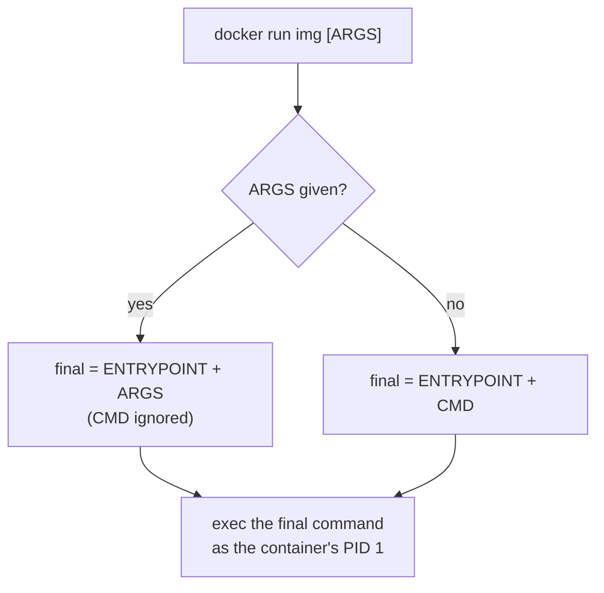
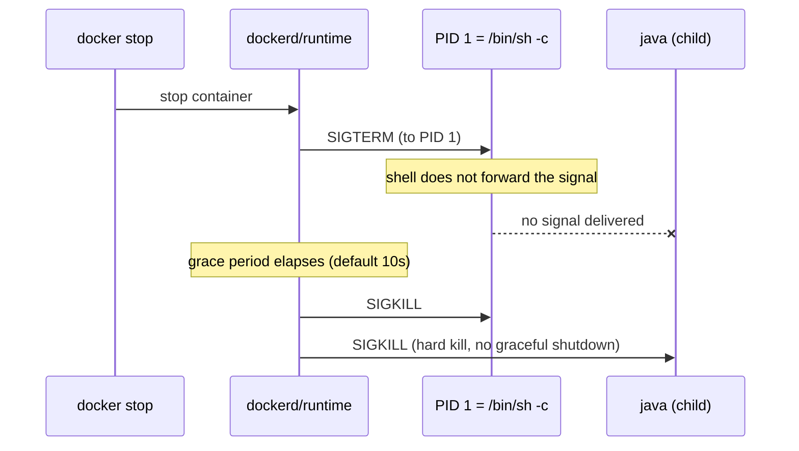
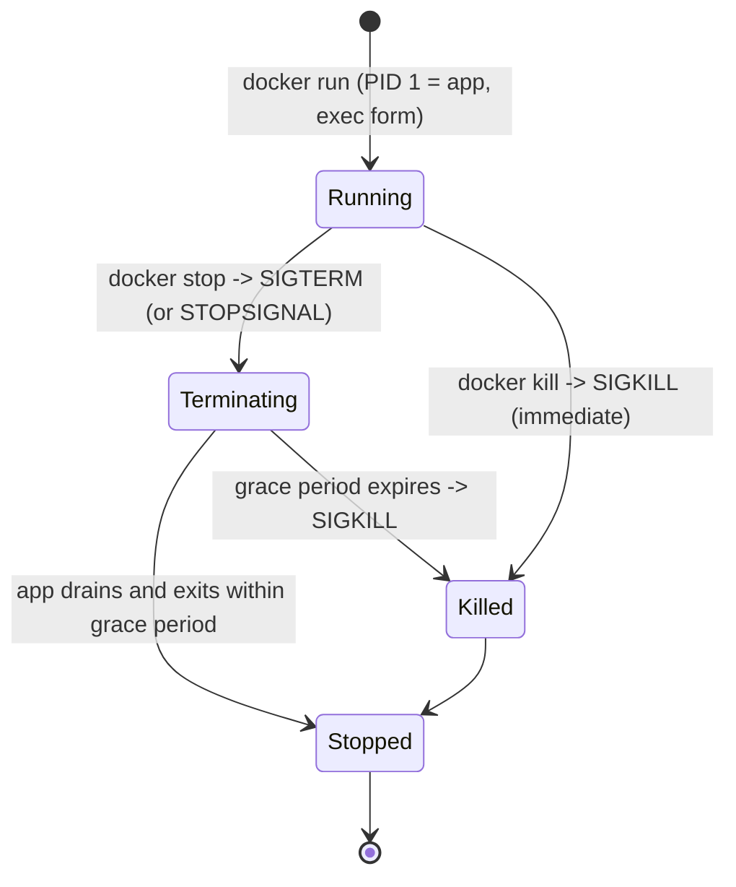

# ENTRYPOINT vs CMD & Container Startup

Every container is, at its core, **one process** that the runtime starts inside the
container's namespaces. `CMD` and `ENTRYPOINT` are the two Dockerfile instructions that
decide *what that process is* and *what arguments it gets*. They look similar, they are
constantly confused, and getting them wrong produces the two classic Docker failures:
containers that ignore the args you pass, and containers that take ten seconds to die and
then get `SIGKILL`ed because your app never saw `SIGTERM`.

This note owns the **startup command model**: what `CMD` and `ENTRYPOINT` each mean, how
they combine, the crucial difference between **exec form** and **shell form** (and why that
difference is really a difference about *who is PID 1* and *who receives signals*), how to
override both at `docker run` time, how to write a correct entrypoint script that hands off
PID 1 with `exec "$@"`, and how all of this connects to graceful shutdown (`docker stop` →
`SIGTERM` → grace period → `SIGKILL`).

Sibling topics: image build mechanics and layer caching live in
`dockerfile-layers-build-cache`; the operational side of shutdown, health checks and log
handling lives in `production-healthchecks-logging`; the container process/namespace model
(what PID 1 even means inside a PID namespace) is touched here at the mechanism level but
`operating-systems` (upcoming) owns namespaces/cgroups theory. Kubernetes reuses these
exact concepts — a Pod's `command:` maps to `ENTRYPOINT` and `args:` maps to `CMD` — but
K8s orchestration is a separate domain.

> [!KEY-TAKEAWAY]
> Two rules cover 90% of interview questions. **(1) Roles:** `ENTRYPOINT` is the
> executable that always runs; `CMD` is the *default arguments* (or default command) that
> are easy to override. `docker run <image> <args>` **replaces** `CMD` but **appends to**
> `ENTRYPOINT`. **(2) Forms:** *exec form* `["exe","arg"]` runs your binary directly as
> **PID 1**, so it receives `SIGTERM` and shuts down gracefully; *shell form*
> `exe arg` runs `/bin/sh -c "exe arg"`, so the **shell** is PID 1 and (unless you `exec`)
> your app never gets the signal and gets `SIGKILL`ed after the timeout.

---

## CMD: the default command and arguments

`CMD` sets the **default** command line for a container — what runs when you do
`docker run <image>` with no trailing arguments. Its defining property is that it is
**easily overridden**: any arguments you pass after the image name on `docker run`
*replace* the entire `CMD`.

```dockerfile
FROM alpine
CMD ["echo", "hello"]
```

```console
$ docker run myimg              # prints: hello       (uses CMD)
$ docker run myimg echo world   # prints: world       (CMD replaced entirely)
$ docker run myimg ls /         # runs ls, not echo   (CMD replaced)
```

Key facts:

- **Only the last `CMD` in a Dockerfile takes effect.** Multiple `CMD` lines are not
  additive; earlier ones are ignored.
- `CMD` may be a full command *(with an executable)* — e.g. `CMD ["nginx","-g","daemon off;"]`
  — **or** just arguments when an `ENTRYPOINT` is present (see below).
- A Dockerfile should specify **at least one** of `CMD` or `ENTRYPOINT`. With neither and
  no inherited value, `docker run` errors with "no command specified."
- `CMD` is *documentation-friendly*: `docker inspect` shows it, and users can trivially swap
  it for a debug shell (`docker run -it myimg sh`).

> [!TIP]
> Mental model: `CMD` = "the default thing, please override me freely." If you want users
> to be able to run `docker run myimg <any-command>` and have it just work, use `CMD` alone
> (no `ENTRYPOINT`) — that is exactly how base images like `ubuntu` (`CMD ["bash"]`) behave.

## ENTRYPOINT: the container's fixed executable

`ENTRYPOINT` configures the container to run as **a specific executable**. Unlike `CMD`,
arguments you pass to `docker run` are **appended** to the `ENTRYPOINT` rather than
replacing it — so the entrypoint binary always runs.

```dockerfile
FROM alpine
ENTRYPOINT ["echo", "hello"]
```

```console
$ docker run myimg              # prints: hello
$ docker run myimg world        # prints: hello world   (appended, not replaced!)
$ docker run myimg echo bye     # prints: hello echo bye (still runs echo hello ...)
```

Key facts:

- **Only the last `ENTRYPOINT` takes effect** (same as `CMD`).
- Use `ENTRYPOINT` when the container *is* a tool/executable — e.g. an image that wraps
  `curl`, `ffmpeg`, or your service binary — and you want the trailing `docker run` args to
  be *parameters to that tool*, not a way to replace it.
- Setting `ENTRYPOINT` in a stage **resets any inherited `CMD` to empty**. If your base
  image supplied a `CMD` and you add an `ENTRYPOINT`, you must redefine `CMD` if you still
  want default args.
- To override `ENTRYPOINT` at runtime you need the explicit `--entrypoint` flag; trailing
  args alone can't do it (covered below).

> [!INTERVIEW]
> "What's the difference between `CMD` and `ENTRYPOINT`?" The crisp answer: both define the
> startup process, but **`docker run` args replace `CMD` and are appended to `ENTRYPOINT`**.
> So `CMD` is for *defaults you expect to be overridden*; `ENTRYPOINT` is for the *fixed
> executable* whose parameters come from `CMD` (defaults) plus `docker run` (per-run args).

## ENTRYPOINT and CMD combined: binary + default args

The idiomatic, production-grade pattern uses **both**: `ENTRYPOINT` names the binary,
`CMD` supplies **default arguments** that are appended to it — and those defaults are
easy to override per run.

```dockerfile
FROM nginx:1.27-alpine
# ENTRYPOINT = the fixed executable; CMD = default args, overridable
ENTRYPOINT ["nginx"]
CMD ["-g", "daemon off;"]
```

```console
$ docker run myimg               # runs: nginx -g "daemon off;"   (ENTRYPOINT + CMD)
$ docker run myimg -t            # runs: nginx -t                 (CMD replaced by -t)
$ docker run myimg -v            # runs: nginx -v
```

How resolution works: the effective command is **`ENTRYPOINT` elements followed by either
the `docker run` args (if any) or the `CMD` args (if none given)**. `CMD` here provides
*defaults for the entrypoint* and gets swapped out the moment the user supplies their own
trailing args, while `nginx` always runs.

> [!WARNING]
> When you combine them, **use exec (JSON-array) form for both**. If `CMD` is in shell
> form, it gets wrapped as `/bin/sh -c "..."` and passed to the entrypoint as those literal
> tokens, so the entrypoint receives a shell invocation rather than clean parameters — the
> args arrive mangled. Mixing forms is a top source of "why are my arguments wrong" bugs.



## Exec form vs shell form

Both `CMD` and `ENTRYPOINT` accept two syntaxes, and the choice is the single most
consequential decision in this topic.

| | Exec form | Shell form |
|---|---|---|
| Syntax | `["exe", "arg1", "arg2"]` (JSON array) | `exe arg1 arg2` (bare string) |
| How it runs | Executes the binary **directly** (no shell) | Wrapped: `/bin/sh -c "exe arg1 arg2"` |
| PID 1 | **Your binary** is PID 1 | **`/bin/sh`** is PID 1; your app is a child |
| Signals (`SIGTERM`) | Delivered to your app | Delivered to the shell (often *not* forwarded) |
| Shell features (`$VAR`, `|`, `&&`, globbing) | **No** — args are literal | **Yes** — full shell processing |
| Preferred for | `ENTRYPOINT`, long-running services | quick commands needing shell features |

```dockerfile
# EXEC form: java is PID 1, receives SIGTERM, shuts down gracefully
ENTRYPOINT ["java", "-jar", "/app.jar"]

# SHELL form: /bin/sh is PID 1; java is a child that may never see SIGTERM
ENTRYPOINT java -jar /app.jar
```

The JSON array must use **double quotes** (it is parsed as JSON). A common gotcha:
`CMD ['echo','hi']` (single quotes) is **not valid JSON**, so Docker falls back to
**shell form** and runs `/bin/sh -c "['echo','hi']"` — usually not what you intended.

> [!KEY-TAKEAWAY]
> Default to **exec form** for `ENTRYPOINT` and `CMD`. Reach for shell form only when you
> genuinely need shell behavior (variable expansion, pipes, `&&`) — and even then, prefer an
> entrypoint script that ends in `exec` so PID 1 is still your app.

## The PID 1 / SIGTERM problem with shell form

This is *the* classic senior-level gotcha. When you write `ENTRYPOINT java -jar app.jar`
(shell form), the container's PID 1 is `/bin/sh -c "java -jar app.jar"`, and `java` runs as
a **child** process. The problem:

1. `docker stop` sends `SIGTERM` to **PID 1** (the shell).
2. `/bin/sh` does **not forward** signals to its children by default.
3. Your app never receives `SIGTERM`, so it doesn't start graceful shutdown (drain
   connections, flush, close DB pools).
4. After the grace period (default **10s** on Linux) Docker sends `SIGKILL` — a hard kill.
   Result: dropped requests, corrupted state, and a 10-second delay on every stop/deploy.



**Fixes**, in order of preference:

1. **Use exec form** so your app is PID 1: `ENTRYPOINT ["java","-jar","/app.jar"]`. Now
   `SIGTERM` goes straight to `java`.
2. If you *must* use shell form, prefix with `exec`: `ENTRYPOINT exec java -jar /app.jar`.
   `exec` replaces the shell process image with `java`, so `java` **becomes** PID 1.
3. In an entrypoint script, end with `exec "$@"` (see below) so the final program takes over
   PID 1 and receives signals.

> [!WARNING]
> Even with exec form, PID 1 has special kernel semantics: the default signal dispositions
> for `SIGTERM`/`SIGINT` are **not** applied to PID 1 unless the process installs its own
> handler. A process that relies on the *default* action to terminate may ignore `SIGTERM`
> as PID 1. Apps with real signal handlers (most servers/JVMs/Node) are fine; for others,
> use an init (`docker run --init`, or tini) — see graceful shutdown below.

## Overriding CMD and ENTRYPOINT at runtime

Both can be overridden without rebuilding the image:

- **Override `CMD`:** just pass args after the image name.
  `docker run myimg <new command/args>` — replaces `CMD` (but keeps any `ENTRYPOINT`, since
  args are appended to it).
- **Override `ENTRYPOINT`:** use the explicit `--entrypoint` flag.
  `docker run --entrypoint <exe> myimg <args>`.

```console
# Image has ENTRYPOINT ["python","/app.py"], CMD ["--port","8080"]
$ docker run myimg                       # python /app.py --port 8080
$ docker run myimg --port 9000           # python /app.py --port 9000   (CMD overridden)
$ docker run --entrypoint sh myimg       # sh                            (ENTRYPOINT overridden, CMD dropped)
$ docker run --entrypoint sh myimg -c 'echo hi'   # sh -c 'echo hi'
```

Important details:

- `--entrypoint` **can only set the binary to exec** — it does *not* use `sh -c`. It takes a
  single executable; further tokens after the image are appended as args (they become the
  new `CMD`).
- Overriding `--entrypoint` typically **resets `CMD`**; supply the args you want after the
  image name.
- `--entrypoint sh` (or `bash`) is the standard way to "get a shell into an image whose
  entrypoint is an app" for debugging.
- In **Compose**, `entrypoint:` and `command:` keys map to `ENTRYPOINT` and `CMD`
  respectively; in **Kubernetes**, `command:` overrides `ENTRYPOINT` and `args:` overrides
  `CMD` (note the naming inversion — a frequent source of confusion).

## Entrypoint scripts and exec "$@"

Real images often need setup before the main process starts (render a config from env vars,
run DB migrations, fix file permissions, `chown` a volume, drop privileges). The pattern is
an **entrypoint script** referenced by `ENTRYPOINT`, with `CMD` providing the actual app
command as its arguments:

```dockerfile
COPY docker-entrypoint.sh /usr/local/bin/
ENTRYPOINT ["docker-entrypoint.sh"]
CMD ["nginx", "-g", "daemon off;"]
```

```bash
#!/bin/sh
set -e

# --- one-time setup runs here ---
envsubst < /etc/app/config.tpl > /etc/app/config.conf
: "${APP_MODE:=production}"

# hand off to the CMD (or docker run args) AS PID 1
exec "$@"
```

Why each piece matters:

- **`"$@"`** expands to the container's *arguments* — i.e. the `CMD` (`nginx -g "daemon off;"`)
  or whatever the user passed to `docker run`. So the script is generic: it sets up, then
  runs whatever command it was given.
- **`exec`** replaces the shell process with the target program, so the app **inherits PID
  1** and receives `SIGTERM` directly — graceful shutdown works. Without `exec`, the script
  stays PID 1, the app is a child, and you reintroduce the SIGTERM problem.
- The quoting **`"$@"`** (with double quotes) preserves argument boundaries — args with
  spaces stay intact. Bare `$@` or `$*` mangles them.
- This is exactly how official images (e.g. `postgres`, `nginx`, `mysql`) are built — their
  `docker-entrypoint.sh` does init then `exec "$@"`.

> [!TIP]
> To let the entrypoint *also* accept a bare app-flag as a shortcut, official images use
> the idiom `if [ "${1#-}" != "$1" ]; then set -- postgres "$@"; fi` — if the first arg
> starts with `-`, prepend the real binary. Then `exec "$@"` runs it.

## Shell-form variable expansion and shell features

Exec form does **no** shell processing: environment variables, `$()`, pipes, `&&`, `;`, and
glob expansion are all treated as literal strings.

```dockerfile
ENV PORT=8080
# WRONG (exec form): the app literally sees the string "$PORT", not 8080
ENTRYPOINT ["node", "server.js", "--port", "$PORT"]

# Shell form DOES expand it (shell is PID 1 though):
ENTRYPOINT node server.js --port $PORT
```

Ways to get variable expansion *and* keep the app as PID 1:

- **Use `exec` in shell form:** `ENTRYPOINT exec node server.js --port $PORT` — shell
  expands `$PORT`, then `exec` makes `node` PID 1.
- **Exec form calling the shell explicitly:**
  `ENTRYPOINT ["sh","-c","exec node server.js --port $PORT"]` — clean and portable.
- **Read the env var inside the app** (best): `process.env.PORT`, `System.getenv("PORT")`.
  The container passes env through regardless of form; let the app read it.

> [!WARNING]
> Note the subtlety: `ENV` variables *are* substituted in the **Dockerfile instruction
> text itself** during build for most instructions, but at *runtime* an exec-form
> `ENTRYPOINT`/`CMD` does not run a shell, so runtime-set env (via `docker run -e`) is
> never expanded in the arg strings. If you set `PORT` with `docker run -e PORT=9000`, only
> a shell (or the app) can turn `$PORT` into `9000`.

## Graceful shutdown: docker stop, STOPSIGNAL, and init/tini

Putting startup and shutdown together — the full lifecycle an interviewer probes:

- **`docker stop`** sends **`SIGTERM`** to PID 1, waits a grace period (default **10s** on
  Linux, 30s on Windows), then sends **`SIGKILL`**. `docker stop -t 30` changes the timeout;
  `-t -1` waits indefinitely. **`docker kill`** sends `SIGKILL` immediately (by default).
- **`STOPSIGNAL`** (Dockerfile) or `--stop-signal` (run) changes *which* signal `docker
  stop` sends — e.g. `STOPSIGNAL SIGQUIT` (nginx does fast shutdown on `SIGQUIT`). The image's
  `StopSignal` is stored in its config; `docker stop -s <sig>` overrides per invocation.
- **App responsibility:** to shut down gracefully the app must (a) be PID 1 or a child that
  actually gets the signal, and (b) install a `SIGTERM` handler that drains and exits within
  the grace window — otherwise it's `SIGKILL`ed.
- **`docker run --init`** injects a tiny init process (**tini**) as PID 1 that forwards
  signals to your app and **reaps zombie** (orphaned) child processes. Useful when your app
  isn't a well-behaved init — e.g. it spawns children but doesn't reap them, or it's a shell
  script. `ENTRYPOINT ["tini","--","myapp"]` bakes the same behavior into the image.



> [!INTERVIEW]
> "My container takes 10 seconds to stop and drops connections on deploy — why?" Almost
> always: **shell-form ENTRYPOINT** (app isn't PID 1 / never sees `SIGTERM`), or the app
> has no `SIGTERM` handler. Fix: switch to exec form (or `exec "$@"` in the entrypoint
> script), add a graceful-shutdown handler, and consider `--init`/tini for zombie reaping.

## Reference: the ENTRYPOINT × CMD interaction table

The exact final command Docker runs, for every combination (from the official docs). Read
`exec_entry`/`exec_cmd` as the executables and `p1_*` as their params:

| | **No ENTRYPOINT** | **ENTRYPOINT `exec_entry p1_entry` (shell)** | **ENTRYPOINT `["exec_entry","p1_entry"]` (exec)** |
|---|---|---|---|
| **No CMD** | error, not allowed | `/bin/sh -c exec_entry p1_entry` | `exec_entry p1_entry` |
| **CMD `["exec_cmd","p1_cmd"]` (exec)** | `exec_cmd p1_cmd` | `/bin/sh -c exec_entry p1_entry` | `exec_entry p1_entry exec_cmd p1_cmd` |
| **CMD `exec_cmd p1_cmd` (shell)** | `/bin/sh -c exec_cmd p1_cmd` | `/bin/sh -c exec_entry p1_entry` | `exec_entry p1_entry /bin/sh -c exec_cmd p1_cmd` |

Things the table makes obvious:

- A **shell-form `ENTRYPOINT` ignores `CMD` entirely** and ignores `docker run` args — the
  middle column is identical down every row. This is a common trap: your `CMD` defaults
  silently do nothing.
- With **exec-form `ENTRYPOINT` + exec-form `CMD`**, the `CMD` is cleanly appended
  (`exec_entry p1_entry exec_cmd p1_cmd`) — the recommended combo.
- With **exec-form `ENTRYPOINT` + shell-form `CMD`**, you get a stray `/bin/sh -c` in the
  middle of your arguments — the mixed-form mangling bug.
- With **no `ENTRYPOINT`**, `CMD` behaves exactly like the two forms suggest (direct exec vs
  `/bin/sh -c`).

## Common follow-up questions

- **"What's the difference between CMD and ENTRYPOINT in one sentence?"** `docker run` args
  *replace* `CMD` but are *appended to* `ENTRYPOINT`; so `CMD` is overridable defaults and
  `ENTRYPOINT` is the fixed executable.
- **"Why does my app take 10 seconds to stop?"** Shell-form `ENTRYPOINT` (or a script that
  doesn't `exec`) means your app isn't PID 1 and never gets `SIGTERM`; it's `SIGKILL`ed after
  the grace period. Use exec form / `exec "$@"`.
- **"What does `exec "$@"` do in an entrypoint script?"** `"$@"` is the container's args
  (the `CMD` or `docker run` args); `exec` replaces the shell with that program so it
  becomes PID 1 and receives signals.
- **"How do I override the entrypoint to debug?"** `docker run --entrypoint sh -it myimg`.
- **"Does `$VAR` get expanded in `ENTRYPOINT ["app","--x","$VAR"]`?"** No — exec form runs no
  shell. Use `sh -c`, shell form with `exec`, or read the env var in the app.
- **"When would you use CMD with no ENTRYPOINT?"** For general-purpose images where users
  should be able to fully replace the command (base images, tool images run ad hoc).
- **"What's `--init` / tini for?"** A minimal PID 1 that forwards signals and reaps zombie
  processes when your main app doesn't do proper init duties.
- **"Multiple CMD/ENTRYPOINT lines?"** Only the last of each takes effect.

## References

- Docker docs — Dockerfile reference: `CMD` and `ENTRYPOINT` (including the interaction
  table and shell/exec form rules): https://docs.docker.com/reference/dockerfile/
- Docker docs — Best practices for writing Dockerfiles (ENTRYPOINT patterns, `exec`,
  entrypoint scripts): https://docs.docker.com/build/building/best-practices/
- Docker docs — `docker stop` / `docker kill` (SIGTERM, grace period, STOPSIGNAL):
  https://docs.docker.com/reference/cli/docker/container/stop/
- Docker docs — `docker run --init` and tini (signal forwarding, zombie reaping):
  https://docs.docker.com/reference/cli/docker/container/run/
- tini — a tiny but valid init for containers: https://github.com/krallin/tini
- Compose spec — `entrypoint` and `command`: https://docs.docker.com/reference/compose-file/services/
