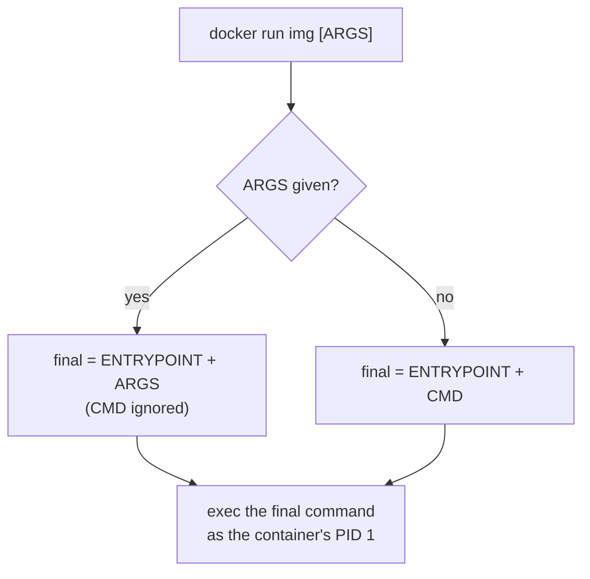
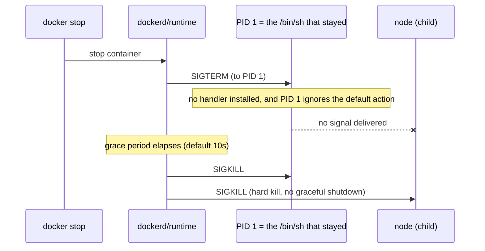
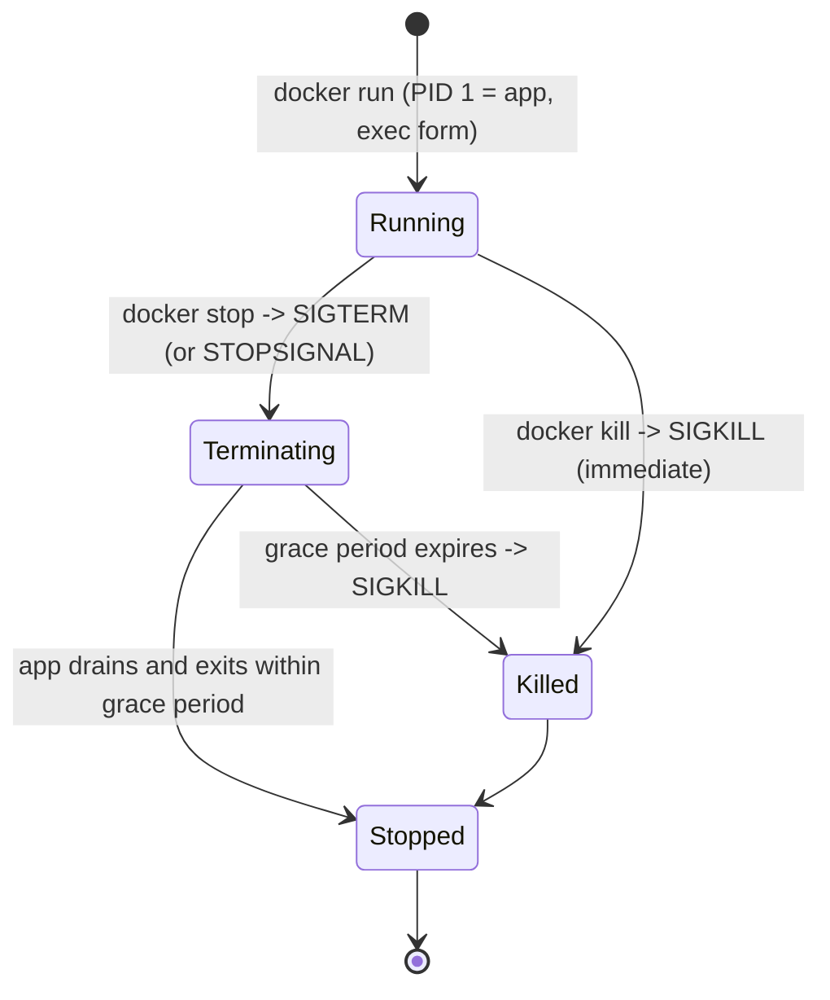

# ENTRYPOINT vs CMD & Container Startup

Topic 3 left two Dockerfiles for the same Node API, differing only in the last line:
`CMD ["node", "server.js"]` against `CMD npm start`. Which process each one makes PID 1 was the
open question. [The PID 1 / SIGTERM problem with shell
form](#the-pid-1--sigterm-problem-with-shell-form) settles it. The first line puts `node` at
PID 1. The second puts `npm` there, with your `server.js` running underneath it as a child.

That is not a tidy detail. `docker stop` sends one signal to one process, and that process is
whichever one ended up at PID 1. Whether your app ever hears about it depends on what is
standing in front of it: a shell, an `npm`, a script. It depends, too, on whether that thing
passes signals down. When nothing does, the container sits there for ten seconds and then dies by
`SIGKILL`, with in-flight requests still open. Two Dockerfiles that differ by one pair of
brackets can differ by that much. `CMD` and `ENTRYPOINT` are the instructions
that decide which process a container starts and which arguments it gets, and the spelling
you use decides which process receives the signal asking it to stop. So which process does
your container actually run, and what does that one line's spelling cost you?

> [!TIP]
> **Reading map.** About 45 minutes. The first three sections are the argument-passing
> rules and go quickly. The weight sits in [Exec form vs shell
> form](#exec-form-vs-shell-form) and [The PID 1 / SIGTERM problem with shell
> form](#the-pid-1--sigterm-problem-with-shell-form). If you already write
> `ENTRYPOINT ["..."]` by habit and can say why, start at [Entrypoint scripts and exec
> "$@"](#entrypoint-scripts-and-exec-). The last section is a lookup table rather than a
> read.

> [!KEY-TAKEAWAY]
> Two questions decide everything here. Which instruction: `docker run <image> <args>`
> replaces `CMD` and appends to `ENTRYPOINT`, so `CMD` holds defaults you expect callers to
> swap, and `ENTRYPOINT` is the executable that always runs. Which spelling: `["exe","arg"]`
> runs `exe` directly, while `exe arg` hands the whole string to `/bin/sh -c`, which can
> leave a shell sitting between the runtime and your process. A shell that is still there
> when `SIGTERM` arrives does not pass it on.

---

## CMD: the default command and arguments

`CMD ["node", "server.js"]` is the last line of the Node API image, and it is a suggestion
rather than a guarantee: `docker run api ls /` runs `ls /` and never starts Node at all.
Overridability is the defining property of `CMD`. Whatever the image author put there is the
command line used when the caller supplies none. Any arguments typed after the image name on
`docker run` replace it whole: not the first token, not the flags, the entire list.

```dockerfile
FROM alpine
CMD ["echo", "hello"]
```

```console
$ docker run myimg              # prints: hello       (uses CMD)
$ docker run myimg echo world   # prints: world       (CMD replaced entirely)
$ docker run myimg ls /         # runs ls, not echo   (CMD replaced)
```

The third line is where the intuition usually breaks. `ls /` did not become an argument to
`echo`; it became the whole command. The runtime never merges your words with the author's. It
chooses between two lists, and yours wins.

Three consequences follow, and each shows up as a bug report at some point.

- Only the last `CMD` in a Dockerfile takes effect. Multiple `CMD` lines do not accumulate;
  the earlier ones are dead text, which is why a `CMD` added halfway down a long Dockerfile
  can appear to do nothing.
- `CMD` may carry a full command line, as in `CMD ["nginx","-g","daemon off;"]`, or carry
  arguments only, which is the shape it takes once an `ENTRYPOINT` is present.
- A Dockerfile should set at least one of `CMD` or `ENTRYPOINT`. With neither of them, and
  nothing inherited from the base image, there is no command line to run and `docker run`
  errors with "no command specified."

### What it costs: a command anyone can replace

`docker run -it myimg sh` works on the Node API image, drops you at a shell, and never runs
`server.js`. Nothing is broken there; `CMD` is behaving exactly as specified, and the
behaviour is the price of the convenience. An image whose startup command lives only in `CMD`
cannot insist on what runs inside it.

Sometimes that is precisely the design you want. A general-purpose base image like `ubuntu`
ships a `CMD` that starts a shell and no `ENTRYPOINT` at all, so `docker run ubuntu <any
command>` just works and needs no flags. Read the recorded value back with
`docker inspect -f '{{json .Config.Cmd}}' ubuntu`, and do the same on your own images. The
value lives in the image config, so `docker inspect` tells you what a container will do before
you start one. Tool images are built the same way for the same reason.

The cost lands when the image is a service rather than a toolbox. A stray argument can
replace the flags your Node API needs to be correct, and `CMD` gives you no way to say that
`node` itself is not optional.

## ENTRYPOINT: the container's fixed executable

`ENTRYPOINT ["echo", "hello"]` makes the container behave as one fixed program, so
`docker run myimg world` prints `hello world` instead of printing `world`. The caller's
argument was appended to the entrypoint rather than swapped in for it. That one word,
appended, is the entire difference from `CMD`.

```dockerfile
FROM alpine
ENTRYPOINT ["echo", "hello"]
```

```console
$ docker run myimg              # prints: hello
$ docker run myimg world        # prints: hello world   (appended, not replaced!)
$ docker run myimg echo bye     # prints: hello echo bye (still runs echo hello ...)
```

The third line is the one worth sitting with. You typed something that looks like a command,
`echo bye`, and the runtime handed it to the existing `echo` as two more words to print.
No inspection of your input happens. The final command line is assembled by concatenation,
and an `ENTRYPOINT` is a promise the image makes about its first element.

A promise about the first element is exactly what you want when the container *is* a tool. An
image that wraps `curl`, `ffmpeg`, or your own service binary can set `ENTRYPOINT ["curl"]`.
Then `docker run curlimg -sS https://example.com` reads as a `curl` invocation with the
container part as noise. Callers cannot accidentally run something else, and they do not have to
remember the binary's name or path. As with `CMD`, only the last `ENTRYPOINT` in a Dockerfile
takes effect, so a second one silently replaces the first rather than chaining onto it.

The flip side of the promise is that trailing arguments can no longer remove the entrypoint,
which means overriding it at all needs an explicit `--entrypoint` flag on `docker run`.
[Overriding CMD and ENTRYPOINT at runtime](#overriding-cmd-and-entrypoint-at-runtime) works
through what that flag does and does not do. The whole distinction compresses to one line:
`docker run` args replace `CMD` and append to `ENTRYPOINT`, so `CMD` is the overridable
default and `ENTRYPOINT` is the fixed executable whose parameters come from `CMD` plus
whatever the caller adds.

### Where it breaks: the CMD your base image used to have

Adding `ENTRYPOINT` to a stage resets any `CMD` inherited from the base image to empty. The
Docker reference states this directly. If `CMD` is defined in the base image, setting
`ENTRYPOINT` resets `CMD` to an empty value. `CMD` must then be defined again in the current
image to have a value. So this Dockerfile runs `nginx` with no arguments at all, even though
`nginx:1.27-alpine` arrives with a perfectly good `CMD` of its own:

```dockerfile
FROM nginx:1.27-alpine
ENTRYPOINT ["nginx"]
# no CMD here -> the base image's CMD is gone, not inherited
```

The reference states the behaviour and gives no reason for it, so do not invent one. What you
can say is what would go wrong without it. The two instructions end up as a single command
line, which means an inherited `CMD` would be read as arguments to whichever program
`ENTRYPOINT` names. Name a different program and there is no reason those words still fit it.
Docker drops them instead of guessing. The consequence for you is mechanical: any time you
introduce an `ENTRYPOINT`, write the `CMD` you want next to it in the same file.

Pairing them is not a workaround for the reset; it is how `nginx`, `postgres` and `mysql` are
all built. What the pairing still needs is a rule for which list a caller's arguments displace.

## ENTRYPOINT and CMD combined: binary + default args

Splitting a command line across both instructions buys you a fixed binary and swappable
flags at the same time: `nginx` always runs, and `-g "daemon off;"` is only the default.

```dockerfile
FROM nginx:1.27-alpine
# ENTRYPOINT = the fixed executable; CMD = default args, overridable
ENTRYPOINT ["nginx"]
CMD ["-g", "daemon off;"]
```

```console
$ docker run myimg               # runs: nginx -g "daemon off;"   (ENTRYPOINT + CMD)
$ docker run myimg -t            # runs: nginx -t                 (CMD replaced by -t)
$ docker run myimg -v            # runs: nginx -v
```

The `-t` line shows the split earning its keep. `nginx -t` checks the config file and exits,
which is a completely different job from serving traffic, and the caller reached it by typing
two characters. They could not have reached it if `nginx -g "daemon off;"` had been one
`CMD`. Their `-t` would have replaced `nginx` as well, and the container would have tried to
run a program called `-t`.

The assembly rule is one sentence. Take the `ENTRYPOINT` elements, then append either the
`docker run` arguments if the caller gave any, or the `CMD` elements if they gave none. The
two argument sources are alternatives and never both, so the moment a caller types one
trailing argument every `CMD` element is out of the picture, including the ones they did not
mean to displace. A caller who types `-t` gets `nginx -t`, not `nginx -g "daemon off;" -t`.



### Where it breaks: one instruction in brackets and the other not

Write the `CMD` above without its brackets and the container stops working, in a way the
error message will not explain:

```dockerfile
ENTRYPOINT ["nginx"]
CMD -g "daemon off;"
```

The bracketless `CMD` gets wrapped in `/bin/sh -c` before it is ever combined with the
entrypoint, and the wrapping is not undone at assembly time. So the container runs `nginx`, and
the three elements the wrapping produced are handed to it as arguments. This is the argument
vector `nginx` actually receives:

```
argv[0] = nginx
argv[1] = /bin/sh
argv[2] = -c
argv[3] = -g "daemon off;"
```

Four elements, not five. Shell form records your whole string as a single argument, space and
quotes included, and the quotes are still there precisely because no shell ever ran to remove
them. `/bin/sh` is sitting in `argv[1]` as a literal string too, because `ENTRYPOINT` supplied
the first element and `nginx` is what got executed. `nginx` reads `argv[1]` and finds a
filesystem path where it expected a flag. The three tokens the wrapping added stopped being a
shell invocation the moment something else took the front of the list.

The vector is what makes "use the same form for both" more than folklore. Wrapping happens per
instruction and combining happens afterwards, so a wrapped `CMD` arrives as data rather than as
a command, and no error message will mention brackets. What that wrapping
actually is, and what it costs you at runtime, is the next section.

## Exec form vs shell form

`CMD ["node", "server.js"]` and `CMD node server.js` build containers that start the same
program and behave differently when you stop them, and the only difference on the page is a
pair of brackets. Both `CMD` and `ENTRYPOINT` accept those two spellings.

The bracketed spelling is parsed as a JSON array, and the runtime executes exactly that list:
first element is the program, the rest are its arguments, and nothing scans the strings
looking for shell syntax. Call it **exec form** — the JSON-array spelling of `CMD` or
`ENTRYPOINT`, which runs your binary directly with no shell in between.

The bare spelling is one string, and the builder stores it wrapped: `/bin/sh -c "<your
string>"`. What the runtime executes is therefore a shell, and the shell is what reads your
string and decides what to run. Call it **shell form** — the plain-string spelling, which the
builder wraps in `/bin/sh -c`, putting a shell in front of your process.

| | Exec form | Shell form |
|---|---|---|
| Syntax | `["exe", "arg1", "arg2"]` (JSON array) | `exe arg1 arg2` (bare string) |
| How it runs | Executes the binary directly, with no shell | Wrapped: `/bin/sh -c "exe arg1 arg2"` |
| PID 1 | your binary is PID 1 | `/bin/sh` may stay as PID 1 with your app as a child, and [that is not your call](#where-it-breaks-the-shell-that-steps-out-of-the-way) |
| Signals (`SIGTERM`) | Delivered to your app | Delivered to PID 1, and a shell that stayed does not forward it |
| Shell features (`$VAR`, `\|`, `&&`, globbing) | none — args are literal | full shell processing |
| Preferred for | `ENTRYPOINT`, long-running services | quick commands needing shell features |

```dockerfile
# EXEC form: java is PID 1, receives SIGTERM, shuts down gracefully
ENTRYPOINT ["java", "-jar", "/app.jar"]

# SHELL form: /bin/sh -c runs the string, and which process is left at PID 1
# is the shell's decision rather than yours -- the next section explains why
ENTRYPOINT java -jar /app.jar

# SHELL form the shell cannot opt out of: /bin/sh stays as PID 1, and java is
# a child that never sees SIGTERM
ENTRYPOINT java -jar /app.jar | tee -a /var/log/app.log
```

The array really is JSON, which means double quotes and nothing else. `CMD ['echo','hi']`
with single quotes is not valid JSON, so the builder cannot read it as a list and falls back
to treating the whole thing as a string. You get `/bin/sh -c "['echo','hi']"`, and the shell
tries to run a program whose name begins with an open bracket. The failure is not a parse
error at build time; it is a strange runtime error much later.

You are not stuck with `/bin/sh` as the wrapper. The `SHELL` instruction replaces it for every
shell-form instruction that follows in the same build stage, and the instructions the reference
names as affected are `RUN`, `CMD` and `ENTRYPOINT`. The scope is the stage rather than the
file, so a later `FROM` starts again from that base image's shell. Its default on Linux is
`["/bin/sh", "-c"]`, which is where the `/bin/sh -c` in every example above comes from. Write
`SHELL ["/bin/bash", "-c"]` and the rest of the file's shell-form instructions are wrapped in
bash instead, so bash-only syntax such as `[[ ... ]]` and `set -o pipefail` starts working in
them. The instruction changes the wrapper, not the fact of being wrapped.

### Where it breaks: the shell that steps out of the way

`sh -c 'sleep 30'` does not leave a shell behind. Launch it and look at the process table: the
PID you started *is* `sleep 30`, with no shell above it and no child below it. Three shells
behave this way: dash, the `/bin/sh` on Debian-family images; busybox `ash`, the `/bin/sh` in
Alpine; and bash. Each of them calls `exec` on the command instead of forking a child and
waiting for it. The shell's process image is replaced by yours, so your binary inherits the
shell's PID, and inside a fresh container that PID is 1.

The optimisation has a condition, and the condition follows from what `exec` costs. Replacing
your own process image destroys the code that would have run anything afterwards. So the only
command a shell can step aside for is one it has nothing left to do after — in practice, the
last command in your string.

That makes the outcome hard to predict rather than simply bad, and the cases split three ways.

`./migrate.sh && node server.js` puts node last, so node is a candidate for the handover.
Whether it gets one depends on which `/bin/sh` your base image ships. The dash and busybox
`ash` shells do exec the last command of an `&&` or a `;`. Under those two, node ends up at
PID 1 and there is no shell left to swallow the signal. The bash shell forked for it until
version 5, which added the same optimisation. And while `migrate.sh` is still running, the shell is holding
PID 1 either way, because it has the second command still to come. A `docker stop` during the
migration hits the shell rather than anything of yours.

`node server.js | tee -a /var/log/app.log` never hands over at all. The stages of a pipeline run
at the same time, with a pipe between them, so the shell forks every one of them. Both node and
`tee` are children, and the shell stays as PID 1 for the life of the container. The same holds
for any `trap` the string installs, because the shell has to survive to run the handler, and for
any command you write *after* your app.

`node server.js &` fails in the other direction. The shell starts the job in the background,
has nothing left to wait for, and exits. PID 1 exiting is how a container ends, so everything
still running inside is killed and the container is reported as stopped, seconds after you
started it.

So the hazard is not bad luck. The strings that make shell form worth choosing are the strings
whose outcome you cannot read off the page: nobody needs a shell to run `node server.js`, and
the brackets would have cost them nothing there.

Which is why you should not build a design on the optimisation. It is real, and you can read it
in dash's `eval.c` and busybox's `ash.c`, but no shell documents it as a guarantee and none of
them promises to keep it. Treat it as the reason your colleague's shell-form container seemed
fine, not as a licence for yours. What you can do is look: `docker top <container>` prints the
container's process table, and a first row reading `/bin/sh -c ...` instead of your binary
means the shell stayed.

> [!KEY-TAKEAWAY]
> Default to exec form for both `ENTRYPOINT` and `CMD`. Reach for shell form only when you
> genuinely need the shell to do something: variable expansion, a pipe, an `&&`. And when you
> do, put the work in a script that ends by handing your program the shell's own process, so
> the shell is gone before the container is doing real work.

Whatever the shell decides, shell form throws away your `CMD` and your `docker run` arguments.
Whether the stop signal reaches your app is the half that hangs on the decision — and the
decision is not yours.

## The PID 1 / SIGTERM problem with shell form

`CMD npm start` on the Node API gives you a container whose PID 1 is `npm`, with your
`server.js` process running underneath it as a child. `npm start` is a single command, so the
shell execs it and steps aside, and npm is what it leaves behind. You did not choose npm as
your init, and neither did anyone who reviewed the Dockerfile. `CMD ["node", "server.js"]`
gives you a container whose PID 1 is node, with nothing above it.

Whether the `npm start` version costs you anything depends on npm itself. Since npm 7 it forwards
`SIGTERM` to the process running your script, so on a current image the signal does reach node.
Read that carefully: it is a property of your npm version, not of your Dockerfile, and nothing
in the image records that you are relying on it. You have handed PID 1's job to a program you
did not pick for it.

The case where nothing rescues you is a string the shell cannot hand over at all:

```dockerfile
# a pipeline forks both stages, so /bin/sh stays as PID 1 for the container's whole life
CMD node server.js | tee -a /var/log/app.log
```

Now the container holds three processes: `/bin/sh` as PID 1, with `node` and `tee` as its
children. Somebody added the `tee` to keep a copy of the logs, and nothing on that line hints
at what it did to shutdown. The thing that matters is what both examples share. The process at
PID 1 is not your application.

Here is what that costs, step by step, when someone runs `docker stop`.

1. `docker stop` sends `SIGTERM` to PID 1. To that one process — not to every process in the
   container, not to a process group. One signal, one recipient.
2. For your app to get it, PID 1 has to pass it on, and passing signals on is code that
   somebody has to write. A shell invoked with `-c` installs no handler for `SIGTERM`; it is
   waiting on its child, which is all `-c` asked it to do.
3. Nor does the signal kill the shell, which is the part people miss. Linux treats PID 1
   specially: a process running as PID 1 ignores any signal whose disposition is still the
   default action. `SIGTERM`'s default action is to terminate the process, and PID 1 is exempt
   from it. So the shell neither handles the signal nor dies from it. The signal is discarded
   and the shell goes back to waiting.
4. Ten seconds later — the default grace period on Linux — the runtime sends `SIGKILL`.
   `SIGKILL` cannot be caught or ignored, and the PID 1 exemption does not cover a `SIGKILL`
   arriving from outside the container's own PID namespace. That is exactly where the runtime
   sits. Inside the namespace the exemption does still hold, which is why `kill -9 1` from a
   `docker exec` shell achieves nothing. The container's processes all die where they stand,
   your app included, mid-request.

So your app never started draining connections, flushing buffers or closing pool handles,
because from its point of view nothing asked it to. It was running normally and then it was
gone.

Topic 3's third question was why a *correct* image still takes ten seconds to stop, and the
answer is that it does not. Those ten seconds are the runtime waiting, not your app working. A
container whose PID 1 exits 40 milliseconds after `SIGTERM` stops in 40 milliseconds; the
grace period is a deadline, not a schedule. A stop that takes the full ten seconds every
single time is telling you that PID 1 never exited on its own and had to be killed.



Three fixes, in the order you should reach for them:

1. Use exec form so your app is PID 1: `ENTRYPOINT ["node", "server.js"]`. `SIGTERM` now
   arrives at node with nothing in between.
2. If the line has to be shell form, prefix the command with `exec`:
   `ENTRYPOINT exec node server.js --port $PORT`. `exec` replaces the shell's process image
   with node's, so node takes over the shell's PID rather than becoming its child. You are
   asking for the same handover the optimisation sometimes performs for you, except now it is
   written down and it holds for strings the optimisation would have skipped.
3. When the container needs setup before the app starts, put that setup in a script and end
   the script with `exec "$@"`. [Entrypoint scripts and exec
   "$@"](#entrypoint-scripts-and-exec-) builds one.

> [!WARNING]
> "I use exec form, so my app is PID 1 and gets `SIGTERM`" is only two thirds of a working
> setup. Delivery is not the same as effect: PID 1's exemption from default signal actions
> applies to your binary too, so an app with no `SIGTERM` handler is not killed by `SIGTERM`
> when it is PID 1. It carries on running, and the runtime `SIGKILL`s it after the grace
> period anyway. JVMs and servers that install a real handler are fine. Node is the trap here.
> Its built-in handler resets itself and re-raises the signal, and the re-raise meets the
> default action at PID 1, where it is discarded. So a Node app with no
> `process.on('SIGTERM')` listener is the case this warning is about rather than an exception
> to it. Shell scripts, small C utilities and anything you wrote in an afternoon are in the
> same position, and for all of them the fix is an init in front of your app.

Topic 2's rule that a container lasts exactly as long as its PID 1 needs bounding here rather
than contradicting. The rule holds; shell form is what makes it uncomfortable, because the
lifetime the container tracks is now the shell's rather than your application's. Under
`CMD node server.js | tee -a /var/log/app.log`, node can crash, `tee` sees the pipe close and
exits, and the shell exits after it — so the container does stop and topic 2's rule holds. What
`docker inspect` reports is exit 0, though, because the status of a pipeline is the status of
its last stage and `tee` exited cleanly. `set -o pipefail` would repair that, and it is one of
the things `/bin/sh` does not have. And if you put another command
after your app, the shell has work left to do once node dies: the container stays up, healthy
as far as the runtime can tell, serving nothing.

### Where it breaks: the same string swallows CMD and your run args

`ENTRYPOINT nginx -g "daemon off;"` plus `CMD ["-t"]` runs neither `-t` nor anything else you
pass on the command line. The final command is `/bin/sh -c 'nginx -g "daemon off;"'`, and your
`CMD` is not appended to it — it is gone.

The reason is in the recorded shape. Shell form stores the entrypoint as three elements:
`/bin/sh`, `-c`, and your entire string as one argument. Your command and its flags are no
longer a list; they are characters inside a single element. There is nowhere in that
three-element list a caller's extra word could be appended and still mean "another argument to
nginx". Words after the command string in `sh -c` are positional parameters for the shell: the
next one becomes `$0`, then `$1`, then `$2`. Appending them would hand them to the shell rather than to
nginx, and unless your string spells out `$1` or `"$@"`, the shell never looks at them at all.
Docker's answer is to not append them. The reference states it flatly: the shell form of
`ENTRYPOINT` ignores any `CMD` or `docker run` command line arguments.

That single fact is why the middle column of the interaction table below is identical down
every row. A shell-form `ENTRYPOINT` is not a command plus arguments; it is one
opaque string, and there is no seam left in it to append to.

Runtime overrides therefore have a floor, and getting past it means replacing the entrypoint
outright with a flag.

## Overriding CMD and ENTRYPOINT at runtime

`docker run --entrypoint sh -it myimg` drops you at a shell inside an image whose `ENTRYPOINT`
is an application, with no rebuild and no Dockerfile edit. Both instructions are defaults
stored in the image config, and both can be replaced at the point of use. The mechanisms are
completely different, though, and that asymmetry is what people trip over.

Replacing `CMD` needs no flag. Type the command you want after the image name and it takes the
place of the stored `CMD`, exactly as the first section showed. Replacing `ENTRYPOINT` needs
the explicit `--entrypoint` flag, precisely because trailing arguments were defined to append
to the entrypoint rather than displace it.

```console
# Image has ENTRYPOINT ["python","/app.py"], CMD ["--port","8080"]
$ docker run myimg                       # python /app.py --port 8080
$ docker run myimg --port 9000           # python /app.py --port 9000   (CMD overridden)
$ docker run --entrypoint sh myimg       # sh                            (ENTRYPOINT overridden, CMD dropped)
$ docker run --entrypoint sh myimg -c 'echo hi'   # sh -c 'echo hi'
```

The last two lines are the same flag doing the same thing. `--entrypoint` expects a string
holding the name or path of one binary, so `sh` is all it can take. It does not accept a command
line, and it does not run what you give it through `/bin/sh -c`.
`--entrypoint "sh -c 'echo hi'"` fails, because the runtime looks for an executable file whose
name is literally `sh -c 'echo hi'`. Arguments come from where arguments
always come from: the tokens after the image name, which become the container's new `CMD` and
get appended to your new entrypoint. On the last line, `-c` and `echo hi` are that `CMD`, so
the assembled command is `sh -c 'echo hi'`. You have reconstructed the `/bin/sh -c` wrapper by
hand, one piece at a time.

### What it costs: the flag that replaces the binary also erases the defaults

Passing `--entrypoint` clears out any default command set on the image. Not usually, and not for
some images: the docs state it flatly. You can see it on the third line of the console block
above, where the image's `CMD` of `["--port","8080"]` is simply not there any more. The clearing
is what gives you a bare `sh` there rather than `sh --port 8080`, which would have failed
instantly on an argument the shell does not understand.

The price is that a partial override is not on offer. You cannot keep the image's `CMD` and
swap only the binary. Docker does not try to work out which of the old words still make sense in
front of a different program; it drops all of them. Supply whatever the new entrypoint needs
yourself, after the image name. Passing an empty string,
`--entrypoint=""`, removes the entrypoint altogether and leaves the trailing arguments as the
whole command. Reach for that when the entrypoint script itself is the thing you are trying to
bypass.

The same two knobs exist in every orchestrator, under names that do not match. Compose keeps
the Dockerfile vocabulary: `entrypoint:` maps to `ENTRYPOINT` and `command:` maps to `CMD`.
Kubernetes renames both, so a container's `command:` overrides `ENTRYPOINT` and `args:`
overrides `CMD`. Reading a Pod spec with Dockerfile habits therefore inverts the meaning of
`command:`, and the failure is quiet: your entrypoint script never runs, and the app starts
without whatever setup it was doing.

Setup work is the reason most production images have an entrypoint script at all, and the
script has one line that matters.

## Entrypoint scripts and exec "$@"

`postgres`, `nginx` and `mysql` all start the same way: `ENTRYPOINT` names a shell script,
`CMD` names the real program, and the script's last line is `exec "$@"`. The postgres and mysql
scripts run to a few hundred lines each. The shape is what carries the idea, and the script
below has all of it.

The pressure that produces this shape is that plenty of work has to happen after the container
starts and before the app does. A config file has to be rendered from environment variables the
image could not know at build time. A mounted volume arrives owned by root and the app runs as
someone else. Migrations have to run once. None of that belongs in the application's own
startup path, because it is about the container rather than about the program. Put it in a
script, point `ENTRYPOINT` at the script, and leave `CMD` holding the command the script should
finish by running. That pairing is the **entrypoint script** pattern: a wrapper that does the
container's setup and then runs whatever command it was handed. `CMD` is what makes it reusable
rather than hard-wired.

```dockerfile
COPY docker-entrypoint.sh /usr/local/bin/
ENTRYPOINT ["docker-entrypoint.sh"]
CMD ["nginx", "-g", "daemon off;"]
```

```bash
#!/bin/sh
set -e

# --- one-time setup runs here ---
envsubst < /etc/app/config.tpl > /etc/app/config.conf
: "${APP_MODE:=production}"

# hand off to the CMD (or docker run args) AS PID 1
exec "$@"
```

Every working line of that script does something you cannot guess from reading it.

`set -e` makes the shell exit as soon as a command returns a non-zero status, instead of
carrying on to the next line. It applies to commands whose status nothing else is already
testing, so a failure inside an `if` condition or on the left of an `&&` still does not end the
script. Without `set -e`, a failed `envsubst` would be ignored and the app would start against a
config file that is empty or half-written. With it, the script dies, PID
1 dies, and the container exits with a non-zero code that your orchestrator can see.

`envsubst` reads text on standard input and writes it out with `$VAR` references replaced by the
values in the environment, which is how a template becomes a config file at start time. Notice
which way the redirects point: the template goes in and a *different* path comes out. Aim the
output at the template and the shell truncates it before `envsubst` can read a byte. No shell provides it
as a builtin: it comes from GNU gettext, so it is a package your image has to actually contain.
Confirm it with `command -v envsubst` during the build rather than at three in the morning. The
leaner your base image, the less likely it is to be there, which is one of the trade-offs in
`multi-stage-builds-image-optimization`.

`: "${APP_MODE:=production}"` sets a default. `:` is the shell's do-nothing command, and
`${APP_MODE:=production}` assigns `production` to `APP_MODE` when it is unset or empty, so the
line has an effect while running nothing. Written without the `:` it would try to execute
`production` as a program.

`"$@"` expands to the container's arguments — which is to say the `CMD`, here
`nginx -g "daemon off;"`, or whatever the caller typed after the image name instead. The script
never names `nginx` and does not need to, which is exactly what makes it worth writing: the
same script serves the image's default command, a debug invocation, and a one-off
`docker run myimg nginx -t`.

The double quotes on `"$@"` are load-bearing rather than stylistic. Quoted, `$@` expands to one
word per original argument, so `daemon off;` stays a single argument with its space inside it.
Bare `$@` re-splits every argument on whitespace, and `$*` joins them all into one string
first; either way, `nginx` receives `daemon` and `off;` as two separate flags and fails on the
first one.

And `exec` is what makes the whole arrangement safe to stop. Rather than starting `nginx` as a
child and waiting, `exec` replaces the script's process image with nginx's, so nginx continues
under PID 1 and the shell is simply gone. Drop the `exec` and the script stays PID 1 forever,
nginx becomes its child, and you have rebuilt the shell-form problem inside a file you wrote on
purpose.

Official images add one more line to make a flag-only invocation work. The `postgres`
entrypoint checks whether the first argument starts with a dash, and if so puts the real binary
in front of it:

```bash
if [ "${1:0:1}" = '-' ]; then
    set -- postgres "$@"
fi
```

`set --` rewrites the positional parameters, so `"$@"` afterwards is the list with `postgres`
prepended. The effect is that `docker run postgres -c max_connections=200` works: the caller
passed flags, meant them for the server, and never had to repeat the word `postgres`. The
`${1:0:1}` substring syntax is bash-only, so scripts with a `#!/bin/sh` line write
`[ "${1#-}" != "$1" ]` instead. `${1#-}` strips one leading dash if there is one, so a result
that differs from `$1` proves there was one.

### Where it breaks: dropping privileges without exec

The most common way to lose PID 1 in a script you wrote yourself is switching users on the last
line. `su app -c "node server.js"` runs the app as `app`, which is what you wanted, and leaves
the script as PID 1, which is not. `SIGTERM` arrives at a shell script that installed no
handler and is exempt from the default action, so you are back to the ten-second stop and the
`SIGKILL`.

`exec su app -c "node server.js"` fixes the script's half and not necessarily the rest. Now the
question is what `su` itself does. The `su` that `gosu` was written to replace forks a child and
waits for it, so `su` is what stays at PID 1 and node is underneath it again. Whether the `su`
in your particular image behaves that way is not something you can read off the command line.
That is why images that drop privileges reach for `gosu` on Debian bases or `su-exec` on Alpine
instead. Both tools exist to change user and then `exec`, with no process left in the middle.
`exec gosu app node server.js` puts node at PID 1 running as `app`, which is both halves at
once.

Not every app can be reached by exec form, though, because some of them need a shell to compute
their own arguments.

## Shell-form variable expansion and shell features

Exec form hands your program the five characters `$PORT` and lets it work out what to do with
them. There is no shell in the picture to look up the variable, so environment references,
`$(command)` substitution, pipes, `&&`, `;` and glob patterns all arrive as literal text.

```dockerfile
ENV PORT=8080
# WRONG (exec form): the app literally sees the string "$PORT", not 8080
ENTRYPOINT ["node", "server.js", "--port", "$PORT"]

# Shell form DOES expand it. The costs: CMD and your run args are discarded, and
# which process is left at PID 1 is the shell's call rather than yours:
ENTRYPOINT node server.js --port $PORT
```

The failure is quiet, which is what makes it expensive. Nothing checks the value on the way
through. Node hands `--port` and `$PORT` to `server.js` as two more words in `process.argv`, and
your own argument parsing is what eventually chokes on the second one. By then the error message
is about a port number rather than about a Dockerfile. Nothing is wrong with exec form here; it is
doing precisely what it promises, which is to pass your list through untouched.

Three ways out, in increasing order of how much you should like them.

- Prefix the shell-form line with `exec`: `ENTRYPOINT exec node server.js --port $PORT`. The
  shell expands `$PORT`, then `exec` replaces the shell with node, so you get both the
  expansion and node at PID 1.
- Call the shell yourself from exec form:
  `ENTRYPOINT ["sh","-c","exec node server.js --port $PORT"]`. Same handover, spelled out, and
  it does not depend on the builder's wrapping behaviour at all.
- Read the variable inside the application, with `process.env.PORT` or
  `System.getenv("PORT")`. The container's environment is handed to your process whichever form
  you used, so the app can always see `PORT` even when the argument string cannot. Wanting a
  shell for this at all is usually a sign the config is being threaded through the wrong layer.

> [!WARNING]
> "But `ENV` variables get substituted in a Dockerfile, I have seen it" is true and about a
> different moment. The builder does expand `$VAR` inside the *instruction text* of most
> instructions while it is building the image, using build-time values. An exec-form
> `ENTRYPOINT` or `CMD` runs no shell at container start, so anything set later, with
> `docker run -e PORT=9000`, is never substituted into those argument strings. Build time and
> run time are two different expansions, and only a shell or your own code performs the second.

### Where it breaks: the explicit sh -c pays the same argument tax

`ENTRYPOINT ["sh","-c","exec node server.js --port $PORT"]` also throws away your `CMD` and
your `docker run` arguments, for the reason the previous section established. Words after the
command string become positional parameters for the shell, and this string never mentions them.
Writing the wrapper by hand changes nothing about its shape.

Getting arguments back means asking for them explicitly, and remembering that the first word
after the string is `$0` rather than `$1`:

```dockerfile
ENTRYPOINT ["sh","-c","exec node server.js --port $PORT \"$@\"", "sh"]
CMD ["--verbose"]
```

The trailing `"sh"` is the placeholder that soaks up the `$0` slot, so `CMD` and any `docker
run` arguments land in `"$@"` and reach node. A two-line entrypoint script does the same job
with less punctuation, which is a large part of why the script pattern won.

The shutdown half of the story is still open: the signal has to arrive, and something has to be
listening for it when it does.

## Graceful shutdown: docker stop, STOPSIGNAL, and init/tini

`docker stop` is a two-stage request with a ten-second fuse. It sends `SIGTERM` to PID 1, waits
the grace period, and if the container is still running it sends `SIGKILL`. The default wait is
10 seconds on Linux and 30 on Windows. `docker stop -t 30` changes it for one invocation, and
`-t -1` applies no timeout at all, waiting indefinitely for the container to exit. `docker
kill` skips the first stage entirely and sends `SIGKILL` straight away, unless you name a
different signal with `docker kill -s`.

Which signal stage one actually sends is configurable, and `SIGTERM` is only the fallback. The
`STOPSIGNAL` instruction records a different one in the image config, where it shows up as
`StopSignal` when you go looking with `docker inspect`; `--stop-signal` sets it when the
container is created; `docker stop -s <sig>` overrides it for one invocation. Signals
can be named or given as numbers, so `-s 9` and `-s SIGKILL` are the same request.

`nginx` is the standard reason to bother. It treats `SIGQUIT` as its graceful shutdown — finish
in-flight requests, then exit — and `SIGTERM` as its fast one, which drops them. So an nginx
image that wants clean deploys sets `STOPSIGNAL SIGQUIT`, and `docker stop` then asks nginx for
the behaviour you actually want. Read your own dependency's signal table before you assume
`SIGTERM` is its polite option; the mapping is per program, and nothing in the container runtime
knows about it.



For any of it to help, your app needs two properties. It has to be the process the signal
actually reaches, which is what exec form and `exec "$@"` are for. And it has to do something
when the signal lands: install a handler, stop accepting new work, finish what is in flight, and
exit inside the grace window. An app that
takes 25 seconds to drain under a 10-second grace period is not graceful, only slower to be
killed. Part of the fix there is `docker stop -t 30`, or a longer orchestrator timeout. The
operational side of that budget — what the drain should actually do, and how you watch it — is
`production-healthchecks-logging`.

> [!INTERVIEW]
> "My container takes ten seconds to stop and drops connections on every deploy — why?" Work
> down three questions in order. Which process is PID 1, and did you choose it? If PID 1 is
> `/bin/sh` or a script, that is the whole answer, and exec form or `exec "$@"` is the fix. If
> PID 1 is your app, does it install a `SIGTERM` handler, or is it relying on a default action
> it does not get at PID 1? If it handles the signal and still takes ten seconds, the drain is
> genuinely too slow for the grace period and the timeout is the thing to change.

### What it costs: putting an init in front of your app

`docker run --init` inserts a small program as PID 1 that starts your command as its child. The
program is the first `docker-init` executable on the Docker daemon's path, and the one that
ships with Docker is built on tini. Its job is to be a well-behaved PID 1 rather than to do
anything of yours. It forwards the signals it receives to your process, and it reaps orphaned
children so their process entries do not accumulate. That role is what an **init process** is —
the program a Unix system expects at PID 1, doing the two chores no ordinary program does.

The reaping half is the one you notice by accident. Orphans get re-parented onto PID 1. If PID 1 never
reaps, `ps` inside the container starts showing rows marked `<defunct>` that never go away, and
a long-running container can eventually exhaust the process table. Any app that
shells out repeatedly and does not wait for what it spawned will produce them.

The signal half fixes something you might not expect, which is the no-handler case from earlier.
With an init at PID 1, your app is an ordinary child process, and the PID 1 exemption from
default signal actions does not apply to ordinary children. So the init catches `SIGTERM`,
passes it down, and your app is terminated by the default action even though it never installed
a handler. An init is therefore the right answer both for the app that spawns children and for
the app that ignores signals, and it is the same answer.

What it costs is a process you now have to reason about. PID 1 is no longer your app, so the
container's exit status is whatever the init reports rather than what your program returned.
Anything keyed on exit codes, a restart policy included, now depends on the init forwarding its
child's status faithfully. `--init` is also a runtime flag, so an image that
needs it and does not say so will be run without it by the next person. Baking it in with
`ENTRYPOINT ["tini", "--", "myapp"]` removes that hole. The `--` ends tini's own options, so a
leading dash in your program's name or flags is passed through instead of being read as an
option to tini.

Each instruction can be absent, in shell form or in exec form, which makes nine combinations in
all, and only a table shows the exact command each one produces.

## Reference: the ENTRYPOINT × CMD interaction table

The Dockerfile reference publishes this table, and it is built for lookup rather than reading.
Find your `ENTRYPOINT` spelling across the top and your `CMD` spelling down the side, and the
cell holds the exact command line the container will run. Read `exec_entry` and `exec_cmd` as
the executables, and `p1_entry` and `p1_cmd` as their parameters.

| | **No ENTRYPOINT** | **ENTRYPOINT `exec_entry p1_entry` (shell)** | **ENTRYPOINT `["exec_entry","p1_entry"]` (exec)** |
|---|---|---|---|
| **No CMD** | error, not allowed | `/bin/sh -c exec_entry p1_entry` | `exec_entry p1_entry` |
| **CMD `["exec_cmd","p1_cmd"]` (exec)** | `exec_cmd p1_cmd` | `/bin/sh -c exec_entry p1_entry` | `exec_entry p1_entry exec_cmd p1_cmd` |
| **CMD `exec_cmd p1_cmd` (shell)** | `/bin/sh -c exec_cmd p1_cmd` | `/bin/sh -c exec_entry p1_entry` | `exec_entry p1_entry /bin/sh -c exec_cmd p1_cmd` |

Every cell in it has a reason from earlier in this topic, and four of them are worth naming.

- The middle column is identical down every row, because a shell-form `ENTRYPOINT` is one
  opaque string with nowhere to append to. Your `CMD` defaults and your `docker run` arguments
  are not overridden, they are discarded, and nothing tells you.
- The bottom-right cell puts a literal `/bin/sh -c` in the middle of your arguments, which is
  the mixed-form mangling with the argument vector spelled out.
- The right column's middle cell, `exec_entry p1_entry exec_cmd p1_cmd`, is the one you are
  aiming for: exec form on both instructions, clean concatenation, your binary at PID 1.
- The top-left cell is the error from the first section. No `CMD`, no `ENTRYPOINT` and nothing
  inherited leaves the runtime with no command line to run.

So the answer to the question this topic opened with is that your container runs whatever the
cell says, and the spelling costs you PID 1. Exec form on both instructions puts your program
at PID 1 where signals reach it. Shell form buys you variable expansion and `&&`. The price is a
process in front of yours that may or may not step out of the way, plus an `ENTRYPOINT` that
silently ignores every argument its callers pass. When you need the shell's help, take it inside
a script and give the process back with `exec "$@"` before the container is doing real work.

## Common follow-up questions

- "What's the difference between CMD and ENTRYPOINT in one sentence?" — `docker run` args
  replace `CMD` but are appended to `ENTRYPOINT`, so `CMD` is overridable defaults and
  `ENTRYPOINT` is the fixed executable.
- "Why does my app take 10 seconds to stop?" — A shell-form `ENTRYPOINT` whose shell stayed, or
  a script that never calls `exec`, leaves something other than your app at PID 1, so your app
  never receives `SIGTERM` and is `SIGKILL`ed once the grace period runs out. Use exec form or
  `exec "$@"`.
- "My app is PID 1 and it still takes 10 seconds." — Then it has no `SIGTERM` handler. PID 1
  does not get the default action, so a process that would normally die from `SIGTERM` ignores
  it there. Install a handler, or run an init in front.
- "What does `exec \"$@\"` do in an entrypoint script?" — `"$@"` is the container's arguments,
  meaning the `CMD` or whatever came after the image name; `exec` replaces the shell with that
  program so it takes over PID 1 and receives signals.
- "Why did my `CMD` stop working when I added an `ENTRYPOINT`?" — Either the `ENTRYPOINT` reset
  an inherited `CMD` to empty, or the `ENTRYPOINT` is in shell form, in which case the `CMD` is
  discarded on every run.
- "How do I override the entrypoint to debug?" — `docker run --entrypoint sh -it myimg`. The
  flag takes one binary rather than a command line, and it clears the image's `CMD`.
- "Does `$VAR` get expanded in `ENTRYPOINT [\"app\",\"--x\",\"$VAR\"]`?" — No, exec form runs
  no shell. Use `sh -c`, shell form with `exec`, or read the variable in the app.
- "When would you use CMD with no ENTRYPOINT?" — For general-purpose images where callers
  should be able to replace the command outright: base images, and tool images run ad hoc.
- "What's `--init` or tini for?" — A minimal PID 1 that forwards signals to your app and reaps
  orphaned children, for when your app does not do those two jobs itself.
- "Multiple CMD or ENTRYPOINT lines?" — Only the last of each takes effect.

## References

- Docker docs — Dockerfile reference: `CMD`, `ENTRYPOINT`, `SHELL` (including the interaction
  table, the shell/exec form rules, and the note that setting `ENTRYPOINT` resets an inherited
  `CMD`): https://docs.docker.com/reference/dockerfile/
- Docker docs — Best practices for writing Dockerfiles (ENTRYPOINT patterns, `exec`,
  entrypoint scripts): https://docs.docker.com/build/building/best-practices/
- Docker docs — `docker stop` / `docker kill` (SIGTERM, grace period, `-t -1`, `-s`,
  STOPSIGNAL): https://docs.docker.com/reference/cli/docker/container/stop/
- Docker docs — `docker run --init` and `docker-init` (signal forwarding, zombie reaping):
  https://docs.docker.com/reference/cli/docker/container/run/
- Docker docs — running containers, including that `--entrypoint` expects one binary and clears
  the image's default command: https://docs.docker.com/engine/containers/run/
- tini — a tiny but valid init for containers: https://github.com/krallin/tini
- Linux man page — `pid_namespaces(7)`, the PID 1 signal rules: only signals it has handled can
  be sent to it from inside, and `SIGKILL` from an ancestor namespace is delivered anyway:
  https://man7.org/linux/man-pages/man7/pid_namespaces.7.html
- dash `src/eval.c` and busybox `shell/ash.c` — where the `sh -c` handover and the trap condition
  that disables it are visible in the source, and in neither shell's manual:
  https://git.kernel.org/pub/scm/utils/dash/dash.git/tree/src/eval.c and
  https://github.com/mirror/busybox/blob/master/shell/ash.c
- Node.js docs — `process` signal events, where `SIGTERM` and `SIGINT` have default handlers that
  exit with `128 + signal number`: https://nodejs.org/api/process.html#signal-events
- npm CLI — `@npmcli/run-script`, which forwards `SIGTERM` and `SIGINT` to the process running
  your script, from npm 7 onwards: https://github.com/npm/cli
- Compose spec — `entrypoint` and `command`:
  https://docs.docker.com/reference/compose-file/services/
- nginx — controlling nginx, the signal table where `SIGQUIT` is the graceful shutdown and
  `SIGTERM` the fast one: https://nginx.org/en/docs/control.html
- docker-library/postgres — the official `docker-entrypoint.sh`, source of the leading-dash
  idiom and the closing `exec "$@"`: https://github.com/docker-library/postgres


