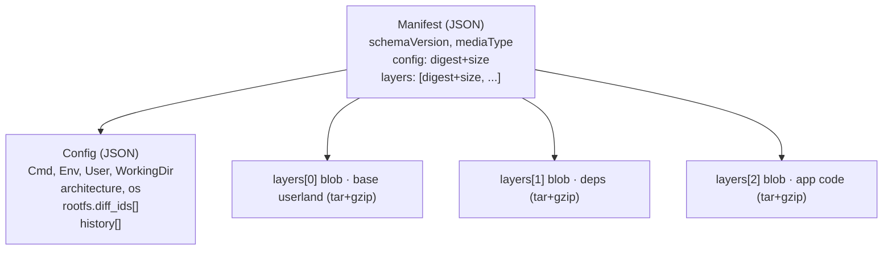
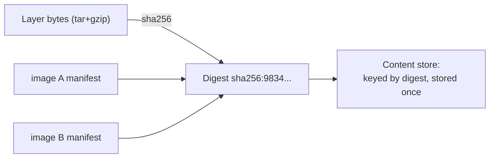
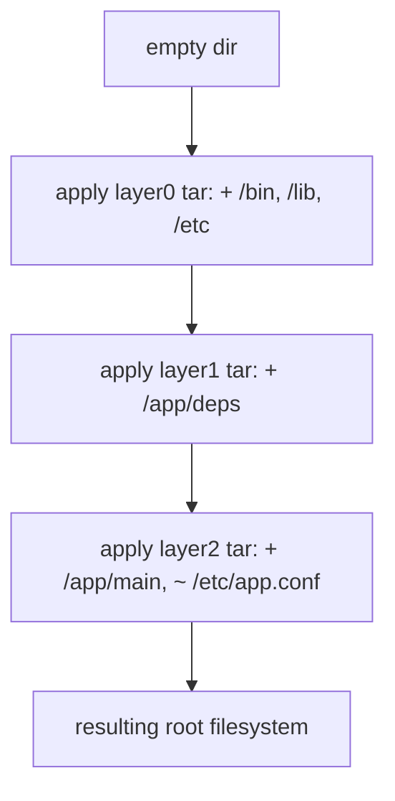
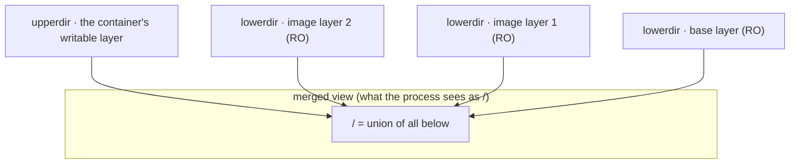
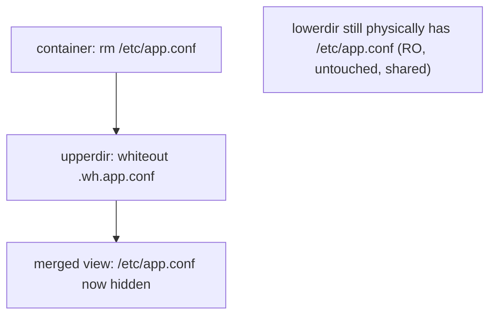
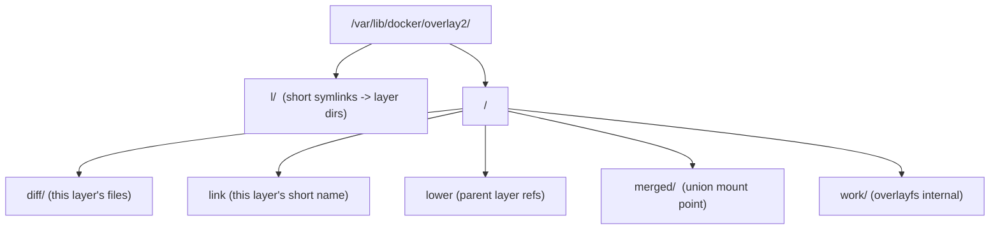
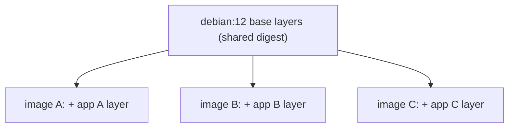
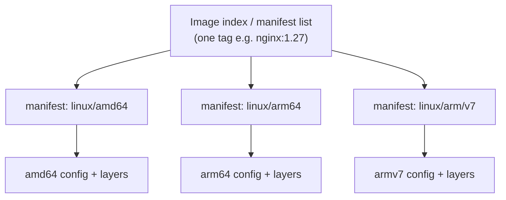

# Image Internals & Storage Drivers

`buildkit-advanced-builds` left a loose end: a multi-platform build had to be pushed
straight to a registry, because the classic local image store cannot hold one tag that
carries several architectures — and it never said *why* a local store chokes on a list of
manifests. The reason is that a containerd image store keys layers by their content
instead of by a driver's private chain, and that is settled below, in *Graph drivers vs
containerd snapshotters*.

You `docker pull nginx:1.27` once, start fifty containers from it, and `docker system df`
reports a few hundred megabytes on disk — not fifty times the image size, and the containers
came up in seconds without copying anything. Meanwhile `docker image inspect` lists the
image's layers as one set of `sha256:` hashes and `docker manifest inspect` lists a *different*
set for the very same layers. Neither is a bug. Both fall straight out of how an image is
actually built: an ordered stack of content-addressed layers, a JSON config, and a manifest
that ties them together, mounted into a single root filesystem by a storage driver. This note
opens the hood on what those bytes are on disk and on a registry, and how they become the one
`/` a container sees.

> [!TIP]
> **Reading map.** About 28 minutes. The first six sections build the on-disk model of an
> image (layers, manifest, config, digests); the middle sections are how a storage driver
> stacks them (union mount, copy-on-write, whiteouts, overlay2); the last five are operational
> (driver choice, the containerd shift, dedup, multi-arch, tooling). If you already know an
> image is a stack of tar diffs addressed by hash, start at
> [The union filesystem](#the-union-filesystem-stacking-layers-into-one-view). Everything
> before it is the object model that section assumes.

---

## An image = ordered layers + config + manifest

An image is not one file. It is a small graph of three kinds of object, each stored and named
by the SHA-256 hash of its own bytes — the content digest that serves as its identity. Pull the
graph apart and you get:

| Object | What it is | Media type (OCI) |
|---|---|---|
| Manifest | The entry point: a small JSON that names the config blob and the ordered list of layer blobs, each by digest and size | `application/vnd.oci.image.manifest.v1+json` |
| Config | JSON metadata: `Cmd`, `Entrypoint`, `Env`, `WorkingDir`, `User`, `ExposedPorts`, `architecture`/`os`, plus `rootfs.diff_ids` and `history` | `application/vnd.oci.image.config.v1+json` |
| Layer blob(s) | The filesystem data itself — a tarball of the changes that layer introduces | `application/vnd.oci.image.layer.v1.tar+gzip` |

Pulling an image runs one loop: fetch the manifest, read which config and which layers it
names, then fetch any of those blobs you do not already have on disk. The manifest is the
table of contents, the config is the settings, and the layers are the bytes. Nothing inside a
manifest is inlined — every reference is a digest that points at a blob stored somewhere else,
which is what lets two images share a blob and a client skip a download.



You can prove this three-object shape to yourself without pulling anything: `docker buildx
imagetools inspect --raw <image>` prints the raw manifest JSON, and `docker image inspect
<image>` shows the resolved config. The next section reads the manifest field by field, since
it is the object that decides everything else.

## The manifest: the image's table of contents

The **manifest** is a small JSON document — a `schemaVersion: 2`, a `mediaType`, one `config`
descriptor, and a `layers` array — and every descriptor in it is just `{ mediaType, digest,
size }`, pointing at content by digest rather than carrying it inline. Trimmed, a real one
reads:

```json
{
  "schemaVersion": 2,
  "mediaType": "application/vnd.oci.image.manifest.v1+json",
  "config": {
    "mediaType": "application/vnd.oci.image.config.v1+json",
    "digest": "sha256:b5b2b2c507a09443...",
    "size": 7023
  },
  "layers": [
    { "mediaType": "application/vnd.oci.image.layer.v1.tar+gzip",
      "digest": "sha256:9834876dcfb05cb1...", "size": 32654 },
    { "mediaType": "application/vnd.oci.image.layer.v1.tar+gzip",
      "digest": "sha256:3c3a4604a545cdc1...", "size": 16724 }
  ]
}
```

Three properties fall out of that one structure. First, the `layers` array is *ordered*:
`layers[0]` is the base and is applied first, and the last entry sits on top — the final root
filesystem must match the result of applying the layers to an empty directory in exactly that
sequence. Second, the image's own digest, the `repo@sha256:...` you pin against, is the digest
of *this manifest document*; because the manifest embeds the config digest and every layer
digest, changing any one of them changes the manifest and so changes the image's identity.
Third, the media type is versioned: Docker historically used its own schema-2 type
(`application/vnd.docker.distribution.manifest.v2+json`), the OCI type above is the modern
equivalent, and both are widely supported.

The manifest names the config but says nothing about what the config holds. That is the object
that carries how the container should start and which uncompressed layers make up its root.

## The image config: runtime metadata + rootfs.diff_ids

The **image config** is the JSON that `docker image inspect` mostly shows, and it answers one
question: everything the runtime needs to *start* a container that the layers themselves do not
encode. Its fields sort into three jobs. The runtime defaults — `Cmd`, `Entrypoint`, `Env`,
`WorkingDir`, `User`, `ExposedPorts`, `Volumes`, `Labels`, `StopSignal`, `Healthcheck` — are the
settings applied at launch. The platform pair, `architecture` (say `amd64` or `arm64`) and `os`
(say `linux`), pins what the image can run on; a runtime refuses an image whose platform does not
match the host, which is the `exec format error` you get running an arm64 image on amd64 without
emulation. And `rootfs.diff_ids` plus `history` describe the layers. `diff_ids` is the ordered
list of *uncompressed* layer digests, which the next section pulls apart; `history` is one entry
per build step — the command that produced it, and whether it was an `empty_layer` that added no
filesystem data.

That last field settles a question the object model makes concrete. A filesystem instruction
(`RUN`, `COPY`, `ADD`) produces a layer blob. A metadata instruction (`CMD`, `ENV`, `USER`,
`EXPOSE`, `ENTRYPOINT`) changes nothing on disk, so it is written into the config and marked
`empty_layer: true` in `history`, with zero bytes of its own. That is why an image built from 12
Dockerfile instructions can have only 4 layers — the other 8 are metadata entries in the config,
not blobs. `CMD` and `ENV` and `USER` live here, in the config, never in a layer's tarball.

You can watch the split directly. A trimmed `docker history nginx:1.27 --no-trunc`, newest
instruction on top, lays the two kinds side by side (the exact sizes track whatever `nginx:1.27`
currently ships, so treat the megabytes as a snapshot, not a constant):

```
CREATED BY                                              SIZE
CMD ["nginx" "-g" "daemon off;"]                        0B      ← empty_layer (config only)
STOPSIGNAL SIGQUIT                                      0B      ← empty_layer
EXPOSE 80                                               0B      ← empty_layer
ENTRYPOINT ["/docker-entrypoint.sh"]                    0B      ← empty_layer
COPY docker-entrypoint.sh / # buildkit                  1.62kB  ← real layer
RUN /bin/sh -c set -x && apt-get update && apt-get ...  118MB   ← real layer
ENV NGINX_VERSION=1.27.0                                0B      ← empty_layer
/bin/sh -c #(nop) ADD file:... in /                     97.2MB  ← real layer (base rootfs)
```

Eight instructions are shown and only three carry bytes: `ADD` at 97.2MB, `RUN apt-get` at
118MB, and `COPY` at 1.62kB. The other five are `empty_layer` entries adding 0B. The SIZE
column doubles as a bloat map — the `RUN apt-get` row is the first place you would look to
shrink this image. Every object counted here — manifest, config, each layer — is stored and
found by the hash of its own bytes, and that single choice is what makes the whole image
immutable, verifiable, and shareable.

## Content-addressable storage and digests

Every object — manifest, config, each layer blob — is stored and referenced by its digest, the
SHA-256 hash of its own exact bytes (`sha256:<64-hex>`) that `images-vs-containers` established
as image identity. A store that keys its objects this way — by the hash of their content rather
than by a location or a filename — is a **content-addressable store (CAS)**: the name of a thing
is a function of its bytes. That one property buys three things at once.

It makes images immutable by construction: `nginx@sha256:abc...` refers to exactly those bytes
forever, because flipping a single byte produces a different hash and therefore a different name,
so you would simply be pointing at a different object. It makes them verifiable: after
downloading a blob, the client re-hashes the bytes and compares them to the digest it asked for.
A mismatch — corruption on the wire, or tampering in a registry — makes the blob fail that check
and get discarded. And it deduplicates: two images that contain a byte-identical layer name the
same digest, so that layer is stored once on disk and moved once across the network.



That verification check is about *integrity* — the bytes are the bytes that were requested. It
says nothing about *who* produced them; proving authorship is a separate cryptographic signature
over the image (the job of tools like cosign and Sigstore), which content addressing neither
provides nor replaces.

> [!WARNING]
> A tag is not an identity. `nginx:1.27` is a mutable label that anyone with push rights can
> repoint at new bytes at any time, so pulling `:latest` today and next week can hand you two
> different images with no error and no warning. For a reproducible build or a locked-down
> deploy, pin the digest instead: `FROM debian:12@sha256:...`, or deploy `myapp@sha256:...`.

A digest names an object, but a single layer turns out to have *two* legitimate SHA-256 names,
depending on whether you hash it before or after compression — and telling them apart is where
`docker image inspect` and `docker manifest inspect` seem to disagree.

## diff_id vs digest: uncompressed content vs stored blob

One layer carries two SHA-256 identifiers, and confusing them is a classic gotcha. The digest
hashes the layer blob *as stored* — usually the gzip-compressed tar — and it is the value that
appears in the manifest's `layers[]`. The **diff_id** — the hash of the layer's *uncompressed*
tar — is the value that appears in the config's `rootfs.diff_ids[]`.

| Identifier | Hash of | Where it appears | Also called |
|---|---|---|---|
| digest (a.k.a. blobsum) | the layer blob *as stored* — usually the gzip-compressed tar | the manifest `layers[]` | "compressed digest", "distribution digest" |
| diff_id | the layer's *uncompressed* tar | the config `rootfs.diff_ids[]` | "uncompressed digest" |

The split exists because the two identifiers answer two different questions. The digest has to
match the exact blob that travelled the wire and sits on disk, so it must hash the compressed
bytes; a client re-hashes what it downloaded against this value. The diff_id has to identify the
layer's *filesystem content* regardless of how it happened to be compressed, so it hashes the
raw tar — and it is the diff_ids, not the digests, that the config commits to and that determine
the resulting filesystem. Sitting on top of both is the **ImageID** you see in `docker images`:
the digest of the *config* JSON itself, which in turn commits to the diff_ids. That is a third
hash again, distinct from any layer digest and from the manifest (repo) digest.

This is why `docker image inspect` and `docker manifest inspect` list different hashes for what
is plainly the same image. `docker image inspect` shows layers under `RootFS.Layers` as
diff_ids; the manifest lists them as digests. Both are correct — they are the uncompressed and
compressed hashes of the same layers — and they will never match hash for hash.

You can reproduce both from one blob:

```bash
# From the manifest (registry blob = compressed tar+gzip):
$ docker manifest inspect debian:12 | jq -r '.layers[0].digest'
sha256:9834876dcfb05cb167a5c24953eba58c4ac89b1adf57f28f2f9d09af107ee8f0   # ← the "digest"

# From the config (uncompressed tar):
$ docker image inspect debian:12 --format '{{index .RootFS.Layers 0}}'
sha256:e5f0e3d4f8b1a2c6d7e8f9a0b1c2d3e4f5a6b7c8d9e0f1a2b3c4d5e6f7a8b9c0   # ← the "diff_id"

# Prove why they differ, straight from the raw blob:
$ sha256sum layer.tar.gz            # hash the blob AS STORED (gzip-compressed)
9834876dcfb05cb1...   layer.tar.gz          # == the manifest digest
$ gzip -dc layer.tar.gz | sha256sum # decompress first, THEN hash the tar
e5f0e3d4f8b1a2c6...   -                     # == the diff_id
```

Both names point at one layer, but that layer is not a snapshot of a filesystem. It is a record
of what *changed*, which is the distinction the next section turns on.

## Layers as filesystem diffs (changesets), not snapshots

Each layer is a tarball of the *changes* one build step introduced relative to the layers below
it — files it added, files it modified, and deletions recorded as marker entries (whiteouts,
covered below) — not a full copy of the filesystem. A `RUN apt-get install` step, for instance,
produces a tar of only the files that install dropped under `/usr` and `/var`, and nothing it
left untouched. Three consequences follow from that one fact, and each is a common trap.

Ordering fixes size, so bytes you thought you deleted still ship. A file added in an early layer
and removed in a later one is *still in the image*: the later layer only adds a marker that hides
it, while the actual bytes stay in the earlier layer's blob. This is the `RUN rm` trap —
deleting a large file in a later Dockerfile step does not shrink the image (worked through in
`dockerfile-layers-build-cache`). A modification re-ships the whole file, never a delta: if layer
2 changes one line of a 100 MB file from layer 1, layer 2's tar contains the entire modified 100
MB file, because layers are file-level changesets, not block-level diffs. And the final root
filesystem is defined as the result of applying each layer's tar, in order, onto an empty
directory, with later layers overriding earlier ones.



Applying tars one after another produces a stack of directories, not one merged tree. Turning
that stack into the single `/` a process sees is the job of the union filesystem.

## The union filesystem: stacking layers into one view

A **union filesystem** is a mount that presents several stacked directories as one merged
directory, so `/etc/passwd` from a base layer and `/app/main` from the top layer show up together
in a single tree. The lower directories are the image's read-only layers; the top directory is the
container's own writable layer. What resolves a path depends on where it lives in the stack, and
there are only three cases:

- A path that exists only in a lower layer is read straight from there.
- A path that also exists in the writable upper layer is served from the upper copy, which
  obscures the lower one — the container's version wins.
- A path the container deleted is hidden by a whiteout in the upper layer, covered in its own
  section below.

The component that performs this mount is the **storage driver**: the piece of the engine that
stacks the read-only layers plus the one writable layer into the single root filesystem a
container sees. overlay2 does that job by default. Because the lower layers are mounted
read-only, one on-disk copy of them backs every container started from that image, and each
container gets only its own thin writable upper layer.



Sharing one read-only copy is also why a container starts in a moment: there is no image to copy,
only a fresh overlay mount to assemble. That sharing raises an immediate question — what happens
the first time a container writes to a file that only exists, read-only, in a shared lower layer?

## Copy-on-write and copy_up

Reading a lower-layer file costs nothing extra: the driver serves it directly from the shared
read-only layer, which is copy-on-write behaving exactly as `images-vs-containers` defined it —
share until someone writes. Reads go further than free. An unmodified file is served from the one
underlying lower-layer file, so every container reading it opens the *same* inode. The Linux page
cache is keyed per inode, so that file's pages are cached once in memory and shared across every
container touching it. At high density — fifty containers reading the same runtime — that is one
copy of those pages in RAM, not fifty.

The first write to a lower-layer file is where the cost lands. The driver performs a copy_up (the
copy-on-write step topic 1 named): it copies the file up from the lower layer into the writable
layer, and every later write hits that upper copy. The detail that surprises people is that
copy_up copies the *entire* file, because overlayfs works at the file level, not the block level.
Change one byte of a 2 GB file and the driver copies all 2 GB up into the writable layer before
applying your edit.

Even a pure metadata change can pay that price. A `chmod` or `chown` alters no file data. Yet on
a stock overlay2 mount it still triggers a full copy_up of the whole file — which is why topic 1
hedged the claim rather than stating it flatly. The escape hatch is a kernel overlayfs feature
called **metacopy**. When it is on, a metadata-only operation copies up just the file's metadata
into a new upper inode, and defers the data copy until an actual write; the upper file wears a
`trusted.overlayfs.metacopy` xattr until then. Whether it is on depends on the kernel build
(`CONFIG_OVERLAY_FS_METACOPY`) or the `metacopy=on` mount option — Docker's overlay2 does not
request it, so unless your kernel enables it by default, a `chmod` copies the whole file.

Two further costs are structural. The first write to any file is slower than steady state,
because the copy_up happens once per file the first time it is touched; after that, writes are
ordinary. And a deep stack of lower layers makes the initial lookup slower, since resolving a
path means searching each lower directory in turn until the file is found.

> [!WARNING]
> Write-heavy or large-file workloads — databases, large uploads, big log files — must not live
> on the container's writable layer. Every modification triggers a full-file copy_up, and the
> writes vanish when the container is removed. Mount a volume instead: it writes straight to the
> host filesystem and bypasses the union filesystem and copy-on-write entirely
> (`volumes-and-storage`).

Copy-on-write explains how a container *changes* a lower-layer file. It does not yet explain how
a container *deletes* one it can never write to — which needs a marker, not a copy.

## Whiteouts and opaque directories (how deletions work)

You cannot erase a file from a read-only lower layer, so a deletion is recorded in the writable
upper layer as a marker that hides the lower file from the merged view. Removing a single file
creates a **whiteout**: in the OCI layer tar format it is a file named `.wh.<filename>`, and the
overlayfs kernel implementation records it on disk as a character device with device numbers 0/0.
Either way the lower file stops appearing in the merged view while its bytes stay untouched in the
image blob.

Removing or replacing a whole directory needs a different marker, because a stack of whiteouts
would miss files added to that directory by even-lower layers. Marking the directory **opaque**
in the upper layer solves it: an opaque directory tells the union to show *none* of the lower
layers' contents for that path, even the ones no whiteout named. In the tar format this marker is
a file called `.wh..wh..opq`.



> [!KEY-TAKEAWAY]
> Deleting a file — in a running container or in a later image layer — never reclaims the space
> it occupied in a lower layer. The deletion is only a marker that hides the file; the bytes still
> ship in the image. The way to actually keep a secret or a large artifact out of the final image
> is to never add it in an earlier layer at all — or, if a build step needs it, to isolate it with
> multi-stage builds so the layer carrying it never reaches the shipped stage, flatten the history
> with `docker build --squash` so an add-then-delete leaves nothing behind, or mount it transiently
> with a BuildKit secret (`RUN --mount=type=secret`) that is never written to any layer.

Whiteouts, opaque directories, and copy_up are the moves; the kernel filesystem that actually
performs them, on nearly every Docker install, is overlay2.

## overlay2: the default storage driver

**overlay2** is the default and recommended storage driver in Docker's classic graph-driver
model — the model everything so far has described — on Linux kernel 4.0+ or RHEL/CentOS
3.10.0-514+. (Newer engines put a different management layer over the same overlayfs; that shift
is the snapshotter section below.) It implements the union filesystem through the kernel's
`overlay` filesystem, which mounts four directories with fixed roles:

| Role | Meaning |
|---|---|
| `lowerdir` | The read-only image layers (one or more, colon-separated at mount time). |
| `upperdir` | The single writable layer — the container's private changes. |
| `merged` | The unified mount point the container uses as its root. |
| `workdir` | An empty scratch directory overlayfs uses internally for atomic operations (must be empty and on the same filesystem as `upperdir`). |

The `workdir` constraint has a concrete reason. When overlayfs copies a file up or creates a
whiteout, it builds the finished result in `workdir` first, then `rename()`s it into `upperdir`.
A `rename()` is atomic only *within a single filesystem*; moving across filesystems is really a
copy that can be interrupted halfway. So `workdir` has to share `upperdir`'s filesystem, which
guarantees the merged view never exposes a half-written file. The mount itself looks like:

```
mount -t overlay overlay \
  -o lowerdir=<L2>:<L1>:<L0>,upperdir=<upper>,workdir=<work> \
  <merged>
```

overlay2 natively supports up to 128 lower layers, which is why images are effectively capped
around 127 layers. It performs well for `docker build` and `docker commit` and uses fewer inodes
than the legacy `overlay` driver it replaced. Those four roles are the abstract mount; on disk
they land in a specific directory tree you can walk yourself.

## overlay2 on-disk layout under /var/lib/docker/overlay2

Each layer gets its own directory under `/var/lib/docker/overlay2/<id>/`, and inside it the
driver keeps a small, fixed set of entries:

| File/dir | Purpose |
|---|---|
| `diff/` | The layer's actual contents — the files this layer adds or changes. |
| `link` | A file holding this layer's shortened identifier name. |
| `lower` | Present in non-base layers; lists the parent layers (as `l/<short>` refs) that form its `lowerdir`. |
| `merged/` | The unified mount point, populated while a container using this layer runs. |
| `work/` | overlayfs's internal working directory. |

Alongside those per-layer directories sits a top-level `l/` directory (a lowercase L) full of
short symlinks pointing at the real layer directories. It exists to solve one blunt limit: the
`mount` syscall caps the total size of its argument string at a page, and a deep image spelled
out with full paths for every `lowerdir` would blow straight past that cap. The short symlink
names keep the `lowerdir=...` option small enough to fit.



overlayfs is not perfectly POSIX-compatible, and one gap shows up in real applications: renaming
a *directory* with `rename(2)` succeeds only when both the source and the destination already
live on the top writable layer. If either side is still down in a lower layer, the kernel returns
`EXDEV` ("invalid cross-device link"), and the application has to fall back to
copy-then-unlink. Tools that move directories across the layer boundary — some package managers,
`yum`/`rpm` on older setups — are the ones that hit it.

> [!WARNING]
> Do not hand-edit anything under `/var/lib/docker/`. Editing `diff/` or `l/` by hand corrupts
> the driver's view of the store and can make images and containers inaccessible. Inspect the
> store through `docker` commands; never mutate it directly.

overlay2 is one of several drivers Docker can plug in, and the others exist for kernels,
filesystems, or isolation models where overlay2 does not fit.

## Storage drivers compared (overlay2, fuse-overlayfs, btrfs, zfs, vfs, devicemapper)

Docker's storage driver is pluggable, and the honest default is to use overlay2 unless a specific
constraint forces something else. What that constraint is decides which of the alternatives you
reach for:

| Driver | Mechanism | When / notes |
|---|---|---|
| overlay2 | Kernel overlayfs union, file-level copy-on-write | Default and recommended; the best general choice. |
| fuse-overlayfs | overlayfs in userspace via FUSE | For rootless Docker on older kernels that lack rootless overlay support; native rootless overlay2 works on kernel ≥ 5.11. |
| btrfs / zfs | Copy-on-write at the block/filesystem level, in the underlying filesystem | Only when `/var/lib/docker` sits on that filesystem. Snapshots are cheap and writes are fast, but they are operationally heavier; zfs is memory-hungry (its ARC cache). |
| vfs | No copy-on-write — every layer is a full deep copy | A fallback for testing or where no union filesystem is available. Very slow, huge disk use, not for production. |
| devicemapper | Block-level copy-on-write via LVM thin pools | Deprecated and removed in modern Docker; historically the RHEL default, where `loop-lvm` was a footgun and `direct-lvm` was the production setup. Worth knowing only for legacy systems and interview trivia. |
| aufs | The original union filesystem | Legacy, superseded by overlay2 and removed as a Docker storage driver; it was never merged into the mainline kernel. |

overlay2 has one backing-filesystem requirement worth checking before it bites: on xfs the
filesystem must be formatted with `d_type=true` (that is `ftype=1`; confirm with `xfs_info`), and
ext4 is supported directly. Without `d_type`, overlay2 misbehaves. Two operational facts matter
day to day. First, you read the active driver with `docker info | grep -i "Storage Driver"`.
Second, switching the storage driver makes your existing containers and images *inaccessible* on
that host, because each driver keeps its layers in its own on-disk layout. So save or push any
image you care about before you set the driver in `daemon.json` (`"storage-driver": "overlay2"`)
and restart.

Every driver in that table is a graph driver — Docker's own layer-management code. The larger
shift underway replaces that code entirely, and it is what closes the multi-platform loop left
open earlier.

## Graph drivers vs containerd snapshotters (the modern shift)

Run `docker info` on a current install and it prints `driver-type
io.containerd.snapshotter.v1` where an older Engine printed `Storage Driver: overlay2`. That one
line marks a shift beneath the whole model. Everything above describes the classic **graph
driver** — the layer-management code the Docker daemon has shipped for years, of which overlay2 is
one.

Docker is moving that job to the **containerd image store** — containerd's own content store and
snapshot manager — and as of Docker Engine 29.0 the containerd store is the default, with the
graph-driver store now the legacy path. This does not contradict "overlay2 is the default" from
earlier: overlay2, the overlayfs union, is still the mechanism doing the stacking. What changed is
the layer *above* it that owns the content and the layers.

A **snapshotter** is containerd's equivalent of a graph driver, and the overlayfs snapshotter is
a near-exact analog of the overlay2 graph driver — same `lowerdir`/`upperdir` union, same
file-level copy_up, same on-disk overlayfs. (`features.containerd-snapshotter: true` in `docker
info` is the other flag confirming you are on the containerd store.)

The difference that matters is what each store can keep on disk without unpacking it, and it is
exactly what `buildkit-advanced-builds` could not hold locally. A graph driver keys a layer by a
chain ID: a hash of the layer's uncompressed content chained with all its parents. It holds only
*unpacked* layers for the host to run, so it has nowhere to simply keep a raw manifest or a
foreign-architecture blob as opaque content. The containerd store instead adds a
content-addressed blob store keyed by digest, which keeps any blob as-is and hands a snapshotter
only the layers this host actually needs to unpack. So it can store an image index and every per-platform manifest and blob it
references — including layers for architectures this machine will never run. To the content store,
those are just more digests to hold. That is why a multi-platform tag has somewhere to live
locally on the containerd store, and had to be pushed straight to a registry on the old one.

Keying by content rather than by an unpacked chain unlocks three more things at once: native
multi-arch image storage, lazy-pulling snapshotters that fetch layer bytes on demand (such as
stargz), and a layer stack shared with Kubernetes through the same containerd. All of it rests on
the plainest property of content addressing — identical layers carry identical digests, so they
are stored and moved exactly once.

## Layer sharing, dedup, and why order saves space

Because identical layers carry identical digests, they are stored once and transferred once, and
that saving shows up in three places. Across containers, fifty containers from the same image
share one on-disk copy of its layers and each adds only its own thin writable layer. Across
images, every image built `FROM debian:12` references the identical Debian base blobs, stored
once locally however many images use them. Across the network, `docker pull` and `docker push`
skip any blob whose digest the far side already has, so pulling a new tag of an app whose base
you already hold transfers only the changed top layers.

Put numbers on the first case. Run 50 containers from `python:3.12` (base ≈ 350 MB, an
illustrative round figure), each writing ≈ 5 MB of its own data:

- Naive, with no sharing: 50 × 350 MB = 17,500 MB ≈ 17.5 GB on disk.
- overlay2, sharing lower layers: 350 MB stored once + 50 × 5 MB writable layers = 350 + 250 =
  600 MB total. About a 29× reduction — and the same reason those 50 containers start in seconds
  rather than copying 17.5 GB.

`docker ps -s` shows the split per container as `SIZE 5MB (virtual 355MB)`: 5 MB is the private
writable layer, and 355 MB is that plus the shared 350 MB image, counted once physically rather
than 50 times.



The same arithmetic hits the network on push. Say an image is a 350 MB base plus an 8 MB app
layer, 358 MB in total. Change one line of app code and rebuild. The 350 MB of base digests are
unchanged and already in the registry, so they are skipped. Only the 8 MB app layer has a new
digest, so `docker push` moves 8 MB, not 358 MB. This is why Dockerfile ordering pays off for the
whole registry, not just one build. Put rarely-changing content — the base image, OS packages,
dependencies — in lower layers, so those digests stay stable and shared. Put frequently-changing
content, your app code, on top, where a rebuild produces one small new blob to store and push.

One tag can carry several of these layer stacks at once — one per architecture — which is the
last piece of the on-disk model.

## Multi-arch images: the image index (manifest list)

A single manifest describes an image for exactly one `architecture`/`os` pair, so shipping one
tag that runs on amd64, arm64, and armv7 needs a layer above the manifest. That layer is an image
index: one top-level JSON that references a per-platform manifest each, tagged with its
`platform: { architecture, os }`. Docker calls the same object a manifest list, or informally a
"fat manifest".



When you `docker pull nginx:1.27`, the daemon reads the index and fetches only the manifest whose
platform matches the host — not the whole set. You build one with `docker buildx build --platform
linux/amd64,linux/arm64 --push`, and inspect it with `docker buildx imagetools inspect <image>`.

> [!INTERVIEW]
> "Why does `docker pull` on my M-series Mac just work with the same tag my CI uses on amd64?"
> The tag points at an image index, and each host resolves it to its own platform manifest. If a
> tag has no arm64 manifest in its index, you fall back to emulation or hit `exec format error`.

Every object in this whole model — index, manifest, config, layers — is inspectable from the
command line, which is the toolbox worth keeping at hand.

## Inspecting image internals (the toolbox)

Every object described above is visible from a handful of commands, and knowing which one shows
which object is most of the skill:

```bash
# Resolved config: Cmd, Env, User, Architecture/Os, RootFS.Layers (diff_ids)
docker image inspect nginx:1.27

# Build steps + which added a layer vs metadata-only (empty_layer); layer sizes
docker history nginx:1.27 --no-trunc

# RAW manifest / image index JSON straight from the registry (no pull needed)
docker buildx imagetools inspect --raw nginx:1.27      # index / manifest list
docker manifest inspect nginx:1.27                     # platform manifests

# Disk usage: images/containers/volumes/build cache, and reclaimable space
docker system df -v

# Per-container writable-layer size vs shared image size
docker ps -s        # SIZE = writable layer;  "virtual" = writable + shared image

# Active storage driver + backing filesystem
docker info | grep -iA2 "Storage Driver"

# Third-party: explore layer-by-layer contents & wasted space
dive nginx:1.27
```

Of these, `docker history` is the fastest answer to "why is this image huge?": it prints each
layer's size next to the command that created it, so the `RUN apt-get ...` step or the
copied-then-deleted secret that bloats the image is right there in the SIZE column. Pair it with
`dive` to walk the actual files per layer and see the bytes wasted by copy-then-delete.

That is the image, whole: an image index selecting a manifest, a manifest naming a config and an
ordered set of content-addressed layer blobs, and a storage driver unioning those read-only
layers under one writable layer into a single `merged` directory. Every byte is now in place on
disk — and yet nothing is running. A mounted root filesystem is not a container.

## Common follow-up questions

- *What are the three kinds of objects that make up an image?* Manifest (table of contents),
  config (runtime metadata + diff_ids + history), and layer blobs (tarballs of filesystem diffs)
  — all content-addressed by sha256.
- *digest vs diff_id?* digest = hash of the *stored/compressed* blob, lives in the manifest;
  diff_id = hash of the *uncompressed* tar, lives in the config `rootfs`. Same layer, two hashes.
- *What is `ImageID`?* The digest of the image *config* JSON — which is why it is stable and
  distinct from any single layer digest and from the manifest (repo) digest.
- *How does copy-on-write work and what's its cost?* Reads come free from shared lower layers;
  the first write to a file triggers a `copy_up` of the *entire* file into the writable layer.
  Big-file edits are expensive; use volumes.
- *Why doesn't `RUN rm bigfile` shrink my image?* Layers are diffs; a delete in a later layer
  is a whiteout — the bytes still ship in the earlier layer. Fix with multi-stage builds or by not
  adding it earlier.
- *What are lowerdir/upperdir/merged/workdir?* overlay2's read-only image layers, the container's
  writable layer, the unified mount the process sees, and overlayfs's internal work dir,
  respectively.
- *Why the `l/` short-symlink directory?* To keep the `mount` syscall's `lowerdir=` argument
  under the kernel page-size limit for deep layer stacks.
- *Which storage driver should I use, and what if I switch?* overlay2 (fuse-overlayfs for
  older-kernel rootless). Switching drivers hides existing images/containers because they live in
  a driver-specific on-disk layout — save/push first.
- *Graph driver vs snapshotter?* A graph driver is Docker's own layer-management code; a
  snapshotter is containerd's equivalent. Same overlayfs union underneath — a different component
  managing it, and the containerd image store is now the default.
- *How does one tag run on both amd64 and arm64?* An image index / manifest list points to
  per-platform manifests; the daemon resolves the one matching the host.

## References

- Docker Docs — [About storage drivers](https://docs.docker.com/engine/storage/drivers/) and
  [overlayfs storage driver](https://docs.docker.com/engine/storage/drivers/overlayfs-driver/)
- Docker Docs — [Storage drivers select](https://docs.docker.com/engine/storage/drivers/select-storage-driver/)
  and [Container and image layers](https://docs.docker.com/get-started/docker-concepts/building-images/understanding-image-layers/)
- OCI — [image-spec: manifest](https://github.com/opencontainers/image-spec/blob/main/manifest.md),
  [config](https://github.com/opencontainers/image-spec/blob/main/config.md),
  [layer (changesets/whiteouts)](https://github.com/opencontainers/image-spec/blob/main/layer.md),
  [image index](https://github.com/opencontainers/image-spec/blob/main/image-index.md),
  [descriptor/digests](https://github.com/opencontainers/image-spec/blob/main/descriptor.md)
- OCI — [distribution-spec](https://github.com/opencontainers/distribution-spec) (registry push/pull, content-addressable blobs)
- Linux — `overlayfs` kernel docs (`Documentation/filesystems/overlayfs.rst`): lower/upper/work, whiteouts, opaque dirs, copy_up, metacopy
- containerd — [snapshotters](https://github.com/containerd/containerd/blob/main/docs/snapshotters/README.md) (the modern equivalent of storage drivers)
- Tools — [`dive`](https://github.com/wagoodman/dive), `docker history`, `docker system df`, `docker buildx imagetools inspect`
