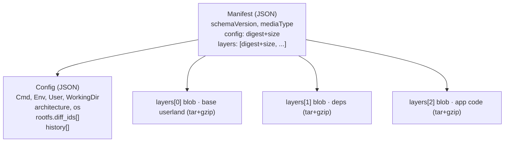
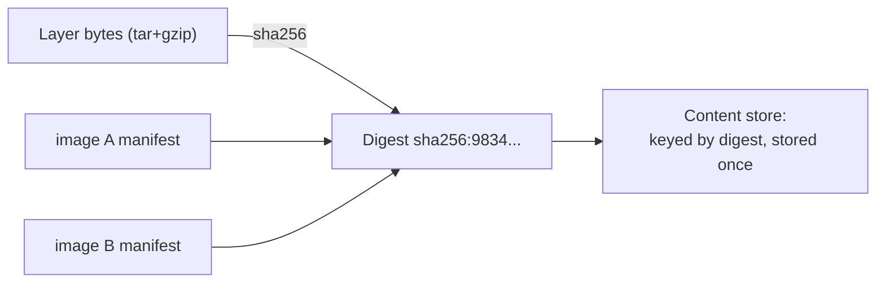
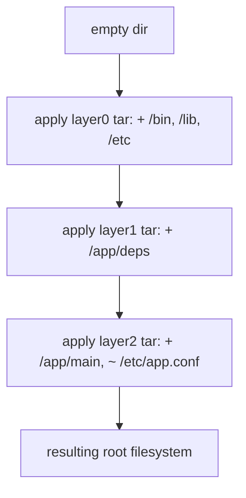
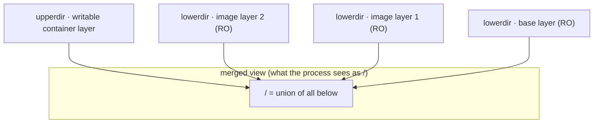
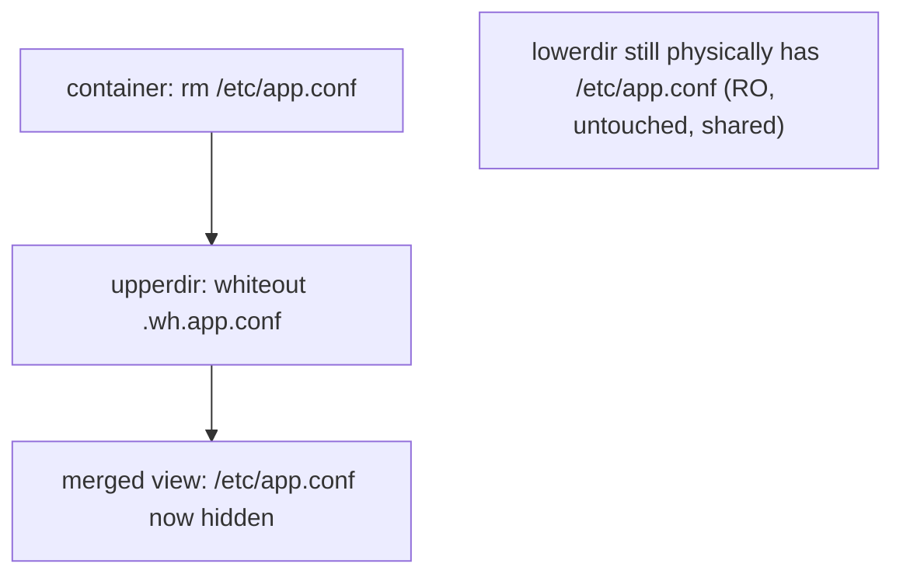
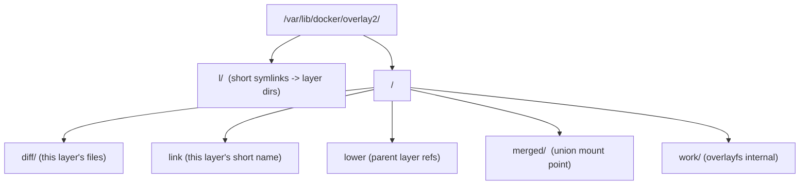
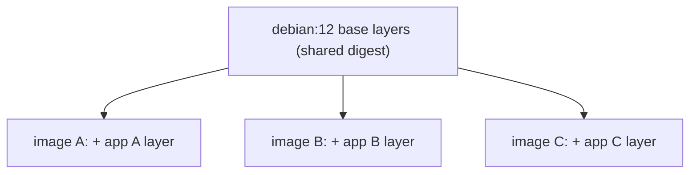
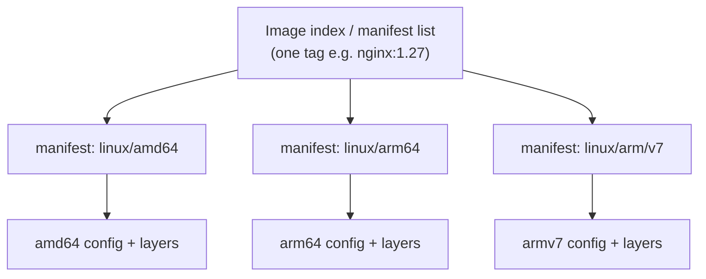

# Image Internals & Storage Drivers

If `images-vs-containers` answers *"what is an image?"* at the conceptual level, this note
opens the hood: **what an image actually is on disk and on a registry**, byte for byte, and
**how the storage driver stacks those bytes into one root filesystem** for a running
container. The one-line mental model to anchor everything:

> **An image is an ordered list of content-addressed layers + a JSON config + a manifest
> that ties them together. Each layer is a tarball of filesystem *changes* (a diff),
> identified by the SHA-256 digest of its content. A storage driver (overlay2 by default)
> stacks the read-only layers under a per-container writable layer using a union filesystem,
> serving unchanged files from the shared lower layers and *copying up* a file only when the
> container first modifies it.**

That single sentence contains the whole domain: layers, config, manifest, content
addressing/digests, union filesystems, copy-on-write, and the storage driver. This note
covers each precisely and hands-on.

Cross-references (don't duplicate): the image/container distinction, tag-vs-digest identity,
and the CoW *concept* live in `images-vs-containers`; how a Dockerfile *produces* layers and
the build cache lives in `dockerfile-layers-build-cache`; volumes that *bypass* the union
filesystem live in `volumes-and-storage`; how a container is *run* (namespaces/cgroups, the
OCI runtime) lives in `runtimes-oci-standards`; the OS domain owns namespaces/cgroups theory
in general.

> [!KEY-TAKEAWAY]
> **Manifest → config + layers, all by digest.** The manifest lists the config blob and the
> ordered layer blobs. The config holds runtime metadata (`Cmd`, `Env`, `User`, `architecture`)
> plus `rootfs.diff_ids` and build `history`. Each layer blob is a (usually gzipped) tar of
> filesystem changes. Everything is content-addressed (`sha256:...`), which makes images
> **immutable, verifiable, and de-duplicated**. overlay2 unions the layers: `lowerdir`
> (read-only image layers) + `upperdir` (writable container layer) → `merged` (what the
> process sees), with `workdir` for internal atomicity.

---

## An image = ordered layers + config + manifest

A Docker/OCI image is **not a single file**. It is a small graph of content-addressed
objects:

| Object | What it is | Media type (OCI) |
|---|---|---|
| **Manifest** | The entry point: a small JSON that references the config blob and the ordered list of layer blobs, each by digest + size | `application/vnd.oci.image.manifest.v1+json` |
| **Config** | JSON metadata: `Cmd`, `Entrypoint`, `Env`, `WorkingDir`, `User`, `ExposedPorts`, `architecture`/`os`, plus `rootfs.diff_ids` and `history` | `application/vnd.oci.image.config.v1+json` |
| **Layer blob(s)** | The actual filesystem data — a tarball of the changes that layer introduces | `application/vnd.oci.image.layer.v1.tar+gzip` |

Pulling an image means: fetch the manifest → read which config + layers it references →
fetch any of those blobs you don't already have. The manifest is the "table of contents";
the config is the "settings"; the layers are the "bytes."



> [!TIP]
> Inspect it directly. `docker buildx imagetools inspect --raw <image>` prints the raw
> manifest JSON; `docker image inspect <image>` shows the resolved config (Cmd, Env, Layers
> as `diff_ids`, `Architecture`, `Os`). This is the fastest way to *prove* the three-object
> model to yourself in an interview.

## The manifest: the image's table of contents

The **manifest** is a small JSON document with `schemaVersion: 2`, a `mediaType`, a single
`config` descriptor, and a `layers` array. Each descriptor is `{ mediaType, digest, size }`
— it references content **by digest**, never inline. Example (trimmed):

```json
{
  "schemaVersion": 2,
  "mediaType": "application/vnd.oci.image.manifest.v1+json",
  "config": {
    "mediaType": "application/vnd.oci.image.config.v1+json",
    "digest": "sha256:b5b2b2c507a09443...",
    "size": 7023
  },
  "layers": [
    { "mediaType": "application/vnd.oci.image.layer.v1.tar+gzip",
      "digest": "sha256:9834876dcfb05cb1...", "size": 32654 },
    { "mediaType": "application/vnd.oci.image.layer.v1.tar+gzip",
      "digest": "sha256:3c3a4604a545cdc1...", "size": 16724 }
  ]
}
```

Key facts:

- **Layers are ordered**: `layers[0]` is the base, applied first; the last entry is the top.
  The final root filesystem "MUST match the result of applying the layers to an empty
  directory" in that order.
- The **image's digest** (`repo@sha256:...`) is the digest of *this manifest document*.
  Because the manifest embeds the config and layer digests, changing any layer or the config
  changes the manifest, which changes the image digest — this is how digests make images
  immutable and verifiable (see *Content-addressable storage and digests*).
- Historically Docker used its own schema-2 manifest media type
  (`application/vnd.docker.distribution.manifest.v2+json`); the OCI type is the modern
  equivalent and both are widely supported.

## The image config: runtime metadata + rootfs.diff_ids

The **config** JSON is what `docker image inspect` mostly shows. It carries:

- **Runtime defaults** the runtime applies when starting a container: `Cmd`, `Entrypoint`,
  `Env`, `WorkingDir`, `User`, `ExposedPorts`, `Volumes`, `Labels`, `StopSignal`,
  `Healthcheck`.
- **Platform**: `architecture` (e.g. `amd64`, `arm64`) and `os` (e.g. `linux`). A runtime
  refuses to run an image whose `architecture`/`os` doesn't match the host (this is why you
  see `exec format error` when running an arm64 image on amd64 without emulation).
- **`rootfs.diff_ids`**: the ordered list of **uncompressed** layer digests (see next
  subtopic).
- **`history`**: one entry per build step, including the command that produced it and whether
  it was `empty_layer` (a metadata-only instruction like `ENV` that added no filesystem
  layer). This is what `docker history` renders.

> [!INTERVIEW]
> "Where does `CMD`/`ENV`/`USER` live — in a layer?" **No.** Those are stored in the *image
> config* JSON, not in any layer's tarball. Only instructions that change the filesystem
> (`RUN`, `COPY`, `ADD`) produce layer blobs. That's why an image with 12 Dockerfile
> instructions may have only 4 layers — the rest are `empty_layer` metadata entries in the
> config's `history`.

## Content-addressable storage and digests

Every object — manifest, config, each layer blob — is stored and referenced by the
**SHA-256 digest of its own bytes** (`sha256:<64-hex>`). This is a **content-addressable
store (CAS)**, and it buys several properties simultaneously:

- **Immutability by construction.** `nginx@sha256:abc...` always refers to *exactly* those
  bytes. Change one byte and the digest changes, so you'd be referring to a different object.
  A tag (`nginx:1.27`) is a mutable pointer; a digest is not.
- **Verifiability.** After downloading a blob, the client re-hashes it and compares to the
  requested digest; a mismatch means corruption or tampering, and the blob is rejected. (This
  is content *integrity*; cryptographic *signing* of who produced the image is a separate
  layer — cosign/Sigstore — covered in `image-scanning-supply-chain` and
  `devops-cicd/software-supply-chain-security`.)
- **Deduplication.** Two images that share an identical layer reference the *same digest*, so
  it's stored once locally and transferred once over the network.



> [!WARNING]
> A **tag is not an identity** — it's a mutable label that can be repointed at any time
> (`docker tag`, or someone re-pushing `:latest`). For reproducible builds and secure
> deployment, pin by digest: `FROM debian:12@sha256:...` or deploy `myapp@sha256:...`. Pulling
> `:latest` today and next week can give you two different images with no error.

## diff_id vs digest: uncompressed content vs stored blob

A single layer has **two different SHA-256 identifiers**, and confusing them is a classic
gotcha:

| Identifier | Hash of | Where it appears | Also called |
|---|---|---|---|
| **digest** (a.k.a. blobsum) | the layer blob **as stored** — usually the *gzip-compressed* tar | the **manifest** `layers[]` | "compressed digest," "distribution digest" |
| **diff_id** | the layer's **uncompressed** tar | the **config** `rootfs.diff_ids[]` | "uncompressed digest" |

Why two? The manifest digest addresses the exact on-the-wire/on-disk blob (so it must match
the compressed bytes that were transferred), while the diff_id identifies the *content* of
the layer independent of how it was compressed — which is what determines the actual
filesystem state and the image's overall `ImageID`. The **`ImageID`** you see in
`docker images` is the digest of the *config* JSON, which in turn commits to the diff_ids.

> [!TIP]
> Because `docker image inspect` shows layers under `RootFS.Layers` as **diff_ids** but the
> manifest lists **digests**, the two lists don't match hash-for-hash even for the same image.
> They're different hashes of the same layers (uncompressed vs compressed). Both are correct.

## Layers as filesystem diffs (changesets), not snapshots

Each layer is a **tarball of the *changes* that instruction introduced** relative to the
layers below it — files added, files modified, and *deletions marked with whiteouts* — not a
full copy of the filesystem. This changeset model is why:

- **Ordering matters for size and cache.** A file added in an early layer and "deleted" in a
  later layer is **still in the image** — the later layer only adds a whiteout; the bytes ship
  in the earlier layer's blob. (This is the classic "`RUN rm` in a later step doesn't shrink
  the image" trap — see `dockerfile-layers-build-cache` and `multi-stage-builds-image-optimization`.)
- **A modification re-ships the whole file, not a delta.** If layer 2 changes one line of a
  100 MB file from layer 1, layer 2's tar contains the entire modified 100 MB file. Layers are
  file-level changesets, not block-level deltas.
- The final root filesystem is the result of **applying each layer's tar, in order, onto an
  empty directory**, later layers overriding earlier ones.



## The union filesystem: stacking layers into one view

A **union (overlay) filesystem** presents multiple stacked directories as a single merged
directory. The storage driver mounts the image's read-only layers as the **lower** layers and
the container's writable layer as the **upper** layer, and the container process sees one
coherent `/`:

- If a path exists only in a lower layer → it's read from there.
- If it exists in the upper (writable) layer → the upper version **obscures** the lower one
  (the container's copy wins).
- Deletions in the upper layer are represented by **whiteouts** that hide the lower file.



This is what makes one image shareable by many containers: the lower layers are mounted
read-only and shared; each container gets its own thin `upperdir`. It's also why containers
start fast — no copying of the image, just a new overlay mount.

## Copy-on-write and copy_up

Because lower layers are read-only, the driver uses **copy-on-write (CoW)**:

- **Read** of a lower-layer file → served directly from the shared read-only layer. No copy,
  no extra disk, and thanks to **page-cache sharing** in overlayfs, multiple containers
  reading the same lower file share one page-cache entry (memory-efficient at high density).
- **First write/modify** of a lower-layer file → the driver performs a **`copy_up`**: it
  copies the entire file from `lowerdir` into `upperdir`, then applies the change there.
  Subsequent writes hit the already-copied file in `upperdir`.

Two consequences interviewers probe:

1. **`copy_up` copies the whole file**, because overlayfs works at the *file* level, not the
   block level. Editing one byte of a 2 GB file copies all 2 GB up into the writable layer.
   Even a metadata change (`chmod`/`chown`) triggers a copy_up.
2. **The first write is slower than steady state**; the cost is paid once per file. Deep layer
   stacks make the initial lookup (searching lowerdirs for the file) more expensive.

> [!WARNING]
> Write-heavy or large-file workloads (databases, large uploads, big log files) must **not**
> live on the container's writable layer — every modification triggers a full-file copy_up and
> the writes are lost when the container is removed. Mount a **volume**, which writes straight
> to the host filesystem and *bypasses the union filesystem and CoW entirely* (see
> `volumes-and-storage`).

## Whiteouts and opaque directories (how deletions work)

You cannot delete a file from a read-only lower layer, so overlayfs records deletions in the
`upperdir`:

- **Whiteout** — deleting a *file* that exists in a lower layer creates a whiteout marker in
  `upperdir` that hides the lower file from the merged view. In the OCI layer format a whiteout
  is a file named `.wh.<filename>`; the overlayfs kernel implementation uses a character
  device with 0/0 device numbers on-disk, but the exported tar uses the `.wh.` convention.
- **Opaque directory** — deleting (or replacing) a whole *directory* is marked by making the
  directory **opaque** in `upperdir`, so none of the lower layer's contents of that directory
  show through, even though they still physically exist in the image blob. In the tar format
  this is `.wh..wh..opq`.



> [!KEY-TAKEAWAY]
> Deleting a file in a container (or in a later image layer) **never reclaims the space** in
> the lower layer — it only adds a whiteout that hides it. The bytes still ship in the image.
> To actually remove secrets or bloat, don't add them in an earlier layer at all, or use
> multi-stage builds / `--squash` / BuildKit's targeted stages.

## overlay2: the default storage driver

**overlay2** is the default and recommended storage driver on modern Docker (Linux kernel
4.0+, or RHEL/CentOS 3.10.0-514+). It implements the union filesystem via the kernel's
`overlay` filesystem with four directory roles:

| Role | Meaning |
|---|---|
| **`lowerdir`** | The read-only image layers (one or more, colon-separated when mounting). |
| **`upperdir`** | The single writable layer — the container's private changes. |
| **`merged`** | The unified mount point the container uses as its root. |
| **`workdir`** | An empty working directory overlayfs uses internally for atomic operations (must be an empty dir on the same fs as `upperdir`). |

Roughly, the mount is:

```
mount -t overlay overlay \
  -o lowerdir=<L2>:<L1>:<L0>,upperdir=<upper>,workdir=<work> \
  <merged>
```

overlay2 **natively supports up to 128 lower layers**, which is why images are effectively
capped around ~127 layers. It performs well for `docker build`/`docker commit` and consumes
fewer inodes than the legacy `overlay` driver.

## overlay2 on-disk layout under /var/lib/docker/overlay2

Each layer gets a directory under `/var/lib/docker/overlay2/<id>/` containing:

| File/dir | Purpose |
|---|---|
| **`diff/`** | The layer's actual contents (the files this layer adds/changes). |
| **`link`** | A file holding this layer's **shortened** identifier name. |
| **`lower`** | Present in non-base layers; lists the parent layers (as `l/<short>` refs) that form its `lowerdir`. |
| **`merged/`** | The unified mount point (populated when a container using this layer is running). |
| **`work/`** | overlayfs's internal working dir. |

There's also a top-level **`l/` directory** (lowercase L) full of **short symlinks** to the
real layer directories. Its whole reason to exist: the `mount` syscall has a **page-size limit
on its arguments**, and a deep image would blow past it if full paths were used for every
`lowerdir`. Short symlink names keep the `lowerdir=...` mount option under that limit.



overlayfs is not perfectly POSIX-compatible, and one quirk surfaces in real apps: a
`rename(2)` of a **directory** succeeds only when both the source and destination are already
on the top (writable) layer. If either side still lives in a lower layer, the kernel returns
**`EXDEV`** ("cross-device link not permitted") and the application must fall back to
copy-and-unlink. Tools that rename directories across layer boundaries (some package managers,
`yum`/`rpm` on older setups) hit this.

> [!WARNING]
> "Don't directly manipulate any files or directories within `/var/lib/docker/`." Editing
> `diff/` or `l/` by hand corrupts the driver's view and can make images/containers
> inaccessible. Inspect via `docker` commands, not by hand-editing the store.

## Storage drivers compared (overlay2, fuse-overlayfs, btrfs, zfs, vfs, devicemapper)

Docker's storage driver is pluggable. Modern guidance: **use overlay2** unless you have a
specific reason not to.

| Driver | Mechanism | When / notes |
|---|---|---|
| **overlay2** | Kernel overlayfs union, file-level CoW | **Default & recommended.** Best general choice. |
| **fuse-overlayfs** | overlayfs in userspace (FUSE) | For **rootless** Docker on older kernels lacking rootless overlay support; native overlay2 rootless works on kernel ≥ 5.11. |
| **btrfs** / **zfs** | CoW at the **block/filesystem** level via the underlying FS | Only when `/var/lib/docker` is on that FS. Snapshots are cheap; good for write-heavy, but operationally heavier. zfs is memory-hungry (ARC). |
| **vfs** | **No CoW** — each layer is a full deep copy | Fallback for testing/when no union fs is available. Very slow, huge disk use. Not for production. |
| **devicemapper** | Block-level CoW via LVM thin pools | **Deprecated/removed** in modern Docker; historically the RHEL default (`loop-lvm` was a footgun, `direct-lvm` for prod). Know it only for legacy/interview trivia. |
| **aufs** | Original union fs | Legacy, superseded by overlay2; removed from modern kernels. |

Backing-filesystem requirement for overlay2: **xfs must be formatted with `d_type=true`**
(`ftype=1`; check with `xfs_info`), or `ext4`. Without `d_type`, overlay2 behaves incorrectly.

> [!TIP]
> Check the active driver with `docker info | grep -i "Storage Driver"`. Changing the storage
> driver makes existing containers and images **inaccessible on the local system** (they live
> in a driver-specific layout) — push/save images first, then reconfigure `daemon.json`
> (`"storage-driver": "overlay2"`).

## Layer sharing, dedup, and why order saves space

Content addressing means **identical layers are stored once and transferred once**, across
containers *and* across images:

- **Across containers**: 50 containers from `python:3.12` share one on-disk copy of the Python
  layers; each adds only a thin `upperdir`.
- **Across images**: every image `FROM debian:12` shares the identical Debian base layer
  blobs — stored once locally, downloaded once.
- **Across the network**: `docker pull` and `docker push` skip blobs whose digest the other
  side already has. Pull a new tag of an app whose base you already have and only the changed
  top layers transfer.

This is why **Dockerfile ordering matters for the whole registry, not just one build**: put
rarely-changing content (base, OS packages, dependencies) in *lower* layers so those digests
stay stable and are shared/reused, and put frequently-changing content (your app code) on
*top*. Stable lower digests maximize cache reuse (`dockerfile-layers-build-cache`) *and*
cross-image/network dedup. Rebuilding only the top layer means only that small blob is a new
digest to push and store.



## Multi-arch images: the image index (manifest list)

A single manifest describes an image for **one** `architecture`/`os`. To ship one tag that
works on amd64, arm64, etc., you use an **image index** (OCI) / **manifest list** (Docker
"fat manifest"): a top-level JSON that references **per-platform manifests**, each tagged with
its `platform: { architecture, os }`.



When you `docker pull nginx:1.27`, the daemon reads the index and fetches **only the manifest
matching the host platform**. Build multi-arch with `docker buildx build --platform
linux/amd64,linux/arm64 --push`. Inspect with `docker buildx imagetools inspect <image>`.

> [!INTERVIEW]
> "Why does `docker pull` on my M-series Mac 'just work' with the same tag my CI uses on
> amd64?" Because the tag points at an **image index**, and each host resolves it to its own
> platform manifest. If a tag has *no* arm64 manifest, you'll fall back to emulation or hit
> `exec format error`.

## Inspecting image internals (the toolbox)

The commands that make all of the above visible — worth having at your fingertips:

```bash
# Resolved config: Cmd, Env, User, Architecture/Os, RootFS.Layers (diff_ids)
docker image inspect nginx:1.27

# Build steps + which added a layer vs metadata-only (empty_layer); layer sizes
docker history nginx:1.27 --no-trunc

# RAW manifest / image index JSON straight from the registry (no pull needed)
docker buildx imagetools inspect --raw nginx:1.27      # index / manifest list
docker manifest inspect nginx:1.27                     # platform manifests

# Disk usage: images/containers/volumes/build cache, and reclaimable space
docker system df -v

# Per-container writable-layer size vs shared image size
docker ps -s        # SIZE = writable layer;  "virtual" = writable + shared image

# Active storage driver + backing filesystem
docker info | grep -iA2 "Storage Driver"

# Third-party: explore layer-by-layer contents & wasted space
dive nginx:1.27
```

> [!TIP]
> `docker history` is the fastest way to answer *"why is this image huge?"* in an interview:
> it shows each layer's size and the command that created it, so you can spot the `RUN
> apt-get ...` (or the copied-then-deleted secret) that bloats the image. Pair it with `dive`
> to see the actual files per layer and "wasted" bytes from copy-then-delete.

## Common follow-up questions

- **"What are the three kinds of objects that make up an image?"** Manifest (table of
  contents), config (runtime metadata + diff_ids + history), and layer blobs (tarballs of
  filesystem diffs) — all content-addressed by sha256.
- **"digest vs diff_id?"** digest = hash of the *stored/compressed* blob, lives in the
  manifest; diff_id = hash of the *uncompressed* tar, lives in the config `rootfs`. Same layer,
  two hashes.
- **"What is `ImageID`?"** The digest of the image *config* JSON — which is why it's stable
  and distinct from any single layer digest and from the manifest (repo) digest.
- **"How does copy-on-write work and what's its cost?"** Reads come free from shared lower
  layers; the first write to a file triggers a `copy_up` of the *entire* file into the writable
  layer. Big-file edits are expensive; use volumes.
- **"Why doesn't `RUN rm bigfile` shrink my image?"** Layers are diffs; a delete in a later
  layer is a whiteout — the bytes still ship in the earlier layer. Fix with multi-stage builds
  or by not adding it earlier.
- **"What are lowerdir/upperdir/merged/workdir?"** overlay2's read-only image layers, the
  writable container layer, the unified mount the process sees, and overlayfs's internal work
  dir, respectively.
- **"Why the `l/` short-symlink directory?"** To keep the `mount` syscall's `lowerdir=`
  argument under the kernel page-size limit for deep layer stacks.
- **"Which storage driver should I use, and what if I switch?"** overlay2 (fuse-overlayfs for
  older-kernel rootless). Switching drivers hides existing images/containers because they live
  in a driver-specific on-disk layout — save/push first.
- **"How does one tag run on both amd64 and arm64?"** An image index / manifest list points to
  per-platform manifests; the daemon resolves the one matching the host.

## References

- Docker Docs — [About storage drivers](https://docs.docker.com/engine/storage/drivers/) and
  [overlayfs storage driver](https://docs.docker.com/engine/storage/drivers/overlayfs-driver/)
- Docker Docs — [Storage drivers select](https://docs.docker.com/engine/storage/drivers/select-storage-driver/)
  and [Container and image layers](https://docs.docker.com/get-started/docker-concepts/building-images/understanding-image-layers/)
- OCI — [image-spec: manifest](https://github.com/opencontainers/image-spec/blob/main/manifest.md),
  [config](https://github.com/opencontainers/image-spec/blob/main/config.md),
  [layer (changesets/whiteouts)](https://github.com/opencontainers/image-spec/blob/main/layer.md),
  [image index](https://github.com/opencontainers/image-spec/blob/main/image-index.md),
  [descriptor/digests](https://github.com/opencontainers/image-spec/blob/main/descriptor.md)
- OCI — [distribution-spec](https://github.com/opencontainers/distribution-spec) (registry push/pull, content-addressable blobs)
- Linux — `overlayfs` kernel docs (`Documentation/filesystems/overlayfs.rst`): lower/upper/work, whiteouts, opaque dirs, copy_up
- containerd — [snapshotters](https://github.com/containerd/containerd/blob/main/docs/snapshotters/README.md) (the modern equivalent of storage drivers)
- Tools — [`dive`](https://github.com/wagoodman/dive), `docker history`, `docker system df`, `docker buildx imagetools inspect`
