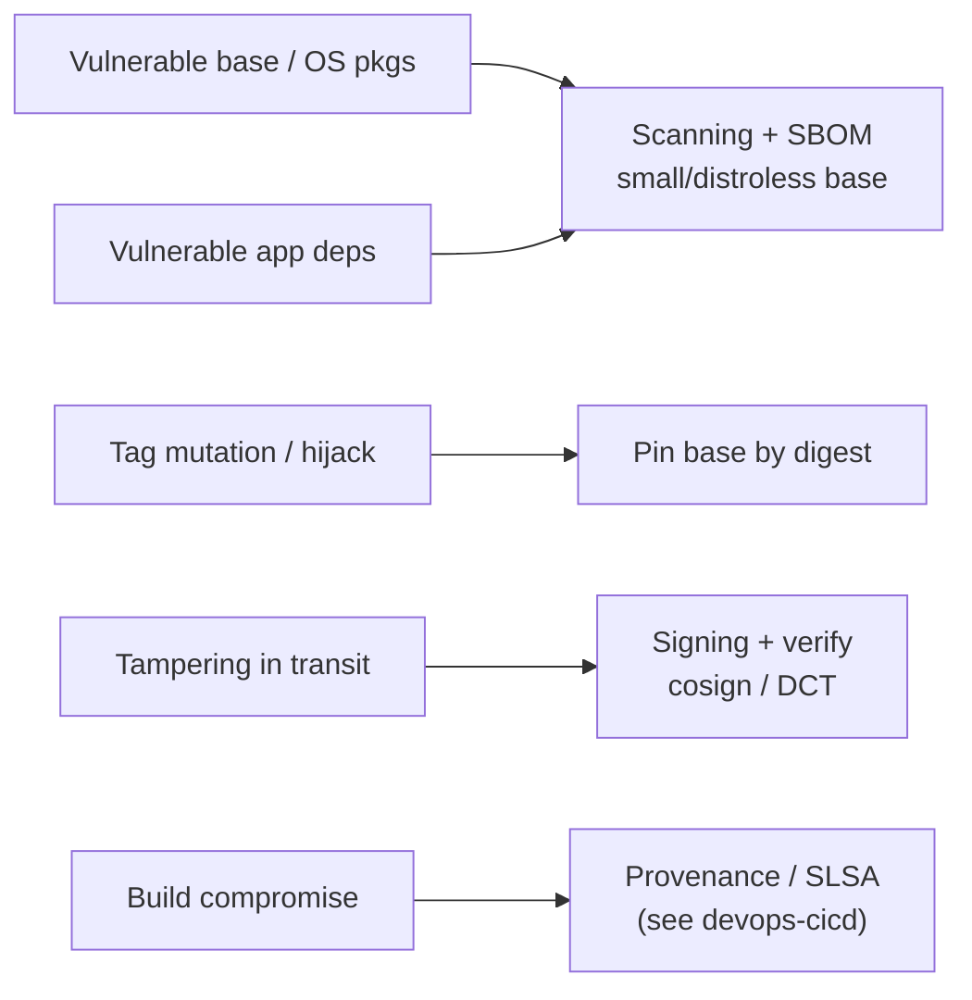
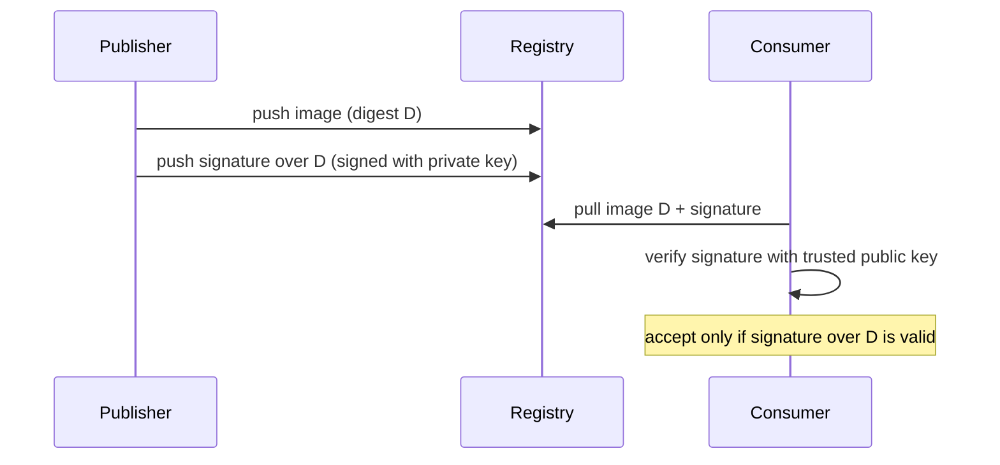
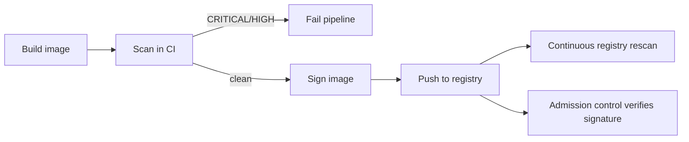

# Image Scanning & Supply-Chain Security

Topic 12 hardened what a container may *do* once it runs — drop capabilities, apply a seccomp filter, mount the root filesystem read-only — and every one of those controls assumes the image already holds the bytes you think it holds. A hijacked base image, or a dependency published yesterday, is inside that boundary before any runtime control gets a say; this file is where that gap gets its name.

Run `trivy image myorg/api:1.4.2` on a service you just built and the report can come back with thirty CVEs, not one of them in code you wrote. They arrived with `FROM node:22`, which unpacks a whole Debian userland — openssl, glibc, zlib, dozens of OS packages — each with its own advisory history. So the runtime controls of topic 12 come *after* a prior question this file exists to answer: can you trust the bytes at all — both that nothing known-vulnerable is inside, and that what you deploy is byte-for-byte what your pipeline built?

> [!KEY-TAKEAWAY]
> A container image is a supply chain, not a single file: your app code, its language
> dependencies, a base image, and the OS packages inside that base, all pulled from the
> internet. Two independent questions decide whether to trust it — "what known-vulnerable
> things are inside?", answered by scanning and an SBOM, and "is this the exact image my
> pipeline produced?", answered by signing and digest pinning. Neither answer implies the other.

> [!TIP]
> **Reading map.** About 20 minutes. The spine is the two guarantees — find them (this
> section and the next), sign them (Cosign & Sigstore), and enforce them (Scanning in CI,
> Admission control). If you already scan in CI and pin bases by digest, skip to
> [Cosign & Sigstore](#cosign--sigstore--keyless-signing-and-transparency) for keyless signing
> and [Admission control](#admission-control--verifying-signatures-at-deploy) for the deploy-time
> half. Everything else is the reasoning behind those four moves.

---

## The image supply-chain threat model

A deployed image is assembled from inputs you never wrote, and each one is a way in. Take `FROM node:22`: it drags in a Debian userland with dozens of OS packages. A flaw in any one of them — a **CVE**, the public catalogue number for one disclosed vulnerability — is now yours to answer for, even if your own code is perfect. The threats sort into three groups by *where* the bad bytes enter.

Two of them are already baked into the image when it is built. A vulnerable base image is the first: the OS packages under `FROM node:22` (openssl, glibc, zlib and the rest) carry known flaws you inherited. A vulnerable application dependency is the second — the Log4Shell pattern (`CVE-2021-44228`), where a transitive library pulled by npm, pip or Maven ships a known remote-code-execution bug into your `node_modules` or your JARs.

Two more swap bytes in *after* the build, between the registry and the machine that runs the image. A tag is a mutable pointer, the payoff of `registries-and-distribution`. The `node:22` you built on last month can point at different bytes today, so a compromised or typosquatted upstream can serve you a backdoored layer under a name you trust. And a man-in-the-middle, or a compromised registry, can substitute a malicious layer in transit.

The last threat gets in *before* the build even starts: a build-system compromise, the SolarWinds pattern, where the attacker injects into the build itself so clean source produces a poisoned artifact. Answering that one needs build provenance, which the general framework in `devops-cicd` owns; this file stops at the image.

Each threat has a defence, and they do not overlap:



The map has one property worth stating out loud on its own: scanning and signing answer different questions, and neither substitutes for the other. Scanning asks "does this contain known-bad code?" and says nothing about who produced the bytes. Signing asks "did the party I trust produce this exact digest?" and says nothing about whether those bytes are vulnerable. You need both, and a program that does only one has a hole shaped exactly like the other.

Two of these five threats — the vulnerable base and the vulnerable dependencies — are what a scanner is built to catch, so that is where the tooling starts.

## What image scanning actually finds

A scanner never runs your image. It opens the layers and the config, reads the package databases already written inside — `/var/lib/dpkg/status` on Debian, `/lib/apk/db/installed` on Alpine — and matches each `(package, version)` pair it finds against vulnerability feeds. That static read of an existing inventory, with no code executed, is **image scanning**, and it decides what the tool can and cannot see.

What counts as a "component" it can match falls into two classes. The first is OS and distribution packages: the userland the base image's package manager installed — `apk` on Alpine, `dpkg`/`apt` on Debian and Ubuntu, `rpm`/`yum` on RHEL and Amazon Linux — read straight from that package DB, never guessed from filenames. The second is application and language dependencies, parsed from the manifests a language leaves behind: `package-lock.json` and `node_modules`, `requirements.txt` and installed `*.dist-info`, `pom.xml` and JARs, `go.mod` and the module info a Go compiler embeds in the binary, `Gemfile.lock`, `Cargo.lock`. If a component leaves one of those records, the scanner sees it; if it leaves none, it does not — a distinction the distroless section turns into a real gap.

Every match is a lookup against advisory feeds, and which feed decides both coverage and accuracy. NVD (the US National Vulnerability Database) is the base catalogue of CVE identifiers and their CVSS scores. On top of it sit the distro feeds — Red Hat's OVAL, the Debian Security Tracker, Alpine's `secdb`, Amazon Linux's ALAS — where each vendor states which of *its own* package builds it has and has not fixed. secdb is Alpine's security database, a plain index mapping package versions to the vulnerabilities fixed in them; the GitHub Advisory Database (GHSA) is the equivalent for language ecosystems, maintainer- and community-sourced advisories for npm, PyPI, Maven and the rest. A scanner that consults only NVD and one that consults the distro feed can return different counts for the same image, for a reason the depth section makes precise.

```bash
# Trivy: scan an image, show OS + language vulns
trivy image myorg/api:1.4.2

# Grype does the same, driven by a Syft SBOM under the hood
grype myorg/api:1.4.2

# Docker Scout (built into Docker Desktop / docker CLI)
docker scout cves myorg/api:1.4.2
```

Here is what a real OS-package report looks like — a representative Trivy table, values illustrative:

```
myorg/api:1.4.2 (debian 12.5)
Total: 3 (HIGH: 2, CRITICAL: 1)

┌───────────┬────────────────┬──────────┬──────────┬───────────────────┬───────────────┬──────────────────────────────┐
│  Library  │ Vulnerability  │ Severity │  Status  │ Installed Version │ Fixed Version │            Title             │
├───────────┼────────────────┼──────────┼──────────┼───────────────────┼───────────────┼──────────────────────────────┤
│ libssl3   │ CVE-2024-6119  │ HIGH     │ fixed    │ 3.0.11-1          │ 3.0.14-1      │ openssl: denial of service   │
│ zlib1g    │ CVE-2023-45853 │ CRITICAL │ affected │ 1:1.2.13.dfsg-1   │              │ MiniZip integer overflow     │
│ libpcre3  │ CVE-2017-11164 │ HIGH     │ affected │ 2:8.39-15         │              │ regex stack exhaustion       │
└───────────┴────────────────┴──────────┴──────────┴───────────────────┴───────────────┴──────────────────────────────┘
```

Every package in that table came in with the Debian 12.5 userland under the base image, so the fix is "rebuild on a patched base", not a change to your own `RUN`. Read the rows one at a time. `libssl3` is installed at `3.0.11-1`, a fix exists at `3.0.14-1`, and the status is `fixed`: the scanner compared the versions, saw `3.0.11-1 < 3.0.14-1` with a vendor build available, and fired. Being HIGH, it fails a `--severity CRITICAL,HIGH` gate; `--ignore-unfixed` keeps it, because it *is* fixable, and the remediation is a rebuild on a patched base.

`zlib1g` and `libpcre3` show status `affected` with an empty Fixed Version: the distro has published no patched build yet. They fire on a plain gate but vanish under `--ignore-unfixed`, because there is nothing you can do about them today. That is precisely the trade the flag makes: fewer un-actionable blockers, in exchange for no longer tracking them unless you add an allowlist and an SLA.

> [!WARNING]
> A scan finds only *known* CVEs that are already *in its database*. A zero-day, an
> unpublished flaw, or a plain logic bug in your own code is invisible to it, and so is any
> vulnerable component that left no package or manifest record for it to read. Scanning is
> necessary and not sufficient: pair it with source-level analysis (see `security`) and
> dependency review, and never read a clean report as "safe".

### Where the version match lies: backported fixes

Suppose the same image also carried `libc6 2.36-9`, and NVD listed a CVE against glibc `2.36`. A scanner matching on the upstream number alone would add a fourth, wrong row: it sees `2.36`, the advisory says `2.36` is affected, done. But Debian fixed that flaw by *backporting* the patch into its build `2.36-9+deb12u1` without moving the upstream `2.36` — the number stays put while the vulnerable code is gone. This is why the feed you consult changes the count. A distro-aware scanner reads Debian's OVAL feed, finds the package marked not-vulnerable at that exact build, and omits the row; a naive NVD-only match over-reports it as still open. That backported-fix false positive is the sharpest reason distro advisories exist, and it returns as the first entry in the accuracy section.

The two guarantees begin with knowing what is inside; a scan is only as good as the tool and the feed behind it, so the concrete tools come next.

## Scanner landscape: Trivy, Grype, Docker Scout, Clair

Four tools dominate, and they all do the same core job: inventory the components, then match them against CVE data. So they compete on where they run, how they package, and how they get their database — not on the match itself.

| Scanner | Maintainer | Model | Notes |
|---|---|---|---|
| Trivy | Aqua Security | CLI + CI, one binary | OS + language + IaC misconfig + secrets + license; DB is an OCI artifact pulled from a registry; `--exit-code` gating |
| Grype | Anchore | CLI + CI | Pairs with Syft (SBOM generator); can scan an SBOM directly, not just the image |
| Docker Scout | Docker | CLI + Hub + Dashboard | Integrated into Docker; builds an SBOM, `docker scout cves`, `compare`, base-image recommendations, policy |
| Clair | (originally CoreOS) / Quay | Server / API | Registry-side static analysis; pull-based; powers Quay's automatic scanning |

**Trivy** ships as a single Go binary, which is why it dominates CI: nothing to install, one command to run. Its vulnerability database travels as an OCI artifact — the same kind of registry-hosted blob an image is — cached locally after the first pull, so scans run fast and work offline afterward.

**Grype** splits the job in two. A companion tool, Syft, walks the image and produces the component inventory as an SBOM; Grype then matches that SBOM against the database. The split matters because you can generate the SBOM once and re-match it against a newer database weeks later, catching CVEs disclosed since the build without re-pulling or rebuilding the image.

**Docker Scout** is wired into the Docker CLI and Hub, and it adds remediation on top of detection: `docker scout cves` lists the flaws, `docker scout compare` diffs two images' CVE sets, and it recommends a newer or smaller base to cut the count.

**Clair** takes the opposite shape — it runs as a long-lived service behind an API, embedded in a registry (it powers Quay's automatic scanning), scanning images as they are pushed rather than from a developer's laptop.

Those last two hint at a rule that trips people up: scanning in CI and scanning at the registry are not redundant. CI scans the image *before* it is published and fails the build, so a bad image never ships. The registry re-scans already-published images continuously against today's database, so a CVE disclosed *after* an image passed CI still surfaces — without anyone rebuilding it. You want both, because each covers exactly the window the other misses.

The biggest single lever on what any of these tools reports is not the tool at all; it is how much userland the base image dragged in.

## Base-image vulnerabilities & minimal / distroless bases

Most of an image's CVEs come from OS packages your app never calls, so the biggest lever on the count is the base image's size. `ubuntu` carries a full glibc userland, a shell, `apt` and hundreds of libraries; a distroless base carries your app and almost nothing else. Fewer packages means fewer things that can be vulnerable, and a smaller attack surface for anything that does get in.

The bases line up in a rough hierarchy, most packages and most CVEs at the top:

| Base | Contents | CVE surface |
|---|---|---|
| `ubuntu`, `debian` | full glibc userland, shell, apt, many libs | Highest |
| `node:22`, `python:3.12` | language runtime on a Debian base | High |
| `-slim` variants | trimmed Debian | Medium |
| `alpine` | musl libc, busybox, apk (~5 MB, and the figure drifts with each Alpine release) | Low |
| `distroless` (`gcr.io/distroless/*`) | just the runtime + your app; no shell, no package manager | Very low |
| `scratch` | empty; only your static binary | Minimal |

The bottom two are the ones `docker/multi-stage-builds-image-optimization` established: a distroless base (`gcr.io/distroless/base`, `.../static`, `.../java`) holds your app and its runtime dependencies but no shell, no `apt`/`apk`, no coreutils; `scratch` is empty but for the static binary you copy in. Two benefits follow, and both are security wins, not just size wins. Far fewer OS packages means far fewer CVEs and far less to patch. And no shell removes a whole class of exploitation: an attacker who lands remote code execution finds no `sh -c` to pivot with, no busybox to live off. The cost lands on you as much as on the attacker: no shell also means no `docker exec` to poke around in. So debug a distroless container with an ephemeral debug container (`docker debug`, or Kubernetes ephemeral containers) or a multi-stage `debug` target — never by baking a shell back into the production image.

```dockerfile
# Multi-stage: build with a full toolchain, ship on distroless
FROM golang:1.22 AS build
WORKDIR /src
COPY . .
RUN CGO_ENABLED=0 go build -o /app ./cmd/api

FROM gcr.io/distroless/static-debian12:nonroot
COPY --from=build /app /app
USER nonroot
ENTRYPOINT ["/app"]
```

Alpine is the one to watch on the way down: its `musl` C library, in place of glibc, occasionally breaks compatibility or DNS resolution and can shift performance for some workloads. Smaller is not automatically correct for every app — pick the smallest base your runtime actually tolerates, not the smallest base that exists.

### What a distroless image hides from the scanner

Strip the base to distroless or `scratch` and you strip the scanner's map along with it. There is no `/var/lib/dpkg/status` on the image above, so the OS-package class of the scan comes back empty. Not because the image is clean, but because there is no package DB left to read. What the tool can still see now depends entirely on what the copied-in binary carries with it.

The Go binary in that Dockerfile is the lucky case. `CGO_ENABLED=0 go build` produces a static binary, and the Go toolchain embeds the module list inside it; Syft and Trivy both parse that embedded build info, so your Go dependencies are still inventoried and still matched against advisories even on `scratch`. A binary built from C or C++ is the unlucky case. `COPY --from=build /app /app` lands an executable with no package DB row and no language manifest beside it. The libraries statically linked into it — and their CVEs — are then invisible to any scanner reading the final image. That is the exact gap the earlier "what scanning finds" split pointed at: a component that leaves no record cannot be matched.

The count you get from a distroless image is therefore two things at once: a genuinely smaller OS-package surface, and, for a non-Go static binary, a smaller *visible* surface that may hide real flaws. The inventory has not vanished — it still exists in the build stage, where the compiler and package manager knew exactly what they linked. Capturing it there, as a bill of materials emitted at build time rather than scanned out of the shipped image, is how you get the missing components back; that is the job of an SBOM, two sections on.

A minimal base cuts today's count, but that count is not fixed: the same frozen image grows more vulnerable over time as new CVEs are disclosed against the packages still inside it.

## Keeping bases updated & rebuild cadence

An image you built on `node:22` in January and never rebuilt grows more vulnerable every week, even though its bytes never change. New CVEs are disclosed against the OS packages and libraries frozen inside it, and the image cannot patch itself: "immutable image" and "immune image" are different words for a reason. Freshness is therefore a cadence problem, not a one-time fix, and it has four moving parts that answer the one question — how do you stop a shipped image from silently rotting?

Two of them refresh the bytes. Rebuilding on a schedule — nightly or weekly — picks up patched base images and updated packages even when your own source has not changed. Running `apt`/`apk` upgrade inside that build pulls the latest package versions too, with a reproducibility tension the digest-pinning section resolves. The other two automate and observe. Dependabot and Renovate open pull requests that bump the `FROM` digest and your lockfiles, so a human reviews a patch instead of remembering to hunt for one, and CI scans the result. Continuous registry scanning re-evaluates *already-published* images against today's database, so you learn that a shipped image has become vulnerable without rebuilding it first.

> [!INTERVIEW]
> "You built and signed an image six months ago, deployed it, changed nothing. Is it secure
> today?" The honest answer is *not necessarily*: new CVEs may have been disclosed against its
> frozen packages since. This is why continuous registry scanning and a rebuild cadence exist,
> and it is the reason an old, validly signed digest can still be vulnerable — a signature
> proves the bytes are authentic, never that they are safe.

Rebuild cadence works one image at a time. To answer a single question across your whole fleet at once — which of these images contains the library that just made headlines — you need the inventory written down and kept.

## SBOM of an image — what's inside

When the next Log4Shell drops, the question is "which of our 400 images ship the vulnerable library?". An image that wrote down its own parts list answers with a query, instead of a fleet-wide re-scan. That parts list is an **SBOM** (software bill of materials): a machine-readable manifest of every component in the image — OS packages, language dependencies, their versions, and often licenses and file hashes. It is the same inventory scanning builds on, captured once and kept.

Two formats dominate, and both are open standards: SPDX, from the Linux Foundation and now an ISO standard, and CycloneDX, from OWASP. You generate one with Syft, Docker Scout, or BuildKit at build time:

```bash
# Syft: SBOM in CycloneDX JSON
syft myorg/api:1.4.2 -o cyclonedx-json > sbom.json

# Docker Scout
docker scout sbom myorg/api:1.4.2

# BuildKit can attach an SBOM (and provenance) as an attestation at build time
docker buildx build --sbom=true --provenance=true -t myorg/api:1.4.2 --push .
```

A stored SBOM pays off three ways. It turns the next headline vulnerability from a re-scan of every image into a query against saved inventories — "which images contain `log4j-core < 2.15`?". It satisfies compliance and audit demands, which is what US Executive Order 14028 pushed SBOMs into government procurement to do. And it decouples scanning from the image: because Grype matches an SBOM directly, you can re-assess a build against a fresh database without the image on hand — the split the Grype section described. That is also the way to recover the inventory a distroless or `scratch` image hid, since the SBOM is produced from the build's own knowledge rather than read back out of the stripped artifact.

BuildKit can attach the SBOM to the image as an **attestation**: structured in-toto metadata carried alongside the manifest, stored in the image index — the multi-platform manifest list from `images-vs-containers`. The parts list then travels *with* the image through the registry, instead of living in a separate file someone has to find. Keep that distinct from a related idea it is easy to blur: an SBOM records *what components are inside*, while provenance records *how and where the image was built* — the SLSA concern, owned in depth by `devops-cicd/software-supply-chain-security`. BuildKit emits both as attestations; `--sbom=true` writes the parts list and `--provenance=true` records the build inputs.

An SBOM tells you what is inside an image. It says nothing about who assembled those bytes, or whether they are who they claim to be — the second guarantee, and it starts with a signature.

## Image signing & verification — Docker Content Trust / Notary

**Signing** binds a publisher's private key to an image's digest, so anyone holding the matching public key can prove two things: the image is the exact one that publisher released, and no byte has changed since. That is tamper-evidence and proof of publisher — and it says nothing about whether the bytes are vulnerable, which is why signing and scanning sit on opposite sides of this file.

Docker's first take on this was **Docker Content Trust (DCT)**, built on Notary v1, which in turn implements TUF (The Update Framework) — a general design for keeping a set of signed metadata fresh and rollback-resistant. You turn it on per shell with an environment variable:

```bash
export DOCKER_CONTENT_TRUST=1
docker push myorg/api:1.4.2   # signs the pushed tag
docker pull myorg/api:1.4.2   # refuses unsigned or tampered content
```

DCT signs *tags*, and TUF is what makes a signed tag mean "current" rather than merely "once valid". TUF keeps a short-lived timestamp role — a small piece of metadata re-signed frequently and set to expire within hours or days. Picture a lagging or malicious mirror that serves you last month's snapshot: an old, un-patched image that was validly signed at the time, replayed as if nothing had changed. That is a rollback, or freeze, attack, and it is caught because the snapshot's timestamp metadata has expired and the client refuses expired metadata. The expiry clock is the whole trick — it converts "these bytes were signed once" into "these bytes are still the release the publisher is standing behind today".



### Why the industry moved off DCT

TUF's freshness guarantee was sound; the packaging around it was not. DCT was tied to Docker Hub and a running Notary server. Its key management was awkward to operate, and it fit CI pipelines poorly — the signing keys and the trust bootstrap were hard to automate on ephemeral build machines. Signing a tag rather than a digest was its own snag, since a tag is a mutable pointer and the thing you actually want pinned is the content.

So the ecosystem split its successors two ways. Notary v2 became "notation" and moved signatures into the registry itself using the OCI referrers model, and separately the Sigstore project produced cosign. Both keep the signature and drop the standalone Notary server; cosign in particular is what most new work reaches for, and it is the next section. DCT proved the idea and then aged out on key management and CI ergonomics; the tool that replaced it keeps the signature but throws the long-lived key away.

## Cosign & Sigstore — keyless signing and transparency

Cosign, part of the Sigstore project, signs with a private key, as DCT did. But it stores the signature as its own OCI artifact in the same registry, with no separate Notary server to run — and, unlike DCT, it signs the digest rather than the tag. "Referenced from the digest" has a concrete mechanism: cosign pushes the signature as its own small image, parked at a tag it computes from the image's digest — the digest `sha256:<hex>` becomes the tag `sha256-<hex>.sig`. A consumer that knows the image digest can derive that exact tag, pull the signature sitting beside the image, and verify it — no side channel and no separate server. (Notary v2's notation instead uses the OCI referrers API, which links an artifact to a digest through a `subject` field in its manifest; cosign's default is the derived tag.)

```bash
# Key-pair signing
cosign generate-key-pair
cosign sign  --key cosign.key  myorg/api@sha256:abc123...
cosign verify --key cosign.pub myorg/api@sha256:abc123...
```

Cosign's headline move is **keyless signing**: instead of a long-lived private key that someone has to store and can leak, it signs with a short-lived certificate tied to an identity you already have. Two Sigstore services make that work. Fulcio is a certificate authority that issues a short-lived code-signing certificate — valid for about ten minutes — bound to an OIDC identity, such as a specific GitHub Actions workflow or a Google or GitHub login.

Rekor is a public, append-only **transparency log** that records the signature, so the signing event stays tamper-evidently auditable long after the ten-minute certificate has expired and its key is gone.

> [!KEY-TAKEAWAY]
> Cosign always signs the **digest**, never a tag. A tag is a mutable pointer, so a signature
> over a tag vouches for whatever bytes that tag happens to point at later — meaningless. You
> sign `repo@sha256:…`. Keyless signing then removes long-lived key management, a common leak
> vector, at the cost of depending on Fulcio and Rekor being available and on your OIDC identity.

### What a keyless verify actually checks

With no public key to hold, `cosign verify` has to check the identity and the log instead, and it demands three things at once. The certificate must chain to the trusted Fulcio root CA baked into the client. The certificate's embedded identity and OIDC issuer must match the `--certificate-identity` and `--certificate-oidc-issuer` you pass — that *exact* GitHub workflow from `token.actions.githubusercontent.com`, not merely "some GitHub identity". And the signature must carry a Rekor inclusion proof showing it is recorded in the transparency log, which is also what lets verification succeed after the certificate has long expired, since Rekor timestamps *when* the signing happened. Trust has moved from "a key you protect" to "an identity plus a public log".

```bash
# Keyless: uses OIDC (e.g. GitHub Actions) + Fulcio + Rekor
cosign sign myorg/api@sha256:abc123...
cosign verify \
  --certificate-identity "https://github.com/myorg/repo/.github/workflows/release.yml@refs/heads/main" \
  --certificate-oidc-issuer "https://token.actions.githubusercontent.com" \
  myorg/api@sha256:abc123...
```

Cosign can also attach attestations — an SBOM, provenance, or a SLSA statement — to the same image with `cosign attest`, so one tool covers both guarantees. Every one of these commands names the image by `@sha256:…`; the tag you actually type in `FROM` does not, which is the hole the next section closes.

## Pinning base images by digest

`FROM node:22` pins nothing durable. The `node:22` tag is a mutable pointer — `registries-and-distribution`'s payoff — that upstream re-points at fresh bytes on every patch release. Two builds of the same Dockerfile weeks apart can resolve to different base images. Pinning `FROM …@sha256:<digest>` instead names the base by its digest, the `sha256:` hash that content-addresses the image (from `images-vs-containers`), which makes it immutable: that reference can only ever mean one exact image.

```dockerfile
# Floating tag — reproducibility hazard + tag-hijack surface
FROM node:22-slim

# Pinned by digest — byte-for-byte reproducible; tag re-points can't affect you
FROM node:22-slim@sha256:2b3f1e...c9
```

You do not hand-copy that `sha256:` from Docker Hub; you resolve it. `docker buildx imagetools inspect` reads a tag's manifest digest straight from the registry without pulling the whole image, and `docker inspect` reads the repo digest off an image you already pulled:

```bash
# Preferred: inspect the tag's manifest digest without pulling the whole image
docker buildx imagetools inspect node:22-slim | grep Digest
# → Digest: sha256:2b3f1e...c9

# Or, if you've already pulled it, read the repo digest off the local image
docker inspect --format '{{index .RepoDigests 0}}' node:22-slim
# → node:22-slim@sha256:2b3f1e...c9
```

Pinning buys three things. Reproducibility: the same Dockerfile always resolves to the same base bytes, so builds are deterministic and the cache behaves predictably. Tag-hijack defence: if an attacker or a mistaken push re-points `node:22`, your build is untouched, because you moved only when you deliberately changed the digest. And auditability: the exact base is recorded in git.

The catch is the mirror image of the benefit. A pinned digest never receives a security update on its own, so pinning and never bumping trades "unexpected changes" for "silently rotting on old CVEs" — the pin-and-forget anti-pattern. Digest pinning is safe only when it is paired with an automated update-and-rescan loop. Renovate or Dependabot resolve and bump the digest for you and open a PR that CI scans, so in practice you pin once and let the bot type the hash. Pinning without that loop is how a base freezes on a vulnerable build no one notices.

Pinning and rebuilding decide *which* bytes you ship. A gate in the pipeline decides *whether* you ship them at all, based on the severity of what the scan found.

## Scanning in CI and at the registry — gating on severity

Before you can gate on "Critical or High", you need to know what those labels are: a band on a number. Severity comes from **CVSS** (the Common Vulnerability Scoring System), which scores a flaw from 0 to 10, and the word is just a range — None is 0.0, Low 0.1–3.9, Medium 4.0–6.9, High 7.0–8.9, and Critical 9.0–10.0 (CVSS v3.x). So `--severity CRITICAL,HIGH` means "score 7.0 or above". One wrinkle: a distro often assigns its own severity that overrides the NVD base score, because it accounts for how *it* compiled the package. Red Hat may rate a glibc CVE Moderate where NVD says High. So the label a distro-aware scanner prints can differ from the raw NVD number for the same CVE.

A scan is only worth running if a policy acts on the result, and the standard policy is to fail the build on Critical or High. Trivy does this with an exit code:

```bash
# Trivy in CI: exit non-zero if any CRITICAL/HIGH is found → fails the pipeline stage
trivy image --exit-code 1 --severity CRITICAL,HIGH --ignore-unfixed myorg/api:1.4.2
```

```yaml
# GitHub Actions sketch
- name: Scan image
  run: |
    trivy image --exit-code 1 --severity CRITICAL,HIGH \
      --ignore-unfixed ${{ env.IMAGE }}
```

### Tuning the gate: what to ignore, and what it costs

A gate that blocks on everything blocks on things you cannot fix, so the useful knobs are all about what to *not* fail on, and each has a price. `--ignore-unfixed` drops CVEs that have no vendor fix yet — the empty-Fixed-Version rows from the worked table — so the pipeline stops failing on work no one can do. The cost: you also stop tracking them unless you add an allowlist and an SLA. The severity threshold itself is a knob: gate on Critical and High, and merely warn on Medium and Low, so the pipeline stays actionable instead of drowning developers in alerts they learn to ignore. And `.trivyignore` or a VEX document suppress a specific CVE by ID with a written justification. VEX — Vulnerability Exploitability eXchange — is a standard way to record "this component is present but not exploitable here", rather than pretending the finding does not exist.

The registry is the other half of the gate. CI runs once, at build time, and passes; registry-side scanning (ECR scan-on-push, Harbor, Quay) re-scans continuously and catches CVEs disclosed *after* the image cleared CI. Put together, a full pipeline runs in a fixed order — build, scan, and only on a clean scan sign and push, then let the registry rescan and the cluster verify:



A CI gate stops a bad image at build time, on a machine you control. Nothing so far stops a bad image from being deployed straight to a cluster that never ran your pipeline.

## Admission control — verifying signatures at deploy

A signature no one checks buys nothing. Signing is only half a control; the other half is something that verifies the signature and refuses the image at deploy time. On a single Docker host that verifier is `DOCKER_CONTENT_TRUST=1`, which gates the pull. In an orchestrated environment — the far more common case — it is an **admission controller**: a gate the orchestrator calls before it schedules a workload, which inspects the incoming request and can reject it outright. That is where signing finally pays off at scale, because one policy covers every deploy.

A typical policy answers three yes/no questions before an image runs: is it signed by our key or our CI identity, did it come from an approved registry, and did it pass scanning below the agreed severity threshold. Only an image that clears all three is admitted; anything else is refused before a container starts.

The tools that enforce this live cluster-side, which is why the topic straddles into `kubernetes`. Sigstore's policy-controller and Connaisseur verify cosign signatures on admission specifically; Kyverno and OPA Gatekeeper are general policy engines that, among much else, carry image-verification rules. The deep cluster mechanics — how the controller is wired into the scheduler — belong to the upcoming `kubernetes` domain.

The whole loop is what makes signing worth anything: sign in CI with cosign on the digest, push, and have the admission controller verify the signature and provenance before scheduling. Doing the first step without the last is the classic gap — "we sign our images" with nothing on the other end checking them protects nobody.

Every gate and controller here trusts the scanner's list of findings. The last section is why that list is noisier than it looks, and how to reason about the noise instead of drowning in it.

## Scanner accuracy, false positives & limitations

A scanner's list and the truth are two different things, and the skill is knowing which way each gap runs. Some flaws it cannot see at all. Zero-days and plain logic bugs sit outside any CVE database. A misconfiguration is invisible unless the tool also does IaC and secret scanning, which Trivy does. And, as the distroless section showed, a component that left no package or manifest record — a statically linked C binary — is simply absent from the list, not cleared by it. Database freshness decides the rest of the misses: a stale DB has never heard of last week's CVE, so the same image scanned two days apart can return two different counts with no change to its bytes.

It also over-reports, and the backported-fix false positive from the scanning section is the classic case: the distro patched the flaw without moving the upstream version, so a naive NVD match flags a package the distro already fixed. A distro-aware scan reads the vendor's OVAL feed instead, and the phantom row disappears. The gate knobs from the CI section handle the rest of the noise — `--ignore-unfixed` drops the un-fixable CVEs, and `.trivyignore` or VEX record why a specific finding is not exploitable here.

### From a finding to a decision: triage, not block-all

Even a correct finding is not automatically a risk you must fix today, and two facts let you rank them. The first is **reachability**: a CVE in a dependency your code never calls at runtime is lower-risk than the same CVE on a hot path. Classic scanners report *presence* — the vulnerable version is installed — not exploitability; newer tools add reachability analysis, but most of what a plain scan hands you is "this is here", not "this can be reached".

The second is **layer attribution**: `docker scout` and `trivy` can tell you which layer introduced a vulnerable package, which decides whether the fix is to rebuild on a newer base or to change your own `RUN`.

That is why treating every finding as a hard blocker backfires: it produces alert fatigue, and a report everyone has learned to ignore protects no one. Effective programs triage instead — gate the pipeline on fixable Critical and High, track the rest against an SLA, and record every suppression with a justification, so the block-list stays short enough that a block still means something.

Both guarantees are now in hand and both have edges: scanning finds only what is known and recorded, and signing proves only who and what, never whether it is safe. Run both, and tune the gate so it stays believed. Do that and the image is trustworthy at the moment it is built — which is where the next topic begins.

## Common follow-up questions

- **Scanning vs signing — what does each guarantee?** Scanning = "no *known* vulnerable
  components inside." Signing = "authentic, produced by whom I trust, untampered." They're
  orthogonal; you need both. A signed image can be vulnerable; a clean scan can be a forged
  artifact.
- **Why does a smaller base image have fewer CVEs?** Fewer OS packages ⇒ fewer components
  that can have advisories. Distroless/`scratch` strip the shell and package manager
  entirely, shrinking both CVE count and attack surface.
- **Why pin the base by digest, and what's the downside?** Reproducibility + tag-hijack
  defense; downside is it never auto-updates, so you must automate digest bumps + rescan.
- **My image passed the scan 3 months ago — still safe?** Not necessarily; new CVEs may
  have been disclosed against its frozen packages. Continuous registry scanning + rebuild
  cadence address this.
- **Why is Trivy flagging a Red Hat package the vendor says is patched?** Backported fix:
  the version string is unchanged but the fix is applied. Use a distro-advisory-aware
  scan; don't match against NVD alone.
- **What's the difference between DCT/Notary and cosign?** DCT = Notary v1 / TUF, signs
  tags, needs a Notary server, tied to Docker Hub. Cosign = Sigstore, signs the digest,
  stores the signature as an OCI artifact in the same registry, supports keyless
  (Fulcio + Rekor). Cosign is the modern default.
- **What does keyless signing actually remove?** Long-lived private keys (a top leak
  vector). Fulcio issues a short-lived cert bound to your OIDC identity; Rekor logs the
  event for audit.
- **SBOM vs provenance?** SBOM = *what's inside* (components). Provenance = *how/where it
  was built* (SLSA). BuildKit emits both as attestations.
- **Where does the actual SLSA/framework detail live?** `devops-cicd/software-supply-chain-security`.

## References

- Trivy docs (scanners, coverage, DB): <https://trivy.dev/latest/docs/>
- Trivy CLI (`trivy image`, `--exit-code`, `--severity`): <https://trivy.dev/latest/docs/references/configuration/cli/trivy_image/>
- Grype: <https://github.com/anchore/grype> · Syft (SBOM): <https://github.com/anchore/syft>
- Docker Scout: <https://docs.docker.com/scout/>
- Clair: <https://github.com/quay/clair>
- Distroless images: <https://github.com/GoogleContainerTools/distroless>
- Sigstore / cosign: <https://docs.sigstore.dev/> · <https://github.com/sigstore/cosign>
- Fulcio: <https://docs.sigstore.dev/certificate_authority/overview/> · Rekor: <https://docs.sigstore.dev/logging/overview/>
- Docker Content Trust / Notary: <https://docs.docker.com/engine/security/trust/> · <https://github.com/notaryproject/notary>
- BuildKit attestations (SBOM/provenance): <https://docs.docker.com/build/metadata/attestations/>
- SPDX: <https://spdx.dev/> · CycloneDX: <https://cyclonedx.org/>
- CIS Docker Benchmark: <https://www.cisecurity.org/benchmark/docker>
- SLSA framework: <https://slsa.dev/>
