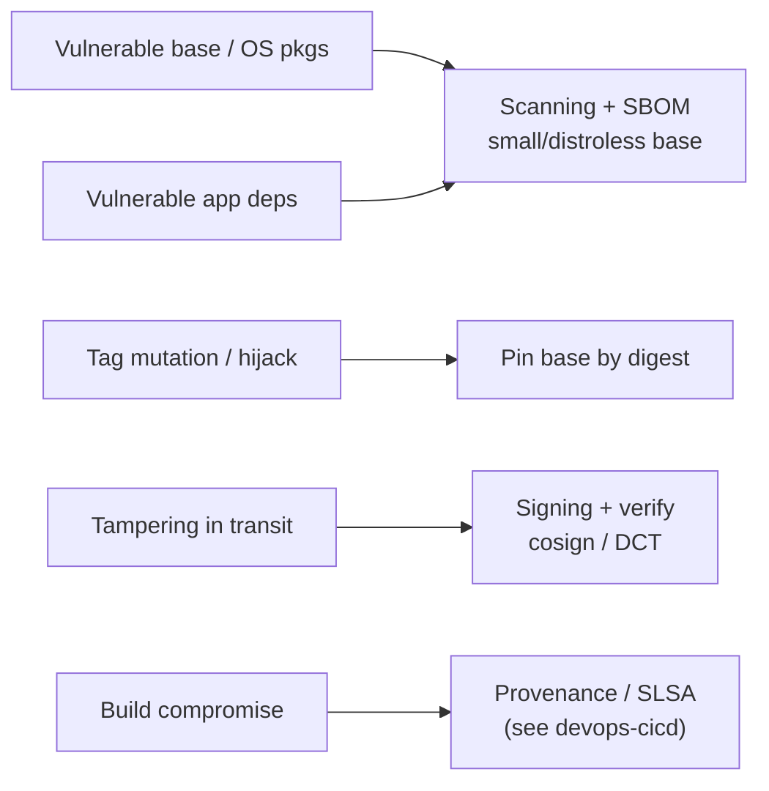
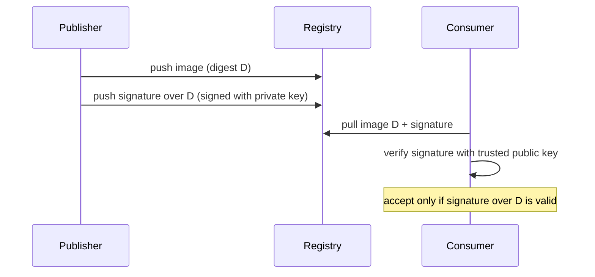
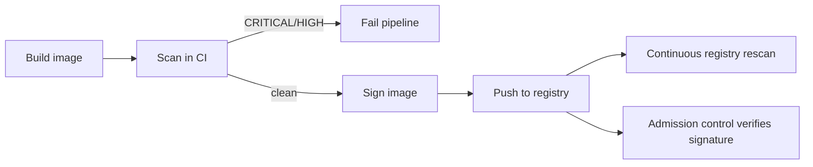

# Image Scanning & Supply-Chain Security

How you gain confidence that a container image is (a) free of *known* vulnerabilities
and (b) actually the artifact your pipeline built — not something tampered with in
transit or a hijacked base image. This topic owns the **Docker-image-specific** angle:
scanning image layers for CVEs, understanding what's inside an image (SBOM), signing and
verifying images, and pinning bases by digest.

For the general supply-chain framework — SLSA levels, provenance semantics, the broad
Sigstore/SBOM/attestation ecosystem across *all* build artifacts — see
`devops-cicd/software-supply-chain-security`. For distribution mechanics (registries,
tags vs digests, manifests) see `docker/registries-and-distribution`. For runtime
hardening (rootless, capabilities, seccomp) see `docker/docker-security`. Where
admission control / cluster policy is the consumer, we point onward to `kubernetes`.

> [!KEY-TAKEAWAY]
> A container image is a *supply chain*, not a single file: your app code + its language
> dependencies + a base image + the OS packages inside it, all pulled from the internet.
> Two questions matter — **"what known-vulnerable things are inside?"** (scanning + SBOM)
> and **"is this the exact image my pipeline produced?"** (signing + digest pinning).

---

## The image supply-chain threat model

Before tools, understand *what can go wrong*. A deployed image is assembled from many
inputs, each an attack surface:

- **Vulnerable base image** — `FROM node:20` drags in a Debian userland with dozens of
  OS packages (openssl, glibc, zlib…). A CVE in any of them is now *your* CVE, even if
  your code is perfect.
- **Vulnerable app dependencies** — the Log4Shell (`CVE-2021-44228`) class: a transitive
  library pulled by npm/pip/Maven with a known RCE.
- **Tag mutation / tag hijack** — `latest` (or any tag) is a *mutable pointer*. The
  `node:20` you built on last month may point to different bytes today. A compromised or
  typosquatted upstream can serve you a backdoored layer.
- **Tampering in transit / at the registry** — a man-in-the-middle or a compromised
  registry substitutes a malicious layer.
- **Build-system compromise** — the SolarWinds pattern: the attacker injects into the
  build, so the "clean" source produces a poisoned artifact. (Provenance/SLSA addresses
  this — see `devops-cicd`.)

The defenses map cleanly onto these:



> [!INTERVIEW]
> Senior signal: separate the two independent guarantees. **Scanning** answers "does this
> contain known-bad code?" — it says nothing about authenticity. **Signing** answers "did
> the party I trust produce this exact digest?" — it says nothing about whether the
> content is vulnerable. You need *both*; neither substitutes for the other.

---

## What image scanning actually finds

A scanner opens the image (its layers + config), inventories every installed component,
and matches each `(package, version)` against vulnerability databases. It finds two broad
classes:

1. **OS / distro packages** — the userland installed by the base image's package manager:
   `apk` (Alpine), `dpkg`/`apt` (Debian/Ubuntu), `rpm`/`yum` (RHEL/Amazon Linux). The
   scanner reads the package DB inside the image (e.g. `/lib/apk/db/installed`,
   `/var/lib/dpkg/status`) — not by "guessing" from filenames.
2. **Application / language dependencies** — parsed from lockfiles and installed
   metadata: `package-lock.json`/`node_modules`, `requirements.txt`/installed
   `*.dist-info`, `pom.xml`/JARs, `go.mod`/binary embedded module info, `Gemfile.lock`,
   `Cargo.lock`, etc.

It layers this against advisory sources: **NVD** (CVE + CVSS), distro advisories
(Red Hat OVAL, Debian Security Tracker, Alpine secdb, Amazon Linux ALAS), and the
**GitHub Advisory Database (GHSA)** for language ecosystems.

```bash
# Trivy: scan an image, show OS + language vulns
trivy image myorg/api:1.4.2

# Grype does the same, driven by a Syft SBOM under the hood
grype myorg/api:1.4.2

# Docker Scout (built into Docker Desktop / docker CLI)
docker scout cves myorg/api:1.4.2
```

**Worked example — reading a real scan report.** A student needs to *see* what comes
back. A representative Trivy OS-package table looks like this (values illustrative):

```
myorg/api:1.4.2 (debian 12.5)
Total: 3 (HIGH: 2, CRITICAL: 1)

┌───────────┬────────────────┬──────────┬──────────┬───────────────────┬───────────────┬──────────────────────────────┐
│  Library  │ Vulnerability  │ Severity │  Status  │ Installed Version │ Fixed Version │            Title             │
├───────────┼────────────────┼──────────┼──────────┼───────────────────┼───────────────┼──────────────────────────────┤
│ libssl3   │ CVE-2024-6119  │ HIGH     │ fixed    │ 3.0.11-1          │ 3.0.14-1      │ openssl: denial of service   │
│ zlib1g    │ CVE-2023-45853 │ CRITICAL │ affected │ 1:1.2.13.dfsg-1   │              │ MiniZip integer overflow     │
│ libpcre3  │ CVE-2017-11164 │ HIGH     │ affected │ 2:8.39-15         │              │ regex stack exhaustion       │
└───────────┴────────────────┴──────────┴──────────┴───────────────────┴───────────────┴──────────────────────────────┘
```

The layer that introduced each package comes from the base image (Debian 12.5 userland),
so the fix is "bump/rebuild the base," not edit your own `RUN`. Now walk three rows:

- **`libssl3` (row 1)** — installed `3.0.11-1`, fixed in `3.0.14-1`, status `fixed`. The
  scanner compared the two versions (`3.0.11-1 < 3.0.14-1`) and a vendor fix *exists*, so
  this fires and, being HIGH, **fails a `--severity CRITICAL,HIGH` gate**. `--ignore-unfixed`
  keeps it (it *is* fixable) — the remediation is to rebuild on a patched base.
- **`zlib1g` / `libpcre3` (rows 2-3)** — status `affected`, **Fixed Version is empty**: the
  distro has no patched build yet. These fire on a plain gate, but with
  `--ignore-unfixed` they are **dropped** because you can't remediate them today — that is
  exactly the trade-off `--ignore-unfixed` makes (fewer un-actionable blockers, at the
  cost of no longer tracking them unless you add an allowlist/SLA).
- **The backport false-positive that *isn't* in this table** — suppose the image also has
  `libc6 2.36-9` and NVD lists CVE-2023-XXXX as affecting glibc `2.36`. A naive
  NVD-version match would add a fourth row. But Debian *backported* the fix into
  `2.36-9+deb12u1` **without changing the upstream `2.36` number**. A distro-aware scanner
  reads Debian's OVAL advisory, sees the package marked *not-vulnerable* at that build,
  and **omits it** — so it never appears above. Matching NVD alone would over-report it.

> [!WARNING]
> A scanner only finds *known* CVEs that are *in its database*. A zero-day, an
> unpublished vuln, or a bug in your own code is invisible to it. Scanning is necessary,
> not sufficient — pair it with SAST/DAST (see `security`) and dependency review.

---

## Scanner landscape: Trivy, Grype, Docker Scout, Clair

All four inventory components and match against CVE data; they differ in packaging,
where they run, and DB strategy.

| Scanner | Maintainer | Model | Notes |
|---|---|---|---|
| **Trivy** | Aqua Security | CLI + CI, one binary | OS + language + IaC misconfig + secrets + license; DB is an OCI artifact pulled from a registry; `--exit-code` gating |
| **Grype** | Anchore | CLI + CI | Pairs with **Syft** (SBOM generator); can scan an SBOM directly, not just the image |
| **Docker Scout** | Docker | CLI + Hub + Dashboard | Integrated into Docker; builds an SBOM, `docker scout cves`, `compare`, base-image recommendations, policy |
| **Clair** | (originally CoreOS) / Quay | Server / API | Registry-side static analysis; pull-based; powers Quay's automatic scanning |

Key operational differences:

- **Trivy** ships as a single Go binary, ideal for CI; its vuln DB is distributed *as an
  OCI image* and cached locally, so scans are fast and offline-capable after the first
  pull.
- **Grype** decouples inventory (**Syft** produces the SBOM) from matching (Grype matches
  the SBOM against the DB). That means you can generate the SBOM once and rescan it later
  when new CVEs land — without rebuilding or re-pulling the image.
- **Docker Scout** is registry- and CLI-integrated and adds *remediation* guidance
  (recommends a newer/smaller base) and `docker scout compare` to diff two images' CVEs.
- **Clair** runs as a service and is typically embedded in a registry (Quay, Harbor uses
  Trivy/Clair) to scan on push.

> [!TIP]
> "Scan in CI *and* at the registry" is not redundant. CI catches problems before the
> image is published (fail the build); the registry re-scans continuously so newly
> disclosed CVEs against already-pushed images are surfaced without a rebuild.

---

## Base-image vulnerabilities & minimal / distroless bases

The single biggest lever on an image's CVE count is the **base image size**, because most
CVEs come from OS packages you never use. Fewer packages ⇒ fewer things that can be
vulnerable ⇒ smaller attack surface.

Rough hierarchy, largest/most-CVEs to smallest/fewest:

| Base | Contents | CVE surface |
|---|---|---|
| `ubuntu`, `debian` | full glibc userland, shell, apt, many libs | Highest |
| `node:20`, `python:3.12` | language runtime **on** a Debian base | High |
| `-slim` variants | trimmed Debian | Medium |
| `alpine` | musl libc, busybox, apk (~5 MB) | Low |
| **distroless** (`gcr.io/distroless/*`) | just the runtime + your app; **no shell, no package manager** | Very low |
| `scratch` | empty; only your static binary | Minimal |

**Distroless** images (`gcr.io/distroless/base`, `.../static`, `.../java`, etc.) contain
your app and its runtime dependencies but *no shell, no apt/apk, no coreutils*. Benefits:

- Far fewer OS packages ⇒ far fewer CVEs and less to patch.
- No shell ⇒ a big class of exploits (`sh -c`, living-off-the-land) and `docker exec`
  debugging is unavailable — an attacker who gets RCE has no shell to pivot with.

```dockerfile
# Multi-stage: build with a full toolchain, ship on distroless
FROM golang:1.22 AS build
WORKDIR /src
COPY . .
RUN CGO_ENABLED=0 go build -o /app ./cmd/api

FROM gcr.io/distroless/static-debian12:nonroot
COPY --from=build /app /app
USER nonroot
ENTRYPOINT ["/app"]
```

> [!WARNING]
> Distroless / `scratch` remove your debugging tools too — no `sh`, `ps`, `curl`. Debug
> with an ephemeral debug container (`docker debug`, or K8s ephemeral containers) or a
> multi-stage `debug` target, not by adding a shell to prod. See
> `docker/multi-stage-builds-image-optimization`.

Alpine caveat: `musl` (not `glibc`) occasionally causes compatibility/DNS issues and can
change performance for some workloads — smaller isn't automatically "correct" for every
app.

---

## Keeping bases updated & rebuild cadence

A crucial and counter-intuitive point: **an image that you never rebuild gets *more*
vulnerable over time, even though its bytes never change.** New CVEs are disclosed against
the OS packages and libraries frozen inside it. "Immutable image" ≠ "immune image."

So base-image freshness is a *cadence* problem, not a one-time fix:

- **Rebuild regularly** (e.g. nightly/weekly) so patched base images and updated packages
  are picked up — even when your source hasn't changed.
- **Re-run `apt/apk update && upgrade`** as part of the build (but see digest pinning
  below for the reproducibility tension).
- **Automated dependency PRs** — Dependabot / Renovate bump the `FROM` digest and lockfiles
  and open a PR that CI scans.
- **Continuous registry scanning** re-evaluates *already-published* images against today's
  DB, so you learn a shipped image is now vulnerable without rebuilding it.

> [!INTERVIEW]
> "You built and signed an image 6 months ago, deployed it, and changed nothing. Is it
> secure today?" — The correct answer is *not necessarily*: new CVEs may have been
> disclosed against its frozen packages. This is why continuous registry scanning +
> rebuild cadence exist, and why an old signed digest can still be vulnerable (signing
> proves authenticity, not safety).

---

## SBOM of an image — what's inside

A **Software Bill of Materials (SBOM)** is a machine-readable manifest of every component
in an image: OS packages, language dependencies, versions, and (often) licenses and file
hashes. It is the *inventory* that scanning and audit both build on.

Two dominant formats:

- **SPDX** (Linux Foundation / ISO standard)
- **CycloneDX** (OWASP)

Generate one with Syft, Docker Scout, or BuildKit:

```bash
# Syft: SBOM in CycloneDX JSON
syft myorg/api:1.4.2 -o cyclonedx-json > sbom.json

# Docker Scout
docker scout sbom myorg/api:1.4.2

# BuildKit can attach an SBOM (and provenance) as an attestation at build time
docker buildx build --sbom=true --provenance=true -t myorg/api:1.4.2 --push .
```

Why an SBOM matters:

- **Fast re-assessment**: when the next Log4Shell drops, you query stored SBOMs — "which
  of our 400 images contain log4j-core < 2.15?" — instead of rescanning every image.
- **Compliance / audit** (US EO 14028 pushed SBOMs into procurement).
- **Decoupled scanning**: Grype scans an SBOM directly, so you can rescan without the
  image.

BuildKit can attach the SBOM as an **attestation** stored in the image index alongside the
manifest, so the SBOM travels *with* the image in the registry.

> [!TIP]
> Distinguish **SBOM** (what components are inside) from **provenance/attestation** (how
> and where it was built — the SLSA concern). BuildKit emits both as attestations;
> `docker buildx build --provenance=true` records the build inputs. Deep SLSA framework:
> `devops-cicd/software-supply-chain-security`.

---

## Image signing & verification — Docker Content Trust / Notary

**Signing** cryptographically binds a publisher's private key to an image *digest*, so a
consumer can verify (with the public key) that the image is authentic and unmodified —
**tamper-evidence and provenance of publisher**. It does *not* say the image is
vulnerability-free.

**Docker Content Trust (DCT)** was Docker's original signing mechanism, built on **Notary
v1**, which implements **TUF (The Update Framework)**. Enable it per-shell:

```bash
export DOCKER_CONTENT_TRUST=1
docker push myorg/api:1.4.2   # signs the pushed tag
docker pull myorg/api:1.4.2   # refuses unsigned/tampered content
```

DCT signs *tags* and provides freshness/rollback protection via TUF timestamp metadata.
The mechanism, in one breath: TUF has a short-lived **timestamp role** that is re-signed
frequently and expires quickly (hours/days). A malicious or lagging mirror that serves you
an *old* snapshot (a rollback/freeze attack — "here's last month's un-patched signed
image, pretend nothing changed") gets caught because its timestamp metadata has expired,
and the client rejects expired metadata. That expiry clock is what turns "these bytes were
validly signed once" into "these bytes are still the *current* signed release."
Limitations that made the industry move on:

- Tied to Docker Hub / a Notary server; awkward key management; poor CI ergonomics.
- **Notary v2 → "notation"** and the OCI **referrers** model, and separately **Sigstore/
  cosign**, have largely superseded DCT for new work.



---

## Cosign & Sigstore — keyless signing and transparency

**Cosign** (part of the **Sigstore** project) is the modern standard for signing OCI
images. It stores the signature *as a separate OCI artifact in the same registry*,
referenced from the image digest — no separate Notary server required.

```bash
# Key-pair signing
cosign generate-key-pair
cosign sign  --key cosign.key  myorg/api@sha256:abc123...
cosign verify --key cosign.pub myorg/api@sha256:abc123...
```

Cosign's headline feature is **keyless signing**: instead of a long-lived private key, it
uses short-lived certificates from an OIDC identity:

- **Fulcio** — a CA that issues a short-lived (≈10 min) code-signing cert bound to your
  OIDC identity (e.g. a GitHub Actions workflow identity, or a Google/GitHub login).
- **Rekor** — a public, append-only **transparency log** that records the signature, so
  the signing event is tamper-evidently auditable even after the ephemeral key is gone.

If there's no public key to hold, what does `cosign verify` actually check against? Three
things: (1) the signing certificate **chains to the trusted Fulcio root CA** (baked into
the client's trust root), (2) the cert's embedded **identity + OIDC issuer match** the
`--certificate-identity` / `--certificate-oidc-issuer` you expect (e.g. *exactly* that
GitHub workflow from `token.actions.githubusercontent.com`), and (3) the signature has a
**Rekor inclusion proof** — it's recorded in the transparency log, which also lets
verification succeed after the ≈10-min cert has long expired (Rekor timestamps *when* it
was signed). Trust thus shifts from "a key you protect" to "an identity + a public log."

```bash
# Keyless: uses OIDC (e.g. GitHub Actions) + Fulcio + Rekor
cosign sign myorg/api@sha256:abc123...
cosign verify \
  --certificate-identity "https://github.com/myorg/repo/.github/workflows/release.yml@refs/heads/main" \
  --certificate-oidc-issuer "https://token.actions.githubusercontent.com" \
  myorg/api@sha256:abc123...
```

> [!KEY-TAKEAWAY]
> Cosign always operates on the **digest**, not a tag — because a tag is mutable, signing
> a tag is meaningless. You sign `repo@sha256:…`. Keyless signing removes long-lived key
> management (a common leak vector) at the cost of depending on Fulcio/Rekor availability
> and OIDC identity.

Cosign can also sign *and* attach attestations (SBOM, provenance, SLSA) to the same image
via `cosign attest`.

---

## Pinning base images by digest

`FROM node:20` pins nothing durable — the `node:20` tag is a mutable pointer that upstream
re-points at new bytes on every patch release. Two builds of the "same" Dockerfile weeks
apart can produce different images. Pinning `FROM ... @sha256:<digest>` makes the base
**content-addressed and immutable**:

```dockerfile
# Floating tag — reproducibility hazard + tag-hijack surface
FROM node:20-slim

# Pinned by digest — byte-for-byte reproducible; tag re-points can't affect you
FROM node:20-slim@sha256:2b3f1e...c9
```

Where does that `sha256:` come from? You don't hand-copy it from Docker Hub — resolve it:

```bash
# Preferred: inspect the tag's manifest digest without pulling the whole image
docker buildx imagetools inspect node:20-slim | grep Digest
# → Digest: sha256:2b3f1e...c9

# Or, if you've already pulled it, read the repo digest off the local image
docker inspect --format '{{index .RepoDigests 0}}' node:20-slim
# → node:20-slim@sha256:2b3f1e...c9
```

Renovate/Dependabot write and bump this digest for you automatically, so in practice you
pin once and let the bot open PRs — you rarely type the hash by hand.

Why pin:

- **Reproducibility** — the same Dockerfile always resolves to the same base bytes; builds
  are deterministic and cache behaves predictably.
- **Tag-hijack / mutation defense** — if an attacker (or a mistaken push) re-points
  `node:20`, your build is unaffected; you'd only move when you deliberately bump the
  digest.
- **Auditability** — the exact base is recorded in git.

The tension: a pinned digest never gets security updates automatically — so pin **and**
automate bumps (Renovate/Dependabot open PRs that update the digest, which CI then
scans). Pinning without a bump process is how you end up frozen on a vulnerable base.

> [!WARNING]
> Pinning by digest and never updating is a common anti-pattern: you trade "unexpected
> changes" for "silently rotting on old CVEs." Digest pinning is only safe paired with an
> automated update + rescan loop.

---

## Scanning in CI and at the registry — gating on severity

First, what does "Critical/High" *mean*? Severity comes from **CVSS** (Common
Vulnerability Scoring System), a 0–10 score. The bands: **None 0.0**, **Low 0.1–3.9**,
**Medium 4.0–6.9**, **High 7.0–8.9**, **Critical 9.0–10.0**. So `--severity CRITICAL,HIGH`
means "score ≥ 7.0." One catch: distros often assign their *own* severity that overrides
NVD's base score (e.g. Red Hat may rate a glibc CVE Moderate where NVD says High, because
it accounts for their compile flags), so the label a distro-aware scanner shows can differ
from the raw NVD number for the same CVE.

Scanning has value only if a *policy* acts on the result. The standard pattern is **fail
the build on Critical/High**:

```bash
# Trivy in CI: exit non-zero if any CRITICAL/HIGH is found → fails the pipeline stage
trivy image --exit-code 1 --severity CRITICAL,HIGH --ignore-unfixed myorg/api:1.4.2
```

```yaml
# GitHub Actions sketch
- name: Scan image
  run: |
    trivy image --exit-code 1 --severity CRITICAL,HIGH \
      --ignore-unfixed ${{ env.IMAGE }}
```

Design choices that matter in interviews:

- **`--ignore-unfixed`** — don't fail on CVEs that have *no vendor fix available* yet
  (otherwise you block deploys on things you can't remediate). Trade-off: you also stop
  tracking them, so pair with an allowlist/SLA.
- **Severity threshold** — gate on Critical/High, warn (not block) on Medium/Low, to keep
  the pipeline actionable and avoid alert fatigue.
- **`.trivyignore` / VEX** — suppress specific CVE IDs with a documented justification
  (e.g. not exploitable in your context). VEX (Vulnerability Exploitability eXchange)
  formalizes "present but not exploitable."
- **Registry-side scanning** (ECR scan-on-push, Harbor, Quay) re-scans continuously and
  catches CVEs disclosed *after* the image passed CI.



---

## Admission control — verifying signatures at deploy

Signing is pointless unless something *verifies* the signature and *rejects* unsigned or
untrusted images at deploy time. On a single Docker host, `DOCKER_CONTENT_TRUST=1` gates
pull. In orchestrated environments (the far more common case), an **admission controller**
enforces policy on the cluster — this is where signing pays off at scale.

Typical enforcement:

- Only images signed by our key / our CI identity may run.
- Only images from approved registries.
- Only images that passed scanning (below a severity threshold).

Tools (the *consumer* of signatures — cluster-side, so this straddles into `kubernetes`):

- **Sigstore policy-controller** / **Connaisseur** — verify cosign signatures on admission.
- **Kyverno**, **OPA Gatekeeper** — general policy engines with image-verification rules.

> [!INTERVIEW]
> Interviewers probe the *full loop*: sign in CI (cosign, on the digest) → push → admission
> controller verifies the signature and provenance before scheduling. Missing the
> verification step is the classic gap — "we sign images" with nothing checking them buys
> nothing. Deep cluster mechanics: the upcoming `kubernetes` domain.

---

## Scanner accuracy, false positives & limitations

Senior engineers know scanners are noisy and reason about *why*:

- **Only known CVEs, only in the DB** — no zero-days, no logic bugs, no misconfig unless
  the scanner also does IaC/secret scanning (Trivy does). DB freshness is decisive: an
  out-of-date DB misses recent CVEs.
- **Backported fixes → false positives** — distros like Red Hat/Debian *backport* security
  fixes without bumping the upstream version number. A naive version match flags the
  package as vulnerable when the distro already patched it. Distro-aware scanners consult
  the vendor advisory (OVAL) to avoid this — matching against NVD-only data over-reports.
- **`--ignore-unfixed`** trims CVEs with no available fix so the pipeline stays actionable.
- **VEX / suppression** — document *why* a flagged CVE is not exploitable (not reachable,
  compiled out) rather than blanket-ignoring.
- **Reachability** — a CVE in a dependency you never call at runtime is lower-risk than one
  on a hot path; newer tools add reachability analysis, but classic scanners report
  presence, not exploitability.
- **Layer attribution** — scanners can tell you *which layer* introduced a vulnerable
  package (`docker scout` / `trivy` show it), guiding whether to fix the base or your own
  `RUN`.

> [!WARNING]
> Treating every scanner finding as a hard blocker leads to alert fatigue and ignored
> reports. Effective programs triage: gate on fixable Critical/High, track the rest with
> an SLA, and record suppressions with justification.

---

## Common follow-up questions

- **Scanning vs signing — what does each guarantee?** Scanning = "no *known* vulnerable
  components inside." Signing = "authentic, produced by whom I trust, untampered." They're
  orthogonal; you need both. A signed image can be vulnerable; a clean scan can be a forged
  artifact.
- **Why does a smaller base image have fewer CVEs?** Fewer OS packages ⇒ fewer components
  that can have advisories. Distroless/`scratch` strip the shell and package manager
  entirely, shrinking both CVE count and attack surface.
- **Why pin the base by digest, and what's the downside?** Reproducibility + tag-hijack
  defense; downside is it never auto-updates, so you must automate digest bumps + rescan.
- **My image passed the scan 3 months ago — still safe?** Not necessarily; new CVEs may
  have been disclosed against its frozen packages. Continuous registry scanning + rebuild
  cadence address this.
- **Why is Trivy flagging a Red Hat package the vendor says is patched?** Backported fix:
  the version string is unchanged but the fix is applied. Use a distro-advisory-aware
  scan; don't match against NVD alone.
- **What's the difference between DCT/Notary and cosign?** DCT = Notary v1 / TUF, signs
  tags, needs a Notary server, tied to Docker Hub. Cosign = Sigstore, signs the digest,
  stores the signature as an OCI artifact in the same registry, supports keyless
  (Fulcio + Rekor). Cosign is the modern default.
- **What does keyless signing actually remove?** Long-lived private keys (a top leak
  vector). Fulcio issues a short-lived cert bound to your OIDC identity; Rekor logs the
  event for audit.
- **SBOM vs provenance?** SBOM = *what's inside* (components). Provenance = *how/where it
  was built* (SLSA). BuildKit emits both as attestations.
- **Where does the actual SLSA/framework detail live?** `devops-cicd/software-supply-chain-security`.

## References

- Trivy docs (scanners, coverage, DB): <https://trivy.dev/latest/docs/>
- Trivy CLI (`trivy image`, `--exit-code`, `--severity`): <https://trivy.dev/latest/docs/references/configuration/cli/trivy_image/>
- Grype: <https://github.com/anchore/grype> · Syft (SBOM): <https://github.com/anchore/syft>
- Docker Scout: <https://docs.docker.com/scout/>
- Clair: <https://github.com/quay/clair>
- Distroless images: <https://github.com/GoogleContainerTools/distroless>
- Sigstore / cosign: <https://docs.sigstore.dev/> · <https://github.com/sigstore/cosign>
- Fulcio: <https://docs.sigstore.dev/certificate_authority/overview/> · Rekor: <https://docs.sigstore.dev/logging/overview/>
- Docker Content Trust / Notary: <https://docs.docker.com/engine/security/trust/> · <https://github.com/notaryproject/notary>
- BuildKit attestations (SBOM/provenance): <https://docs.docker.com/build/metadata/attestations/>
- SPDX: <https://spdx.dev/> · CycloneDX: <https://cyclonedx.org/>
- CIS Docker Benchmark: <https://www.cisecurity.org/benchmark/docker>
- SLSA framework: <https://slsa.dev/>
