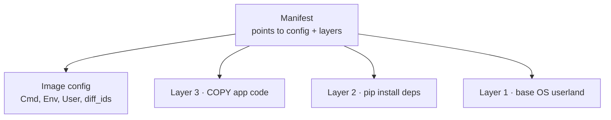
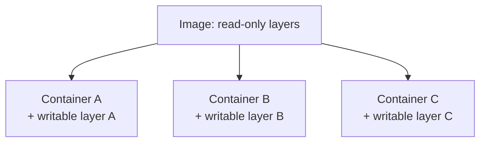
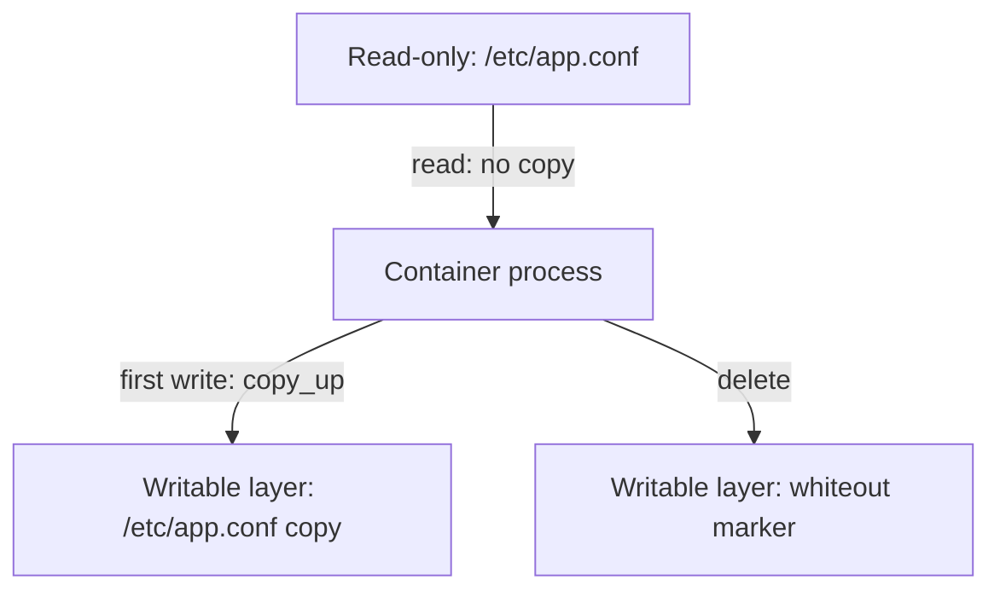
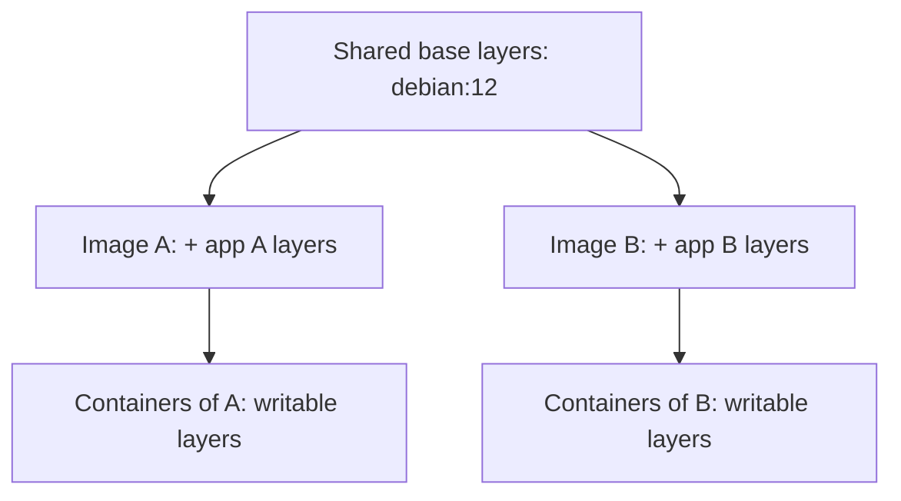
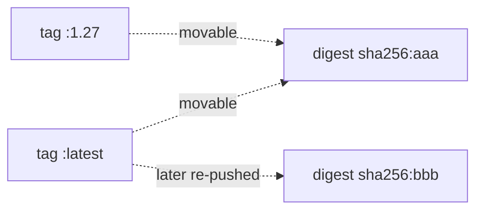
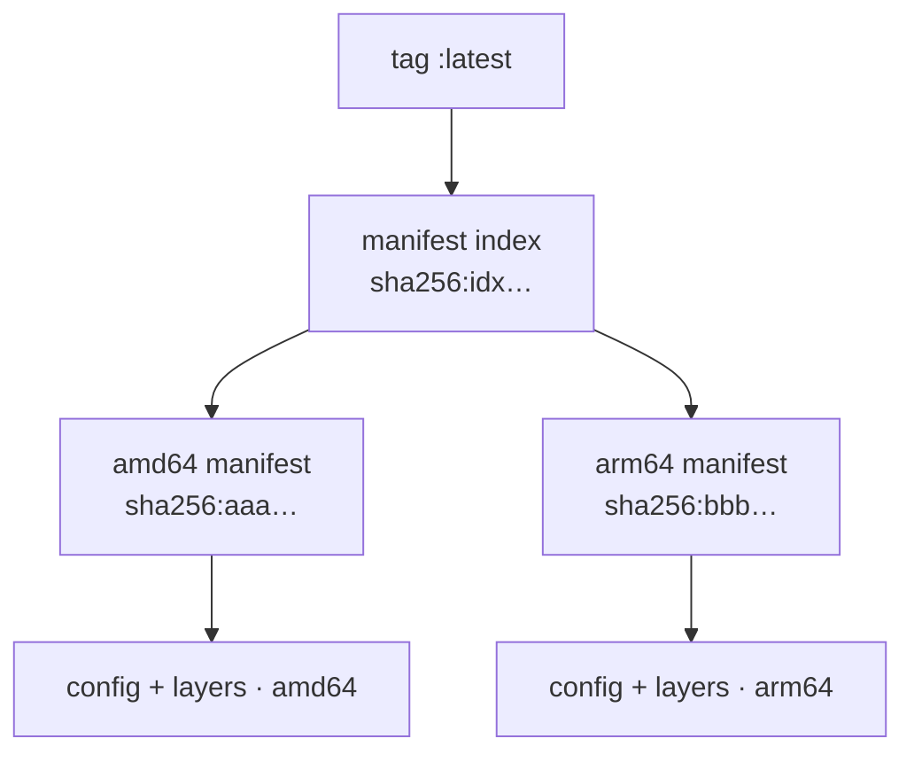
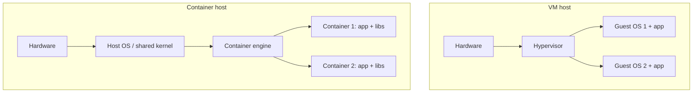
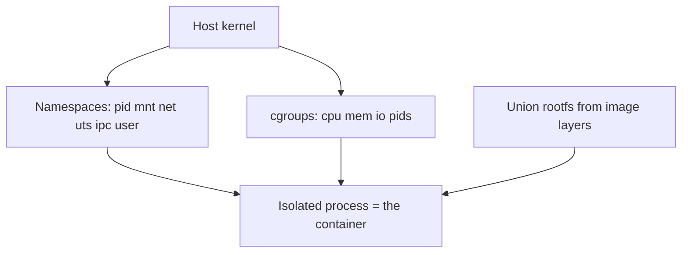
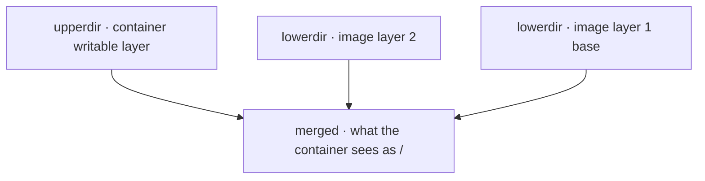
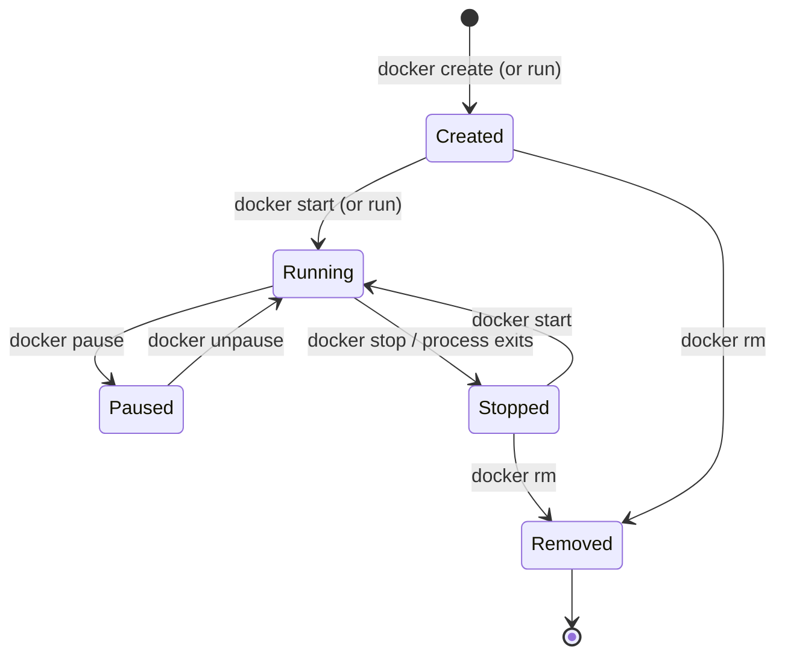

# Docker Fundamentals: Images vs Containers

Run five nginx containers on one laptop, then ask the host what they cost. `docker ps -s`
answers with two numbers per container: a size of `2B`, and a virtual size of about 197 MB.
Multiply the second number out and five containers should have eaten 985 MB; check the disk
and roughly 197 MB has gone. Four of those five copies were never written down anywhere. That
gap between the two readings is the whole difference between an image and a container. So
which part is stored once, which part belongs to each container, and why is the per-container
part almost free?

> [!TIP]
> **Reading map.** About 35 minutes. The first four sections carry the mechanism every later one
> reuses, so read those in order. If you can already say what an image stores and what a container
> adds on top, start at
> [Copy-on-write and the thin writable layer](#copy-on-write-and-the-thin-writable-layer). If you
> have run VMs in production, the table in [Container vs virtual
> machine](#container-vs-virtual-machine) will hold no surprises — jump to its seam, where the
> shared-kernel isolation limit is priced. Everything else is context.

---

## Image: the immutable read-only template

Nothing inside an image changes after `docker build` finishes. Copy a file into a built image
and you have not edited that image; you now have a second image that reuses the first one's
bytes and stacks one more piece on top. That piece is a **layer** — a read-only set of
filesystem changes (files added, modified or removed), shipped as one tar blob and named by a
checksum of the blob's bytes.

An image is **immutable** in exactly that sense: you never edit one, you build a new one. The
payoff is that a build can be cached, and that the artifact you tested in CI is the artifact
that runs in production — provided you name that artifact by something that cannot move. That
is the whole of "build once, run anywhere."

Stacked layers are only half of what a registry hands you. An image also carries the
instructions for turning that pile of files into a running program: which command to launch,
as which user, in which directory, with which environment variables and which ports declared.
Docker's own docs describe an image as a standardized package holding all of the files,
binaries, libraries and configurations needed to run a container — the configuration half
matters as much as the file half.

So an OCI image is not one blob. It is three kinds of content-addressed object, each named by
its own checksum:

- a manifest — the top-level list, naming the config object and the ordered layer blobs;
- an **image config** — the metadata: default `Cmd`/`Entrypoint`, `Env`, `WorkingDir`, `User`,
  exposed ports, plus `rootfs.diff_ids` and the build `history`;
- the layer blobs — usually gzipped tarballs of filesystem diffs.



An image is layers plus config, and nothing else. There is no process in it, no writable
space, no memory, no IP address.

If it helps to picture it: the image is a recipe shipped together with its ingredients, frozen
in place. The config is the recipe — the steps, the oven temperature, who cooks. The layers are
the frozen ingredients. Cooking from it produces a meal, and throwing the meal away leaves the
recipe and the freezer untouched. Where this picture stops working: cooking consumes the
ingredients, and a container consumes nothing at all. The layers stay read-only, so a thousand
meals come out of one unchanged freezer.

### Inside the config: how the metadata finds the layers

`rootfs.diff_ids` is an ordered list, and the order is the stacking order: first entry
bottom, last entry top. Swap two entries and you get a different image with different
behaviour, because a file in a later layer shadows the same path in an earlier one.

The manifest and the config name the same layers by different checksums, which is why one
layer can show up under two hex strings. The manifest names each blob as it travels — usually
gzipped, so the checksum is of compressed bytes. `rootfs.diff_ids` names each layer as it
lands on disk, after decompression. Compress one layer at two different settings and you get two
different manifest entries for a single unchanged `diff_id`.

The `history` array records one entry per build step, including steps that produced no layer
at all — an `ENV` or a `WORKDIR` changes only config, and the spec marks such an entry
`empty_layer`. That is why `docker history` can print more rows than the image has layers: the
extra rows are the steps that changed config and shipped no files.

Layers and config are inert on their own. Running one takes a second ingredient.

## Container: a running instance of an image

Creating a container adds exactly one thing to the image: somewhere to write. `docker create`
stacks a new, empty layer on top of the image's read-only ones and hands the result to the
process as its `/`. `docker start` then launches the command from the config inside a set of
kernel isolation features, and every byte the program writes from then on — a log file, a temp
file, an in-container SQLite database — lands in that new top layer, never in the image
underneath.

That top layer is the **writable layer**: one thin layer the container may write to, stacked on
the image's read-only ones, born with the container and deleted with it. A container is that stack
plus a running process, and a process brings runtime state the image never had: a PID, an IP
address, open ports, memory, and eventually an exit code.

One image can back many containers, and each gets its own writable layer:

| Concept | Image | Container |
|---|---|---|
| Nature | Immutable template | Live (or created) instance |
| Filesystem | Read-only layers only | Read-only layers + thin writable layer |
| State | None (static artifact) | Runtime state: running process, PID, network, writes |
| Cardinality | One | Many per image |
| Lifecycle op | `docker build` / `docker pull` | `docker run` / `docker create` |
| Persistence of changes | N/A | Lost when the container is removed (unless a volume is used) |



That table is the class-and-instance relationship from object-oriented programming, relation
for relation: one class, many instances; the class holds the definition, each instance holds
its own state; you cannot mutate the class by mutating an instance. Where the picture stops
working: a class is a description the compiler consumes, while an image is a real object on
disk that you can list, copy, sign and ship. Run `docker rm` and you destroy an instance;
`docker rmi` is what deletes the definition.

> [!WARNING]
> "The container is stopped, so my data is safe on disk" is half true and dangerous. Stopping a
> container keeps its writable layer; `docker rm` discards it, along with everything the process
> ever wrote there. Anything that must outlive one container — uploads, a database — belongs on
> a volume or a bind mount, which sit outside the layer stack entirely.

### What it costs: reading `docker ps -s`

`docker ps -s` prints two sizes per container, and only one of them is disk this container
spent. `size` is the bytes in *this* container's writable layer. `virtual size` is that
writable layer plus all the shared read-only image data underneath it — a number that is mostly
the same number for every container of the same image.

Pull the Debian-based `nginx:1.27` tag, whose layers total roughly 197 MB on disk, and start
five containers from it. Each has written a couple of bytes of runtime state, so:

```
CONTAINER   IMAGE   SIZE               (= writable layer + virtual)
web1        nginx   2B (virtual 197MB)
web2        nginx   2B (virtual 197MB)
web3        nginx   2B (virtual 197MB)
web4        nginx   2B (virtual 197MB)
web5        nginx   2B (virtual 197MB)
```

Add the virtual sizes up and you get 5 × 197 MB = 985 MB. The disk shows about 197 MB,
because the read-only layers are stored once and read by all five: 197 MB counted once, plus
5 × 2 B of private writable layers. De-duplication saved about 788 MB here, and the saving
grows with every extra container, because the shared part never grows. So the answer to "I run
ten containers from one image, how much disk do the images use?" is one image's worth, not ten.

Adding virtual sizes is the mistake to unlearn: the shared 197 MB appears in all five rows and
exists once. Only the `size` column is additive. The 197 MB figure belongs to that
Debian-based tag and drifts with every base-image release; the `1.27-alpine` variant of the
same software is a fraction of it, so read a size as "what this tag measured today", never as a
property of nginx.

Writable layers start at nearly zero even when the image underneath is large. Keeping them
that way has a price, and it is charged on the first write.

## Copy-on-write and the thin writable layer

Reading a 2 GB file inside a container costs nothing, and appending one byte to it costs
2 GB. Both numbers come from the same rule: the container shares the file with the image
until the moment it tries to change it, and at that moment it gets a private copy. Sharing
until first write, then copying, is **copy-on-write** — CoW from here on. Docker's own
storage-driver docs call it a strategy of sharing and copying files for maximum efficiency.

Three rules cover every access a container can make to a file it did not create:

- A read of a file that exists only in a lower image layer: the process reads it straight
  from the shared read-only layer. No copy, no extra disk.
- The first write or modify of such a file: the storage driver runs a `copy_up`, copying the
  whole file up into the writable layer, then applies the change to the copy. The container now
  sees its own version; the original stays untouched in the read-only layer and stays shared
  with every other container.
- A delete of such a file: the lower layer is read-only, so nothing is deleted there. The layer
  stack instead records a **whiteout** marker in the writable layer — a small entry meaning
  "this path is gone" — and the merged view the container sees stops showing the file.

Because the copy fires only on first modification, starting a container and reading everything
in it is free in disk terms. The cost is paid once per file, at its first write, and it is the
size of the file rather than the size of the change.



> [!WARNING]
> "It is one byte, so it costs one byte" is the belief to lose here. A **`copy_up`** copies the
> entire file however small the change, and a change that writes no data at all can trigger it
> too: Docker's storage-driver docs count a metadata-only edit as a `copy_up` trigger, so a
> `chmod` or `chown` on a 2 GB file can copy all 2 GB into the writable layer.

### Where it breaks: the 2 GB file trap

Suppose the image ships a 2 GB `data.bin` in a read-only layer. Trace the writable layer:

| Step | Action | Writable layer size |
|---|---|---|
| 1 | `docker run` — container starts, `data.bin` is read-only-shared | 0 B |
| 2 | `cat data.bin > /dev/null` — pure read | 0 B (read straight from lower layer) |
| 3 | `echo x >> data.bin` — first write triggers `copy_up` | ~2 GB (entire file copied into the writable layer, then 1 byte appended) |

One appended byte cost 2 GB of writable-layer disk. Put `data.bin` on a volume instead and the
same `echo x >>` writes in place, leaving the writable layer at about 0 B, because a volume is
mounted past the layer stack and its writes never pass through it. Two GB versus
nothing, for one identical write, is why databases, uploads and any other large or write-heavy
file belong on a volume rather than the container filesystem.

Time behaves like disk here. Before the driver can copy a file up, it has to find it, and it
searches the layers from the newest down to the base. Large files, many layers and deep
directory trees all make that first write noticeably slower. Later writes to the same file hit
the local copy and run at normal speed. The search order itself, and what each driver
does differently, belong to `image-internals-storage-drivers`.

Cheap writable layers only pay off if the layers underneath them are genuinely shared, which
is a property of how layers are named.

## Layers are shared across containers and images

Two images built `FROM debian:12` do not store Debian twice. Each layer is named by the
SHA-256 checksum of its own contents, so the base layers of both images produce the identical
name, and the daemon keeps one copy. That kind of name is a **digest**: the SHA-256 of a blob's
exact bytes, which means it names the content itself and cannot be pointed somewhere else. Run
`docker image inspect` on both images and the shared layers show the identical digests.

One question decides every payoff below: who else may reuse a layer whose digest you already
have? Anyone, is the answer, and that plays out in three directions.

- Across containers of one image — every container of `python:3.12` reads the same read-only
  layers on disk, and only their writable layers differ.
- Across different images — the two `debian:12` children above hold the base once between them
  and store only their own extra layers separately.
- Across the network — a pull asks the registry only for digests the host is missing, so
  fetching a new tag of an image whose base you already have transfers just the changed layers,
  which reduces both network bandwidth and storage.



The accounting follows the sharing, and it is why two Docker commands disagree about your
disk. `docker images` prints each image's own full size, counting every shared layer once per
image; `docker system df` totals the layers actually on disk, so its images figure lands below
the sum of the rows above it whenever images share layers. "The image is 900 MB and I have 40
of them and the disk is not full" resolves the same way: the shared layers are not stored 40
times.

Organisations standardise on one slim base image to buy this deliberately. Every image built on
that base stores and transfers the shared part once, so pulls get faster and disk use drops as
more teams adopt it — a compounding return that a fleet of unrelated bases throws away.

Layers are named by content, so their names cannot lie. The names people actually type are a
different story.

## Image identity: repository, tag, and digest

Two hosts can pull `nginx:1.27` an hour apart and run different code. The full form of a
reference is `registry/repository:tag` — `docker.io/library/nginx:1.27-alpine` spelled out in
full — and two of those three parts are filled in for you when you leave them off. Omit the
registry and Docker Hub (`docker.io`) is assumed. Omit the tag and `:latest` is assumed.
Official images live under the `library/` namespace, so with both defaults filled in, `nginx`
alone resolves to `docker.io/library/nginx:latest`.

A tag is a label the publisher can move to a different image whenever it likes, and that is the
entire reason those two hosts diverged. `:latest` has no magic in it: it is not "the newest
version", it is the default tag name, pointing at whatever was pushed to it last. Version tags
are safer only by convention — nothing in the format stops a publisher from re-pushing
`:1.27`.

A digest cannot move, because it is derived from the bytes it names. `nginx@sha256:abcd…` is
the SHA-256 of the manifest a registry serves for that reference, so it resolves to the same
manifest, the same config and the same layers forever, and `FROM nginx@sha256:…` gives a build
that is both reproducible and tamper-evident: change one byte anywhere and the digest no longer
matches.



> [!WARNING]
> "We pin our base image, we use `:latest`" is the belief that ships the bug. A tag is a movable
> pointer, so the same tag pulled on two hosts at different times can run different code — with
> no error, no warning, and a diff you cannot see. Pin a digest, or an immutable version tag your
> pipeline never re-pushes.

The short hex string `docker images` prints is a third identifier, and it is not either of the
two above. That is the **image ID**: the digest of the image config object, computed locally,
which is why it identifies an image on your host. What `pull` and `push` exchange with a
registry, and what `@sha256:` means in a reference, is the manifest digest instead. The same
image therefore has more than one legitimate digest, and quoting the local one to a registry
finds nothing.

### The version-specific truth: a tag usually names an index, not one manifest

On Docker Hub today, `nginx:latest` does not resolve to one manifest. It resolves to a list of
manifests, one per platform — amd64, arm64 and more. Docker calls that list a manifest list; the
OCI spec calls it an **image index**: one manifest whose entries are the per-platform manifests.
Both names denote the same object, and this domain says image index from here on. A pull fetches
the index first, reads which platforms are on offer, and then fetches only the manifest matching
the host's CPU architecture.



An index makes "pin by digest" ambiguous, because there are now two digests you could pin and
they behave differently. Pin the index digest, `nginx@sha256:idx…`, and you get one
reproducible, tamper-evident reference that still picks a platform at pull time: the same line
brings amd64 to an x86 CI runner and arm64 to an Apple Silicon laptop. Pin a per-arch manifest
digest, `sha256:aaa…`, and you have locked the reference to that one architecture; on the other
machine it runs only under emulation, if at all. So pin the index digest unless a
single-architecture build is what you actually want.

Every identity above assumes the host kernel will run the image. The next section prices that
assumption.

## Container vs virtual machine

A virtual machine boots an operating system; a container starts a process. Booting is why a VM
takes seconds to minutes and ships gigabytes, and not booting is why a container starts in
milliseconds and ships megabytes. Both isolate workloads, but they cut the stack at different
heights, and every other difference in the table follows from where the cut is.

| Aspect | Container | Virtual machine |
|---|---|---|
| Isolation unit | A process (or process tree) | A full guest OS |
| Kernel | Shares the host kernel | Its own guest kernel |
| Isolation mechanism | Kernel namespaces + cgroups | Hypervisor virtualizes hardware |
| Guest OS | None (just app + userland libs) | Full OS per VM |
| Size | MBs | GBs |
| Startup | Milliseconds–seconds (just start a process) | Seconds–minutes (boot an OS) |
| Density | Hundreds per host | Tens per host |
| Isolation strength | Weaker (shared kernel = shared attack surface) | Stronger (hardware-level boundary) |



One sentence generates the whole table: containers virtualize the operating system and share one
kernel, while VMs virtualize the hardware and each run a kernel of their own. Smaller, faster
and denser all come from the sharing. So does the cost, and the cost is isolation.

### Where it breaks: when one shared kernel is not enough

Two containers on a host are separated by kernel code. One kernel bug can therefore be a door
between them, and that is the honest reason a security team asks for VMs: two VMs are separated
by the hypervisor and a hardware boundary instead. The shared kernel is a shared attack surface.

Inside the shared-kernel model you narrow that surface rather than remove it. Seccomp filters
cut the set of system calls a container may make at all. Dropping capabilities takes privileges
away from root inside it. User namespaces map container root to an unprivileged host user.

Where that is not enough, platforms put a real kernel boundary back and keep the container
interface. Kata Containers runs the workload inside a lightweight virtual machine with a
dedicated kernel. Firecracker is the minimal micro-VM monitor AWS built so that such VMs start
fast enough to be worth it — as little as 125 ms to reach user space.

gVisor takes a different route to the same place. It is a kernel written in userspace: it
intercepts the container's system calls and acts as the guest kernel itself, instead of passing
those calls to the host kernel. Both routes aim at VM-grade isolation with container-like
ergonomics, and both charge for it differently. A micro-VM pays in startup time and memory,
because there is a kernel to boot per workload. gVisor pays per system call, and in
compatibility: its own kernel does not implement everything Linux does. Take either deal when
the workload is untrusted, such as code other people wrote.

> [!INTERVIEW]
> "Can a Linux container run a Windows image, or vice versa?" No. The container uses the host's
> kernel, so a Linux image needs a Linux kernel present. On Docker Desktop for Mac and Windows
> that kernel is supplied by a lightweight Linux VM the product runs for you, which is how
> "Docker on a Mac" works at all when macOS is not Linux.

One shared kernel is also why containers are small, quick to start and portable — three
effects with three separate mechanisms.

## Why containers are lightweight, fast, and portable

Forty containers of one 900 MB image do not need 36 GB of disk, and none of them keeps you
waiting for a boot. Each word in the heading has its own mechanical cause, and the three causes
reduce to one fact.

Containers are lightweight because there is no guest OS to ship. An image carries the
application plus the minimal userland it needs to run, and borrows the kernel that is already
running on the host, which is why images are measured in megabytes where VM disks are measured
in gigabytes, and why hundreds of containers fit where tens of VMs would. Layer sharing then
compounds it: those forty containers share one copy of the image's layers, so they cost roughly
one image's disk rather than forty.

Containers start fast because starting one is starting a process — the kernel sets up
namespaces and cgroups, then executes the command from the image config. Nothing boots: no
firmware, no kernel initialisation, no init system bringing up services. That is milliseconds
to low seconds against tens of seconds to minutes for a VM, and it is what makes autoscaling
that reacts to a traffic spike, one-container-per-job pipelines and fast CI practical rather
than theoretical.

Containers are portable because the image bundles every dependency — libraries, language
runtime, configuration — into one immutable artifact, so the target host needs only a
compatible kernel, a matching CPU architecture and a container runtime. "Works on my machine"
dies here, because the environment is the image rather than something assembled on arrival. The
architecture clause is the real limit and it bites in practice: an `amd64` image will not run
on `arm64` without emulation, so a laptop with an Apple Silicon chip and an x86 CI runner need
a multi-architecture image, not one build.

All three trace back to a single root cause: a container is a host process using a shared
kernel, running against an immutable layered filesystem. No guest OS to ship makes it
lightweight, no OS to boot makes it fast, and one self-contained artifact makes it portable.

The phrase carrying that root cause is "host process", and it is not a metaphor.

## A container is just a process

The container you just started is in the host's process table under its real name. Run
`docker run -d --name web nginx`, then `ps aux | grep nginx` on a Linux host, and the nginx
master process is listed there like any other daemon, in `ps` and in `top` alike — same kind of
PID, same scheduler, same kernel.
Nothing about it is a virtual machine. What makes it a container is that the kernel wrapped that
ordinary process in three things it does not normally have.

The first is a set of namespaces. A **namespace** gives a process a private view of one kind of
global kernel resource — the resource is still the host's, but the process sees only its own
slice. One question sorts the seven Docker can use: which resource does each hide? Three of
them build the container's private world: `pid` gives it its own process-number space, so the
first process inside is number 1; `mnt` gives it its own mount tree and therefore its own root
filesystem; `cgroup` hides the host's resource-control hierarchy. Two give it its own identity
to the outside: `net` gives it its own interfaces, IP addresses and port space, and `uts` its
own hostname. The last two draw privilege boundaries: `ipc` separates shared-memory and message
queues, and `user` maps user and group IDs, so a process may be root inside the container and an
unprivileged user outside — the basis of rootless containers.

Namespaces hide things but they do not ration anything, which is the job of the second wrapper.
A **cgroup** — control group — is the kernel feature that caps and accounts a process's use of
memory, CPU, block I/O and PIDs. `docker run --memory=512m --cpus=1.5` is not a Docker
invention; it writes cgroup limits, and the kernel enforces them on that process like any other.

The third is the filesystem itself: the image's layers are stacked into one filesystem, and
`chroot`/`pivot_root` makes that the process's `/`. Put the three together and there is
still no "container object" anywhere in the kernel. A container is an emergent bundle —
namespaces plus cgroups plus a root filesystem plus a process — which is exactly why the host's
`ps` can see through it.



### Where it breaks: when PID 1 is not your app

`CMD ["sh", "-c", "myserver &"]` starts a perfectly healthy server and the container exits
immediately. **PID 1** is the process the container starts as number 1 in its own `pid`
namespace, and the container lives exactly as long as that process and exits with its status
code. Here PID 1 is `sh`; `sh` forks `myserver` into the background, reaches the end of its
command line, and exits with status 0. Docker sees PID 1 gone and the container is over, server
and all. The rule that follows is blunt: whatever you want the container's life to track must
run in the foreground as PID 1, never behind a wrapper that backgrounds it.

Being PID 1 also carries duties the process may not have been written for. On Linux, PID 1
inherits orphaned processes and must reap them, or dead children accumulate as zombies; PID 1
also receives the signals sent to the container, so `docker stop`'s `SIGTERM` is delivered to
that process and not to its children, and a `SIGKILL` that lands on it takes the whole namespace
down with it. An application that ignores both jobs needs a tiny init process in front of it,
which is what `docker run --init` inserts. Namespace and cgroup theory in depth, plus the OCI
runtime that actually assembles all this, is `runtimes-oci-standards`.

The remaining piece is how a stack of read-only layers becomes one `/` that a process can use.

## The union filesystem: stacking layers into one root

An image's layers arrive on the host as separate directories, and the process inside needs one
`/`. A **union filesystem** — also called an overlay filesystem — performs the join: it stacks
the layers in order and presents a single merged view, in which a file in an upper layer hides
the file at the same path in every layer below. Ship `/etc/nginx/nginx.conf` in layer 3 and
again in layer 5 and the container sees only layer 5's copy. The writable layer is the topmost
member of that stack, which is why a container can appear to have a fully writable filesystem
while almost all of it is read-only and shared.

On Linux, Docker does this through a storage driver, and `overlay2` is the one it has used for
years: a thin translation onto the kernel's own OverlayFS. Of the storage drivers it is the one
Docker picks by default on every supported distribution — Ubuntu, Debian, CentOS, Fedora, RHEL,
SLES 15 — and the most widely compatible across currently supported Linux distributions. Four
directories make up one container's view:

- `lowerdir` — the read-only image layers, stacked;
- `upperdir` — this container's writable layer;
- `merged` — the unified view the container sees as `/`;
- `workdir` — an empty scratch directory on the same filesystem as `upperdir`, which OverlayFS
  uses internally.

Every rule from earlier now has a directory attached to it. Reads resolve top-down through the
stack — `upperdir` first, then each `lowerdir` in turn — until a path matches. Writes go to
`upperdir`, arriving there by `copy_up` if the file started life in a lower layer. Deletes leave
the lower layers alone and record a whiteout in `upperdir`. That is the whole trick: the layers
stay read-only and shared while every container still gets a filesystem it can write to.



### What it costs: the drivers that are not overlay2

`vfs` is the driver with no copy-on-write at all, and it charges for every saving described so
far. Where overlay2 stacks directories, `vfs` deep-copies each layer from the one below it. So a
container starts with a full physical copy of the image: ten containers of a 900 MB image occupy
about 9 GB rather than roughly 900 MB. Each start also pays for that copy before the process
runs.

It survives because it needs nothing from the kernel — no overlay support, no special
filesystem. That makes it the fallback that always works, and the choice you never want in
production.

Other drivers sit between those poles for historical or filesystem-specific reasons. `aufs` is
the union filesystem Docker used in its early years. `btrfs`, `zfs` and `devicemapper` hand
copy-on-write down to a filesystem or block layer that already implements it. Overlay2 over
kernel OverlayFS is the Linux default among these, so a host reporting `vfs` is reporting that
something overlay2 needed was missing.

The layer stack explains what a container is made of; the next section covers how one comes into
existence and what states it passes through.

## docker run = create + start (and the lifecycle)

`docker run` is two commands wearing one name. `docker create` does the first half: it turns an
image into a container that exists but is not executing — allocating the writable layer, writing
down the configuration, leaving the container in `Created`. `docker start` does the second half:
it sets up the namespaces and cgroups and executes the command, moving the container to
`Running`.

Keeping the halves apart is occasionally exactly what you need. A container in `Created` has a
filesystem, so `docker create` followed by `docker cp` puts a config file or a fixture inside it
before anything runs, and `docker start` then finds it already in place. `docker run` gives you
no such window: it starts the process immediately, so any copy you make afterwards is racing
the program that reads it.



Two edges of that diagram cause most of the confusion. The first is that `docker run` always
creates a new container: run the same image three times and you now own three containers, two
of which you have forgotten about, each with its own writable layer on disk. Restarting the one
you already have is `docker start <name>`; not accumulating them in the first place is `--rm`,
which removes the container when it exits.

The second is that stopped is not removed. A stopped container still exists — `docker ps -a`
lists it, its configuration and its writable layer are still on disk, and `docker start` brings
it back with every earlier write intact. Only `docker rm` deletes the writable layer, and that
is the moment the data goes. In the foreground, `docker run` attaches your terminal to the
process's stdin, stdout and stderr; `-d` detaches and leaves it running in the background.

Every run makes a new container and every `rm` throws one away, which is not a nuisance to be
managed but a working style to adopt deliberately.

## Ephemeral and disposable containers (12-factor)

A container's writable layer dies with it, so the only safe assumption is that any container
can vanish at any moment. Treat them as cattle rather than pets: identical, numbered, replaced
without ceremony, never nursed back to health. The Twelve-Factor App calls this **disposability**:
processes must start fast and shut down gracefully, so that a platform may create and destroy them
at will. A container runtime imposes the same requirement whether or not anyone opted into it.

Four habits follow, and each trades a comfort for a property you want.

Keep containers stateless, and pay for it by putting durable data somewhere else — a volume, a
database, or object storage. Twelve-Factor's "backing services" and stateless-processes rules say
the same thing. What you buy is that any container can be killed and replaced by an identical one
with nothing lost, and no operator has to ask which host held the good copy.

Rebuild rather than repair, and pay for it by having no way to hot-fix a running container. You
do not `ssh` in and patch; you build a new image and replace the container. What you buy is a
rollback that is just redeploying the previous image, and the end of configuration drift, because
no running container carries a change that is not in an image somewhere.

Take configuration from the environment, and pay for it by keeping per-environment values out of
the layers. The same image then runs in staging and production, differing only by environment
variables and mounted files. What you buy along with that is secrets that were never baked into a
layer, where they would be readable by anyone who can pull the image.

Handle `SIGTERM` in PID 1, and pay for it by writing shutdown code you would rather skip. PID 1
is what receives the signal when a stop is requested, so it is the only place that can stop
accepting new work, finish what is in flight, and exit before the `SIGKILL` timeout arrives.
What you buy is that Docker — and Kubernetes, which schedules these same containers — can move
your workload around freely, because a graceful exit costs the platform nothing.

> [!INTERVIEW]
> "Where does a containerized app store its uploaded files, or its database?" The tempting answer
> is "in the container", and it is wrong twice: the writable layer is discarded with the
> container, and it is private to that one container, so a second replica cannot see the files.
> Use a volume or bind mount for local persistence, or an external managed service such as S3 or
> RDS.

That closes the loop the first `docker ps -s` reading opened. The shared 197 MB is the image:
immutable, content-addressed, stored once, and identical on every host that pulls the same
digest. The 2 B is the container: a writable layer, a process, some runtime state, and nothing
worth keeping. Everything valuable in the system lives in the first half or outside the system
altogether, which is exactly what makes the second half safe to throw away.

## Common follow-up questions

- "What is the difference between an image and a container?" An image is an immutable read-only
  template — layers plus config. A container is a running instance of it: the image's layers plus
  a thin writable copy-on-write layer, run as an isolated process. One image, many containers.
- "If I run 10 containers from one image, how much disk do the images use?" Roughly one image's
  worth. The read-only layers are shared; each container adds only its own, usually tiny, writable
  layer. `docker ps -s` shows both numbers.
- "What happens to data written inside a container when it's removed?" It is gone. `docker rm`
  discards the writable layer. Use volumes or bind mounts for anything that must survive.
- "Container vs VM?" A container shares the host kernel and is isolated by namespaces and
  cgroups, which makes it small, fast to start and weaker at the boundary. A VM runs its own
  guest kernel on a hypervisor: heavier, slower to boot, stronger isolation.
- "Why is `:latest` risky in production?" A tag is a mutable pointer the publisher can move, so
  two pulls of one tag can yield different images. Pin a digest, or a version tag nobody re-pushes.
- "What actually isolates a container?" Kernel namespaces for what it can see — `pid`, `mnt`,
  `net`, `uts`, `ipc`, `user` — and cgroups for what it may consume, over a union rootfs. It is
  still a host process.
- "Does `docker run` reuse an existing container?" No. It always creates a new one, as create plus
  start. Use `docker start` to resume an existing container.
- "Can a Linux image run on a Windows host, or the reverse?" Not directly: the image needs a
  compatible kernel. Docker Desktop runs Linux containers inside a hidden Linux VM.
- "What is copy-on-write and why does it matter for performance?" Files are shared read-only
  until first modified, then `copy_up` copies the whole file into the writable layer. Reads are
  free; the first write is not. Large or write-heavy files belong on a volume.
- "Why does my container ignore Ctrl-C and take 10 seconds to stop?" Almost always shell form
  versus exec form in `CMD`. `CMD nginx` runs as `/bin/sh -c "nginx"`, so `/bin/sh` is PID 1 and
  receives the `SIGTERM`, and a plain shell does not forward it, so your app never hears it —
  Docker waits out the timeout and then `SIGKILL`s the tree, with no graceful drain.
  `CMD ["nginx"]` makes nginx itself PID 1, so it gets the signal directly. Fix it with exec
  form, or with an init such as `--init` or `tini` that forwards signals and reaps zombies.
- "Why does `docker system df` report less than the sum of my image sizes?" Because shared layers
  are counted once on disk but once per image in `docker images`.

## References

- Docker Docs — *What is an image?* and *What is a container?* (Docker concepts / Get started):
  https://docs.docker.com/get-started/docker-concepts/the-basics/what-is-an-image/
- Docker Docs — *Storage drivers* (copy-on-write, thin writable layer, overlay2):
  https://docs.docker.com/engine/storage/drivers/
- Docker Docs — *Use the OverlayFS storage driver*:
  https://docs.docker.com/engine/storage/drivers/overlayfs-driver/
- OCI Image Spec (manifest, config, layers, digests):
  https://github.com/opencontainers/image-spec/blob/main/spec.md
- OCI Runtime Spec (container = config + rootfs run by a runtime):
  https://github.com/opencontainers/runtime-spec/blob/main/spec.md
- Linux `namespaces(7)` and `cgroups(7)` man pages:
  https://man7.org/linux/man-pages/man7/namespaces.7.html ·
  https://man7.org/linux/man-pages/man7/cgroups.7.html
- The Twelve-Factor App — *Disposability* and *Processes*: https://12factor.net/disposability
- Docker Docs — *Docker overview*: https://docs.docker.com/get-started/docker-overview/

