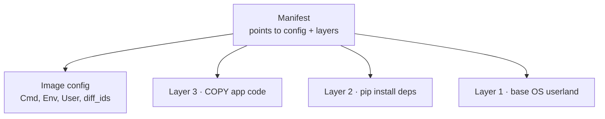
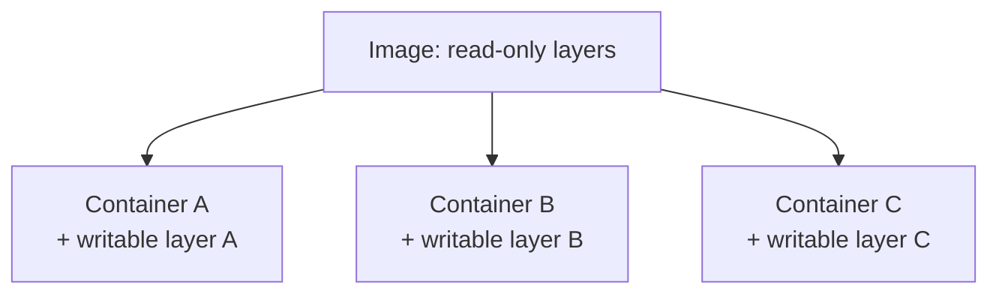
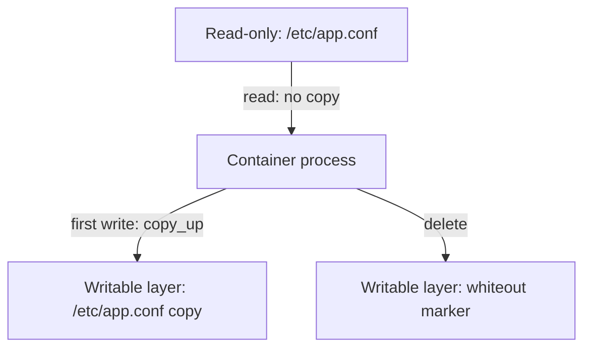
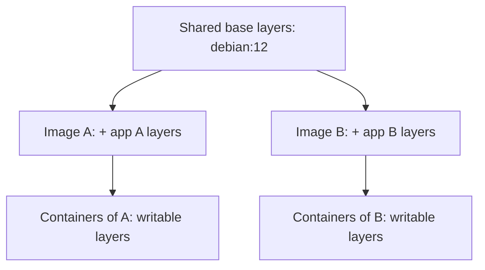
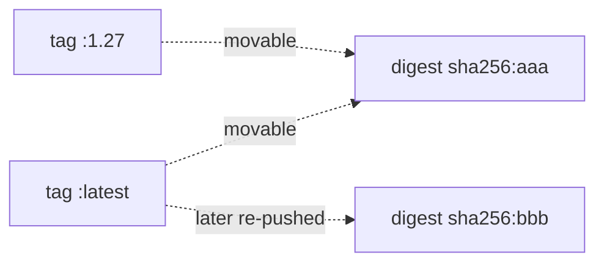
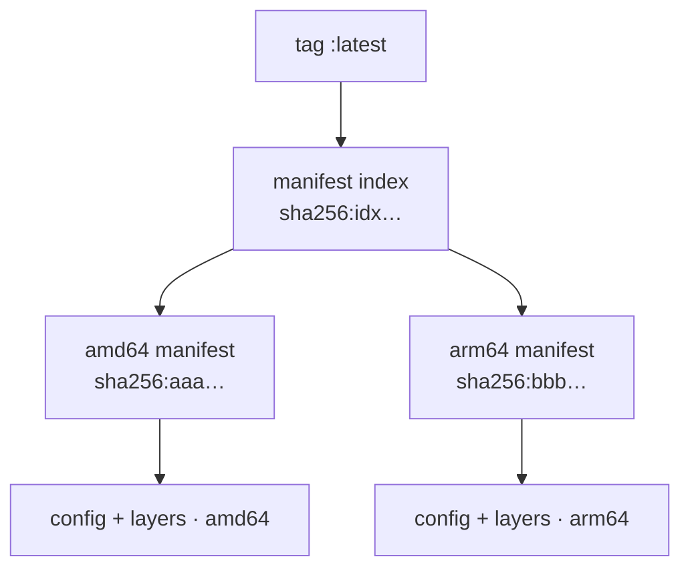
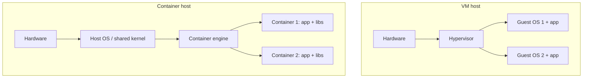
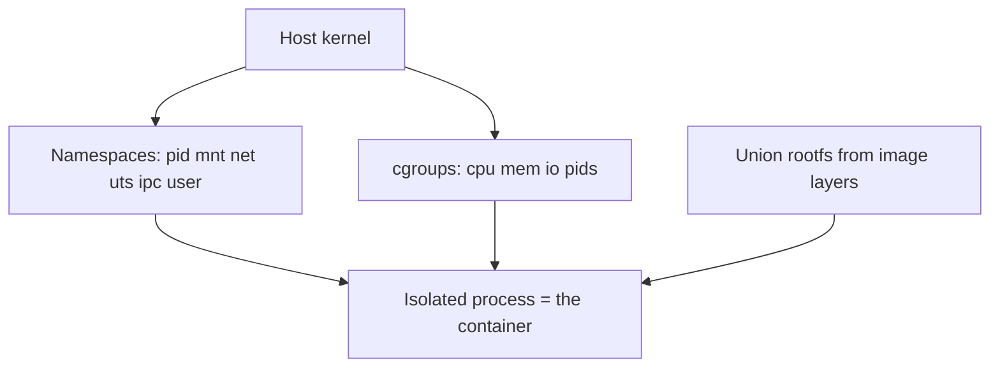
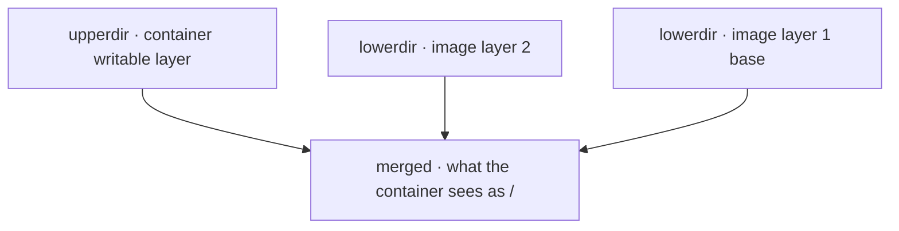
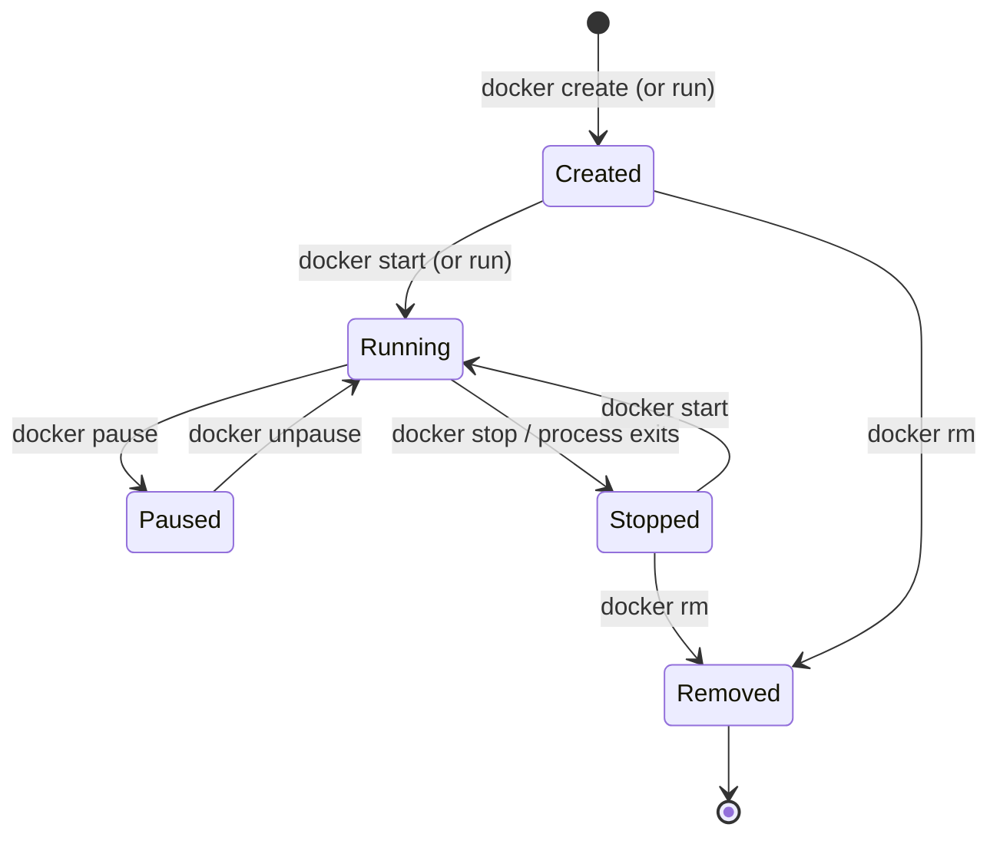

# Docker Fundamentals: Images vs Containers

The single most common Docker interview opener is *"what's the difference between an image
and a container?"* The one-line answer: **an image is an immutable, read-only template
(a stack of filesystem layers plus a config/manifest); a container is a running instance of
that image — the image's layers plus a thin, per-container writable layer, executed as an
isolated process on the host kernel.** The relationship is exactly the class-vs-instance
relationship in OOP: one image (the "class") can spawn many containers (the "instances"),
each with its own writable layer and its own runtime state, all sharing the same read-only
image layers on disk.

This note owns the *conceptual foundation* of the whole Docker domain: the image/container
distinction, image identity (tag vs digest), copy-on-write layer sharing, the union
filesystem, container-vs-VM, why containers are lightweight, "a container is just a
process," `docker run` as create+start, and the ephemeral/disposable mindset. Deeper
mechanics live in sibling topics and are cross-linked: Dockerfile/layer authoring and the
build cache in `dockerfile-layers-build-cache`; the full runtime CLI in
`container-lifecycle`; storage-driver internals (overlay2, `copy_up`) in
`image-internals-storage-drivers`; namespaces/cgroups and the OCI runtime in
`runtimes-oci-standards`; container security in `docker-security`.

> [!KEY-TAKEAWAY]
> **Image = immutable read-only layers + config (the template). Container = image + a thin
> writable copy-on-write layer, run as an isolated process sharing the host kernel.** One
> image → many containers; the read-only layers are shared on disk, only each container's
> writes are private. Delete the container and its writable layer is discarded; the image is
> untouched. This is why containers are lightweight (no guest OS), fast to start (just a
> process), and disposable.

---

## Image: the immutable read-only template

A **Docker image** is a standardized, read-only package that contains everything needed to
run a program: the application binary, its libraries, a minimal userland/filesystem, and
metadata (default command, env vars, exposed ports, working dir). Per the Docker docs, an
image is "a standardized package that includes all of the files, binaries, libraries, and
configurations to run a container."

Two defining properties:

- **Immutable.** Once built, an image never changes. You cannot "edit" an image in place —
  you build a *new* image (a new set of layers) on top of it. This immutability is what
  makes images reproducible and cacheable, and is the basis of the "build once, run
  anywhere / run the same artifact in every environment" promise.
- **Layered.** An image is a stack of read-only **layers**, each representing a set of
  filesystem changes (files added, modified, or removed). Layers are produced by the
  instructions in a Dockerfile and are stacked via a union filesystem into one coherent
  root filesystem (see *The union filesystem*).

Structurally, an OCI image is not a single blob but a small set of content-addressed
objects:

- a **manifest** — lists the config object and the ordered layer blobs (by digest);
- a **config** (the "image config") — the metadata: default `Cmd`/`Entrypoint`, `Env`,
  `WorkingDir`, `User`, exposed ports, plus the `rootfs.diff_ids` and build `history`;
- the **layer blobs** — usually gzipped tarballs of filesystem diffs.



> [!TIP]
> A useful mental model: the image is a *recipe + prepackaged ingredients frozen in place*;
> the container is the *meal you cook from it*. You can cook many meals from one recipe, and
> throwing away a meal doesn't change the recipe.

## Container: a running instance of an image

A **container** is a running (or stopped-but-created) instance of an image. Creating a
container takes the image's read-only layers and adds one more layer on top — a **thin,
writable layer** unique to that container — then runs the image's configured process inside
a set of kernel isolation primitives (namespaces + cgroups). Everything the process writes
at runtime (log files, temp files, an in-container SQLite DB) lands in that writable layer.

The class/instance analogy is exact:

| Concept | Image | Container |
|---|---|---|
| Nature | Immutable template | Live (or created) instance |
| Filesystem | Read-only layers only | Read-only layers **+** thin writable layer |
| State | None (static artifact) | Runtime state: running process, PID, network, writes |
| Cardinality | One | Many per image |
| Lifecycle op | `docker build` / `docker pull` | `docker run` / `docker create` |
| Persistence of changes | N/A | Lost when the container is removed (unless a volume is used) |



Key consequence: **the image is shared; only each container's writable layer is private.**
Run five containers from `nginx` and the nginx layers exist once on disk; each container
adds a near-empty writable layer. `docker ps -s` shows this as two numbers — `size` (bytes
written in *this* container's writable layer) and `virtual size` (writable layer + the
shared read-only image data).

**Worked example — "how much disk do 5 nginx containers use?"** Pull `nginx` (its layers
total ~187 MB on disk) and start five containers. Each has written only a couple of bytes of
runtime state, so `docker ps -s` looks like:

```
CONTAINER   IMAGE   SIZE               (= writable layer + virtual)
web1        nginx   2B (virtual 187MB)
web2        nginx   2B (virtual 187MB)
web3        nginx   2B (virtual 187MB)
web4        nginx   2B (virtual 187MB)
web5        nginx   2B (virtual 187MB)
```

Read `virtual size` naively and you'd think 5 × 187 MB = **935 MB**. But the 187 MB of
read-only layers is stored **once** and shared by all five. Actual disk =
187 MB (shared, counted once) + 5 × 2 B (the private writable layers) ≈ **187 MB**. The
de-dup saves ~748 MB — and the more containers you run off one image, the more the naive
multiplication overstates reality. That is the numbers answer to "if I run 10 containers from
one image, how much disk do the images use?": ~one image's worth, not ten.

> [!WARNING]
> Data written to the writable layer is **ephemeral** — deleting the container (`docker rm`)
> discards its writable layer and everything in it. For anything that must survive a
> container's death, use a **volume** or **bind mount** (see `volumes-and-storage`), not the
> container filesystem.

## Copy-on-write and the thin writable layer

Containers get their own writable layer cheaply because Docker uses a **copy-on-write (CoW)**
strategy, described in the docs as "a strategy of sharing and copying files for maximum
efficiency." The rules:

- **Read** of a file that exists only in a lower (image) layer: the container reads it
  directly from the shared read-only layer — no copy, no extra disk.
- **First write/modify** of such a file: the storage driver performs a `copy_up` — it copies
  the file *up* into the container's writable layer, then applies the change there. The
  container now sees its private copy; the original in the read-only layer is untouched (and
  still shared with other containers).
- **Deletes** don't remove the lower-layer file; the union filesystem records a **whiteout**
  marker in the writable layer that hides it.

Because the copy happens only on first modification, starting a container and reading from it
is essentially free in disk terms. The cost is paid once, per file, on first write.

**Worked example — the 2 GB file trap.** Suppose the image ships a 2 GB `data.bin` in a
read-only layer. Trace the writable layer's size:

| Step | Action | Writable layer size |
|---|---|---|
| 1 | `docker run` — container starts, `data.bin` is read-only-shared | **0 B** |
| 2 | `cat data.bin > /dev/null` — pure read | **0 B** (read straight from lower layer) |
| 3 | `echo x >> data.bin` — first write triggers `copy_up` | **~2 GB** (entire file copied up, then 1 byte appended) |

One appended byte cost you 2 GB of writable-layer disk — and the same `copy_up` fires even
for a `chmod data.bin` (a metadata-only change). Now put `data.bin` on a **volume** instead:
a volume bypasses the union filesystem, so the `echo x >>` writes in place and the writable
layer stays at **~0 B**. That before/after — 2 GB vs ~0 B for the identical write — is why
large or write-heavy files (databases, uploads) belong on volumes, not the container
filesystem.

> [!WARNING]
> `copy_up` copies the **entire file**, even for a tiny change — and even a metadata change
> like `chmod`/`chown` triggers it. Modifying a 2 GB file in a container copies all 2 GB into
> the writable layer. This is why write-heavy or large-file workloads (databases, big
> uploads) should write to a **volume** (which bypasses the union filesystem) rather than the
> container's writable layer. Deep directory trees and many layers also slow the first-write
> `copy_up` search.



Deeper storage-driver mechanics (overlay2 `lowerdir`/`upperdir`/`merged`, the `copy_up`
search order, `vfs` fallback) are covered in `image-internals-storage-drivers`.

## Layers are shared across containers and images

Layers are **content-addressed** (identified by the SHA-256 digest of their content), which
makes them de-duplicated and shareable in three directions:

- **Across containers of one image** — all containers of `python:3.12` reference the same
  read-only layers on disk; only their writable layers differ.
- **Across different images** — two images built `FROM debian:12` share the identical Debian
  base layers on disk and only store their own additional layers once. `docker image inspect`
  shows identical layer digests for shared layers.
- **Across the network (push/pull)** — the registry and daemon skip transferring layers you
  already have. Pulling a new tag of an image whose base you already have downloads only the
  changed layers, "which can therefore reduce network bandwidth and storage."



> [!TIP]
> This is the practical reason to standardize on a **common, slim base image** across your
> org: shared base layers are stored and transferred once, so pulls are faster and disk use
> is lower. It's also why "the image is 900 MB but I have 40 of them and disk isn't full" —
> the shared layers aren't counted 40 times.

## Image identity: repository, tag, and digest

An image is referenced as `registry/repository:tag`, e.g.
`docker.io/library/nginx:1.27-alpine`. Defaults: if you omit the registry, Docker Hub
(`docker.io`) is assumed; if you omit the tag, `:latest` is assumed. Official images live
under the `library/` namespace.

Two ways to identify the *content*:

- **Tag** (e.g. `:1.27`, `:latest`) — a human-friendly, **mutable** pointer. A tag is just a
  label the publisher can move to a different image at any time. `:latest` is **not** "the
  newest version" by any magic — it's simply the default tag name, and it points at whatever
  was last pushed with that tag.
- **Digest** (e.g. `nginx@sha256:abcd…`) — the **immutable**, content-addressed identity: the
  SHA-256 of the image manifest. A digest always resolves to the exact same bytes. Pinning by
  digest (`FROM nginx@sha256:…`) gives reproducible, tamper-evident builds.



> [!WARNING]
> Relying on `:latest` (or any tag) in production is a classic footgun: the tag can be
> re-pointed under you, so two hosts pulling "the same tag" at different times can run
> different code. For reproducibility, **pin by digest** or by an immutable version tag your
> pipeline never reuses. Tagging/registry details are in `registries-and-distribution`.

There's also the **image ID** (`docker images` short hex) — this is the digest of the image
*config* object (local identity), distinct from the *manifest* digest used for `pull`/push by
`@sha256:` (registry identity). Interviewers occasionally probe this distinction.

**Multi-arch: a tag is usually a manifest *index*, not one manifest.** On Docker Hub today,
`nginx:latest` isn't a single manifest — it's a **manifest list / OCI image index** that
fans out to one per-arch manifest each (amd64, arm64, …). Pull resolves the index, then
picks the manifest matching your CPU arch:



This nuances "pin by digest." `nginx@sha256:idx…` (the **index** digest) is reproducible and
tamper-evident *and* still arch-selecting at pull time — the same one-liner brings amd64 to
your x86 CI and arm64 to your Apple-Silicon laptop, which is what you usually want. Pinning
the **per-arch** manifest digest (`sha256:aaa…`) locks to one architecture and will refuse
to run on the other. So on Apple Silicon, prefer pinning the index digest unless you
deliberately need a single-arch build.

## Container vs virtual machine

The highest-value comparison in this topic. Both isolate workloads, but at different layers
of the stack:

| Aspect | Container | Virtual machine |
|---|---|---|
| Isolation unit | A process (or process tree) | A full guest OS |
| Kernel | **Shares the host kernel** | Its **own guest kernel** |
| Isolation mechanism | Kernel namespaces + cgroups | Hypervisor virtualizes hardware |
| Guest OS | None (just app + userland libs) | Full OS per VM |
| Size | MBs | GBs |
| Startup | Milliseconds–seconds (just start a process) | Seconds–minutes (boot an OS) |
| Density | Hundreds per host | Tens per host |
| Isolation strength | Weaker (shared kernel = shared attack surface) | Stronger (hardware-level boundary) |



The crucial line for interviews: **containers virtualize the operating system (share one
kernel); VMs virtualize the hardware (each runs its own kernel).** That single difference
explains why containers are smaller, faster, and denser — and why their isolation is weaker,
which is exactly why kernel-hardening (seccomp, user namespaces, capability drops — see
`docker-security`) matters, and why some platforms run micro-VM runtimes (e.g. Kata,
Firecracker/gVisor) to get VM-grade isolation with container-like ergonomics.

> [!INTERVIEW]
> "Can a Linux container run a Windows image, or vice versa?" No — because the container
> shares the host kernel, a Linux container needs a Linux kernel. On Docker Desktop for
> Mac/Windows, containers actually run inside a lightweight **Linux VM**; that's how "Docker
> on a Mac" works despite macOS not being Linux. This is a favorite gotcha.

## Why containers are lightweight, fast, and portable

Three properties, each with a concrete cause:

- **Lightweight** — no guest OS. A container image ships only the app plus the minimal
  userland it needs; it borrows the running host kernel. So images are MBs not GBs, and many
  containers pack onto one host. Copy-on-write layer sharing amplifies this: 40 containers off
  one image don't use 40× the disk.
- **Fast to start** — starting a container is (essentially) starting a **process** with some
  namespaces/cgroups set up. There is no OS boot, no BIOS/kernel init — so startup is
  milliseconds to low seconds versus tens of seconds to minutes for a VM. This is what makes
  autoscaling, per-request/job containers, and fast CI feasible.
- **Portable** — the image bundles all its dependencies (libs, runtime, config) into one
  immutable artifact. As long as the target has a compatible kernel/CPU-arch and a container
  runtime, the same image runs identically on a laptop, CI runner, and prod cluster. This
  kills "works on my machine": the environment *is* the image. (Caveat: portability is bounded
  by architecture — an `amd64` image won't run on `arm64` without emulation or a multi-arch
  image; see `registries-and-distribution`.)

> [!KEY-TAKEAWAY]
> All three benefits trace back to one root cause: **a container is just a host process using
> a shared kernel, running against an immutable layered filesystem.** No guest OS to ship
> (lightweight), no OS to boot (fast), self-contained artifact (portable).

## A container is just a process

Demystifying the magic: **a running container is a normal Linux process on the host** — you
can see it in the host's `ps`/`top`. What makes it a "container" is that the kernel wraps that
process in isolation primitives:

- **Namespaces** — give the process its own *view* of a global resource: `pid` (its own
  process-ID space, so PID 1 inside is the container's main process), `mnt` (its own mount
  tree / root filesystem), `net` (its own interfaces, IPs, ports), `uts` (its own hostname),
  `ipc`, `user` (UID/GID mapping — the basis of rootless), and `cgroup`.
- **Control groups (cgroups)** — *limit and account* resource usage: CPU, memory, block I/O,
  PIDs. `docker run --memory=512m --cpus=1.5` sets cgroup limits.
- **Union filesystem + `chroot`/pivot_root** — give it the image's layered root filesystem as
  its `/`.

There is no "container object" in the kernel — a container is an emergent bundle of
(namespaces + cgroups + rootfs + a process). Because it's just a process, it lives and dies
with **PID 1** inside it: when the container's main process exits, the container stops. This
is why the foreground process must be your app (not a wrapper that backgrounds it), why zombie
reaping and signal handling for PID 1 matter (`--init`), and why `docker stop` sends `SIGTERM`
then `SIGKILL` to that process.



> [!TIP]
> Prove it to an interviewer: `docker run -d --name web nginx`, then on the host run
> `ps aux | grep nginx` — the nginx master process is right there in the host process table,
> just in its own namespaces. Namespaces/cgroups theory in depth is owned by the
> upcoming `operating-systems` domain and the container-mechanism angle by
> `runtimes-oci-standards`.

## The union filesystem: stacking layers into one root

A container needs a single, coherent root filesystem (`/`), but an image is *many* read-only
layers. A **union (overlay) filesystem** solves this by **stacking** the layers and presenting
one merged view: files in upper layers shadow files with the same path in lower layers, and
the container's writable layer sits on top.

On modern Linux Docker the default driver is **overlay2**, which maps to the kernel's OverlayFS:

- `lowerdir` — the read-only image layers (stacked);
- `upperdir` — the container's writable layer;
- `merged` — the unified view the container sees as `/`;
- `workdir` — internal scratch space OverlayFS needs for atomic operations.

Reads resolve top-down through the stack; writes go to `upperdir` via `copy_up`; deletes are
recorded as whiteouts in `upperdir`. This is precisely the machinery that makes layers
read-only-and-shared while each container still appears to have a fully writable filesystem.



> [!TIP]
> Older/alternative drivers exist (`aufs` historically, `btrfs`, `zfs`, `devicemapper`, and
> the copy-everything `vfs` used when no CoW is available). For interviews, know "overlay2 is
> the default union FS driver on Linux today, backed by kernel OverlayFS." Full driver
> internals: `image-internals-storage-drivers`.

## docker run = create + start (and the lifecycle)

`docker run` is not primitive — it's a convenience that does two things: **`docker create`**
(instantiate a container from an image: allocate the writable layer, set up config, put it in
`Created` state) then **`docker start`** (set up namespaces/cgroups and launch the process,
moving it to `Running`). Splitting them is occasionally useful (create now, start later; or
`docker create` + `docker cp` files in before start).



Other essentials that trip people up:

- `docker run` **always creates a new container** from the image. It does *not* reuse a
  previous one — repeated `docker run` on the same image leaves behind many stopped
  containers. Use `docker start <name>` to re-run an existing one, or `--rm` to auto-remove
  on exit.
- **Stopped ≠ removed.** A stopped container still exists (its writable layer and config are
  on disk, `docker ps -a` shows it) and can be restarted, keeping its previous writes. Only
  `docker rm` deletes the writable layer.
- Foreground (`docker run`) attaches to the process's stdio; `-d` (detached) runs it in the
  background. Full CLI coverage: `container-lifecycle`.

## Ephemeral and disposable containers (12-factor)

Because a container's writable layer dies with it, the idiomatic mental model is that
containers are **ephemeral and disposable** — cattle, not pets. The Twelve-Factor App
principle of **disposability** says processes should start fast and shut down gracefully so
they can be created and destroyed at will, which maps directly onto containers:

- **Stateless by default.** Never keep durable state in the container filesystem. Persistent
  data goes to volumes, databases, or object storage (12-factor "Backing services" +
  "Processes are stateless"). Then any container can be killed and replaced with an identical
  one and nothing is lost.
- **Immutable infrastructure.** You don't `ssh` in and patch a running container; you build a
  new image and replace the container. This makes rollbacks trivial (redeploy the previous
  image) and eliminates configuration drift.
- **Config from the environment.** The same image behaves differently across environments via
  env vars / mounted config, not by baking secrets or per-env config into layers (also keeps
  secrets out of the image — see `docker-security`).
- **Graceful shutdown.** PID 1 should handle `SIGTERM` to drain in-flight work before the
  `SIGKILL` timeout, so orchestrators (Docker, and downstream **Kubernetes** which consumes
  these same containers) can reschedule freely (details in `production-healthchecks-logging`).

> [!INTERVIEW]
> "Where does a containerized app store its uploaded files / its database?" The trap answer
> is "in the container." The right answer: **not in the writable layer** — it's ephemeral and
> not shared. Use a volume/bind mount for local persistence, or better, an external managed
> service (S3, RDS). This shows you understand containers are disposable and state must live
> outside them.

## Common follow-up questions

- **"What is the difference between an image and a container?"** Image = immutable read-only
  template (layers + config); container = a running instance = image layers + a thin writable
  CoW layer, run as an isolated process. One image → many containers.
- **"If I run 10 containers from one image, how much disk do the images use?"** Roughly one
  image's worth — the read-only layers are shared; each container adds only its (usually tiny)
  writable layer. Verify with `docker ps -s`.
- **"What happens to data written inside a container when it's removed?"** It's gone — the
  writable layer is discarded on `docker rm`. Use volumes/bind mounts for persistence.
- **"Container vs VM?"** Container shares the host kernel and isolates via namespaces/cgroups
  (lightweight, fast, weaker isolation); VM runs its own guest OS on a hypervisor (heavier,
  slower to boot, stronger isolation).
- **"Why is `:latest` risky in production?"** A tag is a mutable pointer that can be moved;
  two pulls of the same tag can yield different images. Pin by digest or an immutable version.
- **"What actually isolates a container?"** Kernel **namespaces** (view isolation: pid, mnt,
  net, uts, ipc, user) and **cgroups** (resource limits), over a union rootfs — it's just a
  host process.
- **"Does `docker run` reuse an existing container?"** No — it always creates a new one
  (create + start). Use `docker start` to resume an existing container.
- **"Can a Linux image run on a Windows host (or vice versa)?"** Not directly — a container
  needs a compatible kernel. Docker Desktop runs Linux containers inside a hidden Linux VM.
- **"What's copy-on-write and why does it matter for performance?"** Files are shared
  read-only until first modified, then `copy_up`'d into the writable layer — so reads are free
  but the first write copies the whole file. Large/write-heavy files belong on volumes.
- **"Why does my container ignore Ctrl-C / SIGTERM and take 10s to stop?"** Almost always
  **shell-form vs exec-form CMD**. `CMD nginx` (shell form) runs as `/bin/sh -c "nginx"`, so
  **`/bin/sh` is PID 1** and receives the `SIGTERM` from `docker stop` — and a plain shell
  doesn't forward it, so your app never hears it; Docker waits out the timeout and `SIGKILL`s
  the whole tree (no graceful drain). `CMD ["nginx"]` (exec form) makes **nginx itself PID 1**,
  so it gets `SIGTERM` directly and can shut down cleanly. Fix: use exec-form, or run an init
  (`--init` / `tini`) that forwards signals and reaps zombies.

## References

- Docker Docs — *What is an image?* and *What is a container?* (Docker concepts / Get started):
  https://docs.docker.com/get-started/docker-concepts/the-basics/what-is-an-image/
- Docker Docs — *Storage drivers* (copy-on-write, thin writable layer, overlay2):
  https://docs.docker.com/engine/storage/drivers/
- Docker Docs — *Use the OverlayFS storage driver*:
  https://docs.docker.com/engine/storage/drivers/overlayfs-driver/
- OCI Image Spec (manifest, config, layers, digests):
  https://github.com/opencontainers/image-spec/blob/main/spec.md
- OCI Runtime Spec (container = config + rootfs run by a runtime):
  https://github.com/opencontainers/runtime-spec/blob/main/spec.md
- Linux `namespaces(7)` and `cgroups(7)` man pages:
  https://man7.org/linux/man-pages/man7/namespaces.7.html ·
  https://man7.org/linux/man-pages/man7/cgroups.7.html
- The Twelve-Factor App — *Disposability* and *Processes*: https://12factor.net/disposability
- Docker Docs — *Docker overview* (containers vs VMs): https://docs.docker.com/get-started/docker-overview/
