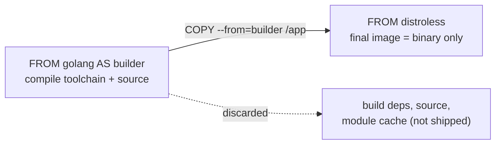

# Multi-Stage Builds & Image Optimization

Container images ship your application *and everything it needs to run*. The naive way to
build one — start from a full OS, install compilers and toolchains, build, and ship the
whole thing — produces a bloated image that is slow to pull, expensive to store, and
riddled with software you never run in production. **Multi-stage builds** and **image
optimization** are the techniques that turn a 1.2 GB "fat image" into a 20 MB artifact that
pulls in seconds and exposes almost nothing to attack.

This topic teaches the *why* (what a big image costs you) and the *how* (multi-stage
builds, small base images, distroless/scratch, layer hygiene, `.dockerignore`). It builds
on `dockerfile-layers-build-cache` (how layers and caching work) — read that first if
layers are fuzzy. Scanning image layers for CVEs is covered in `image-scanning-supply-chain`.

> [!KEY-TAKEAWAY]
> The central move is **separating build-time from runtime**: do the compiling/bundling in
> a throwaway "builder" stage that has all the heavy tooling, then `COPY --from` only the
> finished artifact into a tiny final stage. Build deps never reach production. Everything
> else (small base image, chaining `RUN`, cleaning caches, `.dockerignore`) is about not
> putting bytes in the image that you don't need at runtime.

---

## Why image size matters

Smaller images are not just tidiness — size has concrete operational consequences:

- **Faster pulls and deploys.** Every node that runs the container must download and
  decompress the image layers. A 1 GB image can take tens of seconds to pull on a fresh
  node; a 20 MB image is near-instant. This directly affects deploy speed, autoscaling
  latency (new pods/tasks starting under load), and cold-start time.
- **Smaller attack surface.** Every binary, library, shell, and package manager in the
  image is a potential vulnerability and a tool an attacker can use post-breach. A shell,
  `curl`, `apt`, and a compiler are gifts to an intruder. Fewer packages = fewer CVEs to
  patch and fewer exploitation primitives.
- **Lower storage & transfer cost.** Registries store every tag; nodes cache images.
  Multiply image size by tags × nodes × regions and it adds up. Registry egress and
  cross-region replication cost real money.
- **Faster CI.** Smaller images push faster and scanners have less to scan.

**Put numbers on it (a senior is expected to back-of-envelope this).** Take a 1 GB image on
a 200-node fleet that redeploys 10×/day, and assume the layers are cache-cold on pull:

- Egress: `1 GB × 200 nodes × 10 deploys = 2,000 GB/day` of registry pulls. At a
  cross-region egress rate of ~$0.09/GB that is `2,000 × $0.09 = $180/day ≈ $5,400/month`,
  every month, just to move bits you never execute.
- Cold-start latency: a 1 GB pull at ~100 MB/s adds `1,000 MB ÷ 100 MB/s = ~10 s` to every
  cache-cold pod start — brutal when autoscaling is racing a traffic spike.

Now swap in a 20 MB image: `20 MB × 200 × 10 = 40 GB/day → 40 × $0.09 ≈ $3.60/day (~$108/mo)`,
and the pull is `20 MB ÷ 100 MB/s = 0.2 s`. Same app, ~50× less egress and a near-instant
start. (Numbers are illustrative — the point is that image size maps directly to dollars and
seconds, so "it's cleaner" is the wrong lead.)

> [!INTERVIEW]
> "Why do we care if the image is big?" Lead with the two answers interviewers want:
> **deploy/pull speed** (autoscaling, cold starts) and **attack surface / CVE count**.
> Cost and CI speed are good supporting points. A weak answer says only "it's cleaner."

---

## The fat-image anti-pattern

The classic mistake is a single-stage Dockerfile that builds *and* runs in the same image:

```dockerfile
# ANTI-PATTERN — everything ends up in the final image
FROM node:20
WORKDIR /app
COPY . .
RUN npm install          # includes devDependencies, build tools
RUN npm run build        # webpack, typescript, etc. left behind
CMD ["node", "dist/server.js"]
```

What is wrong:

- The full `node:20` image (~1 GB) includes a complete Debian userland, `npm`, build
  toolchains, Python (for node-gyp), etc. — none needed to *run* the server.
- `devDependencies` (test frameworks, bundlers, linters) are installed and never removed.
- Source code, `.git`, caches, and intermediate build output all linger in layers.
- Even if you `rm -rf` junk in a *later* `RUN`, the bytes are still in the earlier layer —
  deleting in a new layer doesn't shrink the image (see *Minimizing layers*).

The fix is either a multi-stage build (separate builder from runtime) and/or a smaller base
image plus layer hygiene. The rest of this topic is that fix.

---

## Multi-stage builds

A **multi-stage build** puts multiple `FROM` instructions in one Dockerfile. Each `FROM`
begins a new **stage** with its own base image and filesystem. You do heavy work (compile,
bundle, run tests) in early stages, then `COPY --from=<stage>` only the finished artifacts
into a lean final stage. **Only the last stage becomes the published image**; earlier
stages are intermediate and their bloat is discarded.

```dockerfile
# Stage 1: build (has the full toolchain)
FROM golang:1.22 AS builder
WORKDIR /src
COPY go.mod go.sum ./
RUN go mod download
COPY . .
RUN CGO_ENABLED=0 go build -o /app ./cmd/server

# Stage 2: runtime (tiny — just the binary)
FROM gcr.io/distroless/static:nonroot
COPY --from=builder /app /app
USER nonroot
ENTRYPOINT ["/app"]
```

The final image contains only the compiled binary and a minimal base — no Go compiler, no
source, no module cache. A ~800 MB build image collapses to a few MB.



> [!TIP]
> Multi-stage builds also let you run tests/lint in a stage that never ships: a `test`
> stage that depends on `builder`. If tests fail, the build fails, but the test tooling
> never lands in the runtime image.

Key properties:

- Stages are **independent filesystems** — nothing carries over between stages except what
  you explicitly `COPY --from`.
- Environment variables, `WORKDIR`, and installed packages **do not** persist across a
  `FROM` boundary; each stage starts clean from its base.
- Build-cache still applies per stage, so unchanged early stages are reused.

---

## Named stages and --target

By default stages are referenced by **zero-based index** (`--from=0`, `--from=1`). This is
fragile: reordering stages breaks the reference. Name them with `AS <name>`:

```dockerfile
FROM golang:1.22 AS builder
...
FROM builder AS test          # a stage can build FROM another named stage
RUN go test ./...
FROM distroless/static AS final
COPY --from=builder /app /app
```

`docker build --target <stage>` stops the build at a named stage instead of building to the
end. Uses:

- **Build a debug/dev variant:** `docker build --target builder -t app:dev .` gives you an
  image *with* the toolchain for interactive debugging.
- **Run just the test stage in CI:** `docker build --target test .`
- **Iterate faster** on an intermediate stage without producing the final image.

> [!WARNING]
> With **BuildKit** (default in modern Docker), only the stages the target actually
> *depends on* are built — unreferenced stages are skipped, which speeds builds. The
> **legacy builder** processed every stage up to the target regardless. If a stage you
> expect to run is being "skipped," check whether anything the target depends on references
> it. Enable BuildKit with `DOCKER_BUILDKIT=1` (default in current Docker).

---

## COPY --from: stages and external images

`COPY --from=<source>` is the mechanism that moves artifacts between filesystems. The
source can be:

- **A build stage:** `COPY --from=builder /src/app /app` (by name) or `--from=0` (by index).
- **An external image:** `COPY --from=nginx:1.27 /etc/nginx/nginx.conf /nginx.conf` pulls a
  file straight out of another image — no need to name it as a stage. Handy for grabbing a
  config, a CA bundle, or a static tool (e.g. copying `ca-certificates` or a healthcheck
  binary from a known image).

```dockerfile
FROM scratch
# grab TLS roots from a known image without a package manager
COPY --from=alpine:3.20 /etc/ssl/certs/ca-certificates.crt /etc/ssl/certs/
COPY --from=builder /app /app
ENTRYPOINT ["/app"]
```

Notes:

- `COPY --from` copies **files from the source's filesystem**; it does not run the source
  image or carry its `ENV`/`ENTRYPOINT`.
- Paths in `--from` are relative to the **source** filesystem root; the destination is in
  the stage being built.
- `--chown` / `--chmod` work with `--from` to set ownership on the copied files (avoids a
  separate `RUN chown` layer).

---

## Build-time vs runtime dependencies

The discipline that makes multi-stage builds pay off is classifying every dependency:

| Kind | Examples | Belongs in |
|---|---|---|
| **Build-time** | compilers (gcc, go, javac), bundlers (webpack), `-dev`/headers packages, test frameworks, `npm`/`pip`/`maven`, source code | **builder stage only** |
| **Runtime** | the compiled binary/JAR, shared libs it links against, runtime interpreter (JRE, Python), config, CA certs | **final stage** |

Language-specific patterns:

- **Go / Rust (compiled, static):** builder has the compiler; final stage is `scratch` or
  `distroless/static` with just the binary. Use `CGO_ENABLED=0` for a fully static Go
  binary so it needs no libc.
- **Node:** builder runs `npm ci && npm run build`; final stage runs `npm ci --omit=dev`
  (production deps only) or copies the built `dist/` + prod `node_modules`.
- **Java:** builder runs Maven/Gradle to produce a JAR; final stage is a JRE (or
  `distroless/java`) with just the JAR — no Maven, no JDK.
- **Python:** builder installs into a venv or `--user`; final stage copies the
  site-packages, dropping build headers and `pip` caches.

The Go example above is the *easy* case (a compiled binary carries nothing). The tricky,
most-asked case is an interpreted runtime like Node, where you have to decide *which*
`node_modules` to carry. A complete worked multi-stage Node build:

```dockerfile
# Stage 1: build with the full toolchain + devDependencies
FROM node:20 AS builder
WORKDIR /app
COPY package.json package-lock.json ./
RUN npm ci                      # installs ALL deps (incl. devDependencies: tsc, webpack…)
COPY . .
RUN npm run build               # emits compiled output to /app/dist

# Stage 2: production deps only, reinstalled clean
FROM node:20 AS prod-deps
WORKDIR /app
COPY package.json package-lock.json ./
RUN npm ci --omit=dev           # prod deps ONLY — no tsc/webpack/jest

# Stage 3: tiny runtime — copy artifacts, never the builder's node_modules
FROM gcr.io/distroless/nodejs20-debian12 AS final
WORKDIR /app
COPY --from=prod-deps /app/node_modules ./node_modules
COPY --from=builder   /app/dist         ./dist
CMD ["dist/server.js"]          # exec form — distroless has no shell
```

Why not just `COPY --from=builder /app/node_modules`? Because the builder's `node_modules`
was populated by `npm ci` and still contains **devDependencies** — TypeScript, webpack,
jest, eslint — that you only needed to *produce* `dist/`, never to run it. Reinstalling with
`npm ci --omit=dev` in a separate stage (or `npm prune --omit=dev`) is what actually drops
those megabytes. Copy the built `dist/` from `builder`, the pruned `node_modules` from
`prod-deps`, and nothing else.

> [!INTERVIEW]
> A crisp way to state the principle: *"Build tools are needed to produce the artifact but
> not to run it, so they belong in a throwaway stage. The runtime image should contain the
> artifact plus its runtime deps and nothing else."*

---

## Choosing a base image: full, slim, alpine, distroless, scratch

The base image sets your floor for size and attack surface:

| Base | Approx size | Has shell/pkg mgr? | libc | Notes |
|---|---|---|---|---|
| `debian` / `ubuntu` | ~75–120 MB | yes | glibc | Full userland; easiest, biggest. |
| `*-slim` (e.g. `debian:slim`, `python:slim`) | ~30–80 MB | yes | glibc | Debian with docs/extras stripped; still has apt. |
| `alpine` | ~5 MB | yes (`ash`, `apk`) | **musl** | Tiny; musl can break glibc-compiled binaries & has subtle DNS/behavior differences. |
| `distroless` | ~2–20 MB | **no** | glibc (Debian-based) | App + runtime deps only; no shell/apt. |
| `scratch` | 0 bytes | no | none | Empty image; only for fully static binaries. |

Trade-offs:

- **Alpine** is small but uses **musl libc** instead of glibc. Binaries compiled against
  glibc may fail or behave differently; Python wheels sometimes lack musl builds and must
  compile from source (slower). DNS resolution and some locale behavior differ. Great for Go
  static binaries, riskier for glibc-linked apps.
- **`-slim`** is the safe middle: real Debian/glibc, much smaller than full, still has apt
  when you need it during build.
- **`distroless`/`scratch`** are the smallest and most secure but hardest to debug (see next
  two sections).

> [!TIP]
> Match the base to the runtime, not habit: a static Go binary → `scratch`; a glibc C++ app
> → `distroless/cc` or `debian:slim`; a JVM app → `distroless/java` or a JRE-slim image.

---

## Distroless images

**Distroless** images (Google's `gcr.io/distroless/*`) contain your app and its runtime
dependencies **but no shell, no package manager, and none of the usual Linux userland**.
Variants include `static` (smallest, for static binaries), `base`, `cc` (C/C++ runtime),
`java`, `python3`, and `nodejs`.

Benefits:

- **Small** — `distroless/static` is ~2 MB (smaller than alpine's ~5 MB).
- **Minimal attack surface** — no `sh`, `bash`, `apt`, `curl`, `wget`. An attacker who gets
  code execution has almost no tools to pivot with, and there is no shell to spawn.
- **Cleaner CVE scans** — far fewer packages means far fewer vulnerabilities to triage
  ("better signal-to-noise" for scanners).
- **`:nonroot` tag** runs as a non-root user by default.

Trade-offs / gotchas:

- **No shell** means `docker exec -it <c> sh` fails and shell-form `CMD`/`ENTRYPOINT`
  (`CMD npm start`) **cannot work** — you must use **exec (vector) form**:
  `ENTRYPOINT ["/app"]`. There's no `/bin/sh` to interpret a string.
- **Debugging is harder** — no shell to poke around. Use the **`:debug`** tag (adds a
  busybox shell) or `docker debug` / ephemeral debug containers, or `--target` a builder
  stage that has tools.
- Health checks that rely on `curl`/`wget` won't work — use a static healthcheck binary or
  the app's own endpoint via an external checker (K8s httpGet probe, etc.).

```dockerfile
FROM gcr.io/distroless/nodejs20-debian12 AS final
COPY --from=builder /app /app
WORKDIR /app
# exec form is mandatory — no shell to parse a string
CMD ["server.js"]
```

> [!WARNING]
> Because there is no shell, `RUN` instructions are impossible in a distroless final stage
> — you can only `COPY` into it. All installation must happen in an earlier stage.

---

## Static binaries and scratch

`scratch` is the **empty base image** — zero bytes, no files at all. It's the ultimate
minimal base, but the binary you copy in must be **fully self-contained**: statically
linked (no dynamic libc), and it must bring anything else it needs.

```dockerfile
FROM golang:1.22 AS builder
WORKDIR /src
COPY . .
# static build: no libc dependency
RUN CGO_ENABLED=0 GOOS=linux go build -ldflags="-s -w" -o /app ./cmd/server

FROM scratch
COPY --from=builder /app /app
# scratch has NO CA certs, NO /etc/passwd, NO tzdata — copy what you need
COPY --from=builder /etc/ssl/certs/ca-certificates.crt /etc/ssl/certs/
ENTRYPOINT ["/app"]
```

Gotchas with `scratch`:

- **No CA certificates** → outbound HTTPS fails with x509 errors unless you copy
  `ca-certificates.crt`.
- **No `/etc/passwd`/`/etc/group`** → `USER someuser` by name fails; use a numeric UID
  (`USER 65532`).
- **No timezone data**, no `/tmp` unless created, no shell, no `nsswitch.conf` (DNS may
  behave oddly for glibc binaries — another reason to prefer `CGO_ENABLED=0` / static).
- Any dynamically linked binary will fail with "no such file or directory" (the missing
  loader/libc) — a confusing error that actually means "not static."

`CGO_ENABLED=0` for Go, or `--target x86_64-unknown-linux-musl` for Rust, produces the
static binaries that make `scratch`/`distroless-static` viable. For glibc-linked apps,
prefer `distroless/base` or `distroless/cc` over `scratch`.

---

## Minimizing layers and cleaning caches

Each `RUN`, `COPY`, and `ADD` creates a **layer**. Two rules matter for size:

1. **Deleting a file in a later layer does not remove it from the image.** Layers are
   additive; a file added in layer 2 and `rm`'d in layer 3 still occupies space in layer 2
   (it's just hidden by a whiteout). You must add and delete **in the same layer**.
2. **Package-manager caches are pure bloat** — clean them in the same `RUN`.

Trace the whiteout with real bytes — it's the single most counterintuitive thing here:

```
Layer 1  FROM debian:slim         +75 MB    running total = 75 MB
Layer 2  COPY bigfile /bigfile   +400 MB    running total = 475 MB
Layer 3  RUN rm /bigfile           +0 MB    running total = 475 MB  ← still 475 MB!
```

`rm` in layer 3 only writes a tiny **whiteout marker** that *hides* `/bigfile` from the
final filesystem view — the 400 MB it occupies in layer 2 is immutable and still ships and
still transfers on every pull. Collapse the add-and-delete into one instruction and the
committed layer is what's *left after* the delete:

```
Layer 1  FROM debian:slim                              +75 MB    total = 75 MB
Layer 2  RUN <download bigfile> && <use it> && rm ...   +0 MB    total = ~75 MB  ← gone
```

Because the file never survives to the moment layer 2 is committed, it never enters the
image at all. Same principle for `apt` lists and package caches below.

```dockerfile
# BAD — cache and lists left in a layer; extra layers
RUN apt-get update
RUN apt-get install -y curl
RUN rm -rf /var/lib/apt/lists/*     # too late — bytes already in earlier layers

# GOOD — one layer, cache cleaned before the layer is committed
RUN apt-get update \
 && apt-get install -y --no-install-recommends curl \
 && rm -rf /var/lib/apt/lists/*
```

Per-ecosystem cache cleanup:

- **apt:** `--no-install-recommends` + `rm -rf /var/lib/apt/lists/*`.
- **apk (alpine):** `apk add --no-cache <pkg>` (no separate cleanup needed).
- **pip:** `pip install --no-cache-dir ...`.
- **npm:** `npm ci --omit=dev` and `npm cache clean --force`, or just don't ship the cache.

Other layer tactics:

- Chain related commands with `&&` and line continuations to collapse layers.
- **BuildKit cache mounts** (`RUN --mount=type=cache,target=/root/.cache`) keep a package
  cache *across builds* for speed **without** baking it into the image — the best of both.
- Don't over-optimize into one giant `RUN`: it hurts cache reuse. Balance fewer layers
  against cache granularity (see *Layer reuse*).

> [!WARNING]
> "I'll just `docker system prune`" doesn't shrink a published image — the bloat is baked
> into its layers. And `--squash` flattens layers but destroys cross-image layer sharing.
> The right fix is not adding the bytes in the first place (multi-stage + clean-in-layer).

---

## .dockerignore and the build context

When you run `docker build .`, the CLI sends the **build context** (the directory) to the
daemon/builder. Without care this ships `.git`, `node_modules`, build output, secrets, and
huge test fixtures — slowing the build and risking secrets landing in a `COPY . .`.

A **`.dockerignore`** file excludes paths from the context (syntax like `.gitignore`):

```
.git
node_modules
dist
*.log
**/*.test.js
.env
*.pem
Dockerfile
README.md
```

Why it matters:

- **Faster builds** — less data transferred to the builder; large/irrelevant files skipped.
- **Smaller images & better caching** — `COPY . .` won't pull in junk that busts the cache
  or bloats a layer.
- **Security** — keeps `.env`, keys, and `.git` history out of the image. A secret copied
  into any layer is recoverable from the image even if "deleted" later.

> [!TIP]
> Always exclude `.git` and dependency/build dirs. Then be *explicit* in the Dockerfile:
> prefer `COPY package.json package-lock.json ./` then `COPY src ./src` over a blanket
> `COPY . .`, both for caching and to avoid shipping surprises.

---

## Layer reuse across images and caching

Layers are **content-addressed and shared**: two images that share a base and identical
early layers store those layers **once** on a node and in the registry, and a node that
already has a layer skips downloading it on pull. This makes base-image choice a
fleet-wide optimization, not just a per-image one.

Implications:

- **Standardize base images.** If all your services use the same `distroless/java` (or same
  internal base), every node caches those base layers once and only pulls the thin app
  layer per service. Fragmenting across many bases defeats sharing.
- **Order Dockerfile instructions least- to most-frequently-changing** so stable layers
  (base, dependency install) are reused and only the volatile top layers (your source)
  rebuild and re-transfer. Copy dependency manifests and install *before* copying source.
- **Don't `--squash`** if you value sharing — squashing collapses layers into one blob that
  can't be shared with other images, trading dedup for a marginally smaller single image.
- Registry pulls transfer only layers the node lacks; a small app layer on a shared base is
  a fast deploy even if the *total* image size looks large.

> [!INTERVIEW]
> "Two ways to make images small" that impress: (1) **multi-stage** to drop build deps, and
> (2) **shared minimal base + good layer ordering** so nodes barely pull anything on deploy.
> Bonus: mention that "smaller" for *deploy speed* is really about the *delta* pulled, not
> just total size.

---

## Auditing and measuring image size

You can't optimize what you don't measure. Tools:

- **`docker images`** — shows the total size of each image/tag.
- **`docker history <image>`** — lists each layer with the instruction that created it and
  its size. This is how you find "which layer is 400 MB and why."
- **`docker image inspect <image>`** — layer digests, config, env.
- **`dive`** (third-party) — interactive TUI showing layer contents, wasted space, and an
  "efficiency" score; great for spotting files added-then-deleted or duplicated across
  layers.
- **BuildKit build output** shows per-step timing and cache hits.

```bash
docker history --no-trunc --human myapp:latest
docker images myapp
dive myapp:latest
```

Here is what `docker history` actually looks like on the fat single-stage Node image from
*The fat-image anti-pattern* — and how to read every row:

```
$ docker history --human myapp:latest
IMAGE          CREATED       CREATED BY                                      SIZE
a1b2c3d4e5f6   2 min ago     CMD ["node" "dist/server.js"]                   0B
<missing>      2 min ago     RUN npm run build (webpack, tsc output)         40MB
<missing>      3 min ago     RUN npm install (all deps incl. devDeps)        300MB
<missing>      3 min ago     COPY . . (source, .git, tests, fixtures)        45MB
<missing>      4 min ago     RUN apt-get install -y build-essential          120MB
<missing>      5 min ago     WORKDIR /app                                    0B
<missing>      2 weeks ago   /bin/sh -c #(nop) ... node:20 base userland     75MB
```

Total ≈ `75 + 120 + 45 + 300 + 40 = 580 MB`. Read top-to-bottom, biggest-first, and each
fat row maps to a fix already taught:

- **300 MB `npm install`** — this is `node_modules` *including* devDependencies (webpack,
  tsc, jest). A multi-stage build reinstalls with `npm ci --omit=dev` in the runtime stage
  and this collapses to the prod-only slice.
- **120 MB `apt-get install build-essential`** — a build toolchain that never runs in prod,
  and it never cleaned `/var/lib/apt/lists/*`. Belongs in a throwaway builder stage.
- **45 MB `COPY . .`** — the whole context: `.git`, tests, fixtures. A `.dockerignore` plus
  explicit `COPY` paths drops most of it.
- **40 MB `npm run build`** — bundler output; only `dist/` needs to ship, not the layer's
  intermediate junk.
- **75 MB base** — the full `node:20` userland; swapping the *final* stage to
  `distroless/nodejs20` trims this too.

The multi-stage rewrite ships only the 75 MB base (or ~small distroless) + prod
`node_modules` + `dist/` — the 120 MB apt layer and the devDependency bulk simply never
reach the final image.

More generally, reading `docker history`, look for: a huge `RUN apt-get ...` layer (missing
cache cleanup), a large `COPY . .` (missing `.dockerignore`), or build tools present in what
should be a runtime image (missing multi-stage).

---

## Common follow-up questions

- **"Does deleting a file in a later `RUN` shrink the image?"** No — layers are additive;
  the file persists in the earlier layer behind a whiteout. Add and delete in the same
  layer, or use multi-stage.
- **"Alpine vs distroless vs slim — which and why?"** Alpine = tiny but musl (compat risk);
  slim = glibc + apt, safe middle; distroless = smallest + most secure but no shell.
- **"Why won't `docker exec sh` work on my distroless image?"** No shell exists. Use the
  `:debug` tag, an ephemeral debug container, or `--target` a builder stage.
- **"My scratch image can't make HTTPS calls / says 'no such file or directory' on start."**
  Missing CA certs / a dynamically linked binary. Copy `ca-certificates.crt`; build static
  (`CGO_ENABLED=0`).
- **"How do I keep the build fast but not ship the package cache?"** BuildKit cache mounts
  (`RUN --mount=type=cache,...`) — cached across builds, not baked into the image.
- **"Why is my image still huge after adding a multi-stage build?"** Common causes: still
  `COPY --from` too much, big base in the final stage, no `.dockerignore`, or `devDeps`
  copied into runtime.

## References

- Docker docs — Multi-stage builds: https://docs.docker.com/build/building/multi-stage/
- Docker docs — Building best practices / image size: https://docs.docker.com/build/building/best-practices/
- Docker docs — `.dockerignore`: https://docs.docker.com/build/concepts/context/#dockerignore-files
- GoogleContainerTools/distroless: https://github.com/GoogleContainerTools/distroless
- Docker docs — `docker history`: https://docs.docker.com/reference/cli/docker/image/history/
- BuildKit — cache mounts: https://docs.docker.com/build/cache/optimize/#use-cache-mounts
- Dive (image layer explorer): https://github.com/wagoodman/dive
- OCI Image Spec (layers): https://github.com/opencontainers/image-spec
