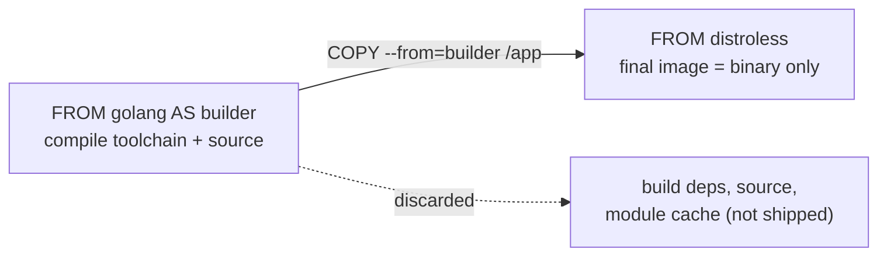

# Multi-Stage Builds & Image Optimization

Topic 4 left every repair resting on a shell being somewhere in the image — shell form as a
choice, an entrypoint script with a shebang, `docker exec -it <c> sh` when something breaks.
The images this topic builds have no shell at all, and [Distroless images](#distroless-images)
is where that boundary is settled.

`docker pull` on a fresh node, a 1.2 GB image, ten seconds of nothing before the process
starts. Inside those bytes are a C compiler, `npm`, Python, a package manager, a shell, and
300 MB of test frameworks that produced `dist/` and then stayed. The part that serves
requests is maybe 40 MB. Two hundred nodes redeploying ten times a day move the whole
gigabyte every time. So which bytes does a running container actually need, and how do you
ship only those?

> [!TIP]
> **Reading map.** About 43 minutes. The arithmetic in the first section is what makes the
> rest worth doing, and the three levers are independent: split build from runtime, pick a
> smaller floor, stop adding bytes you delete later. If you already build in stages and just
> want the small-base decision, start at
> [Choosing a base image](#choosing-a-base-image-full-slim-alpine-distroless-scratch).
> Everything else is context.

> [!KEY-TAKEAWAY]
> One move does most of the work: compile in a throwaway stage that owns the heavy tooling,
> then copy the finished artifact into a fresh final stage that owns nothing else. Build
> dependencies never reach production because they are never in the image that gets pushed.
> Choosing a smaller base, chaining `RUN`, cleaning package caches and writing a
> `.dockerignore` are all the same second move: do not put a byte in the image that no
> process will open at runtime.

---

## Why image size matters

Image size is charged on three meters: time, money and risk. The two you feel first are the
seconds a pull adds before your process starts and the number of ready-made tools an intruder
finds already installed. A 1 GB image reaching a cache-cold node at 100 MB/s takes about ten
seconds to land; a 20 MB image takes two tenths of a second. Neither figure is about tidiness.

Every byte you ship lands on one of those three meters, and the useful habit is to ask which
one it lands on.

Time is the one you notice. Every node that runs the container downloads and decompresses the
layers it does not already hold, so a cache-cold pull sits in front of every new pod or task.
Ordinary deploys wait on it, autoscaling waits on it while a traffic spike builds, and so does
every cold start. The same bytes slow CI down twice, once pushing them and once scanning them.

Money is the second meter, and it is charged repeatedly for the same bytes. A registry stores
every tag you push, each node caches what it runs, and cross-region replication moves the
whole thing again per region. Size multiplied by tags, by nodes and by regions is the number
on the bill.

Risk is the third, and it is the only one that does not shrink when traffic does. Once the
bytes are in a published tag they stay attackable until someone builds a new image without
them. A shell, `curl`, `apt` and a compiler in the final image are four tools an attacker does
not have to smuggle in after getting code execution. Each installed
package is also a row a scanner can report and a patch someone must ship, so package count
sets your ongoing triage load as well as your exposure.

Two things a smaller image does not buy are worth saying out loud, because both are tempting
answers. It does not make the running process faster or lighter: unpacked files that nothing
ever opens cost disk, and the process's memory and CPU are set by what it actually maps and
executes. It also does not replace runtime hardening — running as a non-root user, dropping
Linux capabilities, mounting the root filesystem read-only. Hardening decides how likely an
attacker is to get code running; minimality decides how little they find once they do. The
two multiply rather than substitute.

> [!INTERVIEW]
> "Why do we care if the image is big?" The two answers that carry the most weight are
> deploy and pull speed — autoscaling, cold starts — and attack surface, which doubles as CVE
> count. Cost and CI time support them. "It's cleaner" answers a different question.

### Putting money on it: 200 nodes, ten deploys a day

Take that 1 GB image on a 200-node fleet that redeploys ten times a day, and assume every
pull is cache-cold. Egress is `1 GB × 200 nodes × 10 deploys = 2,000 GB/day`. Price
that at about $0.09/GB and it is `2,000 × $0.09 = $180/day`, near $5,400/month, spent moving
bytes that never execute. The rate is an order of magnitude, not a quote: it is roughly what
the major clouds charge for egress to the internet, and cross-region transfer is cheaper
still, so substitute your own card.
Cold-start latency is the same multiplication run once, `1,000 MB ÷ 100 MB/s ≈ 10 s` added to
every cache-cold start. Treat 100 MB/s as an assumption about your registry and network.

Now put a 20 MB image through the identical arithmetic. Egress becomes
`20 MB × 200 × 10 = 40 GB/day`, so `40 × $0.09 ≈ $3.60/day` or about $108/month, and the pull
becomes `20 MB ÷ 100 MB/s = 0.2 s`. Same application, `2,000 ÷ 40 = 50×` less egress, and a
start that no longer waits on a download.

One caution keeps this arithmetic honest. A pull transfers the *compressed* layers while
`docker images` reports the *unpacked* size, and the two differ by a factor that depends on
the contents — for `alpine` the gap is better than two. Every figure above is unpacked bytes,
which makes them ceilings. The real transfer is smaller by whatever that factor turns out to
be, so read the dollars and the seconds as an upper bound rather than a forecast. Pick one
basis, say which one you used, and never mix them inside a single estimate.

The bill is legible. What is less obvious is how a Dockerfile that looks perfectly reasonable
ends up carrying all of it.

---

## The fat-image anti-pattern

A single-stage Dockerfile ships its own build environment, because the image it runs in is
the image it built in.

```dockerfile
# ANTI-PATTERN — everything ends up in the final image
FROM node:22
WORKDIR /app
COPY . .
RUN npm install          # includes devDependencies, build tools
RUN npm run build        # webpack, typescript, etc. left behind
CMD ["node", "dist/server.js"]
```

Four separate kinds of freight are in that image, and only one of them serves a request. The
full `node:22` image is around a gigabyte unpacked on disk, and it carries a complete Debian
userland, `npm`, a C toolchain and Python for `node-gyp` builds — none of which the server
calls. `npm install` then installs `devDependencies` too, so the test runner, the bundler and
the linter are all present forever. `COPY . .` adds the source tree, `.git` and any fixtures
next to it. The build's own intermediate output stays wherever the bundler left it.

The instinct at this point is to add a cleanup step, and the instinct is wrong. A `rm -rf` in
a *later* `RUN` cannot reduce an earlier layer, because layers are immutable once committed.
The delete writes a whiteout marker, which hides the path from the merged view. The original
bytes still ship and still transfer on every pull.
[Minimizing layers and cleaning caches](#minimizing-layers-and-cleaning-caches) traces that
with real byte counts.

So the fix cannot be subtraction after the fact. It has to be an image that never contained
the build environment, which is what the next section builds.

---

## Multi-stage builds

Put a second `FROM` in the Dockerfile and everything above it stops being part of the
published image. Compile with `golang:1.22` and its whole toolchain, then start again from a
base with no compiler and no package manager in it, and copy across exactly one file: the
12 MB binary you just produced. The compiler, the source tree and the module cache are still built,
still cached, and never pushed.

Each `FROM` begins a new **stage**, which is a fresh filesystem seeded from that line's base
image. Earlier stages exist only to produce artifacts, and whatever bloat they accumulate is
discarded with them.

A Dockerfile written that way is a **multi-stage build**: several stages, one published
result. Only the last stage becomes the image the build tags and pushes.

```dockerfile
# Stage 1: build (has the full toolchain)
FROM golang:1.22 AS builder
WORKDIR /src
COPY go.mod go.sum ./
RUN go mod download
COPY . .
RUN CGO_ENABLED=0 go build -o /app ./cmd/server

# Stage 2: runtime (tiny — just the binary)
FROM gcr.io/distroless/static:nonroot
COPY --from=builder /app /app
USER nonroot
ENTRYPOINT ["/app"]
```

The final image holds the compiled binary and a minimal base: no Go compiler, no source, no
module cache. A ~800 MB build image collapses to that 12 MB binary on a 2 MB base. No delete
was needed anywhere, because those bytes were produced in a filesystem the final image never
inherits.



### What does not cross a FROM

Exactly one thing crosses a stage boundary, and it is the file you name in a
`COPY --from`. Everything else that a stage established is gone at the next `FROM`: its
`WORKDIR`, its environment variables, the packages `apt-get` installed in it, the user it
switched to. A stage does not extend the one above it; it starts clean from its own base
image, which is why a final stage cannot accidentally inherit `npm` from a builder that
installed it.

Cache state is the one thing that survives, and it survives outside the image. Caching is
tracked per stage, so an untouched builder stage is reused from cache on the next build even
though its filesystem contributes nothing to the published image. You keep the fast rebuild and still ship none of
its bytes.

Referring to a stage by its position in the file works until someone reorders the file.

---

## Named stages and --target

Naming a stage is what makes a reference to it survive an edit. Without a name, stages are
addressed by **zero-based index**: `--from=0` is the first `FROM` in the file and `--from=1`
the second. Insert a stage above one of those and the copy silently repoints at the wrong
filesystem. `AS <name>`
replaces the position with something that cannot drift.

```dockerfile
FROM golang:1.22 AS builder
...
FROM builder AS test          # a stage can build FROM another named stage
RUN go test ./...
FROM gcr.io/distroless/static AS final
COPY --from=builder /app /app
```

The `test` stage there is legal and slightly surprising: `FROM builder` uses an earlier stage
as a base image, so `test` starts with the compiled source already in place and adds the test
run on top. Nothing copies out of `test`, and `final` does not build on it, so its tooling
never reaches a published image. That independence has a price. Nothing depends on `test`, so
a plain `docker build .` has no reason to run it, and then a failing `go test` fails nothing.
Tests gate the artifact only when the build actually reaches them. Give CI a step of its own,
`docker build --target test .`, or make the dependency real: have `test` write a stamp file
and have `final` do a `COPY --from=test` of it. The warning below is this same trap seen from
the other side.

`docker build --target <stage>` stops the build at the stage you name instead of running to
the end of the file. Three uses account for almost all of it. `docker build --target builder
-t app:dev .` publishes the builder itself, giving you an image that has the compiler, a
shell and your source for interactive debugging. `docker build --target test .` runs the
tests in CI and produces nothing else. And pointing `--target` at an intermediate stage lets
you iterate on it without paying for the stages below.

> [!WARNING]
> "My test stage stopped running." With BuildKit, a `--target` build resolves the Dockerfile
> into a graph and builds only the stages the target actually reaches, so a stage nobody
> copies from and nobody builds `FROM` is skipped entirely. The legacy pre-BuildKit builder
> read the file top to bottom and built every stage up to the target, so it ran that stage by
> accident. If a stage you expect has gone quiet, check whether your target genuinely depends
> on it, and make the dependency real rather than relying on file order. BuildKit is the
> default in current Docker; `DOCKER_BUILDKIT=1` forces it on an older daemon.

Stages move files between filesystems, and the flag that does the moving reaches further than
stages alone.

---

## COPY --from: stages and external images

`COPY --from` reads out of a filesystem the current stage has no other way to see. Write
`COPY --from=nginx:1.27 /etc/nginx/nginx.conf /nginx.conf` and the builder pulls the
`nginx:1.27` image, takes that one file out of it, and puts it in your image. Nginx is never
declared as a stage, never run, and never added to anything.

So the source can be either of two things. Name a stage, as in `COPY --from=builder
/src/app /app`, or `--from=0` by index, and you get that stage's filesystem. Name an image
reference instead and you get that image's filesystem, which is the cheap way to obtain a
single file you cannot otherwise produce: a TLS root bundle, a timezone database, a config
template, or a small self-contained tool.

```dockerfile
FROM scratch
# grab TLS roots from a known image without a package manager
COPY --from=alpine:3.20 /etc/ssl/certs/ca-certificates.crt /etc/ssl/certs/
COPY --from=builder /app /app
ENTRYPOINT ["/app"]
```

Three details decide whether a copy does what you meant. It transfers files and nothing else,
so the source image's `ENV`, `ENTRYPOINT` and installed-package metadata do not come with
them, and no process from that image ever runs. Source paths resolve against the *source*
filesystem's root while the destination resolves inside the stage being built, so
`--from=alpine:3.20 /etc/ssl/certs/...` is alpine's path, not yours. And `--chown` and
`--chmod` set ownership and mode during the copy itself, which saves a `RUN chown` layer.

That last one stops being a convenience and becomes the only option in a final stage with no
shell. `COPY --chown=65532:65532 --from=builder /app /app` writes the files already owned by
uid 65532, the numeric identity the distroless `:nonroot` tag runs as, so the process can
read and write its own files on the first try. Numbers rather than names, and which of the two
you can get away with depends on the base. The distroless `:nonroot` images resolve the name —
that is why the earlier fence could write `USER nonroot` — so `--chown=nonroot:nonroot` works
there as well. `scratch` has no `/etc/passwd` at all, so the name has nowhere to look and only
the number works. Use the number on both, and remember that you cannot correct a mistake
afterwards with `RUN chown`, because the stage has no shell for `RUN` to invoke.

Moving a file is the mechanical half. The other half is deciding which files are runtime files
at all.

---

## Build-time vs runtime dependencies

Every dependency belongs to exactly one stage, and one question sorts it: does the process
call this after it starts? `tsc` compiles `dist/` and is never called again, so it is a
**build-time dependency** and lives only in the builder.

The JAR your server executes, and the JRE that executes it, are **runtime dependencies** and
must be in the final image. Guessing instead of sorting is what leaves 300 MB of test framework in
production.

| Kind | Examples | Belongs in |
|---|---|---|
| Build-time | compilers (gcc, go, javac), bundlers (webpack), `-dev`/headers packages, test frameworks, `npm`/`pip`/`maven`, source code | builder stage only |
| Runtime | the compiled binary/JAR, shared libs it links against, runtime interpreter (JRE, Python), config, CA certs | final stage |

Languages split into two groups by how much of that table's second row they actually need. A
compiled, statically linked language needs almost none of it: Go with `CGO_ENABLED=0`, or Rust
built for a musl target, produces one file that links no libc, so the final stage is `scratch`
or `distroless/static` plus that file. A language with a runtime needs the runtime and the
subset of packages the process imports, which is where the work is. Java builds a JAR with
Maven or Gradle and then runs it on a JRE — a `distroless` Java image or a slim JRE image —
with no Maven and no JDK in sight. Python installs into a virtualenv or with `--user` in the
builder, then copies the resulting site-packages tree over, leaving the `-dev` headers that
compiled the wheels and `pip`'s download cache behind. The headers stay behind, but the library
they were headers for cannot. A wheel compiled from source loads its runtime shared library at
import time: `psycopg2` built against `libpq-dev` needs `libpq5` in the final stage next to
`site-packages`, or the import fails. That is also why `-slim` is a safer floor for Python than
`distroless/static`. Node is the case worth working
completely, because its dependency tree contains both kinds mixed together in one directory.

```dockerfile
# Stage 1: build with the full toolchain + devDependencies
FROM node:22 AS builder
WORKDIR /app
COPY package.json package-lock.json ./
RUN npm ci                      # installs ALL deps (incl. devDependencies: tsc, webpack…)
COPY . .
RUN npm run build               # emits compiled output to /app/dist

# Stage 2: production deps only, reinstalled clean
FROM node:22 AS prod-deps
WORKDIR /app
COPY package.json package-lock.json ./
RUN npm ci --omit=dev           # prod deps ONLY — no tsc/webpack/jest

# Stage 3: tiny runtime — copy artifacts, never the builder's node_modules
FROM gcr.io/distroless/nodejs22-debian12 AS final
WORKDIR /app
COPY --from=prod-deps /app/node_modules ./node_modules
COPY --from=builder   /app/dist         ./dist
CMD ["dist/server.js"]          # exec form — distroless has no shell
```

That last line looks like it violates what the previous topic taught, because exec form
executes your list directly and `dist/server.js` is not an executable file. It works because
the image supplies the missing word: `gcr.io/distroless/nodejs22-debian12` ships
`ENTRYPOINT ["/nodejs/bin/node"]`, and a `CMD` list is appended to `ENTRYPOINT` as arguments,
so the process that runs is `/nodejs/bin/node dist/server.js`. Change the base to one without
that entrypoint and the same `CMD` fails, which is why the two lines have to be read together.

### The hard case: which node_modules ships

Writing `COPY --from=builder /app/node_modules` is the mistake that survives a multi-stage
rewrite.
That directory was populated by `npm ci`, which installs `devDependencies` alongside the
production ones: TypeScript, webpack, jest, eslint. All of them go into the same tree, with no
marker afterwards that separates the two kinds. The 300 MB is still 300 MB; it has just moved
into a stage you thought was clean.

Two commands separate them, and both work by consulting `package.json` rather than by
inspecting the tree. `npm ci --omit=dev` in a separate stage installs from the lockfile while
skipping the dev block, which is what stage 2 above does. `npm prune --omit=dev` runs after
the fact and deletes the dev packages from an existing tree. Run it in the same `RUN` whose
result gets copied out and it works; run it in a later layer of the same stage and it only
writes whiteouts over bytes that stay. Either way, the final image gets `dist/` from `builder` and
`node_modules` from `prod-deps`, and the two stages that produced them are thrown away.

One line states the principle for any ecosystem. Build tools are needed to produce the
artifact but not to run it, so they belong in a throwaway stage. The runtime image holds the
artifact plus its runtime dependencies, and nothing else.

Sorting dependencies decides what goes into the final stage. The base image decides what is
already in there before you copy anything.

---

## Choosing a base image: full, slim, alpine, distroless, scratch

Whatever the base image contains, you ship, whether any process opens it or not. No later
care gets you under that floor. `FROM debian:bookworm` starts you at the 75–120 MB the table
below puts on a full Debian userland, `FROM alpine:3.20` at single-digit megabytes, and
`FROM scratch` at zero bytes, before your own artifact is copied in. Choosing the floor is
therefore the single largest size decision in the file.

| Base | Approx size | Has shell/pkg mgr? | libc | Notes |
|---|---|---|---|---|
| `debian` / `ubuntu` | ~75–120 MB | yes | glibc | Full userland; easiest, biggest. |
| `*-slim` (e.g. `debian:bookworm-slim`, `python:slim`) | ~30–80 MB | yes | glibc | Debian with docs/extras stripped; still has apt. |
| `alpine` | ~5 MB | yes (`ash`, `apk`) | musl | Tiny; musl can break glibc-compiled binaries, and its DNS and locale behaviour differ. |
| `distroless` | ~2–20 MB | no | glibc in `base`/`cc`; none in `static` | App + runtime deps only; no shell/apt. |
| `scratch` | 0 bytes | no | none | Empty image; only for fully static binaries. |

Read that size column as a ranking, not a measurement. The figures are rounded and they move
with every base-image release. They do not even share a basis: some are the compressed bytes a
registry reports, some are the unpacked bytes on disk. `alpine` is under 4 MB compressed and
roughly twice that unpacked. A language image like `python:slim` sits inside the `*-slim` range
compressed and well above it unpacked. Measure the tag you actually intend to use, on the basis
you actually mean, before you quote a number in a review.

The rows differ on one axis that matters more than size, which is how much of a normal Linux
system is still there. Full and `-slim` images keep a shell and a package manager, so anything
you might do at runtime still works: a debug session, an `apt-get install` in a hurry, a
shell-form `CMD`. You pay tens of megabytes and a longer CVE list for that convenience. `-slim` is
the safe middle for exactly that reason: real Debian and real glibc, so nothing about your
application's linking changes, at a third to a half of the full image. Take `-slim` over
`alpine` unless you have checked that everything you install has musl builds. Take
`-slim` over `distroless` whenever operators need to get a shell into the container more often
than they need the tens of megabytes between those two rows.

Below `-slim`, the choice stops being about size and starts being about what your binary links
against. A statically linked Go binary has no libc to satisfy, so `scratch` or
`distroless/static` fits it. A dynamically linked C or C++ program needs a libc and the
loader, so it wants `distroless/cc`, which carries exactly that pair, or
`debian:bookworm-slim` if it also needs other shared libraries. A JVM application needs a JRE, so a `distroless` Java image
or a slim JRE image is the floor. Matching the base to what the artifact links is the decision
being made here, not picking the smallest number in the table.

### What musl costs you

One risk on the `alpine` row outranks size. Alpine links musl libc where nearly every other
distribution links glibc, and a binary compiled against one does not run against the other.
The everyday form is Python. A wheel built for the `manylinux` platform tag links glibc, so
`pip` refuses it on Alpine and compiles from source instead. That pulls a compiler into the
image and turns a seconds-long install into minutes. Native Node addons hit the same wall.

musl's DNS resolver is the second difference, and it is version-dependent, which is why blog
posts about it contradict each other. `dockerfile-layers-build-cache` pins the two that matter.
Handling of a multi-entry search list still differs from glibc's. The missing TCP fallback for
answers too large for one UDP packet was fixed in musl 1.2.4, which ships in Alpine 3.18 and
later, so `alpine:3.20` is already past that one.

Locale handling is the third difference, and it is the one nobody writes down precisely.
Formatting, sorting and `setlocale` results that a glibc image gets from installed locale data
are not guaranteed to match on musl. Which cases actually bite is not something this file
settles. If your service formats currency or dates, or sorts names for humans, test that on
Alpine before you commit to it.

Take the few megabytes when your artifact is a static binary that never calls a resolver
through libc; take `-slim` when knowing all of that is not worth the saving.

Two rows in the table have no shell in them at all, and one of those is the sensible default
for compiled services.

---

## Distroless images

A **distroless** image holds your application and its runtime libraries and stops there — no
shell, no package manager, and none of the rest of a Linux userland. `gcr.io/distroless/static`
is about 2 MB, under alpine's rounded ~5 MB, and there is no `sh` or `bash`, no `apt`, no
`curl` and no `ls` inside it. Google publishes the family at `gcr.io/distroless/*`.

The variants exist because "runtime libraries" means different things per language. `static`
carries the least and suits binaries that link nothing; `base` adds glibc and its friends;
`cc` adds the C and C++ runtime for dynamically linked programs; and `java`, `python3` and
`nodejs` each add that language's runtime. Their tags carry the language version and the Debian
release — `nodejs22-debian12` in the Node example earlier — so a bare `distroless/java` names
a family rather than a tag you can pin.

Three things follow from removing the userland. The image is small, which matters least. The attack surface shrinks in a specific way: an attacker who achieves code
execution finds no shell to spawn and no package manager to fetch tools with, so their next
step costs them a payload they have to bring and get running themselves. And a vulnerability
scanner reports fewer rows. A scanner works by enumerating the packages installed in the image
and matching them against advisories, so fewer packages means a shorter list to triage. The
improvement is in signal-to-noise for the humans reading that report, not in the application's
safety: your own code's bugs are untouched by any of it.

The `:nonroot` tag adds one more default worth taking: it sets `USER` to a non-root account
whose numeric id is 65532, so the container starts unprivileged without a `USER` line of your
own. Uid 65532 is the number to name in a `COPY --chown=65532:65532`.

### What you give up: no shell, no RUN, no prompt

Nothing in the final image can invoke `/bin/sh`, and four familiar things stop working at
once. Shell-form `CMD npm start` cannot run, because shell form is defined as
`/bin/sh -c "<string>"` and that binary is absent; exec form such as
`ENTRYPOINT ["/app"]` is the only form that works. An entrypoint script cannot run either: its
shebang line names an interpreter the image does not have, and `exec "$@"` is a shell builtin
with no shell to execute it. `docker exec -it <c> sh` fails with an executable-not-found
error, so there is no prompt to open inside the container. And `RUN` is impossible in that
stage, which is the constraint that shapes the whole Dockerfile.

Multi-stage builds are what make that constraint livable, and the relationship is worth
stating directly. You cannot run a command in a distroless stage, so every install, compile,
download and permission fix happens in an earlier stage and arrives as a `COPY --from`. The
final stage does nothing but receive files.

Debugging needs a substitute for the missing prompt, and there are four. The `:debug` variant
of each distroless image adds a busybox shell, so `docker exec` works against an image that is
otherwise identical to what you ship. `docker debug` in Docker Desktop gets you a shell into a
running container by bringing its own toolbox along, mounted somewhere the image cannot see it.
On Kubernetes, `kubectl debug` attaches an ephemeral debug container to a running pod. It
shares the target's namespaces, so you get tools next to the same process without rebuilding
the image. Or build
`--target builder`, which gives you the same code in an image that already has a shell and the
compiler, and reproduce the problem there.

Health checks lose their usual tool, since a container with no `curl` and no `wget` cannot run
the one-line `HEALTHCHECK CMD curl -f localhost:8080/health` that most examples use. Two
replacements work. One is to build a tiny statically linked checker in the builder stage. Its whole job is to
make one request to `localhost` and exit non-zero if the response is not healthy. Copy it in
with `COPY --from=builder /healthcheck /healthcheck` and point `HEALTHCHECK` at it in exec
form; published binaries such as `grpc-health-probe` are the same idea packaged, for services
that speak gRPC rather than HTTP. The other is to drop the in-image check and let something
outside the container make the request. A Kubernetes `httpGet` probe works that way: the
kubelet opens the connection itself,
so the image needs no client at all.

```dockerfile
FROM gcr.io/distroless/nodejs22-debian12 AS final
COPY --from=builder /app /app
WORKDIR /app
# exec form is mandatory — no shell to parse a string
# the base's ENTRYPOINT ["/nodejs/bin/node"] turns this list into its arguments
CMD ["server.js"]
```

> [!WARNING]
> "I'll just add one `RUN` to fix the permissions." There is no shell for `RUN` to invoke in a
> distroless stage, so the instruction fails at build time rather than at runtime. Everything
> that would need a command — installing a package, creating a directory, `chown`ing a path —
> moves to an earlier stage or becomes a flag on the `COPY` that brings the file in.

Even distroless still ships a handful of files — CA certificates, an `/etc/passwd`, tzdata —
and its `base` and `cc` variants ship a libc as well. Removing even those is a different
exercise.

---

## Static binaries and scratch

`scratch` is not a small base image; it is the absence of one. Zero bytes, no files, no
directories — `FROM scratch` gives the next instruction an empty filesystem to write into. So
the binary you copy in has to be **statically linked**, meaning every library it calls was
built into the executable itself, and it has to bring any data file it reads along with it.

```dockerfile
FROM golang:1.22 AS builder
WORKDIR /src
COPY . .
# static build: no libc dependency
RUN CGO_ENABLED=0 GOOS=linux go build -ldflags="-s -w" -o /app ./cmd/server

FROM scratch
COPY --from=builder /app /app
# scratch has NO CA certs, NO /etc/passwd, NO tzdata — copy what you need
COPY --from=builder /etc/ssl/certs/ca-certificates.crt /etc/ssl/certs/
ENTRYPOINT ["/app"]
```

`CGO_ENABLED=0` is what makes the Go build static: with cgo off, the toolchain stops linking
against the system libc and resolves names with Go's own resolver instead. Rust reaches the
same place with `--target x86_64-unknown-linux-musl`, which links musl statically rather than
glibc dynamically. Without one of those flags the binary is dynamically linked and `scratch`
cannot run it, so for anything glibc-linked the honest floor is `distroless/base` or
`distroless/cc` rather than `scratch`.

Four files that every normal image provides are missing, and each absence has a visible
consequence. There are no CA certificates, so outbound HTTPS cannot verify anything. There is
no `/etc/passwd` or `/etc/group`, so user and group names do not resolve. There is no timezone
database, so anything that formats a local time has nothing to read. And there is no
`/etc/nsswitch.conf`, the file glibc reads to decide which sources answer a hostname lookup and
in what order. Its absence is not itself an order change: glibc's compiled-in default for
hostnames is the same `files dns` that distributions ship, and a missing file is tolerated
rather than fatal. What it does mean is that glibc name lookups in an empty image sit on a path
very few people test. glibc has shipped outright crashes for a missing `nsswitch.conf` inside a
chroot — bug 27343, fixed in 2.34 — and this file does not settle what any given build will do.
Go built with `CGO_ENABLED=0` sidesteps the question: its own resolver reads `/etc/hosts` and
`/etc/resolv.conf` directly and never consults glibc. There is also no `/tmp` unless you create
it, and no shell, so none of this can be inspected from inside.

### Reading the three errors scratch gives you

Each of those absences surfaces as one recognisable error, and the mapping is the whole
debugging technique. An outbound HTTPS call fails with an x509 error about an unknown
authority, which means the CA bundle is missing. Copy `ca-certificates.crt` out of a stage or
an image that has one, as the Dockerfile above does. `USER appuser` fails at build or start,
because the name has to be looked up in `/etc/passwd`. Name the account by number instead:
`USER 65532` needs no lookup, and 65532 is the same uid distroless `:nonroot` uses. Timezone
formatting silently reports UTC, or errors, until you copy `/usr/share/zoneinfo`.

The third error is the one that wastes an afternoon, because it names a file that is plainly
present. Starting a dynamically linked binary in `scratch` fails with "no such file or
directory" even though `COPY` put the binary exactly where `ENTRYPOINT` points. The kernel is
not complaining about your binary. A dynamically linked executable records the path of its
interpreter — the dynamic loader — inside its own program headers, in a section called
`.interp`, and on x86-64 glibc that path is `/lib64/ld-linux-x86-64.so.2`.
`execve` tries to load that path before it runs a single instruction of your code. In an empty
image the path does not exist, so the kernel returns ENOENT, and the message you see repeats
that error against the name you typed. The error means
"the loader this binary asks for is not here", which is another way of saying the binary is not
static.

> [!WARNING]
> "The file is right there, I can see it in the `COPY`." Right, and the missing file is a
> different one. Run `file ./app` or `ldd ./app` in the builder stage: a static binary reports
> "statically linked", while a dynamic one names its interpreter and the libraries it wants,
> none of which exist in `scratch`. Fix the build flags rather than the `COPY` path.

`scratch` and distroless both shrink the floor. What they cannot do is stop a single `RUN` from
adding 300 MB above it.

---

## Minimizing layers and cleaning caches

Each `RUN`, `COPY` and `ADD` commits a layer, and a layer is immutable once committed, so the
only bytes you can still remove are the ones inside the instruction that added them. That one
fact generates the rest of this section: an add-and-delete pair has to live inside a single
instruction, and a package manager's cache has to be cleaned in the same `RUN` that wrote it.
Watch it happen with real byte counts:

```
Layer 1  FROM debian:bookworm-slim   +75 MB    running total = 75 MB
Layer 2  COPY bigfile /bigfile     +400 MB    running total = 475 MB
Layer 3  RUN rm /bigfile             +0 MB    running total = 475 MB  ← still 475 MB!
```

The `rm` in layer 3 writes a whiteout marker, which hides `/bigfile` from the filesystem the
container sees and changes nothing about layer 2. Those 400 MB still sit in the image, still
upload on every push, and still download on every cache-cold pull. Move the delete into the
instruction that created the file and the arithmetic changes, because a layer records the state
of the filesystem at the moment the instruction *finishes*:

```
Layer 1  FROM debian:bookworm-slim                     +75 MB    total = 75 MB
Layer 2  RUN <download bigfile> && <use it> && rm ...   +0 MB    total = ~75 MB  ← gone
```

The file existed while layer 2 was being built and was gone before layer 2 was committed, so it
never entered the image at all. Package managers are the everyday case: their download caches
and index lists are pure build-time freight, and they have to be removed in the same `RUN` that
created them.

```dockerfile
# BAD — cache and lists left in a layer; extra layers
RUN apt-get update
RUN apt-get install -y curl
RUN rm -rf /var/lib/apt/lists/*     # too late — bytes already in earlier layers

# GOOD — one layer, cache cleaned before the layer is committed
RUN apt-get update \
 && apt-get install -y --no-install-recommends curl \
 && rm -rf /var/lib/apt/lists/*
```

Each ecosystem spells the same idea differently, and the question every spelling answers is
whether the cache is written at all or has to be deleted afterwards. `apt` writes its index
lists and needs the explicit `rm -rf /var/lib/apt/lists/*`, plus
`--no-install-recommends` to stop pulling in packages nothing asked for. `apk add --no-cache`
never writes a cache, so alpine needs no cleanup line. `pip install --no-cache-dir` does the
same for Python. npm caches by default, so either `npm ci --omit=dev` followed by
`npm cache clean --force` in the same `RUN`, or simply do not copy the cache into the final
stage.

BuildKit offers a third answer that is better than both: a cache mount. Writing
`RUN --mount=type=cache,target=/root/.cache pip install -r requirements.txt` keeps the
downloads on the builder between builds, outside any layer, so builds stay fast *and* the image
stays clean. Nothing under the mount point is committed into the layer.

### Why one giant RUN is also wrong

Collapsing everything into a single `RUN` optimises for the wrong number. Layers are the unit
of cache hit and the unit of transfer, so any change to any part of a monolithic `RUN` rebuilds
and re-uploads all of it. Put the dependency install and the application build in one
instruction, and every one-line source edit re-downloads every dependency. Two or three instructions
ordered from least- to most-frequently-changing beat one instruction on rebuild time and on
pull size, while five instructions that each leave a cache behind beat nothing. Chain what
belongs together with `&&` and line continuations, so one instruction covers one job. Group by what
changes together, and keep the add-and-delete pairs inside a single instruction.

Flattening after the fact looks like a shortcut and is not one. `docker build --squash`
collapses the layers a build produced into one new layer, and that does drop the hidden bytes.
What it produces is one blob with one new digest, and no other image can match a digest that
nothing else produced. The base layers underneath are untouched and still share, so what you
traded away is sharing for everything you built on top of them.
`dockerfile-layers-build-cache` prices the rest of that bargain: the daemon keeps both copies,
one blob cannot download in parallel, and `--squash` is still an experimental daemon flag.
Not adding the bytes is strictly better than flattening them afterwards.

> [!WARNING]
> "I'll just run `docker system prune`." That reclaims dangling images and build cache on one
> machine; it cannot reach inside a published image, whose bloat is baked into layers that are
> already immutable and already in the registry. The only fix that works on a published tag is
> to build a new image without those bytes in it.

Layer hygiene keeps the image from growing. It does nothing about what the build sends before
the first instruction even runs.

---

## .dockerignore and the build context

`docker build .` packs up that directory and sends it to the builder before any instruction
runs, and on the Node API from earlier the unignored directory is 1.83 GB — `.git` history,
`node_modules`, previous build output, test fixtures. All of it crosses to the builder, and any
of it can land in the image through a `COPY . .`.

A **`.dockerignore`** file — same syntax as `.gitignore`, living beside the Dockerfile —
removes paths from the build context before it is sent. A path excluded there is
not transferred and cannot be copied, because as far as the build is concerned it is not
present.

```
.git
node_modules
dist
*.log
**/*.test.js
.env
*.pem
Dockerfile
README.md
```

Two of those lines are doing a different job from the rest. Excluding `.git`, `node_modules`,
`dist` and `*.log` is about speed and cache behaviour: less data to transfer, and a `COPY . .`
that no longer invalidates its cache entry every time a log file's timestamp moves. Excluding
`.env` and `*.pem` is a security control. A secret copied into any layer stays in that layer's
bytes forever, so anyone who can pull the image can extract it. Deleting the file in a later
instruction hides it without removing it: the whiteout again, this time with your credentials
underneath.

Ignoring the junk is the defensive half; naming what you want is the deliberate half. Prefer
`COPY package.json package-lock.json ./` followed by `COPY src ./src` over a blanket
`COPY . .`, because an explicit list both fixes the cache boundary at the dependency manifests
and makes shipping a surprise file impossible rather than merely unlikely. `.dockerignore` is
the safety net for what an explicit `COPY` would otherwise miss.

The context controls what enters one build. Layer sharing controls what a fleet of nodes has to
download at all.

---

## Layer reuse across images and caching

Layers are content-addressed, so identical bytes are stored once and transferred once no matter
how many images contain them. Ten services built `FROM gcr.io/distroless/nodejs22-debian12`
all reference the same base layers by the same digests, so a node that has run any one of them
already holds those bytes, and pulling the tenth transfers only that service's own thin
application layer.

That turns base-image choice into a fleet-wide decision rather than a per-image one. Every
extra distinct base you introduce is a set of layers each node must download and store
separately. A fleet standardised on one internal base pulls that base once per node and then
only app layers; a fleet spread across five bases pays for five. The saving is not in the
image you are looking at; it is in every other image on the same node.

Instruction order decides how much of your own image is reusable. Copy the dependency manifests
and install from them *before* copying the source, and the dependency layer's inputs stop
changing on every commit, so it keeps its cache hit and stays out of the transfer. Order
instructions from least- to most-frequently-changing and the volatile layers end up on top,
where they are small.

### What a pull actually transfers

Deploy speed tracks the delta a node is missing, not the image's total size. A 700 MB image
whose top layer is 8 MB deploys in the time it takes to move 8 MB, on a node that already has
the rest. A 300 MB image built on a base nothing else uses moves all 300 MB every time.
Comparing images by the number `docker images` prints therefore measures the wrong quantity for
the question "how fast does this deploy?" The right one is how many of its layers are already on
the target node.

The mechanism is a digest comparison, and knowing it tells you what breaks sharing. A pull
starts by fetching a small JSON document. For a multi-platform tag that document is an *index*,
which lists one manifest per platform rather than any layers — the normal case for the public
bases named in this file. The manifest for your platform is the one that lists the layers by
digest. For each of those digests the daemon asks whether it already has that blob. Ones it has
are skipped; only the rest are downloaded. Nothing in that exchange looks at image names or
tags. Two images from different teams therefore share bytes automatically, as
long as the layers are byte-identical. A rebuild that changes one byte of a layer gives that
layer a new digest, which forces a fresh download of all of it.

Two habits follow, and they pull on different numbers. Multi-stage builds drop the build
dependencies, which shrinks the total. A shared minimal base plus manifests-before-source
ordering shrinks the delta, which is what a deploy actually waits on. The second one is
invisible in any single image's size and usually matters more.

Both levers assume you know which layers are large. Finding out is a measurement, and it has
a command.

---

## Auditing and measuring image size

`docker history <image>` prints one row per layer with the instruction that created it and its
size, which is how you find the 300 MB row instead of guessing at it. The other tools answer
narrower questions. `docker images` gives the total per tag and `docker image inspect` gives
the layer digests and the image config. `dive` opens a layer's contents interactively, and
BuildKit's own build output shows per-step timing and which steps were cache hits.

`dive` earns its place by reporting what `docker history` cannot see, namely whether a layer's
bytes are still in the final filesystem. Its efficiency score is dive's own estimate of how much
of the image is wasted space: bytes duplicated across layers, bytes moved between layers, or
bytes added and then not fully removed. dive calls the metric experimental and does not publish
the formula, so read it as a direction rather than a measurement. A file added in one layer and
then deleted or overwritten in a later one drags the score down and shows up in the tool's list
of wasted space. A low score is a direct instruction to go collapse an add-and-delete pair into
one instruction.

```bash
docker history --no-trunc --human myapp:latest
docker images myapp
dive myapp:latest
```

### Reading a real docker history

Here is the fat single-stage Node image from earlier in the file, one row at a time:

```
$ docker history --human myapp:latest
IMAGE          CREATED       CREATED BY                                      SIZE
a1b2c3d4e5f6   2 min ago     CMD ["node" "dist/server.js"]                   0B
<missing>      2 min ago     RUN npm run build (webpack, tsc output)         40MB
<missing>      3 min ago     RUN npm install (all deps incl. devDeps)        300MB
<missing>      3 min ago     COPY . . (source, .git, tests, fixtures)        45MB
<missing>      4 min ago     RUN apt-get install -y build-essential          120MB
<missing>      5 min ago     WORKDIR /app                                    0B
<missing>      2 weeks ago   /bin/sh -c #(nop) ... node:22 base userland     75MB
```

Those rows sum to `75 + 120 + 45 + 300 + 40 = 580 MB`, which is less than the roughly one
gigabyte quoted for `node:22` earlier. Read the trace as a teaching simplification before you
read the rows. The bottom row is one rounded line standing in for the base's entire layer stack;
`docker history` on a real `node:22` build prints that stack as several `<missing>` rows
totalling nearer a gigabyte unpacked. What *this Dockerfile itself* added is the four rows above
the base, `120 + 45 + 300 + 40 = 505 MB`, and that is the number the rest of this section works
on. The published image is the base plus those 505 MB, which is how a single-stage build of a
small service ends up over a gigabyte. Every figure here is unpacked bytes; a pull transfers the
compressed form, which is smaller.

Read biggest-first, because each fat row maps onto a fix already in this file. The 300 MB
`npm install` row is `node_modules` with `devDependencies` inside it — webpack, tsc, jest —
which a separate `npm ci --omit=dev` stage reduces to the prod-only slice. The 120 MB
`apt-get install build-essential` row is a C toolchain that no request ever touches, and it
never cleaned `/var/lib/apt/lists/*`; it belongs in a builder stage, where both problems
disappear at once. The 45 MB `COPY . .` row is the context: `.git`, tests and fixtures that a
`.dockerignore` plus explicit `COPY` paths mostly removes. The 40 MB `npm run build` row is
bundler output, of which only `dist/` needs to ship. And the 75 MB base row shrinks by
switching the *final* stage to `distroless/nodejs22`, which is a different base from the one
the builder used.

Rewritten as three stages, the final image carries a distroless base, the pruned
`node_modules` and `dist/`. The 120 MB apt layer, the devDependency bulk and the source tree
are not deleted from it; they are never in it. Two levers do all of that work —
separating build from runtime, and choosing a floor — and every other rule in this file is one
of the two applied to a smaller piece. Anything you cannot account for, put under
`docker history` and read the biggest row.

---
## Common follow-up questions

- "Does deleting a file in a later `RUN` shrink the image?" No. Layers are immutable once
  committed, so the delete writes a whiteout marker in a new layer and the bytes stay in the
  old one. Add and delete inside one instruction, or never build the file into that image at
  all.
- "Alpine vs distroless vs slim — which and why?" Alpine is the smallest with a shell, at
  the cost of musl instead of glibc. `-slim` keeps glibc and `apt` and is the safe middle.
  Distroless is smaller and has the least to attack, at the cost of no shell for `RUN` or for
  debugging.
- "Why won't `docker exec sh` work on my distroless image?" There is no `/bin/sh` for
  `exec` to start. Use the `:debug` tag of the same image, attach a debug container from
  outside, or build `--target builder` and reproduce it there.
- "My scratch image can't make HTTPS calls, or says 'no such file or directory' on start."
  The first is the missing CA bundle: copy `ca-certificates.crt` in. The second is a
  dynamically linked binary whose loader is absent, not a missing `ENTRYPOINT` path: rebuild
  static with `CGO_ENABLED=0`.
- "How do I keep the build fast but not ship the package cache?" A BuildKit cache mount,
  `RUN --mount=type=cache,...`, which persists between builds and is never committed into a
  layer.
- "Why is my image still huge after adding a multi-stage build?" Four usual causes: the
  final stage copies more than the artifact, its base is still a full distro, there is no
  `.dockerignore` behind a `COPY . .`, or the builder's `node_modules` with `devDependencies`
  came across whole.

## References

- Docker docs — Multi-stage builds: https://docs.docker.com/build/building/multi-stage/
- Docker docs — Building best practices / image size: https://docs.docker.com/build/building/best-practices/
- Docker docs — `.dockerignore`: https://docs.docker.com/build/concepts/context/#dockerignore-files
- GoogleContainerTools/distroless: https://github.com/GoogleContainerTools/distroless
- Docker docs — `docker history`: https://docs.docker.com/reference/cli/docker/image/history/
- BuildKit — cache mounts: https://docs.docker.com/build/cache/optimize/#use-cache-mounts
- Dive (image layer explorer): https://github.com/wagoodman/dive
- OCI Image Spec (layers): https://github.com/opencontainers/image-spec
