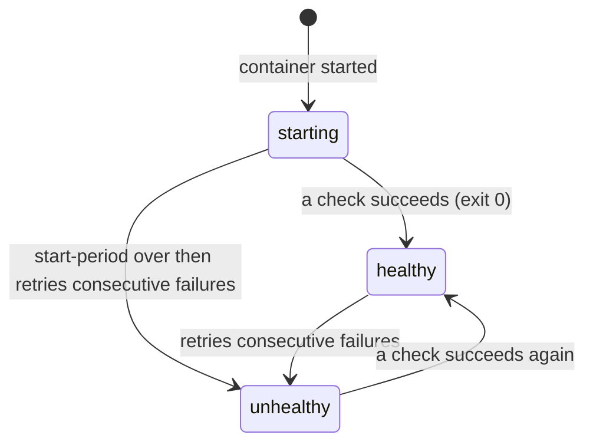
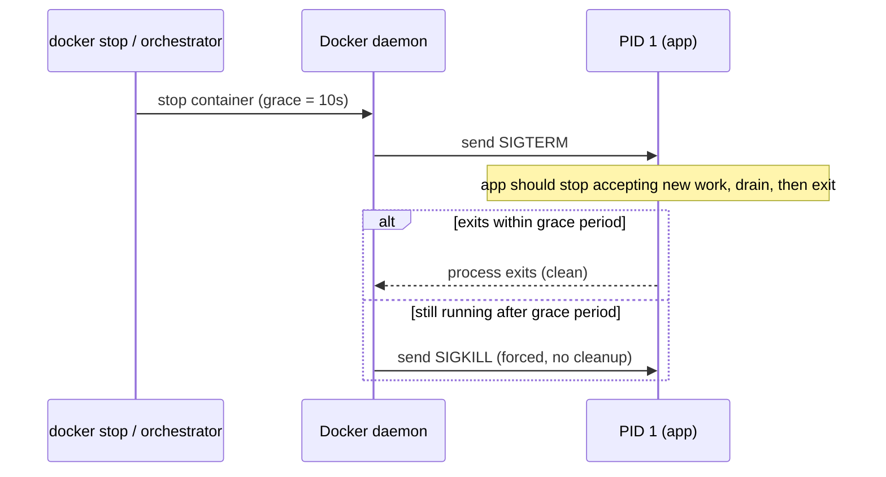
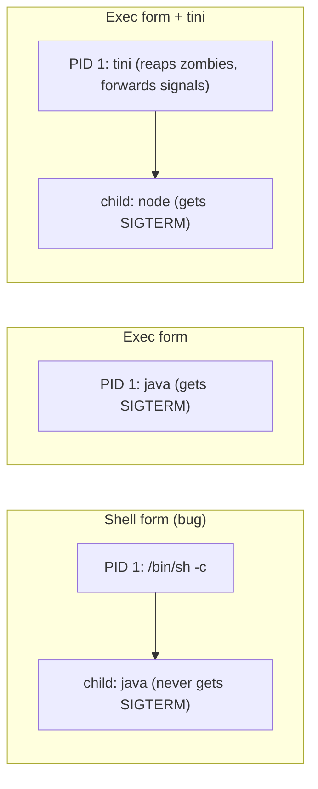

# Health Checks, Logging & Graceful Shutdown

Running a container in production is not the same as running it on a laptop. In
production the container is one replica among many, sitting behind a load balancer or
orchestrator that must answer three questions continuously: *Is this container alive and
ready to take traffic? Where do its logs go, and will they fill the disk? When I need to
stop or replace it, will it shut down cleanly without dropping requests?*

This topic covers the three container-level mechanisms that answer those questions:
**health checks** (`HEALTHCHECK`), **logging** (stdout/stderr + log drivers), and
**graceful shutdown** (SIGTERM handling and the stop grace period). These are the
features interviewers probe to see whether you have actually operated containers, not
just built images.

> [!INTERVIEW]
> A very common senior-level question: "Your service is deployed as containers behind a
> load balancer. A deploy replaces old containers with new ones and users see 502s and
> dropped connections during every deploy. Walk me through every reason that happens and
> how you'd fix it." Answering well requires all three pillars — health checks
> (readiness), signal handling (SIGTERM), and connection draining.

---

## Why orchestrators need health signals

A container that is *running* (its PID 1 process exists) is not necessarily *working*. A
Java app may be up but still loading its context, a DB connection pool may be exhausted,
or the process may be deadlocked while the kernel still reports it as alive. If the
platform routed traffic purely on "is the process running?", it would send requests into
broken replicas.

A **health check** gives the platform an application-level signal of readiness/health so
it can make routing and lifecycle decisions:

- **Docker/Compose** and **Swarm** use the container's health status to gate service
  readiness (e.g. `depends_on: condition: service_healthy`) and, in Swarm, to replace
  unhealthy tasks.
- **Load balancers** (ALB/NLB target groups, HAProxy, nginx) run their own health probes
  and only route to healthy targets.
- **Kubernetes** does not use the Docker `HEALTHCHECK`; it defines its own **liveness**,
  **readiness**, and **startup** probes (see the K8s comparison below).

> [!KEY-TAKEAWAY]
> "Running" is a process fact; "healthy" is an application fact. Orchestrators route and
> restart based on *health*, so the container must expose a health signal that reflects
> the app's real ability to serve.

---

## The HEALTHCHECK instruction

`HEALTHCHECK` tells Docker how to test that a container is still working by running a
command *inside* the container periodically. Its exit code determines health.

```dockerfile
FROM node:20-alpine
WORKDIR /app
COPY . .
RUN npm ci --omit=dev
EXPOSE 3000
HEALTHCHECK --interval=30s --timeout=3s --start-period=10s --retries=3 \
  CMD wget -q -O- http://localhost:3000/healthz || exit 1
CMD ["node", "server.js"]
```

The check command's **exit code** is the entire contract:

| Exit code | Meaning |
|---|---|
| `0` | **success** — the container is healthy |
| `1` | **unhealthy** — the check failed |
| `2` | **reserved** — do not use it (undefined behavior) |

Two forms exist:

- `HEALTHCHECK [OPTIONS] CMD <command>` — define a check.
- `HEALTHCHECK NONE` — disable any health check, including one inherited from the base
  image.

> [!WARNING]
> Only the **last** `HEALTHCHECK` in a Dockerfile takes effect (like `CMD`/`ENTRYPOINT`).
> If your base image defines one and you don't want it, you must explicitly override with
> your own or `HEALTHCHECK NONE`.

---

## HEALTHCHECK options and defaults

| Option | Default | Meaning |
|---|---|---|
| `--interval` | `30s` | Time between checks (and between the first check and container start). |
| `--timeout` | `30s` | A check taking longer than this counts as a failure. |
| `--start-period` | `0s` | Grace/bootstrap window: failures here do **not** count toward `--retries`, and a *single* success ends the start period early. |
| `--start-interval` | `5s` | Interval between checks *during* the start period (newer Docker versions). |
| `--retries` | `3` | Consecutive failures required to flip `starting`/`healthy` → `unhealthy`. |

The `--start-period` is the key production knob for slow-booting apps (JVM, large
frameworks): set it long enough that startup doesn't immediately mark the container
unhealthy, but don't set it so long that a truly-dead container looks fine for minutes.

> [!TIP]
> Keep `--timeout` well under `--interval`, and keep the probe *cheap*. A health endpoint
> that does heavy work (checks every downstream dependency, runs a DB query on each hit)
> can itself become a load source and cause cascading "unhealthy" flapping under stress.

---

## Health states and state transitions

A container with a health check moves through three states, visible in
`docker ps` (the `STATUS` column shows e.g. `Up 2 minutes (healthy)`) and in
`docker inspect --format '{{.State.Health.Status}}'`:



- **starting** — initial state; the container is up but no successful check yet. During
  `--start-period`, failures are ignored.
- **healthy** — at least one check has passed and it is not currently failing beyond the
  retry threshold.
- **unhealthy** — `--retries` consecutive failures occurred (after the start period).

> [!WARNING]
> A key gotcha: **`unhealthy` does not restart the container by itself.** Plain Docker
> only *reports* health; it does not act on it. Something must consume the status: Swarm
> replaces unhealthy tasks, a load balancer stops routing, or you pair it with
> `--restart` plus tooling like Docker's autoheal pattern. `HEALTHCHECK` + `restart: unless-stopped`
> alone will **not** auto-restart an unhealthy-but-running container.

Inspect the last few probe results (stdout + exit code of each check are stored):

```bash
docker inspect --format '{{json .State.Health}}' web | jq
# .Status, .FailingStreak, and .Log[] (each with Start, End, ExitCode, Output)
```

---

## Health check gotchas in real Dockerfiles

The most common failure is a probe that references a tool the image doesn't have:

```dockerfile
# BROKEN on distroless / slim images: curl is not installed
HEALTHCHECK CMD curl -f http://localhost:8080/health || exit 1
```

On a `distroless`, `scratch`, or minimal `alpine` image, `curl` may not exist, so the
check always fails and the container is perpetually `unhealthy`. Fixes:

- Use a shell built-in / already-present tool (`wget` on alpine), or
- Ship a tiny purpose-built health binary (Go apps often compile a
  `./app --health-check` sub-command), or
- Have the app expose a health command it can run itself.

```dockerfile
# Go pattern: no external tools needed, works even on scratch
HEALTHCHECK --interval=10s --timeout=2s CMD ["/app", "-healthcheck"]
```

Other gotchas:

- The check runs **inside** the container's network namespace, so use `localhost` /
  `127.0.0.1`, not the published host port.
- Each probe spawns a process — very short intervals multiply CPU/exec overhead across
  hundreds of containers.
- The default forms: `HEALTHCHECK CMD <shell string>` runs via `/bin/sh -c` (shell form);
  the JSON array form (`CMD ["...", "..."]`) runs directly (exec form, no shell, so no
  `||` or variable expansion).

In Compose you can also define/override the check without touching the Dockerfile:

```yaml
services:
  web:
    image: myapp
    healthcheck:
      test: ["CMD", "wget", "-q", "-O-", "http://localhost:3000/healthz"]
      interval: 30s
      timeout: 3s
      retries: 3
      start_period: 10s
    # test: ["NONE"]  # disables an inherited healthcheck
```

---

## Health check vs Kubernetes liveness/readiness/startup probes

Interviewers frequently ask you to distinguish the Docker `HEALTHCHECK` from Kubernetes
probes. **Kubernetes ignores the Docker `HEALTHCHECK` entirely** and defines its own
probes on the Pod spec (Kubernetes is covered in its own domain — this is just the
pointer):

| | Docker `HEALTHCHECK` | K8s **liveness** | K8s **readiness** | K8s **startup** |
|---|---|---|---|---|
| Question answered | Is the container healthy? | Should we restart it? | Should it receive traffic? | Has it finished booting? |
| Action on failure | reports `unhealthy` only | kill & restart container | remove from Service endpoints | hold off liveness/readiness until it passes |
| Defined where | Dockerfile / Compose | Pod spec | Pod spec | Pod spec |

The important conceptual split K8s makes that a single Docker check does not: **liveness
≠ readiness**. A container can be *alive* (don't restart me) but *not ready* (don't send
me traffic yet — I'm draining, or a dependency is down). Collapsing both into one signal
causes restart storms. Docker's single health status is closest to a liveness/readiness
hybrid; K8s deliberately separates them.

> [!KEY-TAKEAWAY]
> Docker health = one signal, report-only. Kubernetes splits it: **liveness** (restart),
> **readiness** (route traffic), **startup** (protect slow boots). Never let a slow
> dependency fail a *liveness* probe — that turns a downstream blip into a restart loop.

---

## The container logging model: stdout/stderr

The **12-factor** rule for containers: **a container treats logs as an event stream and
writes them to `stdout`/`stderr` — it does not manage log files itself.** The container
process should not know or care where logs ultimately go; the runtime captures the
streams and routes them.

Why this matters:

- The Docker daemon captures whatever PID 1 writes to stdout/stderr and hands it to the
  configured **logging driver**. `docker logs <container>` replays that.
- It decouples the app from log storage: the same image works whether logs go to a file,
  journald, CloudWatch, or Fluentd — configured at the platform level, not baked in.
- Containers are ephemeral; a log file *inside* the writable layer dies with the
  container and isn't visible to `docker logs` or your log aggregation.

```dockerfile
# Good: framework/app configured to log to console (stdout/stderr)
# e.g. Spring Boot default console appender, nginx access_log /dev/stdout, etc.
```

For images whose upstream tool insists on writing to a file, the idiomatic fix is to
**symlink the log file to stdout/stderr** so the stream is captured (this is exactly what
the official nginx image does):

```dockerfile
RUN ln -sf /dev/stdout /var/log/nginx/access.log \
 && ln -sf /dev/stderr /var/log/nginx/error.log
```

> [!KEY-TAKEAWAY]
> Log to `stdout`/`stderr`, one event per line. Let the platform decide storage and
> shipping. Writing your own log files inside the container couples the app to storage,
> hides logs from `docker logs`, and grows the container's writable layer.

---

## The json-file driver and log rotation (avoiding disk-fill)

The **default** logging driver is **`json-file`**: the daemon writes each log line as a
JSON object to a file on the host under
`/var/lib/docker/containers/<id>/<id>-json.log`.

> [!WARNING]
> **`json-file` does NOT rotate logs by default.** A chatty container can grow that file
> until it fills `/var/lib/docker` (or the whole disk), taking down the daemon and every
> container on the host. This is one of the most common real-world Docker outages.

Enable rotation with `max-size` (per file) and `max-file` (number of rotated files).
Values are strings:

```json
// /etc/docker/daemon.json — daemon-wide default (applies to NEW containers only)
{
  "log-driver": "json-file",
  "log-opts": {
    "max-size": "10m",
    "max-file": "3"
  }
}
```

Or per container / per service:

```bash
docker run --log-opt max-size=10m --log-opt max-file=3 myimg
```

```yaml
services:
  web:
    image: myapp
    logging:
      driver: json-file
      options:
        max-size: "10m"
        max-file: "3"
```

The newer **`local`** driver is recommended when you don't need `docker logs` to be
consumed by an external json-file-based tool: it **rotates by default** (20 MB × 5 files,
i.e. ~100 MB per container, out of the box) and uses a more compact, more efficient
on-disk format.

> [!TIP]
> Changing `daemon.json` only affects **newly created** containers — existing containers
> keep the driver/options they were created with. You must recreate them to pick up new
> log settings.

---

## Other logging drivers

Beyond `json-file`/`local`, Docker supports drivers that ship logs directly to a backend,
avoiding on-host files entirely:

| Driver | Ships to | Typical use |
|---|---|---|
| `json-file` | host JSON file (default) | dev, small hosts (must add rotation) |
| `local` | host, compact + rotated | better default for single hosts |
| `journald` | systemd journal | hosts using journald; queryable by metadata |
| `syslog` | syslog daemon | central syslog infra |
| `fluentd` | Fluentd/Fluent Bit forward input | pipeline into ELK/Loki/etc. |
| `awslogs` | Amazon CloudWatch Logs | ECS/Fargate, AWS-native |
| `gelf` | Graylog / Logstash (GELF) | Graylog stacks |
| `splunk` | Splunk HTTP Event Collector | Splunk stacks |

Two important operational notes:

- **`docker logs` only works with `json-file`, `local`, and `journald`.** With
  `fluentd`, `awslogs`, `splunk`, `gelf`, `syslog`, etc., `docker logs` returns nothing —
  you must view logs in the backend. (The `none` driver disables logging entirely and
  also breaks `docker logs`.)
- **Delivery mode** (`mode`): the default `blocking` mode makes the container's write to
  stdout **block** if the driver's buffer is full — a slow/unreachable logging backend can
  therefore stall (or even hang) your application. `mode: non-blocking` with a
  `max-buffer-size` uses an in-memory ring buffer and drops logs when full instead of
  blocking the app.

```bash
docker run --log-driver=fluentd \
  --log-opt fluentd-address=localhost:24224 \
  --log-opt mode=non-blocking --log-opt max-buffer-size=4m  myimg
```

> [!WARNING]
> With the default **blocking** delivery mode, a stuck logging backend can hang your
> application. For latency-sensitive services, prefer `non-blocking` (accepting that logs
> may be dropped under pressure) or a local agent that never back-pressures.

---

## Graceful shutdown: docker stop, SIGTERM, and the grace period

When a container is stopped (deploy, scale-down, `docker stop`, host shutdown), Docker
runs a two-phase termination:



- `docker stop` sends **`SIGTERM`** to PID 1, waits the **grace period** (default **10s**,
  configurable with `docker stop -t <sec>` or `--stop-timeout` / Compose
  `stop_grace_period`), then sends **`SIGKILL`** if the process is still alive.
- `docker kill` sends `SIGKILL` immediately (no chance to clean up) by default.
- `STOPSIGNAL` in the Dockerfile (or `--stop-signal`) changes which signal is sent first
  (some apps expect `SIGQUIT`, e.g. nginx for graceful quit).

The point of the grace period is to give the app time to finish in-flight requests, flush
buffers, close DB connections, and deregister — *before* it's killed.

> [!KEY-TAKEAWAY]
> `docker stop` = SIGTERM → wait grace period → SIGKILL. A well-behaved container catches
> SIGTERM, stops accepting new work, drains what's in flight, and exits **before** the
> timeout. If it doesn't exit in time, SIGKILL gives it no chance to clean up.

---

## PID 1, signal forwarding, and the exec-form requirement

Whether SIGTERM even *reaches* your application depends on how it was launched. In a
container, **PID 1 is special**: the kernel does not apply default signal handling to it,
so a process that hasn't installed a handler for a signal will *ignore* it (SIGTERM to
PID 1 with no handler = nothing happens).

The classic bug is the **shell form** of CMD/ENTRYPOINT:

```dockerfile
# SHELL FORM: PID 1 is /bin/sh -c, your app is a CHILD of the shell
CMD java -jar app.jar
```

Here `/bin/sh` is PID 1. On `docker stop`, SIGTERM goes to the shell, which typically does
**not** forward it to the child `java` process. The app never sees SIGTERM, waits out the
full grace period, and is SIGKILLed — losing in-flight requests every deploy.

The fix is the **exec form**, which makes your app PID 1 directly, so it receives SIGTERM:

```dockerfile
# EXEC FORM: java is PID 1 and receives SIGTERM directly
CMD ["java", "-jar", "app.jar"]
```

But making the app PID 1 has its own cost: PID 1 is responsible for **reaping zombie
processes** (reparented dead children). Apps that fork subprocesses and aren't designed to
be an init can accumulate zombies. The fix is a tiny **init process** as PID 1 that both
forwards signals and reaps zombies:

```dockerfile
# tini: forwards signals to the app and reaps zombies
ENTRYPOINT ["/sbin/tini", "--"]
CMD ["node", "server.js"]
```

Or just add `--init` at runtime (Docker bundles tini):

```bash
docker run --init myimg
```



> [!WARNING]
> Shell-form `CMD java -jar app.jar` is the #1 cause of "my app ignores SIGTERM and gets
> SIGKILLed." Use the exec form (JSON array) so the app is PID 1, and add `tini`/`--init`
> if the app forks children or doesn't reap zombies.

---

## Draining in-flight requests during shutdown

Receiving SIGTERM is necessary but not sufficient — the app must handle it *correctly* to
avoid dropping requests. A proper drain sequence:

1. **Catch SIGTERM** and begin graceful shutdown (do not exit immediately).
2. **Stop accepting new connections/requests** (stop the listener / mark readiness
   failing so the LB/orchestrator stops routing).
3. **Finish in-flight requests** up to a deadline.
4. **Close resources** (DB pools, message-broker consumers, flush metrics/logs).
5. **Exit 0**, ideally before the grace period expires.

```javascript
// Node/Express: drain on SIGTERM
const server = app.listen(3000);
process.on('SIGTERM', () => {
  server.close(() => {      // stop new conns, let in-flight finish
    pool.end();             // close DB pool
    process.exit(0);
  });
  // safety net: force-exit before docker SIGKILL
  setTimeout(() => process.exit(1), 9000).unref();
});
```

A subtle but critical **race**: when the LB/orchestrator tells the container to stop, it
sends SIGTERM at roughly the same moment it *starts* removing the endpoint. There's a
window where the app has begun shutting down but the LB is still routing new requests to
it → those get connection-refused. The standard mitigation is a **short delay before the
app stops accepting new connections** so it keeps serving during the few seconds it takes
the LB to deregister the endpoint. In plain Docker/Compose this delay lives *in the app*:
on SIGTERM, sleep briefly (or deregister from the LB first) before closing the listener.
On Kubernetes the same delay is expressed declaratively as a **`preStop` lifecycle hook**
(e.g. `exec: sleep 5`), which K8s runs before it sends SIGTERM — note that `preStop` is a
K8s-only construct and has no equivalent in the plain Docker runtime.

> [!INTERVIEW]
> "Why do we still see errors during deploys even though the app handles SIGTERM?" — the
> answer they're looking for is the **deregistration race**: SIGTERM and endpoint removal
> aren't atomic. You keep the listener open long enough for the LB to stop routing (an
> in-app delay before closing the listener in plain Docker; a `preStop` hook on K8s), then
> drain and exit. Also ensure the grace period is *longer* than your longest in-flight
> request.

---

## Common follow-up questions

- **Does `HEALTHCHECK` restart an unhealthy container?** No. Plain Docker only reports the
  status. A consumer (Swarm, a load balancer, an autoheal sidecar) must act on it.
  `restart: unless-stopped` reacts to the process *exiting*, not to `unhealthy`.
- **Why is `curl` in my HEALTHCHECK failing on a distroless image?** `curl` isn't
  installed. Use a tool that exists, or a self-contained health binary
  (`CMD ["/app","-healthcheck"]`).
- **What's the difference between liveness and readiness?** Liveness = should we restart
  it; readiness = should we send it traffic. Docker has one combined health status; K8s
  splits them (and ignores the Docker `HEALTHCHECK`).
- **My container's disk filled up — why?** Almost always unrotated `json-file` logs. Set
  `max-size`/`max-file`, or use the `local` driver.
- **Why doesn't `docker logs` show anything?** The container uses a driver that doesn't
  support it (`fluentd`, `awslogs`, `splunk`, `gelf`, `syslog`, `none`). Only `json-file`,
  `local`, and `journald` support `docker logs`.
- **My app ignores SIGTERM and always takes 10s to stop — why?** Shell-form
  CMD/ENTRYPOINT means `/bin/sh` is PID 1 and swallows the signal. Use exec form; add
  `tini`/`--init` if needed.
- **Should the health endpoint check downstream dependencies?** Be careful — a deep health
  check can flap under load and cause cascading unhealthiness. Keep liveness cheap; put
  dependency checks in readiness.
- **How long should the stop grace period be?** Longer than your longest expected
  in-flight request, plus drain time; otherwise SIGKILL truncates requests.

## References

- Docker docs — Dockerfile reference, `HEALTHCHECK` instruction (options, exit codes,
  states): <https://docs.docker.com/reference/dockerfile/#healthcheck>
- Docker docs — Configure logging drivers (default `json-file`, `local`, rotation,
  delivery modes): <https://docs.docker.com/config/containers/logging/configure/>
- Docker docs — `json-file` / `local` logging drivers:
  <https://docs.docker.com/config/containers/logging/json-file/>
- Docker docs — `docker stop`, stop timeout, and `STOPSIGNAL`:
  <https://docs.docker.com/reference/cli/docker/container/stop/>
- Docker docs — Run multiple processes / `--init` and tini:
  <https://github.com/krallin/tini>
- The Twelve-Factor App — Logs as event streams: <https://12factor.net/logs>
- Kubernetes docs — Configure Liveness, Readiness and Startup Probes (comparison pointer):
  <https://kubernetes.io/docs/tasks/configure-pod-container/configure-liveness-readiness-startup-probes/>
- CIS Docker Benchmark — logging & health-check recommendations.
