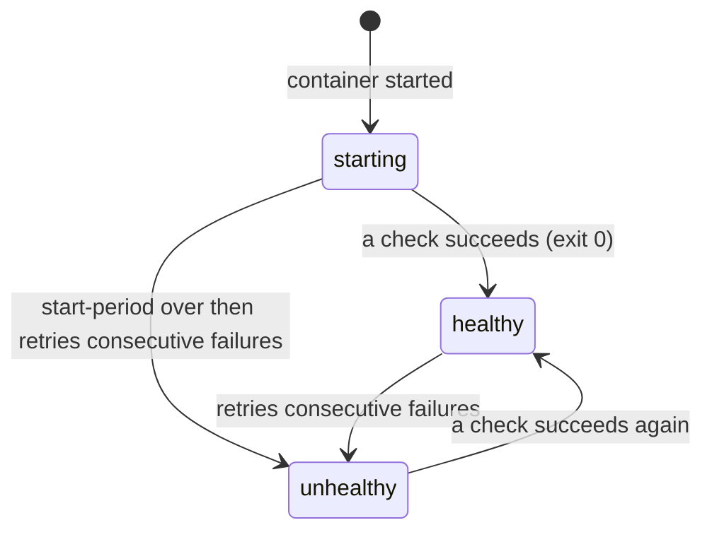
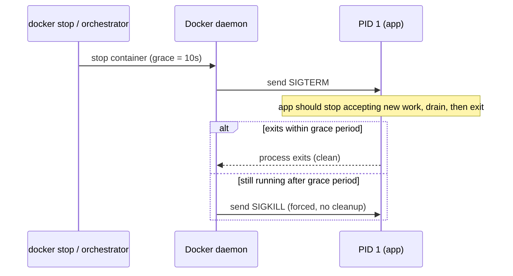
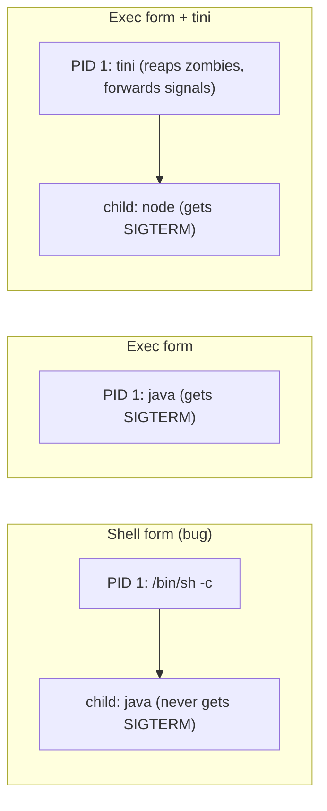

# Health Checks, Logging & Graceful Shutdown

Topic 9 put a byte-perfect image on every host and still could not explain the roughly two seconds of 502s that a rolling deploy emits even when the bytes are provably right. This file's last section, the 502 timeline, is where that loop closes.

Picture one replica behind a load balancer, mid-deploy. For about two seconds the old container is being told to stop while the balancer still routes live requests to it, and any request that lands in that window can come back as a 502. Whether it does turns on three things the container has to get right in production: whether it can tell the platform it is *ready to serve* and not merely *running*; where its logs go, and whether they quietly fill the host's disk; and whether, when the stop signal arrives, it catches the signal, finishes what is in flight, and exits before it is force-killed. Those are the three mechanisms this file builds — health checks, logging, and graceful shutdown — and the question underneath all of them is the same: what makes a running container actually safe to deploy to and away from?

> [!TIP]
> **Reading map.** About 29 minutes end to end. The three mechanisms are independent, so read for what you need: health checks run from [Why orchestrators need health signals](#why-orchestrators-need-health-signals) to the [Kubernetes comparison](#health-check-vs-kubernetes-livenessreadinessstartup-probes); logging is the two `## The container logging model` and driver sections; shutdown starts at [Graceful shutdown](#graceful-shutdown-docker-stop-sigterm-and-the-grace-period). The [502 timeline](#putting-it-together-anatomy-of-a-deploy-the-502-timeline) at the end assembles all three into one deploy — read that even if you skim the middle.

---

## Why orchestrators need health signals

A container whose PID 1 is alive is *running*; whether that process can actually answer a request is a separate fact, and only the second one should decide where traffic goes. A Java app can be up while it is still loading its context and cannot serve yet. A process can hold its port open while its database connection pool is exhausted, so every request times out. A process can deadlock and stop making progress while the kernel still lists it as alive. Route traffic on "is the process up?" and all three of these replicas get requests they cannot serve.

What the platform needs instead is a signal the application produces about itself. A **health check** is that signal: a command the engine runs inside the container on a schedule, whose exit status moves the container between three states — `starting`, `healthy`, and `unhealthy`. Now the platform has an application-level answer to "can this replica serve?", not just a kernel-level "does this process exist?"

The reason that distinction earns its own section is that several different consumers read the signal, and each does something different with it. The one question they all answer is: *given a health status, who acts on it?*

- Docker Compose and Swarm gate on it: `depends_on` with `condition: service_healthy` holds a dependent service until the check passes, and Swarm replaces tasks that go unhealthy.
- Load balancers — ALB and NLB target groups, HAProxy, nginx — run their *own* probes and route only to targets that pass them.
- Kubernetes ignores the Docker health check entirely and defines its own liveness, readiness, and startup probes, compared later in this file.

> [!KEY-TAKEAWAY]
> "Running" is a fact about a process; "healthy" is a fact about the application. Orchestrators route and restart on *health*, so a production container has to expose a signal that tracks its real ability to serve — not just the fact that its process exists.

The signal has to come from somewhere. The next section is the Dockerfile instruction that defines the command the engine runs to produce it.

---

## The HEALTHCHECK instruction

`HEALTHCHECK` is the Dockerfile instruction that supplies that command: the engine runs it *inside* the running container on a schedule, and the command's exit code is the entire contract.

```dockerfile
FROM node:22-alpine
WORKDIR /app
COPY . .
RUN npm ci --omit=dev
EXPOSE 3000
HEALTHCHECK --interval=30s --timeout=3s --start-period=10s --retries=3 \
  CMD wget -q -O- http://localhost:3000/healthz || exit 1
CMD ["node", "server.js"]
```

Here the check hits the app's own `/healthz` endpoint on port 3000 every 30 seconds, and its exit code decides the container's health. Three codes are defined:

| Exit code | Meaning |
|---|---|
| `0` | success — the container is healthy |
| `1` | unhealthy — the check failed |
| `2` | reserved — do not use it (behaviour is undefined) |

The engine records the check as healthy on exit `0` and on nothing else. Exit `1` is the documented failure code; exit `2` is reserved, so the docs tell you not to emit it. Every *other* non-zero code is scored exactly like `1` — a failed check that counts toward the failing streak. That last rule is why a broken *probe* fails the *container*: a missing binary exits `127` (`sh: curl: not found`) and a shell syntax error exits `2`, and both flip the container toward unhealthy even though the application is fine. That is the same trap as the distroless `curl` gotcha two sections down.

Two forms exist. `HEALTHCHECK [OPTIONS] CMD <command>` defines a check; `HEALTHCHECK NONE` disables any check, including one inherited from the base image. Only the *last* `HEALTHCHECK` in a Dockerfile takes effect, the same way `CMD` and `ENTRYPOINT` do, so if a base image ships one you do not want, you must override it with your own line or switch it off with `HEALTHCHECK NONE`.

The command is only half the instruction. The other half is the five options that decide how often it runs and how many failures it tolerates before giving up.

---

## HEALTHCHECK options and defaults

Five options control the check's cadence and its tolerance, and the defaults are tuned for a service that boots quickly, not for a JVM.

| Option | Default | Meaning |
|---|---|---|
| `--interval` | `30s` | Time between checks, and between container start and the first check. |
| `--timeout` | `30s` | A check running longer than this is scored as a failure. |
| `--start-period` | `0s` | Bootstrap window: failures inside it do not count toward `--retries`, and one success ends the window early. |
| `--start-interval` | `5s` | Interval between checks *during* the start period (added in Docker Engine 25.0). |
| `--retries` | `3` | Consecutive failures needed to flip `starting`/`healthy` → `unhealthy`. |

`--start-period` is the production knob for slow-booting apps such as a JVM or a large framework. Set it long enough that a normal cold start does not get marked unhealthy, but not so long that a genuinely dead container looks fine for minutes before anyone notices.

There is a trap baked into the defaults: `--timeout` defaults to `30s`, exactly equal to the default `--interval`. A probe that hangs can therefore occupy the whole interval before it is finally scored a failure — the opposite of failing fast. Keep `--timeout` well under `--interval`, for example `--timeout=3s`, so a stuck check returns a verdict quickly instead of eating a full cycle. Keep the probe cheap while you are at it: a health endpoint that queries every downstream dependency on each hit becomes a load source of its own, and under stress it can flap the whole fleet unhealthy.

Those knobs only make sense once you can watch the states they move the container between, and see how long that takes.

---

## Health states and state transitions

A health-checked container is always in exactly one of three states, and the exit codes plus the retry count drive every move between them. You can read the current state two ways: `docker ps` shows it in the `STATUS` column (for example `Up 2 minutes (healthy)`), and `docker inspect --format '{{.State.Health.Status}}'` prints it on its own.



Each state means one thing. `starting` is the initial state: the container is up but no check has passed yet, and during `--start-period` failures are ignored. `healthy` means at least one check has passed and the container is not currently failing beyond the retry threshold. `unhealthy` means `--retries` consecutive checks have failed after the start period ended.

One transition is missing from that list on purpose, because it is the gotcha most people trip on: there is no arrow from `unhealthy` to *restarted*. Plain Docker only *reports* health; it never acts on it. Something else has to consume the status and take action — Swarm replaces unhealthy tasks, a load balancer stops routing to them, or you add an autoheal sidecar that watches the status and restarts the container. On its own, even `HEALTHCHECK` paired with `restart: unless-stopped` will not restart an unhealthy-but-running container, because a restart policy reacts to the process *exiting*, not to the health status flipping.

### Worked example: how long until a dead backend is declared `unhealthy`?

The detection-latency arithmetic is the whole point here: a dead backend is not marked `unhealthy` the moment it dies, and you cannot read the delay off any single option. It is a product of three of them, and treating `--interval`, `--timeout`, and `--retries` as isolated knobs is how people end up asking why a wedged backend took 90 seconds to show up. Take the running example's `--interval=30s --timeout=3s --retries=3`, and say the app is healthy and then wedges — deadlocks, stops responding — at `t=0`:

| Time | Check | Result | Failing streak | State |
|---|---|---|---|---|
| t≈30s | probe #1 fires, hangs, times out at +3s | fail | 1 | still `healthy` |
| t≈60s | probe #2 fires, times out | fail | 2 | still `healthy` |
| t≈90s | probe #3 fires, times out | fail | 3 = retries | → `unhealthy` |

Detection latency is therefore about `interval × retries`, here `30 × 3 = 90s`. For roughly 90 seconds after the backend is effectively dead, `docker ps` still prints `(healthy)` and anything gating on that status keeps treating the replica as good. The `--timeout=3s` is not what sets the 90s; it only bounds how long each failing check may occupy before it is scored — without it, a probe that hangs forever would never return a verdict at all.

Cutting the latency trades against flap risk, and the trade goes in one direction: the faster you want to detect death, the more a single transient blip can be mistaken for it. Drop to `--interval=10s --retries=3` and detection falls to about 30 seconds, at the price of three times as many probe executions and a higher chance a single slow garbage-collection pause trips a false `unhealthy`. Drop to `--retries=1` and detection is one interval — but now a single dropped packet or a 200 ms stall flips the container. That is exactly what the retry count exists to prevent: it demands *consecutive* failures, so noise alone cannot flap the container. So pick the largest detection latency your dependents can tolerate, then back into `interval` and `retries`; do not just shrink `interval` and hope.

To see why a container flipped, read the stored probe results — the engine keeps the last few checks, each with its exit code and output:

```bash
docker inspect --format '{{json .State.Health}}' web | jq
# .Status, .FailingStreak, and .Log[] (each with Start, End, ExitCode, Output)
```

That arithmetic assumes the probe itself works. In real Dockerfiles the probe is often the thing that is broken.

---

## Health check gotchas in real Dockerfiles

The most common health-check failure in production is not a sick application at all — it is a probe that calls a tool the image does not ship:

```dockerfile
# BROKEN on distroless / slim images: curl is not installed
HEALTHCHECK CMD curl -f http://localhost:8080/health || exit 1
```

On a `distroless`, `scratch`, or minimal `alpine` image, `curl` is usually absent, the check exits `127`, and — by the exit-code rule from two sections back — the container sits `unhealthy` forever while the app is perfectly fine. There are three ways out, and they answer the same question, *what can the probe call that is guaranteed to be present?*

- Call a tool the image already ships (`wget` is on `alpine`; a plain shell test can work).
- Ship a tiny purpose-built health binary — Go services often compile a `./app --health-check` subcommand into the same static binary, so it works even on `scratch`.
- Have the application expose a self-check command it runs against itself.

```dockerfile
# Go pattern: no external tools needed, works even on scratch
HEALTHCHECK --interval=10s --timeout=2s CMD ["/app", "-healthcheck"]
```

### Where else it breaks: the namespace, the shell, and Compose

Three more traps have nothing to do with a missing binary. The first is addressing. The probe runs *inside* the container's network namespace, the same namespace the app binds in. So it must use `localhost` or `127.0.0.1` and the container-internal port, never the published host port, which does not exist from inside. The second is cost: every probe spawns a process, so a very short interval multiplied across hundreds of containers becomes real exec and CPU overhead on the host. The third is form. A bare `HEALTHCHECK CMD wget ...` runs through `/bin/sh -c` — the shell form — which is what makes `|| exit 1` and `$VAR` work. The JSON-array `CMD ["/app","-healthcheck"]` is exec form: it runs the binary directly, with no shell and so no `||` or variable expansion. It is the same split `entrypoint-vs-cmd` drew for the process itself.

You do not have to touch the Dockerfile to set or change any of this. Compose defines the check on the service, and can also disable an inherited one:

```yaml
services:
  web:
    image: myapp
    healthcheck:
      test: ["CMD", "wget", "-q", "-O-", "http://localhost:3000/healthz"]
      interval: 30s
      timeout: 3s
      retries: 3
      start_period: 10s
    # test: ["NONE"]  # disables an inherited healthcheck
```

A Docker health status is one signal used locally. Kubernetes needs more than one, and splits the job three ways.

---

## Health check vs Kubernetes liveness/readiness/startup probes

Kubernetes ignores the Docker `HEALTHCHECK` completely and defines its own probes on the Pod spec. The reason to care is not which platform you run — it is that a single Docker health status cannot say the one thing Kubernetes insists on separating. (Kubernetes has its own domain; this is only the pointer.)

| | Docker `HEALTHCHECK` | K8s liveness | K8s readiness | K8s startup |
|---|---|---|---|---|
| Question answered | Is the container healthy? | Should we restart it? | Should it receive traffic? | Has it finished booting? |
| Action on failure | reports `unhealthy` only | kill and restart container | remove from Service endpoints | hold off liveness/readiness until it passes |
| Defined where | Dockerfile / Compose | Pod spec | Pod spec | Pod spec |

The split that a single Docker check cannot express is *liveness versus readiness*. A container can be alive — do not restart me — while not ready — do not send me traffic yet, because I am draining or a dependency is down. Fold both into one signal and you get restart storms, because a slow dependency that should merely pull the replica out of rotation instead trips a *restart*. Docker's single health status is closest to a liveness/readiness hybrid; Kubernetes keeps startup separate too, so a slow cold boot cannot be misread as a liveness failure and killed mid-startup. The rule that falls out of it: never let a slow dependency fail a *liveness* probe, or a downstream blip becomes a restart loop.

Health decides whether a replica should get traffic. The next question production asks is where everything that replica prints actually goes.

---

## The container logging model: stdout/stderr

In a container the application does not manage log files; it writes a stream to `stdout`/`stderr` and lets the runtime decide where that stream ends up. The daemon captures whatever PID 1 writes to those two file descriptors and hands it to a **logging driver** — the daemon component that decides where captured output goes — and `docker logs <container>` just replays what that driver stored. This is the 12-factor rule for logs: treat them as an event stream the process emits, not files the process owns.

Routing logs through the runtime instead of writing files yourself buys two things and avoids one disaster. It decouples the image from storage: the exact same image can send logs to a host file, to journald, to CloudWatch, or to Fluentd, chosen at the platform level and never baked into the build. And it keeps the logs reachable — a log file written *inside* the container's writable layer (the throwaway top layer from `images-vs-containers`) dies with the container and is invisible to both `docker logs` and any central aggregation. So the guidance is flat: log to `stdout`/`stderr`, one event per line, and let the platform decide storage and shipping. Writing your own files inside the container couples the app to storage, hides output from `docker logs`, and inflates the writable layer.

Most application frameworks already log to the console out of the box — Spring Boot's default console appender writes to stdout, for instance. Some upstream tools insist on writing to a file anyway, and the idiomatic fix is to point that file at the stream, which is exactly what the official nginx image does:

```dockerfile
RUN ln -sf /dev/stdout /var/log/nginx/access.log \
 && ln -sf /dev/stderr /var/log/nginx/error.log
```

Streaming to `stdout` settles where logs come from. It says nothing about where they pile up — which is how a single chatty container fills a host disk.

---

## The json-file driver and log rotation (avoiding disk-fill)

The default logging driver, `json-file`, writes every log line as a JSON object to a host file at `/var/lib/docker/containers/<id>/<id>-json.log`, and it does not rotate that file unless you tell it to.

> [!WARNING]
> `json-file` does not rotate logs by default. A chatty container can grow that one file until it fills `/var/lib/docker` — or the whole disk — which takes down the daemon and every container on the host. This is one of the most common real-world Docker outages.

You turn rotation on with `max-size` (bytes per file) and `max-file` (how many rotated files to keep); both values are strings. Set it as a daemon-wide default in `daemon.json`, per container on `docker run`, or per service in Compose:

```json
// /etc/docker/daemon.json — daemon-wide default
{
  "log-driver": "json-file",
  "log-opts": {
    "max-size": "10m",
    "max-file": "3"
  }
}
```

```bash
docker run --log-opt max-size=10m --log-opt max-file=3 myimg
```

```yaml
services:
  web:
    image: myapp
    logging:
      driver: json-file
      options:
        max-size: "10m"
        max-file: "3"
```

One catch on the `daemon.json` route: it applies only to *newly created* containers. Existing containers keep whatever driver and options they were built with, so you have to recreate them to pick up a new log setting.

### What it costs across a fleet: the disk-budget math

Pick the rotation numbers against your densest host, not one container, because the per-container cap multiplies. With `max-size=10m` and `max-file=3`, each container is capped at `10 MB × 3 = ~30 MB` of logs on disk. That looks negligible until you run 100 containers on a host: `30 MB × 100 = ~3 GB` of `/var/lib/docker` spent on logs alone, before a single image layer. Size `max-size` against your log volume and your densest host together.

The newer `local` driver is the better default when you do not need `docker logs` piped into an external JSON-based tool. It rotates out of the box — 20 MB across 5 files, about 100 MB per container by default, so 100 containers is roughly 10 GB, more than three times the `json-file` example above. It gets there by storing logs in a compact internal format that only the Docker daemon reads, and by compressing rotated files by default, instead of keeping them as plain uncompressed JSON.

That covers the two drivers that write to the host. Production more often ships logs straight off the box, which is a different set of drivers with a different failure mode.

---

## Other logging drivers

Beyond `json-file` and `local`, Docker ships drivers that push logs straight to a backend and keep no host file at all. That trades the disk-fill problem for two new ones, but first, the drivers and where each sends its stream:

| Driver | Ships to | Typical use |
|---|---|---|
| `json-file` | host JSON file (default) | dev, small hosts (must add rotation) |
| `local` | host, compact + rotated | better default for single hosts |
| `journald` | systemd journal | hosts using journald; queryable by metadata |
| `syslog` | syslog daemon | central syslog infra |
| `fluentd` | Fluentd/Fluent Bit forward input | pipeline into ELK/Loki/etc. |
| `awslogs` | Amazon CloudWatch Logs | ECS/Fargate, AWS-native |
| `gelf` | Graylog / Logstash (GELF) | Graylog stacks |
| `splunk` | Splunk HTTP Event Collector | Splunk stacks |

The first new problem is that `docker logs` can no longer read from the driver. Only `json-file`, `local`, and `journald` store logs in a form `docker logs` reads back directly; a remote driver like `fluentd`, `awslogs`, `splunk`, `gelf`, or `syslog` keeps no such local store, so the real logs live in the backend and that is where you read them (tailing and reading container logs is `docker/debugging-troubleshooting`'s subject). Modern Docker softens the edge with *dual logging*: by default it keeps a small local cache alongside a remote driver, so `docker logs` can still replay the most recent lines — but that cache is bounded and can be turned off, and with no cache `docker logs` returns nothing. The `none` driver keeps nothing at all, so `docker logs` is empty for it too.

### Where it bites: blocking delivery and back-pressure

The second new problem is that a logging backend can now reach back and stall your application. The container's write to `stdout` is handed to the driver synchronously, and in the default `blocking` delivery mode that write does not return until the driver accepts it. So if the driver's buffer fills — the backend is slow, or unreachable — the write blocks, and the application blocks behind its own log line. A logging outage becomes an application outage.

```bash
docker run --log-driver=fluentd \
  --log-opt fluentd-address=localhost:24224 \
  --log-opt mode=non-blocking --log-opt max-buffer-size=4m  myimg
```

`mode: non-blocking` breaks that coupling: the driver writes into an in-memory ring buffer sized by `max-buffer-size` and, when the buffer is full, *drops* log lines instead of blocking the app. So the choice is explicit — with the default `blocking` mode a stuck backend can hang the service, and for anything latency-sensitive you either accept dropped logs under pressure with `non-blocking`, or run a local agent that never back-pressures.

Logging and health both assume the container keeps running. The last third of production is what happens when you deliberately stop it.

---

## Graceful shutdown: docker stop, SIGTERM, and the grace period

Stopping a container is a two-phase negotiation, not an instant kill. On `docker stop` — and on a deploy, a scale-down, or a host shutdown — the daemon first *asks* the app to exit, waits, and only then forces it:



`docker stop` sends `SIGTERM` to PID 1, waits the grace period — the 10-second Linux default from `container-lifecycle`, overridable with `docker stop -t <sec>`, `--stop-timeout`, or Compose's `stop_grace_period` — then sends `SIGKILL` if the process is still alive. `docker kill` skips straight to `SIGKILL` with no waiting. And `STOPSIGNAL` in the Dockerfile, or `--stop-signal` at runtime, changes which signal is sent first: nginx, for one, treats `SIGQUIT` as its graceful-shutdown signal, so its images set that as the stop signal.

The whole point of the wait is to give the app those seconds to finish in-flight requests, flush buffers, close database connections, and deregister itself before anything kills it. A container that catches `SIGTERM`, stops taking new work, drains what is in flight, and exits before the timeout shuts down cleanly; one that ignores `SIGTERM` rides out the full grace period and gets `SIGKILL`ed with no chance to clean up.

The grace period only helps if `SIGTERM` actually reaches the app. Whether it does is decided by which process is PID 1.

---

## PID 1, signal forwarding, and the exec-form requirement

Whether `SIGTERM` reaches your application at all comes down to which process is PID 1. The kernel treats PID 1 specially: the default signal actions that would kill an ordinary process do not apply to it. A process that has not installed a handler for a signal simply ignores it — so `SIGTERM` sent to a PID 1 that never registered a handler does nothing at all.

That turns the shell form of `CMD`/`ENTRYPOINT` into the classic shutdown bug:

```dockerfile
# SHELL FORM: PID 1 is /bin/sh -c, your app is a CHILD of the shell
CMD java -jar app.jar
```

The shell form runs the app through `/bin/sh -c`, so `/bin/sh` is PID 1 and the app (`java`) is its child. On `docker stop`, `SIGTERM` goes to the shell, which typically does not forward it to the child, so the app never sees the signal, waits out the entire grace period, and is `SIGKILL`ed — dropping in-flight requests on every deploy. The exec form fixes it by making the app PID 1 directly, so the signal lands on the app:

```dockerfile
# EXEC FORM: java is PID 1 and receives SIGTERM directly
CMD ["java", "-jar", "app.jar"]
```

### What it costs: PID 1 also has to reap zombies

Making the app PID 1 hands it a second job it may not be built for. When a child process finishes, it holds a slot in the process table until its parent collects the exit status with `wait()`. If the parent has already exited, that orphaned child re-parents to PID 1, and clearing it — reaping the `zombie`, in `container-lifecycle`'s terms — becomes PID 1's job. An application that forks subprocesses but was never designed to be an init leaks these slots. The fix is to put a tiny init process at PID 1 that does both jobs — forward signals to the app *and* reap zombies:

```dockerfile
# tini: forwards signals to the app and reaps zombies
ENTRYPOINT ["/sbin/tini", "--"]
CMD ["node", "server.js"]
```

Or add `--init` at runtime, which slots in Docker's bundled `tini` for you:

```bash
docker run --init myimg
```



> [!WARNING]
> Shell-form `CMD java -jar app.jar` is the number-one cause of "my app ignores `SIGTERM` and gets `SIGKILL`ed." Use the exec form so the app is PID 1, and add `tini` or `--init` if the app forks children and does not reap them itself.

Reaching the app with `SIGTERM` is necessary but not sufficient. The app still has to do the right things with it, in the right order, or it drops requests anyway.

---

## Draining in-flight requests during shutdown

Catching `SIGTERM` is only step one; an app that closes its listener the instant the signal lands drops exactly the requests the grace period was meant to protect. A correct drain runs a fixed sequence:

1. Catch `SIGTERM` and begin shutting down — do not exit immediately.
2. Stop accepting new work: stop the listener, or fail readiness so the balancer or orchestrator stops routing.
3. Finish in-flight requests, up to a deadline.
4. Close resources — database pools, message-broker consumers — and flush metrics and logs.
5. Exit `0`, ideally before the grace period expires.

```javascript
// Node/Express: drain on SIGTERM
const server = app.listen(3000);
process.on('SIGTERM', () => {
  server.close(() => {      // stop new conns, let in-flight finish
    pool.end();             // close DB pool
    process.exit(0);
  });
  // safety net: force-exit before docker SIGKILL
  setTimeout(() => process.exit(1), 9000).unref();
});
```

> [!WARNING]
> That `server.close()` hides a famous trap: it stops *accepting new* connections but does not close idle keep-alive sockets that are open between requests. Under keep-alive traffic — browsers, pooling clients — those idle sockets keep the server "busy," the `close()` callback never fires, and the app rides out the whole grace period to `SIGKILL`, truncating the very requests this code meant to protect. In Node 18+, pair `server.close()` with `server.closeIdleConnections()` (and `closeAllConnections()` once the drain deadline hits). The general lesson beyond Node: "stop the listener" is not enough while long-lived or keep-alive connections stay open — you must actively close idle ones once draining starts.

### Where it breaks: the deregistration race

Even a flawless in-app drain drops requests if it starts too early, because of a race the app cannot see. When the load balancer decides to stop a container, it sends `SIGTERM` at roughly the same instant it begins removing that container from its routing table, and those two acts are not atomic. For the short window it takes the removal to propagate, the balancer is still routing new requests to a container that has already begun shutting down. Each one meets a closed listener and comes back connection-refused.

The mitigation is to *not* stop accepting immediately. On `SIGTERM`, keep the listener open and wait a few seconds — a plain sleep, or an explicit deregister-from-the-balancer call first — so the balancer stops routing before the app stops serving. In plain Docker and Compose that delay lives inside the app. On Kubernetes the same delay is declarative: a `preStop` lifecycle hook, for example `exec: sleep 5`, that Kubernetes runs *before* it sends `SIGTERM`. `preStop` is a Kubernetes-only construct with no equivalent in the plain Docker runtime.

The grace period then has to cover the whole sequence: the deregistration delay, plus draining the longest in-flight request, plus closing resources. Size it shorter than that sum and `SIGKILL` truncates a request the code was carefully finishing — the exact failure the grace period existed to prevent.

Each of these — a swallowed signal, a premature close, too short a grace period, a cold replica taking traffic — is one line in a real deploy. The last section traces a single request through all of them.

---

## Putting it together: anatomy of a deploy (the 502 timeline)

This is the model answer to the deploy-time 502 the opener promised. The three pillars only pay off when you can trace one request through a rolling replace and map each 502 to its fix. Take a grace period of 30s, load-balancer deregistration that takes about 2s to propagate, and a longest request of about 5s:

| Time | What happens | 502 risk and the fix |
|---|---|---|
| t=0 | Orchestrator sends SIGTERM to the old container and begins deregistering its LB endpoint — the two are not atomic. | If the app closes its listener instantly, requests the LB still routes during the ~2s propagation get connection-refused → 502. Fix: on SIGTERM keep the listener open and `sleep ~2–5s` (K8s: `preStop`) *before* closing it. |
| t≈0–2s | LB is still deregistering; new requests may arrive, and the app is still accepting them thanks to the delay. | No 502 — the delay covers the race window. |
| t≈2s | Deregistration has propagated; the LB no longer routes here. The app now stops accepting and closes idle keep-alive sockets. | If the app used shell-form `CMD` (PID 1 = `/bin/sh`), SIGTERM was swallowed and never reached this step, so it sits idle until the 30s SIGKILL. Fix: exec form so the app is PID 1. |
| t≈2–7s | App drains the in-flight ~5s request to completion. | If the grace period were shorter than 5s, SIGKILL would truncate this request → dropped connection. Fix: grace period > longest request + drain (here 30s ≫ 7s). |
| t≈7s | All in-flight work done; app closes the DB pool, flushes logs, and exits 0 — well before the 30s deadline. | Clean exit; no SIGKILL, nothing skipped. |
| meanwhile | The new container starts; its `HEALTHCHECK`/readiness must pass before the LB routes to it (start-period covers slow boot). | If the LB routed before readiness passed, requests hit a not-yet-ready backend → 502/503. Fix: gate routing on health/readiness, not on "process started." |

Every 502 maps to exactly one pillar: a premature listener close is the deregistration race (in-app delay or `preStop`); a swallowed SIGTERM is the exec-form and init problem; a truncated request is grace-period sizing; a request hitting a cold replica is readiness gating. Name all four causes and you can trace any deploy-time 502 back to the mechanism that fixes it — which is the whole of what this topic taught.

## Common follow-up questions

- **Does `HEALTHCHECK` restart an unhealthy container?** No. Plain Docker only reports the status; a consumer (Swarm, a load balancer, an autoheal sidecar) has to act on it. `restart: unless-stopped` reacts to the process *exiting*, not to health flipping.
- **Why is `curl` in my HEALTHCHECK failing on a distroless image?** `curl` is not installed, so the check exits `127` and the container is stuck unhealthy. Use a tool that exists, or a self-contained health binary (`CMD ["/app","-healthcheck"]`).
- **What is the difference between liveness and readiness?** Liveness = should we restart it; readiness = should we send it traffic. Docker has one combined health status; Kubernetes splits them (and ignores the Docker `HEALTHCHECK`).
- **My container's disk filled up — why?** Almost always unrotated `json-file` logs. Set `max-size`/`max-file`, or use the `local` driver.
- **Why doesn't `docker logs` show anything?** The container uses a driver that does not keep a local copy (`fluentd`, `awslogs`, `splunk`, `gelf`, `syslog`, `none`). Only `json-file`, `local`, and `journald` support `docker logs`.
- **My app ignores `SIGTERM` and always takes 10s to stop — why?** Shell-form `CMD`/`ENTRYPOINT` makes `/bin/sh` PID 1, which swallows the signal. Use exec form; add `tini`/`--init` if needed.
- **Should the health endpoint check downstream dependencies?** Be careful — a deep check can flap under load and cause cascading unhealthiness. Keep the liveness check cheap; put dependency checks in readiness.
- **How long should the stop grace period be?** Longer than your longest expected in-flight request plus drain time; otherwise `SIGKILL` truncates requests.

## References

- Docker docs — Dockerfile reference, `HEALTHCHECK` instruction (options, exit codes, states): <https://docs.docker.com/reference/dockerfile/#healthcheck>
- Docker docs — Configure logging drivers (default `json-file`, `local`, rotation, delivery modes): <https://docs.docker.com/engine/logging/configure/>
- Docker docs — `json-file` and `local` logging drivers: <https://docs.docker.com/engine/logging/drivers/json-file/> and <https://docs.docker.com/engine/logging/drivers/local/>
- Docker docs — `docker stop`, stop timeout, and `STOPSIGNAL`: <https://docs.docker.com/reference/cli/docker/container/stop/>
- tini — a minimal init that forwards signals and reaps zombies (Docker's `--init`): <https://github.com/krallin/tini>
- The Twelve-Factor App — Logs as event streams: <https://12factor.net/logs>
- Kubernetes docs — Configure Liveness, Readiness and Startup Probes: <https://kubernetes.io/docs/tasks/configure-pod-container/configure-liveness-readiness-startup-probes/>
- CIS Docker Benchmark — logging and health-check recommendations.
