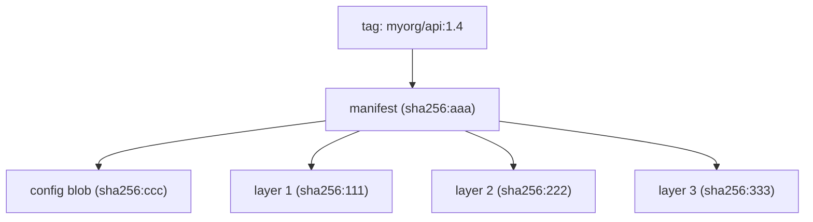
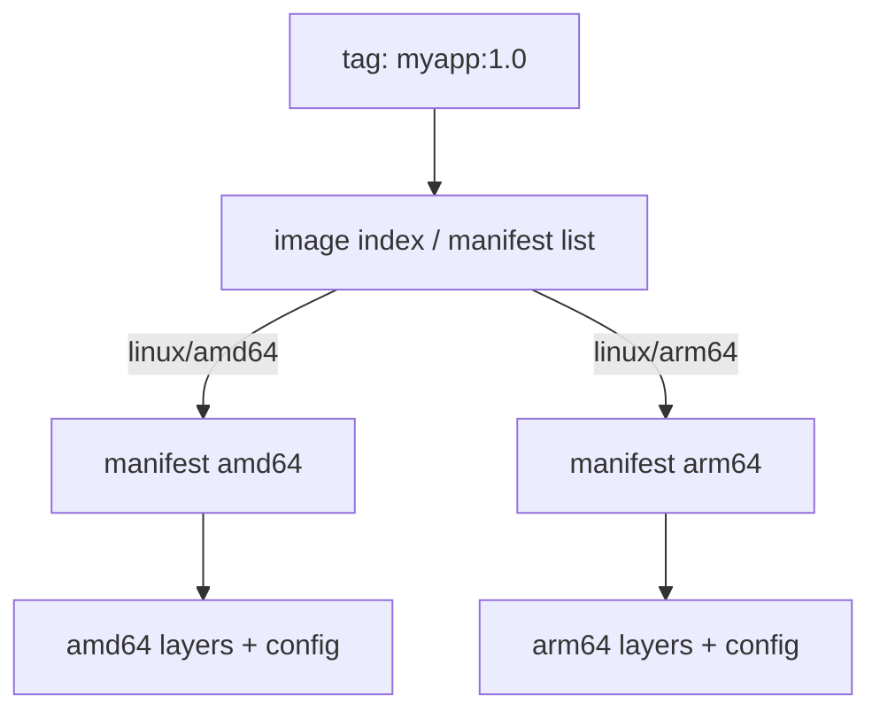

# Registries, Tagging & Distribution

How images move between machines: where they live (registries), how you name and
address them (tags vs digests), what actually travels over the wire (manifests and
layers), and how multi-architecture, promotion, rate limits, and garbage collection
work. This topic owns the **distribution** mechanics of Docker images. For building
images in CI and supply-chain concerns (SBOM, signing, provenance) see
`devops-cicd/software-supply-chain-security`; for scanning image layers for CVEs see
`docker/image-scanning-supply-chain`.

> [!KEY-TAKEAWAY]
> A **tag** is a mutable, human-friendly *pointer*; a **digest** (`sha256:...`) is an
> immutable, content-addressable *identity*. Reproducible, secure deployments pin by
> digest. `latest` is just a default tag name — it is not special and carries no
> "newest" guarantee.

---

## What a registry is

A **registry** is a stateful server that stores and distributes Docker/OCI images. It
speaks the **OCI Distribution Spec** (formerly the Docker Registry HTTP API v2) — a
REST API over HTTPS for pushing and pulling image manifests and layer blobs.

Vocabulary, from outside in:

- **Registry** — the host/server (e.g. `docker.io`, `ghcr.io`, `123456789.dkr.ecr.us-east-1.amazonaws.com`).
- **Repository** — a named collection of related images (e.g. `library/nginx`,
  `myorg/api`). One repo holds many tags/versions.
- **Tag / digest** — a specific image within a repository.

Common registries:

| Registry | Host | Notes |
|---|---|---|
| Docker Hub | `docker.io` (`registry-1.docker.io`) | Default; official images under `library/`; has pull rate limits |
| GitHub Container Registry | `ghcr.io` | Tied to GitHub orgs/repos; good for OSS + CI |
| Amazon ECR | `<acct>.dkr.ecr.<region>.amazonaws.com` | Private by default; IAM auth; lifecycle policies |
| Google Artifact Registry | `<region>-docker.pkg.dev` | GCP-native |
| Azure Container Registry | `<name>.azurecr.io` | Azure-native |
| Self-hosted | any host | CNCF **Distribution** (`registry:2`), Harbor, GitLab, JFrog Artifactory |

> [!TIP]
> A registry does not run containers. It is dumb storage + an API. The Docker Engine
> (or containerd, Kubernetes, Buildx) is the client that pushes and pulls.

---

## Image reference anatomy

A full image reference has up to four parts:

```
[REGISTRY[:PORT]/] [NAMESPACE/] REPOSITORY [:TAG | @DIGEST]
```

```
ghcr.io/myorg/api:1.4.2
│       │     │   │
│       │     │   └── tag
│       │     └────── repository
│       └──────────── namespace (org/user)
└──────────────────── registry host
```

Docker fills in defaults when parts are omitted, which is a frequent interview trap:

| You type | Docker resolves to |
|---|---|
| `nginx` | `docker.io/library/nginx:latest` |
| `myorg/api` | `docker.io/myorg/api:latest` |
| `redis:7` | `docker.io/library/redis:7` |
| `ghcr.io/o/a` | `ghcr.io/o/a:latest` |
| `localhost:5000/app` | `localhost:5000/app:latest` |

Rules that trip people up:

- The default registry is **always Docker Hub** (`docker.io`), never a local daemon
  cache. Only names containing a `.`/`:` before the first `/`, or `localhost`, are
  treated as a registry host — that is how Docker tells `myregistry.com/app` (registry)
  apart from `myorg/app` (Hub namespace).
- **Official images** live under the implicit `library/` namespace.
- If no tag *and* no digest is given, `:latest` is appended.

---

## Tags are mutable pointers

A tag is a mutable, human-readable label that points at one manifest digest in a
repository. Pushing a new image with the same tag **moves the pointer** — the old image
is not deleted (it just becomes untagged/dangling) and the tag now resolves to different
content.

```bash
docker build -t myorg/api:1.4 .
docker push myorg/api:1.4      # tag 1.4 -> digest A
# ... later, rebuild ...
docker push myorg/api:1.4      # tag 1.4 -> digest B (pointer moved!)
```

Implications:

- Two machines pulling `myorg/api:1.4` at different times can get **different bytes**.
- `docker pull` on an already-present tag may silently fetch new content.
- Tags are cheap: one image can carry many tags (`1`, `1.4`, `1.4.2`, `stable`) all
  pointing at the same digest. `docker tag` just adds another pointer — no data copied.

> [!WARNING]
> Never treat a tag as an immutable version in production. "It worked in staging with
> `:v2`" means nothing if someone re-pushed `:v2`. Pin by digest, or enforce
> immutable tags at the registry (ECR/Harbor/GHCR support "immutable tags").

---

## The immutable digest

A **digest** is the SHA-256 hash of the image **manifest** — `sha256:<64 hex>`. Because
it is derived from content (content-addressable), the same digest always refers to
exactly the same bytes on any registry, forever. Change one byte of any layer or the
config and the manifest changes and so does the digest.

```bash
# Pin by digest — fully reproducible
docker pull myorg/api@sha256:e3b0c44298fc1c149afbf4c8996fb92427ae41e4649b934ca495991b7852b855

# See a local image's repo digest (the pushed manifest digest)
docker inspect --format '{{index .RepoDigests 0}}' myorg/api:1.4
# myorg/api@sha256:e3b0c4...
```

Key points:

- The digest identifies the **manifest**, not any single layer; layers have their own
  digests too, but "the image digest" = manifest digest.
- Pinning by digest defeats the mutable-tag problem: `image@sha256:...` can never point
  at different content. This is what Kubernetes admission policies and reproducible
  builds require.
- A tag and a digest can be combined for clarity: `nginx:1.27@sha256:...` — Docker
  verifies the tag resolves to that digest.
- The digest you get from `docker images --digests` / `RepoDigests` is the **registry**
  manifest digest, which can differ from the local image ID (which hashes the config).

> [!INTERVIEW]
> "How do you guarantee prod runs the exact image you tested?" Answer: promote by
> **digest**, not tag. Capture the digest at build/test time and deploy
> `repo@sha256:...`; enforce with an admission controller that rejects tag-only refs.

---

## The 'latest' tag foot-gun

`latest` is **not** special to Docker. It is simply the tag name applied when you push
or pull without specifying one. It does *not* mean "most recent" and is not updated
automatically.

Gotchas:

- `docker build -t myorg/api .` tags `:latest`. If you later `docker build -t
  myorg/api:1.5 .` and push, `:latest` still points at the old build until you
  explicitly re-tag/push it.
- `docker run myorg/api` pulls `:latest` — which may be months old or missing entirely.
- Using `FROM node:latest` makes builds **non-reproducible**: the base drifts under you,
  breaking builds and silently changing your runtime.

> [!WARNING]
> In production Dockerfiles and manifests, avoid `latest`. Use explicit version tags
> (`node:20.11-slim`) and, for maximum reproducibility, pin the base by digest
> (`FROM node:20.11-slim@sha256:...`).

---

## Authentication: login, tokens, credential helpers

Public images pull anonymously. Pushing, and pulling private repos, requires auth.

```bash
docker login                       # Docker Hub, prompts user/password or PAT
docker login ghcr.io -u USER --password-stdin < token.txt
docker login 123.dkr.ecr.us-east-1.amazonaws.com   # via helper/token
docker logout ghcr.io
```

How it works under the hood (OCI/Docker token flow):

1. Client requests a resource; registry replies `401` with a `WWW-Authenticate` header
   naming a **token/auth service** and the required scope.
2. Client authenticates to that service (basic auth / PAT) and receives a short-lived
   **bearer token** scoped to `repository:myorg/api:pull,push`.
3. Client retries with `Authorization: Bearer <token>`.

Credential handling:

- `docker login` writes credentials to `~/.docker/config.json`. By default the token is
  **base64-encoded, not encrypted** — a common security finding.
- Use a **credential helper** (`credsStore`) to store secrets in the OS keychain
  (`docker-credential-osxkeychain`, `secretservice`, `wincred`) or cloud helpers
  (`docker-credential-ecr-login`, `docker-credential-gcr`).
- CI should use short-lived tokens / OIDC, never long-lived passwords baked into images.

| Registry | Typical credential |
|---|---|
| Docker Hub | Personal Access Token (PAT), not account password |
| GHCR | GitHub PAT or `GITHUB_TOKEN` in Actions |
| ECR | `aws ecr get-login-password` (12h token) or ECR credential helper via IAM |

> [!WARNING]
> Never put registry credentials, cloud keys, or tokens in a Dockerfile / image layer.
> They persist in the layer history even if later `rm`'d. See `docker/docker-security`.

---

## What travels: layers, blobs, and dedup

An image is a **manifest** (small JSON) that references a **config** blob and an ordered
list of **layer** blobs. All blobs are content-addressed by digest. Push and pull move
blobs, and the registry deduplicates aggressively.



On **push**, the client sends the manifest last, after ensuring every referenced blob
exists on the registry. For each layer it issues a **HEAD /blobs/<digest>**; if the
registry already has that digest (from another tag or another image sharing the base),
the layer is **skipped** — only changed/new layers upload. This is why pushing a new
build of an app on an unchanged base only uploads the small top layers ("Layer already
exists").

On **pull**, the client fetches the manifest, then downloads only the layer digests it
does not already have locally, in parallel. Shared base layers across many images are
stored once.

> [!TIP]
> Cross-repository blob mount: registries support mounting an existing blob into a new
> repo without re-uploading (`?mount=<digest>&from=<repo>`), so promoting an image
> within the same registry is nearly free on bandwidth.

---

## Image manifest and config

The **manifest** (`application/vnd.oci.image.manifest.v1+json` or Docker's
`application/vnd.docker.distribution.manifest.v2+json`) lists, by digest and size:

- `config` — a descriptor for the **image config** blob.
- `layers` — ordered descriptors, base layer first.

The **config** blob (`.../image.config.v1+json`) holds the runtime metadata: `Env`,
`Cmd`, `Entrypoint`, `WorkingDir`, `User`, `ExposedPorts`, `architecture`, `os`, plus
`rootfs.diff_ids` (uncompressed layer hashes) and the build `history`.

```jsonc
// manifest (illustrative)
{
  "schemaVersion": 2,
  "mediaType": "application/vnd.oci.image.manifest.v1+json",
  "config": { "mediaType": "application/vnd.oci.image.config.v1+json",
              "digest": "sha256:ccc...", "size": 7023 },
  "layers": [
    { "mediaType": "application/vnd.oci.image.layer.v1.tar+gzip",
      "digest": "sha256:111...", "size": 2814000 }
  ]
}
```

Inspect from the CLI without pulling:

```bash
docker buildx imagetools inspect nginx:1.27 --raw   # raw manifest JSON
docker manifest inspect nginx:1.27                  # requires experimental on older CLIs
```

> [!TIP]
> The **image ID** you see in `docker images` is the digest of the **config** blob, not
> the manifest. That is why the local ID differs from the `RepoDigest` (manifest digest)
> the registry reports.

---

## Multi-arch images and manifest lists

One tag can serve multiple CPU architectures via a **manifest list** (Docker term) /
**image index** (OCI term):

- Docker: `application/vnd.docker.distribution.manifest.list.v2+json`
- OCI: `application/vnd.oci.image.index.v1+json`

The index is a manifest **of manifests**: it maps each `platform` (`os`+`architecture`,
e.g. `linux/amd64`, `linux/arm64`) to a per-platform image manifest digest.



When you `docker pull myapp:1.0`, the daemon reads the index and pulls **only the
manifest matching the host platform**. Same tag → correct binary on an Apple Silicon
laptop and an x86 server.

Build multi-arch with Buildx (uses QEMU emulation or native nodes):

```bash
docker buildx create --use
docker buildx build --platform linux/amd64,linux/arm64 \
  -t myorg/api:1.4 --push .
```

> [!WARNING]
> `docker build` (legacy) produces a single-arch image for the builder's platform.
> Building on an M-series Mac and pushing without Buildx yields an **arm64-only** image
> that fails with `exec format error` on amd64 hosts. Use `buildx --platform`.

You can also assemble an index from existing single-arch images:

```bash
docker buildx imagetools create -t myorg/api:1.4 \
  myorg/api:1.4-amd64 myorg/api:1.4-arm64
```

---

## The OCI distribution spec (registry API)

Push/pull is a defined REST API (OCI Distribution Spec v1.1, formerly Docker Registry
HTTP API V2). All endpoints live under `/v2/`.

| Purpose | Request |
|---|---|
| API version check | `GET /v2/` |
| Pull manifest | `GET /v2/<name>/manifests/<tag or digest>` |
| Check blob exists | `HEAD /v2/<name>/blobs/<digest>` |
| Pull blob (layer/config) | `GET /v2/<name>/blobs/<digest>` |
| Upload blob (chunked) | `POST` then `PATCH`/`PUT /v2/<name>/blobs/uploads/` |
| Push manifest | `PUT /v2/<name>/manifests/<tag>` |
| List tags | `GET /v2/<name>/tags/list` |
| Delete | `DELETE /v2/<name>/manifests/<digest>` |

Notes:

- The **`Accept` header** in the manifest GET negotiates whether you receive a single
  manifest or a manifest list — old clients that don't send index media types get a
  legacy manifest.
- Content is verified client-side: the SHA-256 of the downloaded blob must equal the
  requested digest, giving end-to-end integrity even over an untrusted CDN.
- OCI 1.1 added the **referrers API** (`GET /v2/<name>/referrers/<digest>`) so signatures,
  SBOMs, and attestations can be attached to an image by digest.

---

## Pull rate limits

Docker Hub throttles pulls to fund free hosting. A "pull" is counted per **image
manifest actually downloaded**: a multi-arch image counts as **one pull per architecture
pulled**, and a normal single-host `docker pull` retrieves just one architecture, so it
counts as one (version/manifest checks that download nothing do not count). As of
mid-2026 the limits below are measured over a **6-hour window** — Docker has revised
these repeatedly, so always confirm the current figures on docs.docker.com:

| Account | Limit (per 6h) |
|---|---|
| Anonymous (unauthenticated) | 100 pulls per IPv4 address or IPv6 /64 subnet |
| Authenticated free (Personal) | 200 pulls |
| Pro / Team / Business | Unlimited |

Consequences and mitigations:

- Behind corporate NAT/CI, many machines share one IP → anonymous limit exhausts fast,
  giving `429 Too Many Requests: toomanyrequests`.
- `docker login` with a paid account raises/removes the limit.
- Run a **pull-through cache / mirror** (`registry:2` in proxy mode) or use a registry
  without limits (ECR, GHCR, Artifactory) as the source of truth.

> [!INTERVIEW]
> "CI suddenly fails pulling base images." Classic cause: Docker Hub anonymous rate
> limit hit from shared CI egress IPs. Fix: authenticate CI to Hub, mirror base images
> into your own registry, or pull from a non-Hub registry.

---

## Image promotion across registries

**Promotion** = moving a *tested* image through environments (dev → staging → prod) or
across registries without rebuilding, so the exact bytes you tested are what ships.

Anti-pattern: rebuild per environment — different bytes, different CVEs, "works in
staging" guarantees nothing. Correct pattern: **build once, promote by digest**.

```bash
# Capture the digest at build/test time
DIGEST=$(docker buildx imagetools inspect myorg/api:ci-123 --format '{{.Manifest.Digest}}')

# Promote: copy that exact content to the prod registry (preserves digest, all platforms)
docker buildx imagetools create \
  --tag prod-registry.example.com/api:1.4 \
  myorg/api@${DIGEST}

# Or with a dedicated copier (skopeo) — no local daemon, copies index + all arches
skopeo copy --all docker://staging.example.com/api@${DIGEST} \
  docker://prod.example.com/api:1.4
```

Because promotion copies content by digest, the digest is preserved and multi-arch
indexes stay intact. Retagging within a registry moves only a pointer and uploads no
blobs.

---

## Garbage collection and cleanup

Deleting a **tag** does not free storage — it only removes a pointer. The manifest and
its layer blobs remain until they are unreferenced *and* a GC pass runs.

Registry-side (CNCF Distribution):

```bash
# 1) delete manifests by digest via the API (DELETE .../manifests/<digest>)
# 2) run mark-and-sweep GC (registry must be read-only / stopped)
registry garbage-collect /etc/docker/registry/config.yml
```

GC is **mark-and-sweep**: mark every blob referenced by a live manifest, then sweep
(delete) unreferenced blobs. Blobs shared by another still-tagged image survive
(dedup/reference counting). Deletion must be enabled (`REGISTRY_STORAGE_DELETE_ENABLED=true`).

Local daemon cleanup (client side, not the registry):

```bash
docker image prune            # remove dangling (untagged) images
docker image prune -a         # remove all images not used by a container
docker system prune -a --volumes   # aggressive: images, containers, networks, build cache
docker buildx prune           # BuildKit build cache
```

Cloud registries automate this with **lifecycle policies** — e.g. ECR "expire untagged
images older than 14 days" or "keep only the last 20 tagged images." This is essential
because immutable-tag + frequent-build workflows accumulate storage quickly.

> [!WARNING]
> Deleting a manifest that is referenced by a manifest list, or a blob shared by another
> image, and then GCing, can corrupt other images if reference counting is wrong. Always
> delete by digest and let the registry's GC handle shared blobs.

---

## Common follow-up questions

- **Tag vs digest — when do you use each?** Tags for humans and rolling channels
  (`:1`, `:stable`); digests for anything that must be reproducible or auditable
  (prod deploys, base image pinning, admission control).
- **Why did my `arm64`-built image fail on the server?** Legacy `docker build` produced
  a single-arch image for the build host. Use `docker buildx --platform` to build a
  multi-arch index.
- **Why is CI hitting `toomanyrequests`?** Docker Hub anonymous pull limit over the
  shared CI egress IP. Authenticate or mirror.
- **Does `docker tag` copy data?** No — it adds another pointer to the same image; no
  layers are duplicated.
- **Why does deleting tags not free disk space on my registry?** Untagging leaves blobs
  behind; you must delete by digest and run mark-and-sweep garbage collection.
- **How do I run my own registry?** `docker run -d -p 5000:5000 registry:2`, or Harbor
  for RBAC/scanning/replication; configure a pull-through cache to dodge Hub limits.
- **What's the difference between image ID and digest?** Image ID = config blob hash
  (local); RepoDigest = manifest hash (as stored on the registry).

## References

- OCI Image Spec — manifest, image index, config, descriptors: <https://github.com/opencontainers/image-spec>
- OCI Distribution Spec v1.1: <https://github.com/opencontainers/distribution-spec/blob/main/spec.md>
- Docker Hub usage & rate limits: <https://docs.docker.com/docker-hub/usage/>
- Docker Hub — how pulls are counted (one per architecture): <https://docs.docker.com/docker-hub/usage/pulls/>
- Docker registry / distribution (CNCF Distribution): <https://distribution.github.io/distribution/>
- `docker buildx imagetools`: <https://docs.docker.com/reference/cli/docker/buildx/imagetools/>
- Multi-platform builds: <https://docs.docker.com/build/building/multi-platform/>
- Amazon ECR lifecycle policies: <https://docs.aws.amazon.com/AmazonECR/latest/userguide/LifecyclePolicies.html>
- skopeo (copy/inspect across registries): <https://github.com/containers/skopeo>
