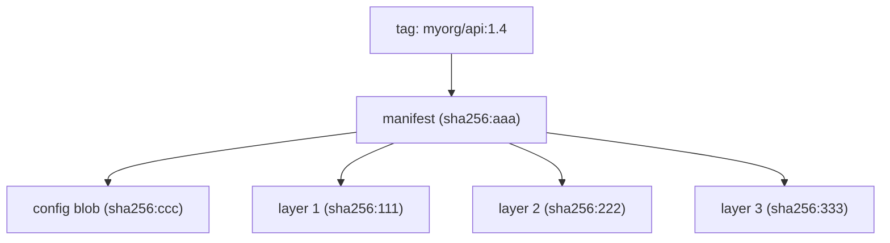
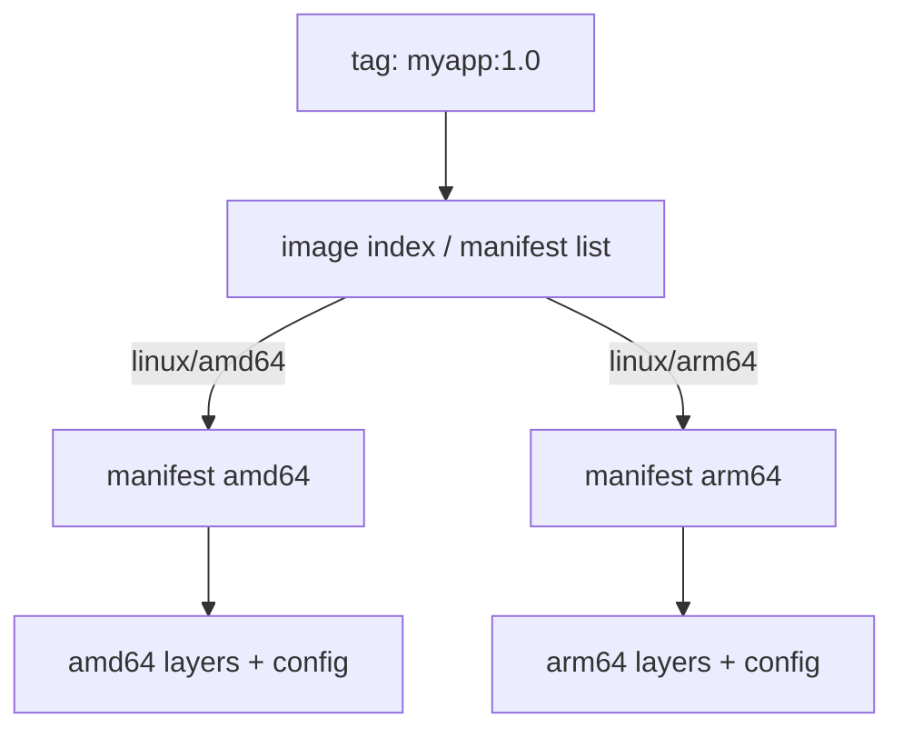

# Registries, Tagging & Distribution

The last topic left a checked-in Compose file pinning `image: myorg/api:1.4` and warned that the tag is not an identity: the same string can pull different bytes on two machines, so the file is reproducible in shape but not in content. Why a tag behaves that way, and the two ways to nail the bytes down, land under [Tags are mutable pointers](#tags-are-mutable-pointers) and [The immutable digest](#the-immutable-digest).

`docker push myorg/api:1.4` uploads 8 MB and prints `Layer already exists` five times, though the image is 900 MB. The same `docker pull nginx`, run on two machines months apart, can return different bytes. A CI job that passed yesterday fails today with `429 Too Many Requests`. One subject sits under all three: how a named image becomes exact bytes on a remote host, and back. The question this file answers is easy to state and easy to get wrong — given a string like `nginx` or `myorg/api:1.4`, what bytes do you actually get, and can you make that answer the same every time?

> [!KEY-TAKEAWAY]
> A tag (a human-friendly label like `1.4` or `latest`) is a mutable pointer; a digest
> (`sha256:…`) is an immutable, content-derived identity. Reproducible, auditable
> deployments pin by digest. `latest` is only the default tag name — it is not special and
> carries no "newest" guarantee.

> [!TIP]
> **Reading map.** About 24 minutes end to end, but built to be sampled. If tags-versus-digests
> is your whole question, [Tags are mutable pointers](#tags-are-mutable-pointers) and
> [The immutable digest](#the-immutable-digest) are the core and everything else is background.
> If you already pin by digest, skip ahead to [What travels: layers, blobs, and dedup](#what-travels-layers-blobs-and-dedup)
> for the wire protocol, rate limits, promotion, and cleanup.

---

## What a registry is

A registry stores and serves image bytes; it does not run them. When you type `docker pull nginx`, a server at `docker.io` hands your daemon a small file listing what the image contains, then the compressed pieces to fill it in — the whole job. The thing that stores and distributes Docker and OCI images over the network is a **registry** — a stateful server speaking one wire protocol. That protocol is the OCI Distribution Spec: a REST API over HTTPS, formerly the Docker Registry HTTP API v2. Over it, clients push and pull an image's pieces — its manifest and layers, both defined in their own sections below.

Three nested names locate any image, from the outside in. The registry is the host that answers the protocol: `docker.io`, `ghcr.io`, or `123456789.dkr.ecr.us-east-1.amazonaws.com`. A **repository** inside it is one named collection of related images, such as `library/nginx` or `myorg/api`, holding many versions at once. A tag or a digest then picks one specific image inside that repository — the two ways of naming, which the next sections take apart.

You meet the same handful of registries everywhere:

| Registry | Host | Notes |
|---|---|---|
| Docker Hub | `docker.io` (`registry-1.docker.io`) | Default; official images under `library/`; has pull rate limits |
| GitHub Container Registry | `ghcr.io` | Tied to GitHub orgs/repos; good for OSS + CI |
| Amazon ECR | `<acct>.dkr.ecr.<region>.amazonaws.com` | Private by default; IAM auth; lifecycle policies |
| Google Artifact Registry | `<region>-docker.pkg.dev` | GCP-native |
| Azure Container Registry | `<name>.azurecr.io` | Azure-native |
| Self-hosted | any host | CNCF Distribution (`registry:2`), Harbor, GitLab, JFrog Artifactory |

A registry is storage plus an API, nothing more. The client — the Docker Engine, containerd, Kubernetes, or Buildx — is what pushes, pulls, and runs a container; the registry never executes a byte of what it holds. That split is why one registry can serve a laptop, a CI fleet, and a Kubernetes cluster at once without knowing what any of them do with the image.

The name you hand a registry is deceptively loaded: most of it is filled in by defaults you never typed.

---

## Image reference anatomy

A reference has up to four parts, and Docker silently fills in the three you leave out. Written in full, the parts read left to right from the most global to the most specific:

```
[REGISTRY[:PORT]/] [NAMESPACE/] REPOSITORY [:TAG | @DIGEST]
```

```
ghcr.io/myorg/api:1.4.2
│       │     │   │
│       │     │   └── tag
│       │     └────── repository
│       └──────────── namespace (org/user)
└──────────────────── registry host
```

Leave parts out and Docker resolves them to a fully qualified reference before it makes a single request. The results surprise people, so they are worth reading as a table:

| You type | Docker resolves to |
|---|---|
| `nginx` | `docker.io/library/nginx:latest` |
| `myorg/api` | `docker.io/myorg/api:latest` |
| `redis:7` | `docker.io/library/redis:7` |
| `ghcr.io/o/a` | `ghcr.io/o/a:latest` |
| `localhost:5000/app` | `localhost:5000/app:latest` |

Three defaulting rules produce every row above, and each is a place people go wrong. The first fixes the registry. When you omit the host, the default is always Docker Hub (`docker.io`), never a local daemon cache — so a typo'd private image quietly becomes a request to the public internet. The second decides what counts as a host at all. Docker treats the first path segment as a registry only when it contains a `.` or a `:`, or is exactly `localhost`. That one test is why `myregistry.com/app` reads as a registry and `myorg/app` reads as a Hub namespace. The third fills in what is left. An image with no namespace gets the implicit `library/` namespace of Docker's official images, and one with neither a tag nor a digest gets `:latest` appended.

Those defaults are convenient and completely silent, which is why the same short name can mean different things to different people. A tag makes that ambiguity worse, because it can also change meaning over time.

---

## Tags are mutable pointers

Pushing the same tag again moves it to new bytes; the old image is not deleted, it just loses its name. A **tag** is a mutable, human-readable label that points at exactly one image in a repository — specifically at that image's digest, the hash of its exact bytes. Nothing binds the label to those bytes permanently, so the same tag can point somewhere else tomorrow:

```bash
docker build -t myorg/api:1.4 .
docker push myorg/api:1.4      # tag 1.4 -> digest A
# ... later, rebuild ...
docker push myorg/api:1.4      # tag 1.4 -> digest B (pointer moved!)
```

This re-push is exactly the loop the previous topic left open. A checked-in `image: myorg/api:1.4` is reproducible in shape but not in content, because the pointer it names can be moved out from under it. Three consequences follow, and they are the reason a tag is not an identity:

- Two machines that pull `myorg/api:1.4` at different times can get different bytes, with nothing in the reference to warn them.
- `docker pull` on a tag you already have locally may silently fetch new content, because the pointer moved since you last resolved it.
- Because a tag is only a pointer, one image can carry many of them — `1`, `1.4`, `1.4.2`, `stable` — all resolving to the same digest. `docker tag` adds another pointer and copies no data.

> [!WARNING]
> Never treat a tag as an immutable version in production. "It worked in staging with
> `:v2`" means nothing if someone re-pushed `:v2` since. The two durable fixes are to pin by
> digest (the next section) or to make the tag itself unmovable — ECR, Harbor, and GHCR all
> offer immutable tags, which reject a second push to a name that already exists.

The warning names a second way to address an image, one the registry will never let move: the digest.

---

## The immutable digest

A digest names bytes, not a name, so `repo@sha256:…` can never point at different content. The digest model itself is owned by `docker/images-vs-containers`: a `sha256:` hash over exact bytes, where identical bytes always produce the identical value and different bytes never collide. Here that model does one job. Because the value is derived from content, the same digest refers to exactly the same bytes on any registry, forever. Change one byte of any layer or of the config, and the digest changes with it:

```bash
# Pin by digest — fully reproducible
docker pull myorg/api@sha256:e3b0c44298fc1c149afbf4c8996fb92427ae41e4649b934ca495991b7852b855

# See a local image's repo digest (the pushed manifest digest)
docker inspect --format '{{index .RepoDigests 0}}' myorg/api:1.4
# myorg/api@sha256:e3b0c4...
```

The digest that identifies "the image" is the hash of its manifest — the small JSON file that lists the image's config and layers, defined under [Image manifest and config](#image-manifest-and-config). Individual layers have their own digests too, but the image digest is the manifest digest. That single value is what defeats the mutable-tag problem: `image@sha256:…` resolves to one set of bytes and no push can move it, which is exactly what reproducible builds and Kubernetes admission policies require. So to guarantee production runs the image you actually tested, capture the digest at build and test time and deploy `repo@sha256:…`, and have an admission controller reject any tag-only reference at the door.

You can also combine the two forms for readability. Writing `nginx:1.27@sha256:…` keeps the human-readable tag while pinning the bytes; Docker checks that the tag really does resolve to that digest and errors if it does not. One caveat sets up a later section: the digest reported by `docker images --digests` or in `RepoDigests` is the registry's manifest digest, which is not the same value as the local image ID. Where that gap comes from is the subject of [Image manifest and config](#image-manifest-and-config).

Between a movable tag and an immovable digest sits one tag name that fools people precisely because it looks like it means the newest build: `latest`.

---

## The 'latest' tag foot-gun

`latest` is not special to Docker; it is only the name applied when you push or pull without one. It does not mean "most recent," and nothing updates it for you — it points wherever it was last pushed, which may be an old build or nothing at all. The trouble is that it reads like a promise of freshness, so people rely on a guarantee it never made.

The same misreading bites in a few predictable places:

- `docker build -t myorg/api .` tags the result `:latest`. If you later `docker build -t myorg/api:1.5 .` and push that, `:latest` still points at the older build until you explicitly re-tag and push it.
- `docker run myorg/api` pulls `:latest`, which may be months stale or absent entirely on that registry.
- `FROM node:latest` in a Dockerfile makes the build non-reproducible: the base image drifts under you between builds, silently changing your runtime and occasionally breaking the build outright.

The fix is to stop leaning on the default. In production Dockerfiles and manifests, use explicit version tags such as `node:20.11-slim`. For full reproducibility, pin the base by digest too — `FROM node:20.11-slim@sha256:…` — so neither the tag nor the bytes behind it can move.

All of this assumed the pull just works. The moment a repository is private, or you want to push at all, the registry first asks who you are.

---

## Authentication: login, tokens, credential helpers

Public images pull anonymously, but pushing anything, or pulling a private repository, means proving who you are first. The entry point is `docker login`, which differs a little per registry:

```bash
docker login                       # Docker Hub, prompts user/password or PAT
docker login ghcr.io -u USER --password-stdin < token.txt
docker login 123.dkr.ecr.us-east-1.amazonaws.com   # via helper/token
docker logout ghcr.io
```

Under that one command is a three-step handshake, the same on every OCI registry. First, the client asks for a resource and the registry answers `401` with a `WWW-Authenticate` header naming a separate token service and the scope it needs. Second, the client authenticates to that token service, using basic auth or a personal access token, and receives a short-lived **bearer token** — a credential scoped to one action on one repository, such as `repository:myorg/api:pull,push`. Third, the client retries the original request carrying `Authorization: Bearer <token>`. The pull or push only happens on that retry.

### Where it breaks: the credential sits on disk in the clear

That handshake is sound on the wire, but the credential it starts from has to live somewhere, and the default location is not safe. `docker login` writes what you typed to `~/.docker/config.json`, where by default it is only base64-encoded, not encrypted. Anyone who can read the file can decode it straight back to the original secret, which is why security scanners flag it. The fix is a **credential helper**. Setting `credsStore` makes Docker keep the secret in the OS keychain (`docker-credential-osxkeychain`, `secretservice`, `wincred`) instead of writing it down. For a cloud registry it can instead fetch a fresh secret from a helper such as `docker-credential-ecr-login` or `docker-credential-gcr`.

Which credential each registry expects is its own small trap:

| Registry | Typical credential |
|---|---|
| Docker Hub | Personal Access Token (PAT), not account password |
| GHCR | GitHub PAT or `GITHUB_TOKEN` in Actions |
| ECR | `aws ecr get-login-password` (12h token) or ECR credential helper via IAM |

The pattern across all three is that the credential should be short-lived and machine-scoped: a CI job should mint an OIDC or per-run token, never carry a long-lived password. The reason that matters so much is where such secrets tend to end up.

> [!WARNING]
> Never put registry credentials, cloud keys, or tokens into a Dockerfile or image layer.
> They persist in the layer history even after a later `rm`, so anyone who can pull the
> image can recover them from an earlier layer. See `docker/docker-security`.

Once the registry knows who you are, the question becomes what actually crosses the wire — and it is usually far less than the image's full size.

---

## What travels: layers, blobs, and dedup

Push and pull move blobs, not whole images, and the registry refuses to re-accept a blob it already holds. An image is a **manifest** — a small JSON file — that references one config blob and an ordered set of layer blobs, every one of them addressed by its digest (`sha256:…`).

A **blob** is just one of those content-addressed objects: a layer's compressed tarball, or the config. Because the address is the content's hash, the registry can tell in advance whether it already has a given piece.



That advance check is what makes a push cheap. Before sending the manifest, the client issues a `HEAD /blobs/<digest>` for each layer. If the registry already has that digest — from another tag, or another image built on the same base — the layer is skipped and never uploaded. The manifest itself is sent last, only after every blob it names is known to be present. Rebuilding an app on an unchanged base therefore uploads only the small top layers and prints `Layer already exists` for the rest.

Pull is the mirror image. The client fetches the manifest, then downloads only the layer digests it does not already have locally, in parallel; a base layer shared by twenty images is stored once and fetched once. The same content-addressing enables cross-repository blob mount: with `?mount=<digest>&from=<repo>` a registry copies a blob it already holds into a new repository, with no re-upload. Moving an image between repositories on the same registry therefore costs almost nothing in bandwidth.

That manifest the client sends last is worth opening up, because its contents explain a discrepancy you have already met: the local image ID that does not match the registry's digest.

---

## Image manifest and config

The manifest lists the config and layers by digest and size; the config blob holds the runtime metadata and is what the local image ID hashes. Its media type is either OCI's `application/vnd.oci.image.manifest.v1+json` or Docker's `application/vnd.docker.distribution.manifest.v2+json`, and its body has two parts: a `config` descriptor pointing at one config blob, and an ordered `layers` array of descriptors, base layer first.

The **config** blob (`.../image.config.v1+json`) is where the runtime metadata lives — `Env`, `Cmd`, `Entrypoint`, `WorkingDir`, `User`, `ExposedPorts`, `architecture`, `os` — plus `rootfs.diff_ids`, the uncompressed layer hashes, and the build `history`.

```jsonc
// manifest (illustrative)
{
  "schemaVersion": 2,
  "mediaType": "application/vnd.oci.image.manifest.v1+json",
  "config": { "mediaType": "application/vnd.oci.image.config.v1+json",
              "digest": "sha256:ccc...", "size": 7023 },
  "layers": [
    { "mediaType": "application/vnd.oci.image.layer.v1.tar+gzip",
      "digest": "sha256:111...", "size": 2814000 }
  ]
}
```

You can read all of this without pulling the image:

```bash
docker buildx imagetools inspect nginx:1.27 --raw   # raw manifest JSON
docker manifest inspect nginx:1.27                  # requires experimental on older CLIs
```

This two-blob structure is the source of the discrepancy flagged earlier. The image ID shown in `docker images` is the digest of the config blob; the `RepoDigest` the registry reports is the digest of the manifest. They hash different files, so they are different values for the same image — the local ID names the config, the registry digest names the whole manifest. (That holds for a single-architecture image; when one tag covers several architectures, the registry reports the digest of the index that wraps them, which the next section opens up.)

So far one manifest has meant one image, built for one CPU. A single tag can also stand for several images, one per architecture.

---

## Multi-arch images and manifest lists

One tag can serve several CPU architectures through an index that maps each platform to its own per-arch manifest. This wrapper is called a manifest list (Docker) or an image index (OCI) — one object, two names; this file uses image index from here. Docker's media type for it is `application/vnd.docker.distribution.manifest.list.v2+json`; OCI's is `application/vnd.oci.image.index.v1+json`.

An image index is a manifest of manifests. It carries no layers of its own; it maps each `platform` — an `os` plus an `architecture`, such as `linux/amd64` or `linux/arm64` — to the digest of a per-platform image manifest.



When you run `docker pull myapp:1.0`, the daemon reads the index and pulls only the manifest whose platform matches the host, ignoring the rest. The same tag therefore yields the correct binary on an Apple Silicon laptop and on an x86 server, with no branching in your commands. You build such an index with Buildx, which runs each architecture on a native node or under QEMU emulation:

```bash
docker buildx create --use
docker buildx build --platform linux/amd64,linux/arm64 \
  -t myorg/api:1.4 --push .
```

### Where it breaks: a single-arch build on the wrong host

The convenience above hides a sharp edge, and it catches people who skip Buildx. Legacy `docker build` produces a single-arch image for the builder's own platform and nothing else — no index, one manifest. Build on an M-series Mac and push without Buildx, and you ship an arm64-only image. When an amd64 host pulls it, the kernel refuses to run a binary built for another architecture, and the container dies immediately with `exec format error`. The whole point of `buildx --platform` is to avoid exactly this by producing an index that covers every target.

When per-arch images already exist separately, you do not have to rebuild to get an index — you can assemble one from them:

```bash
docker buildx imagetools create -t myorg/api:1.4 \
  myorg/api:1.4-amd64 myorg/api:1.4-arm64
```

Every operation so far — resolving a tag, pulling one arch out of an index, checking a blob — is a call in one defined HTTP API.

---

## The OCI distribution spec (registry API)

Push and pull are not magic; they are a fixed set of HTTP calls under `/v2/`, defined by the OCI Distribution Spec v1.1 (formerly the Docker Registry HTTP API V2). Every registry that Docker can talk to answers the same routes:

| Purpose | Request |
|---|---|
| API version check | `GET /v2/` |
| Pull manifest | `GET /v2/<name>/manifests/<tag or digest>` |
| Check blob exists | `HEAD /v2/<name>/blobs/<digest>` |
| Pull blob (layer/config) | `GET /v2/<name>/blobs/<digest>` |
| Upload blob (chunked) | `POST` then `PATCH`/`PUT /v2/<name>/blobs/uploads/` |
| Push manifest | `PUT /v2/<name>/manifests/<tag>` |
| List tags | `GET /v2/<name>/tags/list` |
| Delete | `DELETE /v2/<name>/manifests/<digest>` |

Three details in this API decide behaviour you rely on elsewhere. The manifest GET carries an `Accept` header, and that header negotiates what comes back: a single manifest, or an image index. An old client that does not list index media types is handed a legacy single manifest instead. Integrity is then checked on the client. After downloading a blob, the Docker and containerd clients hash it and require the SHA-256 to equal the digest they asked for — end-to-end integrity even when the bytes arrived through an untrusted CDN. The distribution spec makes this verification a recommendation rather than a hard requirement, but these clients enforce it. And OCI 1.1 added the **referrers API** (`GET /v2/<name>/referrers/<digest>`), which lets signatures, SBOMs, and attestations attach to an image by its digest rather than live inside it.

One of these calls — the manifest GET against Docker Hub — is also the one that gets counted, and counting is where pulls begin to fail.

---

## Pull rate limits

Docker Hub counts a pull per image manifest actually downloaded, so a multi-arch image costs one pull per architecture you pull. A normal single-host `docker pull` fetches just one architecture and so counts as one; a version or manifest check that downloads nothing does not count at all. The counting exists because Hub throttles pulls to fund free hosting.

As of mid-2026 the limits below are measured over a 6-hour window. Docker has revised them repeatedly, so read the exact numbers as a snapshot rather than a constant — but the numbers themselves belong here, not behind a link:

| Account | Limit (per 6h) |
|---|---|
| Anonymous (unauthenticated) | 100 pulls per IPv4 address or IPv6 /64 subnet |
| Authenticated free (Personal) | 200 pulls |
| Pro / Team / Business | Unlimited |

The anonymous limit is counted per source IP, and that is what turns it into a production incident. Many machines behind one corporate NAT or one CI egress IP share a single 100-pull budget, so the pool drains fast and the next pull comes back `429 Too Many Requests: toomanyrequests`. The classic case is CI that passed yesterday and today cannot pull its base images, because every runner is billed to the same shared address.

Three fixes address it at different layers. `docker login` with a paid account raises or removes the limit for that identity. A **pull-through cache** — `registry:2` run in proxy mode — fetches each base image from Hub once and serves every later request locally, so the fleet spends one pull instead of hundreds. Or you make a registry without these limits (ECR, GHCR, Artifactory) the source of truth and pull from there.

The mirror that dodges the limit is one case of a larger move: copying an exact image from one registry to another without rebuilding it.

---

## Image promotion across registries

**Promotion** is moving a tested image through environments — dev to staging to prod — or across registries without rebuilding it. It copies the image's exact bytes, so the digest that ships is the digest you tested. The alternative, rebuilding the image separately for each environment, produces different bytes and therefore a different set of CVEs at every hop, which is why "it passed in staging" then guarantees nothing about prod. Promotion removes the rebuild entirely: build once, then copy by digest.

```bash
# Capture the digest at build/test time
DIGEST=$(docker buildx imagetools inspect myorg/api:ci-123 --format '{{.Manifest.Digest}}')

# Promote: copy that exact content to the prod registry (preserves digest, all platforms)
docker buildx imagetools create \
  --tag prod-registry.example.com/api:1.4 \
  myorg/api@${DIGEST}

# Or with a dedicated copier (skopeo) — no local daemon, copies index + all arches
skopeo copy --all docker://staging.example.com/api@${DIGEST} \
  docker://prod.example.com/api:1.4
```

Because the copy is addressed by digest, the digest survives the move and the image index stays intact, so every architecture arrives together. Retagging inside one registry is even cheaper: it moves a pointer and uploads no blobs, since the content is already present.

Promotion and immutable-tag workflows do the same thing to a registry over time — they leave old, unreferenced bytes behind, and those never clean themselves up.

---

## Garbage collection and cleanup

Deleting a tag frees no storage; it only removes a pointer, and the blobs stay until they are both unreferenced and a garbage-collection pass runs. That two-part condition is the whole trap: people delete a tag, watch disk usage stay flat, and conclude cleanup is broken.

On a self-hosted CNCF Distribution registry, reclaiming space is two explicit steps — delete the manifests you no longer want by digest through the API, then run the collector:

```bash
# 1) delete manifests by digest via the API (DELETE .../manifests/<digest>)
# 2) run mark-and-sweep GC (registry must be read-only / stopped)
registry garbage-collect /etc/docker/registry/config.yml
```

The collector runs **mark-and-sweep**: it marks every blob still referenced by a live manifest, then sweeps away the blobs nothing points to. Deletion has to be turned on first (`REGISTRY_STORAGE_DELETE_ENABLED=true`), and the registry must be read-only or stopped while it runs, so it does not sweep a blob a concurrent push is still wiring up. Cloud registries automate the same idea with lifecycle policies — ECR can "expire untagged images older than 14 days" or "keep only the last 20 tagged images" — which matters because immutable-tag plus frequent-build workflows pile up storage quickly. On your own machine the equivalent is client-side and unrelated to the registry:

```bash
docker image prune            # remove dangling (untagged) images
docker image prune -a         # remove all images not used by a container
docker system prune -a --volumes   # aggressive: images, containers, networks, build cache
docker buildx prune           # BuildKit build cache
```

### Where it breaks: deleting a blob two images share

Mark-and-sweep is safe only because it counts references, and that is exactly where hand-deletion goes wrong. A single blob can be referenced by several manifests — a shared base layer, or a per-arch manifest inside an image index. Removing one manifest must therefore not remove a blob another still needs. Delete the wrong thing directly and then GC, and you can strip a layer out from under a healthy image, which then fails to pull with a missing-blob error.

> [!WARNING]
> Deleting a manifest referenced by an image index, or a blob shared by another image, and
> then running GC can corrupt those other images if reference counting is off. Delete by
> digest and let the registry's own GC decide which shared blobs are safe to sweep — never
> remove blob files by hand.

That closes the loop this topic opened. You can now name an image, address it so the bytes never move, and see exactly what crosses the wire. You can copy it between registries unchanged, and reclaim the space the old bytes leave behind. Those moves are the whole path an image takes between machines.

---

## Common follow-up questions

- **Tag vs digest — when do you use each?** Tags for humans and rolling channels
  (`:1`, `:stable`); digests for anything that must be reproducible or auditable —
  production deploys, base-image pinning, admission control.
- **Why did my `arm64`-built image fail on the server?** Legacy `docker build` produced a
  single-arch image for the build host. Use `docker buildx --platform` to build a
  multi-arch index that also covers the server's architecture.
- **Why is CI hitting `toomanyrequests`?** Docker Hub's anonymous pull limit, counted
  against the shared CI egress IP. Authenticate the runners, or mirror the base images.
- **Does `docker tag` copy data?** No — it adds another pointer to the same image; no
  layers are duplicated.
- **Why does deleting tags not free disk space on my registry?** Untagging leaves the
  blobs behind. You must delete by digest and run mark-and-sweep garbage collection.
- **How do I run my own registry?** `docker run -d -p 5000:5000 registry:2`, or Harbor for
  RBAC, scanning, and replication; configure a pull-through cache to dodge Hub limits.
- **What's the difference between image ID and digest?** Image ID = the config-blob hash
  (local); RepoDigest = the manifest hash (as stored on the registry).

## References

- OCI Image Spec — manifest, image index, config, descriptors: <https://github.com/opencontainers/image-spec>
- OCI Distribution Spec v1.1: <https://github.com/opencontainers/distribution-spec/blob/main/spec.md>
- Docker Hub usage & rate limits: <https://docs.docker.com/docker-hub/usage/>
- Docker Hub — how pulls are counted (one per architecture): <https://docs.docker.com/docker-hub/usage/pulls/>
- Docker registry / distribution (CNCF Distribution): <https://distribution.github.io/distribution/>
- `docker buildx imagetools`: <https://docs.docker.com/reference/cli/docker/buildx/imagetools/>
- Multi-platform builds: <https://docs.docker.com/build/building/multi-platform/>
- Amazon ECR lifecycle policies: <https://docs.aws.amazon.com/AmazonECR/latest/userguide/LifecyclePolicies.html>
- skopeo (copy/inspect across registries): <https://github.com/containers/skopeo>
