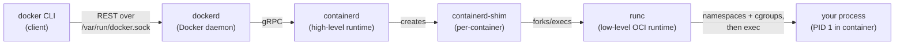
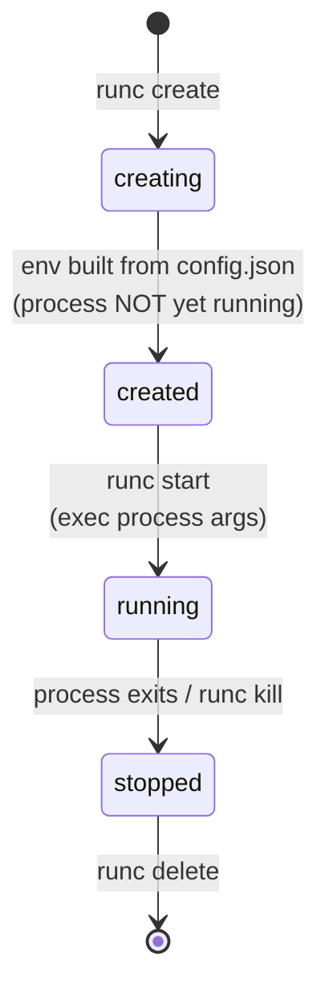
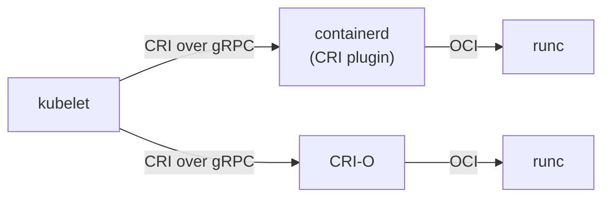

# Container Runtimes, Isolation Internals & OCI Standards

Topic 15 left the root filesystem fully assembled: overlay2 had stacked the read-only lower layers and the writable upper layer into one merged directory. Nothing there, though, turned that mounted directory into a running, isolated container. That directory plus one `config.json` file is an OCI bundle, and the program that reads the config and makes the kernel calls is a low-level runtime; [runc and the OCI runtime flow](#runc-and-the-oci-runtime-flow) is where that step happens.

Type `docker run nginx` and a single command fans out across five separate programs before the web server ever starts: the `docker` CLI, the `dockerd` daemon, `containerd`, a per-container shim, and finally `runc`, which is the one that actually asks the kernel to build the container. Kill `dockerd` afterwards and the container keeps serving traffic — proof that "Docker" is not one thing running your process but a chain, each link doing one job. What does each program actually do, which standards let you swap any link, and what kernel machinery turns a plain process into an isolated container?

> [!TIP]
> **Reading map.** About 29 minutes. The spine is the walk down the stack, from [the runtime stack](#the-docker-runtime-stack-cli-dockerd-containerd-runc) through [runc](#runc-and-the-oci-runtime-flow), and then the three isolation primitives: [namespaces](#linux-namespaces-what-a-container-sees), [cgroups](#cgroups-what-a-container-can-use), and [capabilities](#capabilities-slicing-up-root). If you already know the CLI/daemon/containerd/runc split, start at [the OCI specifications](#the-oci-specifications-image-runtime-distribution). The last two sections, on stronger-isolation runtimes and rootless mode, stand alone and are safe to skip on a first read.

> [!KEY-TAKEAWAY]
> Four ideas carry this whole topic. First, there is no single "Docker runtime": the CLI is a thin client to the `dockerd` daemon, which hands image and lifecycle work to containerd, which forks runc to actually make the container. Second, runc creates that container by asking the kernel for namespaces and cgroups and then running your program — a container is an ordinary Linux process wearing isolation, which is exactly the claim topic 1 opened with. Third, the OCI standards make images and runtimes interchangeable, which is why a `docker build` image runs unchanged under Kubernetes. Fourth, namespaces control what a container sees, cgroups control what it can use, and capabilities control what it may do — three separate knobs.

---

## The Docker runtime stack: CLI, dockerd, containerd, runc

No single program called "the Docker runtime" runs your container; a chain of five programs does, each at a different level of abstraction. When you type `docker run nginx`, the request travels the whole chain before your process starts.



Read the chain as a hand-off, top to bottom. The `docker` CLI does no container work at all: it packs your command into a REST call and sends it over a Unix socket (`/var/run/docker.sock`), or over TCP, to the daemon. The **`dockerd`** daemon is the long-running server that answers the Docker API and owns the Docker-level concerns — bridge and overlay networking, volumes, build orchestration, and Swarm — but for the actual image and container lifecycle it delegates one level down.

That level is **containerd**, the high-level runtime: it pulls and unpacks images, tracks the snapshots that make up the layered filesystem, hands the assembled configuration to the low-level runtime, and supervises the resulting processes. It is a CNCF graduated project, and Kubernetes drives it directly with no Docker in the picture. For each container it starts, containerd spawns a tiny babysitter process and then steps back.

That babysitter is **`containerd-shim`** (the current binary is `containerd-shim-runc-v2`), and it owns exactly one container.

The last link, **`runc`**, does the kernel work: it reads a directory and a JSON file, makes the calls that create namespaces, apply cgroups, drop capabilities, and set up mounts, then `exec`s your program as PID 1 inside the container. runc then exits; it is not a daemon, but sets things up and leaves.

Why split one job across five programs? Each boundary buys something specific. The CLI-to-daemon boundary lets a remote client drive a daemon over the network. The daemon-to-containerd boundary lets an orchestrator like Kubernetes talk to containerd and skip Docker entirely. The containerd-to-runc boundary is the one the standards make possible: because runc speaks a standard runtime interface, you can drop in gVisor's `runsc`, Kata's `kata-runtime`, or the faster C rewrite `crun` in its place without touching containerd or Docker.

### Where it breaks: restarting the daemon under a live container

`systemctl restart docker` need not kill your running containers, and the reason is the shim. Once runc has built the container and exited, the container process still needs a parent to hold its standard streams and pseudo-terminal open, and to catch its exit code when it finally dies. That parent is the shim, deliberately not `dockerd` and not containerd.

Because the shim is a separate process per container, containerd and dockerd can stop and restart above it while the container runs on undisturbed. Docker exposes this as its live-restore option, which is why an engine upgrade need not be an outage. If the shim itself died, the container would lose that parent: its streams would close and its exit status would have nowhere to be recorded.

containerd is the link that does the most work, so it takes the next section on its own.

---

## containerd: the high-level runtime

containerd turns "an API request arrived" into "a container is running," and it does so for a whole host, not one container. It pulls an image over the registry API and verifies its digests, unpacks the layers into a snapshot through a snapshotter (overlayfs by default), builds the runtime configuration, and drives runc through the shim to create, start, stop, delete, and exec containers. A running container process is what containerd calls a *task*.

One containerd concept collides in name with a kernel one and is worth separating now. containerd keeps its own metadata *namespaces* — logical partitions of its bookkeeping, so that Docker's containers and Kubernetes' containers can live in the same containerd without seeing each other. Docker files everything under the `moby` namespace; a Kubernetes kubelet uses `k8s.io`. These are not the Linux namespaces from the isolation sections below; the word is reused for an unrelated idea.

That partitioning has a practical bite. Run `docker images` and then `crictl images` on the same node and each shows none of what the other pulled, because each reads only its own metadata namespace. The images are all there; they are filed under different partitions. To list what Kubernetes pulled, name the partition explicitly: `ctr -n k8s.io images ls`. You can drive containerd directly with `ctr` (a low-level debug tool) or `nerdctl` (a Docker-compatible CLI), and because Kubernetes reaches it through a separate interface, the same containerd can serve both a Docker daemon and a kubelet on one machine.

The configuration containerd hands down is an OCI bundle, and turning that bundle into kernel calls is runc's job, which the next section traces.

---

## runc and the OCI runtime flow

runc takes a directory and a JSON file and returns a running, isolated process, then gets out of the way. It is the reference implementation of the OCI runtime specification — a small CLI that Docker extracted from its original `libcontainer` code. Its whole input is an **OCI bundle**: a root filesystem plus a `config.json` that says how to run it.

```
bundle/
├── config.json     # the OCI runtime spec: process, env, mounts,
│                   # linux.namespaces, linux.resources (cgroups),
│                   # process.capabilities, root path, hooks…
└── rootfs/         # the container's root filesystem (unpacked image layers)
```

`config.json` is the contract, and it is exhaustive: it names which namespaces to create, the cgroup limits, the capability set to keep, the mounts, the user and uid, and the exact process arguments. runc reads that file and makes the matching kernel calls. The lifecycle it walks through is fixed by the runtime spec and has four states:



### Where it breaks: create and start are two separate commands

The state machine hides a detail that trips people up: `runc create` and `runc start` are different commands, and the container spends real time stopped between them. `runc create` builds the entire environment — the namespaces, the cgroups, the mounts — but does not run your program; the process sits in the `created` state, waiting. `runc start` is the command that finally `exec`s the process arguments (`process.args`) from `config.json`. That gap is deliberate: it gives an orchestrator a window to wire up networking and attach cgroups while the container exists but nothing is executing yet.

Because the environment is built at create time, `config.json` is frozen the moment `runc create` returns. Editing it afterwards changes nothing, which is the concrete reason you cannot alter a running container's namespaces or resource limits without recreating it.

runc is not a daemon: it does its setup and exits, and the container process is reparented to the shim from the previous section. One wrinkle explains a helper you will see in its process tree. Creating or joining some namespaces, a user namespace above all, is only permitted while the process is single-threaded, yet Go spins up several OS threads the instant its runtime initializes. runc sidesteps that by doing the namespace calls in a tiny C helper, `nsexec`, that runs before the Go runtime comes up, then hands control back to the Go code. If you would rather avoid the Go runtime entirely, `crun` is a faster C rewrite from Red Hat that implements the same spec and drops in unchanged.

runc implements just one of three OCI specifications; the next section lays out all three and what each one freezes.

---

## The OCI specifications: image, runtime, distribution

Three written specifications freeze what a container image is, how to run it, and how to ship it, and one body owns all three. That body is the **Open Container Initiative**, formed under the Linux Foundation in 2015 and seeded by Docker. Together the specs cover an image's whole life — build, then store and ship, then run:

| Spec | Governs | Key artifacts |
|---|---|---|
| image-spec | The on-disk/over-the-wire image format | Manifest, config (JSON with layer history, env, entrypoint), layers as tar+gzip, content-addressable digests (`sha256:…`) |
| runtime-spec | How to run a container from a filesystem bundle | `config.json`, the bundle layout, lifecycle ops (create/start/kill/delete), states (creating/created/running/stopped) |
| distribution-spec | The registry HTTP API to push/pull | `/v2/` endpoints, manifests, blobs, content-addressable pulls, `_catalog`/tags |

The shortest way to hold the three apart is as three questions: image-spec answers "what is an image?", distribution-spec answers "how do I ship it?", and runtime-spec answers "how do I run it?" A tool that implements one of them interoperates with every tool that implements the others.

Under image-spec, an image is content-addressed. A manifest lists one config blob and an ordered set of layer blobs. Each of those is named by its SHA-256 digest rather than by a path — the same digest identifier established back in the image internals topic. One tag can point at many manifests through an image index, also called a manifest list, which maps that tag to one manifest per architecture. That is how `nginx:latest` serves a `linux/amd64` machine and a `linux/arm64` machine from one name, without either knowing the other exists. Docker's older "Docker Image Manifest V2 Schema 2" format is near-identical to the OCI image manifest, so registries and tools accept both interchangeably.

Freezing the format in open specs only matters if it buys something concrete; the next section is what that interoperability actually delivers.

---

## Why standards matter: interoperability

Before these specs existed, "a Docker image" and "the Docker runtime" meant whatever Docker Inc. happened to ship — a single-vendor de-facto standard that everyone else had to chase. The OCI specs turned that into open, versioned documents any vendor can build against, and the payoff shows up in three places: images, runtimes, and registries all stop being tied to one tool.

Images stop being tied to their builder. Whether you build with `docker build`, BuildKit, Buildah, Kaniko, or `ko`, the output is the same OCI artifact — it runs on containerd, CRI-O, Podman, or any OCI runtime. It is stored, too, in any OCI registry, from Docker Hub to ECR, GCR, Harbor, or GitHub Packages. Runtimes stop being tied to Docker: because runc, crun, gVisor's `runsc`, and Kata's runtime all implement the runtime spec, swapping one for another is a single config line, which is how you trade raw speed for stronger isolation. Registries stop being tied to a client: the distribution spec lets any client push and pull against any compliant registry, and even non-image artifacts — Helm charts, software bills of materials, signatures via the OCI referrers API — ride the same endpoints.

This is the concrete reason Kubernetes removing Docker did not break anyone's images. An image is an OCI standard artifact, defined independently of the Docker daemon. So a cluster that never runs `dockerd` still runs images that `docker build` produced.

Kubernetes is the clearest proof here, and it reaches runtimes through an interface of its own; the next section is that interface, the CRI.

---

## CRI: the Container Runtime Interface (and dockershim removal)

Kubernetes never calls runc or containerd with runtime-specific code; the kubelet on each node speaks one gRPC API, and any runtime that implements it can plug in. That API is the **Container Runtime Interface (CRI)**, and it exists to decouple the orchestrator from any single runtime. It defines two services: a RuntimeService for pods, containers, and exec, and an ImageService for pulling, listing, and removing images.



containerd implements CRI through a built-in plugin, and CRI-O is a runtime built for nothing but serving Kubernetes over CRI. Either way, the bottom of the stack is the same: both hand the actual container off to an OCI low-level runtime, normally runc. The kubelet does not know or care which one it is talking to.

### Where it breaks: why Docker needed a shim and containerd does not

Docker Engine never implemented CRI, and that single fact is the whole dockershim story. When Kubernetes was young it bridged to Docker with in-tree glue code called dockershim, translating CRI calls into Docker API calls. That adapter lived inside the Kubernetes codebase, so the Kubernetes team was maintaining a shim for one specific vendor's daemon. It also held back features that needed direct runtime control, such as cgroups v2 and user namespaces. So dockershim was deprecated in Kubernetes v1.20 and removed in v1.24, in 2022.

Removing it changed the runtime path, not your images. Docker-built images are OCI images, so they keep running; clusters simply talk to containerd (which Docker already used underneath) or to CRI-O, and skip the daemon. The only thing that disappeared was the Docker-daemon bridge. If a cluster genuinely must keep Docker Engine as its runtime, `cri-dockerd` from Mirantis is an external CRI adapter that puts the shim back, now outside the Kubernetes tree.

> [!INTERVIEW]
> "Did Kubernetes drop Docker?" What was removed is dockershim, the adapter for the Docker *daemon*, not Docker images. containerd — which Docker already runs under the hood — is itself a CRI runtime, so nodes talk to containerd directly, and images built with Docker are OCI images that run everywhere. Pod and orchestration details belong to the Kubernetes domain.

Everything up to here assumed the kernel isolation already exists; the next three sections open it up, starting with what a container can see.

---

## Linux namespaces: what a container sees

Run `hostname` inside a fresh container and it prints a random string, not the host's name; that is a namespace at work. Namespaces are the kernel primitive behind the "a container is just a process" claim topic 1 opened with: each namespace type hands the container its own private copy of one otherwise-global resource, and together they are the "what a container sees" half of isolation.

| Namespace | Isolates | Effect inside the container |
|---|---|---|
| PID | Process IDs | Its first process is PID 1, and it cannot see host processes |
| NET | Network stack | Own interfaces, IPs, routing table, ports (`eth0`, loopback) |
| MNT | Mount points | Own filesystem tree / mounts (the rootfs) |
| UTS | Hostname & domain | Own hostname (why `docker run` containers have random hostnames) |
| IPC | System V IPC, POSIX message queues | Own shared-memory / semaphores |
| USER | UID/GID mappings | Map container root (uid 0) to an unprivileged host uid — basis of rootless & user-ns remapping |
| cgroup | cgroup root view | Hides the host's cgroup hierarchy |
| time | Boot/monotonic clock offsets | (Newer; rarely used by Docker) |

runc does not invent any of this; it asks the kernel for the namespaces named under `linux.namespaces` in `config.json`, and the kernel creates them with the `clone(2)`, `unshare(2)`, and `setns(2)` syscalls. From the host you can see them with `lsns` or under `/proc/<pid>/ns/`. Three of the rows carry most of the weight. The PID namespace is why the container's first process is PID 1. That is also why the process inherits init's duty of reaping orphaned children — the signal-handling wrinkle the `container-lifecycle` topic covers, and the reason Docker's `--init` flag exists. The NET namespace is why each container gets its own IP; Docker wires a `veth pair` into the `docker0` bridge to connect it, mechanics that live in `docker-networking`. The USER namespace is the linchpin of rootless mode: a process can be uid 0 inside the container yet map to an unprivileged uid on the host, so an escape grants no host root.

### Where it breaks: sharing a namespace turns isolation off

A namespace is not all-or-nothing, and you can hand a container the host's copy instead of a private one. `docker run --pid=host` drops the PID namespace, so the container sees every process on the machine; `--net=host` and `--ipc=host` do the same for networking and IPC. That is useful for debugging and dangerous for security in the same breath. You can also share another container's namespace rather than the host's: `--pid container:<id>` puts two containers in one PID namespace, and this is exactly how the containers in a Kubernetes pod come to share a network and IPC namespace.

> [!WARNING]
> `--pid=host`, `--net=host`, `--ipc=host`, and especially `--privileged` each strip an isolation layer away. `--privileged` is the extreme: it grants every capability, opens host device access, and turns off the seccomp and AppArmor filters, so treat a `--privileged` container as root on the host. The seccomp and AppArmor profiles that make this safe are hardening covered in `docker-security`.

Seeing a private world says nothing about how much of the machine a container may consume; limiting that is the next section, on cgroups.

---

## cgroups: what a container can use

Where namespaces hide the machine, control groups (cgroups) — the accounting side of the kernel machinery introduced in topic 1 — cap how much of it a container may use: CPU time, memory, block I/O, process count, devices. They are what makes `docker run --memory=512m --cpus=1.5` mean something, and they are how the kernel decides a container has taken too much memory and kills it.

| Docker flag | cgroup controller | Effect |
|---|---|---|
| `--memory=512m` | memory | Hard limit; exceeding → OOM kill (exit 137, `OOMKilled=true`) |
| `--memory-reservation` | memory | Soft limit under contention |
| `--cpus=1.5` | cpu | CFS quota: 1.5 cores worth of time per period |
| `--cpu-shares=512` | cpu | Relative weight under contention (default 1024) |
| `--cpuset-cpus=0,1` | cpuset | Pin to specific cores |
| `--pids-limit=100` | pids | Cap process count (fork-bomb protection) |
| `--blkio-weight` | blkio/io | Relative block-I/O weight |

The two versions differ in shape. cgroups v1 gave each controller its own separate hierarchy; cgroups v2 puts them all in a single unified hierarchy with one consistent interface, better memory accounting, and the delegation support that lets a non-root user manage limits — which is what rootless mode needs. Modern distributions default to v2, Docker and containerd support it, and some Kubernetes features require it.

Memory and CPU limits behave oppositely when a container pushes past them, and the difference is worth internalizing. Overshoot the memory limit and it is fatal: the kernel's out-of-memory killer sends SIGKILL, the process dies, and the container exits with code 137 — that is 128 plus signal 9 — with `OOMKilled=true` recorded in `docker inspect`. This is the mechanism behind a classic Java puzzle. A JVM that reads "total memory" from the host's `/proc/meminfo`, instead of from its cgroup limit, sizes its heap for the whole machine. It then blows past the container's cap and gets OOM-killed at 137. Modern JVMs avoid it because `-XX:+UseContainerSupport` reads the cgroup memory limit instead of the host's; it landed as the OpenJDK cgroup-awareness work (JDK-8146115) and has been on by default in current OpenJDK/HotSpot lines for years, so any recent JVM you would deploy today is already container-aware — verify with `java -XX:+PrintFlagsFinal -version | grep UseContainerSupport` on your specific JDK build.

### Where it breaks: a CPU limit throttles, it never kills

Overshoot a CPU limit and nothing dies; the container just runs slower, and tracing exactly how shows why. The Completely Fair Scheduler (CFS) works in fixed periods. The default period is `cpu.cfs_period_us = 100000` microseconds, or 100 ms of wall-clock time. Setting `--cpus=1.5` writes a quota of `cpu.cfs_quota_us = 150000` microseconds, meaning the container may burn 150 ms of CPU-time in each 100 ms of wall clock. On a multi-core box that CPU-time can be spent on several cores at once, so 150 ms of it per 100 ms window is 1.5 cores of throughput.

Now trace a CPU-hungry process with four busy threads through one 100 ms period:

- Four threads on four cores spend CPU-time at 4 ms for every 1 ms of wall clock.
- At that rate the 150 ms quota is used up after `150 / 4 = 37.5 ms` of wall clock.
- For the remaining `100 − 37.5 = 62.5 ms` of the period, the cgroup is throttled: every thread is descheduled until the period rolls over and the quota refills.
- The kernel increments `nr_throttled` and adds to `throttled_time`, both visible in `/sys/fs/cgroup/.../cpu.stat`.

So the work still completes and the average holds at 1.5 cores, but it arrives in a bursty stop-start pattern, and latency spikes during each throttled tail. Nothing is killed.

The three CPU flags answer different questions, which is why they coexist. `--cpus` is a hard cap, an absolute ceiling enforced even on an otherwise idle host. `--cpu-shares` is only a relative weight, and it bites solely under contention. Two containers at shares 1024 and 512, fighting over one saturated core, split it two to one: `1024 / 1536 ≈ 0.667` of a core to the first and `512 / 1536 ≈ 0.333` to the second. If the second sits idle, the first may take the whole core, because shares set no ceiling. `--cpuset-cpus` is neither a rate nor a weight; it pins the container to named physical cores, a placement choice for cache locality or NUMA.

Capping consumption still leaves a root process free to do anything root can; slicing that power up is the next section, on capabilities.

---

## Capabilities: slicing up root

Traditional Unix knows only two privilege levels: root does everything, everyone else is fenced in. **Linux capabilities** break that all-or-nothing root into roughly forty separate privileges a process can hold one at a time — the exact count grows with each kernel release, so treat forty as approximate rather than fixed. `CAP_NET_BIND_SERVICE` lets a process bind ports below 1024; `CAP_NET_ADMIN` lets it configure networking; `CAP_SYS_ADMIN` is a huge catch-all; `CAP_CHOWN` and `CAP_SETUID` cover changing file ownership and user id. A process can be handed any subset instead of the whole set.

Docker already uses this by default: it runs a container's root with a trimmed capability set, dropping the dangerous ones such as `CAP_SYS_ADMIN` and `CAP_SYS_MODULE` while keeping a workable baseline. You tune it from there.

```bash
# Drop everything, add back only what you need (least privilege)
docker run --cap-drop=ALL --cap-add=NET_BIND_SERVICE nginx

# Dangerous: grants ALL capabilities + device access + no seccomp/apparmor
docker run --privileged some-image
```

The recommended pattern is `--cap-drop=ALL` followed by adding back only the few a workload truly needs, which is least privilege in one line. At the other end, `--privileged` grants every capability, adds host device access, and disables the seccomp and AppArmor filters at once. What makes capabilities a third, independent isolation axis is that they are orthogonal to namespaces and cgroups. Namespaces decide what a process sees; cgroups decide what it may consume. Capabilities decide which privileged operations a process — even one running as root inside its namespace — is allowed to perform at all. Deeper hardening built on top of them, such as seccomp syscall filtering, AppArmor or SELinux, `--security-opt`, `no-new-privileges`, and a read-only rootfs, belongs to container security; here capabilities matter as the privilege axis alongside namespaces and cgroups.

All three of these knobs still share one host kernel, so a single kernel bug defeats them all at once; stronger-isolation runtimes are the next section.

---

## Alternative runtimes: gVisor and Kata (stronger isolation)

A standard runc container shares the host kernel, so one kernel vulnerability can be a full escape to the host. For untrusted or multi-tenant workloads, two OCI-compatible runtimes put a real boundary between the container and that kernel:

| Runtime | Binary | Isolation mechanism | Trade-off |
|---|---|---|---|
| runc (default) | `runc` | Namespaces + cgroups, shared host kernel | Fastest, thinnest boundary |
| gVisor (Google) | `runsc` | A user-space kernel that intercepts syscalls (via a pluggable platform — systrap (seccomp `SIGSYS`-trap) is the default since mid-2023, KVM for bare-metal, and the legacy ptrace platform now deprecated) and re-implements them, so the container rarely touches the host kernel | Stronger isolation, some syscall-heavy perf cost + compatibility gaps |
| Kata Containers | `kata-runtime` | Each container runs in a lightweight microVM with its *own* guest kernel (via QEMU/Firecracker) | VM-grade isolation, higher startup/memory overhead |

Both plug in as OCI runtimes, so you pick one per workload with a single flag:

```bash
docker run --runtime=runsc  hello-world        # gVisor
docker run --runtime=kata-runtime hello-world  # Kata
```

### Where it breaks: what "intercepting a syscall" actually costs

The two runtimes move the boundary to different places, and it helps to see exactly what each intercepts. **gVisor** runs a user-space program, its Sentry, that implements the Linux system-call surface itself. When the container calls, say, `open()`, the call does not reach the host kernel directly: the platform traps it and routes it into the Sentry. The Sentry emulates the call and makes at most a small, guarded set of real host syscalls on its own behalf. The container therefore almost never touches the host kernel, which is the whole point — but every syscall now pays for an extra hop into user space and back. Syscall-heavy workloads slow down noticeably; CPU-bound ones barely notice. Any syscall the Sentry has not implemented simply is not there, which is where gVisor's compatibility gaps come from.

**Kata Containers** draws the boundary lower still: it boots a real, if minimal, guest kernel inside a lightweight virtual machine and runs the container there, so an escape lands the attacker inside a throwaway VM rather than on the host. That is the strongest boundary of the three and also the most expensive, since every container now carries VM startup time and a second kernel's memory.

Lined up, the three are a spectrum from shared to separate: runc shares the host kernel (fastest, weakest boundary), gVisor intercepts syscalls in a user-space kernel (in the middle), and Kata runs a separate kernel in a microVM (strongest, VM-like). This is not academic — AWS Fargate and Lambda run workloads inside Firecracker microVMs for exactly this tenant-isolation reason.

> [!INTERVIEW]
> "How do you run untrusted code in containers?" A plain runc container will not do it alone, because it shares the kernel. Name the escalation ladder: drop capabilities, add seccomp, and go rootless as mitigations, then move to gVisor's user-space kernel or a Kata/Firecracker microVM when you need an actual trust boundary. The underlying point is that containers are not a security boundary by default.

Every option so far still runs the daemon and runtime as root; running the whole stack unprivileged is the last section, rootless mode.

---

## Rootless containers

**Rootless mode** runs the entire stack — `dockerd` and containerd, runc, and the container itself — as an ordinary unprivileged user, with no root daemon anywhere. It works because a process that is uid 0 inside the container is just some ordinary uid, say 100000, on the host. That is the USER namespace from earlier doing the heavy lifting: the user's own uid range is mapped so that container-root is a mapped root, not the host's uid 0.

The reason to bother is the blast radius of a bug. Normally the Docker daemon runs as root, so a daemon bug or a container escape hands the attacker host root. Rootless removes that entirely: an escape lands them as an unprivileged user who can do nothing special. Making it work takes three pieces beyond the user namespace. Uid and gid ranges come from `/etc/subuid` and `/etc/subgid`. Networking uses `slirp4netns` or `pasta` in user mode, because an unprivileged user cannot create the `veth` interfaces and bridges the normal path uses. The filesystem uses `fuse-overlayfs` or native rootless overlay for its layers. cgroup v2 delegation then lets that non-root user still set resource limits. The costs are real: you cannot bind ports below 1024 without extra configuration, storage and networking carry some overhead, and anything that needs true root — certain mounts, some `--privileged` uses — will not work.

### Where it breaks: following one uid through the map

The safety is easiest to believe once you trace an actual mapping. Say `/etc/subuid` contains `alice:100000:65536` — starting host uid 100000, spanning 65536 ids. When alice starts a rootless container, the kernel installs this map:

| Inside container | Host uid | Meaning |
|---|---|---|
| uid 0 (`root`) | 100000 | "root" inside — but a nobody outside |
| uid 1 | 100001 | |
| uid 33 (`www-data`) | 100033 | |
| … | … | (linear offset) |
| uid 65535 | 165535 | top of the range (`100000 + 65535`) |

Follow the payoff in two moves. A process running as uid 0 inside can `chown`, `kill`, and write files freely within the container. To the kernel those actions come from host uid 100000, and every file in the container's rootfs is owned somewhere in 100000–165535, so the permission checks pass. Now suppose that process escapes the container. The kernel still sees host uid 100000, an ordinary user: it cannot read `/etc/shadow` (owned by real root, uid 0), cannot write `/root`, cannot load kernel modules. A rootful daemon skips this map entirely, so there container uid 0 *is* host uid 0, and an escape is instant host root. The map is the entire difference.

One confusion is worth killing off directly, because the two ideas sound identical and defend different things. Putting `USER 1000` in a Dockerfile runs the *application process* as a non-root uid inside the container; it is good practice, but the daemon and runtime underneath can still be root. Rootless mode is about the *daemon and runtime themselves* being unprivileged. Podman is rootless by default and has no daemon at all; Docker ships rootless mode as an opt-in install.

> [!KEY-TAKEAWAY]
> Two "non-root" ideas get confused constantly and defend different layers. `USER` non-root means the workload inside the container is not container-root. Rootless mode means the daemon and runtime are not host-root. Both are good, they protect against different failures, and best practice uses both. Either way, the container underneath is still just a Linux process — now one whose very uid 0 is a number the kernel quietly rewrites — which is the claim topic 1 opened this whole domain with.

---

## Common follow-up questions

- Walk me through `docker run` end to end. CLI → REST → `dockerd` → gRPC → `containerd` (ensure
  image, unpack to snapshot, build OCI bundle) → `containerd-shim` → `runc create` then `runc start`
  → runc sets up namespaces/cgroups/caps and `exec`s your process → runc exits, shim reparents PID 1.
- What does the shim do and why can I restart Docker without killing containers? The
  `containerd-shim` is the container's persistent parent; it holds stdio and the exit code so
  containerd/dockerd can restart independently of running containers (live-restore).
- runc vs containerd — which is the "runtime"? Both are, at different levels: containerd is the
  *high-level* runtime (images + lifecycle on a host); runc is the *low-level* OCI runtime (spawns
  one container from a bundle). containerd calls runc.
- What are the three OCI specs? image-spec (image format/manifest/config/layers),
  runtime-spec (bundle + `config.json` + lifecycle), distribution-spec (registry `/v2/` HTTP API).
- Why didn't Kubernetes dropping Docker break my images? Images are an OCI standard, independent
  of the Docker daemon. Only *dockershim* (the Docker-daemon CRI adapter) was removed in v1.24;
  nodes use containerd/CRI-O.
- Namespaces vs cgroups in one line? Namespaces = what a container *sees* (isolation); cgroups =
  what it *can use* (limits). Capabilities = what it's *allowed to do* (privilege).
- Why did my container exit 137? SIGKILL (128+9) — usually the memory cgroup limit was exceeded
  and the kernel OOM-killed it (`OOMKilled=true`), or a `docker stop` hit its timeout.
- How do I isolate untrusted workloads more strongly than runc? gVisor (`runsc`, user-space
  kernel) or Kata/Firecracker (microVM with its own kernel) — both are drop-in OCI runtimes.
- Rootless vs `USER` non-root? Rootless = the *daemon/runtime* is unprivileged; `USER` = the
  *app process* is non-root inside the container. Different layers; use both.

## References

- OCI — [runtime-spec](https://github.com/opencontainers/runtime-spec/blob/main/runtime.md),
  [image-spec](https://github.com/opencontainers/image-spec/blob/main/spec.md),
  [distribution-spec](https://github.com/opencontainers/distribution-spec/blob/main/spec.md)
- [containerd — architecture & docs](https://github.com/containerd/containerd/blob/main/docs/README.md)
- [runc — OCI runtime (opencontainers/runc)](https://github.com/opencontainers/runc)
- Kubernetes — [Container Runtimes / CRI](https://kubernetes.io/docs/setup/production-environment/container-runtimes/),
  [Dockershim removal FAQ](https://kubernetes.io/blog/2022/02/17/dockershim-faq/)
- Docker Docs — [Runtime options (resource constraints, cgroups)](https://docs.docker.com/engine/containers/resource_constraints/),
  [Rootless mode](https://docs.docker.com/engine/security/rootless/),
  [Alternative runtimes](https://docs.docker.com/engine/daemon/alternative-runtimes/),
  [Runtime privilege and capabilities](https://docs.docker.com/engine/containers/run/#runtime-privilege-and-linux-capabilities)
- [gVisor docs](https://gvisor.dev/docs/) ([platforms — systrap default](https://gvisor.dev/docs/architecture_guide/platforms/)) · [Kata Containers docs](https://katacontainers.io/)
- Linux man pages — [`namespaces(7)`](https://man7.org/linux/man-pages/man7/namespaces.7.html),
  [`cgroups(7)`](https://man7.org/linux/man-pages/man7/cgroups.7.html),
  [`capabilities(7)`](https://man7.org/linux/man-pages/man7/capabilities.7.html)
