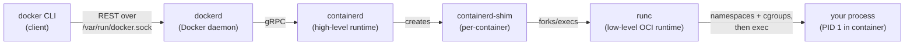
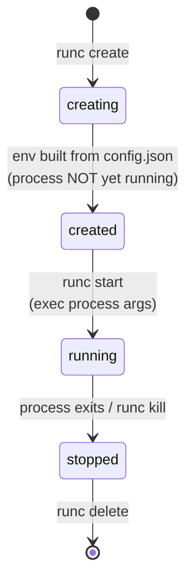
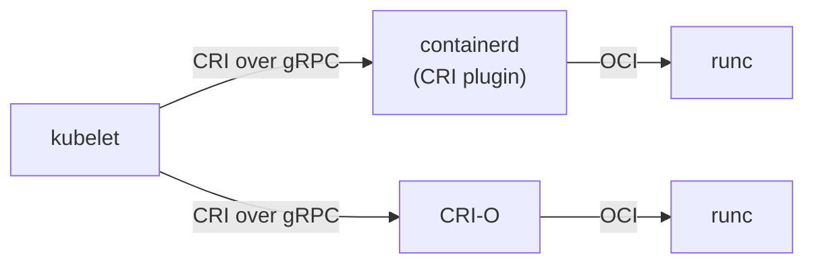

# Container Runtimes, Isolation Internals & OCI Standards

This page opens the hood on **what actually runs a container**. When you type `docker run`, a
chain of programs — `docker` CLI → `dockerd` → `containerd` → `containerd-shim` → `runc` → your
process — cooperates to pull an image, unpack it, and ask the Linux kernel to create an isolated
process. We trace that stack, then explain the **OCI standards** (image-spec, runtime-spec,
distribution-spec) that keep every layer interoperable, the **CRI** that lets Kubernetes talk to
any runtime, and the **isolation primitives** — namespaces (what a container *sees*), cgroups
(what a container *can use*), and capabilities (what it's *allowed to do*). We finish with
stronger-isolation runtimes (gVisor, Kata) and rootless containers.

Boundaries: the **operating-systems** domain owns namespaces/cgroups *theory* in general — here we
teach them at the container-mechanism level (which namespace isolates what). **Kubernetes** is the
downstream *consumer* of CRI/containerd — we point at it, we don't teach pods. Container *security*
hardening (seccomp/AppArmor profiles, `--privileged` dangers, escape threat model) lives in
`docker-security`; here we cover capabilities and rootless only as isolation mechanisms.

> [!KEY-TAKEAWAY]
> Four ideas unlock this topic. **(1) There is no "Docker runtime" — there's a stack:** the CLI is
> a thin client to the `dockerd` daemon, which delegates image/lifecycle work to **containerd** (a
> high-level runtime), which forks **runc** (a low-level OCI runtime) to actually make the
> container. **(2) runc creates a container by asking the kernel for namespaces + cgroups** and
> then `exec`ing your process — a container is a normal Linux process wearing isolation. **(3) OCI
> standards** (image/runtime/distribution specs) make images and runtimes interchangeable — that's
> why a `docker build` image runs unchanged on Kubernetes with containerd. **(4) Namespaces
> control visibility, cgroups control consumption, capabilities control privilege** — three
> orthogonal knobs.

---

## The Docker runtime stack: CLI, dockerd, containerd, runc

"Docker" is not one program. A `docker run` request flows through several cooperating components,
each at a different level of abstraction:



- **`docker` (CLI)** — a thin client. It sends REST calls over a Unix socket
  (`/var/run/docker.sock`) or TCP to the daemon. It does *not* create containers itself.
- **`dockerd` (Docker Engine daemon)** — the long-running server. Handles the Docker API,
  networking (bridge/overlay), volumes, build orchestration, and Swarm. For the actual image and
  container lifecycle it delegates to containerd.
- **`containerd`** — the **high-level runtime**. Manages the complete container lifecycle *on a
  host*: pulling and unpacking images, managing snapshots (the layered filesystem), passing config
  to the low-level runtime, and supervising container processes. It's a CNCF graduated project and
  is used directly by Kubernetes (no Docker needed).
- **`containerd-shim` (`containerd-shim-runc-v2`)** — a tiny process that **owns each container**.
  Once runc has started the container and exited, the shim stays as the container's parent: it
  keeps stdio/pty open, reports the exit code, and — crucially — lets **containerd (and dockerd)
  restart without killing running containers.**
- **`runc`** — the **low-level OCI runtime**. A CLI that takes an OCI *bundle* (a root filesystem
  + a `config.json`) and does the actual kernel calls to create namespaces, apply cgroups, drop
  capabilities, set up mounts, then `exec`s the container process. runc runs, sets things up, and
  exits — it is not a long-running daemon.

> [!INTERVIEW]
> "What happens, step by step, when you run `docker run nginx`?" Strong answer: CLI → REST to
> `dockerd`; dockerd asks `containerd` to ensure the image is present (pull via the
> distribution API, unpack layers into a snapshot); containerd creates an OCI bundle (rootfs +
> `config.json`) and spawns a `containerd-shim`; the shim invokes `runc create` then `runc start`;
> runc sets up namespaces/cgroups/caps and `exec`s nginx as PID 1 in the container; runc exits, the
> shim reparents PID 1 and streams logs back up. Naming this chain signals real depth.

**Why the split?** Separation of concerns and interoperability. containerd handles "everything a
host needs to run containers" and is orchestrator-facing; runc handles "spawn one container per the
OCI spec." Because both talk standard interfaces, you can swap runc for another OCI runtime
(gVisor's `runsc`, Kata's `kata-runtime`, `crun`) without changing containerd or Docker.

---

## containerd: the high-level runtime

**containerd** is the daemon that does the heavy lifting between "an API request" and "a running
container." Its responsibilities:

- **Image pull & storage** — talks the OCI distribution API to registries, verifies digests,
  unpacks image layers into **snapshots** via a snapshotter (overlayfs by default).
- **Lifecycle management** — create/start/stop/delete/exec of containers and *tasks* (a task is a
  running container process).
- **Low-level runtime invocation** — builds the OCI bundle and drives runc (or another OCI runtime)
  through the shim.
- **Namespaces (containerd's own concept)** — logical partitions of containerd's metadata so Docker
  (`moby` namespace) and Kubernetes (`k8s.io` namespace) can share one containerd without seeing
  each other's containers. (These are *not* Linux namespaces — same word, different thing.)

You can drive containerd directly with `ctr` (low-level debug tool) or `nerdctl` (a
Docker-compatible CLI). Because Kubernetes speaks to containerd via CRI, **the same containerd can
serve both Docker and a Kubernetes kubelet on one node.**

> [!TIP]
> `docker` images and `ctr`/`crictl` images can look "missing" to each other on the same host —
> they live in different containerd namespaces (`moby` vs `k8s.io`). Use `ctr -n k8s.io images ls`
> to see Kubernetes' images.

---

## runc and the OCI runtime flow

**runc** is the reference implementation of the OCI **runtime-spec**. It's a small CLI extracted
from Docker's original `libcontainer`. It consumes an **OCI bundle**:

```
bundle/
├── config.json     # the OCI runtime spec: process, env, mounts,
│                   # linux.namespaces, linux.resources (cgroups),
│                   # process.capabilities, root path, hooks…
└── rootfs/         # the container's root filesystem (unpacked image layers)
```

`config.json` is the contract. It declares which namespaces to create, the cgroup limits, the
capability set, mounts, the user/uid, and the process args. runc reads it and makes the kernel
calls. The OCI lifecycle (from the runtime-spec) is:



Key points that trip people up:

- **`create` and `start` are separate.** `runc create` builds the whole environment
  (namespaces, cgroups, mounts) but does **not** run your program — the process waits.
  `runc start` then `exec`s `process.args`. This two-phase design lets an orchestrator set up
  networking/cgroups in the `created` state before the workload runs.
- **`config.json` is frozen at create.** Changes to it after `create` have no effect — matching why
  you can't change a container's namespaces/limits without recreating it.
- **runc is not a daemon.** It does its work and exits; the container process is reparented to the
  shim. (`runc` needs a C helper, `nsexec`, to enter/create namespaces before the Go runtime
  starts threads.)
- **`crun`** is a faster C rewrite of runc (Red Hat), also OCI-compliant and swappable.

---

## The OCI specifications: image, runtime, distribution

The **Open Container Initiative (OCI)**, under the Linux Foundation (started 2015, seeded by
Docker), maintains three specs. Together they cover an image's whole life: **build → store/ship →
run.**

| Spec | Governs | Key artifacts |
|---|---|---|
| **image-spec** | The on-disk/over-the-wire **image format** | Manifest, config (JSON with layer history, env, entrypoint), layers as tar+gzip, content-addressable **digests** (`sha256:…`) |
| **runtime-spec** | How to **run** a container from a filesystem bundle | `config.json`, the bundle layout, lifecycle ops (create/start/kill/delete), states (creating/created/running/stopped) |
| **distribution-spec** | The **registry HTTP API** to push/pull | `/v2/` endpoints, manifests, blobs, content-addressable pulls, `_catalog`/tags |

An **OCI image** is content-addressed: a **manifest** lists a **config blob** and an ordered set of
**layer blobs**, each referenced by its SHA-256 **digest**. A **manifest list / image index** maps
one tag to multiple per-architecture manifests (this is how `nginx:latest` transparently serves
`linux/amd64` and `linux/arm64`). Docker's older "Docker Image Manifest V2 Schema 2" is
near-identical to the OCI image manifest, and registries/tools accept both.

> [!KEY-TAKEAWAY]
> The three specs answer three questions: **image-spec** = "what is an image?", **distribution-spec**
> = "how do I ship it?", **runtime-spec** = "how do I run it?" A tool that implements the relevant
> spec interoperates with all the others.

---

## Why standards matter: interoperability

Before OCI, "a Docker image" and "the Docker runtime" were whatever Docker Inc. shipped —
a single-vendor de-facto standard. OCI turned that into **open, versioned specs** so the ecosystem
could grow without lock-in:

- **Images are portable across tools.** An image built by `docker build`, BuildKit, Buildah,
  Kaniko, or `ko` is the same OCI artifact — it runs on containerd, CRI-O, Podman, or any OCI
  runtime, and is stored in any OCI registry (Docker Hub, ECR, GCR, Harbor, GitHub Packages).
- **Runtimes are swappable.** Because runc, crun, gVisor's `runsc`, and Kata's runtime all
  implement runtime-spec, you change *one config line* to trade performance for isolation.
- **Registries are interchangeable.** The distribution-spec means any client can push/pull to any
  compliant registry, and even non-image artifacts (Helm charts, SBOMs, signatures via OCI
  referrers) ride the same API.

This is the concrete reason **Kubernetes removing Docker didn't break anyone's images**: images are
an OCI standard, independent of the Docker daemon.

---

## CRI: the Container Runtime Interface (and dockershim removal)

The **Container Runtime Interface (CRI)** is a **gRPC API defined by Kubernetes** so the kubelet
can manage containers through *any* runtime that implements it — decoupling the orchestrator from a
specific runtime. CRI defines two services: **RuntimeService** (pods/containers/exec) and
**ImageService** (pull/list/remove images).



- **containerd** implements CRI via a built-in CRI plugin; **CRI-O** is a runtime built *only* to
  serve Kubernetes via CRI. Both then use an OCI low-level runtime (runc) underneath.
- **Docker Engine never implemented CRI.** Early Kubernetes bridged to it with in-tree glue called
  **dockershim**. Maintaining that shim was a burden and blocked features (cgroups v2, user
  namespaces), so **dockershim was deprecated in Kubernetes v1.20 and removed in v1.24 (2022).**
- **Your Docker-built images still run** — they're OCI images. Only the *dockershim runtime path*
  was removed; clusters use containerd or CRI-O. If you must keep Docker Engine as the runtime,
  **`cri-dockerd`** (Mirantis) is an external CRI adapter.

> [!INTERVIEW]
> "Did Kubernetes 'drop Docker'?" Nuance wins here: Kubernetes removed **dockershim**, the adapter
> for the *Docker daemon*, not Docker images. containerd (which Docker already uses under the hood)
> is a CRI runtime, so nodes just talk to containerd directly. Images built with Docker are OCI and
> run everywhere. Point onward: pod/orchestration details belong to the Kubernetes domain.

---

## Linux namespaces: what a container sees

**Namespaces** are the kernel feature that gives a container its *isolated view* of the system.
Each namespace type virtualizes one class of global resource so processes inside see their own
private instance. This is "what the container sees."

| Namespace | Isolates | Effect inside the container |
|---|---|---|
| **PID** | Process IDs | Its main process is PID 1, can't see host processes |
| **NET** | Network stack | Own interfaces, IPs, routing table, ports (`eth0`, loopback) |
| **MNT** | Mount points | Own filesystem tree / mounts (the rootfs) |
| **UTS** | Hostname & domain | Own hostname (why `docker run` containers have random hostnames) |
| **IPC** | System V IPC, POSIX message queues | Own shared-memory / semaphores |
| **USER** | UID/GID mappings | Map container root (uid 0) to an unprivileged host uid — basis of rootless & user-ns remapping |
| **cgroup** | cgroup root view | Hides the host's cgroup hierarchy |
| **time** | Boot/monotonic clock offsets | (Newer; rarely used by Docker) |

Created via the `clone(2)`/`unshare(2)`/`setns(2)` syscalls; runc requests them via
`linux.namespaces` in `config.json`. Observe them on the host with `lsns` or under
`/proc/<pid>/ns/`.

- **PID namespace + PID 1 semantics** explain the zombie-reaping and signal problems (see
  `container-lifecycle` / `--init`).
- **NET namespace** is why each container gets its own IP and why Docker wires a veth pair into the
  `docker0` bridge (see `docker-networking`).
- **USER namespace** is the linchpin of rootless containers: a process can be uid 0 *inside* but map
  to an unprivileged uid on the host, so an escape doesn't grant host root.
- **Sharing namespaces:** `docker run --pid=host` (or `--net`, `--ipc`) drops that namespace's
  isolation and shares the host's — powerful for debugging, dangerous for security. `--pid
  container:<id>` shares another container's PID namespace; Kubernetes pods share the net + IPC
  namespace across containers this way.

> [!WARNING]
> `--pid=host`, `--net=host`, `--ipc=host`, and especially `--privileged` remove isolation layers.
> `--privileged` gives all capabilities, host device access, and disables seccomp/AppArmor — treat
> it as "basically root on the host." Container security hardening lives in `docker-security`.

---

## cgroups: what a container can use

Where namespaces control *visibility*, **control groups (cgroups)** control *resource consumption*
— CPU, memory, block I/O, PIDs, devices. They're how `docker run --memory=512m --cpus=1.5` is
enforced, and how the kernel OOM-kills a container that exceeds its memory cap.

| Docker flag | cgroup controller | Effect |
|---|---|---|
| `--memory=512m` | memory | Hard limit; exceeding → OOM kill (exit 137, `OOMKilled=true`) |
| `--memory-reservation` | memory | Soft limit under contention |
| `--cpus=1.5` | cpu | CFS quota: 1.5 cores worth of time per period |
| `--cpu-shares=512` | cpu | Relative weight under contention (default 1024) |
| `--cpuset-cpus=0,1` | cpuset | Pin to specific cores |
| `--pids-limit=100` | pids | Cap process count (fork-bomb protection) |
| `--blkio-weight` | blkio/io | Relative block-I/O weight |

**cgroups v1 vs v2:** v1 had a separate hierarchy per controller; **v2 uses a single unified
hierarchy** with a consistent interface, better memory accounting, and proper support for
**rootless** cgroup delegation. Modern distros default to cgroup v2; Docker/containerd support it,
and Kubernetes needs it for some features.

> [!TIP]
> A JVM or other runtime that reads "total memory" from the host instead of its cgroup limit will
> over-allocate and get OOM-killed. Modern JVMs (`-XX:+UseContainerSupport`, on by default since
> Java 10/updated 8) read the cgroup memory limit. This is a classic "why does my Java container
> get killed at 137?" interview scenario — the answer is a cgroup memory limit + a container-unaware
> heap.

Exceeding a memory cgroup limit triggers the kernel OOM killer → the process dies with SIGKILL →
container exits **137** (128 + 9) with `OOMKilled=true` in `docker inspect`. CPU limits, by
contrast, *throttle* (never kill) — the container just runs slower.

**Worked example — how `--cpus=1.5` is actually enforced.** CFS (the Completely Fair Scheduler)
works in fixed **periods**. The default period is `cpu.cfs_period_us = 100000` µs (100 ms of
wall-clock time). `--cpus=1.5` sets the **quota** to `cpu.cfs_quota_us = 150000` µs — the container
may burn **150 ms of CPU-time per 100 ms of wall clock**. On a multi-core box that CPU-time can come
from several cores in parallel, so 150 ms per 100 ms window = **1.5 cores** of throughput.

Now trace a **4-thread** CPU-hungry process under that limit, one 100 ms period:

- 4 threads run on 4 cores, spending CPU-time at 4 ms per 1 ms of wall clock.
- The 150 ms quota is exhausted after `150 / 4 = 37.5 ms` of wall clock.
- For the remaining `100 − 37.5 = 62.5 ms` of the period, the cgroup is **throttled**: every thread
  is descheduled until the period rolls over and the quota refills.
- The kernel bumps `nr_throttled` and adds to `throttled_time` (visible in
  `/sys/fs/cgroup/.../cpu.stat`).

So the process gets 1.5 cores *on average* but in a bursty stop-start pattern — CPU work completes,
latency spikes during the throttled tail, and **nothing is killed**. Contrast the memory limit:
overshoot there is fatal (SIGKILL → 137), overshoot on CPU is merely slow.

**`--cpus` vs `--cpu-shares` vs `--cpuset`.** These answer different questions. `--cpus` is a *hard
cap* (absolute ceiling, enforced even on an idle host). `--cpu-shares` is a *relative weight* that
only bites under contention: two containers at `--cpu-shares=1024` and `--cpu-shares=512` competing
for one saturated core split it `1024 : 512 = 2 : 1` — the first gets ≈0.667 core, the second
≈0.333 core; but if the second is idle, the first may use the whole core (shares set no ceiling).
`--cpuset-cpus=0,1` *pins* to specific physical cores (useful for cache locality / NUMA), a
placement knob rather than a rate limit.

---

## Capabilities: slicing up root

Traditional Unix is binary: uid 0 (root) can do everything, everyone else is restricted. **Linux
capabilities** break root's power into ~40 distinct privileges (e.g. `CAP_NET_BIND_SERVICE` = bind
ports < 1024, `CAP_NET_ADMIN` = configure networking, `CAP_SYS_ADMIN` = a huge catch-all,
`CAP_CHOWN`, `CAP_SETUID`). A process can hold a subset instead of all-or-nothing.

By default Docker runs a container's root with a **restricted capability set** — it drops dangerous
ones (like `CAP_SYS_ADMIN`, `CAP_SYS_MODULE`) but keeps a working baseline. You tune it:

```bash
# Drop everything, add back only what you need (least privilege)
docker run --cap-drop=ALL --cap-add=NET_BIND_SERVICE nginx

# Dangerous: grants ALL capabilities + device access + no seccomp/apparmor
docker run --privileged some-image
```

- **`--cap-drop=ALL` then `--cap-add`** is the recommended least-privilege pattern.
- Capabilities are orthogonal to namespaces/cgroups: they gate *which privileged operations* the
  (possibly root) process may perform, even within its namespace.
- Deep hardening (seccomp syscall filtering, AppArmor/SELinux MAC, `--security-opt`,
  `no-new-privileges`, read-only rootfs) is covered in **`docker-security`** — here capabilities
  matter as the third isolation axis alongside namespaces and cgroups.

---

## Alternative runtimes: gVisor and Kata (stronger isolation)

Standard runc containers **share the host kernel** — one kernel vulnerability can be a full escape.
For multi-tenant or untrusted workloads, two OCI-compatible runtimes add a stronger boundary:

| Runtime | Binary | Isolation mechanism | Trade-off |
|---|---|---|---|
| **runc** (default) | `runc` | Namespaces + cgroups, shared host kernel | Fastest, thinnest boundary |
| **gVisor** (Google) | `runsc` | A **user-space kernel** that intercepts syscalls (via a pluggable platform — **systrap** (seccomp `SIGSYS`-trap) is the default since mid-2023, **KVM** for bare-metal, and the legacy **ptrace** platform now deprecated) and re-implements them, so the container rarely touches the host kernel | Stronger isolation, some syscall-heavy perf cost + compatibility gaps |
| **Kata Containers** | `kata-runtime` | Each container runs in a **lightweight microVM** with its *own* guest kernel (via QEMU/Firecracker) | VM-grade isolation, higher startup/memory overhead |

Both plug in as OCI runtimes, so you select them per workload:

```bash
docker run --runtime=runsc  hello-world        # gVisor
docker run --runtime=kata-runtime hello-world  # Kata
```

The spectrum: **runc = shared kernel (fast, weakest boundary) → gVisor = intercepted syscalls
(middle) → Kata/Firecracker = separate kernel in a microVM (strongest, VM-like).** AWS Fargate and
Lambda use **Firecracker** microVMs for exactly this tenant-isolation reason.

> [!INTERVIEW]
> "How do you run untrusted code in containers?" Don't say "just use containers" — a plain runc
> container shares the kernel. Name the escalation ladder: drop capabilities + seccomp + rootless
> (mitigations), then **gVisor** (user-space kernel) or **Kata/Firecracker microVMs** (separate
> kernel) for a real trust boundary. This shows you understand containers are *not* a security
> boundary by default.

---

## Rootless containers

**Rootless mode** runs the entire stack — `dockerd`/containerd, runc, and the container — as an
**unprivileged host user**, with *no* root daemon. It leans on the **user namespace**: the user's
uid is mapped so a process can be uid 0 *inside* the container while being an ordinary uid on the
host.

- **Why:** the classic risk is that the Docker daemon runs as root, so a daemon or container-escape
  bug = host root. Rootless removes that: an escape lands you as an unprivileged user.
- **How it works:** user namespaces (uid/gid mapping via `/etc/subuid`, `/etc/subgid`),
  `slirp4netns`/`pasta` for user-mode networking (no root to create veth/bridges), and **fuse-overlayfs**
  or native overlay for the layered filesystem. cgroup v2 delegation lets a non-root user still set
  resource limits.
- **Limitations:** can't bind ports < 1024 without extra config, some storage-driver and networking
  performance overhead, and features needing real root (certain mounts, some `--privileged` uses)
  don't work.

**Worked example — what `/etc/subuid` actually maps.** Say `/etc/subuid` contains
`alice:100000:65536` (start host uid 100000, span 65536 ids). When alice starts a rootless
container, the user namespace installs this uid map:

| Inside container | Host uid | Meaning |
|---|---|---|
| uid 0 (`root`) | 100000 | "root" inside — but a nobody outside |
| uid 1 | 100001 | |
| uid 33 (`www-data`) | 100033 | |
| … | … | (linear offset) |
| uid 65535 | 165535 | top of the range (`100000 + 65535`) |

Trace the payoff. A process running as **uid 0 inside** can `chown`, `kill`, and write files freely
*within the container* — to the kernel those actions are performed by host uid 100000, and every
file in the container's rootfs is owned somewhere in 100000–165535, so the checks pass. Now suppose
that process **escapes** the container. The kernel still sees it as **host uid 100000** — an
ordinary unprivileged user. It cannot read `/etc/shadow` (owned by real root, uid 0), cannot write
`/root`, cannot load kernel modules. That is precisely why rootless "root" is safe: container-root
is a *mapped* root, not the host's uid 0. (A rootful daemon skips this map — container uid 0 **is**
host uid 0, so an escape is instant host root.)

**Rootless ≠ `USER` in a Dockerfile.** `USER 1000` (running the *app process* as non-root inside
the container) is good practice and independent, but the daemon/runtime may still be root. **Rootless
mode** is about the *daemon and runtime* themselves being unprivileged. Podman is rootless by
default (daemonless); Docker offers rootless mode as an opt-in install.

> [!KEY-TAKEAWAY]
> Two orthogonal "non-root" ideas, often confused: **(1) `USER` non-root inside the container** =
> the workload isn't container-root. **(2) Rootless mode** = the daemon/runtime isn't host-root.
> Both are good; they defend different things. Best practice uses both.

---

## Common follow-up questions

- **Walk me through `docker run` end to end.** CLI → REST → `dockerd` → gRPC → `containerd` (ensure
  image, unpack to snapshot, build OCI bundle) → `containerd-shim` → `runc create` then `runc start`
  → runc sets up namespaces/cgroups/caps and `exec`s your process → runc exits, shim reparents PID 1.
- **What does the shim do and why can I restart Docker without killing containers?** The
  `containerd-shim` is the container's persistent parent; it holds stdio and the exit code so
  containerd/dockerd can restart independently of running containers (live-restore).
- **runc vs containerd — which is the "runtime"?** Both are, at different levels: containerd is the
  *high-level* runtime (images + lifecycle on a host); runc is the *low-level* OCI runtime (spawns
  one container from a bundle). containerd calls runc.
- **What are the three OCI specs?** image-spec (image format/manifest/config/layers),
  runtime-spec (bundle + `config.json` + lifecycle), distribution-spec (registry `/v2/` HTTP API).
- **Why didn't Kubernetes dropping Docker break my images?** Images are an OCI standard, independent
  of the Docker daemon. Only *dockershim* (the Docker-daemon CRI adapter) was removed in v1.24;
  nodes use containerd/CRI-O.
- **Namespaces vs cgroups in one line?** Namespaces = what a container *sees* (isolation); cgroups =
  what it *can use* (limits). Capabilities = what it's *allowed to do* (privilege).
- **Why did my container exit 137?** SIGKILL (128+9) — usually the memory cgroup limit was exceeded
  and the kernel OOM-killed it (`OOMKilled=true`), or a `docker stop` hit its timeout.
- **How do I isolate untrusted workloads more strongly than runc?** gVisor (`runsc`, user-space
  kernel) or Kata/Firecracker (microVM with its own kernel) — both are drop-in OCI runtimes.
- **Rootless vs `USER` non-root?** Rootless = the *daemon/runtime* is unprivileged; `USER` = the
  *app process* is non-root inside the container. Different layers; use both.

## References

- OCI — [runtime-spec](https://github.com/opencontainers/runtime-spec/blob/main/runtime.md),
  [image-spec](https://github.com/opencontainers/image-spec/blob/main/spec.md),
  [distribution-spec](https://github.com/opencontainers/distribution-spec/blob/main/spec.md)
- [containerd — architecture & docs](https://github.com/containerd/containerd/blob/main/docs/README.md)
- [runc — OCI runtime (opencontainers/runc)](https://github.com/opencontainers/runc)
- Kubernetes — [Container Runtimes / CRI](https://kubernetes.io/docs/setup/production-environment/container-runtimes/),
  [Dockershim removal FAQ](https://kubernetes.io/blog/2022/02/17/dockershim-faq/)
- Docker Docs — [Runtime options (resource constraints, cgroups)](https://docs.docker.com/engine/containers/resource_constraints/),
  [Rootless mode](https://docs.docker.com/engine/security/rootless/),
  [Alternative runtimes](https://docs.docker.com/engine/daemon/alternative-runtimes/),
  [Runtime privilege and capabilities](https://docs.docker.com/engine/containers/run/#runtime-privilege-and-linux-capabilities)
- [gVisor docs](https://gvisor.dev/docs/) ([platforms — systrap default](https://gvisor.dev/docs/architecture_guide/platforms/)) · [Kata Containers docs](https://katacontainers.io/)
- Linux man pages — [`namespaces(7)`](https://man7.org/linux/man-pages/man7/namespaces.7.html),
  [`cgroups(7)`](https://man7.org/linux/man-pages/man7/cgroups.7.html),
  [`capabilities(7)`](https://man7.org/linux/man-pages/man7/capabilities.7.html)
