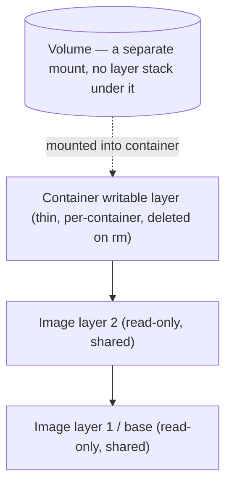

# Volumes, Bind Mounts & Data Persistence

Topic 5 left a bill open: latency on the first write to a file that already exists, a tax on
every write after it, and the bytes themselves gone on `docker rm`. The third item is
settled in the next section; the first two are settled in the copy-on-write section after it,
with the magnitude topic 5 withheld.

Here is the shape of the outage that follows, drawn as an illustration rather than reported
from a log. A Postgres container has been up for weeks. Someone changes one environment
variable, runs `docker compose up -d`, and Compose does exactly what it is built to do: it
removes the old container and starts a new one from the same image. Every table the database
had written goes with the old container, because the data never actually left it. Nothing
crashes, and no error is printed. The question this file answers: which of the bytes a
container writes disappear the moment it is removed, and what you mount where so that the
ones that matter do not.

> [!TIP]
> **Reading map.** About 45 minutes. The first two sections are the whole argument — what
> dies, and what it costs while it lives; the next three are the three ways to cross the
> boundary. If you already write `--mount type=volume` without looking it up, start at
> [Populating a volume from image content](#populating-a-volume-from-image-content-first-mount-copy),
> which is where the surprises are. The Compose, driver and backup sections are reference
> material you can read when you need them.

---

## The ephemeral writable layer

Every byte a container writes to a path that no mount covers lands in one thin layer, and
`docker rm` deletes that layer along with the container. `docker stop` does not touch it.
Watch the two events come apart:

```bash
docker run -d --name c1 alpine sleep 3600
docker exec c1 sh -c 'echo hello > /data.txt'
docker stop c1 && docker start c1
docker exec c1 cat /data.txt     # hello  <- stop and start kept the layer
docker rm -f c1                  # the layer is deleted HERE, not above
```

Recreate a container with that same name and command, run the same `cat`, and you get
`cat: can't open '/data.txt': No such file or directory`. The file was never on the image, so
the new container's layer starts empty.

The reason the loss event is removal rather than stopping is that the layer is a directory
on the host, created by the daemon when the container is created and registered as the
top of that container's filesystem stack. Stopping the container kills its processes and
unmounts the stack; the directory stays, with your bytes in it, which is why `docker start`
finds them again. Removing the container deletes the container's record and that directory
together. So there is no "flush before shutdown" you can do to make the layer outlive
`docker rm` — the two are the same operation.

That settles the third item on topic 5's bill: the data itself is gone on removal. And removal
is routine. `docker run --rm` does it on exit, and `docker compose down` does it to every
service. Changing an image tag or an environment variable in a Compose file does it too, as a
side effect of applying the change.

> [!WARNING]
> The belief that causes this outage is "it has worked for six weeks, so it must be
> persisted somewhere." Six weeks of uptime only means nobody has removed the container yet.
> Uptime is not durability: the layer's lifetime is bounded by one container's existence,
> not by how long that container happens to have been running.

Two things are wrong with the writable layer as a home for state, and they are independent.
The layer is tied to one container's life, so it cannot be shared, cannot be backed up as a
unit, and cannot survive recreation. And every write to a file that came from the image pays for
the privilege, in a way the next section makes exact.

Both remaining items on the bill are about speed, and both start with a write to a file the
image already contains.

---

## Copy-on-write and why databases must not use the container layer

A write to a file the image already contains does not begin by writing. It begins by copying
that file — all of it — into the writable layer, so changing one byte of a 2 GB table file
moves 2 GB first. Reads are free by comparison: the container reads straight out of the
shared image layer, and no copy happens at all.

Image layers are read-only and shared by every container built from them, which is only
possible if nobody may modify one. Topic 1 named the arrangement that squares that with a
container writing files: copy-on-write, where the original layer is left alone and the writer
gets a private copy. What topic 1 did not price is when the copy happens and how large it is.
Both answers are the same regardless of which union filesystem is underneath — the component
that makes several read-only layers plus one writable one look like a single tree. `overlay2` is
the classic one; a fresh install of Engine 29.0 or later picks the containerd image store
instead, and the layer behaviour described here holds for both.

The operation has a name in Docker's documentation: a `copy_up`. The search runs newest layer
to oldest until the file is found. Docker then, in the docs' words, will "perform a `copy_up`
operation on the first copy of the file that's found, to copy the file to the container's
writable layer." Afterwards "the container can't see the read-only copy of the file that
exists in the lower layer", because the private copy has taken over that path.



So item one on topic 5's bill has a shape, not just a name. The first write to an existing
file costs a copy of the whole file: the cost scales with the file's size, O(file size), and is
unrelated to how many bytes you are writing. The charge lands once per file per container, since
the docs are explicit that "each `copy_up` operation only occurs the first time a given file is modified."

Why the whole file, when you only changed a byte? Because a union mount's unit is the file, not
the byte range. One path resolves to one file in one layer; there is no arrangement in which the
first half of a file comes from the image layer and the second half from the writable one. So the
only way to let the container change a byte is to give it the whole file to change, which means
copying the whole file up first.

Two consequences fall straight out of that. A `chmod` or a `chown` can trigger a full `copy_up`
too — the docs say it "can also result in a `copy_up` operation" — because permissions live in
the file's metadata and the metadata is part of what gets copied.

And a database is close to the worst shape for this rule — but only under a condition the obvious
reading skips. Docker's storage-driver guidance says
write-intensive databases are "known to be problematic particularly when pre-existing data exists
in the read-only layer." *Pre-existing* is the operative word. The official `postgres:16` and
`mysql:8` images ship an **empty** data directory. Their first start runs `initdb`, which creates
the data files new in the writable layer, where there is no lower-layer original — so no `copy_up`
happens at all. The trap is a dataset that arrives inside an image: a database directory baked in by a
`COPY`, or an image built with `docker commit` from a container that had already been running.
Then every data file is large, is in a read-only layer, and gets written on startup, which is all
three conditions at once. Absent that, a database on the writable layer still pays the union
filesystem's general write overhead and still loses everything on `docker rm`, which is reason
enough not to.

A volume avoids all of it, and the reason is a mount, not a special case in Docker. A volume
is a separate filesystem attached to a directory inside the container, the same way a second
disk attached to `/mnt` on your laptop is separate from the root filesystem. The kernel
resolves a path by walking it component by component, and at a mount point the walk leaves
one filesystem and continues in the one mounted there. When Postgres opens
`/var/lib/postgresql/data/base/16384/2619`, the walk leaves the layer stack at
`/var/lib/postgresql/data` and finishes inside the host filesystem holding the volume. Below
that mount point there are no image layers to search and no original to preserve, so there is
nothing to copy up. Docker's storage documentation states the consequence: the union
filesystem is an "extra abstraction" that "reduces performance as compared to using volumes,
which write directly to the host filesystem."

### What it costs: the part Docker measures and the part it does not

Topic 5 priced item two as a tax on every write after the first, and that is the one place
where the bill was rounded up. After the `copy_up`, the file the container writes to is an
ordinary file in the writable layer's own directory on the host. Writes to it go to that
filesystem, at that filesystem's speed. The surviving cost is thinner, and separating what is
documented from what is inference matters here.

Documented: before a union mount can open a path, it has to work out which layer holds it, and
that search runs from the newest layer downward one layer at a time. Also documented: the results
of that search "are added to a cache to speed future operations". Now the inference, which is this
file's reasoning rather than a Docker measurement. The price of the search tracks how many layers
are stacked, not how many bytes you write. And the cache means you pay it on a path's first lookup
rather than on every one. Treat that as the shape of the cost, not as a number.

The magnitude is where the honest answer is a range, and Docker commits to a direction rather than
a figure. It says a `copy_up` can incur a noticeable performance overhead, that how much depends
on which storage driver is in use, and that large files, many layers and deep directory trees make
the impact more noticeable. It tells write-heavy applications to keep their data out of the
container, and describes volumes as "designed to be efficient for I/O". What it never publishes is
how much slower a steady-state random write to the writable layer is than the same write to a
volume. That genuinely varies with the host filesystem, the layer depth and the file sizes, so any
single multiplier would be a fact about one machine rather than about Docker.

One popular sharpening of the claim does not survive checking: that `fsync`-heavy workloads suffer
worst. `fsync` is the call that forces a filesystem's buffered writes down to durable storage, and
Docker names no way in which a layer stack changes what it costs. The charge you can actually point
to is the `copy_up`, and it lands when the file is first written, not at `fsync` time. What you can
compute exactly is the arithmetic part: one byte into that 2 GB table file moves 2 GB, once, before
the write returns.

> [!INTERVIEW]
> "Why is running Postgres on the container's writable layer a bad idea?" A complete answer
> needs both halves, because they fail differently. Durability: the data files are deleted by
> `docker rm`, and recreating a container is a routine operation. Performance: the first write
> to each pre-existing data file copies the whole file, and the layer stack sits under every
> path lookup. A volume answers both at once — the mount takes those paths out of the layer
> stack, and the volume outlives the container that used it.

Volumes have now answered two problems without ever being defined, which the next section
fixes.

---

## Named volumes (Docker-managed storage)

The engine will create and own a piece of storage for you, keep it under
`/var/lib/docker/volumes/<name>/_data` on a Linux host, and hand it to whichever container
asks for it by name. Nothing about it belongs to a container. You create it, containers come
and go, and it is still there until you delete it.

Docker calls that a **named volume**: storage the engine creates and owns, referenced by the
name you gave it rather than by a path, and independent of any container's life.

```bash
docker volume create app-data
docker run -d --name db \
  --mount type=volume,src=app-data,dst=/var/lib/postgresql/data \
  postgres:16
```

`docker volume inspect app-data` prints the real directory as `Mountpoint`.

What do you actually get for handing the path to the engine instead of picking one yourself?
Three things, different in kind.

You get a lifecycle of its own. The volume outlives `docker rm`, so recreating the container
to change an image tag is no longer a data-loss event, and a series of containers over months
can attach to the same volume in turn. You also get direct I/O on the way through, for the
reason the last section gave: the mount takes those paths out of the layer stack, so no write
under them pays a `copy_up`.

You get a name that means the same thing everywhere. A bind mount needs a specific host
directory to exist; `app-data` needs nothing except an engine, which is what makes a Compose
file with named volumes runnable on a laptop and a server without editing paths. And when you
mount an empty volume onto a directory the image already populated, the engine copies the
image's files in — a seeding behaviour with enough consequences to get its own section below.

You get an API. `docker volume ls`, `inspect`, `rm` and `prune` operate on volumes as
first-class objects, backup tools can find them by name, and a volume driver can put the
bytes on NFS or cloud storage instead of the daemon's disk. None of that has an equivalent for
"some directory on the host".

The practical split follows from all three. Keep data you need to keep in a volume: database
files, user uploads, the Node API's uploads directory. Use a bind mount when a person on the
host has to read or edit the same bytes, which in practice means source code during development
and config files.

### Where it breaks: the host path you should not reach for

`/var/lib/docker/volumes/app-data/_data` is a real directory on a Linux daemon host, and you
can `cd` into it as root and see your Postgres files. Two things make it the wrong handle.
Volume drivers other than `local` do not put the bytes there at all, so any script built on
that path stops working the moment somebody moves the volume to NFS. And on Docker Desktop
the path is not on your machine: Desktop runs the engine inside a Linux VM, so
`/var/lib/docker/volumes` is a path inside that VM's filesystem.

The VM is also why the volume-versus-bind-mount choice is sharper on a Mac or Windows laptop
than on a Linux server. A named volume lives in the VM's own filesystem, so a container's read
is an ordinary read. A bind mount to a directory on your Mac has to be shared across the VM
boundary instead. Docker's own settings documentation is blunt about what that costs: "file sharing
introduces overhead as any changes to the files on the host need to be notified to the Linux VM."
The same page warns that sharing too many files can drive high CPU load and slow filesystem
performance. Notice that its unit there is a count of files, not a quantity of bytes, which points
at the workloads that suffer being the ones touching tens of thousands of small files: a
`node_modules` tree, a Git checkout, a database's page files. Desktop's own recommendation for
exactly those is to move them inside the VM, onto a data volume.

How much does the crossing cost? Docker publishes no volume-versus-bind-mount figure for Desktop,
so this is another direction without a number. What it does publish is a comparison between two
sharing implementations. VirtioFS, now the default on Mac, "has reduced the time taken to complete
filesystem operations by up to 98%" against the older gRPC FUSE implementation. Read that
carefully: it measures how much of the old cost was the old implementation, not how much of the
remaining cost is the boundary itself. On a current Desktop you have already been handed that 98%,
and what is left of the crossing is the part nobody has priced.

None of that helps when the point of the mount is that a human edits the files, which is what
bind mounts are for.

---

## Bind mounts

You point at a directory that already exists on the host, say `/home/dev/api/src`. The
container then sees that directory at whatever path you mounted it on, with the host's own
contents, owners and permission bits. Save a file in your editor and the process inside the
container reads the new bytes on its next open. Nothing was copied and nothing is managed
by Docker.

Docker calls that a **bind mount**: a host path mapped straight into the container, so what
the container sees at that path is the host's directory itself.

```bash
# The Node API's source, mounted in for live reload during development
docker run -d --name web \
  --mount type=bind,src="$(pwd)"/src,dst=/app/src \
  node:20 npm run dev
```

Every difference from a volume traces back to one fact: the host filesystem owns the storage,
not the engine. So the mount only works where that exact path exists, which is why bind mounts
belong in development and local configuration rather than in anything you ship — a Compose
file with `./src` in it is a Compose file about your machine.

The same fact decides what happens when the source path is missing, and the two syntaxes
disagree. With `-v`, the docs say "Docker automatically creates the directory on the host for
you. It's always created as a directory" — so if you meant to mount a single config file, you
get an empty directory and an application that cannot find its config. With `--mount`, "by
default, `--mount` does not automatically create a directory if the specified mount path does
not exist on the host"; you get an error naming the path, and you opt into the other behaviour
with `bind-create-src`.

Host ownership is also why the container's write reach is exactly the host's. Anything under
the mounted path is writable by the container unless you mount read-only. That is why the CIS
Docker Benchmark names a set of host directories that should not be bind-mounted into a container:
`/`, `/boot`, `/dev`, `/etc`, `/lib`, `/proc`, `/sys`, `/usr`. Its wording adds "especially in
read-write mode", and its automated check follows the same scope — it flags a mount of one of those
paths only when `RW` is true. A container with
write access to the host's `/etc` or `/usr` can change what the host executes on its next boot,
which makes it a host compromise rather than a container one. The paired rule is the cheap one:
if the container only reads the files, mount it `:ro`.

> [!WARNING]
> The mistake is easy to make and quiet: `docker run -v /does/not/exist:/app ...` does not
> fail. Docker creates `/does/not/exist` on the host as an empty directory, mounts it, and your
> application sees an empty `/app` — so the error you eventually read is a missing-file error
> from your own code, several layers away from the typo that caused it. Using `--mount` turns
> the same typo into an immediate error naming the path.

### Where it breaks: the mount that hides your application

Mount a directory onto a container path that already has files in it from the image, and those
files do not merge with yours. They disappear from view instead. The docs' phrase is that "the
pre-existing files are obscured by the mount", the same way plugging a USB drive in over `/mnt`
makes the old `/mnt` contents invisible until you unmount it. The image layer still holds them,
untouched. But for a running container there is "no straightforward way of removing a mount to
reveal the obscured files again", so you recreate it without the mount.

Obscuring is the difference from a volume that surprises people most, because a volume mounted
on the same directory copies the image's files into itself instead. Docker's own example
bind-mounts the host's `/tmp` over `/usr`
inside an `nginx` container, which hides every binary the image installed there. The container
gets created but never starts: `docker run` comes back with an error from the daemon whose
payload is `exec: "nginx": executable file not found in $PATH`. Nothing was deleted and the
image is fine — the mount simply covered the directory the executable lived in, so there was
no `nginx` on `$PATH` to start.

A mount that keeps nothing at all, on purpose, is the third mechanism.

---

## tmpfs mounts (in-memory)

A tmpfs mount puts the files in RAM. Write a 40 MB session-token cache to `/app/cache` under
one and nothing lands on the container's layer, nothing lands on the host's disk, and the
whole thing ceases to exist when the container stops. The mechanism is Linux-only, because what gets
mounted into the container is the kernel's own `tmpfs` filesystem.

```bash
docker run -d --name app \
  --mount type=tmpfs,dst=/app/cache,tmpfs-size=64m,tmpfs-mode=1770 \
  myapp:latest

# shorthand form
docker run -d --tmpfs /run:size=32m myapp:latest
```

One verb separates tmpfs from the other two mechanisms, and the verb is *stops*, not *removed*.
A volume needs an explicit `docker volume rm`. A
writable layer needs `docker rm`. A tmpfs mount is gone at `docker stop`, before removal —
"when the container stops, the tmpfs mount is removed, and files written there won't be
persisted", and a `docker start` afterwards gives you an empty directory. Nor can two
containers share one: "you can't share tmpfs mounts between containers", because each mount
belongs to one container's mount namespace and there is no name to reference it by.

Two options carry defaults you should know rather than discover. `tmpfs-size` caps the mount in
bytes, and "if unset, the default maximum size of a tmpfs volume is 50% of the host's total
RAM" — an unbounded-looking default that is really a very large bound. `tmpfs-mode` sets the
octal permissions and "defaults to `1777`" — world-writable, with the sticky bit that stops one
process deleting another's files. World-writable is generous for a directory you created to hold
secrets, so `1770` in the example above restricts it to the owning group.

Both use cases follow from where the bytes are. Data that must never touch disk belongs in a
tmpfs mount: decrypted secrets, session tokens, a private key in flight. There is no file left
for a forensic tool or a stray backup to find later. Fast scratch space for large
temporary state is the other one. "Purely RAM" is a simplification worth holding loosely,
though: this is the kernel's tmpfs, so pages can be written to swap under memory pressure, and
tmpfs contents count toward the container's own memory limit. Raising `size=` does not grant
the container more RAM. It only raises the ceiling at which the filesystem itself refuses
writes.

`--tmpfs` is the shorthand and takes a path plus comma-separated options after a colon;
`--mount type=tmpfs,...` is the explicit form, supports every option, and is what to use for
anything beyond a scratch directory.

Three mechanisms, three lifecycles, and the choice between them is usually decided by one
question.

---

## Choosing: volumes vs bind mounts vs tmpfs

Three questions separate the three mechanisms, and the first one settles most cases on its own:
must these bytes outlive this container? A `postgres:16` data directory must, so tmpfs is out
before anything else is considered. Then: does a person on the host need to open the same
files? And: must the bytes never reach a disk?

| Aspect | Volume | Bind mount | tmpfs |
|---|---|---|---|
| Managed by | Docker (`/var/lib/docker/volumes`) | You / host filesystem | Kernel (RAM) |
| Source | Docker-managed path | Any host path | Memory |
| Persists after container `rm`? | Yes | Yes (it's on the host) | No — gone at `stop` |
| Portable across hosts? | Yes (recreate + restore) | No (host-path bound) | N/A |
| Populated from image on first mount? | Yes (copies existing dir) | No (obscures it) | No |
| Under the layer stack? | No (separate mount) | No (separate mount) | No (separate mount) |
| Volume-driver support (NFS/cloud)? | Yes | No | No |
| Typical use | DB data, uploads, prod state | Dev source, config files | Secrets, scratch |
| OS support | All | All | Linux only |

The default is a named volume, and what you give up by taking it is host visibility. The files
sit at a path the engine chose, so reading or editing them means going through a container.
Take the bind mount instead exactly when that visibility is the point — you are editing source
on the host and want the process inside the container to see the edit. Accept in exchange that
the deployment is now pinned to a host layout and slower on Docker Desktop. Reach for tmpfs
when persistence is not a feature but a liability, and pay for it in RAM and in a directory
that empties itself at `docker stop`.

> [!KEY-TAKEAWAY]
> Bytes written to a container's writable layer are deleted by `docker rm`, and `docker rm`
> happens routinely. A volume is engine-managed storage under `/var/lib/docker/volumes` with a
> life of its own, and it is the answer for data you must keep. A bind mount maps a host path
> in, which is what you want when a human edits the same files and wrong when you want
> portability. A tmpfs mount keeps the bytes in RAM and drops them at `docker stop`. A database
> gets a volume, never the writable layer.

Choosing a volume raises the question of when it goes away, since nothing about it is tied to
the container any more.

---

## Volume lifecycle and the `docker volume` commands

Nothing deletes a named volume except you. A volume is not removed when the container using it
is removed, nor by `docker compose down`. A fresh `docker run` that names it will attach to the
data still sitting in it from three containers ago.

```bash
docker volume create app-data          # create explicitly
docker volume ls                        # list volumes
docker volume inspect app-data          # driver, Mountpoint, labels, options
docker volume rm app-data               # remove one (fails if a container uses it)
docker volume prune                     # remove *unused anonymous* volumes (Engine 23.0+ default)
docker volume prune -a                  # remove all unused volumes, not just anonymous
```

Four behaviours account for nearly every surprise here, and they differ in what counts as
"still in use".

`docker volume rm` refuses while any container references the volume, and a stopped container
still counts — the reference is recorded in the container's configuration, which `docker stop`
does not remove. So the fix is to remove the containers first, not to stop them.

`docker rm -v <container>` removes "anonymous volumes associated with the container", and the
docs are explicit about the other half: "if a volume was specified with a name, it will not be
removed." Mount `awesome:/foo` and a bare `/bar` in one container, run `docker rm -v` on it,
and the volume behind `/foo` survives while the one behind `/bar` is deleted.

`docker volume prune` targets volumes "not referenced by any containers"; Docker's CLI calls those
*dangling*, which is why `docker volume ls -f dangling=true` is how you list them. Since Engine
23.0 the default removes only the anonymous ones — before 23.0 it took unreferenced *named* volumes
too, so the identical command was a data-loss risk on an older engine. Add `--all` (`-a`) and it
prunes "both unused anonymous and named volumes"; the anonymous-only default came in with API 1.42,
which is Engine 23.0, and the `--all` flag itself arrived in 23.0.5. The distinction matters in the
direction you would not guess: on a current engine the default is the *safe* one. So running
`prune` to reclaim disk will often free nothing, while a stack of named volumes nobody references
sits there untouched.

`docker compose down` removes the services' containers and the networks it created, and its
removal list does not include volumes; anonymous volumes are not removed by default either.
Adding `-v` (`--volumes`) removes "named volumes declared in the `volumes` section of the
Compose file and anonymous volumes attached to containers". Volumes marked `external` are never
removed by either form.

Which of those two paths deletes your data depends on whether the volume had a name, and the
next section is about how it gets one.

---

## `-v` (`--volume`) vs `--mount` syntax

The same mount can be written two ways, and they are not equivalent at the edges. `--mount`
takes `key=value` pairs in any order and states the mount's type out loud; `-v` takes a
colon-separated triple in a fixed order and infers the type from what the source looks like.

```bash
# --mount: explicit key=value, order-independent
docker run --mount type=volume,src=app-data,dst=/data,readonly ...
docker run --mount type=bind,src="$(pwd)"/cfg,dst=/etc/app,ro ...

# -v: positional [source:]destination[:options]
docker run -v app-data:/data:ro ...
docker run -v "$(pwd)"/cfg:/etc/app:ro ...
```

Reading across those four lines gives you the translation rule: `-v app-data:/data:ro` is
`--mount type=volume,src=app-data,dst=/data,readonly` — first field to `src`, second to `dst`,
and the option word spelled out.

Three differences decide which one to reach for. The first is what happens to a typo. For a
bind mount with a missing source, `-v` creates the directory and `--mount` errors; for a
volume, both create the named volume if it does not exist, so the asymmetry is entirely about
host paths.

The second is coverage, and here `-v` simply cannot express some mounts. Volume-driver options,
mounting a subdirectory of a volume with `volume-subpath`, mounting into a Swarm service, and
the `bind-recursive` control over submounts are all `--mount`-only. `volume-subpath` is the newest
of that list: it arrived with API 1.45, which is Engine 26.0, so an older engine rejects it. The
subdirectory must also already exist inside the volume or "the mount fails".

The third is that `-v` guesses, and the guess is silent. A source containing a `/` is read as a
host path and gives you a bind mount; a bare word with no slash is read as a volume name. That is
what makes `-v $DATA_DIR:/data` a hazard in a script. Let `$DATA_DIR` hold a value with no slash in
it — `data`, or a name a caller handed in meaning it as relative — and the command becomes
`-v data:/data`, where `data` is a perfectly legal volume name. You get a named volume instead of
the bind mount you meant: the files are not where you think they are, nothing is shared with the
host, and nothing is printed. Written as `--mount type=bind,src="$DATA_DIR",dst=/data` the same
value is refused, because a bind source has to be an absolute path. An *empty* `$DATA_DIR` is the
one case both syntaxes catch — `-v :/data` has no source at all, and the engine rejects it as an
invalid mount specification. Two things follow from that. `--mount` belongs in anything committed to a
repository, both because it refuses the typo and because a reader can see the mount's type
without knowing the rule. `-v` belongs in interactive commands you are about to forget.

Two of those cases produced a volume with no name at all, which is a category worth its own
section.

---

## Anonymous vs named volumes

A volume you never named still exists. The engine gives it a random 64-character hexadecimal ID
instead of a name. So `docker volume ls` shows a screen of `f3c1a9...` entries, with nothing to
say which container or path any of them came from. Having a name or not is the whole difference,
and it decides whether you can ever find the volume again.

A named volume has the name you chose. `app-data` and `db-data` are greppable in a Compose
file, addressable in a backup script, and obvious in `docker volume ls`. An anonymous volume
is created for you whenever a mount asks for a volume without giving a source name, which
happens in exactly two ways:

```bash
docker run -v /var/lib/mysql mysql:8          # no "name:" prefix -> anonymous volume
docker run -v db-data:/var/lib/mysql mysql:8  # named volume "db-data"
```

```dockerfile
# Every container started from this image gets a fresh anonymous volume here
VOLUME /var/lib/mysql
```

The second one is the surprising path, because it fires without anyone typing `-v` at all. A
`VOLUME` instruction is a property of the image, so every container started from it gets its
own new anonymous volume at that path unless the operator overrides the mount at run time.
Start twenty containers from that image over a week and you have twenty volumes with hex
names, holding twenty separate MySQL data directories.

Per-container creation is also the disk-growth mechanism. Anonymous volumes are unreferenced as
soon as their container is removed, they are not deleted by `docker compose down`, and their
names carry no hint of what they were for. So the usual first sighting is `docker system df`
reporting tens of gigabytes in local volumes. Removing the container with `docker rm -v`
deletes them at the right moment, and a periodic `docker volume prune` catches the ones already
orphaned — the anonymous-only default makes that command exactly the right tool for this one
job.

### The version-specific truth: what a Dockerfile `VOLUME` does to a later build step

Declare `VOLUME /var/lib/mysql` in a Dockerfile and then `RUN` something that writes there, and
whether your writes survive depends on which builder ran the build. The documentation states
both outcomes: "those changes will be discarded when using the legacy builder", and "when using
Buildkit, the changes will instead be kept." Which one you have is settled by Docker's build
documentation: BuildKit is the default builder for Docker Desktop and Docker Engine, stated with no
version attached. So on a normal Linux install the writes are kept. The legacy builder is the one
BuildKit replaced, and it is still what runs for Windows containers.

The legacy behaviour is not arbitrary. Each instruction runs in a temporary container, and the
declared path has a volume mounted on it while that container runs, so writes to it land in the
volume rather than in the container's own filesystem. The layer is then produced from the
container's filesystem changes — which do not include anything inside a mount — and the
temporary volume is thrown away. The path in the resulting image is exactly as empty as it was
before the `RUN`.

Two more properties are worth having before you decide to use the instruction. It cannot name a
host directory. The docs note that "the `VOLUME` instruction does not support specifying a
`host-dir` parameter", because the mountpoint "is, by its nature, host-dependent", and
hard-coding one would break image portability. The declaration is also not reversible by a
consumer of your image. There is no "un-declare" flag, so anyone running the image either accepts an anonymous
volume at that path or supplies their own mount there. Those two together are why many teams
leave `VOLUME` out of Dockerfiles entirely and let whoever runs the image choose the mount. That
costs one line in a `docker run` and buys a volume with a name.

Overriding a declared `VOLUME` with your own named volume raises a question the instruction was
partly there to answer: what happens to the files the image already had at that path?

---

## Populating a volume from image content (first-mount copy)

Mount an empty volume onto a container directory that already has files in it from the image,
and the engine copies those files into the volume before the container starts. `nginx:latest`
ships a default page at `/usr/share/nginx/html`; mount an empty volume there and the volume now
contains that page, which you can then edit from another container and keep across
recreations.

```bash
# nginx's image ships default files at /usr/share/nginx/html.
# On first mount of an EMPTY volume, those defaults are copied into the volume.
docker run -d --name web \
  --mount src=site,dst=/usr/share/nginx/html nginx:latest
```

The docs' wording for the rule is that such files "are propagated (copied) into the volume by
default", and it is called out as "a good way to pre-populate data that another container
needs". Two conditions gate it, and both are easy to trip.

The mount must be a volume. A bind mount on the same path obscures the image's directory instead.
That is why the identical command written with `-v "$(pwd)"/site:/usr/share/nginx/html` serves 404s
out of an empty directory rather than nginx's default page. tmpfs behaves the same way — an empty
RAM filesystem covering the image's files.

The volume must be empty. If it already holds data, nothing is copied and the existing contents
win. Keeping them is the behaviour you want on every restart after the first, because your
edited page is not overwritten by the image's default on each `docker run`. It also means the seeding happens once
in a volume's life, so an image upgrade that ships new defaults does not deliver them to a
volume already in use.

Turn the copy off with `volume-nocopy`, which the documentation lists as an option for both
mount syntaxes: "if present, data at the destination isn't copied into the volume if the volume
is empty." `-v` spells the same thing as a third field, `-v site:/usr/share/nginx/html:nocopy`.
Reach for it when the image's files at that path are irrelevant to you, and copying
them is either slow or actively wrong. Two cases fit: a large dataset baked into an image, and a
directory whose image contents would confuse the application on an otherwise empty volume.

This copy also settles who owns the files afterwards, which is where permissions start to bite.

---

## Read-only mounts

Adding `:ro` to a mount makes the container's view of it read-only. A write attempt then fails with
`EROFS` — the kernel's "read-only file system" error, which is not a permission error and not a
Docker error. Getting the errno right matters when you are reading the message rather than guessing
at it: a permissions problem would say `EACCES`, and chasing UIDs is the wrong hunt here. The
restriction is on the mount, so it applies no matter which process inside the container tries and
no matter what UID that process runs as. Config files, static assets and
reference data are the obvious candidates, since nothing legitimate in the container writes
them.

```bash
docker run --mount type=volume,src=cfg,dst=/etc/app,readonly ...
docker run -v cfg:/etc/app:ro ...
docker run --mount type=bind,src="$(pwd)"/conf,dst=/etc/nginx,ro nginx
```

Read-only is a property of the mount rather than of the volume. So the same volume can be
mounted read-write in one container and read-only in another at the same time — the docs
confirm you "can simultaneously mount a single volume as `read-write` for some containers and
as `read-only` for others". A writer-plus-readers setup has exactly that shape: one container
owns the data and everything else gets a view it cannot damage. `docker inspect` on the
read-only side shows `"RW": false` in the container's `Mounts` array, which is how you check
what actually got applied rather than what you meant to type.

The pairing that makes this a hardening technique rather than a courtesy is `--read-only`, which
mounts the container's whole root filesystem read-only. Every path the process can write is
then one you listed explicitly: the volumes and tmpfs mounts you gave it. So an attacker who
gets code execution cannot drop a binary in `/tmp` or rewrite `/usr/local/bin`. The cost is
that
images which write to unexpected places at startup break, and finding those paths is the work
involved; `docker-security` covers the rest of the hardening set this belongs to.

Read-only mounts control what one container may do to shared bytes, which is a different problem
from what happens when two containers write them at once.

---

## Sharing volumes between containers

Mount the same named volume into two containers and both see the same directory at the same
time. Nothing special is required and nothing is copied: the writer appends a line to
`/data/log`, and the reader running `cat /data/log` in a different container reads that line.

```bash
docker run -d --name writer -v shared:/data busybox \
  sh -c 'while true; do date >> /data/log; sleep 1; done'
docker run --rm -v shared:/data busybox cat /data/log   # reads the same data
```

`--volumes-from` gets you there without naming the volume at all. It copies every mount definition
from a source container into the new one. That is how a backup or admin container attaches to
whatever the application container happens to be using.

```bash
docker run --rm --volumes-from writer -v "$(pwd)":/backup busybox \
  tar cvf /backup/data.tar /data
```

That command mounts `writer`'s `shared` volume at the same path it uses, `/data`, plus a bind
mount of your current directory at `/backup`, and writes a tar of the first into the second.
Copying the definitions rather than the container means the archive keeps working when the
volume is renamed and stops working when the source container is gone.

> [!WARNING]
> Docker gives you concurrent access, not concurrent safety, and the difference is that nothing
> in a mount coordinates anything. Two containers each open their own file descriptors on the
> same file, and no lock appears between them, so two processes doing read-then-modify-then-write
> on the same record will lose one of the two updates. Coordination has to come from the
> application: a single writer, or an advisory lock, which the kernel records but does not
> enforce, so it works only if every writer asks for it.

### Where it breaks: two databases, one volume

Point two `postgres:16` containers at the same `pgdata` volume and both of them start. Neither
reports a conflict, both accept writes, and the data directory is unrecoverable within minutes.
"Most databases assume exclusive access to their data directory" is a sentence people repeat
without the mechanism, and the mechanism is what makes the failure silent.

A database's correctness rests on state that lives inside one process tree. Two pieces of it
matter here: a pool of pages the database has read and modified but not yet written back, and a
lock table recording which transaction holds what. A second instance in another container can see
neither. Both read the same page from disk, both modify their own copy, and both write it back.
One instance's committed change is then overwritten by the other's stale version.

Then there is the write-ahead log. That is the journal a database appends to before it touches a
data page, so that a crash can be replayed forward from it. With two instances appending to one
log, it ends up holding two interleaved histories of the same rows. Recovery reads that log as a
single history, and nothing in it says which entry came from which instance.

The guard that is supposed to prevent this is a lock file in the data directory, such as
Postgres's `postmaster.pid`, which records the process holding the directory. A process ID means
nothing across containers, because each container has its own PID namespace. So that guard
cannot be relied on to notice a second instance in a second container. Never point two database
containers at one volume. If you want a reader, use the database's own replication, which is
built for two processes with two caches.

Sharing bytes at rest is one thing the two containers can do. Doing anything that needs one to
find the other is not settled by a mount, and neither is what UID owns the files they are
exchanging.

---

## Permissions and UID/GID issues

Mounts carry numeric owner IDs, not user names. The container's process runs as some UID — often
a non-root one set by `USER` in the image — and the kernel compares that number against the
number on the directory. `USER appuser` in the image and a host directory owned by UID 1000
have nothing to say to each other unless `appuser` happens to be UID 1000 too. When the two
numbers differ, the process gets `permission denied` on its first write.

A bind mount is the case where this bites, because it keeps the host's ownership exactly as it
is. Host directory owned by UID 1000, container process running as UID 999, and every write
fails. Three fixes exist and they differ in what they change. Run the container as the host
owner with `--user "$(id -u):$(id -g)"`, which changes nothing on disk and is the right move for
a development bind mount. `chown` the host directory to the container's UID, which is the right
move on a server where the directory exists for that one service. Or change the image's `USER`,
which is the right move when the image is yours and the UID was arbitrary.

A fresh named volume usually just works instead, and the reason is the first-mount copy two
sections up. When the engine seeds an empty volume from the image's directory, it carries that
directory's own owner, group and mode across with the files. So a volume mounted at
`/var/lib/postgresql/data` starts out owned by whatever UID the `postgres` image gave that path.
Docker's volume documentation does not state this as a guarantee, so treat it as the observed
behaviour of the `local` driver rather than a promise. Note the condition either way: it applies
on the first mount of an *empty* volume. A volume that already has data keeps the ownership it
already had, which is why restoring a backup as root and then mounting it into a non-root
container reproduces the bind-mount failure exactly.

### Where it breaks: the host UID that is not the UID you set

Run the daemon with user-namespace remapping, or run rootless Docker, and the UID inside the
container is no longer the UID on the host. The mapping comes from `/etc/subuid` and
`/etc/subgid`, one line per user with a starting ID and a count. Docker's own example is
`dockremap:231072:65536`. Read it as a start and a length: the range begins at host UID 231072 and
is 65536 IDs long. The first host ID in the range becomes root inside the container, so host 231072
shows up as UID 0. The next one shows up as UID 1, and so on up the range, which therefore covers
host UIDs 231072 through 296607.

Container UID *n* is host UID *231072 + n*. So a file the container creates as root shows up on
the host owned by 231072, and one created by the container's UID 1000 shows up owned by 232072.
Neither number resolves to a real account, so `ls -l` on the host prints the bare integers. And
a bind-mounted directory you carefully `chown`ed to 1000 is unwritable by a container process
reporting itself as UID 1000.
The remapped storage is visible too — the docs show the daemon's own tree moving to
`/var/lib/docker/231072.231072/`. To make a bind mount work under remapping you `chown` the host
directory to the mapped ID, `232072` in that example, not to the ID you see inside the container.
`runtimes-oci-standards` covers how the runtime builds that mapping.

Getting ownership right on the daemon's own disk is one problem; some volumes do not live on the
daemon's disk at all.

---

## Volume drivers (NFS, cloud, plugins)

Every volume so far has been handled by the built-in `local` driver, which puts the bytes on
the daemon host's own disk. That disk, not anything about volumes as a concept, is what ties the
data to one machine. Choose a different driver and the same named volume can be a cloud block
device, or an export from an NFS server. NFS is the network filesystem protocol Unix hosts have
shared directories with for decades.

```bash
# NFS via the built-in local driver's mount options
docker volume create --driver local \
  --opt type=nfs \
  --opt o=addr=10.0.0.5,rw,nfsvers=4 \
  --opt device=:/exports/appdata \
  nfs-data
```

Read that invocation as three arguments to a `mount` call, because that is close to what it
becomes. The options are "passed directly to the volume driver", and on Linux and Docker Desktop the
built-in `local` driver "accepts options similar to the Linux mount command". `type=nfs` is the
filesystem type, `o=` is the option string — server address, read-write, NFS version 4 — and
`device=:/exports/appdata` is the export path, with the leading colon NFS uses to separate host from
path. On Windows the same built-in driver accepts no options at all.

Passing driver options at run time rather than up front needs `--mount`'s `volume-driver` and
`volume-opt` keys; `-v` has no field for them, which is one of the coverage gaps from the syntax
section. Third-party plugins install additional drivers by name and take their own option sets.

What a driver buys is that the data stops being an attribute of the host. A container
rescheduled onto a different machine can attach to the same volume. Backups also run against the
storage system instead of against a list of daemon hosts. What it costs is that every read and
write now crosses a network. Latency rises. And a mount that used to be a local filesystem call
can now block or fail because a server is unreachable, which is an availability dependency your
application did not have before. Orchestrators generalise the same split with cluster-level
storage objects bound to a workload when it is scheduled — the same idea one layer up, and
outside what a single daemon does.

Compose is where most people first declare a driver, along with everything else about a volume.

---

## Volumes in Docker Compose

Compose declares volumes once under a top-level `volumes:` key and attaches them per service. So
`db-data` in a Compose file is a named volume that Compose creates on `up` and reuses on every `up` afterwards.
Two mount types appear in the same list under a service, and telling them apart is a matter of
whether the source looks like a path.

```yaml
services:
  db:
    image: postgres:16
    volumes:
      - db-data:/var/lib/postgresql/data      # named volume (persistent)
      - ./initdb:/docker-entrypoint-initdb.d:ro # bind mount, read-only config
    tmpfs:
      - /tmp

volumes:
  db-data:                                     # managed by Compose
    # driver: local
    # driver_opts: { type: nfs, o: "addr=...", device: ":/exports/db" }
```

The short syntax is `source:target[:ro]` and follows the same rule `-v` does: `db-data` has no
slash so it is a volume, `./initdb` does so it is a bind mount, and the trailing `:ro` makes that
second one read-only. It inherits `-v`'s creation behaviour as well: a missing host path is created
for you as an empty directory rather than reported. The long syntax has an explicit switch for that,
`create_host_path`, and the Compose specification says it is "automatically implied by short syntax
mounts". So a fresh clone with no `./initdb` in it gets an empty `/docker-entrypoint-initdb.d`, and
a database that silently skips its seed scripts. The long syntax otherwise spells out `type`,
`source`, `target` and `read_only` as separate keys and mirrors `--mount`, which is worth the extra
lines whenever a mount has options.

Two behaviours account for the usual confusion about Compose and data. `docker compose down`
removes the services' containers and the networks it created; volumes are not on that list, so
named volumes survive and the next `up` reattaches to them. `docker compose down -v` removes
"named volumes declared in the `volumes` section of the Compose file and anonymous volumes
attached to containers", which is the command behind both "why is my data gone" and, in its
absence, "why is my data still here".

`external: true` breaks the link between the Compose project and the volume's life. It
"specifies that this volume already exists on the platform and its lifecycle is managed outside
of that of the application", Compose neither creates nor deletes it, and it errors if the
volume is missing. It also changes the name Compose looks for: a plain `db-data` entry becomes
`<project>_db-data`, while an external one is looked up as exactly `db-data`. Use it for a
production database volume created and backed up by something other than your Compose file.

Which leaves the operation every one of those volumes eventually needs.

---

## Backing up and restoring volumes

A volume is a directory the engine manages, so the portable way to copy one is to run a
throwaway container. It mounts the volume alongside a bind mount of somewhere on the host, and
`tar`s from one to the other. No backup tool needs to know where the volume physically lives,
and the same two commands work for a `local` volume and an NFS-backed one.

```bash
# Back up volume "db-data" to ./db-data.tar
docker run --rm \
  -v db-data:/data:ro \
  -v "$(pwd)":/backup \
  busybox tar czf /backup/db-data.tar.gz -C /data .

# Restore into a (new) volume "db-data-restored"
docker run --rm \
  -v db-data-restored:/data \
  -v "$(pwd)":/backup \
  busybox sh -c 'cd /data && tar xzf /backup/db-data.tar.gz'
```

Three details in those commands are doing real work. `--rm` deletes the helper container the
moment `tar` exits, so this leaves nothing behind. `:ro` on the source volume means a mistake in
the `tar` invocation cannot damage the thing you are backing up. And the restore names a
*different* volume, because a restore into the live volume is a destructive operation you want to
have decided on deliberately. `--volumes-from <container>` replaces the first `-v` when you would
rather reference a running container's mounts than know the volume's name.

What this pattern does not give you is a consistent copy of a running database. `tar` walks the
directory over a period of seconds while the database is still writing. So the archive can hold
a data file from one moment and a log file from another — a state the database was never
actually in, and one that may or may not recover. Two ways out, and they differ in what they
cost you. Stop the database container first, take the tar, start it again: exact, and it costs
downtime. Or use the database's own dump tool, `pg_dump` or `mongodump`, which asks the running
server for a logically consistent snapshot. That costs no downtime, and it costs you a restore
path that replays statements rather than restoring files — slower for a large database, and
version-sensitive in the other direction.

The same reasoning rules out the shortcut of tarring `/var/lib/docker/volumes/db-data/_data`
directly on the host. It works for the `local` driver and breaks silently for every other one,
and it is the path the volume API exists to hide. Going through a container is the version of
the operation that keeps working when the volume moves. The bytes that matter live behind a mount
with a life of its own, and every mechanism in this topic is a different answer to who owns the
storage on the other side.

---

## Common follow-up questions

- **"Where do named volumes physically live?"** On Linux, under
  `/var/lib/docker/volumes/<name>/_data` for the `local` driver; `docker volume inspect` shows
  the `Mountpoint`. Don't depend on that path — other drivers do not use it, and on Docker
  Desktop it is a path inside the Linux VM.
- **"What's the difference between stopping and removing a container for data?"** `stop`
  keeps the writable layer; `rm` destroys it. Volumes survive both. A tmpfs mount survives
  neither — it goes at `stop`.
- **"Does `docker rm` delete the volumes?"** No — named volumes persist. `docker rm -v`
  removes the container's *anonymous* volumes only.
- **"I added a bind mount and my app's files vanished — why?"** Bind mounts obscure the
  container directory; only volumes copy the image's existing files in, and only on first mount
  of an empty volume.
- **"Why does my non-root container get permission denied on a bind mount?"** UID mismatch;
  bind mounts don't remap ownership. `chown` the host dir to the container's UID, or run with
  `--user`. If the daemon uses user-namespace remapping, `chown` to the *mapped* host UID.
- **"Can two containers share a volume?"** Yes for access; you own the concurrency safety.
  Don't point two databases at one volume.
- **"How do I persist data across `docker compose down`?"** Named volumes survive `down`;
  only `down -v` deletes them.
- **"Volume vs bind mount for a database in prod?"** Named volume — portable, out from under the
  layer stack, backup-able through the volume API — or a networked volume, or a managed database
  service.
- **"Why did my `RUN` after a `VOLUME` line lose its writes?"** On the legacy builder the write
  went into the build-time anonymous volume, which is discarded rather than committed into the
  layer; BuildKit keeps such changes.

## References

- Docker Docs — Volumes: https://docs.docker.com/engine/storage/volumes/
- Docker Docs — Bind mounts: https://docs.docker.com/engine/storage/bind-mounts/
- Docker Docs — tmpfs mounts: https://docs.docker.com/engine/storage/tmpfs/
- Docker Docs — Storage overview & the writable layer:
  https://docs.docker.com/engine/storage/
- Docker Docs — Storage drivers / copy-on-write:
  https://docs.docker.com/engine/storage/drivers/
- Docker Docs — `docker volume` CLI: https://docs.docker.com/reference/cli/docker/volume/
- Docker Docs — `docker volume prune`: https://docs.docker.com/reference/cli/docker/volume/prune/
- Docker Docs — `docker volume create` (NFS example):
  https://docs.docker.com/reference/cli/docker/volume/create/
- Docker Docs — `docker container rm` (`-v` scope):
  https://docs.docker.com/reference/cli/docker/container/rm/
- Docker Docs — Compose volumes: https://docs.docker.com/reference/compose-file/volumes/
- Docker Docs — `docker compose down`: https://docs.docker.com/reference/cli/docker/compose/down/
- Docker Docs — Dockerfile reference, `VOLUME`: https://docs.docker.com/reference/dockerfile/
- Docker Docs — BuildKit is the default builder: https://docs.docker.com/build/buildkit/
- Docker Docs — Engine API version history (`VolumeOptions.Subpath` in v1.45; anonymous-only
  prune from v1.42): https://docs.docker.com/reference/api/engine/version-history/
- Docker Docs — Engine 23.0 release notes (prune default, `--all` in 23.0.5):
  https://docs.docker.com/engine/release-notes/23.0/
- Docker Docs — Isolate containers with a user namespace:
  https://docs.docker.com/engine/security/userns-remap/
- Docker Docs — Docker Desktop settings (file sharing, VirtioFS):
  https://docs.docker.com/desktop/settings-and-maintenance/settings/
- CIS Docker Benchmark (sensitive host directories, read-only root filesystem):
  https://www.cisecurity.org/benchmark/docker
- `docker-bench-security` — the benchmark's automated check 5.5 and its exact directory list:
  https://github.com/docker/docker-bench-security
- `open(2)` — `EROFS` vs `EACCES`: https://man7.org/linux/man-pages/man2/open.2.html
