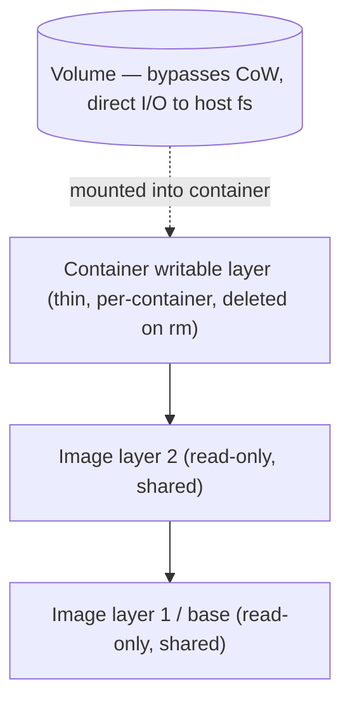

# Volumes, Bind Mounts & Data Persistence

Containers are meant to be **ephemeral and disposable** — you can `stop`, `rm`, and
recreate them at will. But real applications have state: database files, uploaded
assets, logs, caches. This topic is about the boundary between the *disposable* container
and the *durable* data it touches, and the three mechanisms Docker gives you to cross it:
**volumes**, **bind mounts**, and **tmpfs**.

The mental model: a container's own filesystem is a temporary scratchpad tied to that
container's life. Anything you want to survive `docker rm` — or share between containers,
or edit from the host — must live *outside* the container's writable layer, on a mount.

> [!KEY-TAKEAWAY]
> Data written to a container's **writable layer** dies with the container (`docker rm`).
> **Volumes** are Docker-managed storage (in `/var/lib/docker/volumes`) and are the
> **preferred** way to persist data. **Bind mounts** map an arbitrary host path in (great
> for dev/config, host-dependent). **tmpfs** keeps data in RAM (never persisted).
> Databases must use a volume, never the container layer.

---

## The ephemeral writable layer

A running container's filesystem is a stack of **read-only image layers** plus a single
thin **read-write "container layer"** on top (also called the *writable layer* or *scratch
space*). This top layer is created when the container starts and is **deleted when the
container is removed** (`docker rm`).

- Every file the process creates or modifies — logs, temp files, a database's data files —
  is written to that writable layer *unless* the path is covered by a mount.
- Stopping a container (`docker stop`) does **not** lose the writable layer; the data is
  still there when you `docker start` it again. It is only lost when the container is
  **removed** (`docker rm`, or `docker run --rm`, or `docker compose down`).

```bash
docker run --name c1 alpine sh -c 'echo hello > /data.txt'
docker start -a c1              # file still there — stop/start keeps the layer
docker rm c1                    # NOW the writable layer (and /data.txt) is gone
```

> [!WARNING]
> A very common production incident: running a database as a plain container with no
> volume. It works fine for weeks, then someone recreates the container to change an env
> var or pull a new image tag — and **all the data is gone**, because it lived in the
> writable layer. Persistent state must be on a volume.

**Why not just persist the writable layer?** Two reasons: (1) it's tied to one container's
lifecycle, so it can't be shared or survive recreation; and (2) it goes through the storage
driver's copy-on-write machinery, which is slower and less predictable for
write-heavy/random-I/O workloads (see below).

---

## Copy-on-write and why databases must not use the container layer

Image layers are read-only and shared between containers via a **copy-on-write (CoW)**
union filesystem (overlay2 on modern Linux). When a container *reads* a file, it reads it
straight from the shared image layer. When it *modifies* a file that exists in a lower
layer, the storage driver first **copies the whole file up** into the writable layer, then
applies the change there. Subsequent writes hit the copy.



Implications that interviewers probe:

- **First-write latency.** Modifying a large file triggers a full copy-up, even if you
  change one byte. For a database's data files this is exactly the wrong access pattern.
- **Storage-driver overhead.** All writable-layer I/O passes through the union filesystem,
  which is slower than native filesystem I/O for random writes and `fsync`-heavy workloads.
- **Data lives with the container.** No persistence, no sharing, no backup story.

A **volume bypasses the storage driver entirely** — I/O goes directly to the host
filesystem (or a volume driver). That's why Docker's own guidance is: put databases and
other write-heavy, persistent state on **volumes**, not the container layer.

> [!INTERVIEW]
> "Why is running Postgres on the container's writable layer a bad idea?" Hit both angles:
> **durability** (data is destroyed on `docker rm`) *and* **performance** (copy-on-write +
> union-fs overhead on random writes and fsync). A volume solves both by giving direct I/O
> to host storage and a lifecycle independent of the container.

---

## Named volumes (Docker-managed storage)

A **volume** is a storage location fully managed by the Docker daemon. On Linux, local
volumes live under `/var/lib/docker/volumes/<name>/_data`. You reference a volume by name;
you don't (and shouldn't) care about the host path.

```bash
docker volume create app-data
docker run -d --name db \
  --mount type=volume,src=app-data,dst=/var/lib/postgresql/data \
  postgres:16
```

Why volumes are the **preferred** mechanism:

- **Portable & decoupled from the host layout.** No dependency on a specific host directory
  structure existing — Docker owns the path.
- **Lifecycle independent of any container.** The volume survives `docker rm`; multiple
  containers over time can attach to the same volume.
- **Bypass copy-on-write** → better and more predictable write performance.
- **Manageable via the CLI/API** (`docker volume ...`), backup-able, and support **volume
  drivers** for NFS/cloud storage.
- **Pre-populated from the image** on first mount (see below) — handy for seeding defaults.
- **Cross-platform.** On Docker Desktop (Mac/Windows) volumes live inside the Linux VM and
  perform far better than bind mounts to the host.

> [!TIP]
> Rule of thumb: **volumes for data you need to keep** (DB files, user uploads), **bind
> mounts for data you need to see/edit on the host** (source code in dev, config files).

---

## Bind mounts

A **bind mount** maps an **arbitrary host path** directly into the container. Docker does
not manage the storage — the host filesystem does. The container sees exactly what's at
that host path, and writes go straight back to the host.

```bash
# Mount the current dir's ./src into the container for live-reload dev
docker run -d --name web \
  --mount type=bind,src="$(pwd)"/src,dst=/app/src \
  node:20 npm run dev
```

Key behaviors and gotchas:

- **Host-path dependent / not portable.** The mount only works where that exact path
  exists, so bind mounts are host-specific. This is why they're for dev and local config,
  not for portable data.
- **Missing host path:** with `-v`, Docker **auto-creates the path as a directory** if it
  doesn't exist (a classic footgun — you meant a file, you get an empty dir). With
  `--mount`, a missing source is an **error** unless you add `bind-create-src`.
- **Obscuring, not merging.** If you bind-mount onto a **non-empty** container directory,
  the mount **hides** the pre-existing container contents for as long as it's mounted (like
  mounting a USB drive over `/mnt`). Volumes, by contrast, *copy* the directory's contents
  in on first mount. This difference trips people up constantly.
- **Full host access = security risk.** By default the container can write anywhere under
  the mounted path on the host. Prefer `:ro` and never bind-mount sensitive host dirs into
  untrusted containers.

> [!WARNING]
> `docker run -v /does/not/exist:/app ...` silently creates an empty directory
> `/does/not/exist` on the host and mounts it, so your app sees an empty `/app`. If you
> expected a file or existing content, you'll get confusing "file not found" errors. Use
> `--mount` (which errors on a missing source) to catch this early.

---

## tmpfs mounts (in-memory)

A **tmpfs** mount stores data in the **host's memory (RAM)**, not on any container layer or
host disk. It is Linux-only.

```bash
docker run -d --name app \
  --mount type=tmpfs,dst=/app/cache,tmpfs-size=64m,tmpfs-mode=1770 \
  myapp:latest

# shorthand form
docker run -d --tmpfs /run:size=32m myapp:latest
```

Properties:

- **Never persisted, never shared.** Removed when the container stops; cannot be shared
  between containers. (Note: memory *can* spill to a swap file, so "purely RAM" is a slight
  simplification.)
- **Options:** `tmpfs-size` (bytes; default 50% of host RAM) and `tmpfs-mode` (octal perms;
  default `1777`).
- **Use cases:** sensitive data you never want touching disk (secrets, session tokens), or
  fast scratch space for a large volume of non-persistent temporary state.

`--tmpfs` is the shorthand; `--mount type=tmpfs,...` is the explicit form that supports all
options and is preferred for anything non-trivial.

---

## Choosing: volumes vs bind mounts vs tmpfs

| Aspect | Volume | Bind mount | tmpfs |
|---|---|---|---|
| Managed by | Docker (`/var/lib/docker/volumes`) | You / host filesystem | Kernel (RAM) |
| Source | Docker-managed path | Any host path | Memory |
| Persists after container `rm`? | **Yes** | Yes (it's on the host) | **No** |
| Portable across hosts? | Yes (recreate + restore) | No (host-path bound) | N/A |
| Populated from image on first mount? | **Yes** (copies existing dir) | No (obscures it) | No |
| Bypasses copy-on-write? | Yes | Yes | Yes (RAM) |
| Volume-driver support (NFS/cloud)? | Yes | No | No |
| Typical use | **DB data, uploads, prod state** | **Dev source, config files** | Secrets, scratch |
| OS support | All | All | Linux only |

Decision guide: **default to a named volume** for persistent data; reach for a **bind
mount** when a human on the host needs to read/edit the files (source code, config); use
**tmpfs** for data that must never hit disk.

---

## Volume lifecycle and the `docker volume` commands

Volumes have a lifecycle **independent of containers**. They are not removed when a
container that used them is removed — you delete them explicitly (or prune).

```bash
docker volume create app-data          # create explicitly
docker volume ls                        # list volumes
docker volume inspect app-data          # driver, Mountpoint, labels, options
docker volume rm app-data               # remove one (fails if a container uses it)
docker volume prune                     # remove *unused anonymous* volumes (Docker 23.0+ default)
docker volume prune -a                  # remove all unused volumes, not just anonymous
```

Notes and gotchas:

- `docker rm <container>` does **not** delete the container's named volumes. Use
  `docker rm -v <container>` to also remove its **anonymous** volumes.
- `docker volume rm` **fails** if any container (even a stopped one) still references the
  volume — remove the containers first, or use `docker rm -v`.
- **Dangling volumes** (not referenced by any container) are what `prune` targets — since
  Docker 23.0 the default prunes only *anonymous* unused volumes; add `-a`/`--all` to also
  remove unused *named* ones. Anonymous volumes are a common source of silent disk growth.
- `docker compose down` removes containers/networks but **keeps named volumes**; add
  `--volumes`/`-v` to delete them too.

---

## `-v` (`--volume`) vs `--mount` syntax

Two syntaxes do overlapping jobs. `--mount` is **explicit** (key=value pairs, order
independent) and Docker's recommended form; `-v` is a **terse, positional,
colon-separated** shorthand.

```bash
# --mount: explicit key=value, order-independent
docker run --mount type=volume,src=app-data,dst=/data,readonly ...
docker run --mount type=bind,src="$(pwd)"/cfg,dst=/etc/app,ro ...

# -v: positional [source:]destination[:options]
docker run -v app-data:/data:ro ...
docker run -v "$(pwd)"/cfg:/etc/app:ro ...
```

Differences that matter in interviews:

- **Missing source path:** `-v` **auto-creates** a missing host directory for a bind mount;
  `--mount` **errors** (safer — you notice the typo). For volumes, both create the named
  volume if it doesn't exist.
- **Feature coverage:** you **must** use `--mount` to pass **volume-driver options**, mount
  a **subdirectory** of a volume (`volume-subpath`), or mount into a **Swarm service**.
- **Disambiguating volume vs bind:** with `-v`, a source with a `/` is treated as a bind
  mount (host path); a bare name is a named volume. `--mount type=...` makes intent
  explicit and unambiguous.

> [!TIP]
> Prefer `--mount` in scripts and docs — it's self-documenting and fails loudly on typos.
> `-v` is fine for quick interactive commands. Both are functionally equivalent for the
> common case of "mount named volume X at path Y."

---

## Anonymous vs named volumes

- A **named volume** has an explicit, human-chosen name (`app-data`) and is easy to find,
  reuse, back up, and reason about.
- An **anonymous volume** gets a random 64-hex-char ID. You get one when you mount without
  a source name — e.g. `-v /data` (no `name:`), or from a Dockerfile **`VOLUME`**
  instruction — and it's hard to identify later.

```dockerfile
# Anonymous volume auto-created at container start for this path
VOLUME /var/lib/mysql
```

```bash
docker run -v /var/lib/mysql mysql:8       # anonymous volume at /var/lib/mysql
docker run -v db-data:/var/lib/mysql mysql:8  # named volume "db-data"
```

Gotchas:

- **`VOLUME` in a Dockerfile** creates a fresh **anonymous** volume for every container
  started from the image (unless you override the mount at run time). It also **freezes**
  that path: any later Dockerfile step that writes there is discarded, and you can't
  bind-mount over it as cleanly. Many teams *avoid* `VOLUME` in Dockerfiles and let the
  operator choose the mount instead.
- Anonymous volumes accumulate as **dangling** volumes and quietly eat disk; `-v` on
  `docker rm` or a periodic `docker volume prune` cleans them.
- For anything you care about, **name your volumes**.

---

## Populating a volume from image content (first-mount copy)

When you mount an **empty volume** onto a container directory that **already contains files
in the image**, Docker **copies those files into the volume** on first mount. This "seed
from image" behavior is unique to volumes.

```bash
# nginx's image ships default files at /usr/share/nginx/html.
# On first mount of an EMPTY volume, those defaults are copied into the volume.
docker run -d --name web \
  --mount src=site,dst=/usr/share/nginx/html nginx:latest
```

Rules:

- Applies **only to volumes**, and **only when the volume is empty**. If the volume already
  has data, nothing is copied and the volume's contents win.
- Disable the copy with the **`volume-nocopy`** option (`--mount ...,volume-nocopy` or
  `-v name:/path:nocopy`) if you want the volume to start empty regardless.
- **Bind mounts and tmpfs do NOT do this** — they *obscure* whatever was in the image
  directory. This is the single most common source of "my files disappeared after I added a
  mount" confusion.

---

## Read-only mounts

Any mount can be made **read-only** so the container can't modify the source — useful for
config files, static assets, and defense-in-depth.

```bash
docker run --mount type=volume,src=cfg,dst=/etc/app,readonly ...
docker run -v cfg:/etc/app:ro ...
docker run --mount type=bind,src="$(pwd)"/conf,dst=/etc/nginx,ro nginx
```

- The **same volume** can be mounted **read-write** into one container and **read-only**
  into another simultaneously.
- Verify with `docker inspect`: a read-only mount shows `"RW": false`.
- Read-only mounts pair well with a **read-only root filesystem** (`--read-only`), where the
  container's whole rootfs is immutable and only explicit volumes/tmpfs are writable — a
  security hardening pattern (see `docker-security`).

---

## Sharing volumes between containers

Multiple containers can mount the **same named volume** at the same time — the classic way
to share data (e.g. an app writing files a sidecar serves or backs up).

```bash
docker run -d --name writer -v shared:/data busybox \
  sh -c 'while true; do date >> /data/log; sleep 1; done'
docker run --rm -v shared:/data busybox cat /data/log   # reads the same data
```

`--volumes-from` copies **all mounts** of a source container into a new one — handy for
backup/admin containers without needing to know the volume names:

```bash
docker run --rm --volumes-from writer -v "$(pwd)":/backup busybox \
  tar cvf /backup/data.tar /data
```

> [!WARNING]
> Docker gives you concurrent *access*, not concurrent *safety*. Two containers writing the
> same files need application-level coordination/locking. Most databases assume **exclusive**
> access to their data directory — never point two DB containers at one volume.

---

## Permissions and UID/GID issues

Volumes and bind mounts carry **numeric UID/GID ownership**, not usernames. The container's
process runs as some UID (often non-root via `USER`), and if that UID can't write the
mounted directory, you get `permission denied`.

- **Bind mounts** keep the **host's** ownership/permissions. If the host dir is owned by
  UID 1000 but the container runs as UID 999, writes fail. Fix by aligning UIDs
  (`--user "$(id -u):$(id -g)"`), `chown`-ing the host dir, or adjusting the image's `USER`.
- **Named volumes**: on **first mount of an empty volume**, Docker initializes the volume's
  ownership/perms to match the container directory in the image — so a well-built image
  (correct `USER`/`chown`) "just works." A pre-existing/populated volume keeps its ownership.
- **Rootless Docker & user namespaces** remap container UIDs to a different host UID range,
  which shifts what the files look like on the host (see `docker-security` /
  `runtimes-oci-standards`).

> [!INTERVIEW]
> A frequent bug: "my container runs as a non-root `USER` and can't write to its bind-mounted
> data dir." The cause is UID mismatch between host-dir owner and container process UID
> (bind mounts don't remap ownership). Fixes: `chown` the host path to the container UID,
> run with `--user`, or use a named volume (which inherits the image dir's ownership on first
> init).

---

## Volume drivers (NFS, cloud, plugins)

The default **`local`** driver stores volumes on the daemon host. **Volume drivers**
(built-in options or plugins) let a volume live on **network/remote storage** — NFS, cloud
block/file storage, etc. — so data isn't tied to one host.

```bash
# NFS via the built-in local driver's mount options
docker volume create --driver local \
  --opt type=nfs \
  --opt o=addr=10.0.0.5,rw,nfsvers=4 \
  --opt device=:/exports/appdata \
  nfs-data
```

- Driver options that a driver requires can only be passed with **`--mount`** (or on
  `volume create`), not the bare `-v` form.
- Remote/networked volumes enable data to follow a container across hosts (relevant for
  clustering) and centralized backup, at the cost of network latency and a dependency on the
  storage backend's availability.
- Kubernetes generalizes this idea with CSI drivers/PersistentVolumes — mentioned here only
  as the downstream consumer; orchestration belongs to the `kubernetes` domain.

---

## Volumes in Docker Compose

Compose declares volumes under a top-level `volumes:` key and attaches them per service.
Named volumes declared here are created/managed by Compose and **survive `down`** unless you
pass `-v`.

```yaml
services:
  db:
    image: postgres:16
    volumes:
      - db-data:/var/lib/postgresql/data      # named volume (persistent)
      - ./initdb:/docker-entrypoint-initdb.d:ro # bind mount, read-only config
    tmpfs:
      - /tmp

volumes:
  db-data:                                     # managed by Compose
    # driver: local
    # driver_opts: { type: nfs, o: "addr=...", device: ":/exports/db" }
```

- Short syntax `source:target[:ro]` mirrors `-v`; long syntax (`type:/source:/target:`)
  mirrors `--mount` and is clearer for options.
- **`docker compose down`** keeps named volumes; **`docker compose down -v`** (or
  `--volumes`) removes the volumes declared in the file — a frequent "why is my data gone?"
  vs "why is my data still here?" gotcha.
- **`external: true`** references a volume created outside this Compose project (Compose
  won't create or delete it).

---

## Backing up and restoring volumes

Because a volume is just a directory Docker manages, the portable backup pattern is to run a
throwaway helper container that mounts the volume plus a bind mount for the archive, and
`tar` it.

```bash
# Back up volume "db-data" to ./db-data.tar
docker run --rm \
  -v db-data:/data:ro \
  -v "$(pwd)":/backup \
  busybox tar czf /backup/db-data.tar.gz -C /data .

# Restore into a (new) volume "db-data-restored"
docker run --rm \
  -v db-data-restored:/data \
  -v "$(pwd)":/backup \
  busybox sh -c 'cd /data && tar xzf /backup/db-data.tar.gz'
```

- `--volumes-from <container>` is the alternative when you'd rather reference a container's
  mounts than name the volume explicitly.
- **Don't just `tar` a live database volume** — you can capture an inconsistent state.
  Either quiesce/stop the DB, or use the DB's own dump tool (`pg_dump`, `mongodump`) for a
  consistent logical backup.
- For `local`-driver volumes you *can* read `/var/lib/docker/volumes/<name>/_data` directly
  on the host, but relying on that path is discouraged — go through a container so the
  approach also works with non-local drivers.

---

## Common follow-up questions

- **"Where do named volumes physically live?"** On Linux, under
  `/var/lib/docker/volumes/<name>/_data` for the `local` driver; `docker volume inspect`
  shows the `Mountpoint`. Don't depend on that path — use the volume API.
- **"What's the difference between stopping and removing a container for data?"** `stop`
  keeps the writable layer; `rm` destroys it. Volumes survive both.
- **"Does `docker rm` delete the volumes?"** No — named volumes persist. `docker rm -v`
  removes the container's *anonymous* volumes only.
- **"I added a bind mount and my app's files vanished — why?"** Bind mounts *obscure* the
  container directory; only *volumes* copy the image's existing files in (on first mount of
  an empty volume).
- **"Why does my non-root container get permission denied on a bind mount?"** UID mismatch;
  bind mounts don't remap ownership. `chown` the host dir or run with `--user`.
- **"Can two containers share a volume?"** Yes for access; you own the concurrency safety.
  Don't put two databases on one volume.
- **"How do I persist data across `docker compose down`?"** Named volumes survive `down`;
  only `down -v` deletes them.
- **"Volume vs bind mount for a database in prod?"** Named volume (or a proper networked
  volume/managed DB) — portable, CoW-bypassing, backup-able.

## References

- Docker Docs — Volumes: https://docs.docker.com/engine/storage/volumes/
- Docker Docs — Bind mounts: https://docs.docker.com/engine/storage/bind-mounts/
- Docker Docs — tmpfs mounts: https://docs.docker.com/engine/storage/tmpfs/
- Docker Docs — Storage overview & the writable layer:
  https://docs.docker.com/engine/storage/
- Docker Docs — Storage drivers / copy-on-write:
  https://docs.docker.com/engine/storage/drivers/
- Docker Docs — `docker volume` CLI: https://docs.docker.com/reference/cli/docker/volume/
- Docker Docs — Compose volumes: https://docs.docker.com/reference/compose-file/volumes/
- CIS Docker Benchmark (storage & host mount hardening): https://www.cisecurity.org/benchmark/docker
