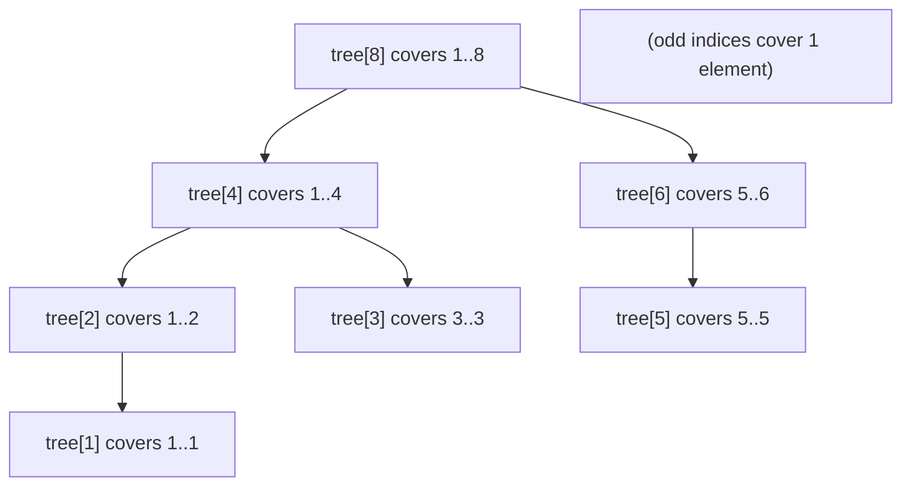
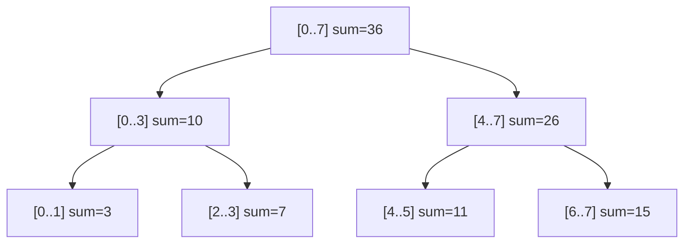
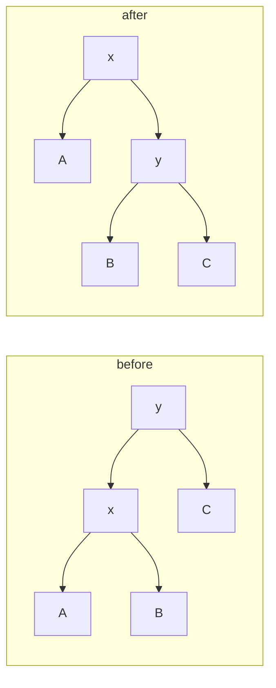

# Advanced Structures & String Algorithms

This note collects the "senior/hard" toolbox that shows up in the deeper coding rounds:
**range-query structures** (Fenwick / Binary Indexed Tree and Segment Tree, plus lazy
propagation), **balanced BSTs** at a conceptual level (AVL / red-black rotations and the
`O(log n)` guarantee they buy), and the **string-matching canon** (KMP, Rabin-Karp,
Z-algorithm, Manacher, with a nod to suffix arrays/automata).

The unifying theme is *when a plain hash map or a sort is not enough*. If you only need
membership or grouping, a `HashMap` wins. The structures here earn their complexity when
you have **many interleaved queries and updates over ranges/orderings** (Fenwick/segment
tree) or **linear-time pattern structure over strings** (KMP/Z/Manacher) where the naive
`O(n·m)` or `O(n²)` approach is too slow.

Each section leads with the internals — memory layout and per-operation complexity — then
the recognition signal and template, then gotchas.

## Fenwick tree (Binary Indexed Tree) internals

A **Fenwick tree** (Binary Indexed Tree, BIT) is a flat array `tree[1..n]` that answers
**prefix-sum queries** and **point updates** in `O(log n)`, using only `O(n)` space and a
few lines of code. It is the go-to when you need a mutable prefix-sum / cumulative-
frequency structure and nothing fancier.

The trick is that index `i` (1-based) is made **responsible for a range of values ending
at `i`**, and the *length* of that range equals the value of the **lowest set bit** of
`i`, written `i & (-i)`. So `tree[i]` stores the sum of the `lowbit(i)` elements
`a[i - lowbit(i) + 1 .. i]`.

- `lowbit(6) = lowbit(0b110) = 0b010 = 2`, so `tree[6]` covers `a[5..6]`.
- `lowbit(8) = 0b1000 = 8`, so `tree[8]` covers `a[1..8]`.
- `lowbit(7) = 1`, so `tree[7]` covers just `a[7]`.

*Why `i & (-i)` is the lowest set bit:* in two's complement, `-i` = flip every bit of
`i` then add 1. Flipping turns the lowest set bit's trailing zeros into ones; the `+1`
carries through all of them and lands exactly on that lowest set bit, leaving every
higher bit as the *complement* of `i`. AND-ing back with `i` therefore keeps only that
one bit. Example: `i = 12 = 0b…0001100`. Flip every bit → `0b…1110011`, add 1 → `0b…1110100`
(that's `-12`). AND with the original: `…0001100 & …1110100 = …0000100 = 4`, the lowest
set bit. Walking up by `i += lowbit(i)` always jumps to the
next index whose covered range *begins at or before* `i` and *extends past* it — i.e. the
smallest node that still needs `a[i]` folded in.



**Prefix sum `sum(i)`** walks *down* by stripping the lowest set bit: add `tree[i]`, then
`i -= lowbit(i)`, repeat until `i == 0`. Each step removes one bit, so at most `log n`
steps. **Point update `add(i, delta)`** walks *up*: add `delta` to `tree[i]`, then
`i += lowbit(i)`, repeat until `i > n`. A **range sum** `[l, r]` is `sum(r) - sum(l-1)`.

```java
int[] tree; int n;
void add(int i, long delta) {          // point update, 1-based
    for (; i <= n; i += i & (-i)) tree[i] += delta;
}
long sum(int i) {                       // prefix sum a[1..i]
    long s = 0;
    for (; i > 0; i -= i & (-i)) s += tree[i];
    return s;
}
long rangeSum(int l, int r) { return sum(r) - sum(l - 1); }
```

**Trace (n = 8).** Watch the index sequence make the walks concrete:

- `sum(6)`: start `i=6`, add `tree[6]` (covers `a[5..6]`); `6 - lowbit(6)=6-2 = 4`, add
  `tree[4]` (covers `a[1..4]`); `4 - lowbit(4)=4-4 = 0`, stop. Visited `6 → 4 → 0`, so
  the result is `tree[6] + tree[4] = a[5..6] + a[1..4] = a[1..6]` — exactly the prefix,
  in 2 steps.
- `add(3, δ)`: start `i=3`, `tree[3] += δ` (covers `a[3]`); `3 + lowbit(3)=3+1 = 4`,
  `tree[4] += δ` (covers `a[1..4]`); `4 + lowbit(4)=4+4 = 8`, `tree[8] += δ` (covers
  `a[1..8]`); `8 + 8 = 16 > n`, stop. Visited `3 → 4 → 8` — precisely the three nodes
  whose ranges contain index 3, so every prefix sum through 3 stays correct.

| Operation | Time | Space |
|---|---|---|
| Build (naive: n updates) | O(n log n) | O(n) |
| Build (in-place linear trick) | O(n) | O(n) |
| Point update | O(log n) | — |
| Prefix / range sum | O(log n) | — |

> [!KEY-TAKEAWAY]
> Fenwick tree = flat array where `tree[i]` owns a block of size `i & (-i)`. Query walks
> down by `i -= i&(-i)`, update walks up by `i += i&(-i)` — both `O(log n)`. It is the
> smallest-code structure for **mutable prefix sums**.

**Variations.** A BIT natively does *point-update + range-query*. With a difference-array
trick (two BITs) you can flip it to *range-update + point-query* or even *range-update +
range-query*. For 2-D prefix sums, nest a BIT inside a BIT for `O(log²n)` per op. Fenwick
trees generalize to any invertible group operation (sum, XOR) but **not** to min/max,
because you cannot "subtract" a min — for range-min with updates you need a segment tree.

## Segment tree internals and lazy propagation

A **segment tree** stores an associative function (sum, min, max, gcd, …) over array
ranges in a binary tree where each node covers a contiguous segment; leaves are single
elements and each internal node covers the union of its two children. It gives
`O(log n)` **range query** and `O(log n)` **point or range update**, at `O(n)` space
(commonly a `4n` array). Unlike a Fenwick tree it handles **non-invertible** operations
like min/max and supports **range updates** via lazy propagation.



**Layout.** The classic array-based tree puts the root at index 1; node `x` has children
`2x` and `2x+1`. A size-`4n` array safely holds every node for any `n` (the tree can be
one level deeper than a perfect tree). A **range query** recurses from the root: if a
node's segment is fully inside the query it returns its stored value; if fully outside it
returns the identity; otherwise it recurses into both children and combines. At most two
nodes are "partially covered" per level, giving `O(log n)`.

**Lazy propagation** makes *range* updates `O(log n)` instead of `O(n)`. When an update
covers a whole node's segment, you apply it to the node's aggregate and store a **pending
("lazy") marker** instead of descending to every leaf. The marker is *pushed down* to
children only when a later query/update actually needs to enter that subtree. This is
essential for "add `v` to all of `[l, r]`" or "assign `v` to all of `[l, r]`" workloads.

```
update(node, [l,r] += v):
  if node fully inside [l,r]:
    apply v to node.aggregate; node.lazy += v; return
  push_down(node)                 # flush pending lazy to both children
  recurse into overlapping children
  node.aggregate = combine(left, right)
```

| Operation | Segment tree | Fenwick tree |
|---|---|---|
| Range sum query | O(log n) | O(log n) |
| Range min/max query | O(log n) | not supported |
| Point update | O(log n) | O(log n) |
| Range update | O(log n) (lazy) | O(log n) (diff trick, sum only) |
| Space | O(n) (~4n) | O(n) |
| Code size / constant | larger | tiny, fast |

> [!TIP]
> Choose the **cheapest tool that fits**. Only prefix sums with point updates → Fenwick
> (less code, smaller constant). Range min/max, or range *assign/add* updates, or custom
> merges → segment tree, adding lazy propagation only when updates span ranges.

**Gotchas.** Off-by-one in `4n` sizing (use `4*n`, not `2*n`); forgetting to `push_down`
before recursing on a lazy tree (stale children); using a Fenwick tree for min/max
(wrong — not invertible); and building naively with `n` updates (`O(n log n)`) when the
bottom-up `O(n)` build exists.

## Balanced BSTs and rotations

A **binary search tree** keeps the invariant *left subtree < node < right subtree*, which
makes search/insert/delete `O(h)` where `h` is the height. The catch: a plain BST built
from sorted input degenerates into a linked list, `h = n`, so operations become `O(n)`.
**Self-balancing BSTs** bound `h = O(log n)` by *rotating* after mutations.

A **rotation** is a local, `O(1)` pointer rewiring that changes height while preserving
the in-order (sorted) sequence. A right rotation at `y` promotes its left child `x`:



- **AVL trees** track a per-node **balance factor** (height difference of subtrees) and
  keep it in `{-1, 0, +1}`, rebalancing with 1–2 rotations after each insert/delete. They
  are *strictly* balanced → height ≤ ~1.44 log n, so **lookups are faster**, but they may
  do more rotations on writes.
- **Red-black trees** color nodes red/black and enforce that no root-to-leaf path is more
  than twice as long as another (height ≤ 2 log(n+1)). They are *looser*, so they do
  **fewer rotations on writes** — which is why Java's `TreeMap`/`TreeSet` and C++'s
  `std::map` use them.

**When one rotation is not enough (the LR case).** A single rotation only fixes an
*outside* imbalance (left-left or right-right). If the heavy grandchild is on the
*inside*, one rotation just moves the imbalance to the other side. Concrete AVL insert:
insert `30`, then `10`, then `20`. After `20`, node `30` has balance factor `+2` (left
subtree taller) but its left child `10` has balance factor `-1` (its *right* subtree is
the heavy one) — signs disagree, so it is the **left-right (LR)** case. A plain right
rotation at `30` would promote `10` and hang `20` under it, still leaving height 2 on one
side. The fix is two rotations: first a **left rotation on the child `10`**, turning the
chain `10 → 20` into `20 → 10` so the heavy grandchild moves outside (now LL-shaped);
then a **right rotation on `30`**, giving the balanced tree with `20` at the root and
`10`, `30` as leaves. Rule of thumb: rotate first at the child whenever the node's and
child's balance-factor signs disagree, then at the node.

| Structure | Balance rule | Height bound | Best for |
|---|---|---|---|
| Plain BST | none | O(n) worst | teaching only |
| AVL | \|bf\| ≤ 1 | ~1.44 log n | read-heavy |
| Red-black | color/path rules | ≤ 2 log(n+1) | write-heavy, std libs |

| Operation | Balanced BST | Hash map |
|---|---|---|
| search / insert / delete | O(log n) | O(1) avg |
| ordered iteration | O(n) in sorted order | not ordered |
| floor / ceiling / range | O(log n) | not supported |

> [!INTERVIEW]
> You rarely *implement* a red-black tree in an interview. You must be able to say **why**
> balancing matters (avoids the `O(n)` degenerate BST), that a rotation is an `O(1)`
> pointer fix preserving in-order, and **when to reach for a tree map over a hash map**:
> when you need *ordered* operations — floor/ceiling, range scans, sorted iteration.

## KMP and the failure function

Naive substring search compares the pattern at every text position: `O(n·m)` worst case
(text length `n`, pattern length `m`), pathological on inputs like `aaa...aab`.
**Knuth–Morris–Pratt (KMP)** achieves `O(n + m)` by never re-examining a text character.
It precomputes a **failure function** (a.k.a. **LPS array** — longest proper prefix that
is also a suffix) for the pattern: `lps[i]` = length of the longest proper prefix of
`pattern[0..i]` that is also a suffix of it.

On a mismatch after matching `k` characters, instead of shifting the pattern by 1 and
restarting, KMP jumps the pattern pointer back to `lps[k-1]` — reusing the fact that the
matched prefix already overlaps itself. The text pointer never moves backward.

```java
int[] buildLps(String p) {
    int[] lps = new int[p.length()];
    int len = 0;                       // length of previous longest prefix-suffix
    for (int i = 1; i < p.length(); ) {
        if (p.charAt(i) == p.charAt(len)) lps[i++] = ++len;
        else if (len > 0) len = lps[len - 1];   // fall back, don't advance i
        else lps[i++] = 0;
    }
    return lps;
}
```

The matching loop is the payoff — the text pointer `i` only ever moves forward; on a
mismatch it is the *pattern* pointer `j` that falls back via `lps`:

```java
List<Integer> search(String t, String p) {
    int[] lps = buildLps(p);
    List<Integer> hits = new ArrayList<>();
    int j = 0;                                  // chars of p currently matched
    for (int i = 0; i < t.length(); i++) {      // i NEVER rewinds
        while (j > 0 && t.charAt(i) != p.charAt(j)) j = lps[j - 1];  // slide pattern
        if (t.charAt(i) == p.charAt(j)) j++;
        if (j == p.length()) { hits.add(i - j + 1); j = lps[j - 1]; }  // found; keep going
    }
    return hits;
}
```

**Trace `p = "abab"` (`lps = [0,0,1,2]`) over `t = "ababcabab"`:**

| `i` | `t[i]` | before | action | after `j` |
|---|---|---|---|---|
| 0 | a | `j=0` | match | `1` |
| 1 | b | `j=1` | match | `2` |
| 2 | a | `j=2` | match | `3` |
| 3 | b | `j=3` | match → `j==4`, **hit @ 0**, then `j=lps[3]=2` | `2` |
| 4 | c | `j=2` | mismatch: `j=lps[1]=0`; still `c≠a` | `0` |
| 5 | a | `j=0` | match | `1` |
| 6 | b | `j=1` | match | `2` |
| 7 | a | `j=2` | match | `3` |
| 8 | b | `j=3` | match → `j==4`, **hit @ 5** | (2) |

The critical row is `i=4`: after the first hit `j` was reset to 2, the `'c'` mismatches,
and `j` falls `2 → 0` via `lps` **while `i` stays at 4** — no text character is ever
re-read, which is what buys the `O(n + m)` bound.

For `p = "ababaca"`, `lps = [0,0,1,2,3,0,1]`. Building `lps` is `O(m)`; the scan is
`O(n)`; total `O(n + m)` time, `O(m)` space. The same LPS idea powers **Shortest
Palindrome** (build `lps` of `s + '#' + reverse(s)` to find the longest palindromic
prefix) and repeated-substring-pattern detection.

> [!KEY-TAKEAWAY]
> KMP's failure/LPS array lets the pattern **slide by more than one** on a mismatch
> without ever backing up the text pointer. Recognition signal: exact substring/pattern
> matching where naive `O(n·m)` is too slow, or any question about self-overlap of a
> string (borders, periods, palindromic prefixes).

## Rabin-Karp and rolling hash

**Rabin-Karp** turns pattern matching into hashing: compute a hash of the pattern and of
each length-`m` window of the text; where hashes match, verify with a direct comparison.
The key is a **rolling hash** — a **polynomial hash** treating the window as a base-`b`
number mod a large prime — that updates in `O(1)` when the window slides: subtract the
outgoing character's contribution, multiply by the base, add the incoming character.

Formally, a length-`m` window `c_0 c_1 … c_{m-1}` hashes to

```
h = (c_0·b^(m-1) + c_1·b^(m-2) + … + c_{m-1}·b^0)  mod p
```

and sliding one step right (drop `c_out` from the front, append `c_in`) updates it in
`O(1)`:

```
h_new = ((h_old − c_out·b^(m-1))·b + c_in)  mod p
```

**Numeric roll.** Take the string `"31415"`, base `b = 10`, prime `p = 13`, window size
`m = 3`; treat each character as its digit value.

- Window `"314"` directly: `3·10² + 1·10 + 4 = 314`; `314 mod 13 = 2` (since `13·24 = 312`).
- Roll to window `"141"`: here `c_out = 3`, `c_in = 1`, and `b^(m-1) mod p = 100 mod 13 = 9`.
  Working entirely in mod space:
  `h_new = ((2 − 3·9)·10 + 1) mod 13 = ((2 − 27)·10 + 1) mod 13 = (−25·10 + 1) mod 13 = −249 mod 13`.
  Bring the negative back into range by adding a multiple of `p`: `−249 + 260 = 11`
  (`260 = 13·20`), so `h_new = 11`.
- Cross-check directly: `"141" = 1·100 + 4·10 + 1 = 141`; `141 mod 13 = 11` (since
  `13·10 = 130`). The rolled value matches the direct value — proof the `O(1)` update is
  correct.

That intermediate `−249` is the classic pitfall: in a language where `%` can return a
negative result, you must add `p` (here `+260`) before comparing hashes, or you will miss
matches.

Average/expected time is `O(n + m)`; **worst case is `O(n·m)`** when hash collisions force
a full comparison at every position (or with an adversarial modulus). Its real strengths
are **multiple-pattern search** (hash a set of patterns) and **2-D / substring-fingerprint
problems** (e.g. "longest duplicate substring" via binary search on length + hashing).
Use a big prime modulus (or double hashing) to make collisions negligible.

| Algorithm | Preprocess | Search (avg) | Search (worst) | Note |
|---|---|---|---|---|
| Naive | — | — | O(n·m) | fine for tiny inputs |
| KMP | O(m) | O(n) | O(n) | deterministic linear |
| Rabin-Karp | O(m) | O(n+m) | O(n·m) | great for multi-pattern / fingerprints |
| Z-algorithm | — | O(n+m) | O(n+m) | prefix-match lengths |

## Z-algorithm

The **Z-array** of a string `s` gives, for each position `i`, `z[i]` = the length of the
longest substring starting at `i` that **matches a prefix** of `s`. It is computed in a
single `O(n)` left-to-right pass by maintaining a "Z-box" `[l, r]` — the rightmost
prefix-match window seen so far — and reusing previously computed values inside it instead
of recomparing.

**Worked z-array** for `s = "aabxaabxc"` (index 0-based; `z[0]` is left undefined/0 by
convention):

| i | 0 | 1 | 2 | 3 | 4 | 5 | 6 | 7 | 8 |
|---|---|---|---|---|---|---|---|---|---|
| s[i] | a | a | b | x | a | a | b | x | c |
| z[i] | – | 1 | 0 | 0 | **4** | 1 | 0 | 0 | 0 |

- `z[1]`: `s[1]=a` matches prefix `s[0]=a`; `s[2]=b ≠ s[1]=a`, stop → `1`.
- `z[4]`: `s[4..7]="aabx"` equals the prefix `s[0..3]="aabx"`; `s[8]=c ≠ s[4]=a`, stop
  → `4`. This sets the Z-box to `[l, r] = [4, 7]`.

**In-box reuse at `i = 5`** (the whole point of the linear pass): `5` sits inside the box
`[4, 7]`, so instead of comparing from scratch we copy from its mirror. The mirror index
is `i − l = 5 − 4 = 1`, and `z[1] = 1`. Since `1` is less than the remaining box width
`r − i + 1 = 7 − 5 + 1 = 3`, the mirror value is fully trusted — `z[5] = 1` with **zero
character comparisons**. (Had `z[mirror]` reached the box edge, we would resume explicit
comparison from `r + 1` outward.)

For pattern matching, run the Z-algorithm on `pattern + '#' + text`: any position where
`z[i] == m` (the pattern length) marks an occurrence of the pattern in the text. It is an
often-simpler alternative to KMP and directly answers "how long is the prefix that
repeats/matches here," useful for string-period and border problems.

## Manacher longest palindromic substring in O(n)

The naive "expand around center" approach to longest palindromic substring is `O(n²)`
(each of `2n-1` centers expands up to `O(n)`). **Manacher's algorithm** does it in `O(n)`
by transforming the string (insert separators like `#` between every character so odd and
even palindromes are handled uniformly) and reusing symmetry: it keeps the **rightmost
palindrome** `[center, right]` found so far and initializes each new position's radius
from its **mirror** across `center`, only expanding beyond what symmetry already
guarantees.

**Worked example** for `s = "aba"`. Transform to `t = "#a#b#a#"` (separators make every
palindrome odd-length, so one radius array covers both odd and even cases). The radius
`p[i]` counts how many characters match on each side of center `i` in `t`:

| i | 0 | 1 | 2 | 3 | 4 | 5 | 6 |
|---|---|---|---|---|---|---|---|
| t[i] | # | a | # | b | # | a | # |
| p[i] | 0 | 1 | 0 | **3** | 0 | 1 | 0 |

`p[3] = 3` at the center `b` means the palindrome spans `t[0..6]` = the whole string; the
real substring length is exactly `p[3] = 3`, i.e. `"aba"`. When the algorithm reaches
center `3` it sets the current box to `[center − p, center + p] = [0, 6]`, `right = 6`.
Now the mirror trick for the next centers:

- `i = 4` (**initialized from its mirror, no expansion**): mirror `= 2·center − i =
  6 − 4 = 2`, and `p[2] = 0`. Because `p[mirror] = 0` is strictly less than the room left
  in the box `right − i = 6 − 4 = 2`, symmetry guarantees `p[4] = 0` outright — copied
  from the mirror with no character comparison.
- `i = 5` (**must try to expand past the box edge**): mirror `= 6 − 5 = 1`, `p[1] = 1`,
  but the room left is only `right − i = 6 − 5 = 1`, so the mirror value reaches the box
  boundary and cannot be trusted beyond it. The algorithm seeds `p[5] = 1` and then
  attempts to grow: compare `t[5−2]=t[3]='b'` against `t[5+2]=t[7]` (out of range) — the
  expansion fails, so `p[5]` stays `1`. This is exactly the case where Manacher must fall
  back to explicit comparison instead of pure copying.

| Approach | Time | Space | Note |
|---|---|---|---|
| Brute force (all substrings) | O(n³) | O(1) | check each substring |
| Expand around center | O(n²) | O(1) | interview-default, simple |
| DP table | O(n²) | O(n²) | also yields count of palindromes |
| Manacher | O(n) | O(n) | optimal; harder to code |

> [!WARNING]
> In an interview, reach for **expand-around-center** (`O(n²)`) first for "longest
> palindromic substring" — it is easy to get right. Mention Manacher as the `O(n)`
> optimum; only code it if explicitly pushed for linear time.

## Suffix arrays and suffix automata

For heavy multi-query substring work over a *fixed* text, **suffix structures** pay off:

- A **suffix array** is the sorted array of all suffix start-indices. Built in
  `O(n log n)` (or `O(n)` with DC3/SA-IS), it supports substring search in
  `O(m log n)` via binary search, and with an **LCP array** answers longest-common-prefix
  and distinct-substring queries. It is the space-efficient, cache-friendly successor to
  the older **suffix tree** (`O(n)` build, `O(n)` space, larger constant).
- A **suffix automaton** is the minimal DFA recognizing all substrings of `s`, built
  online in `O(n)` (for constant alphabet), and is the tool of choice for "number of
  distinct substrings," "longest common substring of two strings," and substring-count
  queries.

These are rare in standard SDE loops (more common in competitive programming); knowing
*when* they apply — many substring queries against one big text — is usually enough.

## When these beat a hash map or a sort

| You need… | Reach for | Not |
|---|---|---|
| Membership / grouping / dedup | HashMap / HashSet | fancy trees |
| One-shot "is X present" | sort + binary search, or set | segment tree |
| Many range-sum queries **with updates** | Fenwick / segment tree | recompute prefix sums (`O(n)` each) |
| Range **min/max** with updates | segment tree | Fenwick (not invertible) |
| Range **assign/add** over intervals | segment tree + lazy | per-element loop (`O(n)`) |
| Ordered ops: floor/ceiling/range/sorted iter | balanced BST / TreeMap | hash map (unordered) |
| Exact substring match, big inputs | KMP / Z / Rabin-Karp | naive `O(n·m)` |
| Longest palindrome, linear time | Manacher | brute force |
| Count-of-smaller / inversions with a scan | Fenwick over ranks | nested loops (`O(n²)`) |

## Worked example count of smaller numbers after self with a BIT

Given `nums`, for each element count how many elements to its **right** are smaller. A
Fenwick tree over *value ranks* solves it in `O(n log n)`:

1. **Coordinate-compress** the values to ranks `1..k` (sort unique, map value → rank).
2. Iterate `i` from **right to left**. For each `nums[i]`, its answer is
   `sum(rank(nums[i]) - 1)` — the count of already-seen values strictly smaller.
3. Then `add(rank(nums[i]), 1)` to record this value as "seen to the right."

The BIT here is a **cumulative frequency table**: `add` marks a value present, `sum`
counts how many present values fall in a prefix of the rank space. This same
frequency-BIT template solves inversion counting and many "count smaller/greater in a
window" problems.

**Full trace on `nums = [5, 2, 6, 1]`.** Sort the distinct values `[1, 2, 5, 6]` and map
each to its rank: `1 → 1`, `2 → 2`, `5 → 3`, `6 → 4`. Now sweep right to left over an
empty BIT; `sum(rank − 1)` counts values already recorded (all of which lie to the right)
whose rank is strictly smaller:

| step | element | rank | query `sum(rank−1)` | answer | then `add(rank, 1)` — ranks now seen |
|---|---|---|---|---|---|
| 1 | `1` (i=3) | 1 | `sum(0) = 0` | **0** | {1} |
| 2 | `6` (i=2) | 4 | `sum(3) = 1` (only rank 1 seen) | **1** | {1, 4} |
| 3 | `2` (i=1) | 2 | `sum(1) = 1` (rank 1 seen; rank 4 excluded) | **1** | {1, 2, 4} |
| 4 | `5` (i=0) | 3 | `sum(2) = 2` (ranks 1 and 2 seen; rank 4 excluded) | **2** | {1, 2, 3, 4} |

Writing each answer back at its original index gives `answer = [2, 1, 1, 0]`. Note step 3:
even though rank 4 (the `6`) is already in the tree, `sum(1)` only counts the prefix up to
rank 1, so the larger value is correctly ignored — that prefix cutoff is precisely what
"smaller" means.

## Interview Problems

Grouped by the structure/technique they drill.

**Fenwick / Segment tree (range query + update)**
- [Range Sum Query - Mutable](https://leetcode.com/problems/range-sum-query-mutable/) — Medium — canonical Fenwick/segment tree: point update + range sum
- [Range Sum Query 2D - Mutable](https://leetcode.com/problems/range-sum-query-2d-mutable/) — Hard — 2-D BIT, `O(log²n)` per op
- [Count of Smaller Numbers After Self](https://leetcode.com/problems/count-of-smaller-numbers-after-self/) — Hard — Fenwick over value ranks (frequency BIT)
- [Reverse Pairs](https://leetcode.com/problems/reverse-pairs/) — Hard — BIT / merge-sort inversion counting
- [The Skyline Problem](https://leetcode.com/problems/the-skyline-problem/) — Hard — segment tree / sweep with heap
- [Falling Squares](https://leetcode.com/problems/falling-squares/) — Hard — segment tree with range-assign lazy propagation

**Binary search / immutable range queries (contrast with the above)**
- [Range Sum Query - Immutable](https://leetcode.com/problems/range-sum-query-immutable/) — Easy — plain prefix-sum array, no structure needed

**KMP / string matching**
- [Implement strStr()](https://leetcode.com/problems/implement-strstr/) — Easy — KMP failure function for `O(n+m)` match
- [Shortest Palindrome](https://leetcode.com/problems/shortest-palindrome/) — Hard — KMP LPS on `s + '#' + reverse(s)`
- [Repeated Substring Pattern](https://leetcode.com/problems/repeated-substring-pattern/) — Easy — KMP LPS reveals the period
- [Find the Index of the First Occurrence in a String](https://leetcode.com/problems/find-the-index-of-the-first-occurrence-in-a-string/) — Easy — substring search (KMP/Z/Rabin-Karp)

**Rolling hash / Rabin-Karp**
- [Longest Duplicate Substring](https://leetcode.com/problems/longest-duplicate-substring/) — Hard — binary search on length + rolling hash
- [Repeated DNA Sequences](https://leetcode.com/problems/repeated-dna-sequences/) — Medium — fixed-window rolling hash / bitmask

**Palindromes (Manacher / expand-around-center)**
- [Longest Palindromic Substring](https://leetcode.com/problems/longest-palindromic-substring/) — Medium — expand-around-center `O(n²)`, Manacher `O(n)`
- [Palindromic Substrings](https://leetcode.com/problems/palindromic-substrings/) — Medium — count via expand-around-center / Manacher

**Monotonic-structure sliding window (a common alternative to segment trees)**
- [Sliding Window Maximum](https://leetcode.com/problems/sliding-window-maximum/) — Hard — monotonic deque `O(n)` (beats a heap/segment tree here)

## Common follow-up questions

- "Fenwick or segment tree here?" If the query is a prefix/range **sum** with point
  updates, Fenwick (smaller code, better constant). If you need range min/max, custom
  merges, or range *assign/add* updates → segment tree (add lazy propagation for range
  updates).
- "Why can't a Fenwick tree do range minimum?" Prefix decomposition relies on
  *subtracting* one prefix from another; min has no inverse, so `sum(r) - sum(l-1)` has no
  min analogue. Segment trees combine children directly and need no inverse.
- "What does the LPS/failure array actually store?" For each prefix, the length of the
  longest proper prefix that is also a suffix (the longest *border*). It encodes how far
  the pattern can safely slide on a mismatch.
- "Rabin-Karp is O(n+m) average but what's the worst case, and why?" `O(n·m)`, when
  hash collisions (or an adversarial modulus) force a full character comparison at every
  window; mitigate with a large prime modulus or double hashing.
- "Why is a balanced BST worse than a hash map for lookup but sometimes preferred?"
  Hash map is `O(1)` average but unordered; a balanced BST is `O(log n)` but supports
  floor/ceiling, range queries, and in-order (sorted) traversal.
- "AVL vs red-black — when does each win?" AVL is more strictly balanced → faster
  lookups (read-heavy); red-black does fewer rotations per write (write-heavy), which is
  why standard libraries use it.
- "Longest palindromic substring in linear time?" Manacher's algorithm — `O(n)` via
  the transformed string and mirror-symmetry radius reuse; expand-around-center is the
  `O(n²)` interview default.

## References

- Cormen, Leiserson, Rivest, Stein, *Introduction to Algorithms* (CLRS), 3rd/4th ed. —
  red-black trees & rotations (Ch. 13), string matching / KMP (Ch. 32), augmenting data
  structures.
- Fenwick, P., "A New Data Structure for Cumulative Frequency Tables," *Software: Practice
  and Experience*, 1994 — the original Binary Indexed Tree.
- Knuth, Morris, Pratt, "Fast Pattern Matching in Strings," *SIAM J. Computing*, 1977.
- Karp, R. & Rabin, M., "Efficient randomized pattern-matching algorithms," 1987.
- Manacher, G., "A new linear-time on-line algorithm for finding the smallest initial
  palindrome of a string," *JACM*, 1975.
- CP-Algorithms (cp-algorithms.com) — Fenwick tree, segment tree with lazy propagation,
  Z-function, prefix function/KMP, Manacher, suffix array/automaton (implementations &
  proofs).
- Sedgewick & Wayne, *Algorithms*, 4th ed. — balanced BSTs, string algorithms.
