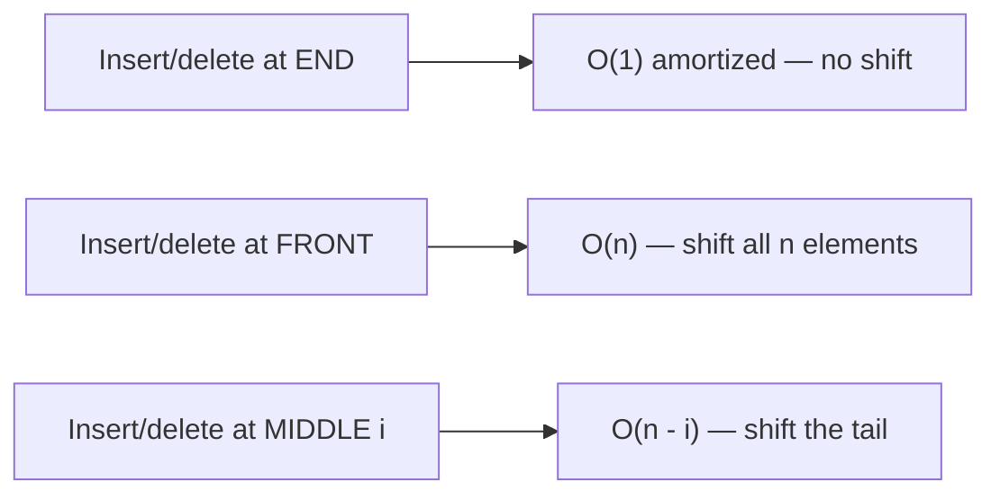

# Arrays, Strings & Hashing

Arrays and strings are the substrate of almost every coding interview, and **hashing**
is the single most reused technique for turning an `O(n^2)` brute force into `O(n)`.
This topic covers how arrays actually live in memory, why dynamic arrays are "amortized
O(1)", why strings are immutable in Java/Python (and the concat trap that follows), and
the recognition signals for reaching for a hash map or hash set.

> [!KEY-TAKEAWAY]
> If a brute force scans pairs or repeatedly asks "have I seen X?" / "does the
> complement exist?" / "how many of each?", a **hash map or set almost always
> collapses it to a single linear pass**, trading `O(n)` space for `O(n)` time.

## Arrays and contiguous memory

An array is a **fixed-size block of contiguous memory** holding elements of the same
type (or same-width references). Because element `i` lives at a computable address, any
index is reachable in constant time:

```
address(a[i]) = base_address + i * element_size
```

This one formula explains every array property:

| Operation | Time | Why |
|---|---|---|
| Access / update by index `a[i]` | `O(1)` | Direct address arithmetic |
| Search by value (unsorted) | `O(n)` | Must scan |
| Search by value (sorted) | `O(log n)` | Binary search |
| Insert / delete at **end** (fixed capacity left) | `O(1)` | No shifting |
| Insert / delete at **middle/front** | `O(n)` | Must shift the tail |
| Space | `O(n)` | Contiguous block |

Contiguity also gives arrays excellent **cache locality**: neighboring elements sit on
the same cache line, so linear scans are far faster in practice than the same scan over
a pointer-chasing linked list, even though both are `O(n)` asymptotically.

> [!TIP]
> "Contiguous + fixed element size" is the whole story. When an interviewer asks why
> array access is `O(1)` but linked-list access is `O(n)`, the answer is address
> arithmetic vs. pointer traversal.

## Dynamic arrays and amortized resizing

A raw array has a fixed capacity. A **dynamic array** (Java `ArrayList`, Python `list`,
C++ `std::vector`, Go slice) wraps a backing array plus a `size` counter and grows
automatically. The mechanics:

- Keep a backing array of some `capacity >= size`.
- `append` writes to `a[size]` and increments `size` — `O(1)` while there is room.
- When `size == capacity`, allocate a **larger** array (typically `1.5x` or `2x`),
  copy all existing elements over (`O(n)`), then append.

Occasional copies are `O(n)`, so how is append "O(1)"? **Amortized analysis.** With
geometric growth (say doubling), `n` appends trigger copies of sizes
`1, 2, 4, ..., n`, and that geometric series sums to `< 2n`. Spreading `~2n` total work
across `n` appends gives **`O(1) amortized`** per append.

> [!WARNING]
> Growth must be **geometric (multiplicative)**, not additive. If you grew by a fixed
> `+k` each time, the copies would sum to `O(n^2)` total — amortized `O(n)` per append.
> This is exactly why doubling matters.

Language notes:
- **Java** `ArrayList` grows by `~1.5x` (`oldCapacity + (oldCapacity >> 1)`).
- **Python** `list` over-allocates by a mild growth pattern (roughly `1.125x` plus a
  constant); `CPython` also shrinks in some paths.
- **`ArrayList.remove(i)`** and inserting mid-array are `O(n)` because of the shift, even
  though the structure is dynamic. Dynamic only helps the *end*.

```java
ArrayList<Integer> a = new ArrayList<>();
a.add(7);        // amortized O(1)
a.add(1, 9);     // O(n): shifts everything from index 1 rightward
a.remove(0);     // O(n): shifts everything left
```

## Insertion and deletion complexity

The cost of changing an array is dominated by **how many elements must shift**:



Common interview consequence: building a result by repeatedly **inserting at the front**
of an array/list is `O(n^2)`. Instead, append to the end and **reverse once** at the end
(`O(n)`), or write into a preallocated array from the back. This is a frequent hidden
quadratic in "build the answer in order" problems.

## Strings and immutability

In both **Java** and **Python**, `String`/`str` objects are **immutable** — the character
data cannot be changed after construction. Any "modification" allocates a **new** string.

Why immutability exists: safe sharing across threads without locks, safe use as hash-map
keys (the hash can be cached and never goes stale), and string interning/deduplication.

The classic trap — **concatenation in a loop**:

```java
// O(n^2): each += builds a whole new String, copying all prior chars
String s = "";
for (String w : words) s += w;

// O(n): StringBuilder mutates a resizable char[] buffer, amortized O(1) per append
StringBuilder sb = new StringBuilder();
for (String w : words) sb.append(w);
String s = sb.toString();
```

```python
# O(n^2) if done naively in a loop with +=
# Prefer join, which computes total length once and copies each char once -> O(n)
s = "".join(words)
```

| Task | Wrong (quadratic) | Right (linear) |
|---|---|---|
| Build a string in a loop | `s += piece` repeatedly | Java `StringBuilder`, Python `"".join(...)` |
| Random-access char edits | new string per edit | convert to `char[]` / `list`, mutate, join |
| Compare/hash keys | recompute repeatedly | immutable strings cache their hashCode |

> [!WARNING]
> "String vs char" bugs: Java `char` is a 16-bit primitive; `'a' + 'b'` is **int
> arithmetic** (195), not `"ab"`. Indexing a Java String gives a `char`; indexing a
> Python `str` gives a length-1 `str`. Know which your language returns before comparing.

## The hashing technique for O(1) lookups

A **hash map** (dictionary) stores key→value with **average `O(1)`** insert/lookup/delete
by hashing the key to a bucket index. A **hash set** is the same structure storing keys
only (in Java, `HashSet` is literally a `HashMap` with a dummy shared value). The deep
internals — buckets, collisions, load factor, resize/rehash, treeification, and the
`O(n)` worst case — live in the dedicated **Hash Tables** topic; here we focus on hashing
as a **problem-solving technique**.

The four hashing patterns that solve the majority of array/string problems:

| Pattern | You keep in the map | Recognition signal | Example |
|---|---|---|---|
| **Frequency map** | value → count | "count / most frequent / anagram / dedupe by count" | Valid Anagram, Top K Frequent |
| **Seen-set** | values already visited | "any duplicate? / has it appeared?" | Contains Duplicate |
| **Complement lookup** | value → index | "find a **pair** summing/matching to a target" | Two Sum |
| **Group-by-key** | canonical key → list | "group items that share a property" | Group Anagrams |

**Complement lookup — Two Sum in one pass** (the canonical example):

```python
def two_sum(nums, target):
    seen = {}                     # value -> index
    for i, x in enumerate(nums):
        need = target - x
        if need in seen:          # O(1) average
            return [seen[need], i]
        seen[x] = i
    return []
```

Brute force checks every pair (`O(n^2)`). By storing each number's index and asking "have
I already seen the complement `target - x`?", we answer in `O(1)` per element → **`O(n)`
time, `O(n)` space**. That space-for-time trade is the essence of hashing.

**Group Anagrams — group-by-canonical-key:**

```python
def group_anagrams(strs):
    groups = {}
    for s in strs:
        key = "".join(sorted(s))   # or a 26-count tuple; anagrams share this key
        groups.setdefault(key, []).append(s)
    return list(groups.values())
```

> [!INTERVIEW]
> When you catch yourself writing a nested loop to compare each element against the
> others, pause and ask: "What could I store in a hash map on the first pass so the
> second lookup is O(1)?" That reframing is what interviewers are testing.

Two subtleties worth stating out loud in an interview:
- Hash-map operations are `O(1)` **average / amortized**, not worst case. Adversarial or
  pathological keys can degrade to `O(n)` per op (mitigated by randomized hashing and, in
  Java 8+, by treeifying long buckets to `O(log n)`).
- A hash map/set is **unordered**. If you need sorted order or range queries, you want a
  tree-based map (`TreeMap` / balanced BST) at `O(log n)`, not a hash map.

## In-place array techniques

Many problems demand `O(1)` extra space, which means mutating the input array itself.
Core in-place idioms:

- **Two pointers / read-write index** — a `write` pointer trails a `read` pointer to
  compact/filter in place (remove duplicates from a sorted array, move zeros to the end).
- **Swap to sort/partition** — Dutch-national-flag partitioning, cyclic sort (place value
  `v` at index `v`) to find missing/duplicate numbers in `O(1)` space.
- **Reverse tricks** — rotate an array by `k` via three reversals; reverse words in place.
- **Sign / index-as-hashset encoding** — mark "value `i` seen" by negating `a[abs(v)]`,
  using the array's own sign bits as a set without extra space.

**Product of Array Except Self** (no division, `O(1)` extra output-only space) uses
prefix/suffix passes writing into the result array:

```python
def product_except_self(nums):
    n = len(nums)
    res = [1] * n
    prefix = 1
    for i in range(n):            # res[i] = product of everything to the LEFT
        res[i] = prefix
        prefix *= nums[i]
    suffix = 1
    for i in range(n - 1, -1, -1): # multiply in product of everything to the RIGHT
        res[i] *= suffix
        suffix *= nums[i]
    return res
```

## 2D arrays and matrices

A 2D array is usually stored as a single contiguous block in **row-major order** (C,
Java's conceptual model, NumPy default): `address(a[r][c]) = base + (r * numCols + c) *
element_size`. This is why iterating **row by row** is cache-friendly and column-by-column
is not.

- Java's `int[][]` is actually an **array of row arrays** (jagged) — rows can differ in
  length and are separately allocated, so it is not strictly one contiguous block.
- Common index math: flatten `(r, c) -> r * cols + c`; unflatten `idx -> (idx / cols,
  idx % cols)`.
- Traversal patterns: 4-directional neighbors `[(1,0),(-1,0),(0,1),(0,-1)]`, spiral order,
  diagonal traversal, and in-place rotation (transpose then reverse each row for 90°).

> [!TIP]
> Always guard matrix traversals with bounds checks `0 <= r < rows && 0 <= c < cols`
> **before** dereferencing — out-of-bounds on grids is the #1 source of runtime errors.

## Common gotchas

- **Off-by-one.** Prefer half-open ranges `[lo, hi)`; `hi - lo` is the length. Be explicit
  about whether loop bounds are inclusive.
- **Integer overflow.** `mid = (lo + hi) / 2` can overflow in fixed-width languages; use
  `lo + (hi - lo) / 2`. Sums of large arrays may exceed 32-bit `int` — use `long`.
  (Python ints are arbitrary precision, so overflow is a *Java/C++* concern, not Python.)
- **Aliasing.** In Python, `[[0]*n]*m` creates `m` references to the **same** inner list;
  mutating one row mutates all. Use `[[0]*n for _ in range(m)]`.
- **String vs char.** See the immutability section — know what indexing returns and that
  `char` math is integer math in Java.
- **Empty / single-element inputs.** Confirm behavior for `[]`, `[x]`, and all-equal
  arrays before coding the general case.
- **Mutating while iterating.** Removing from a list inside a `for` over that same list
  skips elements or throws `ConcurrentModificationException` (Java).

## Interview Problems

Canonical LeetCode problems this topic drills (array manipulation, string handling, and
the hashing technique). Grouped by difficulty.

**Easy**
- [Two Sum](https://leetcode.com/problems/two-sum/) — Easy — hash map for `O(n)` complement lookup
- [Valid Anagram](https://leetcode.com/problems/valid-anagram/) — Easy — frequency map / char-count comparison
- [Contains Duplicate](https://leetcode.com/problems/contains-duplicate/) — Easy — seen-set membership
- [Two Sum II - Input Array Is Sorted](https://leetcode.com/problems/two-sum-ii-input-array-is-sorted/) — Easy — two pointers on a sorted array (no hashing needed)
- [Best Time to Buy and Sell Stock](https://leetcode.com/problems/best-time-to-buy-and-sell-stock/) — Easy — single-pass running minimum
- [Move Zeroes](https://leetcode.com/problems/move-zeroes/) — Easy — in-place read/write two-pointer compaction
- [Remove Duplicates from Sorted Array](https://leetcode.com/problems/remove-duplicates-from-sorted-array/) — Easy — in-place write index

**Medium**
- [Group Anagrams](https://leetcode.com/problems/group-anagrams/) — Medium — group-by-canonical-key hash map
- [Top K Frequent Elements](https://leetcode.com/problems/top-k-frequent-elements/) — Medium — frequency map + bucket sort / heap
- [Product of Array Except Self](https://leetcode.com/problems/product-of-array-except-self/) — Medium — prefix/suffix passes, no division
- [Longest Consecutive Sequence](https://leetcode.com/problems/longest-consecutive-sequence/) — Medium — hash set for `O(n)` sequence walking
- [Subarray Sum Equals K](https://leetcode.com/problems/subarray-sum-equals-k/) — Medium — prefix-sum counts in a hash map
- [Longest Substring Without Repeating Characters](https://leetcode.com/problems/longest-substring-without-repeating-characters/) — Medium — sliding window + last-seen map
- [Set Matrix Zeroes](https://leetcode.com/problems/set-matrix-zeroes/) — Medium — in-place `O(1)`-space marking on a matrix
- [Rotate Image](https://leetcode.com/problems/rotate-image/) — Medium — in-place matrix transpose + reverse

**Hard**
- [First Missing Positive](https://leetcode.com/problems/first-missing-positive/) — Hard — index-as-hashset / cyclic placement in `O(1)` space

## Common follow-up questions

- **Why is dynamic-array append amortized `O(1)`, and why must growth be geometric?**
  Geometric growth makes total copy work a convergent geometric series (`< 2n`); additive
  growth makes it `O(n^2)`.
- **Why are hash-map operations `O(1)` average but `O(n)` worst case?** Average assumes a
  good hash spreading keys evenly; collisions/adversarial keys pile into one bucket. (Deep
  dive in the Hash Tables topic.)
- **When would you NOT use a hash map even though lookups are `O(1)`?** When you need
  ordering, range queries, or worst-case guarantees — use a balanced BST/`TreeMap`
  (`O(log n)`); or when `n` is tiny and constant factors/memory dominate.
- **How do you solve Two Sum if the array is sorted?** Two pointers from both ends —
  `O(n)` time, `O(1)` space, no hashing.
- **Why is `s += x` in a loop `O(n^2)` and how do you fix it?** Immutable strings copy on
  every concat; use `StringBuilder` / `"".join`.
- **How do you achieve `O(1)` extra space?** In-place two pointers, swapping, reversal
  tricks, or sign-bit / cyclic-sort encoding using the input array itself.

## References

- Cormen, Leiserson, Rivest, Stein — *Introduction to Algorithms* (CLRS), 3rd/4th ed.:
  dynamic tables & amortized analysis (Ch. 17), hash tables (Ch. 11).
- Sedgewick & Wayne — *Algorithms*, 4th ed.: resizing arrays, hashing.
- Oracle Java docs — `ArrayList`, `String`, `StringBuilder`, `HashMap`, `HashSet` API.
- CPython docs & source — `listobject.c` over-allocation, `str` immutability (Python data model).
- LeetCode — the problems linked above (canonical array/string/hashing set).
